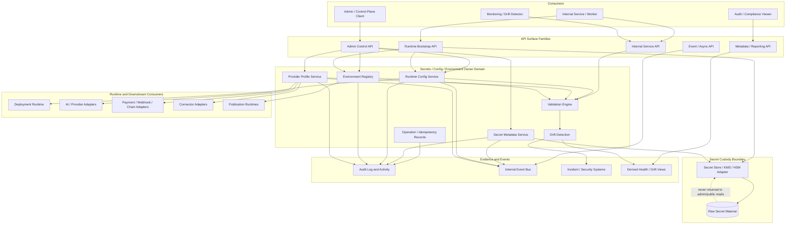
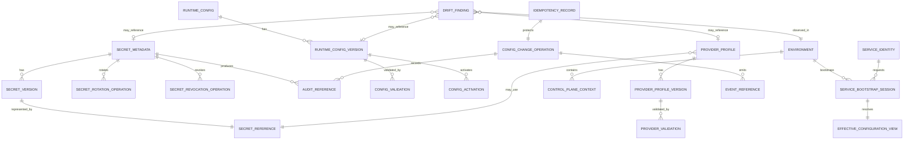
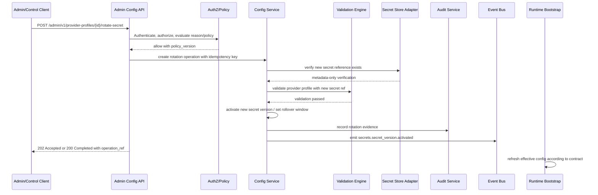
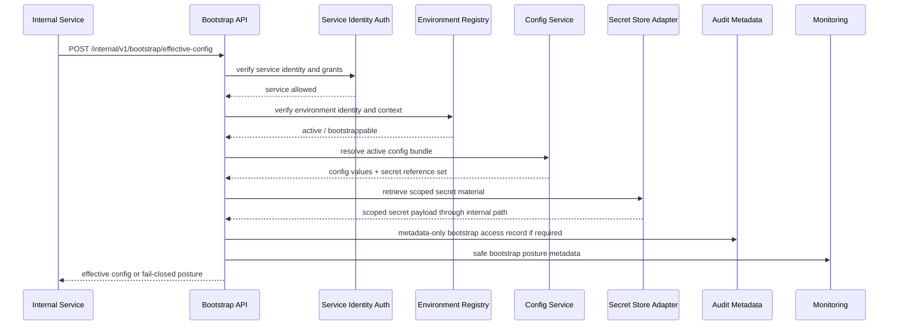

# FUZE Secrets, Configuration, and Environment API Specification

## Document Metadata

- **Document Name:** `SECRETS_CONFIG_AND_ENVIRONMENT_API_SPEC.md`
- **Document Type:** FUZE API SPEC v2 / Production-grade interface-contract specification
- **Status:** Draft production API specification
- **Version:** 2.0.0
- **Effective Date:** 2026-04-24
- **Last Updated:** 2026-04-24
- **Reviewed On:** 2026-04-24
- **Document Owner:** FUZE Platform Security, Runtime Configuration, and Secrets Governance Domain
- **Approval Authority:** FUZE Platform Architecture and Specification Governance Authority; formal named approval workflow not yet attached
- **Review Cadence:** Quarterly and whenever shared provider posture, service identity posture, environment topology, chain references, publication controls, AI/provider routing posture, sensitive runtime controls, incident-response posture, or secret/config implementation architecture materially changes
- **Governing Layer:** API contract layer derived from the refined system-spec layer
- **Parent Registry:** `API_SPEC_INDEX.md`
- **Upstream Semantic Registry:** `REFINED_SYSTEM_SPEC_INDEX.md`
- **Upstream API Registry:** `API_SPEC_INDEX.md`
- **Primary Audience:** Backend engineering, platform engineering, security engineering, SRE/runtime operations, integration engineering, AI platform engineering, workflow/runtime engineering, data engineering, audit/compliance, support/control-plane operators, API authors, OpenAPI/AsyncAPI authors, implementation-contract authors
- **Primary Purpose:** Define production-grade API contracts for managing FUZE secret metadata, secret references, runtime configuration records, provider profiles, environment registrations, effective configuration views, validation, rotation, revocation, quarantine, runtime bootstrap, drift detection, and operator-safe metadata without exposing raw secret values or allowing configuration APIs to become shadow policy truth.
- **Primary Upstream References:**
  - `REFINED_SYSTEM_SPEC_INDEX.md`
  - `SECRETS_CONFIG_AND_ENVIRONMENT_SPEC.md`
  - `SECURITY_AND_RISK_CONTROL_SPEC.md`
  - `AUDIT_LOG_AND_ACTIVITY_SPEC.md`
  - `AUDIT_AND_ACCESS_TRACEABILITY_SPEC.md`
  - `MONITORING_ALERTING_AND_INCIDENT_RESPONSE_SPEC.md`
  - `DEPLOYMENT_AND_RUNTIME_OPERATIONS_SPEC.md`
  - `BUSINESS_CONTINUITY_AND_RECOVERY_SPEC.md`
  - `DATA_CLASSIFICATION_AND_HANDLING_SPEC.md`
  - `DATA_RETENTION_DELETION_AND_ARCHIVAL_SPEC.md`
  - `INTERNAL_SERVICE_API_SPEC.md`
  - `EVENT_MODEL_AND_WEBHOOK_SPEC.md`
  - `IDEMPOTENCY_AND_VERSIONING_SPEC.md`
  - `MIGRATION_AND_BACKWARD_COMPATIBILITY_SPEC.md`
  - `FEATURE_FLAG_AND_ROLLOUT_CONTROL_SPEC.md`
  - `INTEGRATION_CONNECTOR_FRAMEWORK_SPEC.md`
  - `PUBLIC_CONTRACT_AND_WALLET_REGISTRY_SPEC.md`
  - `FUZE_ACCOUNT_ACCESS_AND_SESSION_THESIS_FINAL_SPEC.md`
  - `FUZE_ACCOUNT_ACCESS_AND_SESSION_CANONICAL_FINAL_SPEC.md`
  - `FUZE_WORKSPACE_ACCESS_CONTROL_BASICS_THESIS_FINAL_SPEC.md`
- **Primary Downstream Dependents:**
  - secret-store / KMS / HSM adapter contracts
  - runtime bootstrap contracts
  - service deployment contracts
  - provider adapter configuration contracts
  - AI provider routing implementation contracts
  - payment-provider and webhook-signing secret contracts
  - chain RPC / registry publication configuration contracts
  - admin/control-plane tooling
  - monitoring and drift-detection implementation contracts
  - OpenAPI / AsyncAPI / SDK derivation layers
- **API Surface Families Covered:** internal service APIs, admin/control-plane APIs, runtime bootstrap APIs, event/async APIs, reporting/read-model APIs, implementation-facing APIs
- **API Surface Families Excluded:** direct public raw-secret APIs, public mutation APIs, unrestricted partner APIs, frontend secret-value APIs, generic infrastructure shell APIs
- **Canonical System Owner(s):** FUZE Platform Security, Runtime Configuration, and Secrets Governance Domain
- **Canonical API Owner:** FUZE Platform API Architecture Domain in coordination with the FUZE Secrets, Configuration, and Environment Governance Domain
- **Supersedes:** Earlier weaker API interpretations that exposed provider configuration as admin metadata only, allowed ad hoc environment-variable editing, permitted raw secret disclosure, treated config as business policy truth, or allowed unbounded provider credential changes outside reason-coded audit lineage
- **Superseded By:** Not yet known
- **Related Decision Records:** Not yet known
- **Canonical Status Note:** This API spec is canonical for interface-contract expression only. `SECRETS_CONFIG_AND_ENVIRONMENT_SPEC.md` owns semantic truth for secret custody, configuration posture, environment identity, validation, rotation, revocation, and safe degraded behavior. This API spec MUST NOT redefine that semantic layer.
- **Implementation Status:** Normative API-contract baseline for downstream implementation
- **Approval Status:** Draft for architecture/API review
- **Change Summary:** Created API SPEC v2 production-grade contract for FUZE secrets, runtime configuration, and environment posture. Expanded older provider-admin API ideas into a full FUZE interface family covering secret metadata, secret references, provider profiles, environment registry, configuration records, effective config, validation, rotation, revocation, drift, admin quarantine, events, audit, idempotency, migration, diagrams, acceptance criteria, and tests.

## Purpose

This specification defines the FUZE API contract posture for secrets, runtime configuration, provider configuration, and environment identity.

It exists because secrets and configuration are runtime trust inputs. They can determine which payment provider is called, which AI provider receives a request, which webhook secret signs an outbound delivery, which chain RPC is used, which publication endpoint is active, which worker can consume which queue, and which control-plane context may execute a sensitive action. These interfaces therefore MUST be governed as production control surfaces, not as generic configuration CRUD.

The API layer expresses the refined system semantics in implementation-usable contract form. It defines route/resource families, request and response expectations, error classes, idempotency requirements, audit lineage, event behavior, access controls, migration posture, and implementation guardrails. It does not define raw secret-store internals, cloud-vendor mechanics, per-service environment variable names, or the semantic meaning of business policies that consume configuration.

## Scope

This API spec governs:

- creation and management of secret metadata records
- creation and management of secret references without raw secret readback
- secret rotation, rollover, expiration, revocation, quarantine, and retirement workflows
- versioned non-secret runtime configuration records
- policy-bound runtime configuration records where the API must preserve owner-domain boundaries
- provider profiles for AI, payments, storage, notifications, analytics, chain/RPC, connectors, identity, webhook dispatch, and publication systems
- environment registry and environment identity posture
- restricted control-plane context registration and lifecycle state
- service bootstrap and effective configuration views
- runtime validation and drift-detection APIs
- operator-safe read models and metadata exports
- admin/control-plane mutation APIs for trust-sensitive configuration changes
- internal service APIs for runtime bootstrap and scoped secret/config retrieval
- event families emitted after committed config/secret/environment lifecycle changes
- audit, traceability, observability, idempotency, rate-limit, migration, and compatibility posture

## Out of Scope

This API spec does not define:

- raw secret value readback APIs
- unrestricted public APIs for secrets/configuration
- exact KMS/HSM/cloud-provider API calls
- exact CI/CD implementation steps
- exact database DDL for every record
- exact per-service config key schemas
- final feature-flag evaluation semantics
- final governance, treasury, payout, or business-policy semantics
- exact incident runbook steps
- exact UI layout for admin consoles
- arbitrary infrastructure shell access

Those concerns belong to downstream implementation-contract specs, runtime operations specs, secret-store adapter specs, feature-flag specs, security/risk specs, or owner-domain specs.

## Design Goals

1. Provide stable API contracts for secret metadata, secret references, runtime configuration, provider profiles, and environment identity.
2. Prevent raw secret leakage through read APIs, logs, events, webhooks, dashboards, and error bodies.
3. Preserve separation between secret/config runtime truth and business, policy, ledger, governance, entitlement, rollout, public registry, and presentation truth.
4. Make trust-sensitive mutation paths idempotent, reason-coded, policy-constrained, and auditable.
5. Support safe validation, activation, rotation, rollover, revocation, quarantine, rollback, and retirement.
6. Allow services and workers to bootstrap from explicit, validated, environment-aware inputs.
7. Provide operator-safe effective configuration visibility without exposing secret values.
8. Support monitoring, drift detection, incident response, and business-continuity handoff.
9. Reduce product-local and provider-local configuration drift.
10. Provide guardrails strong enough for OpenAPI, AsyncAPI, SDK, and implementation-contract derivation.

## Non-Goals

- This API does not become a secret vault UI that can reveal raw production credentials.
- This API does not become a generic shell for editing infrastructure state.
- This API does not let deployment variables redefine business or governance truth.
- This API does not make provider health, payment truth, AI metering truth, chain truth, or public registry truth canonical.
- This API does not allow public clients, ordinary frontend clients, or product-local operators to manage high-sensitivity runtime trust inputs.
- This API does not replace incident, runtime, deployment, feature-flag, connector, event, or owner-domain APIs.

## Core Principles

### 1. Metadata-Only Secret Read Principle
APIs MAY expose secret metadata, status, version references, rotation posture, and safe fingerprints. APIs MUST NOT expose raw secret values after initial governed intake, and initial intake MUST be write-only.

### 2. Runtime Trust Input Principle
Secrets and runtime configuration are inputs to runtime behavior. They do not own the semantic meaning of the actions that consume them.

### 3. Environment-Bound Authority Principle
Every secret reference, config record, provider profile, and service bootstrap response MUST be bound to a declared environment and approved control context.

### 4. Least-Privilege Retrieval Principle
Runtime services MAY retrieve only the secret/config references required for their own service identity, environment, domain role, and execution context.

### 5. Policy-Separation Principle
Business policy, governance policy, ledger state, payout rules, entitlement truth, and rollout semantics MUST NOT be hidden in generic config records when those concepts belong to owner domains.

### 6. Validation-Before-Activation Principle
Trust-sensitive config or provider-profile changes MUST pass declared validation before activation unless a policy-approved emergency containment path narrows behavior rather than broadening it.

### 7. Rotation-Is-Normal Principle
Secret rotation, rollover, and revocation are first-class API workflows, not manual exceptions.

### 8. Operator-Control Discipline Principle
Admin/control-plane APIs MUST be separated from ordinary service bootstrap and product read APIs. High-impact actions require reason codes, policy references, and audit lineage.

### 9. Safe Degraded Behavior Principle
If required trust inputs are missing, stale, invalid, or inconsistent, APIs and runtimes MUST fail closed, hold, quarantine, or degrade explicitly rather than continue silently.

### 10. Projection Subordination Principle
Dashboards, effective-config views, health summaries, and drift reports are projections. They MUST NOT become mutation owners.

## Canonical Definitions

- **Secret:** Sensitive value or material whose disclosure, misuse, replay, or substitution could materially increase platform risk.
- **Secret Metadata Record:** Durable metadata about a secret, excluding the raw secret value.
- **Secret Reference:** Opaque reference by which authorized runtimes retrieve secret material from an approved custody system.
- **Secret Version:** Versioned instance of secret material or an opaque version reference tracked for rotation and rollover.
- **Runtime Configuration Record:** Versioned non-secret or governed configuration consumed by services, workers, or provider adapters.
- **Provider Profile:** A configuration object describing how a provider integration is selected, validated, enabled, disabled, or retired.
- **Environment Registry Entry:** A canonical record describing a known FUZE execution environment and trust posture.
- **Restricted Control-Plane Context:** A narrower execution context used for trust-sensitive, production-sensitive, governance-sensitive, treasury-sensitive, publication-sensitive, or emergency-sensitive operations.
- **Effective Configuration:** The resolved, validated view consumed by a runtime service after composition, environment checks, service identity checks, and allowed overrides.
- **Drift Finding:** A record indicating that intended, approved, stored, or effective runtime posture differs from the observed posture.
- **Rollover Window:** Bounded overlap interval during which old and new trust material may both be recognized.
- **Quarantine:** A bounded state preventing ordinary use pending review, validation, revocation, or remediation.

## Truth Class Taxonomy

This API spec preserves these truth classes:

1. **Semantic truth:** meaning of owner-domain actions, owned by the relevant refined system spec.
2. **API contract truth:** stable interface expectations defined by this document.
3. **Policy truth:** governing rules for sensitivity, approval, validation, access, exposure, and lifecycle.
4. **Runtime truth:** effective configuration, active secret version references, environment identity, loaded dependency posture, validation outcome, and degraded/quarantine state.
5. **Ledger / storage truth:** durable records for secret metadata, config records, provider profiles, environment registrations, idempotency records, operation records, audit records, and version references.
6. **Public read-model truth:** curated non-secret public references such as contract addresses or public endpoints when owned by public-trust domains.
7. **Provider-input truth:** raw provider credentials, callback credentials, endpoint references, and provider configuration data before validation and activation.
8. **Event / async execution truth:** committed lifecycle events, validation jobs, rotation jobs, drift scans, and async operation records.
9. **Projection/reporting truth:** dashboards, health summaries, effective-config views, drift reports, and exports.
10. **Presentation truth:** labels, UI copy, console layout, and operator-friendly summaries.

These truth classes MUST NOT be collapsed. In particular, this API does not make configuration records canonical business policy or public registry truth.

## Architectural Position in the Spec Hierarchy

This document is an API-contract derivation from `SECRETS_CONFIG_AND_ENVIRONMENT_SPEC.md`.

- The refined system spec owns secret/config/environment semantics.
- This API spec owns route/resource families, request/response contracts, error semantics, idempotency, surface-family boundaries, and downstream derivation rules.
- Implementation contracts own exact schema, database, KMS/HSM, runtime bootstrap adapter, and service-specific config key details.
- Runbooks own operational procedures for rotation, revocation, emergency containment, and incident response.

## Upstream Semantic Owners

Primary upstream semantic owner:

- `SECRETS_CONFIG_AND_ENVIRONMENT_SPEC.md`

Material adjacent semantic owners:

- `SECURITY_AND_RISK_CONTROL_SPEC.md` for risk posture, containment, challenge/review, and fail-safe intervention
- `AUDIT_LOG_AND_ACTIVITY_SPEC.md` for evidence and activity lineage
- `AUDIT_AND_ACCESS_TRACEABILITY_SPEC.md` for access-related reconstruction lineage
- `MONITORING_ALERTING_AND_INCIDENT_RESPONSE_SPEC.md` for incident detection, escalation, and response coordination
- `DEPLOYMENT_AND_RUNTIME_OPERATIONS_SPEC.md` for deploy/activate/runtime operations posture
- `BUSINESS_CONTINUITY_AND_RECOVERY_SPEC.md` for recovery, replay, restore, and continuity posture
- `DATA_CLASSIFICATION_AND_HANDLING_SPEC.md` for classification and exposure posture
- `DATA_RETENTION_DELETION_AND_ARCHIVAL_SPEC.md` for lifecycle, hold, deletion, and archival posture
- `INTERNAL_SERVICE_API_SPEC.md` for internal service identity and service-to-service contract discipline
- `EVENT_MODEL_AND_WEBHOOK_SPEC.md` for event publication, replay, and webhook-signing implications
- `FEATURE_FLAG_AND_ROLLOUT_CONTROL_SPEC.md` for rollout and kill-switch semantics
- `INTEGRATION_CONNECTOR_FRAMEWORK_SPEC.md` for connector credential and provider-boundary posture
- `PUBLIC_CONTRACT_AND_WALLET_REGISTRY_SPEC.md` for curated public registry truth

## API Surface Families

### Public API
No raw public API surface exists for secrets, secret references, provider credentials, environment bootstrap, or high-sensitivity runtime configuration. Public APIs MAY expose curated public-safe references only when another public-trust API spec owns that exposure.

### First-Party Application API
First-party frontend applications MAY read narrowly scoped operator-safe metadata only through admin/control-plane routes when the actor has explicit authorization. Ordinary user-facing product applications MUST NOT receive secret material or privileged configuration data.

### Internal Service API
Internal service APIs support runtime bootstrap, effective-configuration retrieval, scoped secret-reference retrieval, validation callbacks, drift reporting, and dependency posture checks. These APIs require authenticated service identity and explicit grants.

### Admin / Control-Plane API
Admin/control-plane APIs support creation, update, validation, activation, rotation, revocation, quarantine, rollback, retirement, drift adjudication, emergency containment, and restricted-context management. These routes require stronger authorization, reason codes, audit lineage, and idempotency.

### Event / Async API
Events are emitted after committed lifecycle changes and async job state changes. Events synchronize downstream systems; they do not expose raw secret values and do not become canonical business truth.

### Reporting / Read-Model API
Reporting APIs expose metadata-only posture, validation status, drift findings, rotation age, configuration version lineage, and environment readiness. These are projections subordinate to canonical records.

### Implementation-Facing API
Implementation-facing contracts support service bootstrap adapters, secret-store adapters, config registry adapters, and validation workers. They are internal-only.

## System / API Boundaries

This API governs the interface layer for:

- secret metadata
- secret references
- secret version status
- secret lifecycle operations
- runtime configuration records
- provider profiles
- environment registry records
- restricted control-plane contexts
- service bootstrap / effective config views
- validation and drift findings
- metadata-only health summaries

It does not own:

- raw secret custody internals
- KMS/HSM provider mechanics
- business-domain mutation semantics
- deployment activation truth outside config semantics
- feature-flag rollout semantics
- event meaning beyond secrets/config events
- incident declaration semantics
- public registry publication truth

## Adjacent API Boundaries

- `SECURITY_AND_RISK_CONTROL_API_SPEC.md` owns security decision, restriction, review, containment, challenge, and release APIs.
- `AUDIT_LOG_AND_ACTIVITY_API_SPEC.md` owns evidence access, audit record read/export, and activity projection APIs.
- `MONITORING_ALERTING_AND_INCIDENT_RESPONSE_API_SPEC.md` owns alerts, incident records, incident updates, containment coordination, and recovery validation APIs.
- `DEPLOYMENT_AND_RUNTIME_OPERATIONS_API_SPEC.md` owns build/release/deploy/activate/runtime-control APIs.
- `FEATURE_FLAG_AND_ROLLOUT_CONTROL_API_SPEC.md` owns flag definition, evaluation, rollout, kill-switch, and exposure-control APIs.
- `EVENT_MODEL_AND_WEBHOOK_SPEC.md` and corresponding API/event specs own event publishing and webhook endpoint management; this spec owns signing-secret and provider configuration posture consumed by those systems.
- `INTEGRATION_CONNECTOR_FRAMEWORK_API_SPEC.md` owns connector installation, callback normalization, and connector lifecycle; this spec owns connector credential and provider-profile trust inputs.
- Public registry and transparency APIs own public publication surfaces; this spec owns private runtime references that may feed them.

## Conflict Resolution Rules

1. `REFINED_SYSTEM_SPEC_INDEX.md` wins on refined-library authority, routing, and derivation discipline.
2. `SECRETS_CONFIG_AND_ENVIRONMENT_SPEC.md` wins on semantic meaning for secrets, configuration, environment identity, control-plane context, validation, rotation, and revocation.
3. Higher-order boundary and ownership specs win on platform-wide truth ownership.
4. Owner-domain specs win on the business meaning of policies and outcomes that consume configuration.
5. This API spec wins on interface-contract posture for secrets/config/environment routes and resources.
6. `SECURITY_AND_RISK_CONTROL_SPEC.md` wins where stronger risk, containment, or fail-safe posture is required.
7. `DEPLOYMENT_AND_RUNTIME_OPERATIONS_SPEC.md` wins on deploy/activate/runtime operation semantics outside the secret/config domain.
8. `FEATURE_FLAG_AND_ROLLOUT_CONTROL_SPEC.md` wins on flag and rollout semantics; this spec governs protection and delivery of runtime trust inputs.
9. `EVENT_MODEL_AND_WEBHOOK_SPEC.md` wins on event and webhook semantics; this spec governs signing secrets and config consumed by those systems.
10. Dashboards, effective-config views, health summaries, and admin UI labels never win over canonical secret/config/environment records.
11. When ambiguity remains, choose the more restrictive, architecture-consistent interpretation and escalate to explicit decision/refinement.

## Default Decision Rules

1. Unknown or mixed runtime input defaults to the stricter plausible sensitivity class.
2. Unknown environment identity defaults to non-trusted and non-production.
3. Missing trust-sensitive config defaults to fail-closed, hold, pending, degraded, or quarantine.
4. Raw secret readback defaults to forbidden.
5. Metadata visibility does not imply raw secret access.
6. Lower environments default to no production-critical secret access.
7. Provider substitution defaults to explicit validation and approval.
8. Public publication defaults to hold when runtime references are inconsistent.
9. Operator mutation defaults to reason-coded, idempotent, audited action.
10. Secret compromise suspicion defaults to revocation, containment readiness, and incident linkage.
11. If a runtime cannot prove service identity, environment, config version, and secret-reference authorization, bootstrap fails.

## Roles / Actors / API Consumers

### Human Actors

- platform security operator
- SRE/platform operations operator
- restricted control-plane operator
- governance-aware operator
- incident commander or responder
- audit/compliance reviewer
- product/domain owner with bounded metadata visibility
- support operator with restricted read-only views where approved

### System Actors

- runtime services
- job workers and schedulers
- deployment runtime
- runtime bootstrap adapter
- secret-store/KMS/HSM adapter
- configuration registry service
- provider adapter services
- connector adapters
- webhook dispatcher
- AI routing service
- monitoring/drift detection systems
- audit systems
- incident-response systems

### API Consumer Classes

- `public_consumer` — excluded except curated public-safe references in other specs
- `first_party_admin_client` — bounded admin/control metadata and mutation paths
- `internal_service` — runtime bootstrap and scoped retrieval
- `restricted_control_plane` — high-sensitivity mutation and emergency paths
- `auditor_readonly` — metadata/evidence views only
- `implementation_adapter` — secret-store or config-store adapter pathways

## Resource / Entity Families

- `secret_metadata`
- `secret_reference`
- `secret_version`
- `secret_rotation_operation`
- `secret_revocation_operation`
- `runtime_config`
- `runtime_config_version`
- `provider_profile`
- `provider_profile_validation`
- `environment`
- `control_plane_context`
- `effective_configuration_view`
- `service_bootstrap_session`
- `drift_finding`
- `config_change_operation`
- `config_validation_operation`
- `idempotency_record`
- `audit_record_reference`
- `event_reference`

## Ownership Model

The secrets/config/environment API owns interface contracts for creating, reading, validating, activating, rotating, revoking, quarantining, and retiring secret/config/environment resources.

The API does not own raw secret custody implementation. It does not own owner-domain policy truth. It does not own runtime deployment activation semantics outside secret/config/environment boundaries. It does not own provider business outcomes.

### Canonical API Ownership Rules

- Write APIs for secret metadata and config records MUST route through this API family or a compatible downstream implementation contract.
- Runtime retrieval APIs MUST be internal-only and service-identity authenticated.
- Admin mutation APIs MUST be separated from runtime retrieval APIs.
- Public surfaces MUST NOT access this API family directly for trust-sensitive resources.
- Secret store adapters MUST not expose raw secret values through read-model, event, log, or dashboard APIs.

## Authority / Decision Model

### Authority to Create
Creating secret metadata, config records, provider profiles, environments, or control-plane contexts requires authorized admin/control-plane actor or approved service principal.

### Authority to Activate
Activation requires validation, environment compatibility, sensitivity classification, owner-domain coordination where relevant, and policy approval.

### Authority to Retrieve Secret Material
Only an authenticated service principal or explicitly approved adapter may retrieve secret material, scoped to environment, service identity, control context, and purpose. Human retrieval is exceptional and outside ordinary API posture.

### Authority to Rotate
Rotation requires secret-management privilege, reason code, idempotency key, rollover plan when necessary, and audit lineage.

### Authority to Revoke or Quarantine
Revocation and quarantine may be performed by security/control-plane actors or approved automation under incident/security policy. These actions may intentionally break dependent runtimes and MUST be auditable.

### Authority to Publish Metadata
Metadata publication outside internal/admin boundaries requires public-safe ownership by the relevant public-trust domain and MUST exclude secret-sensitive data.

## Authentication Model

- Admin/control-plane routes require authenticated human or restricted operator identity.
- Internal service routes require service principal authentication.
- Bootstrap retrieval requires runtime identity proof and environment binding.
- Secret-store adapter calls require mutually authenticated service identity and scoped authorization.
- Cross-environment retrieval requests require explicit exception policy and default to denial.
- Break-glass authentication, where supported, must be narrower than ordinary admin access and must create stronger audit evidence.

## Authorization / Scope / Permission Model

Authorization MUST evaluate:

- actor identity or service principal
- actor class
- service identity
- environment
- control-plane context
- owner domain
- resource sensitivity class
- requested operation
- purpose / reason code
- approval or incident reference where required
- policy version
- workspace/account scope where a secret/config is scope-bound
- rate-limit and abuse posture
- current security/risk restrictions

### Required Permissions

Representative permission families:

- `secret_metadata:read`
- `secret_metadata:create`
- `secret_metadata:update`
- `secret_reference:write_only_intake`
- `secret_reference:rotate`
- `secret_reference:revoke`
- `secret_reference:quarantine`
- `runtime_config:read`
- `runtime_config:create`
- `runtime_config:update`
- `runtime_config:validate`
- `runtime_config:activate`
- `runtime_config:rollback`
- `provider_profile:manage`
- `environment:manage`
- `control_context:manage`
- `effective_config:read`
- `bootstrap:retrieve`
- `drift:report`
- `drift:resolve`

Raw secret read permission is intentionally not part of ordinary API posture.

## Entitlement / Capability-Gating Model

Entitlement may determine whether a workspace or product can use a provider-backed capability, but entitlement does not authorize raw secret access or mutate secret/config truth.

Rules:

- product entitlement may influence provider profile selection only through approved owner-domain and config-contract rules
- entitlement cannot downgrade secret sensitivity or bypass rotation/revocation policy
- premium or enterprise features may require additional provider profiles, but they MUST consume this API family through the same control model
- lack of entitlement does not justify deletion of required audit or secret metadata

## API State Model

### Secret Metadata States

- `registered`
- `active`
- `scheduled_for_rotation`
- `rolling_over`
- `revoked`
- `expired`
- `quarantined`
- `retired`

### Secret Version States

- `created`
- `pending_activation`
- `active`
- `overlap_allowed`
- `superseded`
- `revoked`
- `expired`
- `destroyed_or_unavailable`

### Runtime Configuration States

- `draft`
- `validated`
- `approved`
- `active`
- `superseded`
- `rolled_back`
- `quarantined`
- `retired`

### Provider Profile States

- `draft`
- `validated`
- `enabled`
- `disabled`
- `quarantined`
- `retired`

### Environment States

- `declared`
- `bootstrappable`
- `active`
- `restricted`
- `degraded`
- `quarantined`
- `retired`

### Control-Plane Context States

- `draft`
- `approved`
- `active`
- `restricted`
- `emergency_only`
- `suspended`
- `retired`

### Operation States

- `accepted`
- `validating`
- `requires_approval`
- `scheduled`
- `running`
- `succeeded`
- `failed`
- `canceled`
- `quarantined`
- `rolled_back`

## Lifecycle / Workflow Model

1. **Definition:** Implementation contracts define required config keys, secret classes, provider profile fields, validation checks, and bootstrap needs.
2. **Registration:** Secret metadata, config records, provider profiles, and environment records are created with owner, scope, class, and environment.
3. **Validation:** The system validates schema, environment, provider connectivity, reference existence, cross-field compatibility, and sensitivity posture.
4. **Approval:** Production-sensitive or high-sensitivity changes enter required approval posture.
5. **Activation:** Approved records become active for bounded environments, services, or provider profiles.
6. **Distribution:** Authorized runtimes receive only permitted references and config values.
7. **Bootstrap:** Services prove identity, environment, and context before receiving effective configuration.
8. **Operation:** Services run using active effective configuration and report safe metadata.
9. **Rotation / Supersession:** Secrets and config versions are changed through explicit versioned operations.
10. **Revocation / Quarantine:** Compromise, drift, invalidity, or incident posture triggers blocked or narrowed runtime behavior.
11. **Rollback / Recovery:** Compatible prior versions may be restored through explicit rollback when safe; otherwise containment and forward-fix are required.
12. **Retirement:** Old records and environments are retired with lifecycle and audit lineage preserved.

## Architecture Diagram — Mermaid flowchart



## Data Design — Mermaid Diagram



## Flow View

### Main Config Activation Flow

1. Admin submits a config or provider-profile mutation with `Idempotency-Key`, `reason_code`, `environment_id`, and `owner_domain`.
2. Admin API authenticates actor and evaluates authorization, sensitivity class, security posture, and required approval.
3. API validates request schema and rejects raw secret-like fields in config metadata.
4. Config service creates a draft version and an operation record.
5. Validation engine checks schema, environment compatibility, provider references, chain references, destination policy, and secret-reference existence where needed.
6. If validation succeeds and approval is not required, the version becomes `validated` or `approved`.
7. Production activation requires explicit activation request and may require approval reference.
8. Activation swaps the active version for the target environment/scope.
9. Audit record is created with actor, reason, policy version, config version, and correlation ID.
10. Event is emitted after commit.
11. Effective-config projections are refreshed for bootstrap consumers.
12. Monitoring receives safe metadata and checks drift.

### Secret Rotation Flow

1. Admin/control-plane actor initiates rotation with a new write-only secret reference or secret-store handoff reference.
2. API authenticates actor and checks `secret_reference:rotate` permission, environment scope, reason code, and idempotency.
3. API validates that raw secret value is not echoed in response or downstream events.
4. Secret metadata service creates a new secret version in `pending_activation`.
5. Validation engine checks reference availability without exposing value.
6. If rollover is required, old and new versions enter `rolling_over` / `overlap_allowed` for a bounded window.
7. Dependent runtimes refresh or reload according to runtime contracts.
8. After completion, old version becomes `superseded`, `revoked`, or `expired`.
9. Audit and event lineage are emitted.
10. Drift detector verifies no runtime still depends on a forbidden version after the window closes.

### Revocation / Quarantine Flow

1. Security, incident, or authorized operator submits revocation or quarantine request.
2. API verifies authority, reason code, incident/security reference where applicable, and scope.
3. Secret/config/provider profile is marked `revoked` or `quarantined`.
4. Dependent bootstrap retrieval fails closed or returns explicit degraded posture.
5. Events notify runtime, monitoring, and incident systems.
6. Audit captures actor, target, reason, scope, policy version, and operation reference.
7. Recovery proceeds through new validated version, rollback if safe, or forward-fix.

### Runtime Bootstrap Flow

1. Service starts and presents service identity, environment identity, runtime category, and requested config bundle.
2. Bootstrap API authenticates service principal and checks environment/control-context authorization.
3. API resolves effective config from active records.
4. Secret material is retrieved by scoped reference only if service is authorized.
5. API returns effective configuration with config values and secret handles or injected secret material only through approved internal runtime path.
6. Operator-safe summary excludes raw secret values.
7. Bootstrap failure yields fail-closed/degraded/quarantined status.

## Data Flows — Mermaid sequenceDiagram





## Request Model

### Common Headers

All mutation requests MUST include:

- `Authorization`
- `Content-Type: application/json`
- `Idempotency-Key`
- `X-FUZE-Correlation-Id`
- `X-FUZE-Reason-Code` where reason is not in the body
- `X-FUZE-Policy-Version` where caller is acting under explicit policy
- `X-FUZE-Actor-Context` where admin/control-plane context is required

Internal service requests MUST include service identity credentials and environment proof through approved internal mechanisms.

### Common Request Fields

Mutation requests SHOULD include:

- `environment_id`
- `owner_domain`
- `sensitivity_class`
- `reason_code`
- `approval_reference` where required
- `incident_reference` where applicable
- `effective_from`
- `effective_until`
- `operation_reference` when chained from an accepted async operation

### Raw Secret Intake

Raw secret values MAY appear only in explicitly write-only intake fields or secure handoff references on routes designed for initial intake or rotation. Raw secret values MUST NOT be echoed in responses, events, audit records, logs, validation errors, or projections.

Example write-only field names:

- `secret_value_write_only`
- `secret_store_handoff_reference`
- `external_secret_import_reference`

## Response Model

### Common Response Fields

Mutation responses MUST include:

- stable resource ID
- operation ID where async or meaningful mutation occurs
- current state
- environment ID
- owner domain
- version reference where applicable
- validation status where applicable
- correlation ID
- audit reference where safe
- warnings or degraded posture where applicable

### Metadata-Only Secret Response

Secret metadata responses MAY include:

- `secret_id`
- `secret_class`
- `secret_scope`
- `environment_id`
- `owning_domain`
- `active_version_ref`
- `rotation_status`
- `last_rotated_at`
- `expires_at`
- `revoked_at`
- `quarantine_state`
- `safe_fingerprint`
- `created_at`
- `updated_at`

They MUST NOT include:

- raw secret value
- decryptable payload
- provider credential content
- private key material
- signing secret
- unredacted token
- client secret
- KMS plaintext

### Async Accepted Response

Async operations MUST distinguish accepted intent from final outcome:

```json
{
  "operation_id": "cfgop_01JX...",
  "operation_type": "secret_rotation",
  "state": "accepted",
  "target": {
    "resource_type": "secret_metadata",
    "resource_id": "sec_01JX..."
  },
  "environment_id": "env_prod",
  "correlation_id": "corr_01JX...",
  "status_url": "/admin/v1/config-operations/cfgop_01JX..."
}
```

## Error / Result / Status Model

Errors use problem-details style JSON.

### Required Error Fields

- `type`
- `title`
- `status`
- `code`
- `detail`
- `instance`
- `correlation_id`
- `operation_id` where applicable
- `safe_context` where useful and non-sensitive

### Error Codes

Authentication / authorization:

- `CONFIG_AUTHENTICATION_REQUIRED`
- `CONFIG_PERMISSION_DENIED`
- `CONFIG_SERVICE_IDENTITY_REQUIRED`
- `CONFIG_ENVIRONMENT_SCOPE_DENIED`
- `CONFIG_CONTROL_CONTEXT_REQUIRED`

Request integrity:

- `CONFIG_IDEMPOTENCY_KEY_REQUIRED`
- `CONFIG_REQUEST_INVALID`
- `CONFIG_SECRET_VALUE_FORBIDDEN`
- `CONFIG_SECRET_FIELD_NOT_ALLOWED`
- `CONFIG_ENVIRONMENT_INVALID`
- `CONFIG_OWNER_DOMAIN_INVALID`
- `CONFIG_SENSITIVITY_CLASS_INVALID`

State conflicts:

- `SECRET_STATE_INVALID`
- `SECRET_ROTATION_CONFLICT`
- `SECRET_ROLLOVER_WINDOW_EXPIRED`
- `CONFIG_STATE_INVALID`
- `PROVIDER_PROFILE_STATE_INVALID`
- `ENVIRONMENT_STATE_INVALID`
- `CONTROL_CONTEXT_STATE_INVALID`
- `CONFIG_VERSION_CONFLICT`

Validation / runtime:

- `CONFIG_VALIDATION_FAILED`
- `PROVIDER_PROFILE_VALIDATION_FAILED`
- `ENVIRONMENT_VALIDATION_FAILED`
- `SECRET_REFERENCE_UNAVAILABLE`
- `EFFECTIVE_CONFIG_UNRESOLVED`
- `BOOTSTRAP_FAIL_CLOSED`
- `CONFIG_DRIFT_DETECTED`

Security / policy:

- `SECRET_ACCESS_FORBIDDEN`
- `SECRET_RAW_READ_FORBIDDEN`
- `CONFIG_POLICY_DENIED`
- `CONFIG_APPROVAL_REQUIRED`
- `CONFIG_QUARANTINED`
- `SECRET_REVOKED`
- `PROVIDER_PROFILE_QUARANTINED`

Dependency / degraded:

- `SECRET_STORE_UNAVAILABLE`
- `CONFIG_STORE_UNAVAILABLE`
- `VALIDATION_DEPENDENCY_UNAVAILABLE`
- `CONFIG_OPERATION_DEGRADED`
- `CONFIG_OPERATION_TIMEOUT`

### Error Handling Rules

- Error bodies MUST NOT leak raw secret values.
- Validation errors MUST redact provider responses.
- Not-found and forbidden MAY be intentionally indistinguishable for sensitive resources.
- Retry guidance MUST appear only when safe.
- Degraded runtime status MUST not imply successful validation or activation.

## Idempotency / Retry / Replay Model

Idempotency is mandatory for:

- secret metadata creation
- secret intake
- secret rotation
- secret revocation
- secret quarantine
- config creation
- config version activation
- config rollback
- provider profile creation/update/validation/activation
- environment registration and state changes
- control-plane context changes
- drift finding resolution

### Idempotency Record Requirements

Each idempotency record MUST preserve:

- key
- actor/service principal
- scope/environment
- operation type
- request hash
- target resource
- terminal result hash
- created_at
- expires_at
- conflict status

Replay of the same key and same request returns the prior result. Replay of the same key with a different semantic request returns conflict.

### Retry Safety

Retries MUST NOT duplicate rotations, revocations, activations, or audit records. Event redelivery and async replay MUST preserve operation identity and original causation.

## Rate Limit / Abuse-Control Model

- Admin/control-plane mutation routes require strict rate limits by actor, environment, operation type, and sensitivity class.
- Runtime bootstrap APIs require service-level rate limits that prevent thundering-herd secret-store access.
- Rotation, revocation, and validation routes require abuse controls to prevent accidental broad blast radius.
- Failed authorization attempts on sensitive resources SHOULD trigger security/risk signals.
- Bulk metadata export or drift scanning requires stronger throttles and may require approval.

## Endpoint / Route Family Model

Route shapes below are canonical families, not exhaustive OpenAPI definitions.

### Admin / Control-Plane Routes

#### Secret Metadata

- `GET /admin/v1/secrets`
- `POST /admin/v1/secrets`
- `GET /admin/v1/secrets/{secret_id}`
- `PATCH /admin/v1/secrets/{secret_id}/metadata`
- `POST /admin/v1/secrets/{secret_id}/versions`
- `POST /admin/v1/secrets/{secret_id}/rotate`
- `POST /admin/v1/secrets/{secret_id}/revoke`
- `POST /admin/v1/secrets/{secret_id}/quarantine`
- `POST /admin/v1/secrets/{secret_id}/retire`

Rules:

- `POST /versions` is write-only for secret material.
- `GET` routes return metadata only.
- Revocation and quarantine require reason codes and may require incident/security references.

#### Runtime Configuration

- `GET /admin/v1/runtime-configs`
- `POST /admin/v1/runtime-configs`
- `GET /admin/v1/runtime-configs/{config_id}`
- `POST /admin/v1/runtime-configs/{config_id}/versions`
- `POST /admin/v1/runtime-configs/{config_id}/validate`
- `POST /admin/v1/runtime-configs/{config_id}/activate`
- `POST /admin/v1/runtime-configs/{config_id}/rollback`
- `POST /admin/v1/runtime-configs/{config_id}/quarantine`
- `POST /admin/v1/runtime-configs/{config_id}/retire`

#### Provider Profiles

- `GET /admin/v1/provider-profiles`
- `POST /admin/v1/provider-profiles`
- `GET /admin/v1/provider-profiles/{provider_profile_id}`
- `POST /admin/v1/provider-profiles/{provider_profile_id}/versions`
- `POST /admin/v1/provider-profiles/{provider_profile_id}/validate`
- `POST /admin/v1/provider-profiles/{provider_profile_id}/enable`
- `POST /admin/v1/provider-profiles/{provider_profile_id}/disable`
- `POST /admin/v1/provider-profiles/{provider_profile_id}/rotate-secret`
- `POST /admin/v1/provider-profiles/{provider_profile_id}/quarantine`
- `POST /admin/v1/provider-profiles/{provider_profile_id}/retire`

#### Environments and Control Contexts

- `GET /admin/v1/environments`
- `POST /admin/v1/environments`
- `GET /admin/v1/environments/{environment_id}`
- `POST /admin/v1/environments/{environment_id}/validate`
- `POST /admin/v1/environments/{environment_id}/restrict`
- `POST /admin/v1/environments/{environment_id}/quarantine`
- `POST /admin/v1/environments/{environment_id}/retire`
- `GET /admin/v1/control-contexts`
- `POST /admin/v1/control-contexts`
- `POST /admin/v1/control-contexts/{context_id}/activate`
- `POST /admin/v1/control-contexts/{context_id}/suspend`
- `POST /admin/v1/control-contexts/{context_id}/retire`

#### Operations and Drift

- `GET /admin/v1/config-operations/{operation_id}`
- `GET /admin/v1/drift-findings`
- `POST /admin/v1/drift-findings/{finding_id}/acknowledge`
- `POST /admin/v1/drift-findings/{finding_id}/resolve`
- `POST /admin/v1/drift-scans`

### Internal Service Routes

- `POST /internal/v1/bootstrap/effective-config`
- `POST /internal/v1/bootstrap/secret-bundle`
- `GET /internal/v1/runtime-configs/{config_id}/active-version`
- `GET /internal/v1/provider-profiles/{provider_profile_id}/effective`
- `POST /internal/v1/config-validation/results`
- `POST /internal/v1/drift-findings`
- `POST /internal/v1/secret-store/callbacks/rotation-complete`

Internal routes require service identity and MUST NOT be accessible from public networks or ordinary user sessions.

### Reporting / Metadata Routes

- `GET /admin/v1/config-health`
- `GET /admin/v1/config-drift-summary`
- `GET /admin/v1/secret-rotation-summary`
- `GET /admin/v1/environment-readiness`
- `GET /admin/v1/provider-profile-readiness`

These routes expose metadata and safe projections only.

## Public API Considerations

There is no direct public secret/config API. Public-safe references, such as official contract addresses or public endpoint metadata, belong in public registry or public platform status APIs. If public references depend on private runtime config, the public API must consume curated publication truth, not raw config state.

Forbidden public patterns:

- raw secret retrieval
- secret metadata listing
- environment bootstrap
- provider credential metadata exposure
- production config dump
- public mutation of provider profile or environment state

## First-Party Application API Considerations

First-party admin clients may use admin/control-plane routes through backend-mediated access. Ordinary product clients must not call secret/config APIs.

Admin UI rules:

- show metadata only
- redact sensitive values
- display validation and rotation posture
- include reason-code and approval prompts for mutation
- display effective-config summaries only for authorized operator scopes
- never cache raw secret material

## Internal Service API Considerations

Internal service APIs are the primary path for runtime bootstrap and scoped retrieval. They MUST:

- authenticate service identity
- prove environment identity
- enforce least-privilege access
- return only necessary values/references
- return explicit degraded/fail-closed states
- emit safe bootstrap telemetry
- avoid broad environment dumps
- avoid cross-domain credential access

## Admin / Control-Plane API Considerations

Admin/control-plane APIs are high-sensitivity. They MUST:

- require privileged authorization
- require reason codes for mutations
- require idempotency keys
- require approval references for high-impact activation or revocation where policy requires
- record audit evidence
- support emergency containment without silent broadening of access
- separate ordinary config edits from restricted production contexts
- prevent raw secret readback

## Event / Webhook / Async API Considerations

Internal event families SHOULD include:

- `secrets.secret_metadata.created`
- `secrets.secret_version.created`
- `secrets.secret_version.activated`
- `secrets.secret_rotation.started`
- `secrets.secret_rotation.completed`
- `secrets.secret.revoked`
- `secrets.secret.quarantined`
- `config.runtime_config.created`
- `config.runtime_config.validated`
- `config.runtime_config.activated`
- `config.runtime_config.rolled_back`
- `config.provider_profile.created`
- `config.provider_profile.validated`
- `config.provider_profile.enabled`
- `config.provider_profile.disabled`
- `config.provider_profile.quarantined`
- `environment.environment.registered`
- `environment.environment.quarantined`
- `config.drift.detected`
- `config.drift.resolved`

Event payloads MUST exclude raw secret values. External webhooks for this domain are not exposed by default. Any future external webhook must be a curated, public-safe projection governed by a separate webhook exposure contract.

## Chain-Adjacent API Considerations

Chain RPC credentials, contract deployment references, signer routing configuration, wallet-publication inputs, and chain-indexing provider profiles are sensitive trust inputs. This API may manage private operational references, but it does not own chain-native truth or public registry truth.

Rules:

- public contract/wallet registry APIs own official public designation
- signer/key custody details require stricter downstream contracts
- chain provider substitution requires validation and approval
- chain observations remain provider input until accepted by owner domains
- public publication must hold when private runtime references are inconsistent

## Data Model / Storage Support Implications

Downstream storage MUST support at minimum:

- immutable operation records for trust-sensitive mutations
- versioned secret metadata and config records
- metadata-only secret references
- environment-bound scope bindings
- service identity allowlists
- validation records
- activation records
- revocation/quarantine records
- drift findings
- idempotency records
- audit references
- event references
- lifecycle/retention references

Storage MUST NOT place raw secret values in ordinary API-readable tables, logs, search indexes, analytics datasets, or support tooling.

## Read Model / Projection / Reporting Rules

Derived read models MAY include:

- rotation-age dashboards
- environment readiness summaries
- provider profile readiness summaries
- drift reports
- effective-config metadata views
- secret inventory metadata
- validation history summaries
- operation status timelines

Derived read models MUST:

- exclude raw secret values
- preserve sensitivity classes
- remain subordinate to canonical records
- show staleness or lag where applicable
- avoid becoming mutation owners
- obey retention and classification rules

## Security / Risk / Privacy Controls

Mandatory controls:

1. raw secret values are write-only and never returned through ordinary APIs
2. all sensitive mutations are reason-coded and audited
3. service identity is mandatory for runtime retrieval
4. environment identity is mandatory for runtime bootstrap
5. cross-environment secret access defaults to denial
6. provider-profile activation requires validation
7. revocation/quarantine can force fail-closed downstream behavior
8. metadata exports are scope- and class-filtered
9. errors and logs redact secret-like material
10. drift findings can trigger security/risk and incident workflows
11. broad access and bulk operations are rate-limited and monitored
12. break-glass paths are bounded, exceptional, and audited

## Audit / Traceability / Observability Requirements

Every trust-sensitive mutation MUST create audit evidence containing:

- actor or service principal
- actor class
- operation type
- target resource
- environment
- owner domain
- previous state
- resulting state
- reason code
- policy version
- approval reference where applicable
- incident/security reference where applicable
- idempotency key reference
- correlation ID
- timestamp
- safe summary

Observability MUST include:

- bootstrap failure rates
- secret retrieval failure rates
- rotation age and window expiry
- validation failure rates
- drift finding rates
- quarantine/revocation events
- environment readiness
- provider profile health
- config activation lag
- unauthorized access attempts

## Failure Handling / Edge Cases

### Secret Store Unavailable
Runtime bootstrap must fail closed or enter explicit degraded posture for trust-sensitive operations. Admin reads may return metadata with degraded dependency status.

### Config Store Unavailable
Mutation routes fail safely. Runtime services must use only explicitly allowed cached effective-config posture if downstream contracts permit it.

### Secret Rotation Partially Completes
The operation remains `running`, `degraded`, or `failed` with explicit dependent runtime posture. Old version remains active only inside approved rollover window.

### Provider Validation Fails
Provider profile cannot activate. Response must include redacted safe diagnostic class, not raw provider response.

### Drift Detected After Activation
Drift finding is opened. Depending on severity, provider profile or environment may be restricted/quarantined.

### Cross-Environment Reference Detected
Request is denied or environment quarantined unless an explicit approved exception exists.

### Secret Compromise Suspected
Secret is revoked or quarantined; dependent runtimes receive fail-closed posture; incident/security hooks are invoked.

### Retired Resource Referenced by Runtime
Bootstrap must reject with explicit error and correlation ID.

### Dashboard Shows Healthy but Bootstrap Fails
Bootstrap/runtime truth wins. Dashboard is defective or stale.

## Migration / Versioning / Compatibility / Deprecation Rules

- API versions use `/v1` route family until a breaking contract change requires `/v2`.
- Additive fields are preferred.
- Removing status classes or changing state meaning is breaking.
- Raw-secret readback cannot be introduced as a compatibility feature.
- Legacy provider-admin APIs may be mapped to provider-profile resources only if they preserve FUZE semantic boundaries.
- Migrations must preserve secret metadata lineage, version references, activation history, and audit history.
- Config-key renames require alias/deprecation windows and explicit downstream migration guidance.
- Secret version migration must avoid exposing secret values in exports or logs.
- Public registry and publication-related config migrations must not alter public truth without public-domain publication control.

## OpenAPI / AsyncAPI / SDK Derivation Rules

OpenAPI derivations MUST:

- mark raw secret intake fields as write-only
- mark raw secret values as never returned
- include idempotency headers on mutation routes
- include correlation ID headers
- include reason-code fields/headers where required
- model accepted vs completed outcomes
- model state enums explicitly
- model error codes explicitly
- exclude forbidden public routes
- separate admin, internal, and reporting route families

AsyncAPI derivations MUST:

- omit raw secret values from event payloads
- include versioned event names
- include correlation/causation IDs
- include operation references
- include sensitivity/exposure classes where relevant
- distinguish lifecycle event from runtime/provider outcome

SDK derivations MUST:

- prevent accidental logging of secret intake fields
- avoid secret value read methods
- expose metadata-only accessors
- require idempotency keys for mutations
- require reason codes for admin actions

## Implementation-Contract Guardrails

Downstream implementations MUST NOT:

- return raw secret values through read routes
- log raw secret values
- embed raw secrets in events
- expose production config dumps to admin UIs
- let provider metadata become runtime provider health truth
- let config records become business policy truth
- allow lower environments to use production trust material by default
- allow direct database or environment-variable edits to bypass API/audit
- make dashboards mutation owners
- use network location as a substitute for service identity
- allow provider substitution without validation and policy
- silently continue trust-sensitive runtime behavior after required config validation fails

Downstream implementations MUST:

- preserve version lineage
- preserve idempotency records
- preserve audit evidence
- preserve environment binding
- preserve service identity checks
- preserve rotation/revocation/quarantine states
- preserve operator-safe effective-config summaries
- preserve fail-closed behavior for trust-sensitive ambiguity

## Downstream Execution Staging

1. Stabilize resource taxonomy and state models.
2. Implement secret metadata, secret reference, runtime config, provider profile, environment, and control-context records.
3. Implement admin/control-plane metadata and mutation APIs.
4. Implement internal runtime bootstrap APIs.
5. Implement validation engine and operation records.
6. Implement idempotency, audit, and event publication.
7. Implement rotation, revocation, quarantine, rollback, and retirement workflows.
8. Implement drift detection and safe reporting projections.
9. Implement OpenAPI/AsyncAPI/SDK derivation.
10. Implement migration adapters from older provider-admin APIs.

## Required Downstream Specs / Contract Layers

- secret-store / KMS / HSM adapter contract
- runtime bootstrap implementation contract
- config schema registry contract
- provider-profile validation contract
- provider adapter config contracts
- environment registry implementation contract
- restricted control-plane execution contract
- drift detection and remediation contract
- rotation/revocation runbooks
- OpenAPI and AsyncAPI artifacts
- admin console UX contract with redaction rules
- service identity and bootstrap authorization contract
- incident/recovery handoff runbooks

## Boundary Violation Detection / Non-Canonical API Patterns

Forbidden patterns:

- `GET /secrets/{id}/value`
- returning raw secret values in create/rotate responses
- storing secret values in `runtime_config.settings`
- treating `enabled` provider profile as proof of business success
- using config values to redefine ledger, payout, governance, entitlement, or authorization truth
- broad `/internal/config-dump` APIs
- lower-environment bootstrap against production secrets
- public exposure of provider credentials or secret metadata
- admin UI copy/paste of production secrets
- direct database mutation without idempotency/audit
- event payloads containing credentials
- dashboard mutation of secret/config state without policy checks
- hidden product-local provider profile stores for shared providers

Detection systems SHOULD alert on:

- secret-like strings in config metadata
- secret-like strings in logs/events
- cross-environment references
- stale rollover windows
- unauthorized bootstrap requests
- drift between active config and runtime effective config
- unexpected provider substitution
- repeated validation failures
- unapproved production-sensitive changes

## Canonical Examples / Anti-Examples

### Canonical Example — AI Provider Key Rotation
A platform security operator rotates an AI provider secret by creating a write-only secret version, validating the provider profile, entering a bounded rollover window, activating the new version, auditing the operation, and emitting an internal event. No API response exposes the key.

### Canonical Example — Runtime Bootstrap
A worker presents service identity and environment identity. The bootstrap API returns active config and scoped secret material only for that worker’s domain role. If the environment is quarantined, bootstrap fails closed.

### Canonical Example — Public Contract Reference
A publication runtime consumes private config references to prepare a registry update, but the official public designation is published only by the public registry domain. This API does not make public truth.

### Anti-Example — Environment Variable as Ledger Policy
A service uses `CREDIT_SETTLEMENT_POLICY=fast` in environment variables to redefine credits ledger semantics. This is forbidden because ledger policy belongs to the credits/ledger domain.

### Anti-Example — Admin Raw Secret Readback
An operator clicks “show production key” in the admin console. This is forbidden under ordinary API posture.

### Anti-Example — Silent Provider Fallback
An AI service silently falls back from the validated provider profile to another production provider when validation fails. This is forbidden unless explicit provider substitution policy and validation exist.

## Acceptance Criteria

1. Raw secret values are never returned by any read API.
2. Secret intake and rotation fields are marked write-only in machine-readable contracts.
3. All trust-sensitive mutations require idempotency keys.
4. All trust-sensitive mutations create audit records.
5. Admin mutation routes require reason codes.
6. Production-sensitive activation requires validation and approval posture where policy requires it.
7. Runtime bootstrap requires service identity and environment identity.
8. Lower environments cannot retrieve production trust material by default.
9. Provider profile activation fails if validation fails.
10. Revoked or quarantined secrets cannot be used by ordinary bootstrap.
11. Rollover windows are explicit and time-bounded.
12. Effective-config responses exclude raw secrets from operator-safe views.
13. Internal service bootstrap routes are not publicly reachable.
14. Public APIs do not expose secret/config metadata except curated public-safe references owned by other specs.
15. Events emitted by this domain exclude raw secret values.
16. Drift findings preserve target, environment, severity, and resolution lineage.
17. Config records cannot store fields classified as raw secret values.
18. Config activation does not redefine owner-domain business policy.
19. Error responses redact provider errors and secret-like material.
20. Replays with same idempotency key return the original result.
21. Replays with same key and different request return conflict.
22. Rotation, revocation, quarantine, activation, and rollback are observable through operation records.
23. Audit evidence includes actor/service principal, target, environment, reason, policy version, and correlation ID.
24. Derived dashboards cannot mutate state without admin/control-plane authorization.
25. Migration from older provider-admin APIs preserves metadata, version, and audit lineage.
26. SDKs do not expose raw secret read methods.
27. Async operation responses distinguish accepted intent from final completion.
28. Bootstrap failure uses explicit fail-closed/degraded/quarantined status.
29. Security/risk containment can block activation or bootstrap.
30. Public registry publication waits when runtime references are inconsistent.

## Test Cases

### Positive Path Tests

1. Create secret metadata with required classification, owner domain, environment, and purpose; expect `201 Created`.
2. Add write-only secret version; verify response omits raw value.
3. Rotate provider secret with idempotency key; verify operation and audit record.
4. Create runtime config draft; validate; activate after approval.
5. Create provider profile, attach secret reference, validate, enable.
6. Runtime service bootstraps with valid service/environment identity; receives scoped effective config.
7. Metadata reporting route returns rotation status and safe fingerprint only.
8. Drift detector posts finding; admin resolves with reason code.

### Negative Path Tests

1. Attempt `GET` raw secret value; expect route absent or `403/404`.
2. Include `apiKey` or secret-like value in config metadata; expect `CONFIG_SECRET_FIELD_NOT_ALLOWED`.
3. Attempt production bootstrap from development environment; expect denial.
4. Enable provider profile before validation; expect `PROVIDER_PROFILE_STATE_INVALID`.
5. Rotate secret without idempotency key; expect `CONFIG_IDEMPOTENCY_KEY_REQUIRED`.
6. Rotate secret without privilege; expect `CONFIG_PERMISSION_DENIED`.
7. Reuse idempotency key with different payload; expect conflict.
8. Bootstrap with revoked secret reference; expect fail-closed posture.
9. Activate config while security containment applies; expect policy denial or review-required.
10. Emit event with raw secret field in payload; contract test fails.

### Authorization / Scope Tests

1. Product operator reads only authorized provider metadata.
2. Support operator cannot rotate production secret.
3. Service principal cannot retrieve unrelated domain secret.
4. Admin cannot manage restricted control-plane context without explicit grant.
5. Cross-workspace or cross-domain config access is denied unless explicitly scoped.

### Idempotency / Retry Tests

1. Retry same rotation request returns original operation state.
2. Retry same activation after success returns original activated version.
3. Duplicate revocation request is safe and does not duplicate effects.
4. Async validation retry preserves original operation reference.

### Conflict / Concurrency Tests

1. Concurrent activation attempts on two config versions produce deterministic conflict or ordered result.
2. Rotation after revocation is denied unless restore/recreate path exists.
3. Rollover window expiry blocks old version bootstrap.
4. Drift finding resolution fails if target state has superseded.

### Rate Limit / Abuse Tests

1. Excess failed bootstrap requests trigger rate limit and security signal.
2. Bulk metadata export is throttled and audited.
3. Repeated provider validation failures are observable and limited.
4. Excess rotation attempts require review or temporary block.

### Degraded / Failure Tests

1. Secret store unavailable during bootstrap yields fail-closed or explicit degraded status.
2. Validation provider unavailable returns redacted dependency error.
3. Config store unavailable prevents mutation and does not fake success.
4. Event bus unavailable after commit enters retryable event-publication posture without exposing secret.
5. Drift scan partial failure returns partial/degraded state with operation reference.

### Audit / Observability Tests

1. Every trust-sensitive mutation creates audit evidence.
2. Audit evidence excludes raw secret values.
3. Operation records include correlation ID and idempotency reference.
4. Monitoring receives rotation age and drift metrics.
5. Quarantine and revocation emit incident/security-compatible signals.

### Migration / Compatibility Tests

1. Legacy provider-admin records migrate into provider profiles with environment and owner-domain binding.
2. Legacy secret references import as metadata-only references with no raw value exposure.
3. Deprecated config key aliases return deprecation metadata during migration window.
4. Public registry-related config migration does not alter public registry truth.
5. SDK generation excludes raw secret read methods.

### Boundary-Violation Tests

1. Config setting tries to define ledger settlement semantics; contract review rejects.
2. Runtime service requests broad environment dump; bootstrap API denies.
3. Dashboard attempts mutation without admin/control route; denied.
4. Public client attempts provider profile read; denied.
5. Event payload schema includes credential field; AsyncAPI validation fails.

## Dependencies / Cross-Spec Links

This API spec depends on:

- `SECRETS_CONFIG_AND_ENVIRONMENT_SPEC.md`
- `REFINED_SYSTEM_SPEC_INDEX.md`
- `SECURITY_AND_RISK_CONTROL_SPEC.md`
- `AUDIT_LOG_AND_ACTIVITY_SPEC.md`
- `AUDIT_AND_ACCESS_TRACEABILITY_SPEC.md`
- `MONITORING_ALERTING_AND_INCIDENT_RESPONSE_SPEC.md`
- `DEPLOYMENT_AND_RUNTIME_OPERATIONS_SPEC.md`
- `BUSINESS_CONTINUITY_AND_RECOVERY_SPEC.md`
- `DATA_CLASSIFICATION_AND_HANDLING_SPEC.md`
- `DATA_RETENTION_DELETION_AND_ARCHIVAL_SPEC.md`
- `INTERNAL_SERVICE_API_SPEC.md`
- `EVENT_MODEL_AND_WEBHOOK_SPEC.md`
- `IDEMPOTENCY_AND_VERSIONING_SPEC.md`
- `MIGRATION_AND_BACKWARD_COMPATIBILITY_SPEC.md`
- `FEATURE_FLAG_AND_ROLLOUT_CONTROL_SPEC.md`
- `INTEGRATION_CONNECTOR_FRAMEWORK_SPEC.md`
- `PUBLIC_CONTRACT_AND_WALLET_REGISTRY_SPEC.md`
- account/session/access-control thesis and canonical documents

## Explicitly Deferred Items

- exact KMS/HSM implementation and cloud-provider-specific controls
- exact per-service config key catalog
- exact database schema and partitioning
- exact CI/CD mechanics
- exact emergency break-glass ceremony
- exact incident runbook timing
- exact public registry publication schema
- exact dashboard layout
- exact environment topology names beyond canonical state semantics
- exact service identity credential mechanism
- exact secret material storage encryption implementation

## Final Normative Summary

This API specification defines FUZE’s production-grade interface contract for secret metadata, secret references, runtime configuration, provider profiles, environment identity, control-plane contexts, effective configuration, validation, rotation, revocation, quarantine, drift detection, and metadata-only reporting.

The API MUST preserve the refined system rule that secrets/configuration/environment owns runtime trust-input posture, not business policy truth, feature-flag truth, governance truth, public registry truth, provider outcome truth, or product-local convenience truth. Raw secret values MUST NOT be returned through read APIs. Trust-sensitive mutations MUST be idempotent, reason-coded, auditable, policy-constrained, environment-bound, and compatible with fail-closed behavior. Runtime bootstrap MUST require service identity and environment identity. Public exposure MUST remain curated by adjacent public-trust specs.

## Quality Gate Checklist

- [x] Upstream refined semantic owner is explicit.
- [x] Canonical API owner is explicit.
- [x] API surface families are explicit.
- [x] Mutation boundaries are explicit.
- [x] Read boundaries are explicit.
- [x] Adjacent API boundaries are explicit.
- [x] Truth classes are explicit.
- [x] Conflict-resolution rules are explicit.
- [x] Default decision rules are explicit.
- [x] Public, first-party, internal, admin/control, event, reporting, and implementation-facing distinctions are explicit.
- [x] Non-canonical API patterns are called out.
- [x] Operator/admin override paths are bounded, reason-coded, and audited.
- [x] Read-model, cache, reporting, and projection rules are explicit.
- [x] Chain-adjacent responsibilities are explicit.
- [x] Accepted-state vs final success semantics are explicit.
- [x] Idempotency and replay requirements are explicit.
- [x] Request, response, error, result, and status classes are implementation-usable.
- [x] Failure and degraded-mode behavior is explicit.
- [x] Audit, traceability, and observability requirements are explicit.
- [x] Versioning, migration, compatibility, and deprecation rules are explicit.
- [x] OpenAPI / AsyncAPI / SDK guardrails are explicit.
- [x] Dependencies and downstream impacts are explicit.
- [x] Non-goals and deferred items are explicit.
- [x] Architecture Diagram uses Mermaid `flowchart`.
- [x] Architecture Diagram clarifies consumers, surfaces, owner domains, stores, events, workers, providers, and derived views.
- [x] Data Design diagram uses Mermaid syntax.
- [x] Data Design distinguishes canonical records, derived views, audit references, operation records, idempotency records, and secret custody.
- [x] Flow View includes synchronous, async, failure, retry, audit, admin/operator, and finalization paths.
- [x] Data Flows use Mermaid `sequenceDiagram`.
- [x] Data Flows distinguish canonical mutation from derived projection and raw secret custody from metadata.
- [x] Acceptance Criteria are concrete and testable.
- [x] Test Cases cover positive, negative, authorization, entitlement/scope, idempotency, retry, conflict, rate-limit, degraded-mode, audit, migration, and boundary-violation behavior.
