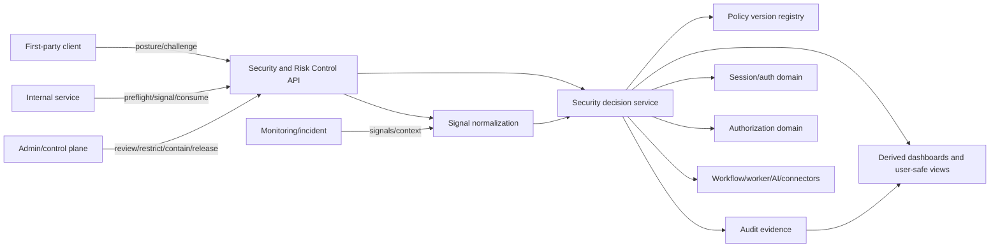
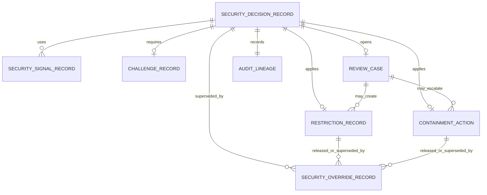
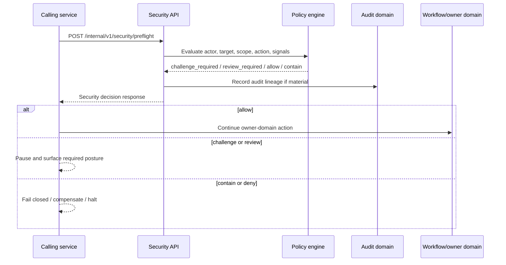
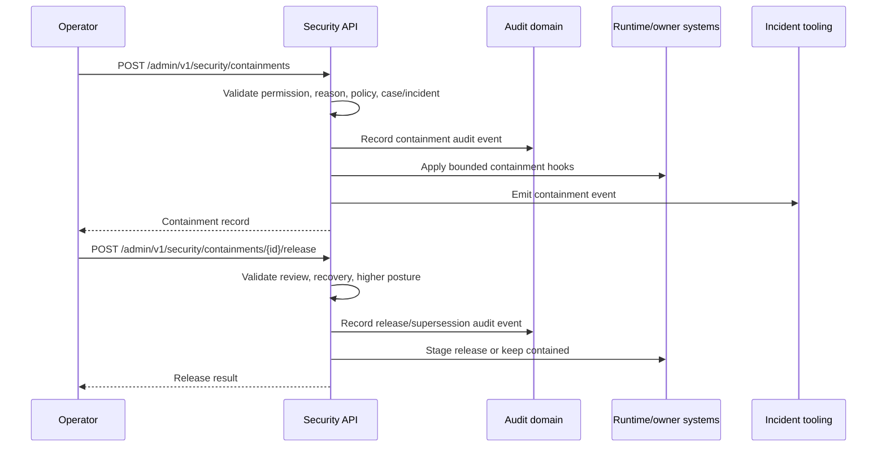

# FUZE Security and Risk Control API Specification

## Document Metadata

- **Document Name:** `SECURITY_AND_RISK_CONTROL_API_SPEC.md`
- **Document Type:** FUZE API SPEC v2 / Production-grade interface-contract specification
- **Status:** Draft for production-grade API-spec review
- **Version:** 2.0.0
- **Effective Date:** 2026-04-24
- **Last Updated:** 2026-04-24
- **Reviewed On:** 2026-04-24
- **Document Owner:** FUZE Platform Security and Risk Architecture Domain
- **Approval Authority:** FUZE Platform Architecture and Governance Authority; named approval record not yet attached
- **Review Cadence:** Quarterly, and whenever security/risk decisioning, challenge posture, review posture, restriction/containment semantics, public/internal API exposure, workflow/worker execution, AI/tool safety, connector authenticity, data/export handling, audit posture, monitoring/incident response, secrets/config posture, or product launch-readiness materially changes
- **Governing Layer:** API SPEC v2 / Security, Audit, Runtime, Operations, and Resilience API family
- **Parent Registry:** `API_SPEC_INDEX.md` and the FUZE API SPEC v2 Canonical File Registry
- **Upstream Semantic Registry:** `REFINED_SYSTEM_SPEC_INDEX.md`
- **Upstream API Registry:** `API_SPEC_INDEX.md`
- **Primary Audience:** Platform architecture, backend engineering, API design, security engineering, trust and safety, fraud/risk operations, frontend engineering, first-party client teams, internal service authors, workflow/runtime engineering, AI platform engineering, integration engineering, support/control-plane operations, audit/compliance, reliability engineering, OpenAPI/AsyncAPI/SDK authors, implementation-contract authors
- **Primary Purpose:** Define the production-grade API contract for FUZE security and risk decisioning, challenge/review/restriction/containment state, sensitive-action preflight, signal intake, control-plane intervention, release/restoration, and security-domain events while preserving refined system semantics and preventing security APIs from becoming hidden owners of identity, session, authorization, workflow, event, audit, or monitoring truth
- **Primary Upstream References:** `REFINED_SYSTEM_SPEC_INDEX.md`; `SECURITY_AND_RISK_CONTROL_SPEC.md`; `FUZE_SESSION_LIFECYCLE_AND_SECURITY_SPEC.md`; `FUZE_ACCOUNT_RECOVERY_AND_CONFLICT_HANDLING_SPEC.md`; `KEY_MANAGEMENT_AND_USER_RECOVERY_SPEC.md`; `ROLE_PERMISSION_AND_ACCESS_CONTROL_SPEC.md`; `SCOPED_AUTHORIZATION_MODEL_SPEC.md`; `ACCESS_EVALUATION_AND_EFFECTIVE_PERMISSION_SPEC.md`; `ADMIN_ACCESS_CORRECTION_AND_CONTAINMENT_SPEC.md`; `AUDIT_LOG_AND_ACTIVITY_SPEC.md`; `AUDIT_AND_ACCESS_TRACEABILITY_SPEC.md`; `MONITORING_ALERTING_AND_INCIDENT_RESPONSE_SPEC.md`; `SECRETS_CONFIG_AND_ENVIRONMENT_SPEC.md`; `DATA_CLASSIFICATION_AND_HANDLING_SPEC.md`; `DATA_RETENTION_DELETION_AND_ARCHIVAL_SPEC.md`; `API_ARCHITECTURE_SPEC.md`; `PUBLIC_API_SPEC.md`; `INTERNAL_SERVICE_API_SPEC.md`; `EVENT_MODEL_AND_WEBHOOK_SPEC.md`; `IDEMPOTENCY_AND_VERSIONING_SPEC.md`; `MIGRATION_AND_BACKWARD_COMPATIBILITY_SPEC.md`; `WORKFLOW_AND_AUTOMATION_SPEC.md`; `JOB_QUEUE_AND_WORKER_SPEC.md`; `AI_ORCHESTRATION_SPEC.md`; `MODEL_ROUTING_AND_CONTEXT_SPEC.md`; `FEATURE_FLAG_AND_ROLLOUT_CONTROL_SPEC.md`; `INTEGRATION_CONNECTOR_FRAMEWORK_SPEC.md`; `FILE_OBJECT_AND_ARTIFACT_STORAGE_SPEC.md`; `SEARCH_INDEXING_AND_DISCOVERY_SPEC.md`
- **Primary Downstream Dependents:** security decision service contracts; sensitive-action preflight middleware; public/internal/admin route guards; challenge and step-up flows; restriction and containment stores; review-case tooling; abuse/fraud policy engines; connector authenticity processors; AI/tool safety gates; workflow pause/compensation hooks; artifact quarantine/release pipelines; incident-containment integrations; support/admin consoles; monitoring detectors; audit evidence pipelines; OpenAPI/AsyncAPI contracts; SDK policy result types
- **API Surface Families Covered:** first-party protected security status and challenge APIs; internal security decision/preflight/signal APIs; admin/control-plane review, restriction, containment, override, and release APIs; event/async security outcome contracts; implementation-facing contract guardrails
- **API Surface Families Excluded:** unauthenticated public security reasoning APIs; raw SIEM vendor APIs; arbitrary third-party risk-scoring APIs; full identity/session/authorization mutation APIs; full incident-management APIs; secret-value APIs; UI copy/layout specs; exact ML scoring formulas; exact rate-limit values; exact SIEM schemas; low-level cloud/network controls
- **Canonical System Owner(s):** FUZE Platform Security and Risk Architecture Domain; adjacent owner domains retain canonical ownership of identity, session, authorization, workflow, event, audit, monitoring, secrets/config, data, connector, AI, and business-domain truth
- **Canonical API Owner:** FUZE API Platform / Security and Risk Control API Domain
- **Supersedes:** Earlier or weaker security/risk API interpretations that encode security posture as generic errors, product-local throttles, feature flags, support notes, dashboards, or undocumented admin scripts; no same-name v2 predecessor was identified in the researched materials
- **Superseded By:** Not yet known
- **Related Decision Records:** Not yet attached
- **Canonical Status Note:** This API specification expresses, but does not redefine, the refined security and risk-control system semantics. Refined system specifications own semantic truth; this document owns API contract expression, route-family posture, request/response/error/status semantics, idempotency, authorization, auditability, observability, compatibility, and implementation guardrails for the security/risk API domain.
- **Implementation Status:** Normative API-spec draft for downstream implementation-contract, OpenAPI, AsyncAPI, storage, workflow, console, middleware, and SDK derivation
- **Approval Status:** Draft pending formal FUZE approval workflow
- **Change Summary:** Created a production-grade API SPEC v2 for the security and risk-control API family. The document derives from the active refined security/risk system spec, separates security/risk decision truth from identity/session/authorization/business truth, defines decision/preflight/signal/challenge/review/restriction/containment/release surfaces, formalizes first-party/internal/admin/event API posture, adds request/response/error/idempotency/audit/versioning/migration rules, includes Mermaid architecture/data/sequence diagrams, and supplies acceptance criteria and QA test cases for production readiness.

## Purpose

This specification defines the FUZE Security and Risk Control API contract.

It governs how clients, services, administrators, workflows, AI/tool systems, connectors, artifact pipelines, incident tooling, and downstream contract artifacts interact with FUZE security/risk posture. It makes explicit which API surfaces may evaluate security posture, which may request step-up or review, which may apply restrictions or containment, which may release or supersede controls, and which may only consume derived status.

The core purpose is to ensure that security-sensitive platform behavior is not hidden inside generic authorization failures, product-local feature flags, transient dashboards, support notes, or undocumented scripts. Security/risk decisions must remain attributable, policy-versioned, reason-coded where required, correlation-safe, replay-safe, and auditable while preserving the ownership boundaries of identity, session, authorization, workflow, event, audit, monitoring, and owner-domain business truth.

This API specification is an interface contract. It does not define exact risk-scoring formulas, per-surface thresholds, SIEM schemas, ML features, or low-level network/cloud controls. It defines the stable API semantics that downstream implementations must preserve.

## Source-of-Truth Interpretation

The active refined registry is the production-grade source-of-truth entry point for refined system semantics. Active refined specs must be used for downstream API derivation, and API specs must not reinterpret semantic ownership, truth classes, lifecycle meaning, or conflict-resolution posture.

The active refined security/risk specification defines FUZE security and risk control as a cross-domain intervention layer. It owns challenge, review, restriction, containment, and security/risk decision posture; it does not own identity truth, session truth, authorization truth, workflow meaning, event meaning, audit evidence semantics, or monitoring/incident workflow semantics.

Therefore this API spec applies the following interpretation:

1. refined system specs own security/risk semantics;
2. this API spec owns route shape, request/response contracts, surface-family posture, error semantics, idempotency, versioning, auditability, observability, and compatibility posture;
3. security/risk APIs may constrain or pause adjacent-domain continuation but must not become the semantic write owner of the adjacent domain;
4. all high-impact security interventions must preserve actor, target, scope, reason, policy version, correlation lineage, and audit references;
5. derived dashboards, reports, activity feeds, notifications, or support summaries must not become canonical security decision truth.

## Scope

This specification covers:

- security-sensitive action preflight APIs
- policy-versioned risk-decision evaluation APIs
- first-party user challenge and step-up APIs
- review posture and case APIs
- restriction and containment control-plane APIs
- release, supersession, and restoration APIs
- signal intake and normalization APIs
- connector, AI/tool, workflow, artifact, export, and public-surface gating APIs
- security-status read APIs for bounded clients and internal services
- admin/control-plane investigation and intervention APIs
- security event emission and asynchronous integration contracts
- request, response, error, idempotency, audit, migration, versioning, and storage-shape rules for this domain

## Out of Scope

This specification does not define:

- full identity creation, provider linking, login, recovery, or session lifecycle routes
- full role, permission, entitlement, or effective-permission APIs
- full workflow, queue, worker, AI orchestration, connector, artifact, export, or incident route families
- exact risk-scoring algorithms, fraud models, behavioral thresholds, ML features, device-fingerprint logic, or SIEM rules
- raw secret values, cloud network policy, low-level cryptographic primitives, or infrastructure-vendor controls
- legal/compliance disclosure language or jurisdiction-specific obligations
- UI copy for challenges, reviews, restrictions, or account-security notices
- exact database DDL or vendor-specific storage topology

Adjacent specs own those domains. This API spec defines the shared security/risk API contract that those domains consume.

## Governing Principles

### Security Is Intervention, Not Ownership
Security APIs may challenge, narrow, review, restrict, contain, or deny continuation. They must not silently become the owner of the business, identity, session, authorization, workflow, queue, event, or monitoring truth they constrain.

### Stronger Current Posture Wins
A current canonical security/risk decision must outrank stale sessions, stale caches, stale rollout decisions, stale client hints, and product-local convenience state.

### Conservative High-Impact Defaults
If a high-impact action cannot be evaluated reliably, the API must fail closed or enter review posture rather than silently allowing continuation.

### Explicit Challenge and Review Semantics
Challenge-required and review-required outcomes must be explicit API states. They must not be encoded as generic `403` or `500` responses without machine-readable posture.

### Bounded Privileged Intervention
Admin and control-plane APIs for containment, override, release, or review must be separate from ordinary user-facing mutation APIs where risk posture requires it.

### Audience Minimization
User-facing and partner-facing APIs must expose only the minimum safe security explanation. Internal APIs may carry richer reason and signal lineage subject to authorization.

### Idempotent and Replay-Safe Controls
Security-sensitive decisions, restrictions, releases, containment actions, and signal intake must be idempotent, correlation-safe, and replay-safe across retries, redeliveries, queued execution, event replay, and incident handling.

### Derived Views Do Not Decide
Dashboards, support views, reports, analytics, notifications, and activity timelines may summarize security posture but must not become canonical decision owners.

## Truth Class Taxonomy

Security/risk API implementations must preserve these truth classes:

1. **Identity truth**: canonical account, linked-auth, and provider-resolution truth owned by identity/auth domains.
2. **Session truth**: canonical authenticated runtime session state owned by auth/session domains.
3. **Authorization truth**: role, permission, scope, restriction, and effective-permission truth owned by authorization domains.
4. **Security/risk decision truth**: protective posture, challenge, review, restriction, containment, deny, allow-with-narrowing, and release truth owned by this domain.
5. **Policy truth**: policy versions, reason classes, rule-set references, and configuration lineage materially influencing a decision.
6. **Audit truth**: attributable evidence of security-sensitive actions and interventions owned by audit domains.
7. **Monitoring truth**: alerts, detector outputs, metrics, traces, and incident signals owned by monitoring/incident domains.
8. **Workflow/execution truth**: workflow meaning, queue state, worker execution lineage, and automation progression owned by execution domains.
9. **Provider-input truth**: callbacks, connector signals, device/geo observations, partner signals, and external fraud signals before normalization.
10. **Data/storage truth**: classification, retention, artifact state, quarantine state, lifecycle state, and storage posture.
11. **Projection/presentation truth**: dashboards, messages, summaries, public explanations, and user-facing labels.

Security/risk APIs may connect these truth classes through references, but must not collapse them.

## API Surface Families

### Public / First-Party User-Facing Surfaces
Protected first-party routes exposed to authenticated users or first-party clients for bounded security posture, challenge, and review interactions.

Examples:

- obtain safe current security posture for the authenticated account/session/workspace
- initiate or complete a challenge required for a sensitive action
- view bounded review/restriction status where user disclosure is allowed
- submit user-provided challenge or remediation material where approved

These surfaces must not expose raw internal security reasoning, detector payloads, protected signals, sensitive case notes, or arbitrary risk scores.

### Internal Service Surfaces
Service-to-service APIs used by trusted FUZE services to evaluate security posture, submit signals, preflight sensitive actions, consume challenge/review outcomes, and gate workflow/AI/connector/artifact execution.

These surfaces must require authenticated service identity, producer-domain authorization, least privilege, correlation IDs, and idempotency for mutation-capable operations.

### Admin / Control-Plane Surfaces
Privileged APIs used by support, security, fraud/risk, incident, finance-risk, and governance-aware operators to inspect posture, open and resolve review cases, apply restrictions, contain targets, release or supersede controls, and manage policy-sensitive interventions.

These surfaces must require explicit operator identity, role authorization, reason codes, policy references where required, case linkage where required, audit lineage, and stronger access controls than ordinary operations.

### Event / Async Surfaces
Internal events and async contracts for downstream coordination, including decision-created, challenge-required, review-opened, restriction-applied, containment-applied, release-approved, signal-normalized, and discrepancy/security-gap events.

Events are synchronization and coordination signals. Event delivery state is not security decision truth.

### Reporting / Projection Surfaces
Derived dashboards, exports, metrics, and summaries used for operational insight, trend review, and support investigation.

These must remain subordinate to canonical security/risk decision records and audit evidence.

## Authentication and Authorization Model

### User-Facing Routes
User-facing routes require:

- valid authenticated session;
- current session not invalidated by stronger security posture;
- account/workspace scope match where relevant;
- authorization to see the bounded disclosed posture;
- audience-safe response shaping.

A valid session is not sufficient authority for sensitive actions when current security posture requires challenge, review, restriction, containment, or denial.

### Internal Service Routes
Internal service routes require:

- authenticated service identity;
- explicit service grant for the route family;
- producer-domain or consumer-domain authorization where applicable;
- environment-bound authorization for production routes;
- request correlation and idempotency for mutations;
- narrow payload acceptance according to source legitimacy.

Being inside the platform boundary does not imply broad authority.

### Admin / Control-Plane Routes
Admin/control routes require:

- privileged operator identity;
- explicit permission for the action class;
- reason code and policy reference where required;
- case or incident linkage for high-impact actions;
- dual-control or approval workflow where downstream policy requires it;
- audit creation for every material read or mutation where policy requires it.

Workspace roles or product roles must not imply unrestricted security intervention authority.

## Canonical Entities

### `security_decision_records`
Canonical records representing the outcome of a security/risk evaluation.

Minimum conceptual fields:

- `security_decision_id`
- `decision_type`
- `decision_state`
- `decision_source`
- `policy_version`
- `reason_class`
- `actor_reference`
- `target_reference`
- `scope_reference`
- `requested_action_reference`
- `signal_reference_ids[]`
- `challenge_reference_id` nullable
- `review_case_id` nullable
- `restriction_id` nullable
- `containment_id` nullable
- `correlation_id`
- `causation_id` nullable
- `idempotency_key_ref` nullable
- `audit_lineage_ref`
- `occurred_at`
- `expires_at` nullable
- `superseded_by` nullable
- `visibility_class`

### `security_signal_records`
Normalized signals used as inputs into decisioning.

Minimum conceptual fields:

- `security_signal_id`
- `signal_family`
- `signal_source`
- `source_legitimacy_state`
- `target_reference`
- `scope_reference`
- `observed_at`
- `normalized_at`
- `severity_hint`
- `confidence_hint`
- `payload_ref_or_redacted_summary`
- `classification`
- `correlation_id`
- `retention_class`

### `challenge_records`
Structured challenge or step-up requirements.

Minimum conceptual fields:

- `challenge_id`
- `challenge_type`
- `challenge_state`
- `target_reference`
- `scope_reference`
- `required_proof_class`
- `issued_at`
- `expires_at`
- `completed_at` nullable
- `result_reference` nullable
- `policy_version`
- `reason_class`
- `correlation_id`

### `review_cases`
Human or higher-control review posture.

Minimum conceptual fields:

- `review_case_id`
- `case_type`
- `case_state`
- `target_reference`
- `scope_reference`
- `opened_by_reference`
- `assigned_to_reference` nullable
- `policy_version`
- `reason_code`
- `signal_reference_ids[]`
- `decision_reference_ids[]`
- `opened_at`
- `resolved_at` nullable
- `resolution_code` nullable
- `audit_lineage_ref`

### `restriction_records`
Bounded suppressions of ordinary behavior.

Minimum conceptual fields:

- `restriction_id`
- `restriction_type`
- `restriction_state`
- `target_reference`
- `scope_reference`
- `restricted_capabilities[]`
- `reason_code`
- `policy_version`
- `applied_by_reference`
- `applied_at`
- `expires_at` nullable
- `released_at` nullable
- `superseded_by` nullable
- `audit_lineage_ref`

### `containment_actions`
Stronger containment actions preventing unsafe continuation.

Minimum conceptual fields:

- `containment_id`
- `containment_type`
- `containment_state`
- `target_reference`
- `scope_reference`
- `blast_radius_class`
- `affected_surfaces[]`
- `reason_code`
- `policy_version`
- `case_reference_id` nullable
- `incident_reference_id` nullable
- `applied_by_reference`
- `applied_at`
- `release_eligibility_state`
- `released_at` nullable
- `audit_lineage_ref`

### `security_override_records`
Privileged overrides that change posture under approved policy.

Minimum conceptual fields:

- `override_id`
- `override_type`
- `target_reference`
- `scope_reference`
- `prior_state_reference`
- `new_state_reference`
- `reason_code`
- `policy_version`
- `operator_reference`
- `approval_reference` nullable
- `created_at`
- `audit_lineage_ref`

## State Model

### Security Decision States

- `allow`
- `allow_with_narrowing`
- `challenge_required`
- `review_required`
- `temporarily_restricted`
- `contained`
- `deny`

### Challenge States

- `issued`
- `presented`
- `completed_success`
- `completed_failure`
- `expired`
- `superseded`
- `cancelled`

### Review Case States

- `opened`
- `triage_pending`
- `under_review`
- `awaiting_user_or_domain_input`
- `approved_for_release`
- `restriction_maintained`
- `containment_escalated`
- `denied_or_closed`
- `resolved`
- `superseded`

### Restriction States

- `watch`
- `rate_limited`
- `step_up_required`
- `feature_narrowed`
- `scope_restricted`
- `suspended_sensitive_actions`
- `released`
- `superseded`

### Containment States

- `targeted_containment`
- `global_containment`
- `connector_containment`
- `artifact_quarantine`
- `execution_halt`
- `public_exposure_suppressed`
- `release_pending`
- `released`
- `superseded`

### Signal States

- `received`
- `accepted_for_normalization`
- `rejected_source_untrusted`
- `normalized`
- `correlated`
- `used_for_decision`
- `archived`
- `suppressed_from_view`

## Surface Family Route Catalog

Route names are canonical contract intentions. Exact implementation may use equivalent naming if semantics, authorization, idempotency, and compatibility rules are preserved.

### First-Party User-Facing Routes

#### `GET /v1/security/posture/me`

**Purpose:** Return bounded security posture for the authenticated actor.

**Caller Type:** authenticated user or first-party client.

**Query Parameters:**

- `scope_type` optional
- `scope_id` optional
- `include_challenge_summary` optional boolean

**Response Summary:**

- current bounded posture
- disclosed active challenge references
- disclosed review/restriction summaries
- safe next-action hints
- correlation ID

**Rules:**

- must not reveal raw internal signals, protected reason detail, detector internals, or fraud logic;
- must distinguish `challenge_required`, `review_required`, `restricted`, and `contained` where disclosure is allowed;
- must fail closed if target scope cannot be safely determined.

#### `POST /v1/security/challenges/{challenge_id}/complete`

**Purpose:** Submit a proof result for a user-facing challenge.

**Caller Type:** authenticated user or first-party client.

**Request Body Summary:**

- `proof_type`
- `proof_response_ref_or_token`
- `client_context_summary`
- `correlation_id`

**Headers:**

- `Idempotency-Key` required when challenge completion can alter posture.

**Response Summary:**

- challenge state
- resulting security decision summary
- safe next-action hint

**Rules:**

- proof payloads must be minimized;
- failed challenge responses must not leak which proof component failed if unsafe;
- completion may trigger session rotation, restriction, or containment through adjacent domains.

#### `GET /v1/security/reviews/{review_case_id}`

**Purpose:** Return a user-safe review status where disclosure is allowed.

**Caller Type:** authenticated user with visibility to the subject.

**Response Summary:**

- review state
- user-action requirements if any
- safe explanation
- estimated availability only if policy permits

**Rules:**

- never expose protected case notes or internal signal details;
- return not-found style behavior where visibility would reveal protected scope.

### Internal Service Routes

#### `POST /internal/v1/security/preflight`

**Purpose:** Evaluate current security/risk posture before a sensitive action proceeds.

**Caller Type:** trusted internal service.

**Request Body Summary:**

```json
{
  "requested_action": "workspace.member_role_change",
  "actor_reference": {"type": "account", "id": "acct_..."},
  "target_reference": {"type": "workspace", "id": "wsp_..."},
  "scope_reference": {"type": "workspace", "id": "wsp_..."},
  "sensitivity_class": "high",
  "source_domain": "workspace_access",
  "policy_context": {"policy_version_hint": "security_policy_2026_04"},
  "correlation_id": "cor_...",
  "causation_id": "req_..."
}
```

**Response Summary:**

```json
{
  "security_decision_id": "secdec_...",
  "decision_state": "challenge_required",
  "allowed_to_continue": false,
  "required_action": "complete_challenge",
  "reason_class": "high_risk_privileged_change",
  "policy_version": "security_policy_2026_04",
  "challenge_reference": {"challenge_id": "chal_...", "challenge_type": "recent_auth"},
  "audit_lineage_ref": "audit_...",
  "correlation_id": "cor_..."
}
```

**Rules:**

- security-sensitive actions must use explicit decision states instead of generic allow/deny booleans;
- caller must not proceed when `allowed_to_continue` is false;
- response must distinguish authorization denial from security narrowing, review, restriction, containment, and challenge.

#### `POST /internal/v1/security/signals`

**Purpose:** Submit a normalized or normalizable signal from an approved source.

**Caller Type:** trusted internal service, detector, connector, monitoring pipeline, artifact scanner, AI safety component, or provider-boundary adapter.

**Headers:**

- `Idempotency-Key` required.

**Request Body Summary:**

- `signal_family`
- `signal_source`
- `source_event_reference`
- `target_reference`
- `scope_reference`
- `observed_at`
- `severity_hint`
- `confidence_hint`
- `payload_ref_or_redacted_summary`
- `classification`
- `correlation_id`

**Response Summary:**

- signal ID
- source-legitimacy state
- normalization state
- correlation result
- created decision references if any

**Rules:**

- raw provider input is not canonical until normalized and accepted;
- rejected signals must be auditable where policy requires;
- signal intake must not itself create irreversible restriction unless a policy-authorized automated path exists.

#### `POST /internal/v1/security/decisions/{security_decision_id}/consume`

**Purpose:** Record that an internal service consumed a decision and either continued, paused, compensated, or rejected execution.

**Caller Type:** trusted internal service.

**Headers:**

- `Idempotency-Key` required.

**Request Body Summary:**

- `consumer_service`
- `consumption_result`
- `execution_reference`
- `correlation_id`

**Response Summary:**

- consumption checkpoint
- resulting posture if superseded

**Rules:**

- consumers must not ignore stronger current posture;
- if decision is stale or superseded, caller must re-evaluate.

#### `GET /internal/v1/security/decisions/{security_decision_id}`

**Purpose:** Retrieve canonical decision detail for authorized internal services.

**Rules:**

- internal reads may include policy and signal references but must still respect classification;
- sensitive signal details may require separate evidence authorization.

#### `GET /internal/v1/security/targets/{target_type}/{target_id}/posture`

**Purpose:** Retrieve current canonical security/risk posture for a target.

**Caller Type:** internal service with relevant scope grant.

**Response Summary:**

- current decision summary
- active restrictions
- active containments
- pending challenges/reviews
- policy version
- supersession lineage

### Admin / Control-Plane Routes

#### `GET /admin/v1/security/decisions`

**Purpose:** Search and review security decisions under privileged policy.

**Caller Type:** security/risk/support/fraud operator or approved control-plane tool.

**Query Parameters:**

- `target_type`
- `target_id`
- `scope_type`
- `scope_id`
- `decision_state`
- `reason_class`
- `policy_version`
- `from`
- `to`
- `correlation_id`

**Response Summary:**

- paginated decision summaries
- classification-aware detail
- review/containment linkage

**Audit Requirements:** privileged read audit where policy requires.

#### `POST /admin/v1/security/review-cases`

**Purpose:** Open a review case for a target, action, signal, or decision.

**Headers:**

- `Idempotency-Key` required.

**Request Body Summary:**

- `case_type`
- `target_reference`
- `scope_reference`
- `reason_code`
- `signal_references[]`
- `decision_references[]`
- `operator_note`
- `incident_reference_id` optional

**Response Summary:** review case record.

**Rules:**

- review is not owner-domain mutation;
- opening review may narrow continuation but must not rewrite adjacent truth;
- case notes must preserve classification.

#### `POST /admin/v1/security/restrictions`

**Purpose:** Apply a bounded restriction to an account, session, workspace, connector, artifact, workflow, AI run, export, public surface, or other supported target.

**Headers:**

- `Idempotency-Key` required.

**Request Body Summary:**

- `restriction_type`
- `target_reference`
- `scope_reference`
- `restricted_capabilities[]`
- `reason_code`
- `policy_version`
- `case_reference_id` optional
- `operator_note`
- `expires_at` optional

**Response Summary:** restriction record and affected-surface summary.

**Audit Requirements:** critical audit.

#### `POST /admin/v1/security/containments`

**Purpose:** Apply a stronger containment action where ordinary continuation is unsafe.

**Headers:**

- `Idempotency-Key` required.

**Request Body Summary:**

- `containment_type`
- `target_reference`
- `scope_reference`
- `blast_radius_class`
- `affected_surfaces[]`
- `reason_code`
- `policy_version`
- `case_reference_id` optional
- `incident_reference_id` optional
- `operator_note`

**Response Summary:** containment record, affected surface summary, event references.

**Rules:**

- containment must be explicit and auditable;
- containment may pause workflow, worker, connector, AI, artifact, export, or public-surface progression through adjacent domains;
- containment does not redefine adjacent domain truth.

#### `POST /admin/v1/security/restrictions/{restriction_id}/release`

**Purpose:** Release or supersede a restriction under policy.

**Headers:**

- `Idempotency-Key` required.

**Request Body Summary:**

- `release_reason_code`
- `policy_version`
- `case_reference_id` optional
- `operator_note`
- `replacement_restriction` optional

**Rules:**

- release must preserve supersession lineage;
- release may require review completion or approval references;
- release must not silently auto-restore adjacent-domain state if adjacent domains still have active restrictions.

#### `POST /admin/v1/security/containments/{containment_id}/release`

**Purpose:** Release or supersede containment after approved review, recovery, or policy condition.

**Rules:**

- must validate higher-order incident, recovery, suspension, and owner-domain posture before release;
- must preserve audit and supersession lineage;
- may produce staged release states rather than immediate full restoration.

#### `POST /admin/v1/security/overrides`

**Purpose:** Perform a privileged override where policy permits.

**Headers:**

- `Idempotency-Key` required.

**Request Body Summary:**

- `override_type`
- `target_reference`
- `scope_reference`
- `prior_state_reference`
- `requested_state`
- `reason_code`
- `policy_version`
- `approval_reference` optional
- `operator_note`

**Rules:**

- overrides must be exceptional, not ordinary mutation paths;
- dual-control or higher approval must be enforced where required;
- overrides must never masquerade as automated ordinary decisions.

### Event / Async Contracts

#### Internal Event Families

- `security.signal_received`
- `security.signal_normalized`
- `security.decision_created`
- `security.challenge_required`
- `security.challenge_completed`
- `security.review_opened`
- `security.review_resolved`
- `security.restriction_applied`
- `security.restriction_released`
- `security.containment_applied`
- `security.containment_released`
- `security.override_recorded`
- `security.posture_superseded`
- `security.degraded_mode_entered`
- `security.degraded_mode_recovered`

#### Event Payload Minimums

Each event must include:

- `event_id`
- `event_name`
- `event_version`
- `occurred_at`
- `producer_domain`
- `security_decision_id` where applicable
- `target_reference`
- `scope_reference`
- `reason_class` or `reason_code` where applicable
- `policy_version` where applicable
- `correlation_id`
- `causation_id` where applicable
- `audit_lineage_ref` where applicable
- `sensitivity_class`
- `public_exposure_class`

#### External Webhook Posture

No general third-party outbound security/risk webhook surface is approved by default. Any future external security-derived webhook must be narrow, public-safe, security-reviewed, versioned, and governed by a separate webhook contract.

## Request Rules

### General Request Rules

- All mutation-capable routes must require JSON requests with explicit content type.
- All security-sensitive mutations must carry `Idempotency-Key`.
- All routes must carry or generate correlation IDs.
- Admin mutations must require reason codes and operator notes where applicable.
- Internal service calls must identify source domain and service principal.
- Caller-provided security truth must not be accepted without source legitimacy checks.
- Protected internal security reasoning must not be accepted from frontend clients.

### Preflight Request Rules

A preflight request must include:

- requested action;
- actor reference or service actor class;
- target reference;
- scope reference;
- source domain;
- sensitivity class;
- correlation ID;
- policy context or policy version hint where relevant.

If the request cannot identify target, scope, policy context, or sensitivity class for a high-impact action, it must fail closed or enter review-required state.

### Signal Request Rules

Signal intake must distinguish:

- approved internal detector signals;
- provider input before normalization;
- connector callback authenticity state;
- monitoring/incident signals;
- user-submitted challenge or remediation material;
- admin/operator observations.

Source legitimacy must be recorded. Untrusted or unauthenticated source input must not become canonical decision truth.

### Admin Request Rules

Admin/control requests must include:

- operator identity;
- explicit target and scope;
- reason code;
- policy version;
- case, incident, approval, or review linkage where required;
- idempotency key;
- operator note for human-initiated actions.

## Response Rules

### Success Response Rules

Successful responses must include:

- stable resource identifiers;
- state/status values;
- policy version;
- reason class or reason code where allowed;
- target and scope summaries;
- correlation ID;
- audit lineage reference where applicable;
- supersession lineage where applicable;
- next-action requirements where applicable.

### Bounded User Response Rules

User-facing responses must:

- expose only safe posture and action guidance;
- avoid raw risk scores, detector internals, fraud logic, and protected signal detail;
- distinguish challenge-required, review-required, restricted, contained, and denied states only where disclosure is permitted;
- use generic not-found or unavailable posture where necessary to avoid scope disclosure.

### Internal Response Rules

Internal responses may include richer policy and signal references, but still must preserve classification and least-privilege access.

### Admin Response Rules

Admin responses may include protected reason and case data only where the operator is authorized for that sensitivity class. Bulk reads must be more restricted than single-resource reads.

## Error Model

The API uses structured problem-details style error responses.

### Required Error Fields

- `type`
- `title`
- `status`
- `code`
- `detail`
- `instance`
- `correlation_id`
- `security_decision_id` nullable
- `policy_version` nullable
- `retry_after` nullable

### Common Error Codes

#### Authentication and Permission

- `SECURITY_SESSION_REQUIRED`
- `SECURITY_SERVICE_AUTH_REQUIRED`
- `SECURITY_PERMISSION_DENIED`
- `SECURITY_OPERATOR_PERMISSION_DENIED`
- `SECURITY_SCOPE_RESTRICTED`

#### Decision and Policy

- `SECURITY_DECISION_REQUIRED`
- `SECURITY_CHALLENGE_REQUIRED`
- `SECURITY_REVIEW_REQUIRED`
- `SECURITY_RESTRICTED`
- `SECURITY_CONTAINED`
- `SECURITY_DENIED_BY_POLICY`
- `SECURITY_POLICY_VERSION_INVALID`
- `SECURITY_REASON_CODE_REQUIRED`

#### Request Integrity

- `SECURITY_REQUEST_INVALID`
- `SECURITY_TARGET_REQUIRED`
- `SECURITY_SCOPE_REQUIRED`
- `SECURITY_SENSITIVITY_REQUIRED`
- `SECURITY_IDEMPOTENCY_KEY_REQUIRED`
- `SECURITY_IDEMPOTENCY_CONFLICT`

#### State Conflict

- `SECURITY_DECISION_STALE`
- `SECURITY_DECISION_SUPERSEDED`
- `SECURITY_RESTRICTION_ALREADY_RELEASED`
- `SECURITY_CONTAINMENT_ALREADY_RELEASED`
- `SECURITY_RELEASE_BLOCKED_BY_HIGHER_POSTURE`
- `SECURITY_REVIEW_STATE_INVALID`

#### Signal and Source Legitimacy

- `SECURITY_SIGNAL_SOURCE_UNTRUSTED`
- `SECURITY_SIGNAL_SCHEMA_INVALID`
- `SECURITY_PROVIDER_INPUT_NOT_NORMALIZED`
- `SECURITY_CALLBACK_AUTHENTICITY_FAILED`

#### Dependency and Degraded Mode

- `SECURITY_DECISION_UNAVAILABLE_FAIL_CLOSED`
- `SECURITY_POLICY_ENGINE_UNAVAILABLE`
- `SECURITY_SIGNAL_STORE_UNAVAILABLE`
- `SECURITY_AUDIT_REQUIRED_BUT_UNAVAILABLE`

### Error Handling Rules

- Do not expose protected internal security reasoning to unauthorized clients.
- Do not encode challenge/review/restriction/containment as generic errors when machine-readable posture is required.
- Distinguish authorization denial from security restriction and review state.
- Fail closed for high-impact actions when decisioning is unavailable.
- Include retry guidance only when safe.

## Idempotency and Mutation Safety

### Routes Requiring Idempotency

- `POST /internal/v1/security/preflight` when decisions are persisted
- `POST /internal/v1/security/signals`
- `POST /internal/v1/security/decisions/{id}/consume`
- `POST /v1/security/challenges/{id}/complete`
- `POST /admin/v1/security/review-cases`
- `POST /admin/v1/security/restrictions`
- `POST /admin/v1/security/containments`
- `POST /admin/v1/security/restrictions/{id}/release`
- `POST /admin/v1/security/containments/{id}/release`
- `POST /admin/v1/security/overrides`

### Idempotency Key Rules

- Idempotency scope must include actor/service, route family, target, scope, and action class.
- Request hash must be stored with terminal result.
- Replays of the same semantic request must return the same terminal or current superseded outcome.
- Reuse of the same key for a materially different request must fail with `SECURITY_IDEMPOTENCY_CONFLICT`.
- Idempotency records must preserve correlation and audit linkage.

### Mutation Safety Rules

- A repeated containment request must not duplicate side effects.
- A repeated release request must not double-release or erase history.
- Signal replay must not create duplicate canonical signal meaning unless explicitly classified as a new observation.
- Challenge completion replay must not create multiple contradictory challenge outcomes.
- Admin override retry must return the original terminal result or conflict.

## Versioning and Compatibility

### Route Versioning

Routes are versioned under:

- `/v1` for first-party user-facing protected surfaces;
- `/internal/v1` for service-to-service surfaces;
- `/admin/v1` for control-plane privileged surfaces.

### Compatibility Rules

Additive evolution is preferred. The following are breaking changes:

- changing the meaning of decision states;
- hiding challenge/review/restriction/containment behind generic errors;
- removing policy version, reason class, target, scope, or correlation fields from security-sensitive responses;
- changing containment or release semantics incompatibly;
- expanding user-facing disclosure of protected security reasoning without new exposure governance;
- exposing internal event families as public webhooks by default.

### Deprecation Rules

Deprecated routes or fields must:

- preserve compatibility windows;
- emit deprecation metadata where supported;
- identify replacement route and semantic differences;
- avoid weakening fail-closed or containment posture during migration.

## Audit and Traceability Requirements

The following actions must generate durable audit evidence:

- creation of high-impact security decisions;
- privileged decision search/read where policy requires;
- signal acceptance/rejection for sensitive signals;
- challenge issuance and completion where security-significant;
- review case opening, assignment, resolution, or closure;
- restriction application, extension, supersession, or release;
- containment application, escalation, supersession, or release;
- admin override creation;
- incident-driven containment or restoration;
- policy version activation where routed through this domain.

Audit evidence must preserve:

- actor/service identity;
- target and scope;
- action class;
- prior and resulting posture;
- reason code/reason class;
- policy version;
- approval or case reference where applicable;
- correlation and causation IDs;
- timestamps;
- sensitivity/visibility classification.

## Data Classification, Retention, and Privacy Rules

Security/risk data is frequently high-sensitivity. Implementations must:

- classify signals, decisions, cases, restrictions, containments, and override records;
- separate user-safe posture summaries from protected internal reason detail;
- minimize raw signal payload retention;
- prevent raw credentials, secrets, or restricted content from entering signal payloads;
- preserve evidence required for review without retaining unnecessary source content;
- coordinate lifecycle with retention/deletion/archival policy;
- suppress or redact derived views when source posture narrows;
- treat bulk exports and cross-scope searches as higher-risk operations.

## Read Model and Projection Rules

The following are derived surfaces:

- security dashboards;
- support summaries;
- risk trend reports;
- alert summaries;
- activity history entries;
- incident summaries;
- user-facing security messaging;
- public-safe explanations.

Derived surfaces must:

- remain traceable to canonical security decision records and audit evidence;
- not become write owners;
- not substitute for review, restriction, or release APIs;
- show stale/unavailable posture when projections are delayed;
- respect classification and least-disclosure policy.

## Cross-Domain Integration Rules

### Identity / Auth / Session

Security decisions may require step-up, session rotation, session invalidation, or containment. Identity and session domains remain owners of their truth. The security API must reference and constrain, not rewrite, their canonical records.

### Authorization / Effective Permission

Authorization decides ordinary permission. Security/risk posture may suppress otherwise-valid permission under restriction, containment, review, or challenge. Responses must distinguish security narrowing from authorization denial.

### Workflow / Worker / Automation

Workflow and worker systems must preflight sensitive actions and honor active restrictions or containment. They must pause, quarantine, compensate, or fail closed when security posture changes materially.

### AI / Tool Execution

AI orchestration and tool-execution systems must request preflight decisions before sensitive tool invocation, external release, or high-impact action delegation. Unsafe runs must pause or narrow rather than continuing silently.

### Integration Connectors and Callbacks

Connector installation, credential update, callback processing, provider input normalization, and outbound sync continuation must honor security posture. Authenticity failures may create signals and containments.

### Artifacts, Files, Exports, and Public Surfaces

Artifact release, download-token issuance, export generation, public registry/publication surfaces, and partner-visible surfaces must be able to quarantine, suppress, delay, or narrow under security posture.

### Monitoring and Incident Response

Monitoring provides signals and incident context. Security/risk owns protective posture and containment meaning. Incident-driven containment must preserve audit, reason, policy, and recovery lineage.

### Audit and Activity

Audit owns evidence. Security APIs must emit audit evidence for material actions and may create derived activity summaries only through audit/activity-owned projection pathways.

## Mermaid Architecture View



## Mermaid Data Relationship View



## Mermaid Sensitive Action Preflight Sequence



## Mermaid Containment and Release Sequence



## Implementation Guardrails

Downstream implementations must preserve:

1. explicit distinction between security/risk decision truth and adjacent owner-domain truth;
2. policy-versioned, reason-bearing, target/scope-bound decision records;
3. challenge, review, restriction, containment, deny, and allow-with-narrowing as machine-readable outcomes;
4. fail-closed behavior for high-impact actions when decisioning is unreliable;
5. idempotent and replay-safe signal, decision, restriction, containment, release, and override handling;
6. bounded privileged operator pathways;
7. audit evidence for material actions;
8. audience-safe response shaping;
9. derived-view subordination;
10. migration safety and supersession lineage.

Downstream implementations must not:

- encode security posture only as generic errors;
- treat login success as sufficient authority for sensitive actions;
- let feature flags or rollout booleans replace canonical containment;
- let dashboards or support notes become canonical security truth;
- allow product-local super-admin bypasses;
- continue unsafe runtime trust after canonical containment;
- expose protected internal security reasoning broadly;
- silently auto-release restrictive posture after manual intervention;
- duplicate containment side effects during retry or replay.

## Operational and Observability Requirements

Implementations should provide observability for:

- preflight volume by action class;
- decision-state distribution;
- challenge issue and completion rates;
- review case backlog and age;
- active restriction and containment counts;
- false-positive/false-negative review signals where governance supports them;
- policy version drift;
- stale decision consumption attempts;
- failed audit creation;
- degraded decisioning mode;
- release latency;
- privileged operator activity;
- cross-domain containment propagation success.

Operational dashboards are derived. They must not become mutation authority.

## Migration and Backward Compatibility

### Migration Goals

- migrate product-local security checks into shared preflight and decision contracts;
- replace generic security failures with machine-readable decision outcomes;
- replace undocumented admin scripts with bounded admin/control APIs;
- preserve legacy behavior temporarily only where it does not weaken canonical security posture;
- maintain compatibility while exposing policy version and reason-class lineage.

### Compatibility Rules

- older product routes may call security preflight internally without changing public route shape during transition;
- new public disclosure must remain audience-safe;
- migrations must not silently weaken challenge, review, restriction, or containment meaning;
- stale product-local controls must be retired or marked derived;
- historical decision records must remain reconstructable after migration.

## Acceptance Criteria

This API spec is implementation-ready only if all of the following are true:

- every security-sensitive mutation route can identify actor/service, target, scope, action class, sensitivity class, policy version, reason class, and correlation ID;
- challenge/review/restriction/containment/deny outcomes are machine-readable;
- high-impact decisioning failures fail closed or enter review posture;
- admin/control routes are separated from user-facing routes;
- every material privileged action creates audit evidence;
- user-facing responses minimize internal security reasoning;
- internal services are least-privilege and source-legitimacy checked;
- idempotency is required for mutation-capable security routes;
- event emission occurs only after canonical commit;
- derived dashboards and reports remain subordinate;
- release and supersession preserve lineage;
- compatibility guidance exists for legacy product-local controls;
- OpenAPI/AsyncAPI derivations preserve this document's route-family, error, state, and event semantics.

## QA / Test Cases

### Test 1: Sensitive Action Requires Challenge

Given an authenticated user attempts a high-risk auth or workspace change, when the internal service calls preflight, the API returns `challenge_required` with challenge reference and does not allow continuation.

### Test 2: Authorization Denial vs Security Review

Given a user lacks role permission, the caller receives authorization denial from the authorization domain. Given a permitted user is risky, the security API returns `review_required`. These states must not be collapsed.

### Test 3: Idempotent Restriction Apply

Given an operator applies a restriction with the same idempotency key twice, the second request returns the original restriction result and does not create duplicate side effects.

### Test 4: Containment Propagates to Workflow

Given a workspace enters containment, workflow and worker systems consuming the containment event pause or quarantine sensitive work and record decision consumption.

### Test 5: Release Blocked by Higher Posture

Given a containment release is requested while a higher-order incident or recovery posture remains active, the release fails with `SECURITY_RELEASE_BLOCKED_BY_HIGHER_POSTURE` or returns staged release posture.

### Test 6: User-Safe Posture Hides Protected Signals

Given a user queries their security posture, the response shows safe action guidance but not raw detector payloads, fraud logic, or internal case notes.

### Test 7: Signal Source Untrusted

Given an unauthenticated provider callback attempts signal submission, the API rejects it with `SECURITY_SIGNAL_SOURCE_UNTRUSTED` and does not create canonical decision truth.

### Test 8: Stale Decision Consumption

Given an internal service attempts to consume a superseded decision, the API returns `SECURITY_DECISION_SUPERSEDED` and requires re-evaluation.

### Test 9: Audit Required but Unavailable

Given a critical containment requires audit evidence and audit creation is unavailable, the API fails closed or enters degraded containment posture rather than reporting success silently.

### Test 10: Dashboard Cannot Release Restriction

Given an operator sees a dashboard anomaly resolved, they cannot release a restriction through the dashboard alone. Release must use the admin release API with reason, policy, and audit lineage.

## Security Review Checklist

- [ ] User-facing routes expose only safe posture and next actions.
- [ ] Internal routes require service identity and least privilege.
- [ ] Admin routes require privileged actor, reason code, and audit evidence.
- [ ] All mutation routes have idempotency protection.
- [ ] Security decision states are explicit and machine-readable.
- [ ] Protected signal detail is classified and access-controlled.
- [ ] High-impact decisioning failure is fail-closed or review-required.
- [ ] Release cannot bypass higher-order incident, recovery, suspension, or owner-domain posture.
- [ ] Event emission happens after canonical commit.
- [ ] OpenAPI/AsyncAPI schemas preserve policy version, reason, target, scope, and correlation lineage.

## Explicitly Deferred Items

The following are intentionally deferred to downstream implementation contracts:

- exact risk score formulas and ML features;
- exact challenge thresholds and per-surface rate limits;
- exact device fingerprinting or behavioral analytics fields;
- exact SIEM schemas and alert-routing logic;
- exact admin console layouts and dashboard widgets;
- exact user-facing message copy;
- exact cryptographic primitive selection;
- exact cloud/network perimeter implementation;
- exact legal/compliance disclosure language.

These deferrals do not weaken the API contract semantics defined here.

## Final Normative Summary

The FUZE Security and Risk Control API is the shared contract by which the platform asks whether ordinary behavior may continue or whether it must be challenged, narrowed, reviewed, restricted, contained, denied, or released. It is not the owner of identity, session, authorization, workflow, event, audit, monitoring, or business truth; it is the API expression of security/risk posture that can constrain those domains through explicit, attributable, policy-versioned, auditable intervention.

Every high-impact action must be able to name its actor, target, scope, action class, policy version, reason, and correlation lineage. Every privileged intervention must be bounded and auditable. Every derived dashboard, report, support view, notification, and user-facing explanation remains subordinate to canonical security/risk decision records and audit evidence.

## Quality Gate Checklist

- [x] document metadata is complete
- [x] upstream refined semantic owners are identified
- [x] API boundaries are explicit
- [x] first-party, internal, admin, event, and projection surfaces are separated
- [x] security/risk truth is separated from identity/session/authorization/workflow/event/audit/monitoring truth
- [x] route families are defined
- [x] request/response/error rules are defined
- [x] idempotency and replay safety are defined
- [x] audit and traceability requirements are defined
- [x] data classification and retention posture is defined
- [x] diagrams are included
- [x] migration and compatibility rules are included
- [x] acceptance criteria and test cases are included
- [x] non-canonical patterns are explicitly forbidden
- [x] deferred items are explicit
