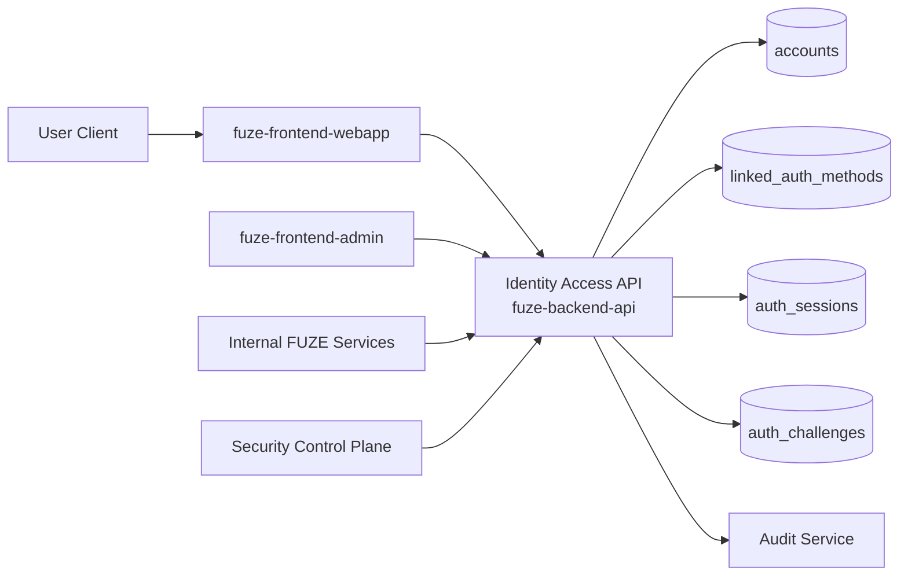
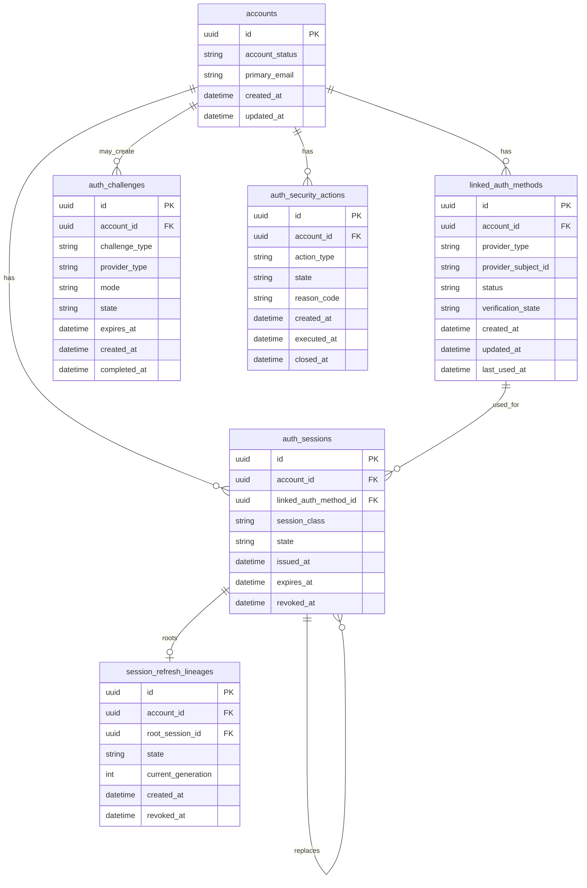
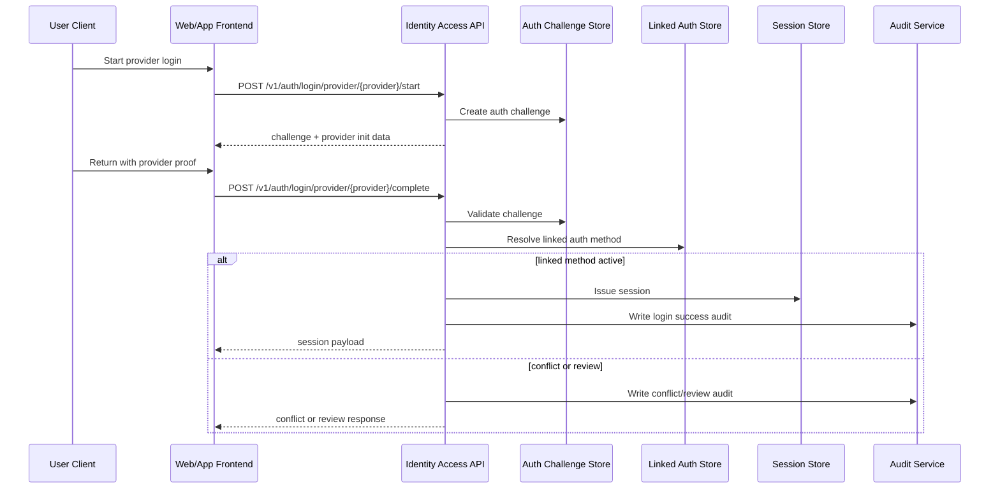

# SESSION_AND_LINKED_LOGIN_API_SPEC

## 1. Title

**SESSION_AND_LINKED_LOGIN_API_SPEC.md**

---

## 2. Document Metadata

- **Document Name:** SESSION_AND_LINKED_LOGIN_API_SPEC.md
- **API Classification:** public, internal, admin, event-driven
- **Owning Domain:** Identity and Access Domain
- **Primary Implementing Repo:** `fuze-backend-api`
- **Primary System of Record:** Identity / Account / Auth Session stores in `fuze-backend-api`
- **Status:** Draft for canonical source-of-truth approval
- **Purpose:** Define the production-grade API contract architecture for authentication sessions, linked login methods, provider linking, session lifecycle, and controlled access continuity across the FUZE ecosystem
- **Canonical Folder:** `fuze.ac > docs > api-spec`

---

## 3. Purpose

This document defines the canonical API specification for FUZE session management and linked login operations. It translates the governing platform identity, auth/session, ownership, API, and security architecture into an implementation-ready API contract specification.

This specification exists to preserve a core FUZE rule:

> the canonical FUZE account is the durable identity, while linked login methods and sessions are controlled access mechanisms to that account.

Accordingly, this API specification defines how callers authenticate, how the platform issues and manages session state, how provider-based login methods are linked or removed, how access continuity is preserved across products, and how sensitive auth-related actions remain auditable, ownership-safe, and security-controlled.

---

## 4. Scope

This specification covers:

- login initiation and completion APIs
- linked-login discovery and management APIs
- session issuance, refresh, inspection, revocation, and global reset APIs
- provider-link add/remove flows
- account-access continuity rules as expressed through APIs
- first-party authenticated user APIs
- internal identity-domain APIs needed by other trusted FUZE services
- admin/control-plane operations for security-sensitive intervention
- event emission requirements for auth/session lifecycle changes
- request, response, error, idempotency, versioning, audit, and database-shape rules for this domain

This specification does **not** redefine:

- canonical account identity semantics
- workspace membership or role truth
- wallet ownership semantics
- product entitlements
- product-local login systems
- governance, treasury, payout, or credits rules

Those are governed by their own source-of-truth specifications.

---

## 5. Source-of-Truth Inputs

### Primary FUZE docs and specs used

#### Highest-priority platform and ownership sources
- `SYSTEM_SPEC_INDEX.md`
- `SYSTEM_BOUNDARY_AND_OWNERSHIP_SPEC.md`
- `SYSTEM_OVERVIEW_AND_BOUNDARIES_SPEC.md`
- `PLATFORM_ARCHITECTURE_SPEC.md`
- `DOMAIN_OWNERSHIP_MATRIX_SPEC.md`
- `DATA_MODEL_AND_ENTITY_OWNERSHIP_SPEC.md`

#### Primary auth / identity sources
- `IDENTITY_AND_ACCOUNT_SPEC.md`
- `AUTH_SESSION_AND_LINKED_LOGIN_SPEC.md`
- `ROLE_PERMISSION_AND_ACCESS_CONTROL_SPEC.md`
- `WORKSPACE_AND_ORGANIZATION_SPEC.md`
- `WALLET_AWARE_USER_SPEC.md`

#### API and runtime sources
- `API_ARCHITECTURE_SPEC.md`
- `PUBLIC_API_SPEC.md`
- `INTERNAL_SERVICE_API_SPEC.md`
- `IDEMPOTENCY_AND_VERSIONING_SPEC.md`
- `EVENT_MODEL_AND_WEBHOOK_SPEC.md`
- `MIGRATION_AND_BACKWARD_COMPATIBILITY_SPEC.md`
- `AUDIT_LOG_AND_ACTIVITY_SPEC.md`

#### Security and operations sources
- `SECURITY_AND_RISK_CONTROL_SPEC.md`
- `SECRETS_CONFIG_AND_ENVIRONMENT_SPEC.md`
- `MONITORING_ALERTING_AND_INCIDENT_RESPONSE_SPEC.md`

#### Format guides
- `The_API_Specification_guide.md`
- `Database_Schemas_Guide.md`

### Highest-priority interpretation applied

For this file, the most important governing interpretation is:

1. identity domain owns durable account access truth
2. session and linked-login APIs belong to `fuze-backend-api`
3. frontends consume and trigger auth flows but do not own auth truth
4. linked login methods are access paths, not separate identities
5. session state is temporary authenticated runtime state, not canonical identity
6. wallet-aware and workspace-aware behavior depend on the canonical account but do not redefine it

### Supporting external standards used only as guidance

- HTTP semantics for request/response and auth-sensitive status behavior
- RFC 9457 problem-details style for machine-readable error responses
- standard API security practices for session-sensitive and auth-sensitive interfaces

External standards do not override FUZE source-of-truth documents.

---

## 6. Governing Architecture and Ownership Interpretation

This API belongs to the **Identity and Access Domain** because session issuance, provider linking, login continuity, auth revocation, and security-sensitive access transitions are all part of controlled account access, not part of frontend state, product state, or workspace state.

This API is implemented primarily in `fuze-backend-api` because:

- backend owns durable business truth
- auth and session are platform services, not frontend-owned features
- control-plane and support interventions must go through backend-owned authorization and audit paths
- internal services may need trusted auth-context introspection APIs
- event emission and audit generation must be backend-governed

This API is **not** owned by:

- `fuze-frontend-webapp`, because frontend only initiates and consumes auth/session flows
- `fuze-frontend-admin`, because admin may trigger privileged operations but must not own session truth
- `fuze-contracts`, because auth/session is not an on-chain canonical domain
- product domains such as QTB, AIMM, ZAGA, AIE, HerHelp, Botmad, or ToolGrid, because products consume canonical account context rather than redefining login state
- wallet-aware user domain, because wallets are adjacent participation links, not the canonical auth/session owner

### Architectural implications

- one canonical account may have multiple linked login methods
- each provider-subject may map to at most one active canonical account link
- sessions are issued only after successful auth and policy checks
- workspace context is resolved after account authentication, not instead of it
- product access occurs after session establishment and authorization, not during provider authentication itself
- linked login add/remove operations are sensitive mutations and must be audited
- session revocation and provider-link changes are security-bearing actions and must support strong lineage and operator review where needed

---

## 7. Domain Responsibilities

The session and linked-login API domain is responsible for:

1. authenticating access methods into canonical account context
2. issuing, refreshing, inspecting, and revoking session state
3. managing linked login methods for approved providers
4. preventing duplicate provider-subject conflicts
5. preserving account-access continuity across products
6. enabling controlled recovery-safe access path changes
7. exposing user-safe, internal, and admin-safe interfaces appropriate to caller trust level
8. emitting domain events for session and linked-login changes
9. generating audit records for sensitive authentication actions
10. enforcing security restrictions, restriction states, and session invalidation semantics

The domain is not responsible for:

- defining canonical account entity structure beyond auth-facing needs
- defining workspace roles
- defining product entitlements
- defining wallet-holder eligibility
- defining treasury, payout, or credits rules

---

## 8. Out of Scope

The following are out of scope for this API specification:

- MFA productization details beyond extensible auth challenge hooks
- KYC / legal identity verification
- password cryptographic implementation details
- exact provider SDK selection
- smart-contract wallet ownership truth
- product-domain authorization logic beyond identity/session inputs
- full support playbook for human-led account recovery
- raw secret storage implementation details
- browser-only local session storage design details

Where later detailed specs are needed, they must remain compatible with this API.

---

## 9. Canonical Entities and Data Ownership

### Durable entities

#### 9.1 accounts
- **Owner:** Identity Domain
- **Purpose:** canonical FUZE account identity
- **Nature:** source-of-truth durable entity
- **Notes:** linked logins and sessions attach to accounts; they do not replace them

#### 9.2 linked_auth_methods
- **Owner:** Identity / Access Domain
- **Purpose:** provider-specific access-path bindings to canonical accounts
- **Nature:** source-of-truth durable entity
- **Examples:** email-password, Google, Telegram, future approved providers
- **Constraint:** one provider subject may not be actively linked to multiple accounts

#### 9.3 auth_sessions
- **Owner:** Identity / Access Domain
- **Purpose:** temporary authenticated runtime access records
- **Nature:** source-of-truth durable entity for active/revoked/expired session lineage
- **Important:** session records are durable enough for audit, security response, and revocation, but they are not canonical identity

#### 9.4 session_refresh_lineages
- **Owner:** Identity / Access Domain
- **Purpose:** refresh or rolling-session lineage control
- **Nature:** source-of-truth durable entity if refresh-capable sessions exist

#### 9.5 auth_challenges
- **Owner:** Identity / Access Domain
- **Purpose:** login initiation states, provider-return correlation, re-auth prompts, sensitive action verification gates
- **Nature:** source-of-truth short-lived durable entity

#### 9.6 auth_security_actions
- **Owner:** Identity / Access Domain
- **Purpose:** global logout, provider unlink under review, recovery completion, suspicious activity containment
- **Nature:** durable action records with audit linkage

#### 9.7 auth_audit_events
- **Owner:** Audit / Activity domain, sourced by Identity / Access domain
- **Purpose:** immutable review trail for auth-sensitive actions
- **Nature:** durable audit records

### Derived or cached entities

#### 9.8 current_session_views
- **Owner:** Derived read-model layer
- **Purpose:** convenience read model for user-facing session listings
- **Nature:** derived, not canonical source of truth

#### 9.9 account_access_summary_views
- **Owner:** Derived read-model layer
- **Purpose:** summarize linked methods, recent access, risk flags
- **Nature:** derived, not source-of-truth

#### 9.10 provider_profile_cache
- **Owner:** Identity / Access Domain
- **Purpose:** provider metadata cache where needed
- **Nature:** cache only; canonical truth remains linked-auth and account state

---

## 10. State Model and Lifecycle

### 10.1 linked auth method lifecycle

Possible states:

- `pending_verification`
- `active`
- `disabled`
- `removed`
- `blocked_conflict`
- `blocked_risk_review`

Lifecycle notes:
- new provider link may begin in `pending_verification`
- only `active` methods can serve as normal login paths
- `disabled` methods may remain historically attached but unusable
- `removed` methods are not active access paths
- `blocked_conflict` or `blocked_risk_review` stop use until resolved

### 10.2 session lifecycle

Possible states:

- `issued`
- `active`
- `rotated`
- `expired`
- `revoked`
- `invalidated_security`
- `logged_out`

Lifecycle notes:
- `issued` transitions quickly to `active` upon completion of issuance
- `rotated` indicates replaced access session lineage where supported
- `expired` is passive end-of-life
- `revoked` is intentional targeted or global disablement
- `invalidated_security` is higher-severity invalidation caused by risk, compromise, or account restriction
- `logged_out` represents normal voluntary closure

### 10.3 auth challenge lifecycle

Possible states:

- `created`
- `awaiting_provider_completion`
- `awaiting_user_confirmation`
- `completed`
- `failed`
- `expired`
- `cancelled`

### 10.4 sensitive security action lifecycle

Possible states:

- `requested`
- `approved_if_required`
- `executed`
- `failed`
- `reversed_if_supported`
- `closed`

---

## 11. API Surface Overview

The API surface is divided into four families:

### 11.1 Public / first-party user-facing APIs
Used by `fuze-frontend-webapp` and approved first-party clients for:
- login initiation
- login completion
- session introspection
- logout
- session listing
- linked method listing
- linked method addition and removal
- access continuity safety checks

### 11.2 Internal service APIs
Used by trusted internal services for:
- auth-context verification
- session-to-account resolution
- service-safe auth state lookups
- restricted initiation of auth-related security actions

### 11.3 Admin / control-plane APIs
Used by `fuze-frontend-admin` via backend-only privileged routes for:
- forced session revocation
- account-wide access reset
- controlled provider disablement
- review-state transitions where support/security policy allows

### 11.4 Event-driven interfaces
Used for downstream side effects:
- audit generation
- security alerting
- notification handling
- analytics and monitoring
- support timeline enrichment

---

## 12. Authentication and Authorization Model

### 12.1 Authentication posture by route family

#### Public unauthenticated routes
Used only for login initiation or provider callback completion where appropriate:
- `POST /v1/auth/login/email`
- `POST /v1/auth/login/provider/{provider}/start`
- `POST /v1/auth/login/provider/{provider}/complete`

#### Authenticated user routes
Require valid authenticated session:
- current session read
- session listing
- single-session logout
- all-session logout
- linked login listing
- provider add/remove requests

#### Internal service routes
Require internal service identity with explicit least privilege:
- session introspection
- account auth-context verification
- security-event coordination

#### Admin routes
Require privileged operator identity plus role checks and reason-coded mutation requirements:
- forced revoke
- global account logout
- provider disable/reenable
- support-approved recovery-close actions

### 12.2 Authorization checkpoints

Authorization must evaluate:
- canonical account identity
- session validity
- scope of requested action
- whether action is sensitive
- role or operator permission if admin path
- whether account is restricted, suspended, or under security review
- whether linked-method mutation would strand the account without an approved recovery path

### 12.3 Sensitive action rules

The following require heightened checks:
- add linked login method
- remove linked login method
- global logout
- forced revoke of all sessions
- recovery-close operations
- provider disable/reenable by operator
- account access reset after suspicious activity

---

## 13. API Endpoints / Interface Contracts

## 13.1 Public / First-Party User APIs

### 13.1.1 `POST /v1/auth/login/email`
**Purpose:** authenticate via email + password and issue session state  
**Caller Type:** unauthenticated first-party or approved client  
**Auth Expectation:** none before request  
**Request Body Summary:**
- `email`
- `password`
- optional `device_label`
- optional `client_context`
- optional `idempotency_key` for safe retry envelope if login orchestration uses challenge creation
**Response Summary:**
- on success: session issuance payload and account summary
- on challenge-needed: auth challenge payload
- on failure: problem details
**Side Effects:**
- may create auth challenge
- may issue session record
- updates linked method last-used fields where appropriate
**Idempotency Behavior:** login is not a business mutation in the same sense as credits issuance, but duplicate request replay should not create uncontrolled duplicate active session issuance if the same challenge/request token is replayed during a short safety window
**Audit Requirements:** success/failure logging, account access event, correlation ID
**Emitted Events:** `auth.login_succeeded`, `auth.login_failed`, `auth.session_issued`

### 13.1.2 `POST /v1/auth/login/provider/{provider}/start`
**Purpose:** initiate provider-based login or link-intent challenge  
**Caller Type:** unauthenticated user or authenticated user in link mode  
**Request Body Summary:**
- `mode` (`login` or `link`)
- optional `return_uri`
- optional `device_label`
- optional `existing_session_assertion` when `mode=link`
**Response Summary:**
- challenge ID
- provider redirect instructions or provider-init parameters
- expiry metadata
**Side Effects:** creates auth challenge
**Idempotency Behavior:** same request fingerprint may return the currently active challenge until expiry
**Audit Requirements:** initiation audit only if policy requires
**Emitted Events:** `auth.challenge_created`

### 13.1.3 `POST /v1/auth/login/provider/{provider}/complete`
**Purpose:** complete provider authentication and resolve canonical account outcome  
**Caller Type:** unauthenticated or challenge-bearing client  
**Request Body Summary:**
- `challenge_id`
- provider return payload or proof bundle
- optional `client_context`
**Response Summary:**
- session issuance payload if successful
- conflict payload if duplicate-account or link conflict exists
- verification-needed or review-needed payload if not immediately completable
**Side Effects:**
- may activate linked_auth_method
- may create account if allowed by policy
- may issue session
- may mark conflict/review state
**Idempotency Behavior:** challenge completion is idempotent by challenge ID and provider completion token
**Audit Requirements:** full audit on success, conflict, or security denial
**Emitted Events:** `auth.login_succeeded`, `auth.linked_method_activated`, `auth.session_issued`, `auth.link_conflict_detected`

### 13.1.4 `GET /v1/auth/session`
**Purpose:** retrieve current authenticated session and account-access context  
**Caller Type:** authenticated user  
**Response Summary:**
- current session metadata
- account ID
- active auth method summary
- recent auth posture flags
- workspace-agnostic access context summary
**Side Effects:** none
**Audit Requirements:** ordinary access logging only
**Emitted Events:** none required

### 13.1.5 `GET /v1/auth/sessions`
**Purpose:** list active and recent sessions for current account  
**Caller Type:** authenticated user  
**Response Summary:**
- session list
- active session flag
- client/device metadata where policy allows
- state, issued_at, last_seen_at, expires_at
**Side Effects:** none
**Audit Requirements:** access logging
**Emitted Events:** none required

### 13.1.6 `DELETE /v1/auth/sessions/current`
**Purpose:** log out current session  
**Caller Type:** authenticated user  
**Request Body Summary:** optional reason
**Response Summary:** successful logout acknowledgement
**Side Effects:** current session marked `logged_out` or `revoked`
**Idempotency Behavior:** repeated delete of same current session returns success-equivalent terminal response
**Audit Requirements:** logout event
**Emitted Events:** `auth.session_logged_out`

### 13.1.7 `POST /v1/auth/sessions/revoke`
**Purpose:** revoke one or more user-owned sessions other than current if allowed  
**Caller Type:** authenticated user  
**Request Body Summary:**
- `session_ids[]`
- optional `reason_code`
**Response Summary:** list of affected sessions and outcomes
**Side Effects:** targeted session revocation
**Idempotency Behavior:** idempotent by request idempotency key or terminal session state
**Audit Requirements:** security-sensitive audit
**Emitted Events:** `auth.session_revoked`

### 13.1.8 `POST /v1/auth/sessions/revoke-all`
**Purpose:** revoke all revocable sessions for current account, optionally excluding current session until replacement issuance  
**Caller Type:** authenticated user  
**Request Body Summary:**
- `exclude_current` boolean
- optional `reason_code`
**Response Summary:** count and summary of revoked sessions
**Side Effects:** account-wide session reset
**Idempotency Behavior:** idempotent by idempotency key and resulting terminal state
**Audit Requirements:** high-sensitivity audit
**Emitted Events:** `auth.all_sessions_revoked`

### 13.1.9 `GET /v1/auth/linked-logins`
**Purpose:** list linked auth methods for current account  
**Caller Type:** authenticated user  
**Response Summary:**
- linked methods
- provider types
- status
- created_at
- last_used_at where available
- whether method is currently removable under continuity policy
**Side Effects:** none
**Audit Requirements:** access logging
**Emitted Events:** none required

### 13.1.10 `POST /v1/auth/linked-logins/{provider}/begin-link`
**Purpose:** begin linking a new provider to the currently authenticated account  
**Caller Type:** authenticated user  
**Request Body Summary:**
- optional re-auth assertion
- optional return URI
**Response Summary:** challenge created and provider instructions
**Side Effects:** creates link-intent challenge
**Idempotency Behavior:** active challenge reuse allowed
**Audit Requirements:** sensitive-action audit
**Emitted Events:** `auth.link_challenge_created`

### 13.1.11 `POST /v1/auth/linked-logins/{provider}/complete-link`
**Purpose:** complete link of provider to current account  
**Caller Type:** authenticated user with active link challenge  
**Request Body Summary:**
- `challenge_id`
- provider completion payload
**Response Summary:** linked method summary
**Side Effects:** creates or activates linked method if uniqueness and security checks pass
**Idempotency Behavior:** idempotent by challenge and provider proof
**Audit Requirements:** high-sensitivity audit
**Emitted Events:** `auth.linked_method_added`

### 13.1.12 `DELETE /v1/auth/linked-logins/{linked_method_id}`
**Purpose:** remove one linked login method from current account  
**Caller Type:** authenticated user  
**Request Body Summary:**
- optional `reason_code`
- optional re-auth assertion
**Response Summary:** removed method summary
**Side Effects:** linked method transitions to removed/disabled
**Idempotency Behavior:** repeat deletion of terminally removed method returns terminal success-equivalent state
**Audit Requirements:** high-sensitivity audit
**Emitted Events:** `auth.linked_method_removed`
**Special Constraint:** must fail if removal would leave account without approved access continuity unless policy-approved recovery path is already established

### 13.1.13 `GET /v1/auth/access-continuity`
**Purpose:** return access continuity safety summary for current account  
**Caller Type:** authenticated user  
**Response Summary:**
- count of viable active methods
- current recommended backup path status
- whether account is at access-stranding risk
- actionable next steps summary
**Side Effects:** none
**Audit Requirements:** access logging only
**Emitted Events:** none required

## 13.2 Internal Service APIs

### 13.2.1 `POST /internal/v1/auth/session-introspections`
**Purpose:** resolve session token/assertion into canonical auth context  
**Caller Type:** internal trusted services  
**Auth Expectation:** service-to-service identity only  
**Request Body Summary:**
- session credential or session reference
- requested detail level
**Response Summary:**
- account ID
- session ID
- auth state
- restriction flags
- linked auth method summary
- scope-safe auth context
**Side Effects:** none
**Audit Requirements:** internal access log
**Emitted Events:** none required

### 13.2.2 `GET /internal/v1/accounts/{account_id}/auth-context`
**Purpose:** retrieve account auth posture summary for trusted services  
**Caller Type:** internal trusted services with least privilege  
**Response Summary:**
- account status
- active session counts
- linked method summary
- restriction/risk posture summary
**Side Effects:** none

### 13.2.3 `POST /internal/v1/auth/security-actions/global-revoke`
**Purpose:** trigger controlled global session revoke as part of security workflow  
**Caller Type:** restricted internal security workflows only  
**Request Body Summary:**
- `account_id`
- `reason_code`
- `correlation_reference`
**Response Summary:** action record and revoke summary
**Side Effects:** revokes all active sessions
**Idempotency Behavior:** required
**Audit Requirements:** critical audit
**Emitted Events:** `auth.all_sessions_revoked`, `security.account_access_reset`

## 13.3 Admin / Control-Plane APIs

### 13.3.1 `POST /admin/v1/accounts/{account_id}/auth/force-revoke-all`
**Purpose:** privileged forced revocation of all active sessions  
**Caller Type:** admin/security operator  
**Authorization:** privileged role + reason required  
**Request Body Summary:**
- `reason_code`
- `operator_note`
- optional `notify_user`
**Response Summary:** action record and counts
**Side Effects:** forced revoke all sessions
**Audit Requirements:** critical audit
**Emitted Events:** `auth.all_sessions_revoked`, `security.operator_forced_logout`

### 13.3.2 `POST /admin/v1/accounts/{account_id}/auth/linked-methods/{linked_method_id}/disable`
**Purpose:** disable a linked auth method without deleting historical linkage  
**Caller Type:** admin/security operator  
**Request Body Summary:**
- `reason_code`
- `operator_note`
**Response Summary:** disabled method summary
**Side Effects:** linked method becomes disabled
**Audit Requirements:** critical audit
**Emitted Events:** `auth.linked_method_disabled`

### 13.3.3 `POST /admin/v1/accounts/{account_id}/auth/linked-methods/{linked_method_id}/reenable`
**Purpose:** re-enable a previously disabled method when policy allows  
**Caller Type:** admin/security operator  
**Request Body Summary:**
- `reason_code`
- `operator_note`
**Response Summary:** method summary
**Side Effects:** disabled -> active if permitted
**Audit Requirements:** critical audit
**Emitted Events:** `auth.linked_method_reenabled`

### 13.3.4 `POST /admin/v1/accounts/{account_id}/auth/access-recovery-close`
**Purpose:** close controlled account access recovery workflow  
**Caller Type:** support/security operator under policy  
**Request Body Summary:**
- `recovery_case_id`
- `resolution_code`
- `enforce_global_revoke`
**Response Summary:** recovery-close action summary
**Side Effects:** may revoke sessions, enable/disable methods, close review state
**Audit Requirements:** critical audit
**Emitted Events:** `auth.recovery_completed`

---

## 14. Request Rules

### 14.1 General request rules
- all mutation-capable routes must require JSON requests with explicit content type
- all mutation routes must carry correlation IDs
- security-sensitive mutations must carry idempotency keys
- admin mutations must require reason codes and operator notes
- provider completion routes must validate challenge expiry and provider proof integrity
- no route may accept frontend-owned truth that bypasses backend validation

### 14.2 Sensitive-action request requirements
The following requests require heightened validation:
- link addition
- link removal
- global revoke
- admin force-revoke
- provider disable/reenable
- recovery close

Heightened validation may include:
- recent re-auth assertion
- active session confirmation
- anti-CSRF protection if browser-based
- challenge-binding verification
- operator role confirmation
- policy precondition checks

### 14.3 Provider-specific rule
Provider return payloads must be normalized into provider-agnostic auth resolution structures inside the backend. API contracts may vary by provider payload input shape, but the backend must translate them into canonical auth logic.

### 14.4 Continuity protection rule
Any request that would leave the account with zero approved access paths must fail unless an approved recovery or replacement path is already in force.

---

## 15. Response Rules

### 15.1 Success response rules
Successful responses must include:
- stable resource identifiers
- timestamps for issued/changed state
- state/status values
- correlation or request references where relevant

### 15.2 Async-accepted response rules
If a sensitive auth action is queued for internal review or async completion, the response must:
- return accepted status
- include action or challenge ID
- provide status-check or follow-up semantics

### 15.3 Terminal mutation response rules
Terminal mutation responses must clearly show:
- target entity identifier
- pre/post or resulting state
- any continuity or security effect
- whether current session remained valid

### 15.4 Read response rules
Read responses must distinguish:
- durable source data
- derived convenience flags
- policy hints
- user-facing summaries that are not source-of-truth fields

---

## 16. Error Model

The API uses structured problem-details style error responses with stable error codes.

### 16.1 Required error fields
- `type`
- `title`
- `status`
- `code`
- `detail`
- `instance`
- `correlation_id`

### 16.2 Common error codes

#### Authentication / credential errors
- `AUTH_INVALID_CREDENTIALS`
- `AUTH_PROVIDER_PROOF_INVALID`
- `AUTH_CHALLENGE_EXPIRED`
- `AUTH_CHALLENGE_INVALID`

#### Authorization / permission errors
- `AUTH_SESSION_REQUIRED`
- `AUTH_REAUTH_REQUIRED`
- `AUTH_OPERATOR_PERMISSION_DENIED`

#### State conflict errors
- `AUTH_LINK_CONFLICT`
- `AUTH_PROVIDER_ALREADY_LINKED`
- `AUTH_METHOD_ALREADY_REMOVED`
- `AUTH_SESSION_ALREADY_TERMINAL`

#### Policy / safety errors
- `AUTH_ACCESS_CONTINUITY_VIOLATION`
- `AUTH_ACCOUNT_RESTRICTED`
- `AUTH_ACCOUNT_SUSPENDED`
- `AUTH_SECURITY_REVIEW_REQUIRED`

#### Request integrity errors
- `AUTH_IDEMPOTENCY_KEY_REQUIRED`
- `AUTH_REQUEST_INVALID`
- `AUTH_REQUEST_UNPROCESSABLE`

#### Dependency or provider errors
- `AUTH_PROVIDER_UNAVAILABLE`
- `AUTH_DEPENDENCY_TIMEOUT`

### 16.3 Error handling rules
- do not expose raw provider internals in client-visible detail
- do not expose secret validation logic
- return actionable but bounded explanations
- distinguish credential failure from conflict or review states
- include retry guidance only where safe

---

## 17. Idempotency and Mutation Safety

### 17.1 Required idempotent mutations
The following mutation routes require idempotent behavior:
- session revoke
- session revoke-all
- complete provider login by challenge ID
- complete link by challenge ID
- remove linked method
- admin force-revoke-all
- admin disable/reenable method
- recovery-close action

### 17.2 Idempotency key rules
- user/admin mutation requests must supply `Idempotency-Key` where required
- backend stores key scope, request hash, actor, and terminal result
- replay of same semantic request returns original terminal outcome
- replay of key with different semantic request must fail with conflict

### 17.3 Mutation safety rules
- session state transitions must be monotonic toward terminal states
- challenge completion must be single-effective
- provider link uniqueness must be transactionally protected
- global revoke must be safe under retries and concurrent execution
- remove-link operations must re-check continuity at commit time

---

## 18. Versioning and Compatibility Rules

### 18.1 Versioning
This API family is versioned under `/v1` or `/internal/v1` or `/admin/v1` route families.

### 18.2 Compatibility approach
- additive evolution preferred
- no silent semantic change to core state values
- provider additions may be introduced without breaking existing providers
- response fields may be added but existing fields must remain stable through compatibility window

### 18.3 Breaking-change rules
Breaking changes include:
- changing meaning of session state values
- changing linked auth lifecycle states incompatibly
- removing key response fields
- changing continuity protection semantics

Such changes require explicit migration planning and version evolution.

### 18.4 Deprecation
Deprecated routes or fields must:
- be documented explicitly
- carry deprecation metadata where supported
- preserve migration windows long enough for first-party consumers and future SDKs

---

## 19. Event Emission and Webhook Behavior

This domain is event-capable, but external webhooks for raw auth internals should remain conservative.

### 19.1 Internal events
The identity/access domain must emit canonical internal events such as:
- `auth.challenge_created`
- `auth.login_succeeded`
- `auth.login_failed`
- `auth.session_issued`
- `auth.session_revoked`
- `auth.session_logged_out`
- `auth.all_sessions_revoked`
- `auth.linked_method_added`
- `auth.linked_method_removed`
- `auth.linked_method_disabled`
- `auth.linked_method_reenabled`
- `auth.recovery_completed`
- `auth.link_conflict_detected`

### 19.2 Event payload minimums
Each event should contain:
- event ID
- event type
- occurred_at
- account ID
- linked method or session reference where applicable
- actor type
- correlation ID
- reason code where applicable

### 19.3 External webhook posture
This API spec does not expose ordinary end-user auth events directly to third-party webhooks by default. Any future external auth-related webhook surface must be narrowly scoped, privacy-safe, opt-in, and governed by a separate contract.

---

## 20. Audit and Activity Requirements

The following actions must generate durable audit events:

- login success
- login failure where policy requires
- session issuance
- session revocation
- logout current
- revoke all
- linked method add
- linked method remove
- linked method disable/reenable
- access recovery completion
- operator-forced auth actions
- conflict/review transitions where security relevance exists

### Required audit fields
- audit event ID
- actor type and actor reference
- account ID
- target session or linked method reference if applicable
- action type
- before/after state summary where applicable
- reason code
- correlation ID
- operator note if operator action
- occurred_at

User-facing activity feeds may show a filtered subset, but audit truth must remain durable and immutable.

---

## 21. Data Model and Database Schema View

### 21.1 `accounts`
- `id` PK
- `account_status`
- `primary_email` nullable
- `created_at`
- `updated_at`
- audit columns

**Notes:** canonical identity record owned by identity domain.

### 21.2 `linked_auth_methods`
- `id` PK
- `account_id` FK -> `accounts.id`
- `provider_type`
- `provider_subject_id`
- `provider_email_hint` nullable
- `status`
- `verification_state`
- `created_at`
- `updated_at`
- `last_used_at` nullable
- `disabled_at` nullable
- `removed_at` nullable
- `risk_flag_json` nullable
- `created_by_actor_type`
- `created_by_actor_id` nullable

**Constraints:**
- unique (`provider_type`, `provider_subject_id`) for active/non-removed link space
- index on `account_id`
- index on (`account_id`, `status`)

### 21.3 `auth_challenges`
- `id` PK
- `challenge_type`
- `provider_type` nullable
- `mode`
- `account_id` nullable
- `linked_method_id` nullable
- `state`
- `request_fingerprint_hash`
- `nonce_hash`
- `expires_at`
- `created_at`
- `completed_at` nullable
- `failure_code` nullable
- `correlation_id`

**Constraints:**
- index on `account_id`
- index on `state`
- index on `expires_at`

### 21.4 `auth_sessions`
- `id` PK
- `account_id` FK -> `accounts.id`
- `linked_auth_method_id` FK -> `linked_auth_methods.id`
- `session_class`
- `state`
- `issued_at`
- `last_seen_at` nullable
- `expires_at`
- `revoked_at` nullable
- `revocation_reason_code` nullable
- `client_fingerprint_hash` nullable
- `device_label` nullable
- `ip_hash_or_reference` nullable
- `user_agent_summary` nullable
- `replaced_by_session_id` nullable self-FK
- `correlation_id`

**Constraints:**
- index on `account_id`
- index on (`account_id`, `state`)
- index on `expires_at`

### 21.5 `session_refresh_lineages`
- `id` PK
- `account_id` FK -> `accounts.id`
- `root_session_id` FK -> `auth_sessions.id`
- `state`
- `current_generation`
- `created_at`
- `revoked_at` nullable
- `revocation_reason_code` nullable

### 21.6 `auth_security_actions`
- `id` PK
- `account_id` FK -> `accounts.id`
- `action_type`
- `requested_by_actor_type`
- `requested_by_actor_id` nullable
- `reason_code`
- `operator_note` nullable
- `state`
- `created_at`
- `executed_at` nullable
- `closed_at` nullable
- `correlation_id`

### 21.7 `idempotency_records`
- `id` PK
- `idempotency_key`
- `scope_family`
- `actor_reference`
- `request_hash`
- `response_hash`
- `terminal_status`
- `created_at`
- `expires_at`

### 21.8 `audit_log_entries`
Domain-sourced audit records written into the audit domain.

### Normalization notes
- canonical account data stays in `accounts`
- provider link data stays in `linked_auth_methods`
- session data stays in `auth_sessions`
- read-model summaries must not replace canonical tables
- provider profile caches must not become canonical identity fields

### Reconciliation notes
- provider subject uniqueness should be checked transactionally
- global revoke operations must be reconcilable against active session counts
- challenge completion must reconcile one challenge to one terminal outcome

---

## 22. Architecture Diagram — Mermaid flowchart



---

## 23. Data Design — Mermaid Diagram



---

## 24. Flow View

### 24.1 Happy path — email login
1. user submits email + password
2. identity API validates credentials and account state
3. linked auth method is resolved as active
4. session is issued
5. login success audit event is recorded
6. session-issued event is emitted
7. client receives authenticated session payload

### 24.2 Happy path — provider login
1. client starts provider login challenge
2. identity API creates challenge and returns provider init data
3. client completes provider flow and returns proof
4. identity API validates proof and resolves linked provider subject
5. canonical account is resolved
6. session is issued
7. audit and events are recorded

### 24.3 Happy path — add linked login
1. authenticated user requests link begin
2. identity API checks current session and re-auth policy
3. challenge is created
4. user completes provider proof
5. backend validates uniqueness and continuity safety
6. linked method is added/activated
7. audit event is written

### 24.4 Alternate path — provider conflict
1. provider completion identifies subject already linked to another account
2. identity API refuses automatic merge
3. response enters conflict state
4. review or explicit resolution path is required
5. audit record is produced

### 24.5 Failure path — remove final access path
1. user requests removal of linked method
2. backend evaluates viable remaining methods
3. removal would leave account stranded
4. request is denied with continuity violation error
5. audit event records denied attempt where policy requires

### 24.6 Failure and recovery path — suspected compromise
1. security signal triggers account access reset
2. internal or admin route requests global revoke
3. all active sessions are revoked
4. linked methods may be disabled if required
5. audit and security events are emitted
6. user must re-establish trusted access or complete recovery

### 24.7 Retry behavior
- challenge completion retries return same terminal outcome
- targeted revoke retries return terminal state
- global revoke retries return already-completed terminal state
- duplicate link completion with same challenge does not create duplicate linked methods

---

## 25. Data Flows — Mermaid sequenceDiagram



---

## 26. Security and Risk Controls

1. **Provider uniqueness enforcement**  
   Active provider subject collisions must be impossible without explicit conflict or migration workflow.

2. **Re-auth for sensitive mutations**  
   Link addition, link removal, and global revoke require stronger trust than ordinary reads.

3. **Session invalidation precedence**  
   Account restriction or compromise response overrides passive session continuity.

4. **Least privilege internal access**  
   Internal session introspection and security-action routes must be narrowly authorized.

5. **No frontend-owned truth**  
   Neither webapp nor admin frontend may define session truth, linked-provider truth, or continuity policy.

6. **Challenge binding**  
   Provider completion must be bound to created challenge state and expiry.

7. **Audit immutability**  
   Sensitive auth actions require durable immutable audit lineage.

8. **Continuity safety checks**  
   Removal of access methods must preserve recoverable account access posture.

9. **Problem-details discipline**  
   Error bodies must be structured and safe, avoiding secret leakage or provider-sensitive internals.

10. **Replay resistance**  
   Challenge completion and mutation routes must use idempotency and nonce-binding patterns to avoid duplicate or spoofed effect.

---

## 27. Operational Considerations

- session issuance and revoke paths must be highly available because they are critical platform entry functions
- challenge expiry sweeps must run regularly
- expired and revoked sessions should remain queryable for audit/history according to retention policy
- session stores should support efficient account-wide revocation queries
- auth event and audit pipelines must tolerate downstream degradation without losing canonical auth outcome
- operator actions should require searchable reason codes and case references
- monitoring should alert on:
  - spike in login failures
  - spike in provider completion conflicts
  - unusual global revoke actions
  - repeated continuity-violation attempts
  - internal introspection abuse patterns

---

## 28. Acceptance Criteria

1. The API preserves the distinction between canonical account identity, linked login methods, and session state.
2. Only `fuze-backend-api` owns linked login and session truth.
3. A provider subject cannot be actively linked to multiple accounts.
4. Session issuance occurs only after successful auth and policy checks.
5. Linked login removal is blocked when it would strand the account without approved recovery.
6. Global revoke is supported and is idempotent.
7. Sensitive actions generate durable audit records.
8. User-facing reads do not expose unsafe internal provider details.
9. Internal introspection routes are restricted to least-privilege service callers.
10. Admin routes require reason-coded privileged authorization.
11. Event emissions exist for major auth/session mutations.
12. Response and error semantics are stable and machine-readable.
13. Database schema separates canonical tables from derived read models.
14. Mermaid diagrams remain consistent with prose and data model.
15. This API does not confuse wallet-aware participation with authentication identity.

---

## 29. Test Cases

### 29.1 Positive cases
1. Email login succeeds and returns active session payload.
2. Provider login succeeds for an already linked provider method.
3. Authenticated user begins and completes Google link successfully.
4. User lists active sessions and sees current session marked appropriately.
5. User revokes another session successfully.
6. User revokes all sessions except current where policy allows.
7. Admin disables a compromised linked method successfully.

### 29.2 Negative cases
8. Invalid email/password returns `AUTH_INVALID_CREDENTIALS`.
9. Expired challenge returns `AUTH_CHALLENGE_EXPIRED`.
10. Invalid provider proof returns `AUTH_PROVIDER_PROOF_INVALID`.
11. Removal of final viable access path returns `AUTH_ACCESS_CONTINUITY_VIOLATION`.
12. Suspended account login returns `AUTH_ACCOUNT_SUSPENDED`.
13. Reuse of idempotency key with different request body returns conflict.

### 29.3 Authorization cases
14. Unauthenticated call to `GET /v1/auth/session` is rejected.
15. Normal user cannot call admin force-revoke endpoint.
16. Internal service without required privilege cannot call security-action internal route.
17. Authenticated user cannot remove another account’s linked login.

### 29.4 Idempotency and replay cases
18. Repeating `POST /v1/auth/sessions/revoke-all` with same idempotency key returns same terminal result.
19. Replaying provider completion for same challenge does not create second active session beyond allowed issuance behavior.
20. Replaying complete-link for same challenge does not create duplicate linked methods.

### 29.5 Concurrency cases
21. Two concurrent requests to link the same provider subject to two accounts result in one success and one conflict.
22. Concurrent remove-link and revoke-all requests preserve durable state consistency.
23. Concurrent security-triggered global revoke and user logout leave sessions in terminal non-active states without duplication.

### 29.6 Recovery / security cases
24. Security-triggered global revoke invalidates all active sessions.
25. Admin-disabled method cannot be used for login until re-enabled.
26. Recovery-close action emits appropriate audit and event lineage.

### 29.7 Event and audit cases
27. Successful login emits `auth.login_succeeded` and `auth.session_issued`.
28. Linked method removal emits `auth.linked_method_removed`.
29. Forced global revoke emits critical audit event and `auth.all_sessions_revoked`.

---

## 30. Open Questions or Explicit Deferred Decisions

1. Exact MFA challenge shapes are deferred.
2. Exact browser cookie vs token transport details are deferred to implementation/security detail specs.
3. Exact support recovery workflow steps and human review tooling are deferred.
4. Exact provider payload normalization fields are implementation-specific, provided they resolve into the canonical model.
5. Whether certain partner-facing auth-related webhooks ever become public is deferred.
6. Exact session device metadata granularity is deferred to privacy/security implementation policy.

---

## 31. Implementation Notes for `fuze-backend-api`

Recommended backend module layout:

```text
modules/platform/
  identity/
  auth-session/
  role-access/
  workspace-organization/
  wallet-aware/
  audit-log/
```

Implementation guidance:
- keep account identity logic separate from session issuance handlers
- keep provider adapters behind a normalization layer
- use transaction boundaries for provider uniqueness and link completion
- centralize continuity checks in one domain service
- centralize session revoke logic so user, internal, and admin paths share the same canonical mutation engine
- emit events only after canonical state commit succeeds
- publish read models from canonical state; do not let read models mutate auth truth

---

## 32. Frontend Consumption Notes

### For `fuze-frontend-webapp`
- may initiate login and link flows
- may read current session, session list, linked methods, and access continuity summary
- must not infer auth truth from provider client SDK state alone
- must treat session state from backend as authoritative
- should surface continuity warnings when account has only one viable access path

### For `fuze-frontend-admin`
- may trigger privileged revoke/disable/recovery-close actions only through backend admin APIs
- must require operator reason input for sensitive mutations
- must not directly mutate auth truth client-side
- should present immutable audit-linked result summaries after privileged actions

---

## 33. Contract Derivation Notes

### OpenAPI / AsyncAPI
This spec should later derive into:
- auth login operations
- linked login management operations
- session management operations
- internal introspection operations
- admin security-control operations
- shared problem-details schema
- auth event definitions in AsyncAPI

### Future `fuze-sdk`
Future `fuze-sdk` packages may derive:
- `@fuze/sdk-auth`
- shared session client helpers
- linked login management helpers
- typed problem-error models

The SDK must derive from approved API contracts and must not become the source of truth over this narrative specification.
