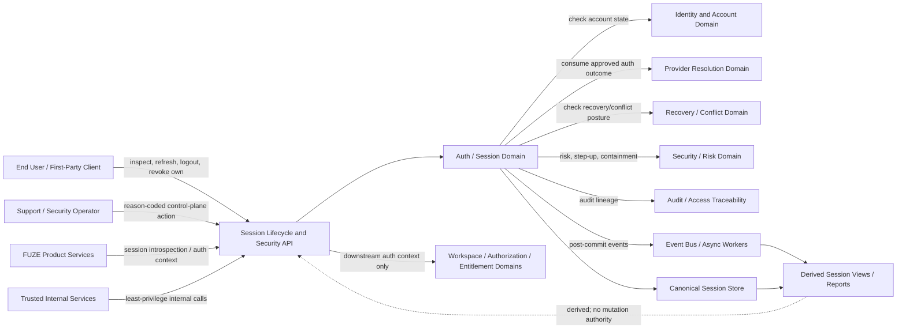
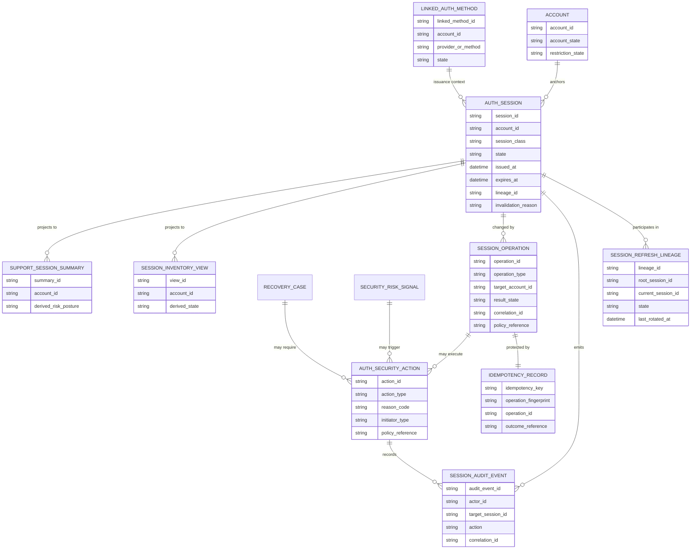
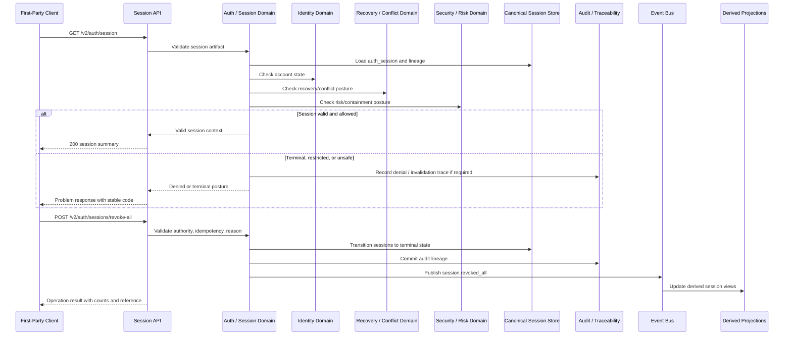

# SESSION_LIFECYCLE_AND_SECURITY_API_SPEC.md

## Document Metadata

- **Document Name:** `SESSION_LIFECYCLE_AND_SECURITY_API_SPEC.md`
- **Document Type:** FUZE API SPEC v2 / Production-grade interface-contract specification
- **Status:** Draft for production-grade API-spec review
- **Version:** 2.0.0
- **Effective Date:** 2026-04-24
- **Last Updated:** 2026-04-24
- **Reviewed On:** 2026-04-24
- **Document Owner:** FUZE Platform Identity / Access Architecture with Session Security API ownership delegated to the Auth / Session Domain
- **Approval Authority:** FUZE Platform Architecture and Governance Authority
- **Review Cadence:** Quarterly or upon material change to session issuance, refresh, rotation, logout, revocation, security invalidation, provider-linking consequences, recovery containment, privileged-session posture, browser/mobile transport policy, audit traceability, or session API exposure
- **Governing Layer:** API SPEC v2 / Identity, Account, Auth, and Session API family
- **Parent Registry:** `API_SPEC_INDEX.md`
- **Upstream Semantic Registry:** `REFINED_SYSTEM_SPEC_INDEX.md`
- **Upstream API Registry:** `API_SPEC_INDEX.md`
- **Primary Audience:** API designers, backend engineers, frontend engineers, mobile/client engineers, security engineers, platform operations, support/control-plane engineers, audit/governance reviewers, OpenAPI/AsyncAPI/SDK authors, QA and contract-validation teams
- **Primary Purpose:** Define the FUZE production API contract for session lifecycle and session security, including issuance handoff, current-session inspection, session inventory, refresh/rotation, logout, targeted revoke, global revoke, security invalidation, containment, privileged-session posture, audit lineage, event emission, idempotency, replay safety, and downstream derivation guardrails.
- **Primary Upstream References:**
  - `REFINED_SYSTEM_SPEC_INDEX.md`
  - `DOCS_SPEC_INDEX.md`
  - `SYSTEM_SPEC_INDEX.md`
  - `API_SPEC_INDEX.md`
  - `FUZE_ACCOUNT_ACCESS_AND_SESSION_THESIS_FINAL_SPEC.md`
  - `FUZE_ACCOUNT_ACCESS_AND_SESSION_CANONICAL_FINAL_SPEC.md`
  - `IDENTITY_AND_ACCOUNT_SPEC.md`
  - `AUTH_SESSION_AND_LINKED_LOGIN_SPEC.md`
  - `FUZE_ACCOUNT_ACCESS_CONTINUITY_SPEC.md`
  - `FUZE_PROVIDER_RESOLUTION_AND_LINKING_SPEC.md`
  - `FUZE_SESSION_LIFECYCLE_AND_SECURITY_SPEC.md`
  - `FUZE_ACCOUNT_RECOVERY_AND_CONFLICT_HANDLING_SPEC.md`
  - `KEY_MANAGEMENT_AND_USER_RECOVERY_SPEC.md`
  - `AUDIT_AND_ACCESS_TRACEABILITY_SPEC.md`
  - `SECURITY_AND_RISK_CONTROL_SPEC.md`
  - `WORKSPACE_AND_ORGANIZATION_SPEC.md`
  - `ROLE_PERMISSION_AND_ACCESS_CONTROL_SPEC.md`
  - `SCOPED_AUTHORIZATION_MODEL_SPEC.md`
  - `ACCESS_EVALUATION_AND_EFFECTIVE_PERMISSION_SPEC.md`
  - `ENTITLEMENT_AND_CAPABILITY_GATING_SPEC.md`
  - `SESSION_AND_LINKED_LOGIN_API_SPEC.md`
  - `AUTH_IDENTITY_API_SPEC.md`
- **Primary Downstream Dependents:**
  - OpenAPI contracts for public and first-party session APIs
  - internal service contracts for session introspection and containment
  - admin/control-plane contracts for operator-triggered session intervention
  - AsyncAPI/event contracts for session lifecycle events
  - SDK authentication/session helpers
  - frontend and mobile session state handling
  - security incident workflows
  - recovery and support tooling
  - audit and observability pipelines
  - product integration specifications that consume authenticated runtime context
- **API Surface Families Covered:** first-party application APIs, internal service APIs, admin/control-plane APIs, event/async APIs, reporting/projection read APIs where derived from canonical session truth
- **API Surface Families Excluded:** canonical account mutation APIs, provider-resolution/linking APIs, account-recovery case APIs, workspace authorization APIs, entitlement APIs, wallet-link APIs, public-read/public-trust APIs, treasury/governance/chain APIs
- **Canonical System Owner(s):** FUZE Auth / Session Domain; coordinated with Identity Domain, Provider Resolution Domain, Recovery / Conflict Domain, Security / Risk Domain, Audit Domain, and downstream Authorization / Entitlement domains
- **Canonical API Owner:** FUZE Platform API Architecture / Auth Session API owner
- **Supersedes:** Session-lifecycle portions of `SESSION_AND_LINKED_LOGIN_API_SPEC.md` where this API v2 document is narrower, stricter, or more explicit
- **Superseded By:** Not yet known
- **Related Decision Records:** Not explicitly available in retrieved governing materials
- **Canonical Status Note:** This API spec derives from `FUZE_SESSION_LIFECYCLE_AND_SECURITY_SPEC.md`. It owns interface-contract expression only. It MUST NOT redefine refined session, identity, auth-link, provider, recovery, authorization, entitlement, audit, or security semantics.
- **Implementation Status:** Normative API contract baseline; downstream OpenAPI, AsyncAPI, SDK, service, storage, event, audit, and runtime contracts must conform
- **Approval Status:** Drafted for API SPEC v2 inclusion; formal approval record not yet attached
- **Change Summary:** Split session lifecycle/security behavior from the older broad session/linked-login API posture; hardened API boundaries around canonical session truth, session subordination, targeted/global containment, privileged-session constraints, derived read-model safety, idempotency, replay safety, audit lineage, and explicit public/first-party/internal/admin/event distinctions.

---

## Purpose

This document defines the FUZE API contract for **session lifecycle and session security**.

The API layer governed here expresses refined session semantics as implementable interface contracts. It defines how clients and services inspect current runtime authentication, how session state is refreshed or rotated where supported, how logout and revocation behave, how security invalidation and containment are surfaced, how privileged session behavior is bounded, and how session lifecycle events, audit records, correlation identifiers, and idempotency records must be preserved.

This API spec exists because sessions are a live runtime trust boundary in FUZE. A session is not the durable identity. A session is not the provider binding. A session is not workspace authorization. A session is not entitlement. A session is temporary authenticated runtime truth that remains valid only while stronger account, auth-link, continuity, recovery, and security/risk truth allow it.

---

## Scope

This specification governs API contracts for:

1. current session inspection;
2. session inventory and safe device/session summaries;
3. issuance handoff after successful authentication and provider/account resolution;
4. refresh and rotation where supported;
5. current-session logout;
6. targeted revocation of selected sessions;
7. global revocation for an account;
8. security invalidation and containment;
9. privileged-session issuance and termination posture;
10. session effects of recovery completion, password/secret reset, provider correction, account restriction, suspension, and major risk events;
11. internal session introspection;
12. admin/control-plane session interventions;
13. session lifecycle event emission;
14. derived read models and reporting boundaries for session state;
15. request, response, error, status, idempotency, audit, migration, and OpenAPI/AsyncAPI/SDK derivation rules.

---

## Out of Scope

This API spec does not govern:

- canonical account identity creation, merge, deletion, or lifecycle ownership;
- provider normalization, provider subject uniqueness, provider link creation, or provider link correction as a primary owner;
- ordinary login challenge design in full depth;
- account access continuity scoring as a primary owner;
- recovery case decisioning or conflict case closure as a primary owner;
- workspace membership, organization scope, role assignment, permission grant, or entitlement grant;
- wallet verification, wallet-link state, chain ownership, treasury, payout, or governance actions;
- exact cryptographic token format, cookie flags, MFA mechanics, or low-level secret storage;
- product-local UI state machines, except where they must preserve session API truth;
- legal/compliance export detail beyond session API traceability and reporting guardrails.

---

## Design Goals

1. Provide deterministic session API contracts without weakening refined session semantics.
2. Preserve `account_id` as the durable actor anchor while treating sessions as temporary runtime truth.
3. Make account-state, auth-link-state, recovery-state, continuity-state, and risk-state precedence over session continuation explicit at the API boundary.
4. Keep first-party client session ergonomics safe without making clients shadow owners of session truth.
5. Make targeted and global containment available through bounded, auditable API families.
6. Distinguish ordinary logout, revocation, expiry, refresh/rotation, and security invalidation.
7. Support internal service introspection without creating broad hidden write shortcuts.
8. Support admin/operator intervention only through reason-coded, policy-constrained, audited control-plane APIs.
9. Preserve derived read-model safety for session summaries, dashboards, support views, and reporting.
10. Provide enough contract structure for OpenAPI, AsyncAPI, SDKs, QA, observability, and migration planning.

---

## Non-Goals

This API spec is not intended to:

- turn session state into canonical identity;
- treat a valid session as authorization or entitlement;
- expose raw low-level token internals as public contract truth;
- combine provider linking, recovery, and session lifecycle into one ambiguous API owner;
- let frontend session storage or cached user state override backend validation;
- create public APIs for broad session mutation by third parties;
- replace implementation-contract specs, database schemas, cryptographic storage designs, security runbooks, or incident-response playbooks.

---

## Core Principles

### Refined-Semantics First

The refined session lifecycle and security spec owns session meaning. This API spec expresses that meaning through interface contracts.

### Session Runtime Truth

A session represents temporary authenticated runtime access associated with a canonical `account_id`. It MUST NOT become durable identity, provider, authorization, entitlement, wallet, or reporting truth.

### Subordination

Session continuation MUST remain subordinate to account state, linked-auth state, continuity posture, recovery posture, and security/risk controls.

### Backend Authority

Backend session records and owner-domain validation are authoritative. Client-held cookies, headers, tokens, browser storage, mobile caches, and SDK state are transport or convenience artifacts only.

### Explicit Containment

The API layer MUST support targeted containment and global containment. Session termination must be durable, reasoned, auditable, and resistant to stale-client restoration.

### Separation of Permission Layers

A valid session proves authenticated runtime presence. It does not prove workspace membership, organization scope, role assignment, permission grant, entitlement grant, product capability, wallet ownership, or public-registry eligibility.

### Derived Views Stay Derived

Session inventories, support views, dashboards, reports, and analytics projections MAY summarize canonical session records, but they MUST NOT become mutation owners.

---

## Canonical Definitions

- **Session:** Temporary authenticated runtime state associated with a canonical account after successful authentication and policy checks.
- **Session Class:** A bounded category of runtime session, such as web, mobile/app, service-mediated first-party, privileged admin, support-review, or refresh-capable session.
- **Session Lineage:** Durable relationship among session records needed for rotation, refresh, revocation, and audit reconstruction.
- **Session Issuance Handoff:** API-visible transition by which a successful auth/provider/account-resolution outcome creates an owner-domain session record.
- **Session Refresh:** Controlled renewal of runtime access that preserves canonical account identity while rechecking policy and risk posture.
- **Session Rotation:** Replacement or advancement of a session or session credential while preserving lineage under owner-domain rules.
- **Logout:** Ordinary actor-initiated end of a selected session.
- **Targeted Revocation:** Intentional termination of selected sessions or session lineages.
- **Global Revocation:** Intentional termination of all revocable sessions for an account.
- **Security Invalidation:** Higher-severity termination due to compromise suspicion, account restriction, recovery completion, provider correction, operator intervention, or equivalent trust reset.
- **Privileged Session:** Session class enabling admin/control-plane or high-sensitivity operation, subject to stricter issuance, duration, scope, reason, audit, and containment rules.
- **Derived Session View:** A read model, dashboard, inventory, or report derived from canonical session records.

---

## Truth Class Taxonomy

This API spec preserves the following truth classes:

1. **Semantic Truth:** Defined by upstream refined system specs.
2. **API Contract Truth:** Defined here for request/response/error/status/event/idempotency/audit behavior.
3. **Canonical Identity Truth:** `account_id`, account lifecycle, restriction, suspension, and identity continuity owned by the Identity Domain.
4. **Auth-Link Truth:** Approved authentication method and provider-backed binding state owned by Auth / Session / Provider Resolution domains.
5. **Runtime Session Truth:** `auth_session`, refresh lineage, revocation state, invalidation state, privileged-session posture, and session lifecycle owned by Auth / Session Domain.
6. **Policy Truth:** Security, session, risk, recovery, operator, continuity, and transport policy versions that constrain session behavior.
7. **Provider-Input Truth:** Provider callbacks and proof bundles as evidence only until owner-domain validation succeeds.
8. **Recovery / Conflict Truth:** Recovery cases, conflict cases, remediation posture, and approved restoration outcomes owned by Recovery / Conflict domains.
9. **Authorization / Entitlement Truth:** Workspace scope, roles, permissions, effective access, entitlements, and product capabilities evaluated downstream.
10. **Audit / Traceability Truth:** Durable event, actor, reason, policy, operation, and correlation lineage used for reconstruction.
11. **Derived Read-Model Truth:** Session inventories, support views, dashboards, inspection views, analytics, and reporting projections.
12. **Presentation Truth:** Frontend, SDK, UX, email, notification, or support copy that summarizes session state without owning it.

---

## Architectural Position in the Spec Hierarchy

This API spec sits below:

- `REFINED_SYSTEM_SPEC_INDEX.md`
- `FUZE_ACCOUNT_ACCESS_AND_SESSION_THESIS_FINAL_SPEC.md`
- `FUZE_ACCOUNT_ACCESS_AND_SESSION_CANONICAL_FINAL_SPEC.md`
- `IDENTITY_AND_ACCOUNT_SPEC.md`
- `AUTH_SESSION_AND_LINKED_LOGIN_SPEC.md`
- `FUZE_SESSION_LIFECYCLE_AND_SECURITY_SPEC.md`
- `FUZE_PROVIDER_RESOLUTION_AND_LINKING_SPEC.md`
- `FUZE_ACCOUNT_ACCESS_CONTINUITY_SPEC.md`
- `FUZE_ACCOUNT_RECOVERY_AND_CONFLICT_HANDLING_SPEC.md`
- `KEY_MANAGEMENT_AND_USER_RECOVERY_SPEC.md`
- `SECURITY_AND_RISK_CONTROL_SPEC.md`
- `AUDIT_AND_ACCESS_TRACEABILITY_SPEC.md`

It sits beside or above downstream machine-readable and implementation layers:

- OpenAPI route files;
- AsyncAPI session lifecycle event contracts;
- SDK session helpers;
- service-to-service auth-context contracts;
- storage schema contracts;
- audit event schema contracts;
- frontend/mobile state integration contracts;
- support/admin tool implementation contracts.

---

## Upstream Semantic Owners

### `FUZE_SESSION_LIFECYCLE_AND_SECURITY_SPEC.md`

Owns canonical session lifecycle semantics: issuance, continuation, refresh, rotation, expiry, logout, revocation, security invalidation, containment, privileged-session posture, session lineage, and session-derived view boundaries.

### `AUTH_SESSION_AND_LINKED_LOGIN_SPEC.md`

Owns the broader auth/session/linked-login parent model: approved access paths, auth challenges, session issuance boundary, and separation from identity, provider, workspace, authorization, entitlement, wallet, and reporting truth.

### `FUZE_ACCOUNT_ACCESS_AND_SESSION_CANONICAL_FINAL_SPEC.md`

Owns cross-domain account/access/session rules: `account_id` as durable anchor, access paths as access paths, sessions as temporary runtime truth, and account/recovery/risk precedence over session continuation.

### `IDENTITY_AND_ACCOUNT_SPEC.md`

Owns canonical account identity, account lifecycle state, restriction/suspension posture, identity continuity, and account-level mutation authority.

### `FUZE_PROVIDER_RESOLUTION_AND_LINKING_SPEC.md`

Owns provider normalization, provider-subject uniqueness, provider conflict handling, provider-link correction, and provider evidence interpretation before session issuance.

### `FUZE_ACCOUNT_RECOVERY_AND_CONFLICT_HANDLING_SPEC.md`

Owns recovery/conflict case truth, review posture, restoration decisions, and remediation states that may block, constrain, or invalidate sessions.

### `KEY_MANAGEMENT_AND_USER_RECOVERY_SPEC.md`

Owns secret reset, recovery proof, reset lineage, and recovery-sensitive key/secret behavior that may require session containment.

### `SECURITY_AND_RISK_CONTROL_SPEC.md`

Owns risk posture, compromise response, abuse control, step-up posture, containment thresholds, and operator/security intervention policy.

### `AUDIT_AND_ACCESS_TRACEABILITY_SPEC.md`

Owns durable traceability requirements for session issuance, continuation denial, revocation, invalidation, privileged actions, and access-related control events.

---

## API Surface Families

### Public API

This spec does not define broad third-party public session-management APIs. Any public API exposure MUST be narrow, stable, read-biased, and incapable of mutating canonical session state except through explicitly approved user-authenticated actions.

### First-Party Application API

First-party web/mobile/application clients MAY use session APIs for current-session inspection, logout, session listing, refresh/rotation where supported, and self-service revocation.

### Internal Service API

Trusted FUZE services MAY use internal session introspection and session-state lookup APIs for service-side enforcement, but internal APIs MUST NOT become hidden broad-write shortcuts.

### Admin / Control-Plane API

Privileged operators MAY trigger forced revoke, global revoke, invalidation, or containment only through reason-coded, policy-constrained, audited APIs.

### Event / Async API

Session lifecycle changes MUST emit post-commit events where material. Events are downstream notifications, not alternate mutation ownership.

### Reporting / Projection API

Derived session read models MAY exist for support, audit, analytics, and operations. They MUST be marked as derived and MUST NOT permit writes to canonical session truth.

### Chain-Adjacent API

No chain-adjacent session authority is defined. Wallet or chain context may be consumed downstream after valid session establishment but MUST NOT create session truth or bypass invalidation.

---

## System / API Boundaries

This API spec governs interface contracts for canonical session runtime behavior.

It does not govern:

- the canonical identity API surface;
- provider-resolution/linking API surface except where provider outcomes trigger session issuance or containment;
- recovery/conflict API surface except where recovery state constrains or invalidates sessions;
- workspace/authorization/entitlement API surface except where they consume session context;
- chain or wallet API surface;
- low-level cryptographic token design.

Downstream APIs MUST preserve this boundary. They MAY reference session context. They MUST NOT reinterpret it.

---

## Adjacent API Boundaries

- `IDENTITY_AND_ACCOUNT_API_SPEC.md` owns canonical account read/write APIs.
- `AUTH_SESSION_AND_LINKED_LOGIN_API_SPEC.md` owns broader auth challenge and linked-login API posture where not split into narrower v2 specs.
- `PROVIDER_RESOLUTION_AND_LINKING_API_SPEC.md` owns provider start/callback/normalize/link/unlink/review APIs.
- `ACCOUNT_ACCESS_CONTINUITY_API_SPEC.md` owns continuity posture APIs and continuity-sensitive mutation preflight.
- `ACCOUNT_RECOVERY_AND_CONFLICT_HANDLING_API_SPEC.md` owns recovery/conflict case APIs.
- `KEY_MANAGEMENT_AND_USER_RECOVERY_API_SPEC.md` owns secret reset and recovery-proof API contracts.
- `ROLE_PERMISSION_AND_ACCESS_CONTROL_API_SPEC.md`, `SCOPED_AUTHORIZATION_MODEL_API_SPEC.md`, and `ACCESS_EVALUATION_AND_EFFECTIVE_PERMISSION_API_SPEC.md` own downstream permission evaluation.
- `ENTITLEMENT_AND_CAPABILITY_GATING_API_SPEC.md` owns downstream product capability gates.
- `AUDIT_AND_ACCESS_TRACEABILITY_API_SPEC.md` and `AUDIT_LOG_AND_ACTIVITY_API_SPEC.md` own generic audit API and traceability projections.

---

## Conflict Resolution Rules

When API interpretation conflicts arise:

1. Active refined system specs win on semantic truth.
2. `FUZE_SESSION_LIFECYCLE_AND_SECURITY_SPEC.md` wins on session lifecycle and session security meaning.
3. `FUZE_ACCOUNT_ACCESS_AND_SESSION_CANONICAL_FINAL_SPEC.md` wins on cross-domain account/access/session separation.
4. `IDENTITY_AND_ACCOUNT_SPEC.md` wins on canonical account truth.
5. `FUZE_PROVIDER_RESOLUTION_AND_LINKING_SPEC.md` wins on provider evidence and provider-link outcomes.
6. `FUZE_ACCOUNT_RECOVERY_AND_CONFLICT_HANDLING_SPEC.md` wins on recovery/conflict posture.
7. `SECURITY_AND_RISK_CONTROL_SPEC.md` wins on risk and containment thresholds where applicable.
8. This API spec wins only on interface-contract expression that does not contradict refined semantic owners.
9. Older v1 API specs may inform route discovery and historical posture, but they MUST NOT override refined semantics or this v2 API contract.
10. Derived views, frontend caches, SDK state, dashboards, reports, support summaries, and logs MUST NOT override canonical session records.

---

## Default Decision Rules

1. Default actor anchor is `account_id`.
2. Default session owner is Auth / Session Domain.
3. Default interpretation of session is temporary runtime truth.
4. Default response to stale client session state after backend invalidation is denial.
5. Default response to high-risk uncertainty is fail closed for high-impact actions.
6. Default response to ambiguous provider or recovery posture is deny continuation, require re-auth, or route to review; never silently continue.
7. Default handling for session-affecting side effects is idempotent, replay-safe, audited, and correlation-linked.
8. Default handling for privileged session actions is reason-coded, policy-constrained, time-bounded, and separately auditable.
9. Default handling for derived read disagreement is canonical session record wins.
10. Default handling for public exposure is minimum necessary disclosure.

---

## Roles / Actors / API Consumers

- **End User:** Authenticated actor managing or ending their own sessions.
- **First-Party Client:** FUZE web/mobile/app client initiating approved session reads or self-service mutations.
- **Backend Auth / Session Service:** Canonical session API owner and mutation executor.
- **Identity Service:** Source of account state and account admissibility.
- **Provider Resolution Service:** Source of provider-normalized auth outcomes before issuance.
- **Recovery / Conflict Service:** Source of recovery/conflict posture.
- **Security / Risk Service:** Source of risk, step-up, containment, and compromise posture.
- **Authorization / Entitlement Services:** Downstream consumers of valid session context.
- **Audit / Traceability Service:** Durable record keeper for session actions and lineage.
- **Internal Service Consumer:** Trusted FUZE service using introspection or auth-context APIs.
- **Support / Security Operator:** Privileged actor using admin/control-plane session APIs.
- **Projection / Reporting Consumer:** System consuming derived session views.

---

## Resource / Entity Families

### Canonical API-Facing Resources

- `session`
- `session_lineage`
- `session_inventory_item`
- `session_security_action`
- `session_invalidation`
- `privileged_session`
- `session_introspection_result`
- `session_operation`
- `session_event`
- `session_audit_reference`

### Canonical Owner-Domain Entities

- `auth_session`
- `session_refresh_lineage`
- `auth_security_action`
- `session_audit_event`
- `idempotency_record`
- `operation_record`

### Referenced but Non-Owned Entities

- `account`
- `linked_auth_method`
- `auth_challenge`
- `provider_resolution`
- `recovery_case`
- `conflict_case`
- `security_risk_signal`
- `workspace_context`
- `permission_evaluation`
- `entitlement_evaluation`
- `wallet_link`

### Derived Entities

- `current_session_view`
- `session_inventory_view`
- `support_session_summary`
- `session_activity_report`
- `session_security_dashboard`
- `account_access_summary_view`

Derived entities MUST be regenerable from canonical records and MUST NOT write canonical session state.

---

## Ownership Model

### Auth / Session Domain Owns

- session issuance after approved auth outcome;
- session state transitions;
- refresh/rotation;
- logout;
- targeted revoke;
- global revoke;
- security invalidation execution;
- privileged session lifecycle;
- session inventory source-of-truth;
- session operation records;
- session event emission;
- session audit emission in coordination with Audit Domain.

### Identity Domain Owns

- `account_id`;
- account status;
- account restriction/suspension;
- canonical actor identity;
- identity continuity and account lifecycle.

### Provider Resolution Domain Owns

- provider proof validation outputs;
- provider-subject normalization;
- provider conflict posture;
- provider-link correction signals.

### Recovery / Conflict Domain Owns

- recovery case state;
- conflict case state;
- restoration approval;
- remediation posture.

### Security / Risk Domain Owns

- compromise suspicion;
- risk severity;
- containment thresholds;
- step-up requirements;
- incident-driven session intervention policy.

### Audit Domain Owns

- durable audit taxonomy;
- event lineage;
- actor/reason/policy/correlation traceability;
- audit retention posture.

### Products / Frontends Own

- UI presentation;
- safe session UX;
- initiating allowed first-party calls;
- clearing local transport/convenience state after API terminal outcomes.

They do not own canonical session truth.

---

## Authority / Decision Model

Before session issuance, the API implementation MUST verify:

1. authentication or provider-resolution outcome is approved by owner domain;
2. canonical `account_id` is resolved;
3. linked auth method or credential path is valid;
4. account state permits issuance;
5. recovery/conflict posture does not block issuance;
6. continuity posture does not require denial or remediation;
7. security/risk posture permits issuance;
8. challenge integrity and anti-replay protections are valid;
9. required policy versions are captured;
10. audit/correlation context is available.

Before session continuation, refresh, or rotation, the API implementation MUST re-evaluate applicable account, auth-link, recovery, conflict, risk, and policy posture. A valid-looking session artifact is insufficient.

---

## Authentication Model

### Unauthenticated Inputs

This API spec generally does not own unauthenticated login starts. It MAY accept issuance handoff from an upstream login/provider API through internal owner-domain APIs only.

### Authenticated User Inputs

First-party user session-management APIs require a valid current session unless the route’s purpose is to terminate the current session in a terminal-idempotent way.

### Internal Service Inputs

Internal session APIs require service-to-service authentication, explicit service identity, least-privilege scope, and request lineage.

### Admin / Control Inputs

Admin APIs require privileged operator identity, session class appropriate to the action, authorization evaluation, reason code, operator note where required, policy reference, and audit capture.

---

## Authorization / Scope / Permission Model

Session APIs MUST distinguish:

- authenticated user managing own session(s);
- trusted service introspecting session state;
- product service consuming auth context;
- support operator inspecting bounded session state;
- security operator triggering containment;
- admin operator using privileged session control.

Valid session presence is only the first input. For protected actions, the API MUST evaluate:

- caller type;
- session class;
- operation family;
- target account;
- self vs operator action;
- operator permission;
- policy requirements;
- required step-up or recent-auth posture;
- account/recovery/risk restrictions.

---

## Entitlement / Capability-Gating Model

Entitlements are downstream of session validity.

Session APIs MUST NOT grant product capability. They MAY expose safe flags such as `session_valid`, `requires_workspace_resolution`, `requires_permission_evaluation`, or `requires_entitlement_evaluation`. They MUST NOT emit response fields that imply final product access unless the relevant downstream owner domain has evaluated it.

---

## API State Model

### Session States

- `issued`
- `active`
- `rotated`
- `expired`
- `revoked`
- `invalidated_security`
- `logged_out`

### Operation States

- `accepted`
- `completed`
- `partially_completed`
- `denied`
- `failed`
- `cancelled`
- `requires_reauth`
- `requires_review`

### Invalidation Reasons

Representative stable reason-code families:

- `USER_LOGOUT`
- `USER_TARGETED_REVOKE`
- `USER_GLOBAL_REVOKE`
- `PASSWORD_RESET`
- `SECRET_RESET`
- `RECOVERY_COMPLETED`
- `ACCOUNT_RESTRICTED`
- `ACCOUNT_SUSPENDED`
- `PROVIDER_LINK_CORRECTED`
- `PROVIDER_METHOD_DISABLED`
- `SECURITY_RISK_ELEVATED`
- `COMPROMISE_SUSPECTED`
- `OPERATOR_CONTAINMENT`
- `POLICY_MIGRATION`
- `SYSTEM_ROTATION`

### State Rules

- Terminal session states MUST NOT silently become active.
- Re-establishing access requires owner-controlled re-issuance or approved refresh lineage behavior.
- Hidden destructive rewrites of material session state are forbidden.
- Terminal reason and actor lineage MUST remain reconstructable.

---

## Lifecycle / Workflow Model

### Session Issuance Handoff

1. Upstream auth/provider owner completes authentication or provider resolution.
2. Identity owner confirms `account_id` and account admissibility.
3. Auth / Session owner checks linked-auth status, continuity posture, recovery/conflict posture, and risk posture.
4. API layer creates session operation record and idempotency record where applicable.
5. Session is issued with `session_class`, validity policy, lineage reference, correlation ID, and audit reference.
6. Response returns a bounded session payload and does not expose raw internal secrets beyond approved transport.
7. Post-commit events are emitted.

### Current Session Inspection

1. Caller presents session transport artifact.
2. Backend validates canonical session record.
3. Backend checks terminal state, lineage status, account state, auth-link state, recovery/conflict posture, and risk posture.
4. Response returns session summary and required downstream checks.
5. Stale or invalidated session returns terminal or unauthenticated response.

### Refresh / Rotation

1. Caller presents refresh-capable session or lineage assertion.
2. Backend checks lineage, replay protection, account state, recovery/conflict posture, risk posture, and policy.
3. Backend rotates or refreshes according to session class.
4. Old credential or lineage element is marked replaced/rotated where applicable.
5. Response returns new bounded runtime envelope and operation reference.
6. Duplicate retry returns same operation outcome or terminal conflict, never duplicate active lineage.

### Logout Current

1. Caller requests current-session logout.
2. Backend transitions current session to `logged_out` or equivalent terminal state.
3. Local transport clearing instructions are returned.
4. Duplicate logout returns success-equivalent terminal outcome.

### Targeted Revocation

1. Caller identifies session(s) or lineage(s) to revoke.
2. Backend verifies caller may revoke target(s).
3. Backend records operation, reason, policy, and audit lineage.
4. Target sessions transition to `revoked` or `invalidated_security`.
5. Events and derived view updates are emitted.

### Global Revocation

1. Caller requests account-wide revocation or security workflow triggers it.
2. Backend verifies self-service or admin authority.
3. Backend creates `auth_security_action` and idempotency record.
4. All revocable sessions are terminated; current session treatment is explicit.
5. Response reports counts, terminal states, operation reference, and whether re-auth is required.
6. Events, audit records, notifications where applicable, and projections are emitted.

### Security Invalidation

1. Security, recovery, provider-correction, account restriction, or operator action identifies unsafe continuation.
2. Session owner receives or computes containment requirement.
3. A reason-coded invalidation action is recorded.
4. Affected sessions transition to `invalidated_security`.
5. Downstream clients and services must treat subsequent introspection as terminal denial.
6. Audit and security events are emitted.

---

## Architecture Diagram — Mermaid flowchart

---

## Data Design — Mermaid Diagram

---

## Flow View

### Primary Synchronous Flow — Current Session Inspection

1. Client sends request with approved transport artifact.
2. Session API authenticates the artifact against backend session truth.
3. Session API loads canonical `auth_session`.
4. API checks terminal state and lineage status.
5. API checks account admissibility, recovery/conflict posture, and risk posture.
6. API returns `200 OK` with bounded session summary if valid.
7. API returns `401`, `403`, `409`, or `423` style problem response if session is absent, terminal, blocked, or policy-denied.
8. API emits observability metrics and access trace where required.

### Async / Post-Commit Flow — Global Containment

1. Security or operator caller submits global revoke with reason code and idempotency key.
2. Session API validates caller authority and target account.
3. Session API records operation and idempotency record.
4. Auth / Session Domain transitions all affected sessions.
5. Audit record is committed.
6. Post-commit events are emitted.
7. Projection workers update derived inventory/support views.
8. Clients discover terminal state on next introspection or receive approved notification if configured.

### Failure and Retry Flow

1. Caller retries a side-effecting mutation with same idempotency key.
2. API compares operation fingerprint.
3. If identical, API returns prior operation outcome.
4. If key is reused for a different fingerprint, API returns idempotency conflict.
5. If operation is partially complete, API returns operation reference and safe status until finalization.
6. Duplicate retries MUST NOT create duplicate active sessions or contradictory revocation outcomes.

### Admin / Operator Flow

1. Operator enters privileged session context.
2. Operator submits bounded control-plane mutation with reason, note, policy reference, and idempotency key.
3. API verifies operator permission and action scope.
4. API rejects action if ordinary application route was used.
5. API executes containment through session owner domain.
6. Audit lineage captures operator, reason, target, policy, result, and correlation.

### Degraded-Mode Flow

1. Derived views or projection workers are stale/unavailable.
2. API continues to use canonical session store and owner-domain checks.
3. If required owner-domain checks are unavailable for high-impact session continuation or mutation, API fails closed or returns `requires_review` / `retry_later` according to policy.
4. API MUST NOT invent session truth from stale derived views.

---

## Data Flows — Mermaid sequenceDiagram

---

## Request Model

All mutation requests MUST include or derive:

- authenticated caller identity where applicable;
- target resource identifier;
- operation type;
- correlation ID or trace ID;
- idempotency key for side-effecting mutations;
- reason code for security-sensitive or privileged mutations;
- client context where policy permits;
- policy version/reference where relevant;
- re-auth or step-up assertion where required;
- explicit target scope for admin/control-plane actions.

Requests MUST NOT include:

- frontend-declared canonical account truth without backend validation;
- client-declared session validity as authority;
- provider claims as session truth;
- workspace permission or entitlement assertions as session authority;
- raw privileged override flags without policy and audit envelope.

---

## Response Model

### Success Response Classes

- `session.current`
- `session.inventory`
- `session.operation.completed`
- `session.operation.accepted`
- `session.operation.partial`
- `session.terminal`
- `session.requires_reauth`
- `session.requires_review`

### Required Response Fields Where Applicable

- stable `session_id` or redacted session reference;
- `account_id`;
- `session_class`;
- `state`;
- `issued_at`;
- `expires_at` or validity policy reference;
- `lineage_id` where applicable;
- `operation_id` for mutations;
- `correlation_id`;
- `audit_reference` for sensitive actions;
- `policy_reference` where relevant;
- `terminal_reason` where applicable;
- `requires_workspace_resolution`;
- `requires_permission_evaluation`;
- `requires_entitlement_evaluation`.

### Presentational Constraints

Responses MAY include safe labels like device label, approximate last activity, or client family when policy permits. Responses MUST NOT leak secrets, raw token material, provider-sensitive payloads, internal risk scoring details, or private operator notes into user-facing surfaces.

---

## Error / Result / Status Model

The API MUST use stable, machine-readable error codes.

### Common HTTP Classes

- `200 OK` for successful reads and completed idempotent terminal outcomes.
- `202 Accepted` for asynchronous or queued containment/review actions.
- `400 Bad Request` for malformed inputs.
- `401 Unauthorized` for missing/invalid session.
- `403 Forbidden` for authenticated caller lacking authority.
- `404 Not Found` only where existence can be safely concealed or resource is unavailable to caller.
- `409 Conflict` for state conflicts, terminal-state conflicts, or idempotency conflicts.
- `423 Locked` or equivalent problem code for account/recovery/security lock posture where FUZE uses that mapping.
- `429 Too Many Requests` for rate-limit or abuse-control denial.
- `500/503` for server or dependency failure, with fail-closed posture for high-impact actions.

### Stable Error Codes

- `SESSION_REQUIRED`
- `SESSION_INVALID`
- `SESSION_EXPIRED`
- `SESSION_REVOKED`
- `SESSION_LOGGED_OUT`
- `SESSION_INVALIDATED_SECURITY`
- `SESSION_REFRESH_NOT_ALLOWED`
- `SESSION_ROTATION_REPLAY_DETECTED`
- `SESSION_LINEAGE_INVALID`
- `SESSION_ALREADY_TERMINAL`
- `ACCOUNT_RESTRICTED`
- `ACCOUNT_SUSPENDED`
- `RECOVERY_POSTURE_BLOCKS_SESSION`
- `CONFLICT_POSTURE_BLOCKS_SESSION`
- `RISK_POSTURE_BLOCKS_SESSION`
- `REAUTH_REQUIRED`
- `STEP_UP_REQUIRED`
- `OPERATOR_PERMISSION_DENIED`
- `REASON_CODE_REQUIRED`
- `POLICY_REFERENCE_REQUIRED`
- `IDEMPOTENCY_KEY_REQUIRED`
- `IDEMPOTENCY_CONFLICT`
- `RATE_LIMITED`
- `DERIVED_VIEW_UNAVAILABLE`
- `OWNER_DOMAIN_UNAVAILABLE_FAIL_CLOSED`

### Result Semantics

Accepted-state responses mean that an operation request was accepted or queued. They do not imply final business outcome unless `operation.state = completed`.

---

## Idempotency / Retry / Replay Model

Idempotency is mandatory for:

- refresh/rotation where replay could create duplicate lineage;
- targeted revoke;
- global revoke;
- security invalidation;
- privileged session actions;
- admin/control-plane session mutations;
- issuance handoff where duplicate callbacks or retries could create duplicate sessions.

Rules:

1. Idempotency keys MUST be scoped to caller, operation family, target account/session, and request fingerprint.
2. Reuse of the same key with the same fingerprint returns the prior result or operation reference.
3. Reuse of the same key with a different fingerprint returns `IDEMPOTENCY_CONFLICT`.
4. Replay of refresh/rotation MUST NOT create multiple active current sessions in the same lineage.
5. Replay of revoke/invalidate MUST return terminal success-equivalent state where the target is already terminal.
6. Provider callback replay MUST be handled upstream by provider resolution; session issuance must still prevent duplicate sessions.
7. Idempotency records MUST be retained long enough to cover retry windows and audit needs.

---

## Rate Limit / Abuse-Control Model

Session APIs MUST apply abuse controls appropriate to route sensitivity.

- Current-session read MAY use ordinary authenticated read limits.
- Refresh/rotation MUST use stricter replay and anomaly controls.
- Revoke-all and security-sensitive mutations MUST use stricter limits and may require step-up.
- Admin/control-plane actions MUST use operator-specific, target-specific, and incident-workflow-aware controls.
- Failed introspection and invalid session attempts SHOULD emit security signals where thresholds are met.
- Rate-limit responses MUST NOT leak sensitive account existence or risk posture.

---

## Endpoint / Route Family Model

The following route families are normative contract families, not final OpenAPI path commitments. Exact paths MAY be adjusted by downstream OpenAPI work if semantics are preserved.

### First-Party User Session APIs

#### `GET /v2/auth/session`

Returns current session truth after backend validation.

Required behavior:
- validates backend session record;
- checks terminal state;
- checks account/recovery/risk blocking posture;
- returns bounded current session context;
- does not return raw secrets;
- does not imply workspace permission or entitlement.

#### `GET /v2/auth/sessions`

Lists active and recent session inventory for the current account.

Required behavior:
- returns derived inventory from canonical session records;
- marks current session;
- provides policy-safe device/client metadata;
- distinguishes active from terminal sessions;
- does not allow mutation through derived inventory state.

#### `POST /v2/auth/sessions/refresh`

Refreshes or rotates session when supported.

Required behavior:
- validates refresh-capable lineage;
- rechecks account, recovery, conflict, and risk posture;
- uses idempotency;
- preserves lineage;
- terminates or rotates old session element according to policy;
- returns `requires_reauth` or denial if policy blocks.

#### `DELETE /v2/auth/sessions/current`

Logs out the current session.

Required behavior:
- terminal and idempotent;
- safe repeated request returns success-equivalent terminal state;
- returns local transport clearing instruction;
- emits logout audit/event where required.

#### `POST /v2/auth/sessions/revoke`

Revokes selected user-owned sessions.

Required behavior:
- requires valid current session;
- validates target session ownership;
- requires idempotency key;
- may require re-auth/step-up;
- returns per-target result.

#### `POST /v2/auth/sessions/revoke-all`

Globally revokes revocable sessions for the current account.

Required behavior:
- requires strong validation;
- requires idempotency key;
- may require re-auth/step-up;
- explicitly states whether current session remains valid until response completes;
- emits high-sensitivity audit and events.

### Internal Service APIs

#### `POST /internal/v2/auth/session-introspections`

Resolves a session reference into backend-validated auth context.

Required behavior:
- accepts only service-authenticated callers;
- returns minimal necessary detail;
- checks terminal, account, recovery, and risk posture;
- distinguishes invalid, expired, revoked, and security-invalidated states where caller is authorized;
- does not grant workspace permission or entitlement.

#### `GET /internal/v2/accounts/{account_id}/sessions/security-posture`

Returns session security posture for trusted internal workflows.

Required behavior:
- read-only;
- least-privilege scoped;
- may include active counts, terminal counts, recent invalidation reasons, and current containment posture;
- derived summaries must be marked as derived.

#### `POST /internal/v2/accounts/{account_id}/sessions/security-invalidation`

Triggers security invalidation from an approved internal security/recovery workflow.

Required behavior:
- restricted to approved services;
- requires reason code, policy reference, correlation reference, and idempotency key;
- returns operation reference;
- emits audit and events.

### Admin / Control-Plane APIs

#### `POST /admin/v2/accounts/{account_id}/sessions/revoke-all`

Operator-triggered global revoke.

Required behavior:
- requires privileged operator session;
- requires explicit permission;
- requires reason code, operator note, policy reference, and idempotency key;
- emits critical audit;
- returns action record and affected counts.

#### `POST /admin/v2/accounts/{account_id}/sessions/{session_id}/invalidate`

Operator-triggered selected security invalidation.

Required behavior:
- cannot be ordinary app route;
- reason-coded and policy-constrained;
- records target session, actor, correlation ID, and resulting terminal state.

#### `GET /admin/v2/accounts/{account_id}/sessions`

Privileged session inspection.

Required behavior:
- read-only;
- redacts secrets;
- marks derived vs canonical fields;
- access is audited.

### Event / Async Families

- `session.issued`
- `session.refreshed`
- `session.rotated`
- `session.expired`
- `session.logged_out`
- `session.revoked`
- `session.revoked_all`
- `session.invalidated_security`
- `session.privileged_issued`
- `session.privileged_terminated`
- `session.containment_action_completed`

Events MUST include stable event ID, occurred time, account reference, session or lineage reference where safe, operation reference, reason code where applicable, policy reference where applicable, and correlation ID.

---

## Public API Considerations

Public session APIs MUST be minimal. No third-party public API may enumerate or mutate session state unless an approved future public API spec explicitly grants that surface. Public docs MAY describe that sessions are temporary and revocable, but must not expose implementation-sensitive session mechanics.

---

## First-Party Application API Considerations

First-party clients MUST:

- treat backend session API responses as authoritative;
- clear local transport/convenience state after terminal outcomes;
- not infer permission or entitlement from session validity;
- handle `requires_reauth`, `requires_review`, and terminal state responses deterministically;
- not retain long-lived bearer material in browser storage if FUZE transport policy forbids it;
- surface safe session inventory without leaking internal risk details.

---

## Internal Service API Considerations

Internal service APIs MUST:

- use service-to-service authentication;
- follow least privilege;
- return only needed details;
- distinguish canonical session facts from derived posture summaries;
- avoid write paths except explicitly approved security/recovery workflows;
- be observable and auditable enough for incident reconstruction.

---

## Admin / Control-Plane API Considerations

Admin/control-plane APIs MUST be:

- separated from ordinary app APIs;
- protected by privileged session class or equivalent operator posture;
- reason-coded;
- policy-constrained;
- idempotent for side-effecting operations;
- audited at critical sensitivity;
- bounded to explicit target account/session/lineage;
- unable to silently alter identity, provider links, recovery cases, workspace permissions, or entitlements.

---

## Event / Webhook / Async API Considerations

Session events are post-commit notifications. They MUST NOT become write owners. Async workers and projections MUST be idempotent and replay-safe.

Webhook exposure, if ever introduced, MUST be separately approved and default to narrow, user-safe or enterprise-safe summaries. It MUST NOT expose session secrets, raw device fingerprints, sensitive risk details, or internal operator notes.

---

## Chain-Adjacent API Considerations

No session API route may treat wallet possession, chain observation, token holding, or on-chain reference as sufficient session validity. Wallet-aware or chain-aware systems may consume valid session context downstream but cannot create or revive sessions.

---

## Data Model / Storage Support Implications

Downstream storage contracts MUST support:

- durable `auth_session` records;
- terminal session states;
- invalidation reason state;
- lineage for refresh/rotation where supported;
- operation records for side-effecting mutations;
- idempotency records;
- audit event references;
- policy references;
- correlation IDs;
- privileged-session class/posture;
- derived view regeneration.

Storage implementations MUST prefer explicit terminal transitions and lineage preservation over destructive rewrites.

---

## Read Model / Projection / Reporting Rules

Session read models MAY expose:

- active session count;
- recent session list;
- current session marker;
- safe device/client labels;
- last activity approximation;
- terminal reason family where safe;
- containment posture summary;
- operation status.

Session read models MUST NOT expose:

- raw token material;
- provider secrets;
- full internal risk score;
- private operator notes to user-facing surfaces;
- canonical mutation controls through derived records;
- authorization or entitlement conclusions not evaluated by owner domains.

---

## Security / Risk / Privacy Controls

Session APIs MUST enforce:

- secure transport;
- CSRF controls where browser session cookies are used;
- anti-replay controls;
- risk-aware refresh/rotation;
- bounded device metadata;
- redaction of sensitive session internals;
- privileged route separation;
- fail-closed posture for high-impact uncertainty;
- containment response for compromise suspicion;
- no leakage of account existence where unsafe.

Privacy controls MUST limit session inventory and support views to minimum necessary device/client metadata.

---

## Audit / Traceability / Observability Requirements

Material session operations MUST record:

- actor identity or service identity;
- target account;
- target session(s) or lineage(s);
- operation type;
- reason code;
- policy reference;
- idempotency key reference;
- correlation ID;
- trace ID;
- request source;
- pre-state and post-state where safe;
- result status;
- emitted event IDs;
- operator note where required and authorized.

Observability MUST include success/failure counts, latency, dependency failures, invalid-session rates, refresh replay detections, revocation counts, global containment counts, admin action counts, and projection lag.

---

## Failure Handling / Edge Cases

### Stale Client Session

Return terminal or unauthenticated response. Client must clear local state. Backend truth wins.

### Session Present but Account Restricted

Deny ordinary continuation. Account state wins.

### Recovery Completion

Prior sessions may be globally invalidated. Recovery outcome determines re-entry path.

### Provider Correction

Provider correction may require targeted or global containment. Provider convenience cannot override session trust.

### Partial Global Revoke

Return operation reference and per-session results. Continue retry/repair through idempotent operation until terminal.

### Derived View Stale

Read canonical session record for authoritative decisions. Mark derived views stale or unavailable.

### Internal Owner Dependency Degraded

For high-impact actions, fail closed or return accepted/retry status according to policy. Do not create fallback session truth.

### Duplicate Refresh Retry

Return same prior result or idempotency conflict. Do not create duplicate active lineage.

### Session Already Terminal

Return success-equivalent terminal response for idempotent termination routes, or `SESSION_ALREADY_TERMINAL` where caller expects active state.

---

## Migration / Versioning / Compatibility / Deprecation Rules

- API v2 MUST preserve refined semantics even when migrating from broader v1 session/linked-login routes.
- Older route compatibility MAY exist temporarily, but MUST map to v2 semantics.
- Deprecated routes MUST NOT allow weaker refresh, revocation, or invalidation behavior.
- Migration must preserve session lineage, auditability, and terminal-state history.
- Any token/session format migration MUST be replay-safe and rollback-aware.
- SDK changes MUST distinguish valid session, terminal session, re-auth required, and review required.
- Version changes MUST not silently change terminal-state semantics.

---

## OpenAPI / AsyncAPI / SDK Derivation Rules

OpenAPI artifacts MUST preserve:

- route family separation;
- request idempotency requirements;
- stable error codes;
- response class distinctions;
- terminal vs active session state;
- reason-code requirements;
- admin/control-plane separation;
- derived vs canonical field labeling.

AsyncAPI artifacts MUST preserve:

- post-commit event semantics;
- event ID;
- operation ID;
- correlation ID;
- reason code;
- policy reference;
- idempotent consumer posture.

SDKs MUST preserve:

- backend-authoritative session validation;
- safe handling of terminal states;
- no hidden auto-refresh loop that ignores risk/recovery/account denial;
- local transport clearing after logout/revocation;
- clear distinction between authenticated session and authorized capability.

---

## Implementation-Contract Guardrails

Downstream implementations MUST NOT:

1. treat frontend state as session truth;
2. treat token possession alone as durable permission;
3. keep sessions active after backend invalidation;
4. create product-local canonical session stores;
5. skip account/recovery/risk checks during refresh/rotation;
6. make revocation asynchronous without operation reference and finalization semantics;
7. allow admin session changes without reason, policy, and audit;
8. let projections mutate canonical session records;
9. collapse session and authorization into one “logged in equals allowed” check;
10. expose raw session secrets in API responses;
11. allow replay to create duplicate active sessions;
12. erase terminal state or audit lineage through destructive rewrites.

---

## Downstream Execution Staging

1. Stabilize canonical session states and storage.
2. Implement current-session introspection.
3. Implement logout and terminal-state handling.
4. Implement refresh/rotation if supported.
5. Implement targeted and global revoke.
6. Implement security invalidation and containment.
7. Implement internal service introspection.
8. Implement admin/control-plane routes.
9. Implement post-commit events.
10. Implement derived session inventory/support views.
11. Generate OpenAPI/AsyncAPI artifacts.
12. Generate SDK session helpers and QA contract tests.

---

## Required Downstream Specs / Contract Layers

- OpenAPI route contract for `SESSION_LIFECYCLE_AND_SECURITY_API_SPEC.md`
- AsyncAPI contract for session lifecycle events
- Session storage implementation contract
- Session audit event schema
- Session idempotency and operation-record contract
- Frontend/mobile session state contract
- Internal service introspection contract
- Admin/control-plane session operation contract
- Security incident containment runbook
- Migration plan from v1 session/linked-login routes
- SDK behavior specification for session terminal states

---

## Boundary Violation Detection / Non-Canonical API Patterns

The following are forbidden:

1. `GET /me` returning permission/entitlement conclusions solely from session validity.
2. Refresh endpoint that does not check account/recovery/risk posture.
3. Product-local session table treated as canonical session truth.
4. Admin revoke endpoint without reason code and audit.
5. Global revoke endpoint without idempotency.
6. Derived session inventory used as mutation source.
7. Provider callback directly creates session without backend owner-domain resolution.
8. Wallet signature directly revives an invalidated session.
9. SDK silently refreshes after `SESSION_INVALIDATED_SECURITY`.
10. Reporting dashboard reactivates or suppresses terminal session state.
11. Degraded cache fallback treats stale session as valid for high-impact actions.
12. Internal introspection endpoint returning broad identity, permission, and entitlement truth in one unbounded payload.

---

## Canonical Examples / Anti-Examples

### Canonical Example — Current Session Inspection

A first-party client calls `GET /v2/auth/session`. The backend validates the session record, checks account and risk posture, returns `active`, and marks that workspace and entitlement evaluation remain downstream.

### Canonical Example — Password Reset Containment

A password reset completes. The recovery/key-management owner requires global session invalidation. Session API records `PASSWORD_RESET`, invalidates prior sessions, emits audit and events, and requires re-auth.

### Canonical Example — Targeted Device Revoke

A user revokes a suspicious device. The selected session transitions to `revoked`; the current session remains active if policy allows; audit and inventory projection update.

### Anti-Example — Session Equals Authorization

A product sees `session_valid=true` and allows workspace admin action without permission evaluation. This is forbidden.

### Anti-Example — Stale Client Restore

A frontend cache contains an old session object and continues showing protected data after backend invalidation. This is forbidden.

### Anti-Example — Admin Shortcut

An operator directly edits session state in storage without reason code, policy reference, idempotency, or audit. This is forbidden.

---

## Acceptance Criteria

1. Every session read validates backend canonical session truth.
2. Session inspection rejects terminal, invalid, expired, revoked, and security-invalidated sessions with stable error/status semantics.
3. Session refresh/rotation checks account, auth-link, recovery/conflict, and risk posture before issuing new runtime state.
4. Refresh/rotation replay cannot create duplicate active session lineage.
5. Current-session logout is terminal and idempotent.
6. Targeted revoke requires authority over target sessions and records audit lineage.
7. Global revoke is idempotent and returns operation reference, affected count, and current-session treatment.
8. Security invalidation blocks stale-client continuation across all first-party and internal introspection surfaces.
9. Admin/control-plane session mutation requires privileged authority, reason code, policy reference, idempotency key, and audit record.
10. Internal introspection returns minimal auth context and does not grant workspace permission or entitlement.
11. Derived session inventory is marked derived and cannot mutate canonical session state.
12. Session lifecycle events are emitted after canonical state commits.
13. Event consumers are idempotent and cannot become mutation owners.
14. API responses never expose raw session secrets or sensitive internal risk scores.
15. Rate limiting and abuse controls apply to refresh, revoke, invalidation, and failed introspection.
16. Failure of derived views does not prevent canonical validation.
17. Failure of required owner-domain checks for high-impact actions fails closed or returns governed accepted/retry status.
18. OpenAPI artifacts preserve stable error codes, idempotency requirements, terminal states, and admin separation.
19. SDK behavior clears local state on terminal outcomes and does not silently refresh after security invalidation.
20. Migration from v1 routes preserves terminal state, lineage, audit, and refined semantic boundaries.

---

## Test Cases

### Positive Path

1. **Current session valid:** valid session returns `200` with `state=active`, `account_id`, and downstream evaluation flags.
2. **Logout current:** deleting current session returns terminal success and subsequent inspection returns `SESSION_LOGGED_OUT`.
3. **Targeted revoke:** user revokes another owned session; target becomes `revoked`; current session remains active if policy allows.
4. **Global revoke:** user triggers revoke-all; all revocable sessions become terminal and event is emitted.
5. **Refresh rotation:** refresh-capable session rotates once, old lineage element is no longer ordinary active, and new session is active.
6. **Internal introspection:** trusted service receives minimal valid auth context for active session.
7. **Admin invalidate:** authorized operator invalidates a selected session with reason and audit reference.

### Negative Path

8. **Invalid session artifact:** inspection returns `SESSION_INVALID`.
9. **Expired session:** inspection returns `SESSION_EXPIRED`; no downstream permission context is granted.
10. **Revoked session reuse:** reuse of revoked session returns terminal denial.
11. **Security invalidated session reuse:** reuse returns `SESSION_INVALIDATED_SECURITY` and no auto-refresh.
12. **Refresh without lineage:** refresh route returns `SESSION_REFRESH_NOT_ALLOWED`.
13. **Refresh after account restriction:** refresh denied with `ACCOUNT_RESTRICTED`.
14. **Refresh after recovery block:** refresh denied with `RECOVERY_POSTURE_BLOCKS_SESSION`.
15. **Admin route without privilege:** returns `OPERATOR_PERMISSION_DENIED`.
16. **Admin mutation missing reason:** returns `REASON_CODE_REQUIRED`.

### Idempotency / Retry / Replay

17. **Duplicate logout:** repeated logout returns success-equivalent terminal state.
18. **Duplicate revoke-all same key:** returns same operation result.
19. **Duplicate revoke-all different fingerprint:** returns `IDEMPOTENCY_CONFLICT`.
20. **Refresh replay:** repeated refresh with same key does not create multiple active sessions.
21. **Provider callback duplicate issuance handoff:** duplicate handoff does not create duplicate sessions.

### Authorization / Entitlement Boundary

22. **Valid session no workspace:** session inspection succeeds but protected workspace action still fails in authorization API.
23. **Valid session no entitlement:** session is active but product capability remains denied by entitlement owner.
24. **Wallet link present invalid session:** wallet context does not allow access.

### Rate Limit / Abuse

25. **Refresh storm:** repeated refresh attempts trigger rate/abuse controls.
26. **Invalid session probing:** repeated invalid introspection attempts emit risk signal and rate limit.
27. **Admin bulk containment abuse:** excessive operator actions are blocked or escalated according to policy.

### Degraded Mode

28. **Projection unavailable:** canonical session inspection still works; inventory view reports derived view unavailable.
29. **Risk dependency unavailable:** high-impact refresh fails closed or returns governed retry status.
30. **Audit dependency failure:** sensitive mutation fails or enters safe accepted state according to audit durability policy; it does not proceed silently without traceability.

### Migration / Compatibility

31. **v1 current-session route compatibility:** old route maps to v2 semantics and terminal-state handling.
32. **v1 revoke-all compatibility:** old route requires idempotency under v2 adapter or is blocked until client upgrade.
33. **SDK migration:** SDK treats `SESSION_INVALIDATED_SECURITY` as terminal and clears local state.
34. **Storage migration:** migrated session records preserve lineage, terminal reasons, and audit references.

### Boundary Violation

35. **Product-local session write:** contract test fails any product route that writes canonical session state.
36. **Derived inventory mutation:** write through session inventory projection is rejected.
37. **Logged-in equals allowed:** protected product route test fails if permission/entitlement was not checked after session validation.
38. **Admin ordinary route:** privileged mutation attempted through first-party user route is rejected.

---

## Dependencies / Cross-Spec Links

This spec depends on:

- `REFINED_SYSTEM_SPEC_INDEX.md`
- `API_SPEC_INDEX.md`
- `FUZE_SESSION_LIFECYCLE_AND_SECURITY_SPEC.md`
- `AUTH_SESSION_AND_LINKED_LOGIN_SPEC.md`
- `FUZE_ACCOUNT_ACCESS_AND_SESSION_CANONICAL_FINAL_SPEC.md`
- `IDENTITY_AND_ACCOUNT_SPEC.md`
- `FUZE_PROVIDER_RESOLUTION_AND_LINKING_SPEC.md`
- `FUZE_ACCOUNT_ACCESS_CONTINUITY_SPEC.md`
- `FUZE_ACCOUNT_RECOVERY_AND_CONFLICT_HANDLING_SPEC.md`
- `KEY_MANAGEMENT_AND_USER_RECOVERY_SPEC.md`
- `SECURITY_AND_RISK_CONTROL_SPEC.md`
- `AUDIT_AND_ACCESS_TRACEABILITY_SPEC.md`
- `ROLE_PERMISSION_AND_ACCESS_CONTROL_SPEC.md`
- `SCOPED_AUTHORIZATION_MODEL_SPEC.md`
- `ACCESS_EVALUATION_AND_EFFECTIVE_PERMISSION_SPEC.md`
- `ENTITLEMENT_AND_CAPABILITY_GATING_SPEC.md`
- `SESSION_AND_LINKED_LOGIN_API_SPEC.md`

Downstream specs and implementation layers MUST preserve the semantic boundaries established by these upstream sources.

---

## Explicitly Deferred Items

The following are intentionally deferred:

- exact token format;
- exact cookie flags and mobile secure-storage implementation;
- exact MFA/step-up challenge mechanics;
- exact risk scoring thresholds;
- exact notification copy for session changes;
- exact audit event storage schema;
- exact retention periods for session records and idempotency records;
- exact OpenAPI path naming after API architecture review;
- exact SDK method names;
- exact admin UI workflow design.

Deferred items MUST NOT be implemented in ways that weaken this API contract.

---

## Final Normative Summary

`SESSION_LIFECYCLE_AND_SECURITY_API_SPEC.md` governs the API expression of FUZE session runtime truth.

A FUZE session is temporary authenticated runtime state tied to a canonical `account_id`. It is issued only after approved authentication and policy checks, and it remains valid only while account state, auth-link state, continuity posture, recovery posture, and security/risk controls allow continuation.

This API spec requires explicit session states, idempotent side-effecting mutations, replay-safe refresh/rotation, bounded logout/revocation/invalidation behavior, reason-coded admin controls, durable audit lineage, event emission, derived read-model safety, public/internal/admin/event separation, and downstream authorization/entitlement separation.

No downstream API, frontend, SDK, product, report, support tool, worker, or internal service may treat session artifacts, stale client state, derived views, provider callbacks, wallet context, or admin convenience as a substitute for canonical session owner-domain truth.

---

## Quality Gate Checklist

- [x] Upstream refined semantic owners are explicit.
- [x] Canonical API owner is explicit.
- [x] API surface families are explicit.
- [x] Mutation boundaries are explicit.
- [x] Read boundaries are explicit.
- [x] Adjacent API boundaries are explicit.
- [x] Truth classes are explicit.
- [x] Conflict-resolution rules are explicit.
- [x] Default decision rules are explicit.
- [x] Public, first-party, internal, admin/control, event, reporting, and chain-adjacent distinctions are explicit.
- [x] Non-canonical API patterns are called out.
- [x] Operator/admin paths are bounded, reason-coded, and audited.
- [x] Read-model/projection/reporting rules are explicit.
- [x] On-chain/wallet-adjacent responsibilities are explicitly non-authoritative for sessions.
- [x] Accepted-state vs final success semantics are explicit.
- [x] Idempotency and replay requirements are explicit.
- [x] Request, response, error, result, and status classes are defined.
- [x] Failure and degraded-mode behavior are explicit.
- [x] Audit, traceability, and observability requirements are explicit.
- [x] Versioning, migration, compatibility, and deprecation rules are explicit.
- [x] OpenAPI / AsyncAPI / SDK guardrails are explicit.
- [x] Dependencies and downstream impacts are explicit.
- [x] Non-goals and deferred items are explicit.
- [x] Architecture Diagram uses Mermaid `flowchart`.
- [x] Data Design diagram uses Mermaid `erDiagram`.
- [x] Flow View includes sync, async, failure, retry, audit, admin/operator, and finalization paths.
- [x] Data Flows use Mermaid `sequenceDiagram`.
- [x] Acceptance Criteria are concrete and testable.
- [x] Test Cases cover positive, negative, authorization, entitlement, idempotency, retry, conflict, rate-limit, degraded-mode, audit, migration, and boundary-violation behavior.

---

## End of Document
