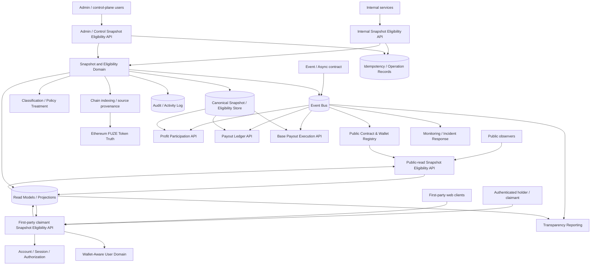
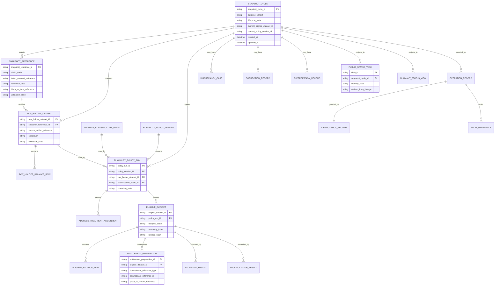
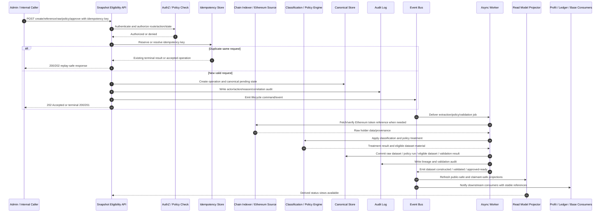

# SNAPSHOT_AND_ELIGIBILITY_PIPELINE_API_SPEC.md

## Document Metadata

- **Document Name:** `SNAPSHOT_AND_ELIGIBILITY_PIPELINE_API_SPEC.md`
- **Document Type:** API SPEC v2 — production-grade interface-contract specification
- **Status:** Draft refined API specification pending FUZE approval workflow
- **Version:** 2.0.0
- **Effective Date:** 2026-04-25
- **Last Updated:** 2026-04-25
- **Reviewed On:** 2026-04-25
- **Document Owner:** FUZE Snapshot and Eligibility Pipeline API Domain; named individual owner not yet specified
- **Approval Authority:** FUZE constitutional / platform architecture approval workflow; named authority not yet specified
- **Review Cadence:** Quarterly and whenever Ethereum token-layer posture, snapshot policy, holder classification policy, profit-participation cycle design, payout execution, registry publication, transparency reporting, chain-indexing, idempotency, audit, or implementation-contract posture materially changes
- **Governing Layer:** API contract layer derived from refined snapshot and eligibility pipeline semantics
- **Parent Registry:** FUZE API SPEC v2 Canonical File Registry
- **Upstream Semantic Registry:** `REFINED_SYSTEM_SPEC_INDEX.md`
- **Upstream API Registry:** `API_SPEC_INDEX.md`
- **Primary Audience:** Backend engineering, platform architecture, data engineering, contracts engineering, treasury/governance operators, security engineering, audit/compliance, runtime operations, public-trust/reporting teams, wallet-aware platform authors, implementation-contract authors, OpenAPI/AsyncAPI/SDK authors
- **Primary Purpose:** Define the production-grade API contract architecture for FUZE snapshot-cycle creation, deterministic Ethereum reference selection, raw holder dataset intake, address classification, policy treatment, eligible dataset construction, entitlement-input preparation, validation, correction/supersession, public-safe status exposure, and downstream linkage without redefining refined system semantics
- **Primary Upstream References:** `SNAPSHOT_AND_ELIGIBILITY_PIPELINE_SPEC.md`; `PROFIT_PARTICIPATION_SYSTEM_SPEC.md`; `PAYOUT_LEDGER_SPEC.md`; `BASE_PAYOUT_EXECUTION_LAYER_SPEC.md`; `BASE_PLATFORM_CREDITS_LAYER_SPEC.md`; `CHAIN_ARCHITECTURE_SPEC.md`; `PUBLIC_CONTRACT_AND_WALLET_REGISTRY_SPEC.md`; `TRANSPARENCY_MODEL_SPEC.md`; `TRANSPARENCY_REPORTING_SPEC.md`; `WALLET_AWARE_USER_SPEC.md`; `TREASURY_CONTROL_POLICY_SPEC.md`; `VAULT_ACTION_POLICY_SPEC.md`; `MULTISIG_AND_TIMELOCK_SPEC.md`; `GOVERNANCE_MODEL_SPEC.md`; `FOUNDATION_GOVERNANCE_SPEC.md`; `ONCHAIN_OFFCHAIN_RESPONSIBILITY_SPEC.md`; `API_ARCHITECTURE_SPEC.md`; `PUBLIC_API_SPEC.md`; `INTERNAL_SERVICE_API_SPEC.md`; `EVENT_MODEL_AND_WEBHOOK_SPEC.md`; `IDEMPOTENCY_AND_VERSIONING_SPEC.md`; `MIGRATION_AND_BACKWARD_COMPATIBILITY_SPEC.md`; `AUDIT_LOG_AND_ACTIVITY_SPEC.md`; `SECURITY_AND_RISK_CONTROL_SPEC.md`; `MONITORING_ALERTING_AND_INCIDENT_RESPONSE_SPEC.md`; `FUZE_ACCOUNT_ACCESS_AND_SESSION_THESIS_FINAL_SPEC.md`; `FUZE_ACCOUNT_ACCESS_AND_SESSION_CANONICAL_FINAL_SPEC.md`; `FUZE_WORKSPACE_ACCESS_CONTROL_BASICS_THESIS_FINAL_SPEC.md`
- **Primary Downstream Dependents:** Snapshot and eligibility implementation contracts; chain-indexing workers; holder-classification services; profit-participation allocation APIs; payout-ledger linkage APIs; Base payout execution proof/input services; public payout-status surfaces; transparency-reporting APIs; public registry lookup surfaces; admin/control-plane tooling; audit/reconciliation runbooks; OpenAPI/AsyncAPI/SDK artifacts
- **API Surface Families Covered:** Public-read; first-party authenticated read; internal service; admin/control-plane; event/async; reporting/export; chain-adjacent coordination
- **API Surface Families Excluded:** Direct Ethereum token contract ABI; Base payout contract ABI; raw treasury accounting APIs; private investor-room APIs; generic product-entitlement APIs; wallet-link proof APIs except as dependencies; full database schema; raw chain-indexer internals
- **Canonical System Owner(s):** FUZE Snapshot and Eligibility Pipeline Domain for snapshot-cycle semantics, policy-bound eligibility derivation, address-treatment interpretation, dataset lineage, exclusion discipline, validation meaning, and implementation guardrails
- **Canonical API Owner:** FUZE Snapshot and Eligibility Pipeline API Domain
- **Supersedes:** Existing v1 `SNAPSHOT_ELIGIBILITY_API_SPEC.md` to the extent this v2 document is approved; any weaker interpretation that treats snapshot eligibility as an export script, spreadsheet exercise, direct payout entitlement, public-report convenience field, or wallet-link substitute
- **Superseded By:** Not yet specified
- **Related Decision Records:** Not explicitly specified in the retrieved governing materials
- **Canonical Status Note:** This API spec expresses interface contracts derived from refined snapshot and eligibility pipeline semantics. It does not own semantic truth. Refined system specs remain authoritative for domain meaning, ownership, truth classes, and conflict posture.
- **Implementation Status:** Normative target for downstream API and implementation-contract work; exact route paths and schemas may be refined only if they preserve the contract rules herein
- **Approval Status:** Draft pending approval
- **Change Summary:** Upgraded the prior snapshot eligibility API material into API SPEC v2 format; aligned filename to the v2 registry; added explicit semantic/API truth separation, public/first-party/internal/admin/event/chain-adjacent surface boundaries, canonical mutation and read boundaries, idempotency/replay rules, request/response/error/status rules, admin override constraints, read-model/public exposure rules, diagrams, flow views, acceptance criteria, and test cases.

---

## Purpose

This specification defines the FUZE Snapshot and Eligibility Pipeline API contract. The API expresses refined snapshot and eligibility semantics at the interface layer: cycle initialization, deterministic Ethereum token-reference selection, raw holder dataset ingestion, address classification, policy-treatment execution, eligible dataset construction, entitlement-input preparation, validation, approval, downstream linkage, public-safe exposure, correction, discrepancy remediation, and supersession.

The API exists because FUZE intentionally separates Ethereum token participation truth from policy-treated eligibility truth and downstream Base payout execution truth. The API MUST preserve that separation. It MUST NOT let frontends, reports, spreadsheets, public pages, payout contracts, treasury approvals, wallet-link records, or operator shortcuts become canonical eligibility owners.

This API specification owns interface-contract expression. It does not redefine FUZE token truth, address-treatment policy, profit-participation cycle meaning, payout-ledger truth, Base execution mechanics, treasury funding authority, public registry meaning, transparency-report publication truth, wallet-link proof semantics, or account/session/authorization semantics.

---

## Scope

This API spec governs:

1. API surface families for snapshot and eligibility operations.
2. Resource families exposed by snapshot and eligibility APIs.
3. Allowed public, first-party, internal, admin/control, event, reporting/export, and chain-adjacent posture.
4. Request, response, error, status, result, idempotency, retry, and replay rules.
5. Authorization, scope, permission, entitlement, and policy checks at the API layer.
6. Accepted-state versus final-outcome behavior for async dataset operations.
7. Canonical mutation boundaries and read boundaries.
8. Public-safe, first-party-safe, internal, audit, and reporting read-model rules.
9. Audit, traceability, observability, correlation, reason-code, operation-reference, and dataset-lineage requirements.
10. Migration, versioning, compatibility, OpenAPI/AsyncAPI/SDK, and implementation-contract derivation guardrails.
11. Non-canonical API patterns that downstream teams MUST NOT implement.

---

## Out of Scope

This API spec does not define:

- the FUZE token contract ABI, token transfer rules, token supply mechanics, or Ethereum token-layer internals;
- low-level chain-indexer implementation, archive-node topology, block reorg handling internals, or provider selection details;
- the complete address-classification policy text or legal policy rationale for every treatment category;
- the full profit-participation allocation formula or cycle business semantics;
- the payout-ledger publication schema in full detail;
- Base payout contract ABI, Merkle proof format, claim UX, execution-run internals, or receipt reconciliation internals;
- treasury approval matrices, reserve accounting, multisig signing procedures, or vault movement details;
- wallet-link proof, account recovery, session security, workspace authorization, or product entitlement semantics beyond dependency constraints;
- raw database schema, partitioning, queue internals, object-storage layout, or runbook steps;
- public-report narrative templates or investor/community reporting copy.

Those concerns remain governed by adjacent refined specs and downstream implementation-contract documents.

---

## Design Goals

1. Preserve Ethereum as the canonical holder-participation source for holder-aware economic logic.
2. Make raw holder-balance truth and policy-treated eligible-balance truth explicit and separate.
3. Require deterministic, reproducible, auditable snapshot references and dataset lineage.
4. Require explicit, versioned treatment of treasury, Foundation, team, vesting, operational, migration, contract, and ordinary-holder address classes where applicable.
5. Support profit-participation cycles without letting payout execution redefine eligibility.
6. Support bounded reuse for holder-rank, privilege, or future holder-aware functions without allowing local product semantics to replace the platform pipeline.
7. Preserve strong public-trust posture without exposing unsafe private operational detail.
8. Provide downstream API, OpenAPI, AsyncAPI, SDK, worker, storage, event, audit, and runbook authors enough constraints that they cannot legally implement contradictory semantics.

---

## Non-Goals

This API spec is not intended to:

- make raw Ethereum balances automatically identical to eligible balances, payout rights, claimable amounts, or executed receipts;
- let Base payout execution determine holder eligibility independently;
- let wallet-link ownership, account identity, workspace membership, product entitlements, credits balances, or public registry publication replace token-balance truth;
- let dashboards, CSV exports, public pages, transparency reports, or support tools become canonical dataset owners;
- allow operators to improvise exclusion or inclusion logic without approved policy versions;
- force all policy treatment on-chain where off-chain classification and interpretation are deliberately governed;
- expose internal address-classification, treasury, security, or risk detail through public APIs by default;
- provide a full database schema or code-generation artifact in place of downstream implementation contracts.

---

## Core Principles

### Principle 1: Semantic Truth Is Upstream

`SNAPSHOT_AND_ELIGIBILITY_PIPELINE_SPEC.md` owns semantic meaning. This API spec owns interface expression. API routes MUST NOT reinterpret snapshot-reference meaning, eligible-dataset meaning, lifecycle meaning, or ownership boundaries for client convenience.

### Principle 2: Ethereum Participation Truth Remains Canonical

The FUZE token on Ethereum mainnet is the canonical source of raw holder-balance truth for holder-based eligibility. API inputs MUST identify the approved token reference and deterministic snapshot reference before any dataset can be canonical.

### Principle 3: Eligibility Truth Is Derived and Policy-Treated

Eligible-balance truth is a derived output produced by explicit policy treatment over raw holder truth. It is authoritative only for the named purpose or cycle and only after validation and approval state requirements are satisfied.

### Principle 4: Policy Treatment Must Be Explicit

Address-category treatment, exclusions, caps, weights, inclusion variants, and purpose-specific treatment rules MUST be explicit, versioned, traceable, and auditable. No economically sensitive treatment may exist only in operator memory, code comments, or spreadsheets.

### Principle 5: The Pipeline Bridges Domains Without Replacing Them

The pipeline bridges token participation truth into downstream holder-aware systems. It does not absorb wallet-link truth, treasury truth, payout-ledger truth, payout-execution truth, reporting truth, public registry truth, or audit truth.

### Principle 6: Reproducibility Beats Convenience

Every canonical eligible dataset MUST be reproducible from its token reference, snapshot reference, raw dataset reference, policy version, classification basis, validation artifacts, approval lineage, and correction/supersession history. Any optimization that weakens this lineage MUST be rejected or explicitly bounded.

### Principle 7: Public-Safe Does Not Mean Canonical

Public or first-party read surfaces MAY expose bounded methodology, status, aggregate summaries, and correction lineage. They MUST remain derived and MUST NOT become authoritative mutation or interpretation surfaces.

---

## Canonical Definitions

- **Snapshot Cycle:** A purpose-bound container for selecting a deterministic token-state reference, extracting raw holder data, applying policy treatment, validating outputs, and producing eligible dataset or entitlement-input lineage.
- **Snapshot Reference:** The explicit reference used to measure Ethereum FUZE balances for a cycle or purpose. It MAY be a block number, block hash, timestamp-bound block selection, or equivalent deterministic chain reference approved by policy.
- **Raw Holder Dataset:** The unmodified address-to-balance view derived from canonical Ethereum token truth at the chosen snapshot reference.
- **Address Classification:** A policy-bound assignment of an address to one or more recognized treatment categories for the relevant purpose.
- **Policy Treatment:** The rules that determine whether, how, and to what extent balances count toward a relevant holder-aware output.
- **Eligibility Policy Run:** An API-visible execution record that applies a named policy version to a raw holder dataset using a classification basis and produces treatment results.
- **Eligible Dataset:** The canonical derived dataset produced by applying policy treatment to raw holder truth for a specific cycle or purpose.
- **Entitlement Input:** A downstream-ready representation derived from an approved eligible dataset for payout execution, proof generation, profit participation, or another approved holder-aware system.
- **Cycle Eligibility Basis:** The linked set of references explaining a cycle’s eligibility truth: token source, snapshot reference, raw dataset, policy version, classification basis, eligible dataset identifier, validation status, approval lineage, and downstream linkage.
- **Excluded Address:** An address or address class whose balance is excluded entirely for the relevant purpose under the applicable policy.
- **Special-Treatment Address:** An address or class counted only under explicit alternative treatment, partial counting, capped counting, delayed inclusion, or other bounded policy logic.
- **Purpose Variant:** A formally named use of the pipeline for profit participation, holder rank, ecosystem privilege, or other approved holder-aware function.
- **Correction:** A controlled change that records a reason-coded adjustment to a pre-approval or post-approval state without silently rewriting history.
- **Supersession:** Replacement of a dataset, policy run, or public-safe view with explicit old-to-new lineage.

---

## Truth Class Taxonomy

The API MUST distinguish the following truth classes:

1. **Participation Truth** — raw FUZE holder balances on Ethereum at a deterministic reference.
2. **Classification Truth** — policy-governed address-category assignments and treatment basis records.
3. **Eligibility Truth** — canonical derived result of applying policy treatment to participation truth.
4. **Entitlement-Preparation Truth** — downstream-ready allocation, proof, or entitlement input derived from eligibility truth.
5. **Wallet-Link Truth** — account-to-wallet linkage and wallet-proof acceptance owned by the wallet-aware user domain.
6. **Treasury / Governance Truth** — funding authority, approval posture, policy-control decisions, and sensitive control posture owned by adjacent domains.
7. **Execution Truth** — Base funding state, claim state, transaction submission, receipt, and execution outcome owned by the Base payout execution domain.
8. **Ledger Truth** — structured cycle-level payout ledger records owned by the payout-ledger domain.
9. **Reporting / Registry Truth** — public-safe publication outputs owned by transparency and registry domains.
10. **Audit Truth** — durable internal decision, actor, mutation, validation, and lineage records.
11. **Projection / Read-Model Truth** — dashboards, public pages, internal summaries, search views, exports, and caches derived from canonical domains.
12. **Presentation Truth** — localized labels, UI copy, rendered status, and explanatory text that MUST remain subordinate to canonical and derived read-model truth.

No API response, schema, event, SDK type, dashboard object, or export MAY collapse these into one ambiguous `holderEligibility` truth object.

---

## Architectural Position in the Spec Hierarchy

This API spec sits below:

- `REFINED_SYSTEM_SPEC_INDEX.md`
- `SYSTEM_BOUNDARY_AND_OWNERSHIP_SPEC.md`
- `SYSTEM_OVERVIEW_AND_BOUNDARIES_SPEC.md`
- `PLATFORM_ARCHITECTURE_SPEC.md`
- `DOMAIN_OWNERSHIP_MATRIX_SPEC.md`
- `DATA_MODEL_AND_ENTITY_OWNERSHIP_SPEC.md`
- `ONCHAIN_OFFCHAIN_RESPONSIBILITY_SPEC.md`
- `CHAIN_ARCHITECTURE_SPEC.md`
- `SNAPSHOT_AND_ELIGIBILITY_PIPELINE_SPEC.md`

It sits adjacent to:

- `PROFIT_PARTICIPATION_API_SPEC.md`
- `PAYOUT_LEDGER_API_SPEC.md`
- `BASE_PAYOUT_EXECUTION_LAYER_API_SPEC.md`
- `PUBLIC_CONTRACT_AND_WALLET_REGISTRY_API_SPEC.md`
- `TRANSPARENCY_REPORTING_API_SPEC.md`
- `WALLET_AWARE_USER_API_SPEC.md`
- treasury, governance, audit, security, and event API specs

It sits above downstream implementation contracts, endpoint-specific OpenAPI definitions, AsyncAPI event definitions, storage schemas, worker contracts, reconciliation runbooks, public-read projections, and SDK client models.

---

## Upstream Semantic Owners

The primary upstream semantic owner is the FUZE Snapshot and Eligibility Pipeline Domain. Adjacent semantic owners retain the following authority:

- Ethereum Token Domain owns token identity, transfer, supply, and raw holder-balance truth.
- Wallet-Aware User Domain owns account-to-wallet linkage and wallet-proof acceptance.
- Profit Participation Domain owns payout-cycle business meaning and consumption of approved eligibility basis.
- Payout Ledger Domain owns structured cycle-ledger truth and visibility state.
- Base Payout Execution Domain owns claim execution, funding-execution state, batch submission, and receipt truth.
- Treasury and Governance Domains own funding, reserve, approval, and control posture.
- Public Contract and Wallet Registry Domain owns public registry publication truth.
- Transparency Reporting Domain owns recurring public reporting truth.
- Audit / Activity Domain owns durable audit-event truth.
- API Architecture, Event Model, Idempotency, Versioning, Migration, Security, Monitoring, and Runtime specs govern cross-cutting API posture.

---

## API Surface Families

### Public-Read Surface

Public routes MAY expose published public-safe cycle summaries, methodology summaries, snapshot-reference summaries, aggregate included/excluded/eligible totals where approved, correction/supersession status, and trust-artifact links. Public routes MUST NOT expose raw holder lists, unsafe address-classification internals, private treasury/security detail, internal discrepancy notes, or claimant-private information.

### First-Party Authenticated Surface

First-party routes MAY expose bounded claimant-linked eligibility status only when the authenticated account has an authorized wallet/claimant linkage and the cycle policy allows claimant-specific disclosure. These routes MUST NOT imply executed payout success and MUST NOT replace wallet-link proof or payout-execution truth.

### Internal Service Surface

Internal routes own canonical command and read surfaces for cycle creation, reference registration, raw dataset intake, policy-run creation, eligible dataset construction, validation, downstream linkage, canonical reads, and event-triggered workflow coordination. They require service identity, least privilege, idempotency, correlation, and lineage records.

### Admin / Control-Plane Surface

Admin routes MAY approve, lock, restrict, correct, supersede, invalidate, or resolve discrepancies. They MUST be separated from ordinary application routes, require privileged operator authorization, reason codes, policy constraints, audit records, and state-transition validation.

### Event / Async Surface

Event and async surfaces coordinate long-running extraction, policy application, validation, projection refresh, downstream linkage, and public-safe publication. Events MUST be replay-safe, idempotent, source-domain anchored, and must not turn event consumers into canonical mutation owners.

### Reporting / Export Surface

Reporting/export surfaces MAY generate bounded internal exports, audit exports, public methodology artifacts, transparency-report inputs, and holder-safe summaries. They MUST remain derived and regenerateable from canonical sources.

### Chain-Adjacent Surface

Chain-adjacent routes coordinate deterministic snapshot references, chain-source provenance, token-reference checks, entitlement-input preparation, and proof/input references. They MUST NOT expose raw contract ABI ownership or allow payout execution to redefine eligibility semantics.

---

## System / API Boundaries

The Snapshot and Eligibility Pipeline API governs interface contracts for:

- snapshot-cycle lifecycle;
- token-source and snapshot-reference registration;
- raw holder dataset registration and validation;
- address classification and policy treatment execution;
- eligible dataset creation and approval;
- entitlement-input preparation and downstream linkage;
- discrepancy, correction, and supersession workflows;
- public-safe and claimant-safe read models;
- event emission and async operation references;
- idempotency, retry, replay, audit, observability, and migration behavior.

It does not govern:

- token contract state;
- chain-indexer internals beyond provider input/provenance contract requirements;
- account identity or session issuance;
- workspace membership, roles, permissions, or product entitlements;
- profit-cycle distributable-profit decision;
- payout execution receipts;
- payout-ledger publication truth;
- public registry publication truth;
- transparency-report authorship;
- treasury funding authority.

---

## Adjacent API Boundaries

### Profit Participation API

Consumes approved cycle eligibility basis and entitlement inputs. It MUST NOT generate ad hoc eligibility lists or adjust policy-treatment meaning.

### Payout Ledger API

Links eligibility basis to funding, execution, claim-window, and reporting references. It MUST NOT own snapshot extraction or address-treatment semantics.

### Base Payout Execution Layer API

Consumes approved entitlement inputs and owns execution lifecycle. It MAY validate consumability but MUST NOT reinterpret eligibility.

### Public Contract and Wallet Registry API

May publish official contract and wallet references used by public explanations. It MUST NOT become raw holder-balance truth, wallet-link truth, or eligibility truth.

### Wallet-Aware User API

May support account-to-wallet association for claimant-specific views. It MUST NOT replace raw Ethereum token-holder truth.

### Transparency Reporting API

May publish methodology and cycle summaries. It MUST NOT create, approve, or modify canonical eligible datasets.

### Treasury / Governance / Vault / Multisig APIs

May control funding, reserve use, approval, pause, or execution readiness. They MUST NOT silently rewrite classification or eligible balances.

### Audit and Activity API

Receives audit events and supports investigation. It MUST NOT become a command surface for eligibility mutation.

---

## Conflict Resolution Rules

1. `REFINED_SYSTEM_SPEC_INDEX.md` wins on refined-library membership, activation, and precedence.
2. Higher-order constitutional, boundary, ownership, data-model, and on-chain/off-chain specs win on platform-wide ownership and chain boundaries.
3. `SNAPSHOT_AND_ELIGIBILITY_PIPELINE_SPEC.md` wins on snapshot-reference meaning, address-treatment semantics, eligibility derivation, lifecycle meaning, validation discipline, correction rules, and dataset lineage.
4. `PROFIT_PARTICIPATION_SYSTEM_SPEC.md` wins on payout-cycle business meaning and why a cycle consumes an eligibility basis.
5. `PAYOUT_LEDGER_SPEC.md` wins on ledger-cycle record meaning.
6. `BASE_PAYOUT_EXECUTION_LAYER_SPEC.md` wins on claim-execution and execution-state meaning.
7. `WALLET_AWARE_USER_SPEC.md` wins on wallet-link semantics.
8. Treasury, Foundation, vault, multisig, and governance specs win on their respective control and approval postures.
9. Public registry and transparency specs win on public publication truth, but they do not override eligibility truth.
10. API v1 material may inform route shapes and historical intent but MUST NOT override refined semantics.
11. If ambiguity remains, choose the more conservative architecture-consistent interpretation and block unsafe downstream consumption until explicit refinement or approval exists.

---

## Default Decision Rules

1. No deterministic snapshot reference means no valid eligibility basis.
2. No explicit token source means no raw holder dataset may be canonical.
3. No explicit policy version means no eligible dataset may be canonical.
4. No classification basis for a category-sensitive cycle means treatment MUST remain pending or conservative.
5. If raw balances and eligible balances differ, raw balances remain participation truth while eligible balances control only for the named purpose/cycle after approval.
6. If an address category is contested and no approved treatment exists, default to exclusion or hold-state until policy resolution.
7. If wallet-link context conflicts with token-holder truth, token-holder truth controls eligibility unless an approved purpose-specific policy explicitly states otherwise.
8. If funding approval exists but eligibility lineage is incomplete, cycle opening MUST be blocked.
9. If entitlement input cannot be reconciled to the approved eligible dataset, downstream execution and public publication MUST stop pending remediation.
10. If public explanation would expose unsafe detail, public output MUST be narrowed without weakening internal lineage.
11. If a post-approval dataset error is material, use correction or supersession lineage; do not silently rewrite.
12. If duplicate submissions occur, idempotent replay MUST return the original terminal result or conflict on semantic mismatch.

---

## Roles / Actors / API Consumers

- **Public Observer:** Reads public-safe status and methodology summaries.
- **Eligible Holder / Claimant:** Reads bounded authenticated eligibility status where allowed.
- **First-Party Web Client:** Renders public or authenticated status; never owns canonical eligibility truth.
- **Admin Console:** Initiates privileged reason-coded approval, lock, correction, restriction, or supersession workflows through backend-only APIs.
- **Snapshot / Eligibility Service:** Owns canonical API command handling and lifecycle validation.
- **Chain-Indexing Service:** Provides raw Ethereum holder data and source provenance under internal service contracts.
- **Classification / Policy Service:** Provides approved classification basis and treatment rules.
- **Profit Participation Service:** Consumes approved eligibility basis for allocation/payout-intent preparation.
- **Payout Ledger Service:** Links eligibility basis into cycle-ledger records.
- **Base Payout Execution Service:** Consumes entitlement inputs for execution preparation.
- **Transparency / Registry Services:** Consume public-safe summaries and lineage for publication.
- **Audit / Security / Operations:** Monitor, audit, investigate, and remediate state transitions.
- **OpenAPI / AsyncAPI / SDK Authors:** Derive machine-readable contract artifacts without changing domain meaning.

---

## Resource / Entity Families

Canonical API-facing resource families include:

1. `snapshot_cycle`
2. `snapshot_reference`
3. `token_source_reference`
4. `raw_holder_dataset`
5. `raw_holder_balance_row` or address-level raw record family, internal only
6. `address_classification_basis`
7. `address_treatment_assignment`
8. `eligibility_policy_version`
9. `eligibility_policy_run`
10. `eligible_dataset`
11. `eligible_balance_row` or address-level eligible record family, internal or claimant-safe only where allowed
12. `entitlement_preparation`
13. `validation_result`
14. `reconciliation_result`
15. `approval_record`
16. `publication_readiness_record`
17. `discrepancy_case`
18. `correction_record`
19. `supersession_record`
20. `idempotency_record`
21. `operation_record`
22. `audit_reference`
23. `public_status_view`
24. `claimant_status_view`
25. `export_artifact_reference`

Derived resources MUST be named as views, summaries, exports, or projections. They MUST NOT share names that imply canonical mutation ownership.

---

## Ownership Model

The canonical API ownership model is:

- Snapshot and Eligibility API owns command handling for snapshot-cycle, reference, raw-dataset, policy-run, eligible-dataset, validation, approval, correction, supersession, and downstream-linkage resources.
- Ethereum Token Domain owns raw chain state and raw balance truth; the API records references and extracted datasets but does not own token truth itself.
- Policy / Classification authorities own approved policy versions and classification basis definitions as governed by refined policy/control posture; the Snapshot API records their application to cycles.
- Wallet-Aware User Domain owns account-wallet linkage; Snapshot API MAY consume linkage for claimant-safe views only.
- Profit Participation, Payout Ledger, and Base Execution APIs consume references and outputs but do not own eligibility derivation.
- Reporting, registry, dashboard, export, and public views are derived consumers.
- Audit Domain owns immutable audit records; Snapshot API MUST generate audit references.

---

## Authority / Decision Model

### Canonical Authority Rules

1. Routine operators MUST NOT invent or adjust eligibility semantics outside approved policy versions.
2. Address-category changes that materially affect a cycle MUST be explicit, reason-coded, policy-constrained, and auditable.
3. Treasury funding approval does not confer authority to rewrite classification or eligibility treatment.
4. Payout execution MAY reject or pause invalid entitlement inputs but MUST NOT redefine eligibility meaning.
5. Public reporting MAY explain methodology but MUST NOT author canonical eligibility truth.
6. Wallet-aware or product teams MAY consume eligibility outputs but MUST NOT replace the pipeline with product-local approximations for shared economic behavior.
7. Admin correction MAY supersede or correct through lineage; it MUST NOT silently mutate approved canonical datasets.

### Operator/Admin Override Posture

Admin overrides MAY exist only when explicitly named, policy-constrained, narrowly scoped, reason-coded, audited, reviewable, and incapable of silently rewriting historical meaning. Permitted examples include pre-approval invalidation, visibility restriction, discrepancy opening/closure, publication pause, correction registration, and dataset supersession.

Forbidden override examples include direct address-balance edits to approved datasets, unversioned classification changes, retroactive eligibility changes without lineage, hidden public-status rewrites, and payout-execution-driven eligibility changes.

---

## Authentication Model

Public-read routes MAY be unauthenticated only for intentionally published public-safe views.

First-party claimant routes MUST require valid authentication and must bind the requesting actor to the allowed claimant/wallet context through approved account/session and wallet-aware mechanisms.

Internal service routes MUST require service-to-service identity, service authorization, mTLS or equivalent trusted-channel posture where implemented, and explicit least privilege.

Admin/control-plane routes MUST require authenticated privileged operator identity, elevated authorization, reason codes, correlation identifiers, and policy checks. Sensitive actions SHOULD require step-up controls or multi-actor review where downstream economics or public trust can be affected.

Authentication proves the caller. It does not grant semantic authority to redefine eligibility.

---

## Authorization / Scope / Permission Model

Authorization MUST evaluate:

1. route surface family;
2. caller identity or service identity;
3. actor permission or service capability;
4. cycle/dataset state;
5. whether the target data is public-safe, claimant-safe, internal-only, or control-plane-only;
6. purpose variant and policy version;
7. whether requested action is allowed for current state;
8. whether downstream linkage or public publication increases required authority;
9. whether reason-code and audit requirements are satisfied.

Workspace scope, product role, and product entitlement MUST NOT be used as a substitute for holder participation truth. They MAY gate access to internal/admin interfaces but do not determine eligibility.

---

## Entitlement / Capability-Gating Model

Eligibility truth is not the same as product entitlement or workspace capability. For profit participation, eligibility becomes a bounded cycle-specific input to downstream payout/claim preparation. For other approved uses, eligibility MAY become a holder-aware rank, privilege, or participation input only through an explicit purpose variant.

APIs MUST NOT conflate:

- holder eligibility with workspace roles;
- holder eligibility with product plan or subscription;
- holder eligibility with Platform Credits balance;
- wallet linkage with token-holder truth;
- eligible balances with executed payout receipts;
- public reporting state with canonical dataset state.

---

## API State Model

### Snapshot Cycle States

- `draft`
- `reference_selected`
- `raw_extraction_pending`
- `raw_extracted`
- `classification_pending`
- `classification_applied`
- `policy_run_pending`
- `eligibility_constructed`
- `validation_pending`
- `validated`
- `approval_pending`
- `approved_for_downstream_use`
- `locked_for_downstream_use`
- `linked_to_cycle`
- `published_internal`
- `published_public_safe`
- `discrepancy_under_review`
- `restricted`
- `superseded`
- `cancelled_pre_approval`

### Snapshot Reference States

- `proposed`
- `selected`
- `validated`
- `rejected`
- `superseded`

### Raw Dataset States

- `registered`
- `ingesting`
- `ingested`
- `validated`
- `rejected`
- `superseded`

### Policy Run States

- `created`
- `accepted`
- `running`
- `completed`
- `failed`
- `validated`
- `approved`
- `superseded`

### Eligible Dataset States

- `draft`
- `ready`
- `validation_pending`
- `validated`
- `approved`
- `locked`
- `consumed_downstream`
- `corrected`
- `superseded`
- `restricted`

### Discrepancy States

- `opened`
- `under_review`
- `awaiting_policy_decision`
- `resolved`
- `superseded`
- `closed`

State transitions MUST be explicit. Implementations MAY add internal sub-states but MUST preserve separation between reference selection, raw extraction, classification, policy treatment, validation, approval, downstream linkage, publication, discrepancy, correction, and supersession.

---

## Lifecycle / Workflow Model

1. **Purpose or Cycle Initialization:** An approved purpose variant or profit-participation cycle is declared.
2. **Snapshot Reference Selection:** A deterministic Ethereum reference point and token source are selected and recorded.
3. **Reference Validation:** Chain source, token contract identity, block/hash/timestamp reference, and provider provenance are validated.
4. **Raw Holder Extraction:** The raw holder dataset is extracted from Ethereum token truth and registered with provenance, checksum, source artifact, and totals.
5. **Classification Basis Resolution:** Known address categories, registry references, controlled-address lists, and classification versions are resolved.
6. **Policy Treatment Application:** Inclusion, exclusion, capping, weighting, or special-treatment rules are applied through a policy run.
7. **Eligible Dataset Construction:** The derived eligible dataset is generated with stable identifier, summary totals, and lineage.
8. **Entitlement-Preparation Transformation:** Where required, an entitlement input, proof root, or downstream-ready representation is materialized.
9. **Validation and Reconciliation:** Dataset totals, classification treatment, reference integrity, deterministic repeatability, and downstream consumability are checked.
10. **Approval and Lock:** Privileged operators approve and lock the dataset for downstream use through reason-coded audited workflows.
11. **Downstream Linkage:** The dataset links to profit-participation, payout-ledger, proof-generation, Base execution, reporting, or other approved consumers.
12. **Public-Safe Explanation:** Public/trust surfaces receive bounded derived summaries and methodology references where allowed.
13. **Correction / Remediation / Supersession:** Material issues are handled through explicit correction or supersession lineage.

---

## Architecture Diagram — Mermaid flowchart

---

## Data Design — Mermaid Diagram

Canonical entities are `SNAPSHOT_CYCLE`, `SNAPSHOT_REFERENCE`, `RAW_HOLDER_DATASET`, `ELIGIBILITY_POLICY_RUN`, `ELIGIBLE_DATASET`, `ENTITLEMENT_PREPARATION`, `VALIDATION_RESULT`, `RECONCILIATION_RESULT`, `DISCREPANCY_CASE`, `CORRECTION_RECORD`, and `SUPERSESSION_RECORD`. `PUBLIC_STATUS_VIEW`, `CLAIMANT_STATUS_VIEW`, exports, caches, dashboards, and reporting views are derived.

---

## Flow View

### Synchronous Command Path

1. Caller submits a command to an internal or admin route with `Idempotency-Key`, `X-Correlation-Id`, actor/service identity, target resource, and reason code where required.
2. API authenticates the caller and evaluates route-family authorization.
3. API validates request schema, current state, token/source reference, policy version, and target ownership.
4. API checks idempotency scope and either returns existing terminal result, rejects conflicting replay, or creates an operation record.
5. API commits canonical mutation only inside the Snapshot and Eligibility Domain.
6. API writes audit event, updates operation state, and emits internal event.
7. API returns terminal success, accepted operation, or structured problem response.

### Async Dataset Path

1. Internal route accepts extraction, policy-run, validation, entitlement-preparation, or projection-refresh operation.
2. API returns `202 Accepted` with `operation_id`, target reference, expected follow-up route, and initial operation state.
3. Worker consumes operation event and performs deterministic work against canonical references.
4. Worker commits results only through the owner-domain service contract.
5. Validation/reconciliation gates decide whether the dataset can advance.
6. API emits final lifecycle event and refreshes derived read models.
7. Downstream consumers use stable references and MUST NOT infer final business outcomes from accepted state alone.

### Failure / Retry Path

1. Retry with same idempotency key and same semantic request returns original terminal result or current accepted operation state.
2. Retry with same key and different semantic request fails with idempotency conflict.
3. Provider/chain outage results in dependency error and retry guidance only where safe.
4. Validation failure creates a failed validation result or discrepancy case; it does not mutate raw history.
5. Post-approval error requires correction or supersession lineage.

### Admin / Operator Path

1. Admin action requires privileged route, policy permission, reason code, operator note, correlation ID, and idempotency key.
2. API blocks actions that attempt forbidden state transitions or hidden mutation of approved datasets.
3. Approved actions generate durable operation, audit, and event records.
4. Public-safe projections refresh only after visibility controls are satisfied.

### Degraded Mode Path

1. Public reads MAY serve stale-but-labelled derived views where policy allows.
2. Internal mutation MUST stop when canonical store, idempotency store, audit store, or chain-source integrity cannot be guaranteed.
3. Dataset approval MUST NOT proceed during degraded validation or incomplete lineage states.
4. Incident and monitoring signals MUST record the degraded posture.

---

## Data Flows — Mermaid sequenceDiagram

---

## Request Model

All mutation requests MUST include:

- `Idempotency-Key` header;
- `X-Correlation-Id` or equivalent correlation reference;
- authenticated actor or service identity;
- target resource identifiers;
- explicit operation type;
- reason code and operator note for admin/control-plane actions;
- policy version or classification-basis reference where treatment is affected;
- snapshot reference or token-source reference where chain truth is affected;
- expected state or precondition where race conditions are possible.

Sensitive requests SHOULD include:

- request hash;
- source artifact reference and checksum;
- validation profile;
- downstream purpose variant;
- approval or control reference;
- incident or discrepancy case reference where relevant.

Requests MUST NOT accept frontend-authored eligibility truth, naked CSV uploads without provenance, unversioned classification logic, opaque operator filters, or direct post-approval edits.

---

## Response Model

Successful responses MUST include:

- stable resource identifiers;
- lifecycle state or operation state;
- canonical versus derived status indicators;
- created/updated timestamps;
- current lineage references;
- policy version, classification basis, snapshot reference, raw dataset, eligible dataset, validation, and downstream references where relevant;
- correlation ID;
- operation ID for async operations;
- public/claimant-safe visibility state where relevant.

Read responses MUST distinguish:

- raw holder truth;
- policy-treated eligible truth;
- entitlement-preparation truth;
- public-safe status;
- claimant-safe status;
- downstream payout/ledger/execution references;
- correction and supersession lineage.

Async accepted responses MUST use `202 Accepted` or equivalent contract status, include `operation_id`, `operation_state`, `target_reference`, `follow_up_url` or status family, and MUST NOT imply final eligibility, payout, or publication success.

---

## Error / Result / Status Model

The API MUST use structured problem-details style errors.

Required error fields:

- `type`
- `title`
- `status`
- `code`
- `detail`
- `instance`
- `correlation_id`
- `operation_id` where relevant
- `retryable` where safe
- `safe_public_detail` where public or low-privilege route requires narrowed detail

Canonical error families include:

- `SNAPSHOT_ELIGIBILITY_AUTHENTICATION_REQUIRED`
- `SNAPSHOT_ELIGIBILITY_PERMISSION_DENIED`
- `SNAPSHOT_ELIGIBILITY_SERVICE_PERMISSION_DENIED`
- `SNAPSHOT_ELIGIBILITY_OPERATOR_PERMISSION_DENIED`
- `SNAPSHOT_ELIGIBILITY_AUDIENCE_PERMISSION_DENIED`
- `SNAPSHOT_ELIGIBILITY_TOKEN_SOURCE_REQUIRED`
- `SNAPSHOT_ELIGIBILITY_REFERENCE_REQUIRED`
- `SNAPSHOT_ELIGIBILITY_REFERENCE_INVALID`
- `SNAPSHOT_ELIGIBILITY_CHAIN_SOURCE_UNAVAILABLE`
- `SNAPSHOT_ELIGIBILITY_RAW_DATASET_REQUIRED`
- `SNAPSHOT_ELIGIBILITY_RAW_DATASET_INVALID`
- `SNAPSHOT_ELIGIBILITY_POLICY_VERSION_REQUIRED`
- `SNAPSHOT_ELIGIBILITY_CLASSIFICATION_BASIS_REQUIRED`
- `SNAPSHOT_ELIGIBILITY_POLICY_RUN_FAILED`
- `SNAPSHOT_ELIGIBILITY_VALIDATION_FAILED`
- `SNAPSHOT_ELIGIBILITY_RECONCILIATION_FAILED`
- `SNAPSHOT_ELIGIBILITY_CYCLE_STATE_INVALID`
- `SNAPSHOT_ELIGIBILITY_DATASET_STATE_INVALID`
- `SNAPSHOT_ELIGIBILITY_APPROVAL_REQUIRED`
- `SNAPSHOT_ELIGIBILITY_LOCK_CONFLICT`
- `SNAPSHOT_ELIGIBILITY_DUPLICATE_DATASET`
- `SNAPSHOT_ELIGIBILITY_CORRECTION_NOT_ALLOWED`
- `SNAPSHOT_ELIGIBILITY_SUPERSESSION_REQUIRED`
- `SNAPSHOT_ELIGIBILITY_IDEMPOTENCY_KEY_REQUIRED`
- `SNAPSHOT_ELIGIBILITY_IDEMPOTENCY_CONFLICT`
- `SNAPSHOT_ELIGIBILITY_REQUEST_INVALID`
- `SNAPSHOT_ELIGIBILITY_REQUEST_UNPROCESSABLE`
- `SNAPSHOT_ELIGIBILITY_RATE_LIMITED`
- `SNAPSHOT_ELIGIBILITY_PUBLIC_VIEW_UNAVAILABLE`
- `SNAPSHOT_ELIGIBILITY_INTERNAL_DETAIL_REDACTED`

Error handling rules:

1. Public and low-privilege errors MUST NOT expose unsafe classification, treasury, security, or internal discrepancy detail.
2. Errors MUST distinguish not found, forbidden, unpublished, restricted, and superseded states.
3. Errors MUST distinguish accepted async work from final failure.
4. Errors MUST distinguish upstream dependency failure from invalid FUZE state.
5. Errors MUST NOT imply downstream payout entitlement execution from approved or locked dataset state alone.

---

## Idempotency / Retry / Replay Model

### Required Idempotent Mutations

The following mutations MUST be idempotent:

- snapshot cycle creation;
- token-source reference registration;
- snapshot-reference selection/registration;
- raw holder dataset registration and ingestion;
- classification-basis attachment;
- eligibility policy-run creation;
- eligible dataset materialization;
- validation request;
- entitlement-preparation linking;
- approval;
- lock;
- restriction;
- correction;
- supersession;
- discrepancy opening/resolution;
- public-safe projection publication or withdrawal.

### Idempotency Rules

1. Idempotency keys MUST be scoped by route family, actor/service, operation type, target resource, and purpose variant.
2. The API MUST store request hash, actor, correlation ID, operation ID, terminal result, and replay result.
3. Replay of the same semantic request MUST return the same terminal result or accepted operation state.
4. Replay of the same key with a different semantic request MUST fail with `SNAPSHOT_ELIGIBILITY_IDEMPOTENCY_CONFLICT`.
5. Idempotency records MUST be retained long enough to cover retry, worker replay, webhook/event replay, and migration windows for economically sensitive operations.
6. Event consumers MUST deduplicate using event ID and source operation ID.

---

## Rate Limit / Abuse-Control Model

Public-read and claimant-read routes MUST be rate-limited to protect trust surfaces, prevent scraping of sensitive derived status, and reduce enumeration risk.

Mutation routes MUST apply service-level throughput controls, concurrency controls, state-transition locks, operation deduplication, and abuse detection. Admin/control routes SHOULD have stricter thresholds and alerting. Bulk export routes MUST require explicit approval and bounded audience controls.

Abuse controls MUST NOT silently degrade canonical processing. If rate limits or abuse controls block operations, callers receive explicit structured errors and audit/monitoring records where appropriate.

---

## Endpoint / Route Family Model

Route names below are canonical family guidance. Exact route names MAY be refined in OpenAPI artifacts only if semantics remain equivalent.

### Public-Read Routes

- `GET /v1/snapshot-eligibility/cycles`
  - Lists published public-safe snapshot/eligibility cycle summaries.
- `GET /v1/snapshot-eligibility/cycles/{snapshot_cycle_id}`
  - Reads one public-safe cycle summary with methodology, aggregate status, correction/supersession lineage, and transparency links where allowed.
- `GET /v1/snapshot-eligibility/cycles/{snapshot_cycle_id}/methodology`
  - Reads public-safe methodology summary and policy disclosure references.

### First-Party Authenticated Routes

- `GET /v1/snapshot-eligibility/me`
  - Reads bounded claimant-linked eligibility status where policy and wallet linkage allow.
- `GET /v1/snapshot-eligibility/me/cycles/{snapshot_cycle_id}`
  - Reads one claimant-safe cycle detail.
- `GET /v1/snapshot-eligibility/me/cycles/{snapshot_cycle_id}/lineage-summary`
  - Reads a narrowed claimant-safe lineage summary without raw internal classification detail.

### Internal Service Routes

- `POST /internal/v1/snapshot-eligibility/cycles`
  - Creates draft cycle or purpose variant.
- `POST /internal/v1/snapshot-eligibility/cycles/{snapshot_cycle_id}/token-source-references`
  - Registers token-source reference.
- `POST /internal/v1/snapshot-eligibility/cycles/{snapshot_cycle_id}/references`
  - Selects/registers deterministic snapshot reference.
- `POST /internal/v1/snapshot-eligibility/cycles/{snapshot_cycle_id}/raw-datasets`
  - Registers or ingests raw holder dataset.
- `POST /internal/v1/snapshot-eligibility/cycles/{snapshot_cycle_id}/classification-bases`
  - Attaches approved classification basis.
- `POST /internal/v1/snapshot-eligibility/cycles/{snapshot_cycle_id}/policy-runs`
  - Applies policy treatment and constructs eligible dataset.
- `POST /internal/v1/snapshot-eligibility/eligible-datasets/{eligible_dataset_id}/validations`
  - Runs validation/reconciliation checks.
- `POST /internal/v1/snapshot-eligibility/eligible-datasets/{eligible_dataset_id}/entitlement-preparations`
  - Creates downstream entitlement-preparation linkage.
- `GET /internal/v1/snapshot-eligibility/cycles/{snapshot_cycle_id}`
  - Reads canonical internal cycle truth.
- `GET /internal/v1/snapshot-eligibility/eligible-datasets/{eligible_dataset_id}`
  - Reads canonical eligible dataset metadata and lineage.
- `GET /internal/v1/snapshot-eligibility/operations/{operation_id}`
  - Reads operation status.

### Admin / Control-Plane Routes

- `POST /admin/v1/snapshot-eligibility/cycles/{snapshot_cycle_id}/approve`
  - Approves validated eligibility basis for downstream use.
- `POST /admin/v1/snapshot-eligibility/cycles/{snapshot_cycle_id}/lock`
  - Locks approved dataset for downstream use.
- `POST /admin/v1/snapshot-eligibility/cycles/{snapshot_cycle_id}/restrict`
  - Restricts visibility or use pending review.
- `POST /admin/v1/snapshot-eligibility/corrections`
  - Registers correction with lineage.
- `POST /admin/v1/snapshot-eligibility/supersessions`
  - Supersedes dataset, policy run, or public-safe projection.
- `POST /admin/v1/snapshot-eligibility/discrepancies`
  - Opens discrepancy case.
- `POST /admin/v1/snapshot-eligibility/discrepancies/{case_id}/resolve`
  - Resolves discrepancy through controlled action.
- `POST /admin/v1/snapshot-eligibility/publication-actions`
  - Publishes, pauses, withdraws, or supersedes public-safe status.

### Event Families

Required internal event families SHOULD include:

- `snapshot_eligibility.cycle_created`
- `snapshot_eligibility.token_source_registered`
- `snapshot_eligibility.reference_selected`
- `snapshot_eligibility.reference_validated`
- `snapshot_eligibility.raw_dataset_extracted`
- `snapshot_eligibility.classification_basis_resolved`
- `snapshot_eligibility.policy_treatment_applied`
- `snapshot_eligibility.eligible_dataset_constructed`
- `snapshot_eligibility.validation_completed`
- `snapshot_eligibility.dataset_approved_for_downstream_use`
- `snapshot_eligibility.dataset_locked`
- `snapshot_eligibility.entitlement_input_materialized`
- `snapshot_eligibility.dataset_linked_to_cycle`
- `snapshot_eligibility.public_status_published`
- `snapshot_eligibility.discrepancy_detected`
- `snapshot_eligibility.dataset_corrected`
- `snapshot_eligibility.dataset_superseded`
- `snapshot_eligibility.dataset_restricted`

Event payloads MUST include event ID, type, version, occurred_at, source domain, operation ID, correlation ID, actor/service reference, snapshot cycle ID, affected resource IDs, policy/version references where relevant, previous/current state where relevant, and reason code for admin/control actions.

---

## Public API Considerations

Public APIs MUST be narrow, stable, cacheable where safe, and correction-aware. They MAY disclose:

- cycle label or public identifier;
- published lifecycle status;
- deterministic snapshot-reference summary when public-safe;
- high-level methodology and policy-version summary;
- aggregate included/excluded/eligible totals where approved;
- public transparency/reporting/registry references;
- correction and supersession lineage;
- last updated and derived-from references.

Public APIs MUST NOT disclose:

- raw holder dataset rows by default;
- non-public classification details;
- internal discrepancy notes;
- private security/treasury details;
- claimant-specific eligibility without authentication and policy allowance;
- direct mutation capability.

---

## First-Party Application API Considerations

First-party claimant APIs MAY expose claimant-specific eligibility posture only after authentication, wallet/account linkage checks, audience checks, and policy approval. They MUST distinguish:

- eligible for a named cycle;
- excluded under public-safe treatment summary;
- pending because cycle is not finalized;
- unavailable because no public/claimant-safe status exists;
- not executed because payout execution is separate;
- superseded or corrected status.

First-party clients MUST render accepted, pending, approved, locked, linked, and executed states distinctly. They MUST NOT state that a holder has received payout merely because an eligible dataset exists.

---

## Internal Service API Considerations

Internal APIs are the only normal command surfaces for canonical cycle/reference/dataset/policy-run operations. They MUST enforce:

- service identity;
- least privilege;
- state-machine validation;
- idempotency;
- operation records;
- lineage references;
- audit emission;
- event emission;
- deterministic input validation;
- owner-domain commit discipline.

Internal APIs MUST NOT become broad-write shortcuts. Generic update, patch-anything, import-any-CSV, or reclassify-any-address endpoints are forbidden.

---

## Admin / Control-Plane API Considerations

Admin/control APIs MUST be explicit, bounded, audited, reason-coded, and separated from ordinary application APIs. Admin APIs MAY perform approve, lock, restrict, correction, supersession, discrepancy-resolution, and public-status actions only through controlled state transitions.

Admin APIs MUST NOT:

- edit approved eligible balances in place;
- alter raw dataset history;
- change policy application without a new policy run or correction record;
- hide supersession lineage;
- publish unsafe detail;
- bypass idempotency, audit, or reason-code requirements;
- turn treasury approval into eligibility authority.

---

## Event / Webhook / Async API Considerations

The pipeline SHOULD use event-first coordination for long-running extraction, policy treatment, validation, projection, and downstream linkage. Internal events are required for material lifecycle transitions.

External webhooks are not exposed by default. Any future third-party snapshot/eligibility webhook MUST be separately specified, narrow, security-reviewed, replay-safe, privacy-reviewed, and public-trust reviewed.

Event consumers MUST treat events as notification and coordination signals, not as permission to mutate canonical eligibility truth outside the owner-domain API.

---

## Chain-Adjacent API Considerations

Chain-adjacent contract posture is:

1. Ethereum token state is source input for raw holder truth.
2. Snapshot reference must be deterministic and chain-verifiable.
3. Chain-indexer/provider data is provider-input truth until validated and accepted by the Snapshot and Eligibility Domain.
4. Base payout execution consumes approved entitlement inputs but does not own eligibility meaning.
5. Proof roots, entitlement artifacts, or execution-ready datasets MUST remain traceable to the approved eligible dataset.
6. Public chain references MAY be exposed through public-safe views, but low-level provider internals and unsafe classification details remain internal.

---

## Data Model / Storage Support Implications

Implementation contracts SHOULD maintain durable canonical storage for:

- snapshot cycles;
- token source references;
- snapshot references;
- raw dataset identifiers, provenance, checksums, and summaries;
- policy versions and treatment references;
- classification basis references;
- policy-run records;
- treatment assignments and summary aggregates;
- eligible datasets and summary totals;
- entitlement-preparation lineage;
- validation and reconciliation results;
- approval, lock, restriction, publication, correction, and supersession records;
- discrepancy cases;
- operation and idempotency records;
- audit trace identifiers and reason codes.

The canonical record MUST NOT rely solely on ephemeral jobs, spreadsheets, notebook outputs, dashboard state, unverified CSV files, logs, or public webpages.

---

## Read Model / Projection / Reporting Rules

Derived read models MAY exist for:

- internal cycle-readiness dashboards;
- public-safe cycle and methodology pages;
- claimant-safe eligibility summaries;
- classification-review consoles;
- audit/support investigation views;
- transparency-report inputs;
- public registry links;
- bounded exports.

Derived read models MUST:

1. identify that they are derived;
2. include source lineage or derived-from references where material;
3. preserve correction/supersession lineage where omission would mislead;
4. not merge raw balance, eligible balance, entitlement input, payout ledger, and executed payout into one ambiguous field;
5. not expose unsafe classification or internal detail without explicit audience approval;
6. be regenerable from canonical sources;
7. be invalidated or refreshed after correction/supersession events.

---

## Security / Risk / Privacy Controls

The API MUST protect against:

- unauthorized mutation of snapshot references, raw datasets, policy runs, eligible datasets, approvals, or corrections;
- replay or duplicate processing of extraction, approval, correction, or downstream-linkage actions;
- wrong token contract, wrong chain, wrong block, wrong reference, or wrong provider usage;
- malicious or accidental misclassification of controlled addresses;
- hidden post-approval changes to eligibility treatment;
- unsafe publication of private classification, treasury, security, claimant, or operational detail;
- shadow dataset generation outside canonical services;
- compromised service/operator credentials affecting payout-sensitive outputs;
- enumeration of claimant-specific eligibility through public or first-party APIs;
- poisoning read models through untrusted provider inputs.

Payout-sensitive operations MUST receive stronger controls than ordinary analytics or support exports.

---

## Audit / Traceability / Observability Requirements

Durable audit events are required for:

- cycle creation;
- token-source registration;
- snapshot-reference selection/validation;
- raw dataset ingestion;
- classification-basis attachment;
- policy-run creation/completion;
- eligible dataset construction;
- validation/reconciliation completion;
- approval and lock;
- entitlement-preparation linkage;
- public-safe publication/withdrawal;
- correction and supersession;
- discrepancy opening/resolution;
- restriction/unrestriction;
- permission-denied and policy-denied sensitive actions.

Each audit event MUST include actor/service identity, actor type, route family, action, target resource, previous/current state where relevant, reason code where applicable, policy/version references where relevant, correlation ID, operation ID, request hash or source artifact reference where relevant, and timestamp.

Observability MUST include metrics and traces for operation latency, worker failures, validation failures, reconciliation failures, idempotency conflicts, provider/chain dependency failures, projection lag, public view freshness, and unauthorized attempts.

---

## Failure Handling / Edge Cases

1. **Wrong snapshot reference:** reject or open discrepancy; never normalize silently.
2. **Provider outage:** return dependency error; do not approve stale or incomplete extraction.
3. **Raw dataset checksum mismatch:** block validation and open discrepancy.
4. **Classification ambiguity:** hold state or conservative exclusion until policy resolution.
5. **Duplicate policy run:** dedupe by idempotency and semantic input hash or supersede explicitly.
6. **Validation failure:** create validation failure record; do not advance approval.
7. **Downstream consumability failure:** pause linkage and create discrepancy or remediation operation.
8. **Post-approval defect:** use correction or supersession lineage.
9. **Public projection lag:** mark stale/delayed or withdraw public-safe view where misleading.
10. **Claimant access conflict:** return forbidden/unavailable without revealing other wallets or private records.
11. **Migration conflict:** preserve old semantics and introduce new version or compatibility layer.
12. **Incident mode:** freeze sensitive mutations if canonical store, audit, idempotency, or chain-source integrity is compromised.

---

## Migration / Versioning / Compatibility / Deprecation Rules

This API family is versioned under public `/v1`, internal `/internal/v1`, and admin `/admin/v1` route families unless a newer approved API architecture spec changes versioning posture.

Compatible changes include additive fields, new purpose variants, new treatment categories, new public-safe summary fields, new event versions with backward-compatible payloads, and new derived views that do not change existing semantics.

Breaking changes include:

- changing raw-versus-eligible truth meaning;
- changing approved/locked/superseded/corrected lifecycle semantics;
- removing lineage fields;
- changing public or claimant visibility semantics incompatibly;
- allowing mutation from previously read-only surfaces;
- changing idempotency behavior;
- changing event payload semantics in a non-compatible way.

Deprecation MUST be explicit, time-bounded, documented, observable, and migration-safe. Deprecated fields MUST preserve semantics during the compatibility window.

---

## OpenAPI / AsyncAPI / SDK Derivation Rules

OpenAPI artifacts MUST preserve:

- surface-family separation;
- canonical versus derived resource naming;
- required idempotency and correlation headers for mutations;
- structured problem-details errors;
- explicit lifecycle states;
- accepted-state versus final-outcome distinctions;
- public/first-party/internal/admin schema differences;
- redaction and visibility markers;
- lineage identifiers;
- deprecation metadata.

AsyncAPI artifacts MUST preserve event ownership, source domain, event version, event ID, operation ID, correlation ID, stable resource identifiers, previous/current state, policy/reference IDs, reason codes, replay-safety requirements, and schema evolution rules.

SDKs MUST NOT hide state distinctions behind convenience booleans such as `isEligible` unless the type name and documentation make the purpose, cycle, policy, and finality clear.

---

## Implementation-Contract Guardrails

Implementation contracts MUST specify:

- service ownership and commit boundaries;
- canonical storage records and indexes;
- worker contracts for extraction, policy treatment, validation, projection, and downstream linkage;
- event payload schemas;
- idempotency storage and retention;
- audit record generation;
- authorization policy mappings;
- public/claimant redaction rules;
- data-retention and archival rules;
- migration plans for older `SNAPSHOT_ELIGIBILITY_API_SPEC.md` route artifacts;
- replay and recovery behavior;
- contract tests for state transitions, idempotency, visibility, and lineage.

Implementation layers MUST NOT optimize away explicit lineage, policy references, correction records, or state distinctions.

---

## Downstream Execution Staging

Recommended staging:

1. Adopt canonical resource naming and route-family separation.
2. Implement idempotency, operation, audit, and event foundations.
3. Implement internal cycle/reference/raw dataset command contracts.
4. Implement policy-run and eligible-dataset materialization contracts.
5. Implement validation/reconciliation gates.
6. Implement approval, lock, correction, supersession, and discrepancy admin contracts.
7. Implement public-safe and claimant-safe read models.
8. Implement downstream linkage to profit participation, payout ledger, and Base execution.
9. Implement OpenAPI/AsyncAPI artifacts and contract tests.
10. Migrate v1 route naming and clients with compatibility mapping.

---

## Required Downstream Specs / Contract Layers

Required or expected downstream artifacts include:

- snapshot-cycle implementation contract;
- chain-indexer/provider input contract;
- raw holder dataset storage contract;
- address-classification basis contract;
- eligibility policy-run worker contract;
- eligible dataset storage and lineage contract;
- validation/reconciliation contract;
- entitlement-preparation/proof-input contract;
- public-safe status projection contract;
- claimant-safe status projection contract;
- correction/supersession runbook;
- discrepancy remediation runbook;
- OpenAPI public/internal/admin route specs;
- AsyncAPI event specs;
- SDK type-generation guardrails;
- migration plan from `SNAPSHOT_ELIGIBILITY_API_SPEC.md`.

---

## Boundary Violation Detection / Non-Canonical API Patterns

The following patterns are forbidden unless a newer approved higher-order spec explicitly allows them:

1. Treating raw Ethereum balances as automatically identical to payout entitlement.
2. Letting payout execution generate its own eligibility list.
3. Letting wallet-link records override token-holder truth.
4. Accepting frontend-submitted eligibility as canonical.
5. Using spreadsheets, CSV exports, dashboards, or notebooks as canonical dataset owners.
6. Providing `PATCH /eligible-datasets/{id}` for arbitrary post-approval edits.
7. Publishing public pages that hide correction/supersession lineage.
8. Merging raw balance, eligible balance, entitlement input, payout ledger, and executed payout into one field.
9. Allowing treasury funding approval to rewrite eligibility treatment.
10. Omitting policy version, snapshot reference, or classification basis from dataset lineage.
11. Emitting events without stable identifiers, policy references, or replay safety.
12. Exposing unsafe classification or security detail in public APIs.
13. Treating accepted async operation as final business success.
14. Ignoring idempotency for extraction, approval, correction, or downstream linkage.
15. Making reporting or registry projections write owners of eligibility truth.

---

## Canonical Examples / Anti-Examples

### Canonical Example: Profit-Participation Eligibility Cycle

A profit-participation cycle creates a snapshot cycle with purpose `profit_participation`. The API records the Ethereum token source, selected block reference, raw holder dataset, classification basis, policy version, policy run, eligible dataset, validation result, approval record, and entitlement-preparation reference. Profit Participation consumes the approved eligibility basis by reference and does not regenerate the holder list locally.

### Canonical Example: Public Methodology Summary

A public route displays cycle status, snapshot reference summary, high-level policy version, aggregate included/excluded/eligible totals, transparency links, and supersession status. It does not expose raw internal classification notes or private treasury/security detail.

### Anti-Example: Spreadsheet Override

An operator exports raw balances, manually removes addresses in a spreadsheet, uploads final rows to payout execution, and publishes a dashboard. This is non-canonical because it bypasses policy versioning, classification basis, validation, audit, idempotency, and owner-domain lineage.

### Anti-Example: Wallet-Link Substitution

A claimant links a wallet to an account after a snapshot and the system treats the account as eligible despite token-holder truth not supporting it at the deterministic reference. This is non-canonical unless a purpose-specific approved policy explicitly allows a bounded account-linked overlay.

### Anti-Example: Hidden Post-Approval Fix

A service updates an approved eligible dataset row in place after discovering a misclassification. This is non-canonical. The correct path is correction or supersession with explicit lineage.

---

## Acceptance Criteria

1. The API identifies `SNAPSHOT_AND_ELIGIBILITY_PIPELINE_SPEC.md` as the semantic owner and does not redefine refined semantics.
2. Public, first-party, internal, admin/control, event/async, reporting/export, and chain-adjacent surfaces are separate in route, schema, authorization, and visibility behavior.
3. No mutation route exists on public or first-party read surfaces.
4. Cycle creation, reference registration, raw dataset ingestion, policy-run creation, validation, approval, lock, correction, supersession, and downstream linkage require idempotency keys.
5. Idempotent replay of the same request returns the original terminal result or current accepted operation; conflicting replay fails.
6. Every eligible dataset references token source, snapshot reference, raw dataset, policy version, classification basis, validation result, and lineage hash or equivalent.
7. Raw holder truth and eligible balance truth are represented as distinct resources or fields.
8. API responses distinguish accepted async operation from final approved eligibility state.
9. Approval cannot occur unless reference, raw dataset, policy run, eligible dataset, and validation state are complete.
10. Lock cannot occur unless approval has succeeded.
11. Downstream entitlement-preparation linkage cannot occur unless the eligible dataset is approved or locked according to policy.
12. Public-safe views expose only approved public fields and mark derived/corrected/superseded status.
13. Claimant-safe views require authentication, audience authorization, and wallet/account linkage where required.
14. Admin actions require privileged authorization, reason code, operator note, correlation ID, idempotency key, and audit record.
15. Correction and supersession preserve old-to-new lineage and never silently rewrite approved history.
16. Events include event ID, type, version, source domain, resource IDs, operation ID, correlation ID, and replay-safety posture.
17. Event consumers cannot mutate canonical eligibility state except through owner-domain APIs.
18. Structured errors distinguish permission denied, unpublished, forbidden audience, invalid state, missing reference, validation failure, dependency failure, idempotency conflict, and redacted internal detail.
19. Public errors do not leak unsafe classification, treasury, security, or claimant detail.
20. Chain-source/provider inputs remain non-canonical until validated and accepted by the Snapshot and Eligibility Domain.
21. Derived projections are regenerable and invalidated/refreshed on correction or supersession events.
22. OpenAPI/AsyncAPI/SDK artifacts preserve route-family separation, lifecycle states, idempotency, errors, and lineage fields.
23. Migration from v1 `SNAPSHOT_ELIGIBILITY_API_SPEC.md` preserves compatibility or documents explicit breaking changes.
24. Monitoring exposes operation latency, validation failures, reconciliation failures, idempotency conflicts, projection freshness, provider failures, and unauthorized attempts.
25. Boundary-violation tests fail for generic update endpoints, spreadsheet-based canonical imports, public mutation, and payout-execution-owned eligibility.

---

## Test Cases

### Positive Path Tests

1. **Create cycle:** Internal service creates `profit_participation` snapshot cycle with idempotency key; API returns stable cycle ID and `draft` state.
2. **Register reference:** Internal service registers Ethereum token source and deterministic block reference; API validates chain/source metadata and advances state.
3. **Ingest raw dataset:** Chain-indexing service submits raw dataset with checksum and source artifact; API records provenance and emits raw dataset event.
4. **Run policy:** Internal service applies approved policy version and classification basis; API creates policy run and eligible dataset.
5. **Validate dataset:** Validation worker reconciles totals and classification treatment; API records validation success.
6. **Approve and lock:** Admin approves and locks eligible dataset with reason code; API emits audit and lifecycle events.
7. **Link downstream:** Profit participation service links entitlement-preparation reference; API records downstream lineage.
8. **Public summary:** Public route returns derived cycle summary with methodology, aggregate totals, and correction status.
9. **Claimant summary:** Authenticated holder with authorized wallet linkage reads bounded eligibility status.

### Negative Path Tests

10. **Missing token source:** Raw dataset ingestion without token-source reference fails.
11. **Missing snapshot reference:** Policy run without deterministic snapshot reference fails.
12. **Missing policy version:** Eligible dataset construction without policy version fails.
13. **Wrong state approval:** Admin approval before validation fails.
14. **Forbidden public mutation:** Public caller attempts mutation route and receives permission error.
15. **Frontend-authored dataset:** First-party client submits eligibility rows; API rejects as non-canonical.
16. **Unverified CSV:** Internal service submits raw dataset without provenance/checksum; API rejects or holds non-canonical.

### Authorization / Entitlement / Scope Tests

17. **Internal least privilege:** Service without policy-run permission cannot create policy run.
18. **Admin privilege:** Operator without approval role cannot approve or lock dataset.
19. **Claimant audience:** Authenticated user without authorized wallet/claimant linkage cannot read claimant-specific eligibility.
20. **Workspace misuse:** Workspace admin role alone does not grant eligibility mutation authority.
21. **Public redaction:** Public response redacts unsafe classification/security detail.

### Idempotency / Retry / Replay Tests

22. **Same-key replay:** Repeating same cycle creation request returns same cycle.
23. **Conflicting replay:** Same key with different request body fails with idempotency conflict.
24. **Worker replay:** Duplicate dataset-generated event does not create duplicate eligible dataset.
25. **Approval replay:** Repeated approve request returns original approved result.
26. **Downstream linkage replay:** Repeated entitlement-preparation link does not duplicate effective lineage.

### Conflict / Concurrency Tests

27. **Concurrent policy runs:** Two policy runs for same raw dataset and policy are deduped or explicitly versioned; no ambiguous current dataset is created.
28. **Post-approval update:** Attempt to directly edit approved eligible balance row fails.
29. **Contested address category:** Address category conflict blocks approval or applies conservative policy hold.
30. **Supersession:** Material defect after approval creates supersession record and preserves prior dataset lineage.

### Rate Limit / Abuse-Control Tests

31. **Public enumeration:** High-rate public cycle/status requests are rate-limited.
32. **Claimant scraping:** Repeated claimant lookup attempts across wallets are blocked and audited.
33. **Admin abuse:** Excessive correction attempts trigger monitoring and policy controls.

### Failure / Degraded-Mode Tests

34. **Chain provider outage:** Extraction returns dependency error and does not create canonical raw dataset.
35. **Checksum mismatch:** Raw dataset validation fails and opens discrepancy.
36. **Projection lag:** Public route labels stale derived view or withdraws it if misleading.
37. **Audit outage:** Sensitive mutation fails closed when audit logging is unavailable.
38. **Idempotency store outage:** Sensitive mutation fails closed when idempotency cannot be guaranteed.

### Audit / Observability Tests

39. **Audit completeness:** Approval audit includes actor, reason, target dataset, policy version, correlation ID, and operation ID.
40. **Metrics:** Validation failure increments monitoring metrics and creates traceable operation record.
41. **Event payload:** Dataset-approved event includes stable resource IDs, policy references, and replay-safety fields.

### Migration / Compatibility Tests

42. **v1 route compatibility:** Existing v1 route alias maps to v2 semantic contract or returns documented deprecation metadata.
43. **New treatment category:** Adding a treatment category is backward-compatible and does not change existing category meanings.
44. **Breaking lifecycle change:** Attempt to redefine `approved` semantics requires new version/migration plan.

### Boundary-Violation Tests

45. **Spreadsheet owner violation:** Uploaded spreadsheet cannot become canonical eligible dataset without raw/reference/policy/validation lineage.
46. **Payout execution owner violation:** Base execution route cannot alter eligibility output.
47. **Registry owner violation:** Public registry cannot publish unverified eligibility truth as canonical.
48. **Wallet-link owner violation:** Wallet linkage cannot replace token-holder truth.
49. **Reporting owner violation:** Transparency report correction cannot mutate eligible dataset.
50. **Generic update violation:** Generic `PATCH` endpoint for eligibility state is rejected in API review.

---

## Dependencies / Cross-Spec Links

Primary semantic dependency:

- `SNAPSHOT_AND_ELIGIBILITY_PIPELINE_SPEC.md`

Mandatory adjacent dependencies:

- `REFINED_SYSTEM_SPEC_INDEX.md`
- `API_SPEC_INDEX.md`
- `SYSTEM_BOUNDARY_AND_OWNERSHIP_SPEC.md`
- `DATA_MODEL_AND_ENTITY_OWNERSHIP_SPEC.md`
- `ONCHAIN_OFFCHAIN_RESPONSIBILITY_SPEC.md`
- `CHAIN_ARCHITECTURE_SPEC.md`
- `WALLET_AWARE_USER_SPEC.md`
- `PROFIT_PARTICIPATION_SYSTEM_SPEC.md`
- `PAYOUT_LEDGER_SPEC.md`
- `BASE_PAYOUT_EXECUTION_LAYER_SPEC.md`
- `PUBLIC_CONTRACT_AND_WALLET_REGISTRY_SPEC.md`
- `TRANSPARENCY_MODEL_SPEC.md`
- `TRANSPARENCY_REPORTING_SPEC.md`
- `TREASURY_CONTROL_POLICY_SPEC.md`
- `GOVERNANCE_MODEL_SPEC.md`
- `FOUNDATION_GOVERNANCE_SPEC.md`
- `API_ARCHITECTURE_SPEC.md`
- `PUBLIC_API_SPEC.md`
- `INTERNAL_SERVICE_API_SPEC.md`
- `EVENT_MODEL_AND_WEBHOOK_SPEC.md`
- `IDEMPOTENCY_AND_VERSIONING_SPEC.md`
- `MIGRATION_AND_BACKWARD_COMPATIBILITY_SPEC.md`
- `AUDIT_LOG_AND_ACTIVITY_SPEC.md`
- `SECURITY_AND_RISK_CONTROL_SPEC.md`
- `MONITORING_ALERTING_AND_INCIDENT_RESPONSE_SPEC.md`

Historical API source material:

- `SNAPSHOT_ELIGIBILITY_API_SPEC.md`

---

## Explicitly Deferred Items

The following are intentionally deferred to downstream specs or later approved artifacts:

1. exact Ethereum snapshot timing policy for each future purpose variant;
2. exact address-classification policy details and legal/tax/risk rationale;
3. low-level chain-indexer provider topology and reorg-management internals;
4. exact proof-root or entitlement-input serialization for each payout execution mechanism;
5. full Base payout contract ABI and claim UX;
6. complete public transparency-report templates;
7. exact retention periods for raw holder rows and public projections;
8. exact admin step-up or multi-actor approval mechanism;
9. machine-readable OpenAPI and AsyncAPI files;
10. implementation-specific database schema and partitioning.

Deferral does not permit downstream teams to contradict the normative rules in this API spec.

---

## Final Normative Summary

1. The Snapshot and Eligibility Pipeline API expresses, but does not own, refined snapshot and eligibility semantics.
2. Ethereum token state is raw participation truth; eligible datasets are derived, policy-treated, cycle/purpose-specific truth.
3. Every canonical eligible dataset MUST be traceable to token source, snapshot reference, raw dataset, policy version, classification basis, validation, approval, and correction/supersession lineage.
4. Public, first-party, internal, admin/control, event, reporting/export, and chain-adjacent surfaces MUST remain separated.
5. Internal service APIs own ordinary canonical command handling; admin/control APIs are bounded exceptional control paths.
6. Public and claimant APIs are derived read surfaces and MUST NOT become mutation owners.
7. Idempotency, replay safety, auditability, correlation, observability, and migration safety are mandatory for trust-sensitive operations.
8. Downstream profit participation, payout ledger, Base execution, registry, reporting, wallet-aware, treasury, and governance layers MUST consume stable references without redefining eligibility.
9. Corrections and supersessions MUST preserve historical meaning and public/internal lineage.
10. Any route, schema, event, SDK, export, dashboard, or worker that collapses raw balance truth, eligible balance truth, entitlement input, payout ledger truth, and execution truth is non-canonical.

---

## Quality Gate Checklist

- [x] Upstream refined semantic owners are explicit.
- [x] Canonical API owner is explicit.
- [x] API surface families are explicit.
- [x] Mutation boundaries are explicit.
- [x] Read boundaries are explicit.
- [x] Adjacent API boundaries are explicit.
- [x] Truth classes are explicit.
- [x] Conflict-resolution rules are explicit.
- [x] Default decision rules are explicit.
- [x] Public, first-party, internal, admin/control, event/webhook, reporting/export, and chain-adjacent distinctions are explicit.
- [x] Non-canonical API patterns are called out.
- [x] Operator/admin override paths are bounded, reason-coded, and audited.
- [x] Read-model, cache, reporting, and projection rules are explicit.
- [x] On-chain vs off-chain responsibilities are explicit.
- [x] Accepted-state vs final-success semantics are explicit.
- [x] Idempotency and replay requirements are explicit.
- [x] Request, response, error, result, and status classes are explicit.
- [x] Failure and degraded-mode behaviors are explicit.
- [x] Audit, traceability, and observability requirements are explicit.
- [x] Versioning, migration, compatibility, and deprecation rules are explicit.
- [x] OpenAPI / AsyncAPI / SDK guardrails are explicit.
- [x] Dependencies and downstream impacts are explicit.
- [x] Non-goals and deferred items are explicit.
- [x] Document includes Architecture Diagram using Mermaid `flowchart` syntax.
- [x] Architecture Diagram clarifies consumers, surface families, owner domains, services, stores, events, chain source, and downstream consumers.
- [x] Document includes Data Design diagram using Mermaid syntax.
- [x] Data Design distinguishes canonical data from derived read models and audit/idempotency records.
- [x] Document includes a clear Flow View.
- [x] Flow View includes synchronous, asynchronous, failure, retry, audit, admin/operator, degraded-mode, and finalization paths.
- [x] Document includes Data Flows using Mermaid `sequenceDiagram` syntax.
- [x] Data Flows distinguish accepted-state responses from final outcomes and canonical mutation from derived projection.
- [x] Acceptance Criteria are concrete and testable.
- [x] Acceptance Criteria include observable pass/fail conditions.
- [x] Test Cases cover positive, negative, authorization, entitlement, idempotency, retry, conflict, rate-limit, degraded-mode, audit, migration, and boundary-violation behavior.
