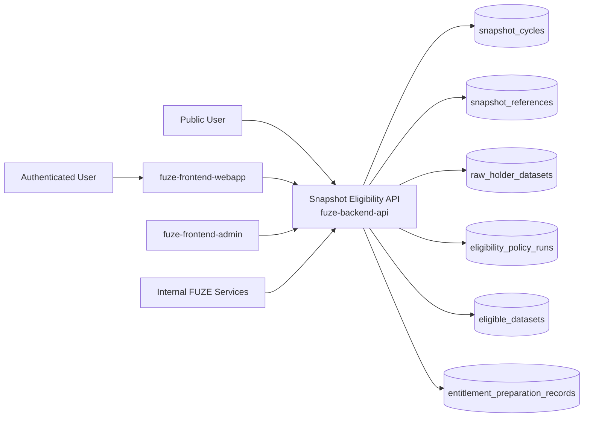
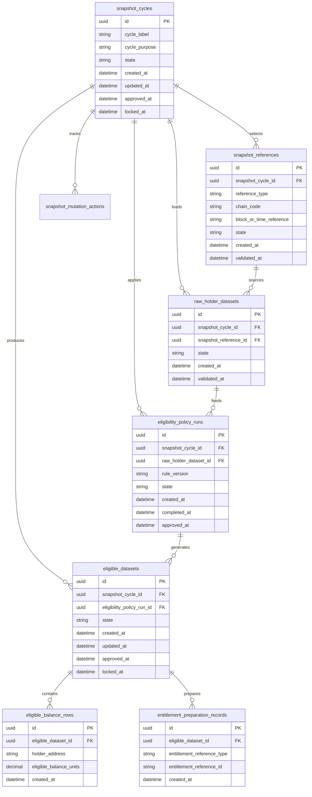
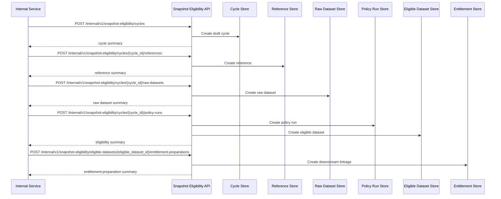

# SNAPSHOT_ELIGIBILITY_API_SPEC

## 1. Title

**SNAPSHOT_ELIGIBILITY_API_SPEC.md**

---

## 2. Document Metadata

- **Document Name:** SNAPSHOT_ELIGIBILITY_API_SPEC.md
- **API Classification:** internal, admin, public-read, event-driven, chain-adjacent
- **Owning Domain:** Snapshot and Eligibility Domain
- **Primary Implementing Repo:** `fuze-backend-api`
- **Primary Chain-Adjacent Dependency:** canonical Ethereum token state and approved downstream payout-execution / reporting integrations
- **Primary System of Record:** snapshot cycles, snapshot references, raw holder datasets, eligibility policy runs, address treatment records, eligible datasets, reconciliation records, and correction-safe eligibility lineage in `fuze-backend-api`
- **Status:** Draft for canonical source-of-truth approval
- **Purpose:** Define the production-grade API contract architecture for FUZE snapshot intake, holder-balance extraction governance, eligibility policy application, cycle-specific eligible dataset construction, downstream entitlement preparation, and correction-safe status disclosure across the platform
- **Canonical Folder:** `fuze.ac > docs > api-spec`

---

## 2.1 API Classification Header

- **API Classification:** internal | admin | public-read | event-driven | chain-adjacent
- **Owning Domain:** Snapshot and Eligibility Domain
- **Primary Implementing Repo:** `fuze-backend-api`
- **Primary System of Record:** snapshot and eligibility pipeline domain

---

## 3. Purpose

This document defines the canonical API specification for FUZE snapshot and eligibility operations. It translates the governing FUZE platform architecture, snapshot and eligibility pipeline rules, chain architecture rules, on-chain/off-chain responsibility rules, profit participation rules, transparency expectations, audit requirements, and API architecture rules into an implementation-ready API contract.

This API exists because FUZE intentionally separates:
- Ethereum as the canonical token participation layer,
- Base as the stablecoin payout execution layer,
- Base as the Platform Credits operational layer,
- and off-chain policy-governed eligibility preparation.

The snapshot and eligibility pipeline is therefore the formal bridge between raw Ethereum holder truth and cycle-specific eligible datasets used for downstream profit participation and other holder-aware platform functions. It cannot be treated as an export script, a spreadsheet exercise, or an informal admin filter. It must preserve canonical source references, policy treatment logic, address categorization, validation and reconciliation discipline, and downstream entitlement-preparation lineage.

Accordingly, this specification defines how snapshot cycles, snapshot references, raw holder datasets, address treatment rules, policy applications, eligibility datasets, and downstream preparation references are represented, and how snapshot and eligibility behavior remains auditable, idempotent, and architecture-consistent across FUZE.

---

## 4. Scope

This specification covers:

- internal APIs for snapshot-cycle creation and lifecycle management
- internal APIs for snapshot reference registration and raw holder dataset intake
- internal APIs for address treatment classification and eligibility policy application
- internal APIs for eligible dataset construction and downstream entitlement-preparation linkage
- internal read APIs for canonical snapshot, raw-balance, treatment, and eligibility status
- admin/control-plane APIs for approve, lock, supersede, correct, or close discrepancy actions
- public-read APIs for bounded public-safe snapshot/eligibility status summaries where policy allows
- event emission requirements for snapshot and eligibility lifecycle changes
- request, response, error, idempotency, versioning, audit, and database-shape rules for this domain

This specification does **not** redefine:

- token contract implementation details
- payout execution contract internals
- payout-ledger semantics in full detail
- treasury release procedures in full detail
- wallet registry semantics in full detail
- final claimant proof format for every future execution design
- raw chain-indexing implementation detail

Those remain governed by their own source-of-truth specifications.

---

## 5. Source-of-Truth Inputs

### Primary FUZE docs and specs used

#### Highest-priority platform and ownership sources
- `SYSTEM_SPEC_INDEX.md`
- `DOCS_SPEC.md`
- `SYSTEM_BOUNDARY_AND_OWNERSHIP_SPEC.md`
- `SYSTEM_OVERVIEW_AND_BOUNDARIES_SPEC.md`
- `PLATFORM_ARCHITECTURE_SPEC.md`
- `DOMAIN_OWNERSHIP_MATRIX_SPEC.md`
- `DATA_MODEL_AND_ENTITY_OWNERSHIP_SPEC.md`
- `ONCHAIN_OFFCHAIN_RESPONSIBILITY_SPEC.md`

#### Primary snapshot / eligibility / payout sources
- `SNAPSHOT_AND_ELIGIBILITY_PIPELINE_SPEC.md`
- `PROFIT_PARTICIPATION_SYSTEM_SPEC.md`
- `PAYOUT_LEDGER_SPEC.md`
- `BASE_PAYOUT_EXECUTION_LAYER_SPEC.md`
- `CHAIN_ARCHITECTURE_SPEC.md`
- `PUBLIC_CONTRACT_AND_WALLET_REGISTRY_SPEC.md`
- `TRANSPARENCY_MODEL_SPEC.md`
- `TRANSPARENCY_REPORTING_SPEC.md`

#### Core docs inputs
- `FUZE_CHAIN_ARCHITECTURE.md`
- `TOKEN_CONTRACT_ARCHITECTURE_.md`
- `STABLECOIN_PROFIT_PARTICIPATION.md`
- `ALLOCATION_WALLET_MAP.md`

#### API and runtime sources
- `API_ARCHITECTURE_SPEC.md`
- `PUBLIC_API_SPEC.md`
- `INTERNAL_SERVICE_API_SPEC.md`
- `EVENT_MODEL_AND_WEBHOOK_SPEC.md`
- `IDEMPOTENCY_AND_VERSIONING_SPEC.md`
- `MIGRATION_AND_BACKWARD_COMPATIBILITY_SPEC.md`
- `AUDIT_LOG_AND_ACTIVITY_SPEC.md`

#### Security and operations sources
- `SECURITY_AND_RISK_CONTROL_SPEC.md`
- `MONITORING_ALERTING_AND_INCIDENT_RESPONSE_SPEC.md`
- `SECRETS_CONFIG_AND_ENVIRONMENT_SPEC.md`

#### Format guides
- `The_API_Specification_guide.md`
- `Database_Schemas_Guide.md`

### Highest-priority interpretation applied

For this file, the most important governing interpretation is:

1. Ethereum is the canonical source of FUZE holder-balance truth for holder-based eligibility
2. raw holder truth and eligible-balance truth are distinct but linked concepts
3. backend owns canonical snapshot-cycle, address-treatment, and eligible-dataset truth
4. policy application must remain explicit and reproducible rather than informal
5. address treatment categories such as treasury-controlled, foundation, team/vesting, operational, and ordinary holder classes must remain explicit and auditable
6. downstream payout or holder-aware systems consume the output of this pipeline but do not redefine the pipeline’s canonical truth

### Supporting external standards used only as guidance

- HTTP semantics for internal mutation and bounded status APIs
- structured problem-details error design
- general deterministic snapshot, dataset-construction, and reconciliation-lineage patterns as supporting guidance

External guidance does not override FUZE source-of-truth documents.

---

## 6. Governing Architecture and Ownership Interpretation

This API belongs to the **Snapshot and Eligibility Domain** because it owns the canonical lifecycle of:
- cycle-specific snapshot selection,
- raw holder dataset extraction,
- address treatment classification,
- policy application,
- eligible dataset construction,
- and downstream entitlement-preparation linkage.

This API is implemented primarily in `fuze-backend-api` because:

- backend owns durable snapshot and eligibility truth
- Ethereum holder truth must be transformed into explicit eligible datasets through governed off-chain policy logic
- multiple adjacent domains depend on this output while remaining structurally separate
- audit, reconciliation, transparency, and correction behavior must be centralized
- public trust requires explicit off-chain state and lineage even when source balances are on-chain

This API is **not** owned by:

- `fuze-frontend-webapp`, because frontend only reads public-safe or bounded first-party status
- `fuze-frontend-admin`, because admin may approve or correct but must not own canonical dataset truth
- `fuze-contracts`, because contracts may consume downstream entitlement output but do not own snapshot policy application
- wallet-aware user domain, because user-linked wallets do not define the cycle-specific eligibility dataset
- treasury domain, because treasury policy may influence exclusion/treatment categories but does not own raw or eligible dataset truth
- profit participation domain, because that domain consumes approved eligibility outputs rather than defining their construction semantics

### Architectural implications

- one snapshot cycle maps to one explicit reference point or block-aligned selection logic
- one snapshot cycle may produce one raw holder dataset and one or more treatment-policy runs, but only one current approved eligibility dataset under current lineage
- one address may appear in raw holder truth and later in eligible or excluded outputs according to policy treatment
- address treatment categories must remain explicit and versioned
- eligibility output is an entitlement input for downstream systems and not the same thing as raw chain balances
- corrections and supersession must preserve lineage rather than silently mutating historical datasets

---

## 7. Domain Responsibilities

The Snapshot and Eligibility API domain is responsible for:

1. maintaining canonical snapshot cycles and references
2. recording raw holder datasets sourced from Ethereum token truth
3. applying explicit treatment categories and eligibility policies
4. constructing cycle-specific eligible datasets
5. producing downstream entitlement-preparation references
6. exposing public-safe and trusted internal status views
7. supporting admin approve, lock, supersede, and correction flows
8. emitting snapshot and eligibility lifecycle events
9. generating audit lineage for sensitive eligibility actions
10. preserving separation between raw balance truth, eligible balance truth, and downstream payout execution

The domain is not responsible for:

- owning token-balance truth outside referenced source extraction
- owning payout execution settlement truth
- owning treasury release authority
- owning public wallet registry truth
- silently redefining exclusion policy outside explicit governance/control paths
- replacing transparency reporting or payout-ledger publication layers

---

## 8. Out of Scope

The following are out of scope for this API specification:

- raw token contract ABI detail
- final Merkle/root proof serialization for every future payout contract version
- public claimant portal UX
- private treasury or security decision logs
- chain-indexer implementation internals
- full wallet-linking identity workflows
- legal-policy wording for exclusions
- external explorer integration specifics

Where later detailed specs are needed, they must remain compatible with this API.

---

## 9. Canonical Entities and Data Ownership

### Durable entities

#### 9.1 snapshot_cycles
- **Owner:** Snapshot and Eligibility Domain
- **Purpose:** canonical cycle or holder-aware operation containers
- **Nature:** source-of-truth durable entity

#### 9.2 snapshot_references
- **Owner:** Snapshot and Eligibility Domain
- **Purpose:** explicit canonical timing/reference records for balance measurement
- **Nature:** source-of-truth durable entity

#### 9.3 raw_holder_datasets
- **Owner:** Snapshot and Eligibility Domain
- **Purpose:** durable raw address-level FUZE holder balance views from Ethereum at the snapshot reference
- **Nature:** source-of-truth durable entity

#### 9.4 raw_holder_balance_rows
- **Owner:** Snapshot and Eligibility Domain
- **Purpose:** address-level balance records in raw holder dataset
- **Nature:** source-of-truth durable entity

#### 9.5 address_treatment_rules
- **Owner:** Snapshot and Eligibility Domain
- **Purpose:** canonical policy-defined treatment categories and address handling rules
- **Nature:** source-of-truth durable entity

#### 9.6 address_treatment_assignments
- **Owner:** Snapshot and Eligibility Domain
- **Purpose:** address-level category assignments and treatment outcomes for one cycle or rule version
- **Nature:** source-of-truth durable lineage entity

#### 9.7 eligibility_policy_runs
- **Owner:** Snapshot and Eligibility Domain
- **Purpose:** explicit execution records of policy application against one raw dataset
- **Nature:** source-of-truth durable lineage entity

#### 9.8 eligible_datasets
- **Owner:** Snapshot and Eligibility Domain
- **Purpose:** canonical processed eligible-balance dataset outputs
- **Nature:** source-of-truth durable entity

#### 9.9 eligible_balance_rows
- **Owner:** Snapshot and Eligibility Domain
- **Purpose:** address-level resulting eligible balances and treatment summaries
- **Nature:** source-of-truth durable entity

#### 9.10 entitlement_preparation_records
- **Owner:** Snapshot and Eligibility Domain
- **Purpose:** linkage from eligible datasets to downstream entitlement/preparation outputs
- **Nature:** durable downstream-lineage entity

#### 9.11 snapshot_reconciliation_records
- **Owner:** Snapshot and Eligibility Domain
- **Purpose:** validation and reconciliation results for raw vs eligible dataset integrity
- **Nature:** durable review/remediation entity

#### 9.12 snapshot_discrepancy_cases
- **Owner:** Snapshot and Eligibility Domain
- **Purpose:** review and remediation records for missing, duplicate, misclassified, or inconsistent snapshot/eligibility states
- **Nature:** durable review/remediation entity

#### 9.13 snapshot_mutation_actions
- **Owner:** Snapshot and Eligibility Domain
- **Purpose:** high-level action records for create, extract, classify, approve, lock, correct, supersede, publish-status, and close discrepancy
- **Nature:** durable action records with audit linkage

#### 9.14 snapshot_audit_events
- **Owner:** Audit / Activity domain, sourced by Snapshot and Eligibility Domain
- **Purpose:** immutable trail for sensitive snapshot and eligibility actions
- **Nature:** durable audit records

### Derived or cached entities

#### 9.15 snapshot_public_status_views
- **Owner:** derived read-model layer
- **Purpose:** public-safe cycle and policy-status summaries
- **Nature:** derived

#### 9.16 snapshot_internal_summary_views
- **Owner:** derived read-model layer
- **Purpose:** trusted aggregate raw-versus-eligible summaries
- **Nature:** derived

#### 9.17 snapshot_discrepancy_views
- **Owner:** derived ops read-model layer
- **Purpose:** visibility into failed, stale, duplicate, or misclassified eligibility conditions
- **Nature:** derived

---

## 10. State Model and Lifecycle

### 10.1 snapshot cycle lifecycle

Possible states:

- `draft`
- `reference_selected`
- `raw_dataset_loaded`
- `policy_applying`
- `eligibility_ready`
- `approved`
- `locked`
- `consumed_downstream`
- `superseded`
- `restricted`

### 10.2 snapshot reference lifecycle

Possible states:

- `proposed`
- `selected`
- `validated`
- `rejected`
- `superseded`

### 10.3 raw dataset lifecycle

Possible states:

- `received`
- `validated`
- `rejected`
- `superseded`

### 10.4 policy run lifecycle

Possible states:

- `created`
- `running`
- `completed`
- `failed`
- `approved`
- `superseded`

### 10.5 eligible dataset lifecycle

Possible states:

- `draft`
- `ready`
- `approved`
- `locked`
- `consumed_downstream`
- `corrected`
- `superseded`

### 10.6 discrepancy lifecycle

Possible states:

- `opened`
- `under_review`
- `resolved`
- `failed`
- `closed`

Lifecycle notes:
- raw dataset truth remains preserved even when eligibility outputs are corrected
- approved eligible datasets become downstream-entitlement inputs only after policy and validation checks pass
- locked status indicates dataset immutability under ordinary flows
- corrections and supersession must preserve old-to-new lineage

---

## 11. API Surface Overview

The API surface is divided into four families:

### 11.1 Public-read APIs
Used by public users, holders, and community observers for:
- reading bounded snapshot-cycle and eligibility-status summaries
- reading high-level treatment/policy disclosure posture where policy allows
- reading historical public-safe cycle status

### 11.2 First-party authenticated read APIs
Used by `fuze-frontend-webapp` and approved first-party clients for:
- reading bounded claimant-linked eligibility status where policy allows
- reading cycle participation-status views without exposing internal raw dataset detail

### 11.3 Internal service APIs
Used by trusted internal services for:
- creating snapshot cycles
- registering snapshot references
- loading raw datasets
- applying treatment and policy rules
- generating eligible datasets
- linking downstream entitlement-preparation outputs
- reading canonical truth

### 11.4 Admin / control-plane APIs
Used by `fuze-frontend-admin` through backend-only privileged routes for:
- approve, lock, correct, supersede, or restrict actions
- discrepancy resolution
- public-safe status update controls where applicable

---

## 12. Authentication and Authorization Model

### 12.1 Authentication posture by route family

#### Public-read routes
No authentication required:
- list public-safe cycle summaries
- read public-safe cycle detail where published

#### Authenticated read routes
Require valid authenticated session:
- read bounded claimant-linked eligibility status where actor has authorized linkage
- read first-party status surfaces derived from canonical snapshot/eligibility truth

#### Internal service routes
Require internal service identity with explicit least privilege:
- create cycles
- register references
- load raw datasets
- apply policy
- generate eligible datasets
- link downstream records
- read canonical truth

#### Admin routes
Require privileged operator identity plus reason-coded actions:
- approve or lock eligible datasets
- correct or supersede cycles/datasets
- restrict visibility or close discrepancy cases

### 12.2 Authorization checkpoints

Authorization must evaluate:
- caller identity and route family
- whether target cycle or dataset is public-safe or privileged internal state
- actor entitlement for first-party claimant-linked reads
- whether internal service has write privilege for lifecycle mutations
- whether admin/operator role is present for approval or correction actions
- whether current state allows requested mutation

### 12.3 Sensitive action rules

The following require heightened checks:
- reference selection for finalized or economically sensitive cycles
- address treatment classification changes
- approval or locking of eligible datasets
- corrections after downstream consumption
- discrepancy-resolution actions

---

## 13. API Endpoints / Interface Contracts

## 13.1 Public-Read APIs

### 13.1.1 `GET /v1/snapshot-eligibility/cycles`
**Purpose:** list published public-safe snapshot and eligibility cycle summaries  
**Caller Type:** public  
**Auth Expectation:** none  
**Query Parameters Summary:**
- optional `state`
- optional `year`
- pagination
**Response Summary:**
- cycle summaries
- public status
- snapshot reference summary
- public-safe treatment/policy version summary where allowed
- timestamps
**Side Effects:** none
**Audit Requirements:** access logging optional
**Emitted Events:** none required

### 13.1.2 `GET /v1/snapshot-eligibility/cycles/{snapshot_cycle_id}`
**Purpose:** retrieve one public-safe cycle detail  
**Caller Type:** public  
**Response Summary:**
- cycle detail
- public eligibility status
- bounded aggregate included/excluded/eligible summary
- transparency/trust references where relevant
- correction or supersession guidance where relevant
**Side Effects:** none

## 13.2 Authenticated Read APIs

### 13.2.1 `GET /v1/snapshot-eligibility/me`
**Purpose:** retrieve bounded claimant-linked eligibility status for current actor where policy allows  
**Caller Type:** authenticated user  
**Auth Expectation:** valid authenticated session  
**Query Parameters Summary:**
- optional `snapshot_cycle_id`
- pagination
**Response Summary:**
- bounded cycle summaries
- eligibility status summaries
- claimant-safe guidance for downstream use where applicable
**Side Effects:** none

### 13.2.2 `GET /v1/snapshot-eligibility/me/cycles/{snapshot_cycle_id}`
**Purpose:** retrieve one bounded claimant-linked cycle detail  
**Caller Type:** authenticated user with authorized linkage  
**Response Summary:**
- bounded eligibility status
- claimant-safe included/excluded/treated summary
- downstream-preparation guidance where applicable
**Side Effects:** none

## 13.3 Internal Service APIs

### 13.3.1 `POST /internal/v1/snapshot-eligibility/cycles`
**Purpose:** create draft snapshot cycle  
**Caller Type:** internal trusted service  
**Auth Expectation:** service-to-service identity only  
**Request Body Summary:**
- `cycle_label`
- `cycle_purpose`
- optional `economic_or_operational_summary`
- `idempotency_key`
**Response Summary:** cycle summary
**Side Effects:** creates draft cycle
**Idempotency Behavior:** required
**Audit Requirements:** sensitive cycle-creation audit
**Emitted Events:** `snapshot_eligibility.cycle_created`

### 13.3.2 `POST /internal/v1/snapshot-eligibility/cycles/{snapshot_cycle_id}/references`
**Purpose:** register explicit snapshot reference for one cycle  
**Caller Type:** internal trusted service  
**Request Body Summary:**
- `reference_type`
- `chain_code`
- `block_or_time_reference`
- `reference_summary`
- `idempotency_key`
**Response Summary:** snapshot-reference summary and cycle-state summary
**Side Effects:** creates snapshot-reference lineage
**Idempotency Behavior:** required
**Audit Requirements:** reference-selection audit
**Emitted Events:** `snapshot_eligibility.reference_registered`

### 13.3.3 `POST /internal/v1/snapshot-eligibility/cycles/{snapshot_cycle_id}/raw-datasets`
**Purpose:** load raw holder dataset for one validated reference  
**Caller Type:** internal trusted service  
**Request Body Summary:**
- `snapshot_reference_id`
- `dataset_summary`
- optional `source_artifact_reference`
- `idempotency_key`
**Response Summary:** raw-dataset summary and validation posture
**Side Effects:** creates raw dataset and raw balance rows
**Idempotency Behavior:** required
**Audit Requirements:** raw-dataset ingest audit
**Emitted Events:** `snapshot_eligibility.raw_dataset_loaded`

### 13.3.4 `POST /internal/v1/snapshot-eligibility/cycles/{snapshot_cycle_id}/policy-runs`
**Purpose:** apply treatment rules and generate eligible dataset from raw holder dataset  
**Caller Type:** internal trusted service  
**Request Body Summary:**
- `raw_holder_dataset_id`
- `treatment_rule_version`
- optional `policy_profile`
- `idempotency_key`
**Response Summary:** policy-run summary, eligible-dataset summary, and aggregate totals
**Side Effects:** creates treatment assignments, policy-run lineage, eligible dataset, and eligible balance rows
**Idempotency Behavior:** required
**Audit Requirements:** critical eligibility-generation audit
**Emitted Events:** `snapshot_eligibility.dataset_generated`

### 13.3.5 `POST /internal/v1/snapshot-eligibility/eligible-datasets/{eligible_dataset_id}/entitlement-preparations`
**Purpose:** link downstream entitlement-preparation output to one approved eligible dataset  
**Caller Type:** internal trusted service  
**Request Body Summary:**
- `entitlement_reference_type`
- `entitlement_reference_id`
- optional `entitlement_summary`
- `idempotency_key`
**Response Summary:** entitlement-preparation summary and updated eligible-dataset state
**Side Effects:** creates downstream-lineage record and may advance consumed_downstream state
**Idempotency Behavior:** required
**Audit Requirements:** downstream-link audit
**Emitted Events:** `snapshot_eligibility.entitlement_prepared`

### 13.3.6 `GET /internal/v1/snapshot-eligibility/cycles/{snapshot_cycle_id}`
**Purpose:** retrieve canonical cycle truth for trusted services  
**Caller Type:** internal trusted service  
**Response Summary:** full cycle, reference, raw dataset, treatment, eligible dataset, reconciliation, and downstream-lineage detail
**Side Effects:** none

## 13.4 Admin / Control-Plane APIs

### 13.4.1 `POST /admin/v1/snapshot-eligibility/cycles/{snapshot_cycle_id}/approve`
**Purpose:** approve eligibility-ready cycle under controlled policy  
**Caller Type:** admin/operator  
**Request Body Summary:**
- `reason_code`
- `operator_note`
- `idempotency_key`
**Response Summary:** approved cycle summary
**Side Effects:** cycle and current eligible dataset move to approved if checks pass
**Audit Requirements:** critical audit
**Emitted Events:** `snapshot_eligibility.cycle_approved`

### 13.4.2 `POST /admin/v1/snapshot-eligibility/cycles/{snapshot_cycle_id}/lock`
**Purpose:** lock approved eligibility dataset for downstream use  
**Caller Type:** admin/operator  
**Request Body Summary:**
- `reason_code`
- `operator_note`
- `idempotency_key`
**Response Summary:** locked cycle summary
**Side Effects:** approved eligible dataset moves to locked state
**Audit Requirements:** critical audit
**Emitted Events:** `snapshot_eligibility.cycle_locked`

### 13.4.3 `POST /admin/v1/snapshot-eligibility/corrections`
**Purpose:** apply controlled correction or superseding treatment to cycle, dataset, or address treatment state  
**Caller Type:** admin/operator  
**Request Body Summary:**
- `target_reference_type`
- `target_reference_id`
- `correction_type`
- `correction_summary`
- `reason_code`
- `operator_note`
- optional `related_case_id`
- `idempotency_key`
**Response Summary:** correction summary
**Side Effects:** creates corrected or superseding cycle/dataset/treatment lineage
**Audit Requirements:** critical audit
**Emitted Events:** `snapshot_eligibility.corrected`

### 13.4.4 `POST /admin/v1/snapshot-eligibility/discrepancies`
**Purpose:** resolve snapshot or eligibility discrepancy under controlled policy  
**Caller Type:** admin/operator  
**Request Body Summary:**
- `target_reference_type`
- `target_reference_id`
- `resolution_code`
- `operator_note`
- `related_case_id`
- `idempotency_key`
**Response Summary:** discrepancy-resolution summary
**Side Effects:** may correct, supersede, restrict, or close discrepancy posture with preserved lineage
**Audit Requirements:** critical audit
**Emitted Events:** `snapshot_eligibility.discrepancy_resolved`

---

## 14. Request Rules

### 14.1 General request rules
- all mutation-capable routes must require JSON requests with explicit content type
- all mutation routes must carry correlation IDs
- sensitive snapshot/eligibility mutations must carry idempotency keys
- admin mutations must require reason codes and operator notes
- no route may accept frontend-authored eligibility truth as authoritative input

### 14.2 Sensitive-action request requirements
The following requests require heightened validation:
- snapshot reference registration for economically sensitive cycles
- raw dataset loading
- address treatment policy application
- eligible dataset approval and lock
- correction after downstream consumption
- discrepancy-resolution actions

Heightened validation may include:
- reference integrity checks
- raw dataset checksum or source integrity checks
- treatment-rule version checks
- included/excluded/eligible reconciliation checks
- operator role confirmation
- governance/finance/security case linkage for sensitive actions

### 14.3 Scope integrity rule
Snapshot/eligibility mutations must target valid and authorized cycles, references, datasets, treatment rules, and downstream linkage records. Services and operators must not mutate unrelated or unauthorized eligibility state.

### 14.4 Layer-separation rule
Raw holder truth, eligible-balance truth, and downstream entitlement-preparation state must remain explicitly separated. Approval or locking of eligibility outputs must not be conflated with downstream payout execution or public distribution settlement.

---

## 15. Response Rules

### 15.1 Success response rules
Successful responses must include:
- stable resource identifiers
- timestamps for created/updated state
- state/status values
- cycle, dataset, or policy-run summaries where relevant
- bounded aggregate included/excluded/eligible totals where relevant
- correlation references for mutations

### 15.2 Async-accepted response rules
If dataset generation, validation, or discrepancy remediation is async, the response must:
- return accepted status
- include action or job ID
- provide follow-up status semantics

### 15.3 Terminal mutation response rules
Terminal mutation responses must clearly show:
- target cycle, dataset, treatment assignment, or discrepancy
- mutation type
- resulting state
- correction, lock, or supersession effects where relevant
- whether public or first-party-safe views may refresh asynchronously

### 15.4 Read response rules
Read responses must distinguish:
- canonical internal raw and eligible dataset truth
- public-safe cycle status
- bounded first-party claimant-linked status
- downstream entitlement-preparation linkage versus downstream executed payout state

---

## 16. Error Model

The API uses structured problem-details style error responses.

### 16.1 Required error fields
- `type`
- `title`
- `status`
- `code`
- `detail`
- `instance`
- `correlation_id`

### 16.2 Common error codes

#### Authorization / permission errors
- `SNAPSHOT_ELIGIBILITY_PERMISSION_DENIED`
- `SNAPSHOT_ELIGIBILITY_OPERATOR_PERMISSION_DENIED`
- `SNAPSHOT_ELIGIBILITY_SERVICE_PERMISSION_DENIED`
- `SNAPSHOT_ELIGIBILITY_AUDIENCE_PERMISSION_DENIED`

#### State conflict errors
- `SNAPSHOT_ELIGIBILITY_CYCLE_STATE_INVALID`
- `SNAPSHOT_ELIGIBILITY_REFERENCE_STATE_INVALID`
- `SNAPSHOT_ELIGIBILITY_DATASET_STATE_INVALID`
- `SNAPSHOT_ELIGIBILITY_POLICY_RUN_STATE_INVALID`
- `SNAPSHOT_ELIGIBILITY_LOCK_CONFLICT`

#### Policy / safety errors
- `SNAPSHOT_ELIGIBILITY_REFERENCE_REQUIRED`
- `SNAPSHOT_ELIGIBILITY_RAW_DATASET_REQUIRED`
- `SNAPSHOT_ELIGIBILITY_APPROVAL_REQUIRED`
- `SNAPSHOT_ELIGIBILITY_DUPLICATE_DATASET`
- `SNAPSHOT_ELIGIBILITY_CORRECTION_NOT_ALLOWED`

#### Request integrity errors
- `SNAPSHOT_ELIGIBILITY_IDEMPOTENCY_KEY_REQUIRED`
- `SNAPSHOT_ELIGIBILITY_REQUEST_INVALID`
- `SNAPSHOT_ELIGIBILITY_REQUEST_UNPROCESSABLE`

#### Dependency or provider errors
- `SNAPSHOT_ELIGIBILITY_CHAIN_SOURCE_UNAVAILABLE`
- `SNAPSHOT_ELIGIBILITY_STORAGE_UNAVAILABLE`
- `SNAPSHOT_ELIGIBILITY_RECONCILIATION_UNAVAILABLE`

### 16.3 Error handling rules
- do not expose hidden internal treasury/security detail in public or low-privilege responses
- do not imply downstream payout entitlement execution from approved or locked dataset state alone
- distinguish no public status from forbidden first-party audience access
- distinguish reference-required from generic invalid state
- include retry guidance only where safe

---

## 17. Idempotency and Mutation Safety

### 17.1 Required idempotent mutations
The following mutation routes require idempotent behavior:
- cycle creation
- snapshot-reference registration
- raw-dataset loading
- policy-run generation
- entitlement-preparation linking
- approval
- lock
- correction
- discrepancy resolution

### 17.2 Idempotency key rules
- mutation requests must supply `Idempotency-Key`
- backend stores key scope, request hash, actor, and terminal result
- replay of same semantic request returns original terminal outcome
- replay of same key with different semantic request must fail with conflict

### 17.3 Mutation safety rules
- one canonical approved eligible dataset per finalized cycle unless explicit supersession lineage exists
- raw dataset and eligible dataset totals must remain reconciled to the selected snapshot reference and treatment rules
- downstream entitlement-preparation linking must not duplicate effective downstream preparation lineage
- corrections must be additive or superseding, not in-place destructive rewrites
- lock and approval actions must preserve prior lineage and auditability

---

## 18. Versioning and Compatibility Rules

### 18.1 Versioning
This API family is versioned under `/v1`, `/internal/v1`, and `/admin/v1` route families.

### 18.2 Compatibility approach
- additive evolution preferred
- no silent semantic change to approved, locked, consumed_downstream, corrected, or superseded states
- new cycle purposes, treatment categories, or entitlement-reference types may be added without breaking existing contracts
- response fields may be added but existing meanings must remain stable

### 18.3 Breaking-change rules
Breaking changes include:
- changing the meaning of raw holder truth versus eligible-balance truth
- changing claimant-linked status semantics incompatibly
- removing critical reference, treatment, or dataset fields
- changing correction or supersession semantics incompatibly

Such changes require explicit migration planning and version evolution.

### 18.4 Deprecation
Deprecated routes or fields must:
- be documented explicitly
- carry deprecation metadata where supported
- preserve compatibility windows long enough for public, first-party, and internal consumers

---

## 19. Event Emission and Webhook Behavior

This domain is event-capable.

### 19.1 Internal events
The Snapshot and Eligibility domain must emit canonical internal events such as:
- `snapshot_eligibility.cycle_created`
- `snapshot_eligibility.reference_registered`
- `snapshot_eligibility.raw_dataset_loaded`
- `snapshot_eligibility.dataset_generated`
- `snapshot_eligibility.entitlement_prepared`
- `snapshot_eligibility.cycle_approved`
- `snapshot_eligibility.cycle_locked`
- `snapshot_eligibility.corrected`
- `snapshot_eligibility.discrepancy_resolved`

### 19.2 Event payload minimums
Each event should contain:
- event ID
- event type
- occurred_at
- snapshot cycle ID
- snapshot reference or dataset reference where relevant
- downstream entitlement reference where relevant
- actor type
- correlation ID
- reason code where applicable

### 19.3 External webhook posture
This specification does not expose general third-party outbound snapshot/eligibility webhooks by default. Any future outbound status webhook surface must be narrow, security-reviewed, and governed by a separate contract.

---

## 20. Audit and Activity Requirements

The following actions must generate durable audit events:

- cycle creation
- reference registration
- raw dataset loading
- eligibility dataset generation
- approval and lock actions
- correction and discrepancy-resolution actions
- other sensitive snapshot/eligibility mutations

### Required audit fields
- audit event ID
- actor type and actor reference
- target cycle / reference / dataset / treatment / entitlement reference / discrepancy reference as applicable
- action type
- before/after summary where applicable
- reason code
- correlation ID
- operator note if operator action
- occurred_at

Public-facing activity may show selected cycle publication events through other bounded surfaces, but canonical internal audit truth remains durable and immutable.

---

## 21. Data Model and Database Schema View

### 21.1 `snapshot_cycles`
- `id` PK
- `cycle_label`
- `cycle_purpose`
- `state`
- `created_at`
- `updated_at`
- `approved_at` nullable
- `locked_at` nullable

**Constraints:**
- unique (`cycle_label`, `cycle_purpose`)
- index on `state`

### 21.2 `snapshot_references`
- `id` PK
- `snapshot_cycle_id` FK -> `snapshot_cycles.id`
- `reference_type`
- `chain_code`
- `block_or_time_reference`
- `reference_summary_json`
- `state`
- `created_at`
- `validated_at` nullable

**Constraints:**
- index on `snapshot_cycle_id`
- index on `state`

### 21.3 `raw_holder_datasets`
- `id` PK
- `snapshot_cycle_id` FK -> `snapshot_cycles.id`
- `snapshot_reference_id` FK -> `snapshot_references.id`
- `state`
- `dataset_summary_json`
- `source_artifact_reference` nullable
- `created_at`
- `validated_at` nullable

**Constraints:**
- unique (`snapshot_cycle_id`, `snapshot_reference_id`)
- index on `snapshot_cycle_id`
- index on `state`

### 21.4 `raw_holder_balance_rows`
- `id` PK
- `raw_holder_dataset_id` FK -> `raw_holder_datasets.id`
- `holder_address`
- `raw_balance_units`
- `created_at`

**Constraints:**
- unique (`raw_holder_dataset_id`, `holder_address`)
- index on `raw_holder_dataset_id`

### 21.5 `address_treatment_rules`
- `id` PK
- `rule_version`
- `rule_summary_json`
- `state`
- `created_at`
- `updated_at`

**Constraints:**
- unique `rule_version`
- index on `state`

### 21.6 `address_treatment_assignments`
- `id` PK
- `snapshot_cycle_id` FK -> `snapshot_cycles.id`
- `holder_address`
- `treatment_category`
- `treatment_reason_code`
- `created_at`

**Constraints:**
- unique (`snapshot_cycle_id`, `holder_address`, `treatment_category`)
- index on `snapshot_cycle_id`
- index on `treatment_category`

### 21.7 `eligibility_policy_runs`
- `id` PK
- `snapshot_cycle_id` FK -> `snapshot_cycles.id`
- `raw_holder_dataset_id` FK -> `raw_holder_datasets.id`
- `rule_version`
- `state`
- `created_at`
- `completed_at` nullable
- `approved_at` nullable

**Constraints:**
- index on `snapshot_cycle_id`
- index on `state`

### 21.8 `eligible_datasets`
- `id` PK
- `snapshot_cycle_id` FK -> `snapshot_cycles.id`
- `eligibility_policy_run_id` FK -> `eligibility_policy_runs.id`
- `state`
- `aggregate_summary_json`
- `created_at`
- `updated_at`
- `approved_at` nullable
- `locked_at` nullable

**Constraints:**
- index on `snapshot_cycle_id`
- index on `state`

### 21.9 `eligible_balance_rows`
- `id` PK
- `eligible_dataset_id` FK -> `eligible_datasets.id`
- `holder_address`
- `eligible_balance_units`
- `treatment_summary_json`
- `created_at`

**Constraints:**
- unique (`eligible_dataset_id`, `holder_address`)
- index on `eligible_dataset_id`

### 21.10 `entitlement_preparation_records`
- `id` PK
- `eligible_dataset_id` FK -> `eligible_datasets.id`
- `entitlement_reference_type`
- `entitlement_reference_id`
- `entitlement_summary_json`
- `created_at`

**Constraints:**
- index on `eligible_dataset_id`
- index on (`entitlement_reference_type`, `entitlement_reference_id`)

### 21.11 `snapshot_reconciliation_records`
- `id` PK
- `snapshot_cycle_id` FK -> `snapshot_cycles.id`
- `state`
- `reconciliation_summary_json`
- `created_at`
- `closed_at` nullable

### 21.12 `snapshot_discrepancy_cases`
- `id` PK
- `target_reference_type`
- `target_reference_id`
- `state`
- `resolution_code` nullable
- `created_at`
- `updated_at`
- `closed_at` nullable

### 21.13 `snapshot_mutation_actions`
- `id` PK
- `target_reference_type`
- `target_reference_id`
- `action_type`
- `state`
- `reason_code`
- `operator_note` nullable
- `requested_by_actor_type`
- `requested_by_actor_id`
- `created_at`
- `executed_at` nullable
- `closed_at` nullable
- `correlation_id`

### 21.14 `idempotency_records`
- `id` PK
- `idempotency_key`
- `scope_family`
- `actor_reference`
- `request_hash`
- `response_hash`
- `terminal_status`
- `created_at`
- `expires_at`

### 21.15 `audit_log_entries`
Domain-sourced audit records written into the audit domain.

### Normalization notes
- canonical snapshot/eligibility truth stays in cycles, references, raw datasets, treatment assignments, policy runs, eligible datasets, and downstream entitlement-preparation records
- public and first-party status views must derive from canonical truth filtered by disclosure policy
- raw address-level holder balances remain separate from processed eligible balance rows
- downstream payout or proof execution truth remains referenced, not duplicated as uncontrolled mutation

### Reconciliation notes
- one approved cycle should reconcile to one current approved eligible dataset under current lineage
- raw balance totals, included totals, excluded totals, and eligible totals must reconcile through explicit treatment rules
- entitlement-preparation records must reconcile to approved eligible dataset state
- discrepancy cases must preserve visible review lineage for failed or conflicting snapshot conditions

---

## 22. Architecture Diagram — Mermaid flowchart



---

## 23. Data Design — Mermaid Diagram



---

## 24. Flow View

### 24.1 Happy path — cycle to approved dataset
1. internal service creates draft snapshot cycle
2. explicit snapshot reference is registered and validated
3. raw holder dataset is loaded from canonical Ethereum holder truth
4. policy run applies address treatment rules and generates eligible dataset
5. admin approves cycle and resulting eligible dataset
6. admin locks approved dataset for downstream use
7. downstream entitlement-preparation linkage is attached
8. public and first-party-safe status views refresh

### 24.2 Happy path — public and first-party status
1. public actor lists published public-safe snapshot cycles
2. authenticated actor checks bounded claimant-linked eligibility status
3. backend filters canonical truth into public or claimant-safe read models
4. actor sees current cycle status, not raw internal preparation records

### 24.3 Alternate path — treatment-driven exclusion
1. raw holder dataset includes addresses from multiple categories
2. policy run assigns address treatment categories
3. some balances remain ordinarily eligible
4. treasury, foundation, team/vesting, or operational classes are excluded or specially treated according to explicit policy
5. eligible dataset preserves resulting mapping and treatment lineage

### 24.4 Failure path — invalid reference or raw dataset
1. reference registration or raw dataset intake is attempted
2. backend detects missing canonical source integrity, invalid chain/ref data, or duplicate dataset conflict
3. request is rejected
4. no effective approved dataset is created

### 24.5 Failure and remediation path — correction or supersession
1. treatment classification, dataset totals, or downstream linkage is found incorrect or stale
2. admin opens correction or discrepancy flow
3. backend preserves prior lineage
4. corrected or superseding dataset is created
5. discrepancy closes with preserved history

### 24.6 Downstream-consumption path
1. approved and locked eligible dataset is prepared for downstream use
2. entitlement-preparation record links the dataset to a downstream system
3. cycle moves to consumed_downstream when policy and lifecycle conditions permit
4. status views show bounded downstream-readiness or downstream-linked posture without implying executed payout settlement

### 24.7 Retry behavior
- duplicate cycle creation returns same canonical cycle result
- duplicate reference registration returns same lineage result where applicable
- duplicate dataset generation returns same canonical result or duplicate-safe conflict
- duplicate approve/lock/correct/discrepancy actions return same terminal action result

---

## 25. Data Flows — Mermaid sequenceDiagram



---

## 26. Security and Risk Controls

1. **Snapshot/eligibility truth is backend-owned**  
   Frontends and informal operational surfaces may not authoritatively define eligibility truth.

2. **Layer separation is mandatory**  
   The API must keep raw Ethereum holder truth, eligible dataset truth, and downstream payout/preparation state explicitly separated.

3. **Canonical-source-before-policy**  
   Raw holder datasets must begin from the correct canonical Ethereum token source and explicit snapshot reference. fileciteturn13file4L47-L56

4. **Deterministic timing integrity**  
   Each cycle must use an explicit snapshot reference tied to the relevant cycle or purpose. fileciteturn13file5L10-L23

5. **Explicit treatment categories**  
   Address classification must remain deliberate, auditable, and policy-defined rather than ad hoc, including controlled-address categories such as treasury, foundation, team/vesting, and operational addresses. fileciteturn13file5L39-L70

6. **Least privilege**  
   Internal write and admin approval/correction routes must be limited to authorized services and operators.

7. **Immutable lineage for economic changes**  
   Corrections, supersession, and discrepancy actions must preserve historical lineage rather than erase prior state.

8. **Public-private field separation**  
   Public and first-party routes must not expose internal treasury/security notes, raw address-level treatment internals beyond bounded policy, or raw source artifacts.

9. **Problem-details discipline**  
   Error bodies must be structured and safe, without exposing hidden internal-only details.

10. **Execution-status integrity**  
    Approved or locked eligible datasets must not be represented as executed payouts until downstream systems confirm their own execution state. The pipeline prepares eligibility and downstream entitlement input; it is not the payout contract itself. fileciteturn13file6L44-L56

---

## 27. Operational Considerations

- public and first-party-safe status routes should remain highly available
- raw dataset validation and policy-run generation are correctness-sensitive and must preserve holder-truth integrity
- included, excluded, and eligible totals should reconcile cleanly before downstream use
- discrepancy and correction flows should be observable and retryable
- monitoring should alert on:
  - failed raw-dataset validations
  - duplicate-dataset anomalies
  - reference mismatch incidents
  - treatment-category drift
  - approval-without-reconciliation attempts
  - public-status inconsistency versus canonical state

---

## 28. Acceptance Criteria

1. The API preserves the distinction between raw holder truth, eligible-balance truth, and downstream entitlement preparation.
2. Only `fuze-backend-api` owns canonical snapshot-cycle, treatment, and eligible-dataset truth.
3. Snapshot cycles, references, raw datasets, policy runs, eligible datasets, and downstream linkage records are durable and backend-owned.
4. Public and first-party routes expose only bounded safe status views.
5. Canonical Ethereum source reference and explicit snapshot timing are enforced before dataset approval. fileciteturn13file4L47-L56 fileciteturn13file5L10-L23
6. Address treatment categories and policy application are explicit and auditable. fileciteturn13file5L39-L70
7. Approve, lock, correction, and discrepancy actions preserve immutable lineage.
8. Dataset generation, approval, correction, and discrepancy actions are idempotent and auditable.
9. Internal and admin snapshot/eligibility routes are least-privilege and backend-only.
10. Admin routes require reason-coded privileged authorization.
11. Event emissions exist for major snapshot/eligibility mutations.
12. Database schema separates cycles, references, raw datasets, treatment assignments, policy runs, eligible datasets, and downstream linkage layers.
13. Downstream systems can consume canonical eligibility outputs without redefining the pipeline’s truth.
14. Discrepancy handling is supported and safely replayable.
15. Mermaid diagrams remain consistent with prose and data model.

---

## 29. Test Cases

### 29.1 Positive cases
1. Internal service creates draft snapshot cycle successfully.
2. Internal service registers snapshot reference successfully.
3. Internal service loads raw holder dataset successfully.
4. Internal service generates eligible dataset successfully.
5. Internal service links downstream entitlement-preparation record successfully.
6. Admin approves cycle successfully.
7. Admin locks approved dataset successfully.
8. Public actor reads published cycle summary successfully.

### 29.2 Negative cases
9. Public user cannot access internal raw dataset detail.
10. Internal service without write privilege cannot create cycle.
11. Dataset generation without valid reference or raw dataset returns `SNAPSHOT_ELIGIBILITY_RAW_DATASET_REQUIRED` or `SNAPSHOT_ELIGIBILITY_REFERENCE_REQUIRED`.
12. Lock without approval returns `SNAPSHOT_ELIGIBILITY_APPROVAL_REQUIRED`.
13. Duplicate dataset generation for same cycle/reference/rule version returns `SNAPSHOT_ELIGIBILITY_DUPLICATE_DATASET`.
14. Authenticated actor without authorized linkage cannot read claimant-linked detail.

### 29.3 Authorization cases
15. Ordinary public or authenticated user cannot call admin approve/lock/correct routes.
16. Internal service without dataset-generation privilege cannot generate eligible datasets.
17. Operator without approval privilege cannot approve or lock cycle/dataset.
18. Approved eligibility output does not prove completed downstream payout settlement by itself.

### 29.4 Idempotency and replay cases
19. Repeating cycle creation with same idempotency key returns original draft cycle result.
20. Repeating reference registration with same idempotency key returns original lineage result.
21. Repeating approval or lock with same idempotency key returns original action result.
22. Repeating correction or discrepancy resolution with same idempotency key returns original terminal action result.

### 29.5 Concurrency cases
23. Concurrent dataset-generation attempts preserve one canonical current eligible-dataset lineage and one duplicate-safe outcome where appropriate.
24. Concurrent approve and correction actions preserve explicit lifecycle ordering without hidden overwrite.
25. Concurrent entitlement-preparation links on same approved dataset preserve one explicit downstream-lineage set and duplicate-safe outcomes where appropriate.

### 29.6 Recovery / admin cases
26. Failed policy-run generation can be corrected or superseded under controlled policy with explicit lineage.
27. Corrected eligible dataset remains historically linked to original dataset.
28. Discrepancy resolution closes classification or reconciliation conflict with preserved audit history.

### 29.7 Event and audit cases
29. Successful cycle creation emits `snapshot_eligibility.cycle_created`.
30. Successful reference registration emits `snapshot_eligibility.reference_registered`.
31. Successful raw-dataset load emits `snapshot_eligibility.raw_dataset_loaded`.
32. Successful dataset generation emits `snapshot_eligibility.dataset_generated`.
33. Successful discrepancy resolution emits `snapshot_eligibility.discrepancy_resolved` with critical audit lineage.

---

## 30. Open Questions or Explicit Deferred Decisions

1. Exact claimant-linkage model for first-party authenticated status views is deferred.
2. Exact rule-version taxonomy and formal policy bundle schema are deferred.
3. Exact downstream entitlement artifact/proof format is deferred.
4. Exact public-safe aggregate disclosure depth for active versus completed cycles is deferred.
5. Exact correction taxonomy for address misclassification anomalies is deferred.
6. Exact discrepancy taxonomy for snapshot and reconciliation conflicts is deferred.

---

## 31. Implementation Notes for `fuze-backend-api`

Recommended backend module layout:

```text
modules/platform/
  snapshot-eligibility/
  profit-participation/
  payout-ledger/
  transparency-reporting/
  audit-log/
  control-plane/
  integrations/
```

Implementation guidance:
- keep cycle identity, reference registration, raw dataset storage, treatment application, eligible dataset generation, and downstream linkage in one canonical domain service
- perform reference-integrity, dataset-integrity, and reconciliation-total checks inside the commit boundary
- keep approval, lock, correction, and supersession actions explicit and idempotent
- treat admin remediations as domain actions, not ad hoc row edits
- emit events only after canonical state commit succeeds
- publish public and first-party-safe status views from canonical truth; do not let derived views mutate snapshot/eligibility state

---

## 32. Frontend Consumption Notes

### For `fuze-frontend-webapp`
- may read public cycle/status views and bounded first-party claimant-linked views where approved
- must not infer eligibility from wallet balance display or client-side logic alone
- must treat backend snapshot/eligibility responses as authoritative
- should clearly distinguish raw holder truth from approved eligibility status when any claimant-safe status is shown

### For `fuze-frontend-admin`
- may trigger privileged approve, lock, correction, and discrepancy actions only through backend admin APIs
- must require operator reason input for sensitive mutations
- must not directly mutate canonical snapshot/eligibility truth client-side
- should present immutable raw-to-eligible lineage and correction history separately from current status summaries

---

## 33. Contract Derivation Notes

### OpenAPI / AsyncAPI
This spec should later derive into:
- public cycle/status and first-party claimant-linked read operations
- internal cycle creation, reference registration, raw-dataset, policy-run, and entitlement-preparation operations
- admin approve / lock / correction / discrepancy operations
- shared problem-details schema
- snapshot/eligibility lifecycle events in AsyncAPI

### Future `fuze-sdk`
Future `fuze-sdk` packages may derive:
- public cycle-status lookup helpers
- first-party claimant-status helpers for approved surfaces
- typed cycle, dataset-status, and treatment-summary models
- problem-error models for snapshot/eligibility outcomes

The SDK must derive from approved API contracts and must not become the source of truth over this narrative specification.
