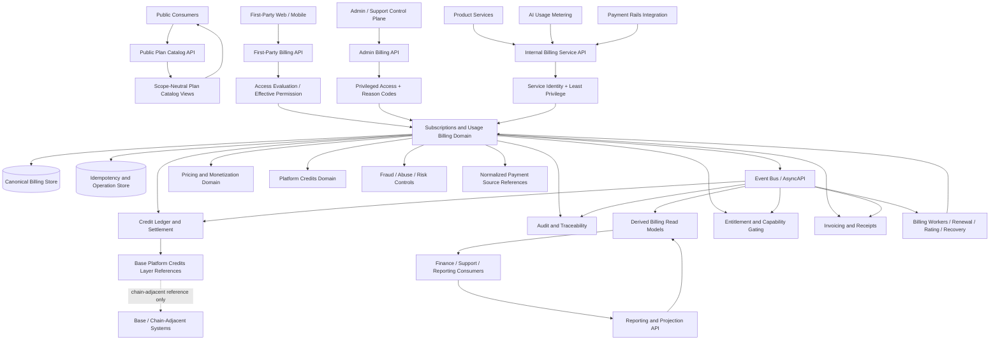
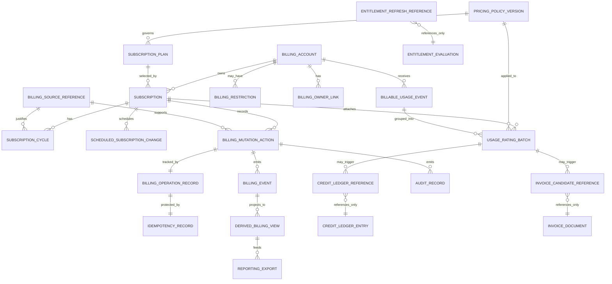
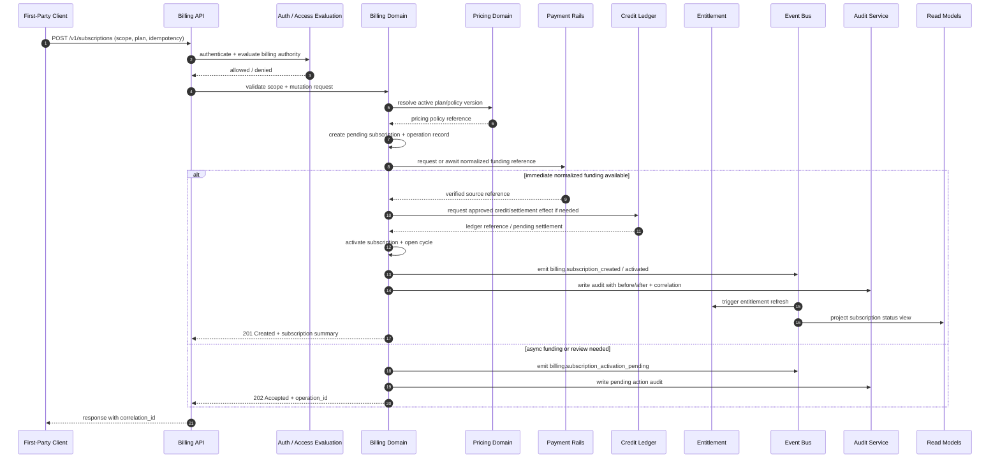
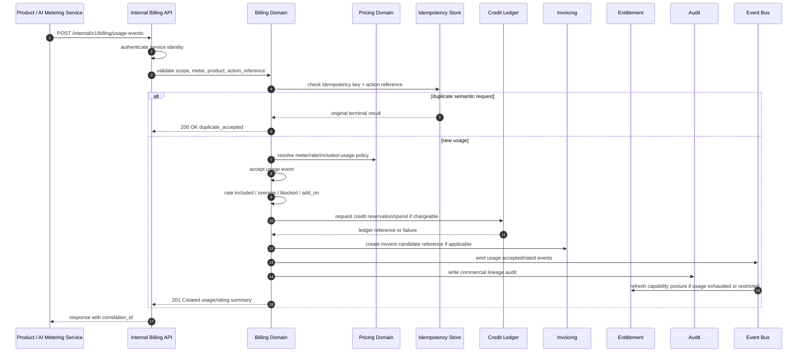

# SUBSCRIPTIONS_AND_USAGE_BILLING_API_SPEC.md

## Title

FUZE Subscriptions and Usage Billing API Specification

## Document Metadata

- **Document Name:** `SUBSCRIPTIONS_AND_USAGE_BILLING_API_SPEC.md`
- **Document Type:** API SPEC v2 / production-grade interface-contract specification
- **Status:** Draft for canonical API SPEC v2 inclusion
- **Version:** 2.0.0
- **Effective Date:** 2026-04-24
- **Last Updated:** 2026-04-24
- **Reviewed On:** 2026-04-24
- **Document Owner:** FUZE Platform Commerce and Billing API Architecture
- **Approval Authority:** FUZE Platform Architecture and Governance Authority
- **Review Cadence:** Quarterly or upon material change to subscriptions, usage billing, Platform Credits, credit-ledger settlement, pricing, payment normalization, entitlement activation, invoicing, refund/reversal controls, fraud posture, workspace billing scope, or AI usage metering
- **Governing Layer:** API contract layer / shared commercial infrastructure / subscriptions and usage billing
- **Parent Registry:** `API_SPEC_INDEX.md`
- **Upstream Semantic Registry:** `REFINED_SYSTEM_SPEC_INDEX.md`
- **Upstream API Registry:** `API_SPEC_INDEX.md`
- **Primary Audience:** Backend engineering, API design, frontend engineering, billing engineering, payments engineering, credits and ledger engineering, entitlement engineering, product engineering, finance operations, support operations, security engineering, audit/compliance, data engineering, platform operations, OpenAPI/AsyncAPI/SDK authors, implementation-contract authors
- **Primary Purpose:** Define the canonical API contract for FUZE subscription state, usage-rated billing, billing-scope resolution, seat-aware commercial posture, plan lifecycle actions, usage-event acceptance, billing-cycle coordination, billing corrections, events, derived read models, and downstream implementation guardrails while preserving the refined system semantics that separate billing truth from payment truth, Platform Credits truth, credit-ledger truth, entitlement truth, invoice/document truth, accounting/profit truth, and product-local UI state.
- **Primary Upstream References:** `REFINED_SYSTEM_SPEC_INDEX.md`, `DOCS_SPEC_INDEX.md`, `SYSTEM_SPEC_INDEX.md`, `API_SPEC_INDEX.md`, `SUBSCRIPTIONS_AND_USAGE_BILLING_SPEC.md`, `PLATFORM_CREDITS_SPEC.md`, `CREDIT_LEDGER_AND_SETTLEMENT_SPEC.md`, `PAYMENT_RAILS_INTEGRATION_SPEC.md`, `INVOICING_AND_RECEIPTS_SPEC.md`, `REFUND_REVERSAL_AND_ADJUSTMENT_SPEC.md`, `PAYMENT_FRAUD_AND_ABUSE_PREVENTION_SPEC.md`, `PRICING_AND_MONETIZATION_MODEL_SPEC.md`, `AI_USAGE_METERING_SPEC.md`, `ENTITLEMENT_AND_CAPABILITY_GATING_SPEC.md`, `ACCESS_EVALUATION_AND_EFFECTIVE_PERMISSION_SPEC.md`, `AUDIT_AND_ACCESS_TRACEABILITY_SPEC.md`, `SECURITY_AND_RISK_CONTROL_SPEC.md`, `API_ARCHITECTURE_SPEC.md`, `PUBLIC_API_SPEC.md`, `INTERNAL_SERVICE_API_SPEC.md`, `EVENT_MODEL_AND_WEBHOOK_SPEC.md`, `IDEMPOTENCY_AND_VERSIONING_SPEC.md`, `MIGRATION_AND_BACKWARD_COMPATIBILITY_SPEC.md`
- **Primary Downstream Dependents:** `PAYMENT_RAILS_INTEGRATION_API_SPEC.md`, `INVOICING_AND_RECEIPTS_API_SPEC.md`, `REFUND_REVERSAL_AND_ADJUSTMENT_API_SPEC.md`, `PAYMENT_FRAUD_AND_ABUSE_PREVENTION_API_SPEC.md`, `PRICING_AND_MONETIZATION_MODEL_API_SPEC.md`, `AI_USAGE_METERING_API_SPEC.md`, `ENTITLEMENT_AND_CAPABILITY_GATING_API_SPEC.md`, product-specific monetization APIs, first-party billing UI contracts, admin support tools, OpenAPI documents, AsyncAPI documents, SDKs, database/schema specs, event consumers, reconciliation and reporting contracts
- **API Surface Families Covered:** Public-read where explicitly allowed, first-party application APIs, internal service APIs, admin/control-plane APIs, event/async APIs, reporting/projection APIs, limited chain-adjacent reference APIs
- **API Surface Families Excluded:** Raw payment provider APIs, full invoice/receipt document APIs, full refund/reversal/correction APIs, full pricing-table administration APIs, final accounting/profit APIs, payout/treasury APIs, direct smart-contract billing APIs, product-local hidden charge APIs
- **Canonical System Owner(s):** Subscriptions and Usage Billing Domain; Platform Commerce and Billing Architecture
- **Canonical API Owner:** FUZE Platform Commerce and Billing API Architecture
- **Supersedes:** `SUBSCRIPTIONS_BILLING_API_SPEC.md` where narrower v1 naming or structure did not fully express API SPEC v2 separation between subscriptions, usage-rated billing, billing scope, entitlement, credits, ledger, payment, invoicing, fraud, audit, migration, diagrams, acceptance criteria, and test cases
- **Superseded By:** Not yet known
- **Related Decision Records:** Not yet known
- **Canonical Status Note:** This document is an API contract expression of refined subscriptions and usage billing semantics. It does not own semantic truth. Downstream OpenAPI, AsyncAPI, SDK, service, worker, UI, dashboard, support, reporting, and migration artifacts MUST preserve the upstream refined system semantics and the API boundaries defined here.
- **Implementation Status:** Normative API baseline for downstream implementation-contract creation
- **Approval Status:** Drafted for architecture review
- **Change Summary:** Upgraded the v1 `SUBSCRIPTIONS_BILLING_API_SPEC.md` into the API SPEC v2 registry filename, strengthened public/first-party/internal/admin/event/reporting separation, added canonical truth classes, request/response/error/idempotency/migration rules, added diagrams, flow view, acceptance criteria, and test cases, and made explicit that billing truth remains separate from payment, credits, entitlement, invoice, accounting, token, treasury, and product-local state.

## Purpose

This API specification governs the FUZE interface-contract layer for subscriptions and usage billing. It translates the canonical refined subscriptions and usage billing semantics into API rules that implementation teams can use without inventing product-local commercial truth or collapsing adjacent commercial domains.

The API exists because FUZE is a multi-product platform with recurring subscriptions, usage-rated charging, seat-aware workspaces, included usage, overage, add-ons, Platform Credits-backed consumption, payment-normalized activation, entitlement propagation, invoice generation, refund/reversal pathways, finance reporting, and support remediation. Those responsibilities require a platform-owned API family that is precise enough for implementation and narrow enough not to take over adjacent domains.

This document defines route/resource families, mutation boundaries, read boundaries, event posture, async behavior, request/response/error/status requirements, idempotency and replay requirements, audit and observability requirements, compatibility rules, diagrams, acceptance criteria, and test cases for subscription and usage billing APIs.

## Scope

This API specification governs:

- plan catalog visibility and scope-aware plan summaries;
- account-scoped and workspace-scoped billing accounts;
- subscriptions, subscription cycles, scheduled changes, cancellations, pauses, resumes, renewals, grace, past-due, restriction, and recovery posture;
- usage-event acceptance for billing purposes after product-domain origination;
- usage rating batches and included-versus-overage classification;
- billing-scope resolution for account and workspace commercial responsibility;
- seat-aware commercial posture where products use team or workspace plans;
- internal billing checks consumed by entitlement, product, AI, workflow, invoicing, credits, and reporting services;
- admin/control-plane correction, restriction, discrepancy, and recovery routes;
- event emission and async operation references for downstream entitlement refresh, invoice candidate generation, credits settlement, audit, reporting, reconciliation, and anomaly detection;
- derived read models and reporting views that expose billing state without becoming semantic owners.

## Out of Scope

This API specification does not govern:

- raw payment provider checkout, capture, webhook verification, rail-specific dispute handling, or payment-method storage;
- full Platform Credits semantic truth or final credit-ledger settlement mechanics;
- full invoice, receipt, tax-document, credit-note, or delivery-document API contracts;
- full refund, reversal, adjustment, chargeback, or correction domain semantics;
- exact pricing tables, promotional campaign rules, or per-product packaging governance;
- exact AI meter formulas or product-specific included-usage algorithms;
- final accounting, profit recognition, treasury, governance, payout, or token participation semantics;
- direct smart-contract billing writes;
- unsupported cross-customer subscription transfer;
- UI copy, presentation layout, or local client state conventions.

## Design Goals

1. Preserve one shared subscriptions and usage billing API architecture across FUZE.
2. Support both recurring access models and usage-rated charging in one platform-owned API family.
3. Preserve explicit separation between billing truth, payment truth, Platform Credits truth, credit-ledger truth, entitlement truth, invoice truth, pricing truth, and accounting/profit truth.
4. Support account-scoped and workspace-scoped commercial responsibility without wrong-scope charging.
5. Make billing mutations idempotent, auditable, scope-aware, policy-bounded, and retry-safe.
6. Provide stable route/resource families for first-party applications, internal services, admin/control-plane systems, events, and reporting.
7. Support OpenAPI, AsyncAPI, SDK, implementation-contract, migration, and QA derivation without endpoint drift or semantic drift.
8. Make failure classes explicit enough for finance, support, entitlement, products, and runtime systems to respond safely.
9. Prevent product-local billing silos, hidden spend paths, duplicate usage billing, and stale UI entitlement shortcuts.
10. Provide testable acceptance criteria and QA scenarios for production readiness.

## Non-Goals

- This API does not make subscription billing the only FUZE commercial model.
- This API does not make usage billing the only FUZE commercial model.
- This API does not define final product pricing numbers.
- This API does not authorize products to bypass the Platform Credits, pricing, entitlement, or ledger domains.
- This API does not expose broad external webhooks for raw billing mutation by default.
- This API does not permit frontend, support tooling, payment providers, dashboards, or product-local caches to become billing truth.

## Core Principles

### Shared Billing Architecture Principle

Products MAY differ in what they charge for, but recurring access, usage-based charging, included usage, overage, add-ons, and entitlement activation MUST resolve through the shared FUZE billing architecture.

### Billing-Is-Not-Payment Principle

Payment-rail state is upstream commercial input. Payment success MAY justify subscription activation, recovery, or cycle settlement after normalization, but raw provider state MUST NOT become subscription truth.

### Billing-Is-Not-Credits Principle

Billing determines commercial obligations and approved usage effects. Platform Credits remain the internal spend unit, and the credit ledger owns final credits mutation lineage.

### Billing-Is-Not-Entitlement Principle

Billing may activate, restrict, or degrade entitlement posture. Entitlement remains separate truth and must evaluate eligibility through its own canonical domain.

### Explicit Scope Principle

Every billable object, subscription, usage event, rating batch, scheduled change, correction, invoice candidate, and ledger effect MUST resolve to one explicit account or workspace billing scope before mutation.

### No Product-Local Billing Truth Principle

Products MAY emit billable events and define chargeable value through approved pricing and product contracts. Products MUST NOT create independent recurring billing truth, standalone balance systems, hidden spend logic, unreconcilable usage meters, or entitlement shortcuts.

### Idempotent Usage Principle

Usage billing MUST be idempotency-aware. Duplicate product events, worker retries, webhook retries, and rating retries MUST NOT create duplicate commercial effects.

### Lineage Preservation Principle

Billing history MUST NOT be destructively rewritten. Corrections, reversals, re-ratings, scope repairs, and admin remediation MUST preserve before/after state, reason codes, actor lineage, approval lineage where required, and correlation references.

### Fail-Closed Financial Safety Principle

When scope, pricing, entitlement, credits, payment, source reference, fraud posture, or authorization cannot be safely established, the API MUST fail closed or enter explicit review/hold rather than silently activating, charging, renewing, or restoring access.

## Canonical Definitions

- **Billing Account:** Canonical commercial scope record for an account or workspace.
- **Billing Scope:** Explicit commercial owner of subscription or usage obligations, usually `account` or `workspace`.
- **Billing Owner:** Account, workspace owner, billing manager, or approved enterprise billing controller responsible for the obligation.
- **Plan:** Named package defining recurring access, cadence, included usage, seat allowances, feature boundaries, and pricing-policy references.
- **Subscription:** Recurring commercial commitment attached to a billing account and plan.
- **Subscription Cycle:** Billing-period lineage and state for one subscription.
- **Scheduled Subscription Change:** Future-effective plan change, cancellation, pause, resume, or downgrade/upgrade action.
- **Usage Event:** Product-originated measurable activity accepted by billing after normalization and idempotency validation.
- **Usage Rating Batch:** Billing-owned rating aggregation that classifies accepted usage as included, overage, add-on, blocked, or chargeable.
- **Included Usage:** Usage allowance bundled into a plan before metered overage applies.
- **Overage:** Usage above included thresholds, handled by credits deduction, add-on purchase, block, top-up, or policy-defined charge.
- **Seat:** Licensable or allocatable participation unit in a workspace-billed environment. Seat state and membership state are related but not identical.
- **Billing Mutation Action:** Durable record of create, renew, change, cancel, pause, resume, restrict, unrestrict, rate, settle, correct, or resolve action.
- **Billing Source Reference:** Verified payment, credits, settlement, refund, correction, migration, or other commercial source reference used to justify a billing mutation.
- **Derived Billing View:** UI, dashboard, reporting, support, product, or export view derived from canonical billing records.

## Truth Class Taxonomy

Downstream API and implementation layers MUST preserve these truth classes:

1. **Identity Truth:** Canonical `account_id` and actor identity.
2. **Session Truth:** Runtime authenticated or privileged session state.
3. **Workspace / Organization Truth:** Collaborative scope and lifecycle state.
4. **Authorization Truth:** Role, permission, scoped grant, and effective permission decisions.
5. **Entitlement Truth:** Commercial and policy eligibility for products, capabilities, and usage posture.
6. **Pricing Truth:** Rate logic, plan packaging, seat pricing, included usage, overage pricing, and promotion policy.
7. **Billing Truth:** Subscription state, billing scope, billing owner, cycle state, usage-rated posture, seat-aware commercial state, renewal/restriction/cancellation posture.
8. **Payment-Rail Truth:** Verified external payment inputs, provider events, channel constraints, dispute signals, and normalized payment references.
9. **Platform Credits Truth:** Credit semantics, classes, ownership scopes, spend categories, restrictions, and issuance categories.
10. **Credit-Ledger Truth:** Append-oriented economic mutation lineage, reservations, spend, release, settlement, reconciliation, and balance derivation.
11. **Invoice / Receipt Truth:** Billing-document state derived from approved billing and payment/settlement events.
12. **Refund / Reversal / Adjustment Truth:** Typed commercial correction and unwind posture.
13. **Risk / Fraud / Policy Truth:** Holds, restrictions, abuse controls, review posture, and containment rules.
14. **Event / Async Truth:** Operation references, event delivery state, worker state, and downstream finalization state.
15. **Derived Read-Model Truth:** Caches, UI summaries, exports, dashboards, reporting projections, and support views.
16. **Presentation Truth:** Client formatting, UI labels, badge copy, localized text, and display grouping.

## Architectural Position in the Spec Hierarchy

This API spec sits below the refined system semantics owned by `SUBSCRIPTIONS_AND_USAGE_BILLING_SPEC.md` and its governing registries. It also depends on the foundation architecture, ownership, access control, entitlement, credits, ledger, payment, invoicing, pricing, refund/reversal, AI usage metering, API architecture, idempotency, migration, event, security, audit, and operations specifications.

This API spec sits above route-level OpenAPI files, AsyncAPI event schemas, SDK models, service implementation contracts, database schema specs, worker contracts, UI contracts, admin-tool contracts, reconciliation/reporting specs, QA suites, and migration runbooks.

## Upstream Semantic Owners

- `SUBSCRIPTIONS_AND_USAGE_BILLING_SPEC.md` owns canonical billing semantics.
- `PRICING_AND_MONETIZATION_MODEL_SPEC.md` owns rate logic, plan packaging, included usage, and commercial policy categories.
- `PLATFORM_CREDITS_SPEC.md` owns Platform Credits semantics.
- `CREDIT_LEDGER_AND_SETTLEMENT_SPEC.md` owns credits mutation lineage and settlement truth.
- `PAYMENT_RAILS_INTEGRATION_SPEC.md` owns normalized payment input truth.
- `INVOICING_AND_RECEIPTS_SPEC.md` owns billing-document truth.
- `REFUND_REVERSAL_AND_ADJUSTMENT_SPEC.md` owns typed correction/unwind semantics.
- `PAYMENT_FRAUD_AND_ABUSE_PREVENTION_SPEC.md` owns commercial fraud, abuse, and hold posture.
- `ENTITLEMENT_AND_CAPABILITY_GATING_SPEC.md` owns capability eligibility truth.
- `AI_USAGE_METERING_SPEC.md` owns AI metering truth where AI actions are chargeable.
- `ACCESS_EVALUATION_AND_EFFECTIVE_PERMISSION_SPEC.md` owns final actor authority for protected billing actions.
- `AUDIT_AND_ACCESS_TRACEABILITY_SPEC.md` and `AUDIT_LOG_AND_ACTIVITY_SPEC.md` own audit lineage and activity governance.

## API Surface Families

### Public API

Public exposure is limited to stable, low-risk, read-only plan catalog information where approved by `PUBLIC_API_SPEC.md`. Public APIs MUST NOT expose private scope state, raw pricing internals, active billing owner data, payment references, usage line items, support notes, fraud posture, or correction records unless an approved public contract explicitly allows it.

### First-Party Application API

First-party applications MAY read scope-authorized subscription summaries, usage summaries, plan catalog entries, billing-scope summaries, and initiate approved subscription actions such as create, schedule change, cancellation, pause, resume, or checkout/activation intent. First-party clients MUST NOT submit authoritative billing truth.

### Internal Service API

Internal services MAY resolve commercial posture, accept normalized billable usage events, request rating, attach rating batches, apply verified settlement references, coordinate entitlement refresh, initiate invoice candidates, and perform billing checks. Internal APIs MUST use service identity, least privilege, idempotency, correlation IDs, and explicit source references.

### Admin / Control-Plane API

Admin/control-plane APIs MAY execute bounded corrections, restriction/unrestriction, discrepancy resolution, forced state repair, or recovery actions. These APIs MUST require privileged operator identity, privileged-session posture where required, reason codes, case references for material corrections, idempotency keys, before/after audit, and policy approval for high-impact actions.

### Event / Webhook / Async API

The domain emits internal events for subscription and usage-billing lifecycle changes. External webhooks are not enabled by default for raw billing mutations. Any external webhook must be separately approved, narrow, redacted, stable, and security-reviewed.

### Reporting / Projection API

Reporting APIs MAY expose derived subscription, usage, renewal, past-due, restriction, and reconciliation summaries. Derived views MUST include freshness and lineage metadata and MUST NOT become mutation authorities.

### Chain-Adjacent API

Chain-adjacent exposure is limited to references linking approved billing effects to Base Platform Credits, settlement commitments, or public trust surfaces where downstream specs permit. Billing APIs MUST NOT directly mutate chain state.

## System / API Boundaries

### Governed by this API

- API contract posture for subscriptions and usage billing.
- Billing account and billing scope route families.
- Subscription lifecycle mutation route families.
- Usage event acceptance and rating coordination route families.
- Billing-cycle and settlement-reference application route families.
- Admin correction and restriction route families.
- Billing event emissions and operation references.
- Derived read models and reporting posture.

### Governed by upstream refined system specs

- Semantic meaning of subscriptions, usage billing, billing scope, seats, included usage, overage, renewal, restriction, and correction.
- Truth-class separation between billing and adjacent domains.
- Ownership boundaries and default decision rules.

### Governed by adjacent API specs

- Payment rail intake and verification APIs.
- Platform Credits and credit-ledger APIs.
- Pricing and monetization APIs.
- Invoicing and receipt APIs.
- Refund/reversal/adjustment APIs.
- Entitlement APIs.
- AI usage metering APIs.
- Audit APIs.
- Fraud/risk APIs.

### Governed by implementation-contract specs

- Database schemas, indexes, retention strategies, worker internals, exact queue names, precise OpenAPI/AsyncAPI schemas, SDK class names, UI components, monitoring dashboards, and operational runbooks.

## Adjacent API Boundaries

- `PLATFORM_CREDITS_API_SPEC.md` exposes credit semantic posture and spend capability but does not own subscription lifecycle.
- `CREDIT_LEDGER_AND_SETTLEMENT_API_SPEC.md` records economic mutation lineage and settlement; billing determines approved commercial effects.
- `PAYMENT_RAILS_INTEGRATION_API_SPEC.md` receives and verifies payment inputs; billing consumes normalized payment references.
- `INVOICING_AND_RECEIPTS_API_SPEC.md` creates billing documents from approved commercial facts; billing supplies invoice-candidate lineage.
- `REFUND_REVERSAL_AND_ADJUSTMENT_API_SPEC.md` coordinates unwind and correction; billing applies approved subscription/usage consequences.
- `PRICING_AND_MONETIZATION_MODEL_API_SPEC.md` defines plan/rate policy; billing consumes the active pricing policy version.
- `ENTITLEMENT_AND_CAPABILITY_GATING_API_SPEC.md` evaluates eligibility; billing emits commercial changes that may trigger entitlement refresh.
- `AI_USAGE_METERING_API_SPEC.md` measures AI usage; billing accepts normalized, attributable usage for rating.
- `AUDIT_LOG_AND_ACTIVITY_API_SPEC.md` records durable audit/activity; billing emits required audit records.

## Conflict Resolution Rules

1. Refined system semantics override API v1 naming or route convenience.
2. Billing truth is determined by canonical billing records, not raw payment provider status, UI plan labels, cached entitlement badges, credit balance alone, invoice display, or product-local assumptions.
3. Payment success does not activate a subscription until the payment rail is normalized and billing applies a valid transition.
4. Credits availability does not imply entitlement, subscription activation, or overage authorization without billing and entitlement evaluation.
5. Entitlement activation cannot rewrite subscription or cycle history.
6. Pricing policy determines rate and plan rules; billing records which policy version was applied.
7. Wrong-scope usage, renewal, seat charge, or correction MUST fail closed and generate audit lineage.
8. Duplicate payment references, usage events, rating batches, or idempotency replays MUST return original results or conflicts, not duplicate charges.
9. Derived read models cannot resolve contradictions against canonical billing records.
10. Admin/operator corrections preserve lineage and reason codes; they do not become ordinary hidden write shortcuts.

## Default Decision Rules

- Default to no mutation unless actor/service authority, billing scope, pricing policy, source reference, and idempotency are valid.
- Default to explicit account/workspace scope instead of inferring from UI context.
- Default to `review_required` or hold for backdated, cross-scope, high-value, broad-impact, or fraud-flagged corrections.
- Default to no entitlement activation when billing state is ambiguous.
- Default to no duplicate charge when any source reference or idempotency key has already produced a terminal result.
- Default to preserving active scheduled changes until explicitly superseded, cancelled, or applied.
- Default to derived-read staleness disclosure when projections lag canonical state.
- Default to public non-exposure for private billing state.

## Roles / Actors / API Consumers

- **Unauthenticated public consumer:** May access only approved, non-sensitive plan catalog information.
- **Authenticated account actor:** May read and mutate own account billing state subject to effective permission, entitlement, risk, and policy.
- **Workspace billing actor:** May act on workspace billing state only with required workspace role/permission and billing authority.
- **Product service:** May emit normalized billable usage and request billing checks through internal routes.
- **AI metering service:** May provide metered AI usage evidence for billing classification.
- **Payment service:** Provides normalized verified payment references for subscription activation, cycle settlement, or recovery.
- **Credits/ledger service:** Applies approved credits effects and returns settlement lineage.
- **Entitlement service:** Consumes billing events and evaluates capability eligibility.
- **Invoice service:** Consumes billing events and creates invoice/receipt candidates.
- **Admin/support operator:** Executes bounded remediation through admin/control-plane APIs.
- **Finance/reconciliation consumer:** Reads reporting/projection APIs and discrepancy signals.
- **Audit/security consumer:** Reads or receives audit and risk-related billing events.

## Resource / Entity Families

### Canonical API Resource Families

- `billing_accounts`
- `billing_scopes`
- `subscription_plans`
- `subscriptions`
- `subscription_cycles`
- `scheduled_subscription_changes`
- `billable_usage_events`
- `usage_rating_batches`
- `billing_mutation_actions`
- `billing_source_references`
- `billing_corrections`
- `billing_restrictions`
- `billing_operation_records`
- `billing_idempotency_records`

### Derived Resource Families

- `subscription_status_views`
- `rated_usage_summary_views`
- `billing_scope_summary_views`
- `renewal_risk_views`
- `billing_reporting_exports`
- `support_billing_views`
- `product_commercial_posture_views`

## Ownership Model

The Subscriptions and Usage Billing Domain owns:

- billing accounts;
- subscription records;
- subscription-cycle state;
- scheduled subscription changes;
- billing owner and billing-scope responsibility;
- billing-specific seat commercial state;
- accepted billable usage lineage after product-origin normalization;
- usage rating batches and included/overage classification;
- renewal, past-due, grace, restriction, recovery, cancellation, and correction posture;
- billing mutation actions and operation records.

Adjacent domains own their own truth and expose inputs or downstream effects. The billing domain consumes those inputs but MUST NOT redefine them.

## Authority / Decision Model

### Billing Domain Authority

Decides subscription lifecycle state, cycle state, usage-rated billing posture, included/overage classification, billing-scope responsibility, billing owner lineage, seat commercial posture, and correction application to billing state.

### Pricing Authority

Decides active rate policy, plan packaging, charge reason mapping, included-usage thresholds, seat formula, overage policy, and promotion posture.

### Payment Authority

Decides whether a payment rail event is verified, normalized, and eligible as a commercial source reference.

### Credits / Ledger Authority

Decides final credit mutation, reservation, release, settlement, reversal, and balance derivation.

### Entitlement Authority

Decides final product/capability eligibility based on billing, credits, policy, risk, and other upstream sources.

### Admin Authority

Admin/control-plane actions can request or apply bounded remediation only under policy. They do not own billing truth generally and must not bypass owner-domain validation.

## Authentication Model

- Public plan catalog routes MAY allow unauthenticated reads only when the response is non-sensitive and scope-neutral.
- Scope-aware reads MUST require authenticated session or service identity.
- First-party mutations MUST require authenticated user session and effective permission for the billing scope.
- Internal service routes MUST require service identity, mTLS or equivalent service-auth posture, least-privilege scopes, and correlation IDs.
- Admin/control-plane routes MUST require authenticated operator identity, privileged-session freshness where required, operator role, policy permission, reason code, and audit correlation.
- Webhook/event ingestion from adjacent domains MUST authenticate source service and validate event signature or trusted transport.

## Authorization / Scope / Permission Model

Billing authorization checks MUST evaluate:

- actor identity;
- session validity and privileged-session freshness where applicable;
- billing scope type and identifier;
- account ownership or workspace role/permission;
- billing-owner or billing-manager authority where applicable;
- action type: read, ordinary mutation, sensitive mutation, privileged correction, internal settlement, or reporting export;
- scope restriction, risk hold, fraud hold, or policy hold;
- service identity and allowed mutation class;
- admin operator permission and case/approval requirements;
- data visibility redaction rules.

Authorization success does not guarantee entitlement success, credits availability, payment success, pricing validity, or billing state transition validity.

## Entitlement / Capability-Gating Model

Billing APIs may trigger entitlement refresh but do not own final entitlement truth.

- Active subscription may justify entitlement activation.
- Past-due, restricted, expired, canceled, exhausted included usage, or failed overage may justify entitlement restriction or degradation.
- Entitlement refresh events MUST include billing scope, product context, subscription or usage reference, change reason, and correlation ID.
- Products MUST use entitlement APIs for capability decisions, not billing-status shortcuts.
- Billing APIs MAY expose product-safe commercial posture, but those fields are convenience reads and MUST NOT replace entitlement evaluation.

## API State Model

### Subscription Plan States

- `draft`
- `active`
- `deprecated`
- `disabled`

### Subscription States

- `pending_activation`
- `trialing`
- `active`
- `grace_period`
- `past_due`
- `restricted`
- `paused`
- `cancel_scheduled`
- `canceled`
- `expired`
- `archived`

### Subscription Cycle States

- `opened`
- `in_progress`
- `awaiting_settlement`
- `closed_paid`
- `closed_unpaid`
- `written_off_if_supported`
- `superseded_by_correction`

### Scheduled Change States

- `scheduled`
- `applied`
- `cancelled`
- `failed`
- `superseded`

### Billable Usage Event States

- `received`
- `accepted`
- `duplicate_accepted`
- `rejected`
- `rated`
- `superseded_by_correction`

### Usage Rating Batch States

- `collecting`
- `rated`
- `attached_to_cycle`
- `awaiting_settlement`
- `finalized`
- `corrected`
- `superseded`

### Billing Mutation Action States

- `requested`
- `accepted`
- `validated`
- `executed`
- `failed`
- `requires_review`
- `reversed_if_supported`
- `closed`

### Billing Restriction States

- `none`
- `warning`
- `grace_period`
- `usage_blocked`
- `subscription_restricted`
- `scope_restricted`
- `fraud_hold`
- `manual_review`

## Lifecycle / Workflow Model

### Subscription Lifecycle

1. Plan selected or subscription intent created.
2. Billing scope resolved and authorized.
3. Pricing policy version and plan availability validated.
4. Payment or credits funding path created or verified where required.
5. Subscription enters `pending_activation` or `trialing`.
6. Billing applies normalized source reference and activates subscription.
7. Subscription cycle opens.
8. Usage events are accepted and rated during the cycle.
9. Renewal evaluates pricing, credits, payment, risk, and policy posture.
10. Cycle closes as paid, unpaid, written off, or corrected.
11. Entitlement, invoice, ledger, audit, reporting, and reconciliation systems consume emitted events.
12. Cancellation, pause, resume, downgrade, or correction may modify future or current state under policy.

### Usage Billing Lifecycle

1. Product or meter service originates usage evidence.
2. Internal service submits normalized usage event with idempotency key and action reference.
3. Billing validates source, scope, product, meter, pricing policy, and duplicate posture.
4. Event is accepted or rejected.
5. Rating classifies usage as included, overage, add-on, blocked, or chargeable.
6. Billing attaches rated usage to subscription cycle or billing scope.
7. Billing triggers ledger, invoice, entitlement, or reporting downstream effects where applicable.
8. Corrections create superseding lineage rather than destructive edits.

## Architecture Diagram - Mermaid flowchart



## Data Design - Mermaid Diagram



Canonical owner-domain data: `BILLING_ACCOUNT`, `SUBSCRIPTION`, `SUBSCRIPTION_CYCLE`, `SCHEDULED_SUBSCRIPTION_CHANGE`, `BILLABLE_USAGE_EVENT` after acceptance, `USAGE_RATING_BATCH`, `BILLING_MUTATION_ACTION`, `BILLING_SOURCE_REFERENCE`, `BILLING_OPERATION_RECORD`, and `IDEMPOTENCY_RECORD`.

Derived or downstream data: `DERIVED_BILLING_VIEW`, `REPORTING_EXPORT`, `CREDIT_LEDGER_REFERENCE`, `INVOICE_CANDIDATE_REFERENCE`, and `ENTITLEMENT_REFRESH_REFERENCE`. Derived and downstream records MUST NOT mutate canonical billing state directly.

## Flow View

### First-Party Subscription Creation

1. Client requests plan catalog or scope billing summary.
2. API authenticates session.
3. API evaluates account/workspace billing authority.
4. API validates billing scope and plan availability against active pricing policy.
5. API requires `Idempotency-Key` and correlation ID for mutation.
6. API creates subscription intent or pending subscription record.
7. API requests approved funding path or awaits normalized source reference.
8. API returns `201 Created` for immediate activation or `202 Accepted` with operation reference for pending activation.
9. Billing emits audit and lifecycle event.
10. Entitlement, invoicing, ledger, and read-model workers update asynchronously where applicable.

### Internal Usage Billing

1. Product or AI metering service emits normalized usage evidence.
2. Internal route authenticates service identity.
3. API validates scope, product, meter, quantity, action reference, and idempotency.
4. Duplicate usage with same semantic key returns original accepted event.
5. New usage event is accepted and stored.
6. Rating worker or synchronous rating classifies included/overage/add-on/blocked.
7. Billing attaches rating batch to cycle or scope.
8. Billing triggers ledger reservation/spend, invoice candidate, entitlement restriction, or reporting projection depending on policy.
9. Failures enter explicit retry, hold, or review state.

### Renewal / Recovery

1. Renewal engine identifies subscription cycle boundary.
2. Billing validates active plan, pricing policy, scope state, risk/fraud holds, credits or payment funding path.
3. If settlement succeeds, cycle closes paid and new cycle opens.
4. If settlement fails, subscription enters grace, past-due, restricted, or review according to policy.
5. Recovery source references may later transition the subscription back to active.
6. All transitions emit audit, event, and operation records.

### Admin Correction

1. Operator opens support/finance case.
2. Admin route authenticates privileged session and operator permission.
3. Request supplies correction type, reason code, operator note, case ID, idempotency key, and target references.
4. API validates policy, scope, prior state, downstream effects, and approval requirement.
5. API applies bounded correction or returns `202 Accepted` for multi-domain correction workflow.
6. Correction emits before/after audit, billing correction event, and downstream refresh/reconciliation events.
7. Historical state is preserved; corrections supersede or annotate rather than rewrite silently.

### Failure / Degraded Mode

1. If adjacent services are unavailable, API rejects unsafe mutations or returns `202 Accepted` only where an explicit operation can safely resume.
2. Read APIs include freshness metadata when projections lag.
3. Ambiguous payment, credits, pricing, risk, or scope state enters hold/review rather than silent activation or charge.
4. Retried operations use idempotency and source-reference checks to return original outcome or conflict.

## Data Flows - Mermaid sequenceDiagram





## Request Model

### Required Headers

- `Authorization` for user/admin routes.
- Service authentication headers for internal routes.
- `Idempotency-Key` for all mutation routes.
- `X-Correlation-ID` for all mutation and internal routes.
- `X-Request-ID` for all routes.
- `Content-Type: application/json` for requests with body.
- `Accept: application/json` unless a reporting export route explicitly supports another media type.

### Common Request Fields

- `scope_type`: `account` or `workspace` unless route identifies scope.
- `scope_id`: canonical scope identifier.
- `product_code`: product context where relevant.
- `plan_code` or `plan_id`: stable plan reference.
- `pricing_policy_version`: required for internal/admin routes that apply rate logic where caller has resolved policy; otherwise returned by billing.
- `reason_code`: required for cancellation, correction, restriction, admin, and support/remediation routes.
- `operator_note`: required for admin/control-plane mutation.
- `related_case_id`: required for material correction, backdated repair, discrepancy resolution, and high-impact support action.
- `source_reference_type` and `source_reference_id`: required when applying payment, credit, refund, migration, or settlement source.
- `action_reference`: required for product-origin usage events.
- `operation_id`: returned for accepted async flows and used for status reads.

### Request Validation Rules

- Mutations MUST reject missing or malformed idempotency keys.
- Mutations MUST reject unknown scope, inactive scope, unauthorized scope, or mismatched scope.
- Product usage events MUST include attributable product, meter, quantity, occurrence time, action reference, and source service identity.
- Settlement applications MUST include verified source references.
- Admin mutations MUST include reason code, operator note, case reference where required, and policy approval reference where required.
- Frontend-computed totals, balances, cycle state, entitlement state, invoice state, or provider state MUST NOT be accepted as authoritative.

## Response Model

### Success Responses

Successful responses MUST include:

- stable resource identifier;
- resource type;
- canonical state;
- scope metadata;
- current version or ETag where relevant;
- timestamps;
- correlation ID;
- operation ID for async or long-running actions;
- applied pricing policy version where a commercial effect occurs;
- downstream refresh hints when read models, entitlements, invoices, or ledger effects may update asynchronously.

### Read Responses

Read responses MUST distinguish:

- canonical billing state;
- derived summary fields;
- freshness timestamp;
- projection version;
- redaction posture;
- visible versus hidden operator/risk fields;
- whether downstream entitlement, invoice, or ledger effects are pending.

### Mutation Responses

- `201 Created` for newly created canonical resources.
- `200 OK` for idempotent replay of a completed semantic request.
- `202 Accepted` for accepted async operations.
- `204 No Content` MAY be used only for safe terminal actions that do not require a body, but billing mutations SHOULD return state summaries.

### Async Operation Response

```json
{
  "operation_id": "op_billing_...",
  "operation_type": "subscription_activation",
  "status": "accepted",
  "scope": {"type": "workspace", "id": "wrk_..."},
  "target": {"type": "subscription", "id": "sub_..."},
  "correlation_id": "corr_...",
  "next_poll_after_seconds": 5
}
```

## Error / Result / Status Model

The API uses structured problem-details-style errors.

### Required Error Fields

- `type`
- `title`
- `status`
- `code`
- `detail`
- `instance`
- `correlation_id`
- `retryable`
- `safe_retry_after_seconds` where applicable
- `operation_id` where an accepted operation exists

### Error Code Families

#### Authentication and Authorization

- `BILLING_SESSION_REQUIRED`
- `BILLING_SERVICE_AUTH_REQUIRED`
- `BILLING_PERMISSION_DENIED`
- `BILLING_SCOPE_PERMISSION_DENIED`
- `BILLING_OPERATOR_PERMISSION_DENIED`
- `BILLING_PRIVILEGED_SESSION_REQUIRED`

#### Scope and Ownership

- `BILLING_SCOPE_NOT_FOUND`
- `BILLING_SCOPE_MISMATCH`
- `BILLING_SCOPE_RESTRICTED`
- `BILLING_OWNER_REQUIRED`
- `BILLING_OWNER_CONFLICT`
- `BILLING_WRONG_SCOPE_CHARGE_FORBIDDEN`

#### Plan, Pricing, and Policy

- `BILLING_PLAN_NOT_FOUND`
- `BILLING_PLAN_UNAVAILABLE`
- `BILLING_PRICING_POLICY_REQUIRED`
- `BILLING_PRICING_POLICY_STALE`
- `BILLING_IMMEDIATE_CHANGE_FORBIDDEN`
- `BILLING_SEAT_POLICY_CONFLICT`

#### Subscription and Cycle State

- `BILLING_SUBSCRIPTION_STATE_INVALID`
- `BILLING_CYCLE_STATE_INVALID`
- `BILLING_PLAN_CHANGE_CONFLICT`
- `BILLING_SCHEDULE_ALREADY_TERMINAL`
- `BILLING_RENEWAL_NOT_ALLOWED`
- `BILLING_CANCELLATION_NOT_ALLOWED`

#### Usage and Rating

- `BILLING_USAGE_EVENT_INVALID`
- `BILLING_USAGE_EVENT_DUPLICATE_CONFLICT`
- `BILLING_USAGE_METER_UNKNOWN`
- `BILLING_USAGE_RATING_UNAVAILABLE`
- `BILLING_INCLUDED_USAGE_EXHAUSTED`
- `BILLING_OVERAGE_POLICY_REQUIRED`

#### Source Reference and Settlement

- `BILLING_SOURCE_REFERENCE_REQUIRED`
- `BILLING_SOURCE_NOT_VERIFIED`
- `BILLING_SOURCE_ALREADY_APPLIED`
- `BILLING_SETTLEMENT_PENDING`
- `BILLING_LEDGER_EFFECT_FAILED`
- `BILLING_PAYMENT_REFERENCE_REJECTED`

#### Idempotency and Request Integrity

- `BILLING_IDEMPOTENCY_KEY_REQUIRED`
- `BILLING_IDEMPOTENCY_CONFLICT`
- `BILLING_REQUEST_INVALID`
- `BILLING_REQUEST_UNPROCESSABLE`
- `BILLING_OPERATION_ALREADY_TERMINAL`

#### Risk, Fraud, and Review

- `BILLING_RISK_HOLD_ACTIVE`
- `BILLING_FRAUD_REVIEW_REQUIRED`
- `BILLING_POLICY_HOLD_ACTIVE`
- `BILLING_ADMIN_APPROVAL_REQUIRED`

#### Dependency and Degraded Mode

- `BILLING_DEPENDENCY_UNAVAILABLE`
- `BILLING_RECONCILIATION_UNAVAILABLE`
- `BILLING_PROJECTION_STALE`
- `BILLING_ASYNC_FINALIZATION_PENDING`

### Result Classes

- `succeeded`
- `accepted`
- `pending_funding`
- `pending_verification`
- `pending_review`
- `pending_settlement`
- `rejected`
- `failed`
- `conflict`
- `restricted`
- `superseded`
- `corrected`

## Idempotency / Retry / Replay Model

### Required Idempotent Mutations

- subscription create/activation;
- plan change scheduling/apply;
- cancellation scheduling/apply;
- pause/resume;
- renewal action;
- usage-event acceptance;
- rating batch creation/finalization;
- cycle settlement application;
- source-reference application;
- admin correction;
- billing-scope restriction/unrestriction;
- discrepancy resolution.

### Idempotency Rules

- Idempotency keys are scoped by route family, actor/service identity, target scope, and semantic request hash.
- Replay with same key and same semantic request MUST return original terminal result.
- Replay with same key and different semantic request MUST fail with `BILLING_IDEMPOTENCY_CONFLICT`.
- Source references such as payment event IDs, ledger references, usage action references, and correction IDs MUST also be protected against duplicate application.
- Idempotency records MUST preserve terminal result, error result where safe, request hash, actor/service identity, scope, correlation ID, operation ID, and TTL/retention policy.
- Retried async operations MUST resume from operation state rather than create duplicate billing actions.

## Rate Limit / Abuse-Control Model

- Public and first-party read routes MUST be rate-limited by actor, IP/device posture where relevant, scope, and route class.
- Mutation routes MUST apply stricter rate limits and duplicate-action detection.
- Usage-event ingestion MUST rate-limit by service identity, product, meter, scope, and action reference uniqueness.
- Admin/control-plane routes MUST be throttled, reason-coded, anomaly-monitored, and alertable.
- Billing routes MUST integrate fraud/risk holds for suspicious payment, usage, workspace, charge, or correction behavior.
- Rate-limit responses MUST not leak private billing state.

## Endpoint / Route Family Model

Route names are contract families, not final OpenAPI exhaustiveness.

### Public / First-Party Routes

- `GET /v1/billing/plans`
- `GET /v1/billing/scopes/{scope_type}/{scope_id}`
- `GET /v1/billing/scopes/{scope_type}/{scope_id}/subscriptions`
- `POST /v1/billing/subscriptions`
- `GET /v1/billing/subscriptions/{subscription_id}`
- `POST /v1/billing/subscriptions/{subscription_id}/changes`
- `POST /v1/billing/subscriptions/{subscription_id}/cancellations`
- `POST /v1/billing/subscriptions/{subscription_id}/pauses`
- `POST /v1/billing/subscriptions/{subscription_id}/resumes`
- `GET /v1/billing/subscriptions/{subscription_id}/cycles`
- `GET /v1/billing/subscriptions/{subscription_id}/usage-summaries`
- `GET /v1/billing/operations/{operation_id}`

### Internal Service Routes

- `POST /internal/v1/billing/subscription-checks`
- `POST /internal/v1/billing/usage-events`
- `POST /internal/v1/billing/rating-batches`
- `POST /internal/v1/billing/cycle-settlements`
- `POST /internal/v1/billing/renewal-evaluations`
- `POST /internal/v1/billing/entitlement-refresh-triggers`
- `POST /internal/v1/billing/invoice-candidates`
- `GET /internal/v1/billing/scopes/{scope_type}/{scope_id}`
- `GET /internal/v1/billing/operations/{operation_id}`

### Admin / Control-Plane Routes

- `GET /admin/v1/billing/scopes/{scope_type}/{scope_id}`
- `POST /admin/v1/billing/subscriptions/{subscription_id}/corrections`
- `POST /admin/v1/billing/cycles/{subscription_cycle_id}/resolutions`
- `POST /admin/v1/billing/scopes/{scope_type}/{scope_id}/restrictions`
- `POST /admin/v1/billing/scopes/{scope_type}/{scope_id}/unrestrictions`
- `POST /admin/v1/billing/discrepancy-resolutions`
- `POST /admin/v1/billing/usage-events/{usage_event_id}/corrections`
- `POST /admin/v1/billing/rating-batches/{rating_batch_id}/corrections`
- `GET /admin/v1/billing/audit-lineage/{billing_reference_id}`

### Reporting / Projection Routes

- `GET /reporting/v1/billing/subscription-status`
- `GET /reporting/v1/billing/usage-summary`
- `GET /reporting/v1/billing/renewal-risk`
- `GET /reporting/v1/billing/reconciliation-summary`
- `POST /reporting/v1/billing/exports`

## Public API Considerations

- Public plan catalog exposure MUST be scope-neutral unless authenticated.
- Public fields MUST avoid internal pricing formulas, fraud/risk posture, billing owner identity, payment references, usage details, correction history, and non-public plan state.
- Public contract changes MUST be stable and backward compatible.
- Public APIs MUST not expose whether a particular account or workspace has an active subscription.

## First-Party Application API Considerations

- First-party clients MAY initiate subscription and cancellation flows but MUST NOT compute canonical billing state.
- First-party clients MUST display pending, accepted, past-due, restricted, canceled, and recovery states distinctly where returned.
- First-party clients MUST not infer entitlement solely from billing summary.
- First-party clients MUST use operation status for async flows.
- Client-side cached billing badges MUST include freshness logic and refresh after billing events.

## Internal Service API Considerations

- Internal services MUST use service identity and least-privilege mutation classes.
- Product services may submit billable usage only for approved products/meters.
- Internal APIs MUST validate source service authority for each product/meter/scope combination.
- Internal usage, settlement, and renewal APIs MUST enforce idempotency and source-reference uniqueness.
- Internal service APIs MUST not become broad-write shortcuts around billing domain validation.

## Admin / Control-Plane API Considerations

- Admin APIs MUST be separate from first-party and internal product APIs.
- Admin actions MUST be reason-coded, case-linked where material, audited, and policy-constrained.
- High-impact actions SHOULD require dual approval or review workflow where policy requires.
- Admin APIs MUST preserve before/after state and downstream effect references.
- Admin APIs MUST not delete billing history; they may correct, supersede, restrict, annotate, or create compensating records.

## Event / Webhook / Async API Considerations

### Internal Events

The domain SHOULD emit these canonical event families:

- `billing.subscription_created`
- `billing.subscription_activation_pending`
- `billing.subscription_activated`
- `billing.subscription_change_scheduled`
- `billing.subscription_changed`
- `billing.subscription_cancel_scheduled`
- `billing.subscription_canceled`
- `billing.subscription_paused`
- `billing.subscription_resumed`
- `billing.subscription_renewal_started`
- `billing.subscription_renewed`
- `billing.subscription_past_due`
- `billing.subscription_restricted`
- `billing.subscription_recovered`
- `billing.usage_event_accepted`
- `billing.usage_rated`
- `billing.usage_blocked`
- `billing.cycle_opened`
- `billing.cycle_settled`
- `billing.cycle_closed`
- `billing.scope_restricted`
- `billing.scope_unrestricted`
- `billing.subscription_corrected`
- `billing.usage_corrected`
- `billing.discrepancy_resolved`

### Event Payload Minimums

- `event_id`
- `event_type`
- `occurred_at`
- `producer`
- `schema_version`
- `scope_type`
- `scope_id`
- `billing_account_id`
- target resource identifier(s)
- `operation_id`
- `correlation_id`
- `actor_type`
- `actor_id` or service reference where safe
- `reason_code` where applicable
- `source_reference` where applicable
- redaction policy marker

### External Webhooks

External billing webhooks are intentionally deferred. Any future external webhook MUST be approved in `EVENT_MODEL_AND_WEBHOOK_SPEC.md` and must expose narrow, redacted, stable, externally meaningful states only.

## Chain-Adjacent API Considerations

- Subscription and usage billing are off-chain platform truth.
- Billing APIs MAY expose references to Base Platform Credits or ledger commitment records where downstream specs allow.
- Billing APIs MUST NOT directly write smart-contract state.
- Chain observations are not billing truth until normalized and validated by the owning domain.
- Public chain-adjacent read models MUST distinguish billing records from settlement commitments or public transparency references.

## Data Model / Storage Support Implications

Implementation storage MUST support:

- unique billing account per `scope_type` and `scope_id` where policy requires;
- subscription plan versioning and deprecation;
- subscription and cycle state machines;
- scheduled changes with terminal/superseded states;
- accepted billable usage events with source service, action reference, scope, product, meter, and idempotency linkage;
- usage rating batches with pricing policy version and included/overage classification;
- billing source references with uniqueness constraints;
- operation and idempotency records;
- audit linkage;
- derived read-model projection timestamps;
- support for immutable or append-only correction lineage;
- retention and archival hooks.

Database schemas MUST be downstream implementation artifacts and MUST NOT redefine the API contract semantics.

## Read Model / Projection / Reporting Rules

- Derived billing views MUST be generated from canonical billing records and events.
- Derived views MUST include freshness timestamp, projection version, and source lineage where relevant.
- Reporting exports MUST preserve scope, product, plan, cycle, usage, pricing policy, and correction lineage.
- Support views MAY aggregate billing state, payment references, invoice references, and ledger references but MUST label each truth class.
- Product views MUST expose only product-safe commercial posture and MUST NOT leak unrelated scope or finance details.
- Stale projections MUST NOT be used as mutation preconditions unless revalidated against canonical state.

## Security / Risk / Privacy Controls

- Billing APIs are financially sensitive and MUST enforce least privilege.
- Billing owner and payment-adjacent references MUST be redacted according to data classification.
- Admin notes and fraud/risk details MUST not be exposed to ordinary first-party clients.
- Sensitive billing mutations MUST be monitored and alertable.
- Scope mismatches, repeated failed payment references, duplicate usage attempts, and unusual correction patterns MUST be risk-signaled.
- Reporting exports MUST enforce privacy, role, and purpose restrictions.
- Billing event payloads MUST be minimized and redacted for each consumer class.

## Audit / Traceability / Observability Requirements

### Required Audit Events

- subscription intent created;
- subscription activated;
- plan change scheduled/applied/superseded;
- cancellation scheduled/applied;
- pause/resume;
- renewal attempt/success/failure;
- past-due, grace, restriction, and recovery transitions;
- usage event accepted/rejected/rated;
- rating batch finalized/corrected;
- source reference applied/rejected;
- cycle settled/closed/corrected;
- admin correction;
- scope restriction/unrestriction;
- discrepancy resolution;
- reporting export creation.

### Required Audit Fields

- audit event ID;
- actor/service/operator type and reference;
- scope type and ID;
- target resource identifiers;
- before/after state where applicable;
- reason code;
- source reference;
- operation ID;
- idempotency key hash;
- correlation ID and trace ID;
- policy version and pricing policy version where relevant;
- timestamp;
- privileged-session reference for admin actions.

### Observability

Implementations MUST emit metrics for request count, mutation count, idempotent replay count, source-reference duplicate count, usage ingestion lag, rating lag, renewal success/failure, past-due volume, restriction volume, projection lag, async operation age, event delivery lag, dependency failures, admin correction count, and high-risk anomaly signals.

## Failure Handling / Edge Cases

- **Active session but expired subscription:** Authentication remains valid; entitlement and billing APIs must return restricted/expired posture.
- **Workspace has credits but wrong scope selected:** Charge fails closed with `BILLING_WRONG_SCOPE_CHARGE_FORBIDDEN`.
- **Usage event arrives twice:** Same semantic action returns original accepted/rated result; conflicting payload returns idempotency or duplicate conflict.
- **Included usage exhausted mid-workflow:** API returns explicit overage, top-up, block, or entitlement restriction posture according to policy.
- **Seat removed while session is active:** Subsequent billing and entitlement checks must reflect seat commercial state; stale session cannot preserve seat-based entitlement.
- **Payment success arrives late:** Recovery must apply normalized source reference and generate explicit state transition.
- **Pricing policy deprecated mid-cycle:** Existing cycle preserves applied policy; new changes use active policy unless migration rule says otherwise.
- **Projection stale:** Read response includes freshness and does not authorize mutation based on stale values.
- **Admin correction conflicts with active worker:** Correction route must acquire operation lock or return conflict/review.
- **Ledger unavailable:** Unsafe charge/settlement mutation fails or enters accepted pending operation only if replay-safe.
- **Fraud hold active:** Mutations that would activate, renew, or restore access fail or enter review.

## Migration / Versioning / Compatibility / Deprecation Rules

- API route families are versioned under `/v1`, `/internal/v1`, `/admin/v1`, and `/reporting/v1` until a breaking change requires `/v2`.
- Additive fields are preferred.
- State meanings MUST NOT change silently.
- Breaking changes include changing subscription state meaning, cycle settlement meaning, usage rating semantics, idempotency behavior, scope ownership behavior, source-reference uniqueness, event names, or correction posture.
- Deprecations MUST include replacement fields/routes, migration window, compatibility notes, and observability for consumer migration.
- Migration from v1 `SUBSCRIPTIONS_BILLING_API_SPEC.md` naming MUST preserve old route compatibility where already implemented, or explicitly document redirects/aliases and their retirement date.
- Product-local billing data MUST be migrated into canonical billing records with lineage and source labels rather than imported as unquestioned truth.

## OpenAPI / AsyncAPI / SDK Derivation Rules

- OpenAPI schemas MUST preserve truth-class distinctions and not flatten billing, payment, credits, entitlement, invoice, and ledger fields into one generic status.
- AsyncAPI schemas MUST include event IDs, schema versions, correlation IDs, operation IDs, scope references, resource references, and redaction posture.
- SDKs MUST expose async operation status distinctly from final business outcome.
- SDKs MUST require idempotency key generation for mutation helpers.
- SDKs MUST not provide convenience methods that infer scope or submit frontend-computed billing truth.
- Error codes MUST be stable enums.
- Generated clients MUST preserve admin/internal/public route separation.

## Implementation-Contract Guardrails

Downstream implementations MUST NOT:

- let frontend plan labels mutate subscription state;
- treat payment provider subscription objects as FUZE subscription truth;
- treat credits balance as active subscription;
- treat invoice paid as subscription active without billing transition;
- let product services write subscription lifecycle state directly;
- rate usage without scope and idempotency;
- apply one payment source reference to multiple cycles unless explicit policy allows split application;
- silently overwrite subscription history during correction;
- expose admin correction APIs through first-party application routes;
- expose raw fraud/risk posture to users;
- use derived read models as mutation authority;
- use chain state as direct billing truth;
- combine account and workspace billing scopes without migration record;
- ignore entitlement refresh after billing state changes.

## Downstream Execution Staging

1. Establish canonical billing resource schemas and state machines.
2. Implement idempotency and operation records before enabling financial mutations.
3. Implement scope-aware read APIs and plan catalog.
4. Implement subscription create/change/cancel/pause/resume flows.
5. Implement internal usage-event acceptance and rating flows.
6. Implement renewal/cycle settlement and recovery flows.
7. Implement event emission and audit lineage.
8. Implement admin/control-plane corrections with policy and reason codes.
9. Implement derived read models and reporting exports.
10. Generate OpenAPI, AsyncAPI, SDKs, contract tests, migration docs, and runbooks.

## Required Downstream Specs / Contract Layers

- OpenAPI contract for public/first-party routes.
- OpenAPI contract for internal service routes.
- OpenAPI contract for admin/control-plane routes.
- AsyncAPI contract for billing events.
- Database schema spec for canonical billing and idempotency records.
- Worker contract for renewal, rating, recovery, projection, entitlement refresh, invoice candidate, and reconciliation jobs.
- SDK contract for first-party clients and internal service consumers.
- Migration plan from v1 subscriptions billing API and product-local billing records.
- QA and contract validation suite.
- Observability dashboard and alerting spec.
- Admin/support runbook.

## Boundary Violation Detection / Non-Canonical API Patterns

The following patterns are forbidden:

- `POST /products/{product}/subscriptions` that creates product-local subscription truth.
- `POST /payments/{payment_id}/activate-subscription` without normalized payment source and billing validation.
- `POST /credits/spend` used by product flows to bypass billing usage rating.
- `GET /users/{id}/is-premium` derived from stale UI or payment state.
- `POST /admin/billing/raw-state` broad admin state writer.
- `PATCH /subscriptions/{id}` accepting arbitrary state fields.
- `POST /usage/charge` without scope, meter, action reference, pricing policy, and idempotency.
- Reporting export APIs that expose private billing owner or payment references without authorization.
- Public webhooks for raw billing mutations without explicit approval.
- Chain transaction observers that mark subscription active without billing-domain validation.

Detection signals SHOULD include route linting, schema checks, forbidden field checks, event consumer contract validation, audit gaps, duplicate source-reference alerts, and projection-authority misuse tests.

## Canonical Examples / Anti-Examples

### Canonical Example: Workspace Plan Upgrade

A workspace billing manager schedules an upgrade through `POST /v1/billing/subscriptions/{subscription_id}/changes` with idempotency key. API verifies workspace permission, billing owner authority, active pricing policy, and subscription state. It creates a scheduled change, emits audit/event records, and returns scheduled state. Entitlement refresh occurs when change applies.

### Anti-Example: Frontend Directly Sets Plan

A frontend sends `state=active` and `plan=premium` after a payment screen. This is forbidden. The API must accept only a subscription intent or plan-change request, then apply normalized payment/credits/pricing/billing validation.

### Canonical Example: Duplicate AI Usage Event

AI metering submits `action_reference=run_123` with idempotency key. Billing accepts and rates it once. Worker retry returns original result and does not create duplicate overage.

### Anti-Example: Product Charges Workspace Owner's Personal Credits

A workspace action silently deducts from the actor's personal account because workspace credits are insufficient. This is forbidden. Wrong-scope charging fails closed or enters explicit top-up/overage policy.

### Canonical Example: Admin Backdated Correction

Support operator submits correction with case ID, reason code, privileged session, and idempotency key. Billing validates policy, records before/after state, emits audit, creates correction lineage, and triggers entitlement/invoice/ledger refresh as needed.

## Acceptance Criteria

1. All mutation routes reject requests without an idempotency key and correlation ID.
2. Subscription creation validates billing scope, actor authority, plan state, pricing policy, and source/funding posture before activation.
3. Workspace billing mutations require workspace billing authority and never fall back to personal account scope silently.
4. Payment provider events cannot activate subscriptions until normalized by payment rail integration and applied by billing.
5. Credits availability alone cannot mark a subscription active.
6. Entitlement status cannot overwrite subscription state.
7. Usage events require source service authority, scope, product, meter, quantity, occurrence time, action reference, and idempotency.
8. Duplicate usage events do not create duplicate rated charges.
9. Included usage and overage classifications are returned distinctly and preserve pricing policy version.
10. Subscription cycle settlement rejects duplicate source references.
11. Admin correction routes require privileged operator identity, reason code, case reference where material, and audit lineage.
12. Derived read models expose freshness and projection metadata.
13. Stale read models are not accepted as mutation authority.
14. Billing state changes emit audit events with before/after state where applicable.
15. Billing state changes emit internal events with event ID, scope, target resource, operation ID, correlation ID, and schema version.
16. Past-due, grace, restricted, canceled, expired, and active states are distinct in API responses.
17. Public plan catalog routes do not expose private scope or owner data.
18. Internal service routes enforce least-privilege service identity.
19. Reporting exports enforce authorization, redaction, and lineage requirements.
20. Migration preserves v1-compatible behavior or documents explicit deprecation and replacement.
21. OpenAPI and AsyncAPI artifacts preserve route-family separation and stable error enums.
22. Observability captures renewal failure, usage rating lag, idempotency conflict, duplicate source reference, admin correction, projection lag, and dependency failure metrics.

## Test Cases

### Positive Path Tests

1. Authenticated account actor creates account-scoped subscription with valid plan and receives `201 Created` or `202 Accepted` with operation ID.
2. Workspace billing manager schedules plan upgrade for workspace subscription and receives scheduled-change summary.
3. Internal AI metering service submits valid usage event and receives accepted usage record.
4. Rating worker classifies usage as included and attaches it to current cycle.
5. Overage usage triggers approved credits ledger reference and invoice candidate where policy requires.
6. Renewal succeeds using normalized payment reference and opens new cycle.
7. Admin operator resolves past-due discrepancy with reason code and audit lineage.
8. Reporting API returns subscription status view with projection freshness metadata.

### Negative Path Tests

9. Unauthenticated user reads workspace subscription and receives `BILLING_SESSION_REQUIRED`.
10. Actor without workspace billing permission attempts cancellation and receives `BILLING_SCOPE_PERMISSION_DENIED`.
11. Subscription creation with disabled plan receives `BILLING_PLAN_UNAVAILABLE`.
12. Request without idempotency key receives `BILLING_IDEMPOTENCY_KEY_REQUIRED`.
13. Payment provider reference not normalized receives `BILLING_SOURCE_NOT_VERIFIED`.
14. Usage event with unknown meter receives `BILLING_USAGE_METER_UNKNOWN`.
15. Wrong-scope workspace charge against personal account receives `BILLING_WRONG_SCOPE_CHARGE_FORBIDDEN`.
16. Admin correction without reason code receives `BILLING_REQUEST_INVALID`.

### Idempotency / Retry / Replay Tests

17. Replaying same subscription create request with same key returns original result.
18. Replaying same key with different plan returns `BILLING_IDEMPOTENCY_CONFLICT`.
19. Duplicate payment source reference cannot settle two cycles unless explicit split policy exists.
20. Duplicate usage action reference does not create second rating batch.
21. Async activation retry resumes existing operation rather than creating a new subscription.

### Conflict / Concurrency Tests

22. Two simultaneous plan changes create one scheduled change and one conflict/supersession result according to policy.
23. Cancellation and renewal race resolves deterministically with operation lock and audit trail.
24. Admin correction during active rating batch returns conflict or review-required state.
25. Seat count changes during subscription downgrade preserve explicit before/after lineage.

### Entitlement / Credits / Payment Boundary Tests

26. Active credits balance without active subscription does not produce active subscription response.
27. Paid invoice without billing transition does not activate subscription.
28. Active subscription event triggers entitlement refresh, but entitlement API remains final eligibility owner.
29. Ledger failure during overage produces pending/failed settlement state without duplicate billing.
30. Payment success after past-due state triggers explicit recovery transition and audit record.

### Rate Limit / Abuse / Risk Tests

31. Rapid repeated subscription create attempts trigger rate limit or abuse signal.
32. Suspicious payment source triggers fraud hold and blocks activation.
33. High-volume usage event bursts are throttled by service/product/meter/scope.
34. Repeated admin correction attempts alert security/audit monitors.

### Degraded Mode Tests

35. Pricing service unavailable causes safe mutation failure or accepted pending operation only where retry-safe.
36. Read-model projection lag returns freshness warning.
37. Event bus outage records operation state and retries event delivery without losing canonical mutation.
38. Ledger dependency outage prevents final charge or marks operation pending without duplicate spend.

### Migration / Compatibility Tests

39. Existing v1 `SUBSCRIPTIONS_BILLING_API_SPEC.md` route consumers receive compatible responses or documented deprecation headers.
40. Migrated product-local subscription records include source labels and do not bypass canonical validation.
41. SDK generated from OpenAPI requires idempotency keys for mutation helpers.
42. AsyncAPI event consumer validates schema version and ignores unknown additive fields safely.

### Boundary Violation Tests

43. Product service attempts to write subscription state directly and is denied.
44. Reporting service attempts mutation using derived view and is denied.
45. Public API request for private workspace billing status is denied or redacted.
46. Chain observer event attempts to activate subscription directly and is rejected pending owner-domain validation.

## Dependencies / Cross-Spec Links

- `REFINED_SYSTEM_SPEC_INDEX.md`
- `API_SPEC_INDEX.md`
- `SUBSCRIPTIONS_AND_USAGE_BILLING_SPEC.md`
- `PLATFORM_CREDITS_SPEC.md`
- `CREDIT_LEDGER_AND_SETTLEMENT_SPEC.md`
- `PAYMENT_RAILS_INTEGRATION_SPEC.md`
- `INVOICING_AND_RECEIPTS_SPEC.md`
- `REFUND_REVERSAL_AND_ADJUSTMENT_SPEC.md`
- `PAYMENT_FRAUD_AND_ABUSE_PREVENTION_SPEC.md`
- `PRICING_AND_MONETIZATION_MODEL_SPEC.md`
- `AI_USAGE_METERING_SPEC.md`
- `ENTITLEMENT_AND_CAPABILITY_GATING_SPEC.md`
- `ACCESS_EVALUATION_AND_EFFECTIVE_PERMISSION_SPEC.md`
- `AUDIT_AND_ACCESS_TRACEABILITY_SPEC.md`
- `API_ARCHITECTURE_SPEC.md`
- `PUBLIC_API_SPEC.md`
- `INTERNAL_SERVICE_API_SPEC.md`
- `EVENT_MODEL_AND_WEBHOOK_SPEC.md`
- `IDEMPOTENCY_AND_VERSIONING_SPEC.md`
- `MIGRATION_AND_BACKWARD_COMPATIBILITY_SPEC.md`
- `SECURITY_AND_RISK_CONTROL_SPEC.md`
- `MONITORING_ALERTING_AND_INCIDENT_RESPONSE_SPEC.md`

## Explicitly Deferred Items

- Exact per-product pricing numbers.
- Exact included-usage formulas by product.
- External billing webhook contract.
- Tax-engine integration details.
- Full invoice and receipt document schemas.
- Full refund/reversal/adjustment workflows.
- Full credit-ledger schema.
- Product-specific billing UI conventions.
- Enterprise contract-specific billing terms.
- Exact Base Platform Credits commitment implementation.

## Final Normative Summary

The FUZE Subscriptions and Usage Billing API is the canonical API contract for exposing and mutating FUZE recurring commercial commitments and usage-rated billing posture. It MUST preserve billing as platform-owned commercial truth while remaining distinct from payment, Platform Credits, credit ledger, entitlement, invoice, refund, pricing, fraud, accounting, public transparency, and product-local state. Every mutation MUST be scope-aware, authorized, idempotent, auditable, policy-valid, and replay-safe. Every read model MUST distinguish canonical truth from derived projection. Every downstream OpenAPI, AsyncAPI, SDK, worker, UI, admin, reporting, and migration artifact MUST preserve these boundaries.

## Quality Gate Checklist

- [x] Upstream refined semantic owners are explicit.
- [x] Canonical API owner is explicit.
- [x] API surface families are explicit.
- [x] Mutation boundaries are explicit.
- [x] Read boundaries are explicit.
- [x] Adjacent API boundaries are explicit.
- [x] Truth classes are explicit.
- [x] Conflict-resolution rules are explicit.
- [x] Default decision rules are explicit.
- [x] Public, first-party, internal, admin/control, event/webhook, reporting, and chain-adjacent distinctions are explicit.
- [x] Non-canonical API patterns are called out.
- [x] Admin override paths are bounded, reason-coded, and audited.
- [x] Read-model, cache, reporting, and projection rules are explicit.
- [x] On-chain vs off-chain responsibilities are explicit.
- [x] Accepted-state vs final success semantics are explicit.
- [x] Idempotency and replay requirements are explicit.
- [x] Request, response, error, result, and status classes are implementation-usable.
- [x] Failure and degraded-mode behaviors are explicit.
- [x] Audit, traceability, and observability requirements are explicit.
- [x] Versioning, migration, compatibility, and deprecation rules are explicit.
- [x] Downstream OpenAPI, AsyncAPI, and SDK guardrails are explicit.
- [x] Dependencies and downstream impacts are explicit.
- [x] Non-goals and deferred items are explicit.
- [x] Architecture Diagram uses Mermaid `flowchart` syntax.
- [x] Architecture Diagram clarifies consumers, surfaces, owner domains, stores, event systems, workers, chain-adjacent references, and downstream consumers.
- [x] Data Design diagram uses Mermaid syntax.
- [x] Data Design distinguishes canonical from derived, cached, projected, reporting, public-read, provider/input, and downstream data.
- [x] Flow View includes synchronous, async, failure, retry, audit, admin/operator, and finalization paths.
- [x] Data Flows use Mermaid `sequenceDiagram` syntax.
- [x] Sequence diagrams distinguish accepted-state responses from final outcomes where relevant.
- [x] Acceptance Criteria are concrete and testable.
- [x] Acceptance Criteria include observable pass/fail conditions.
- [x] Test Cases cover positive, negative, authorization, entitlement, idempotency, retry, conflict, rate-limit, degraded-mode, audit, migration, and boundary-violation behavior.
