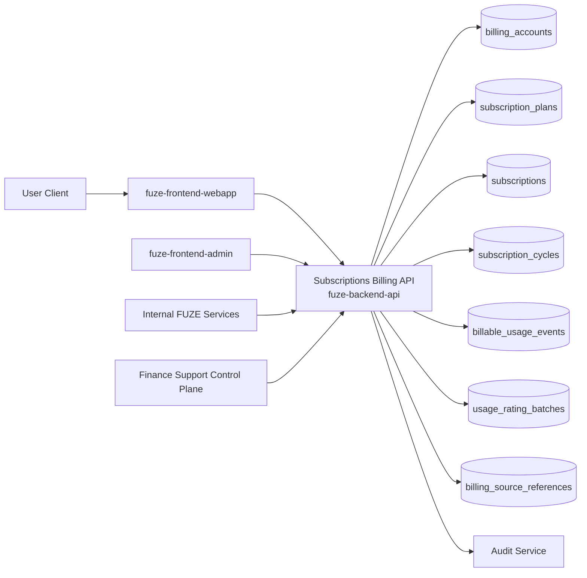
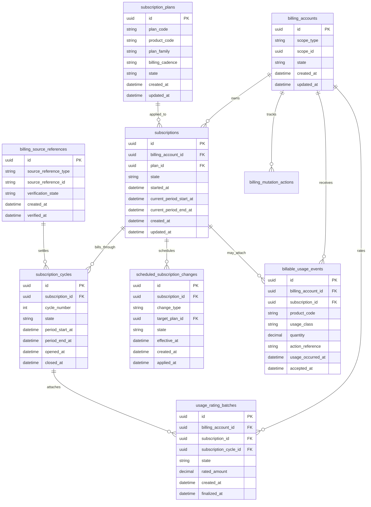
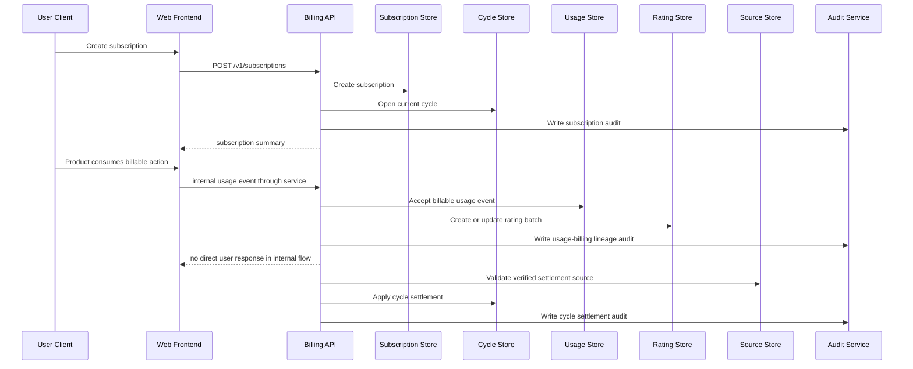

# SUBSCRIPTIONS_BILLING_API_SPEC

## 1. Title

**SUBSCRIPTIONS_BILLING_API_SPEC.md**

---

## 2. Document Metadata

- **Document Name:** SUBSCRIPTIONS_BILLING_API_SPEC.md
- **API Classification:** public, internal, admin, event-driven, chain-adjacent
- **Owning Domain:** Subscriptions and Usage Billing Domain
- **Primary Implementing Repo:** `fuze-backend-api`
- **Primary System of Record:** subscription, billing account, pricing application, billing-cycle state, usage-rated charge state, and invoice-candidate lineage stores in `fuze-backend-api`
- **Status:** Draft for canonical source-of-truth approval
- **Purpose:** Define the production-grade API contract architecture for FUZE subscriptions, recurring billing, usage-rated billing coordination, plan transitions, billing-cycle state, and controlled billing exceptions across the platform
- **Canonical Folder:** `fuze.ac > docs > api-spec`

---

## 2.1 API Classification Header

- **API Classification:** public | internal | admin | event-driven | chain-adjacent
- **Owning Domain:** Subscriptions and Usage Billing Domain
- **Primary Implementing Repo:** `fuze-backend-api`
- **Primary System of Record:** subscription and billing-cycle domain

---

## 3. Purpose

This document defines the canonical API specification for FUZE subscriptions and usage-billing operations. It translates the governing FUZE platform architecture, pricing and monetization rules, Platform Credits semantics, payment-rail normalization, invoicing/receipt expectations, refund/reversal controls, and API architecture rules into an implementation-ready API contract.

This API exists because FUZE is a multi-product platform with recurring subscriptions, usage-rated charges, Platform Credits-funded consumption, workspace and account billing scopes, and product-specific commercial plans built on a shared commercial core. Subscription and billing behavior therefore cannot be left as product-local logic. It must be platform-owned, scope-aware, financially safe, and explicitly separated from token, payout, treasury, and wallet-aware behavior.

Accordingly, this specification defines how subscription plans are represented, how billing scopes are resolved, how recurring billing state and usage-billing state are exposed, how plan changes and renewals are handled, how product and platform consumers obtain billing truth, and how exceptions, retries, and corrections remain auditable, idempotent, and architecture-consistent.

---

## 4. Scope

This specification covers:

- subscription plan visibility APIs
- account- and workspace-scoped subscription read APIs
- subscription creation, update, renewal-control, pause/cancel, and scheduled change APIs
- usage-billing state and rated-usage summary APIs
- billing-scope resolution APIs
- internal service APIs for subscription checks, rating coordination, and billing state transitions
- admin/control-plane APIs for billing corrections, forced renew-state resolution, and subscription restriction handling
- event emission requirements for subscription and usage-billing lifecycle changes
- request, response, error, idempotency, versioning, audit, and database-shape rules for this domain

This specification does **not** redefine:

- raw payment gateway capture details
- invoice and receipt schema in full detail
- Platform Credits ledger semantics in full detail
- raw refund/reversal workflow in full detail
- product entitlement rules in full detail
- Ethereum token, Base payout, treasury, or governance logic
- smart-contract implementation details

Those remain governed by their own source-of-truth specifications.

---

## 5. Source-of-Truth Inputs

### Primary FUZE docs and specs used

#### Highest-priority platform and ownership sources
- `SYSTEM_SPEC_INDEX.md`
- `SYSTEM_BOUNDARY_AND_OWNERSHIP_SPEC.md`
- `SYSTEM_OVERVIEW_AND_BOUNDARIES_SPEC.md`
- `PLATFORM_ARCHITECTURE_SPEC.md`
- `DOMAIN_OWNERSHIP_MATRIX_SPEC.md`
- `DATA_MODEL_AND_ENTITY_OWNERSHIP_SPEC.md`
- `ONCHAIN_OFFCHAIN_RESPONSIBILITY_SPEC.md`

#### Primary billing / commercial / credits sources
- `SUBSCRIPTIONS_AND_USAGE_BILLING_SPEC.md`
- `PRICING_AND_MONETIZATION_MODEL_SPEC.md`
- `PLATFORM_CREDITS_SPEC.md`
- `CREDIT_LEDGER_AND_SETTLEMENT_SPEC.md`
- `PAYMENT_RAILS_INTEGRATION_SPEC.md`
- `INVOICING_AND_RECEIPTS_SPEC.md`
- `REFUND_REVERSAL_AND_ADJUSTMENT_SPEC.md`
- `PAYMENT_FRAUD_AND_ABUSE_PREVENTION_SPEC.md`

#### API and runtime sources
- `API_ARCHITECTURE_SPEC.md`
- `PUBLIC_API_SPEC.md`
- `INTERNAL_SERVICE_API_SPEC.md`
- `IDEMPOTENCY_AND_VERSIONING_SPEC.md`
- `EVENT_MODEL_AND_WEBHOOK_SPEC.md`
- `MIGRATION_AND_BACKWARD_COMPATIBILITY_SPEC.md`
- `AUDIT_LOG_AND_ACTIVITY_SPEC.md`

#### Security and operations sources
- `SECURITY_AND_RISK_CONTROL_SPEC.md`
- `SECRETS_CONFIG_AND_ENVIRONMENT_SPEC.md`
- `MONITORING_ALERTING_AND_INCIDENT_RESPONSE_SPEC.md`

#### Format guides
- `The_API_Specification_guide.md`
- `Database_Schemas_Guide.md`

### Highest-priority interpretation applied

For this file, the most important governing interpretation is:

1. subscriptions and usage billing are platform-owned commercial truth
2. subscription state, usage-rated charge state, and Platform Credits consumption are related but distinct
3. backend owns canonical billing truth
4. products consume canonical billing status and may emit usage events but do not redefine recurring billing semantics
5. admin/control-plane may trigger corrections under controlled policy but do not own billing truth
6. payment normalization is upstream to billing-state mutation; billing truth must not be derived from frontend assumptions or payment provider UI state

### Supporting external standards used only as guidance

- HTTP semantics for safe reads, mutations, and conflict handling
- RFC 9457 problem-details style for machine-readable error responses
- general recurring-billing and rating-lifecycle design patterns as supporting guidance

External guidance does not override FUZE source-of-truth documents.

---

## 6. Governing Architecture and Ownership Interpretation

This API belongs to the **Subscriptions and Usage Billing Domain** because it owns recurring commercial commitments, billing-cycle state, usage-rated billing coordination, and commercial plan application across FUZE. It governs the durable state that determines whether an account or workspace is on a plan, which billing cycle is active, what scheduled plan changes exist, and how usage-rated components attach to recurring billing.

This API is implemented primarily in `fuze-backend-api` because:

- backend owns durable subscription and billing truth
- frontend surfaces must consume billing truth, not invent it
- product domains need a shared and trusted billing-state interface
- renewals, plan changes, exception handling, and corrections are financially sensitive
- chain-adjacent or credits-adjacent implications must be mediated through platform-owned commercial logic

This API is **not** owned by:

- `fuze-frontend-webapp`, because webapp only reads and initiates approved billing actions
- `fuze-frontend-admin`, because admin surfaces trigger privileged corrections but do not own billing truth
- `fuze-contracts`, because subscription and billing state are off-chain platform truth
- payment-rail adapters, because payment-rail events are inputs into billing decisions, not the billing domain itself
- product domains, because products may declare billable usage classes or plan mappings but do not define core recurring billing semantics

### Architectural implications

- subscriptions are scoped to canonical account or workspace billing scopes
- one scope may have zero or one active primary subscription per product-plan family according to policy
- usage-rated billing must preserve lineage from product usage through billing aggregation and, where applicable, credits-funded settlement or invoice inclusion
- billing state must distinguish current active plan, scheduled changes, delinquency/restriction posture, and cancellation timing
- derived billing summaries must never replace canonical subscription and cycle truth
- subscription state, entitlement state, and credits affordability must remain related but distinct

---

## 7. Domain Responsibilities

The Subscriptions and Usage Billing API domain is responsible for:

1. maintaining canonical subscription records and billing-cycle state
2. exposing current subscription status and plan details for allowed scopes
3. scheduling and applying plan changes according to platform rules
4. coordinating recurring billing events with verified payment outcomes and usage-rated charges
5. exposing billing-scope resolution for products and internal services
6. surfacing usage-billing summaries and rated-charge lineage in a policy-bounded way
7. supporting safe internal service billing checks and state transitions
8. supporting admin/control-plane correction-safe actions under policy
9. emitting subscription and billing events
10. generating audit lineage for sensitive commercial mutations

The domain is not responsible for:

- raw payment-checkout capture
- invoice rendering in full detail
- raw ledger mutation of Platform Credits
- payout execution
- token or treasury semantics
- product-local business logic that is not part of billing state

---

## 8. Out of Scope

The following are out of scope for this API specification:

- direct card-provider or app-store API contracts
- full invoice and receipt contract design
- full refund, reversal, and chargeback business workflow design
- external tax engine details
- smart-contract billing implementation details
- unsupported cross-customer subscription transfers
- product-specific plan naming for every future product
- full entitlement calculation rules beyond subscription truth exposure

Where later detailed specs are needed, they must remain compatible with this API.

---

## 9. Canonical Entities and Data Ownership

### Durable entities

#### 9.1 billing_accounts
- **Owner:** Subscriptions and Usage Billing Domain
- **Purpose:** canonical billing scope record for account or workspace
- **Nature:** source-of-truth durable entity

#### 9.2 subscription_plans
- **Owner:** Subscriptions and Usage Billing Domain
- **Purpose:** canonical plan catalog definitions
- **Nature:** source-of-truth durable entity

#### 9.3 subscriptions
- **Owner:** Subscriptions and Usage Billing Domain
- **Purpose:** canonical recurring commercial commitment record
- **Nature:** source-of-truth durable entity

#### 9.4 subscription_cycles
- **Owner:** Subscriptions and Usage Billing Domain
- **Purpose:** billing-period lineage and state for one subscription
- **Nature:** source-of-truth durable entity

#### 9.5 scheduled_subscription_changes
- **Owner:** Subscriptions and Usage Billing Domain
- **Purpose:** future-effective plan changes, cancellations, pauses, or resumes
- **Nature:** source-of-truth durable entity

#### 9.6 usage_rating_batches
- **Owner:** Subscriptions and Usage Billing Domain
- **Purpose:** rated aggregation record for billable usage attached to a subscription or billing scope
- **Nature:** durable source-of-truth batch lineage

#### 9.7 billable_usage_events
- **Owner:** product domains may originate usage signals, but canonical accepted billable-event records are owned by Subscriptions and Usage Billing Domain
- **Purpose:** normalized billable usage lineage for rating and billing attachment
- **Nature:** source-of-truth durable entity after acceptance

#### 9.8 billing_mutation_actions
- **Owner:** Subscriptions and Usage Billing Domain
- **Purpose:** high-level action records for create, renew, change, cancel, pause, resume, correction, or restriction
- **Nature:** durable action records with audit linkage

#### 9.9 billing_source_references
- **Owner:** Subscriptions and Usage Billing Domain
- **Purpose:** verified payment or commercial source references that justify billing state transitions
- **Nature:** source-of-truth durable reference entity

#### 9.10 billing_audit_events
- **Owner:** Audit / Activity domain, sourced by Subscriptions and Usage Billing Domain
- **Purpose:** immutable trail for sensitive billing actions
- **Nature:** durable audit records

### Derived or cached entities

#### 9.11 subscription_status_views
- **Owner:** derived read-model layer
- **Purpose:** user-facing and product-facing subscription summaries
- **Nature:** derived

#### 9.12 rated_usage_summary_views
- **Owner:** derived read-model layer
- **Purpose:** product-safe usage-rated billing summaries
- **Nature:** derived

#### 9.13 renewal_risk_views
- **Owner:** derived ops/finance read-model layer
- **Purpose:** delinquency, retry, and recovery-safe renewal summaries
- **Nature:** derived

---

## 10. State Model and Lifecycle

### 10.1 subscription plan lifecycle

Possible states:

- `draft`
- `active`
- `deprecated`
- `disabled`

### 10.2 subscription lifecycle

Possible states:

- `pending_activation`
- `active`
- `past_due`
- `restricted`
- `paused`
- `cancel_scheduled`
- `cancelled`
- `expired`

### 10.3 subscription cycle lifecycle

Possible states:

- `opened`
- `in_progress`
- `awaiting_settlement`
- `closed_paid`
- `closed_unpaid`
- `written_off_if_supported`

### 10.4 scheduled change lifecycle

Possible states:

- `scheduled`
- `applied`
- `cancelled`
- `failed`
- `superseded`

### 10.5 usage rating batch lifecycle

Possible states:

- `collecting`
- `rated`
- `attached_to_cycle`
- `finalized`
- `corrected`
- `superseded`

### 10.6 billing mutation action lifecycle

Possible states:

- `requested`
- `validated`
- `executed`
- `failed`
- `reversed_if_supported`
- `closed`

Lifecycle notes:
- active subscription truth must not depend on frontend-local assumptions
- past-due and restricted are distinct; one reflects commercial payment/settlement issues, the other reflects policy-enforced access posture
- scheduled changes remain distinct from the current active plan until effective time
- usage rating batches preserve lineage and correction history instead of silent overwrite

---

## 11. API Surface Overview

The API surface is divided into four families:

### 11.1 Public / first-party user-facing APIs
Used by `fuze-frontend-webapp` and approved first-party clients for:
- reading current subscription status
- listing visible subscription plans
- creating or upgrading/downgrading a subscription intent
- scheduling cancellation or pause/resume where policy allows
- reading usage-rated billing summaries
- reading billing-scope summaries

### 11.2 Internal service APIs
Used by trusted internal services for:
- validating billing state for a scope
- opening/advancing subscription state
- applying verified payment outcomes to cycles
- accepting billable usage events
- creating rating batches and attaching them to cycles
- checking whether a scope is commercially active for a product context

### 11.3 Admin / control-plane APIs
Used by `fuze-frontend-admin` through backend-only privileged routes for:
- corrective plan or cycle state transitions
- forced cancel / unschedule / resume actions
- delinquency-state resolution
- billing-account restriction or restoration
- discrepancy and support-case corrections

### 11.4 Event-driven interfaces
Used for downstream side effects:
- audit generation
- entitlement refresh triggers
- invoice candidate generation
- credits-funded usage settlement triggers where applicable
- analytics and reporting
- reconciliation and anomaly detection

---

## 12. Authentication and Authorization Model

### 12.1 Authentication posture by route family

#### Authenticated user routes
Require valid authenticated session:
- read own account subscriptions
- read workspace subscriptions if actor is authorized in workspace
- read plan catalog
- create/change/cancel/pause/resume allowed subscriptions in owned/authorized billing scope
- read visible usage-rated billing summaries

#### Internal service routes
Require internal service identity with explicit least privilege:
- validate billing state
- apply verified cycle settlement transitions
- accept billable usage events
- rate usage
- attach usage batches to billing cycles
- perform internal status resolution

#### Admin routes
Require privileged operator identity plus reason-coded actions:
- corrective subscription state changes
- forced unschedule/cancel/resume
- delinquency resolution
- billing-account restriction/unrestriction
- discrepancy resolution

### 12.2 Authorization checkpoints

Authorization must evaluate:
- canonical account identity
- session validity
- target billing scope (account/workspace)
- actor’s workspace role where applicable
- whether action is read-only, mutation, or privileged correction
- whether target billing account is restricted/suspended
- whether internal service has required mutation class privilege
- whether admin/operator role is present for privileged actions

### 12.3 Sensitive action rules

The following require heightened checks:
- subscription create / upgrade / downgrade for billed scope
- immediate cancel or pause/resume
- internal verified settlement application
- internal usage rating attach/finalize actions
- admin corrective state transitions
- billing-account restriction or delinquency resolution

---

## 13. API Endpoints / Interface Contracts

## 13.1 Public / First-Party User APIs

### 13.1.1 `GET /v1/subscriptions/plans`
**Purpose:** list visible subscription plans and plan metadata for current actor and scope family  
**Caller Type:** authenticated user or approved public-read consumer where allowed  
**Auth Expectation:** session required for scope-aware plan visibility; limited public-read may be supported separately by public API design
**Query Parameters Summary:**
- optional `product_code`
- optional `scope_type`
- optional `country_or_region_hint`
**Response Summary:**
- plan catalog entries
- billing cadence
- visible included usage summaries
- plan state and deprecation metadata
**Side Effects:** none
**Audit Requirements:** access logging only
**Emitted Events:** none required

### 13.1.2 `GET /v1/subscriptions/me`
**Purpose:** retrieve current account-scoped subscription summary for current actor  
**Caller Type:** authenticated user  
**Response Summary:**
- billing account identifier
- active subscription summaries
- current cycle summary
- scheduled changes
- delinquency/restriction posture summary
**Side Effects:** none

### 13.1.3 `GET /v1/workspaces/{workspace_id}/subscriptions`
**Purpose:** retrieve workspace-scoped subscription summary where actor is authorized  
**Caller Type:** authenticated user  
**Response Summary:** workspace subscription and cycle summaries
**Side Effects:** none

### 13.1.4 `POST /v1/subscriptions`
**Purpose:** create or activate a subscription intent for an account or workspace billing scope  
**Caller Type:** authenticated user with required billing authority  
**Request Body Summary:**
- `scope_type`
- `scope_id`
- `plan_code`
- optional `start_mode`
- optional `billing_owner_reference`
- optional `payment_method_hint`
- `idempotency_key`
**Response Summary:**
- subscription summary
- activation state
- pending-payment or pending-verification metadata where applicable
**Side Effects:** creates subscription record or activation intent
**Idempotency Behavior:** required
**Audit Requirements:** sensitive commercial mutation audit
**Emitted Events:** `billing.subscription_created`

### 13.1.5 `POST /v1/subscriptions/{subscription_id}/changes`
**Purpose:** schedule or apply plan change for an active subscription  
**Caller Type:** authenticated user with billing authority  
**Request Body Summary:**
- `target_plan_code`
- `effective_mode` (`next_cycle`, `immediate_if_allowed`)
- optional `reason_code`
- `idempotency_key`
**Response Summary:** scheduled change summary and resulting subscription status
**Side Effects:** creates scheduled change or immediate plan transition
**Idempotency Behavior:** required
**Audit Requirements:** sensitive commercial mutation audit
**Emitted Events:** `billing.subscription_change_scheduled`, `billing.subscription_changed`

### 13.1.6 `POST /v1/subscriptions/{subscription_id}/cancellations`
**Purpose:** schedule or apply cancellation for a subscription  
**Caller Type:** authenticated user with billing authority  
**Request Body Summary:**
- `effective_mode`
- optional `reason_code`
- `idempotency_key`
**Response Summary:** cancellation scheduling or terminal subscription summary
**Side Effects:** marks cancel_scheduled or cancelled
**Idempotency Behavior:** required
**Audit Requirements:** sensitive commercial mutation audit
**Emitted Events:** `billing.subscription_cancel_scheduled`, `billing.subscription_cancelled`

### 13.1.7 `POST /v1/subscriptions/{subscription_id}/pauses`
**Purpose:** schedule or apply pause for a subscription where policy allows  
**Caller Type:** authenticated user with billing authority  
**Request Body Summary:**
- optional `effective_mode`
- optional `reason_code`
- `idempotency_key`
**Response Summary:** pause scheduling or updated subscription summary
**Side Effects:** transitions to paused or schedules pause
**Idempotency Behavior:** required
**Audit Requirements:** sensitive commercial mutation audit
**Emitted Events:** `billing.subscription_paused`

### 13.1.8 `POST /v1/subscriptions/{subscription_id}/resumes`
**Purpose:** resume a paused subscription where policy allows  
**Caller Type:** authenticated user with billing authority  
**Request Body Summary:**
- optional `reason_code`
- `idempotency_key`
**Response Summary:** updated subscription summary
**Side Effects:** paused -> active or scheduled resume
**Idempotency Behavior:** required
**Audit Requirements:** sensitive commercial mutation audit
**Emitted Events:** `billing.subscription_resumed`

### 13.1.9 `GET /v1/subscriptions/{subscription_id}/usage-summaries`
**Purpose:** retrieve rated usage summaries attached to a subscription  
**Caller Type:** authenticated user with billing visibility in scope  
**Response Summary:**
- current-cycle rated usage summaries
- included vs overage summaries
- rating freshness metadata
- product-context summaries
**Side Effects:** none

### 13.1.10 `GET /v1/billing-scopes/{scope_type}/{scope_id}`
**Purpose:** retrieve billing-scope summary and current commercial posture  
**Caller Type:** authenticated user with visibility rights  
**Response Summary:**
- billing account summary
- active subscriptions
- scope restriction/delinquency status
- current commercial owner references where visible
**Side Effects:** none

## 13.2 Internal Service APIs

### 13.2.1 `POST /internal/v1/billing/subscription-checks`
**Purpose:** determine whether a scope is commercially active for a product or action context  
**Caller Type:** internal trusted services  
**Auth Expectation:** service-to-service identity only  
**Request Body Summary:**
- `scope_type`
- `scope_id`
- `product_code`
- optional `required_plan_family`
- optional `required_capabilities`
**Response Summary:**
- active / inactive / restricted
- matching subscription summary
- denial reason
- scheduled change hints where relevant
**Side Effects:** none
**Audit Requirements:** internal access logging
**Emitted Events:** none required

### 13.2.2 `POST /internal/v1/billing/usage-events`
**Purpose:** accept normalized billable usage event for later rating or direct billing attachment  
**Caller Type:** internal trusted services with usage-origin authority  
**Request Body Summary:**
- `scope_type`
- `scope_id`
- `product_code`
- `usage_class`
- `quantity`
- `usage_occurred_at`
- `action_reference`
- `idempotency_key`
**Response Summary:** accepted billable usage event summary
**Side Effects:** stores accepted billable usage event
**Idempotency Behavior:** required
**Audit Requirements:** sensitive commercial lineage audit
**Emitted Events:** `billing.usage_event_accepted`

### 13.2.3 `POST /internal/v1/billing/rating-batches`
**Purpose:** rate accepted billable usage and attach it to a subscription cycle or billing scope  
**Caller Type:** internal trusted services with billing authority  
**Request Body Summary:**
- `scope_type`
- `scope_id`
- `subscription_id` optional if resolved by scope
- `usage_event_ids[]` or rating filter criteria
- `idempotency_key`
**Response Summary:** rating batch summary and resulting cycle attachment summary
**Side Effects:** creates or updates usage rating batch
**Idempotency Behavior:** required
**Audit Requirements:** critical billing mutation audit
**Emitted Events:** `billing.usage_rated`

### 13.2.4 `POST /internal/v1/billing/cycle-settlements`
**Purpose:** apply verified settlement outcome to a subscription cycle  
**Caller Type:** internal trusted services with settlement authority  
**Request Body Summary:**
- `subscription_cycle_id`
- `source_reference_type`
- `source_reference_id`
- `settlement_outcome`
- `idempotency_key`
**Response Summary:** updated cycle state and subscription posture summary
**Side Effects:** updates cycle state, may update subscription state
**Idempotency Behavior:** required
**Audit Requirements:** critical billing mutation audit
**Emitted Events:** `billing.cycle_settled`, `billing.subscription_past_due`, `billing.subscription_recovered`

### 13.2.5 `GET /internal/v1/billing/scopes/{scope_type}/{scope_id}`
**Purpose:** retrieve canonical billing scope summary for trusted services  
**Caller Type:** internal trusted services  
**Response Summary:**
- billing account
- active subscriptions
- current cycles
- scope state and restriction flags
**Side Effects:** none

## 13.3 Admin / Control-Plane APIs

### 13.3.1 `POST /admin/v1/billing/subscriptions/{subscription_id}/corrections`
**Purpose:** apply controlled corrective state transition for a subscription  
**Caller Type:** admin/operator  
**Request Body Summary:**
- `correction_action`
- optional `target_state`
- `reason_code`
- `operator_note`
- optional `related_case_id`
- `idempotency_key`
**Response Summary:** correction action summary and resulting subscription state
**Side Effects:** corrective state transition, scheduled change cleanup, or cycle linkage update
**Audit Requirements:** critical audit
**Emitted Events:** `billing.subscription_corrected`

### 13.3.2 `POST /admin/v1/billing/cycles/{subscription_cycle_id}/resolution`
**Purpose:** resolve cycle discrepancy, retry outcome, or delinquency posture under controlled policy  
**Caller Type:** admin/operator  
**Request Body Summary:**
- `resolution_code`
- optional `source_reference_type`
- optional `source_reference_id`
- `reason_code`
- `operator_note`
- `idempotency_key`
**Response Summary:** cycle resolution summary and resulting subscription posture
**Side Effects:** updates cycle/subscription states
**Audit Requirements:** critical audit
**Emitted Events:** `billing.cycle_resolved`

### 13.3.3 `POST /admin/v1/billing/scopes/{scope_type}/{scope_id}/restrict`
**Purpose:** restrict a billing scope for risk or control reasons  
**Caller Type:** admin/operator  
**Request Body Summary:**
- `reason_code`
- `operator_note`
**Response Summary:** restricted billing account summary
**Side Effects:** billing account state transition to restricted
**Audit Requirements:** critical audit
**Emitted Events:** `billing.scope_restricted`

### 13.3.4 `POST /admin/v1/billing/scopes/{scope_type}/{scope_id}/unrestrict`
**Purpose:** restore restricted billing scope to active state where policy allows  
**Caller Type:** admin/operator  
**Request Body Summary:**
- `reason_code`
- `operator_note`
**Response Summary:** updated billing scope summary
**Side Effects:** restricted -> active
**Audit Requirements:** critical audit
**Emitted Events:** `billing.scope_unrestricted`

### 13.3.5 `POST /admin/v1/billing/discrepancy-resolutions`
**Purpose:** resolve subscription or usage-billing discrepancy under controlled policy  
**Caller Type:** admin/operator  
**Request Body Summary:**
- `scope_type`
- `scope_id`
- `resolution_code`
- `operator_note`
- `related_case_id`
- optional adjustment or re-rating references
- `idempotency_key`
**Response Summary:** discrepancy-resolution summary
**Side Effects:** may trigger corrective cycle, usage-batch, schedule, or scope-state updates
**Audit Requirements:** critical audit
**Emitted Events:** `billing.discrepancy_resolved`

---

## 14. Request Rules

### 14.1 General request rules
- all mutation-capable routes must require JSON requests with explicit content type
- all mutation routes must carry correlation IDs
- sensitive billing mutations must carry idempotency keys
- admin mutations must require reason codes and operator notes
- no route may accept frontend-computed billing truth as authoritative input

### 14.2 Sensitive-action request requirements
The following requests require heightened validation:
- subscription create / activation
- plan changes
- cancellation or pause/resume
- usage-event acceptance where it affects billing lineage
- rating-batch attachment/finalization
- cycle settlement application
- admin corrections and scope restrictions

Heightened validation may include:
- billing-scope authorization checks
- plan state validation
- duplicate action reference validation
- source-reference verification checks
- cycle-state validation
- operator role confirmation
- support/finance case linkage for admin flows

### 14.3 Scope integrity rule
Billing mutations must target a valid and authorized billing scope. Product or service callers must not mutate an unrelated or unauthorized scope.

### 14.4 Source-reference rule
Cycle settlement transitions that depend on commercial settlement outcomes must reference a verified and approved source reference. Subscription truth must never be advanced by unaudited ad hoc mutation paths.

---

## 15. Response Rules

### 15.1 Success response rules
Successful responses must include:
- stable resource identifiers
- timestamps for created/updated state
- state/status values
- scope metadata
- cycle or subscription summaries where relevant
- correlation references for mutations

### 15.2 Async-accepted response rules
If discrepancy resolution, rating, or some settlement transition becomes async, the response must:
- return accepted status
- include action or job ID
- provide follow-up status semantics

### 15.3 Terminal mutation response rules
Terminal mutation responses must clearly show:
- target scope and subscription/cycle
- mutation type
- resulting subscription and cycle state
- scheduled change effects where relevant
- whether downstream entitlement or invoice-related views may refresh asynchronously

### 15.4 Read response rules
Read responses must distinguish:
- durable subscription and cycle truth
- visible derived summaries
- product-safe convenience fields
- reconciliation or freshness metadata that is not itself a billing mutation

---

## 16. Error Model

The API uses structured problem-details style error responses with stable error codes.

### 16.1 Required error fields
- `type`
- `title`
- `status`
- `code`
- `detail`
- `instance`
- `correlation_id`

### 16.2 Common error codes

#### Authorization / permission errors
- `BILLING_SESSION_REQUIRED`
- `BILLING_PERMISSION_DENIED`
- `BILLING_OPERATOR_PERMISSION_DENIED`
- `BILLING_SERVICE_PERMISSION_DENIED`

#### State conflict errors
- `BILLING_SUBSCRIPTION_STATE_INVALID`
- `BILLING_CYCLE_STATE_INVALID`
- `BILLING_PLAN_CHANGE_CONFLICT`
- `BILLING_SCHEDULE_ALREADY_TERMINAL`
- `BILLING_SOURCE_ALREADY_APPLIED`

#### Policy / safety errors
- `BILLING_SCOPE_RESTRICTED`
- `BILLING_SCOPE_SUSPENDED`
- `BILLING_PLAN_UNAVAILABLE`
- `BILLING_SOURCE_NOT_VERIFIED`
- `BILLING_USAGE_EVENT_NOT_ACCEPTABLE`
- `BILLING_IMMEDIATE_CHANGE_FORBIDDEN`

#### Request integrity errors
- `BILLING_IDEMPOTENCY_KEY_REQUIRED`
- `BILLING_REQUEST_INVALID`
- `BILLING_REQUEST_UNPROCESSABLE`

#### Dependency or provider errors
- `BILLING_RECONCILIATION_UNAVAILABLE`
- `BILLING_UPSTREAM_SOURCE_UNAVAILABLE`
- `BILLING_RATING_UNAVAILABLE`

### 16.3 Error handling rules
- do not expose hidden finance/operator internals
- do not imply credits, token, or payout semantics from billing errors
- distinguish plan-unavailable from scope-restricted
- distinguish unverified source reference from duplicate already-applied source
- include retry guidance only where safe

---

## 17. Idempotency and Mutation Safety

### 17.1 Required idempotent mutations
The following mutation routes require idempotent behavior:
- subscription create / activation intent
- plan change schedule/apply
- cancellation schedule/apply
- pause / resume
- usage-event acceptance
- rating-batch creation/finalization
- cycle settlement apply
- admin correction / discrepancy resolution

### 17.2 Idempotency key rules
- mutation requests must supply `Idempotency-Key`
- backend stores key scope, request hash, actor, and terminal result
- replay of same semantic request returns original terminal outcome
- replay of same key with different semantic request must fail with conflict

### 17.3 Mutation safety rules
- subscription state transitions must be monotonic and policy-valid
- the same verified settlement source must not be applied twice
- usage events must not be rated twice for the same billable lineage unless correction/supersession path explicitly allows it
- scheduled changes must not silently override one another without lineage
- admin corrections must preserve immutable lineage rather than rewriting history

---

## 18. Versioning and Compatibility Rules

### 18.1 Versioning
This API family is versioned under `/v1`, `/internal/v1`, and `/admin/v1` route families.

### 18.2 Compatibility approach
- additive evolution preferred
- no silent semantic change to subscription state, cycle state, or plan-change meaning
- new product-plan families may be added without breaking existing contracts
- response fields may be added but existing meanings must remain stable

### 18.3 Breaking-change rules
Breaking changes include:
- changing the meaning of active/past_due/restricted/cancel_scheduled states
- changing cycle settlement semantics incompatibly
- removing critical subscription or cycle fields
- changing source-reference application rules incompatibly

Such changes require explicit migration planning and version evolution.

### 18.4 Deprecation
Deprecated routes or fields must:
- be documented explicitly
- carry deprecation metadata where supported
- preserve compatibility windows long enough for first-party consumers and future SDKs

---

## 19. Event Emission and Webhook Behavior

This domain is event-capable.

### 19.1 Internal events
The Subscriptions and Usage Billing domain must emit canonical internal events such as:
- `billing.subscription_created`
- `billing.subscription_changed`
- `billing.subscription_change_scheduled`
- `billing.subscription_cancel_scheduled`
- `billing.subscription_cancelled`
- `billing.subscription_paused`
- `billing.subscription_resumed`
- `billing.subscription_past_due`
- `billing.subscription_recovered`
- `billing.usage_event_accepted`
- `billing.usage_rated`
- `billing.cycle_settled`
- `billing.subscription_corrected`
- `billing.cycle_resolved`
- `billing.scope_restricted`
- `billing.scope_unrestricted`
- `billing.discrepancy_resolved`

### 19.2 Event payload minimums
Each event should contain:
- event ID
- event type
- occurred_at
- scope type and scope ID
- billing account ID
- subscription ID and cycle ID where relevant
- source reference where relevant
- actor type
- correlation ID
- reason code where applicable

### 19.3 External webhook posture
This specification does not expose general third-party webhooks for raw subscription and usage-billing mutations by default. Any future external billing webhook surface must be narrow, security-reviewed, commercially safe, and governed by a separate contract.

---

## 20. Audit and Activity Requirements

The following actions must generate durable audit events:

- subscription creation
- plan changes
- cancellation, pause, and resume
- cycle settlement application
- usage-batch finalization where it materially affects billing
- admin correction
- cycle resolution
- billing-scope restriction / unrestriction
- discrepancy resolution
- other sensitive commercial exception flows

### Required audit fields
- audit event ID
- actor type and actor reference
- scope type and scope reference
- billing account ID
- target subscription / cycle / action reference as applicable
- action type
- before/after subscription or cycle summary where applicable
- reason code
- correlation ID
- operator note if operator action
- occurred_at

User-facing activity feeds may show a filtered subset, but audit truth must remain durable and immutable.

---

## 21. Data Model and Database Schema View

### 21.1 `billing_accounts`
- `id` PK
- `scope_type`
- `scope_id`
- `state`
- `billing_owner_reference`
- `created_at`
- `updated_at`
- `restricted_at` nullable
- `closed_at` nullable

**Constraints:**
- unique (`scope_type`, `scope_id`)
- index on `state`

### 21.2 `subscription_plans`
- `id` PK
- `plan_code`
- `product_code`
- `plan_family`
- `billing_cadence`
- `state`
- `included_usage_rules_json`
- `pricing_rules_json`
- `created_at`
- `updated_at`
- `deprecated_at` nullable

**Constraints:**
- unique `plan_code`
- index on (`product_code`, `state`)
- index on (`plan_family`, `state`)

### 21.3 `subscriptions`
- `id` PK
- `billing_account_id` FK -> `billing_accounts.id`
- `plan_id` FK -> `subscription_plans.id`
- `state`
- `started_at`
- `current_period_start_at` nullable
- `current_period_end_at` nullable
- `cancelled_at` nullable
- `paused_at` nullable
- `restricted_at` nullable
- `created_at`
- `updated_at`

**Constraints:**
- index on `billing_account_id`
- index on `state`
- policy-governed uniqueness for active plan family per billing account

### 21.4 `subscription_cycles`
- `id` PK
- `subscription_id` FK -> `subscriptions.id`
- `cycle_number`
- `state`
- `period_start_at`
- `period_end_at`
- `opened_at`
- `closed_at` nullable
- `source_reference_id` nullable FK -> `billing_source_references.id`
- `created_at`

**Constraints:**
- unique (`subscription_id`, `cycle_number`)
- index on `subscription_id`
- index on `state`

### 21.5 `scheduled_subscription_changes`
- `id` PK
- `subscription_id` FK -> `subscriptions.id`
- `change_type`
- `target_plan_id` nullable FK -> `subscription_plans.id`
- `state`
- `effective_at`
- `created_at`
- `applied_at` nullable
- `cancelled_at` nullable
- `superseded_at` nullable

**Constraints:**
- index on `subscription_id`
- index on `state`
- index on `effective_at`

### 21.6 `billable_usage_events`
- `id` PK
- `billing_account_id` FK -> `billing_accounts.id`
- `subscription_id` nullable FK -> `subscriptions.id`
- `product_code`
- `usage_class`
- `quantity`
- `usage_occurred_at`
- `action_reference`
- `accepted_at`
- `created_at`

**Constraints:**
- unique `action_reference` within billing scope where policy requires
- index on `billing_account_id`
- index on (`product_code`, `usage_class`)
- index on `usage_occurred_at`

### 21.7 `usage_rating_batches`
- `id` PK
- `billing_account_id` FK -> `billing_accounts.id`
- `subscription_id` nullable FK -> `subscriptions.id`
- `subscription_cycle_id` nullable FK -> `subscription_cycles.id`
- `state`
- `rated_amount`
- `usage_window_start_at`
- `usage_window_end_at`
- `created_at`
- `finalized_at` nullable
- `superseded_at` nullable

**Constraints:**
- index on `billing_account_id`
- index on `state`
- index on `subscription_cycle_id`

### 21.8 `billing_source_references`
- `id` PK
- `source_reference_type`
- `source_reference_id`
- `verification_state`
- `scope_type`
- `scope_id`
- `created_at`
- `verified_at` nullable
- `invalidated_at` nullable

**Constraints:**
- unique (`source_reference_type`, `source_reference_id`) in verified-applicable space
- index on `verification_state`

### 21.9 `billing_mutation_actions`
- `id` PK
- `billing_account_id` FK -> `billing_accounts.id`
- `action_type`
- `state`
- `reason_code`
- `operator_note` nullable
- `requested_by_actor_type`
- `requested_by_actor_id`
- `created_at`
- `executed_at` nullable
- `closed_at` nullable
- `correlation_id`

### 21.10 `idempotency_records`
- `id` PK
- `idempotency_key`
- `scope_family`
- `actor_reference`
- `request_hash`
- `response_hash`
- `terminal_status`
- `created_at`
- `expires_at`

### 21.11 `audit_log_entries`
Domain-sourced audit records written into the audit domain.

### Normalization notes
- canonical subscription truth stays in `subscriptions` and `subscription_cycles`
- plan catalog truth stays in `subscription_plans`
- usage-rated charge lineage stays in accepted usage events and rating batches
- source-reference verification remains separate from actual cycle-settlement application
- product-facing billing summaries are derived and must not replace canonical subscription/cycle truth

### Reconciliation notes
- active subscription views must reconcile against subscription and cycle tables
- the same verified source must not settle a cycle twice
- usage-rating corrections must preserve supersession lineage
- scheduled changes must be traceable and not silently overwritten

---

## 22. Architecture Diagram — Mermaid flowchart



---

## 23. Data Design — Mermaid Diagram



---

## 24. Flow View

### 24.1 Happy path — create subscription
1. authorized actor selects a visible plan for an account or workspace billing scope
2. backend validates scope authority, plan state, and billing-scope posture
3. subscription record is created in pending or active state according to policy
4. current cycle is opened where appropriate
5. audit event is written
6. `billing.subscription_created` event is emitted

### 24.2 Happy path — schedule plan change
1. authorized actor requests plan change
2. backend validates current subscription state and target plan compatibility
3. scheduled change is recorded or immediate transition is applied if policy allows
4. resulting subscription and schedule summary is returned
5. audit and event are emitted

### 24.3 Happy path — usage billing
1. product/internal service emits normalized billable usage event
2. billing domain accepts and stores billable usage event
3. rating batch groups and rates billable usage
4. rated amount is attached to current cycle or billing scope
5. user-facing usage summary updates
6. audit and event are emitted where sensitivity requires

### 24.4 Happy path — cycle settlement
1. verified settlement source reference becomes available
2. internal billing service applies settlement to target cycle
3. cycle state moves to closed_paid or other appropriate terminal state
4. subscription posture updates if recovery from past_due occurs
5. audit and events are emitted

### 24.5 Failure path — invalid plan change
1. actor requests immediate plan change that policy forbids
2. backend validates change semantics
3. request is rejected with policy error
4. no subscription mutation occurs

### 24.6 Failure and correction path — delinquency or discrepancy
1. cycle remains unpaid or discrepancy is detected
2. subscription may enter past_due or restricted posture
3. admin/support opens corrective resolution
4. cycle resolution or subscription correction is executed under controlled policy
5. immutable corrective lineage is created
6. audit and events are emitted

### 24.7 Retry behavior
- subscription create retries return the same terminal subscription result
- plan change retries return the same scheduled or applied outcome
- usage-event acceptance retries return same accepted event lineage
- cycle settlement retries return same terminal cycle outcome
- discrepancy resolution retries return same final action result

---

## 25. Data Flows — Mermaid sequenceDiagram



---

## 26. Security and Risk Controls

1. **Subscription truth is backend-owned**  
   Frontends and products may not authoritatively compute subscription state outside approved backend APIs.

2. **Billing is distinct from credits, token, and payout semantics**  
   The API must keep recurring billing semantics explicitly separate from other FUZE financial layers.

3. **Verified-source requirement for settlement**  
   Cycle settlement transitions must not occur from unverified or duplicate upstream causes.

4. **Least privilege**  
   Internal mutation routes must be limited to authorized service callers with explicit billing mutation privileges.

5. **Immutable commercial lineage**  
   Corrections, rating changes, and cycle resolutions must preserve immutable lineage instead of rewriting history.

6. **Restriction support**  
   The domain must support fast restriction or restoration of billing scopes when risk or finance policy requires it.

7. **Problem-details discipline**  
   Error bodies must be structured and safe, without exposing hidden operator-only or fraud-review details.

8. **Audit immutability**  
   Sensitive billing mutations require durable immutable audit lineage.

9. **Replay resistance**  
   Subscription, usage-rating, settlement, and correction mutations must be idempotent and replay-safe.

10. **Scope-authority validation**  
    Workspace billing actions must validate commercial authority separately from simple workspace membership.

---

## 27. Operational Considerations

- subscription-state reads are user-visible and should be highly available
- cycle settlement and rating flows are correctness-sensitive and must preserve ordering or strong reconciliation lineage
- stale scheduled changes require sweep and application logic
- past_due and restricted posture transitions must propagate quickly to downstream entitlement consumers
- derived billing summaries should refresh quickly after material commercial mutations
- monitoring should alert on:
  - spikes in failed subscription creates or changes
  - unusual past_due transitions
  - duplicate-source settlement attempts
  - rating-batch backlog growth
  - discrepancy-resolution spikes
  - subscription-vs-cycle reconciliation drift

---

## 28. Acceptance Criteria

1. The API preserves the distinction between subscriptions/usage billing, Platform Credits, token balances, payout balances, treasury resources, and raw payment-rail funds.
2. Only `fuze-backend-api` owns canonical subscription and billing truth.
3. Subscription and cycle states are durable and backend-owned.
4. Plan changes are represented explicitly through immediate or scheduled change lineage.
5. Usage-rated billing preserves accepted usage-event and rating-batch lineage.
6. Cycle settlement requires a verified source reference.
7. Settlement and correction flows are idempotent and auditable.
8. Internal mutation routes are least-privilege and backend-only.
9. Admin routes require reason-coded privileged authorization.
10. Event emissions exist for major subscription and billing mutations.
11. Response and error semantics are stable and machine-readable.
12. Database schema separates canonical subscriptions, cycles, schedules, usage events, rating batches, and source references.
13. Products can consume canonical billing APIs without redefining subscription semantics.
14. Delinquency/discrepancy resolution is supported and safely replayable.
15. Mermaid diagrams remain consistent with prose and data model.

---

## 29. Test Cases

### 29.1 Positive cases
1. Authenticated user reads account-scoped subscription summary successfully.
2. Authorized workspace actor reads workspace-scoped subscription summary successfully.
3. Authorized actor creates subscription successfully.
4. Authorized actor schedules plan change successfully.
5. Authorized actor schedules cancellation successfully.
6. Internal service accepts normalized billable usage event successfully.
7. Internal service applies verified cycle settlement successfully.
8. Admin resolves cycle discrepancy successfully.

### 29.2 Negative cases
9. Unauthenticated call to user billing route is rejected.
10. User without workspace billing authority cannot mutate workspace subscription.
11. Request to use disabled plan returns `BILLING_PLAN_UNAVAILABLE`.
12. Immediate plan change forbidden by policy returns `BILLING_IMMEDIATE_CHANGE_FORBIDDEN`.
13. Cycle settlement using unverified source reference returns `BILLING_SOURCE_NOT_VERIFIED`.
14. Duplicate already-applied source returns `BILLING_SOURCE_ALREADY_APPLIED`.

### 29.3 Authorization cases
15. Ordinary user cannot call admin correction routes.
16. Internal service without settlement privilege cannot apply cycle settlement.
17. Internal service without usage-origin authority cannot submit billable usage event.
18. Product service cannot post frontend-computed subscription truth as canonical input.

### 29.4 Idempotency and replay cases
19. Repeating subscription create with same idempotency key returns original terminal result.
20. Repeating plan change with same idempotency key returns original scheduled/applied result.
21. Repeating usage-event acceptance with same idempotency key returns original accepted event result.
22. Repeating cycle settlement with same idempotency key returns original terminal settlement result.

### 29.5 Concurrency cases
23. Two concurrent plan-change requests preserve one explicit winning schedule lineage and one conflict-safe or superseded outcome.
24. Concurrent usage-event rating attempts do not double-rate the same billable lineage.
25. Concurrent settlement attempts on same cycle and source produce one success and one duplicate-safe outcome.

### 29.6 Recovery / admin cases
26. Restrict route blocks new billing mutations where policy requires.
27. Subscription correction updates invalid lifecycle posture under controlled policy.
28. Cycle resolution creates explicit immutable corrective lineage.

### 29.7 Event and audit cases
29. Successful subscription creation emits `billing.subscription_created`.
30. Successful plan change scheduling emits `billing.subscription_change_scheduled`.
31. Successful usage rating emits `billing.usage_rated`.
32. Successful cycle settlement emits `billing.cycle_settled`.
33. Successful discrepancy resolution emits `billing.discrepancy_resolved` with critical audit lineage.

---

## 30. Open Questions or Explicit Deferred Decisions

1. Exact plan-family exclusivity rules across all future products are deferred.
2. Exact free-trial and introductory-offer lifecycle rules are deferred.
3. Exact workspace billing-owner transition behavior is deferred.
4. Exact coupling between usage-rated charges and Platform Credits-funded settlement for each product is deferred.
5. Exact user-facing usage-summary detail granularity is deferred.
6. Exact discrepancy case taxonomy is deferred.

---

## 31. Implementation Notes for `fuze-backend-api`

Recommended backend module layout:

```text
modules/platform/
  commerce-billing/
  platform-credits/
  payment-normalization/
  audit-log/
  control-plane/
```

Implementation guidance:
- keep billing-account, plan, subscription, cycle, schedule, usage-event, and rating lineage in one canonical domain service
- perform source verification and duplicate-application checks inside the commit boundary
- keep scheduled changes explicit and immutable enough for audit/replay safety
- treat admin corrections as domain actions, not ad hoc row edits
- emit events only after canonical state commit succeeds
- publish product-safe billing summaries from canonical truth; do not let derived views mutate subscription state

---

## 32. Frontend Consumption Notes

### For `fuze-frontend-webapp`
- may read plans, subscription summaries, cycle summaries, and usage summaries
- may initiate allowed create/change/cancel/pause/resume actions
- must not infer canonical subscription truth from frontend or payment-provider UI state alone
- must treat backend billing responses as authoritative
- should clearly distinguish active plan, scheduled changes, and current-cycle posture

### For `fuze-frontend-admin`
- may trigger privileged corrections, cycle resolutions, and scope restrictions only through backend admin APIs
- must require operator reason input for sensitive mutations
- must not directly mutate billing truth client-side
- should present immutable audit-linked summaries after privileged actions

---

## 33. Contract Derivation Notes

### OpenAPI / AsyncAPI
This spec should later derive into:
- plan catalog and subscription read operations
- subscription create/change/cancel/pause/resume operations
- usage-event and rating operations
- cycle settlement operations
- admin correction / restriction / discrepancy operations
- shared problem-details schema
- billing events in AsyncAPI

### Future `fuze-sdk`
Future `fuze-sdk` packages may derive:
- shared subscription status helpers
- plan-change workflow helpers for authorized clients
- typed plan, subscription, cycle, and usage-summary models
- problem-error models for billing outcomes

The SDK must derive from approved API contracts and must not become the source of truth over this narrative specification.
