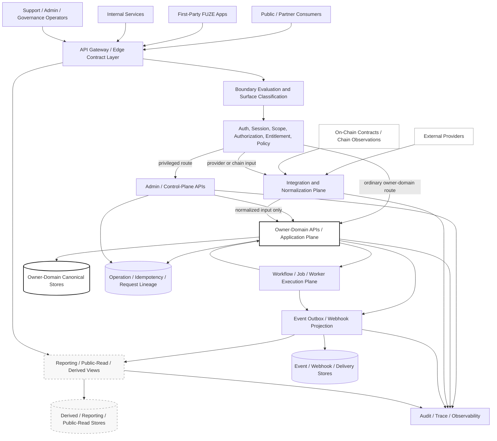
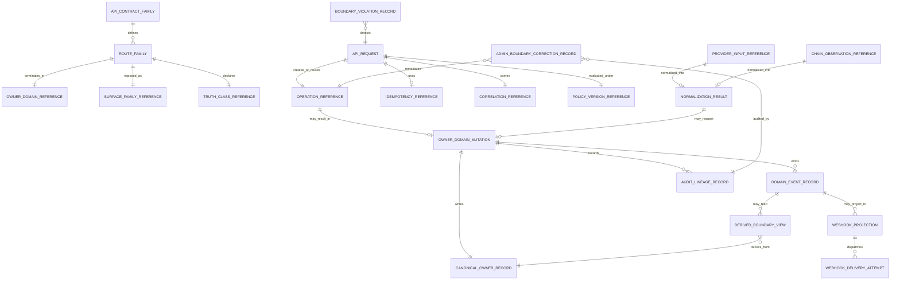
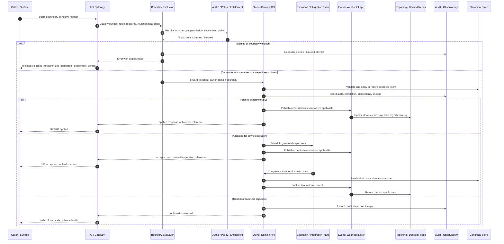

## Document Metadata

- **Document Name:** `SYSTEM_BOUNDARY_AND_OWNERSHIP_API_SPEC.md`
- **Document Type:** FUZE API SPEC v2 / production-grade interface-contract specification
- **Status:** Draft production-grade API specification for review
- **Version:** 2.0.0
- **Effective Date:** 2026-04-24
- **Last Updated:** 2026-04-24
- **Reviewed On:** 2026-04-24
- **Document Owner:** FUZE Platform API Architecture / Interface Governance Domain, in coordination with FUZE Platform Architecture as semantic owner of system boundary and ownership interpretation
- **Approval Authority:** Not explicitly specified in the retrieved governing materials; approval authority remains governed by the active FUZE approval workflow and higher-order constitutional specification process
- **Review Cadence:** MUST be reviewed whenever system boundary, ownership, platform-plane, API surface-family, admin/control-plane, public-read, event/webhook, idempotency, migration, or on-chain/off-chain posture materially changes; SHOULD be reviewed quarterly
- **Governing Layer:** API contract layer derived from platform constitution / system boundary / ownership semantics
- **Parent Registry:** `API_SPEC_INDEX.md` for API v1/historical registry posture; API SPEC v2 canonical registry supplied by the API SPEC v2 production prompt
- **Upstream Semantic Registry:** `REFINED_SYSTEM_SPEC_INDEX.md`
- **Upstream API Registry:** `API_SPEC_INDEX.md`
- **Primary Audience:** Platform architecture, backend engineering, API authors, implementation-contract authors, frontend and first-party app teams, internal service owners, event/webhook authors, admin/control-plane authors, security, audit, operations, data engineering, reporting/public-read authors, governance and product leadership
- **Primary Purpose:** Define the API contract rules by which FUZE exposes, enforces, observes, validates, audits, migrates, and derives interface surfaces from the canonical system boundary and ownership model without allowing API convenience, public exposure, internal service shortcuts, admin paths, events, workers, reports, projections, or chain-adjacent adapters to redefine semantic truth
- **Primary Upstream References:** `REFINED_SYSTEM_SPEC_INDEX.md`; `SYSTEM_BOUNDARY_AND_OWNERSHIP_SPEC.md`; `SYSTEM_OVERVIEW_AND_BOUNDARIES_SPEC.md`; `PLATFORM_ARCHITECTURE_SPEC.md`; `DOMAIN_OWNERSHIP_MATRIX_SPEC.md`; `DATA_MODEL_AND_ENTITY_OWNERSHIP_SPEC.md`; `ONCHAIN_OFFCHAIN_RESPONSIBILITY_SPEC.md`; `API_SPEC_INDEX.md`; `API_ARCHITECTURE_SPEC.md`; `PUBLIC_API_SPEC.md`; `INTERNAL_SERVICE_API_SPEC.md`; `EVENT_MODEL_AND_WEBHOOK_SPEC.md`; `IDEMPOTENCY_AND_VERSIONING_SPEC.md`; `MIGRATION_AND_BACKWARD_COMPATIBILITY_SPEC.md`; `FUZE_ACCOUNT_ACCESS_AND_SESSION_THESIS_FINAL_SPEC.md`; `FUZE_ACCOUNT_ACCESS_AND_SESSION_CANONICAL_FINAL_SPEC.md`; `FUZE_WORKSPACE_ACCESS_CONTROL_BASICS_THESIS_FINAL_SPEC.md`
- **Primary Downstream Dependents:** `SYSTEM_OVERVIEW_AND_BOUNDARIES_API_SPEC.md`; `PLATFORM_ARCHITECTURE_API_SPEC.md`; `DOMAIN_OWNERSHIP_MATRIX_API_SPEC.md`; `DATA_MODEL_AND_ENTITY_OWNERSHIP_API_SPEC.md`; `ONCHAIN_OFFCHAIN_RESPONSIBILITY_API_SPEC.md`; all domain API specs; OpenAPI / AsyncAPI / SDK derivation layers; implementation-contract specs; admin/control-plane contracts; event catalogs; migration plans; observability and audit contracts
- **API Surface Families Covered:** first-party application APIs; internal service APIs; admin/control-plane APIs; event and webhook API implications; reporting/derived-read APIs; public-read/public-trust API constraints; chain-adjacent interface constraints; implementation-facing contract guardrails
- **API Surface Families Excluded:** raw smart-contract ABI specifications; database schema internals; exact queue/broker implementation contracts; exact frontend component contracts; exact product-local endpoint listings; exact provider API contracts except normalization-boundary rules; legal/accounting documents; human org charts
- **Canonical System Owner(s):** FUZE Platform Architecture owns boundary and ownership semantics; individual domain owners own domain-specific business truth; contract domains own explicitly committed chain truth; provider systems own raw external input; reporting/publication domains own bounded derived/publication artifacts where explicitly specified
- **Canonical API Owner:** FUZE Platform API Architecture / Interface Governance Domain
- **Supersedes:** No same-name API SPEC v2 document. It supersedes any weaker API interpretation that treats system-boundary APIs as transport-only, permits hidden broad-write shortcuts, collapses public/internal/admin/event/reporting surfaces, or allows API routes to redefine canonical ownership semantics.
- **Superseded By:** None
- **Related Decision Records:** Not explicitly specified in the retrieved governing materials
- **Canonical Status Note:** This API spec is subordinate to refined system semantics. It expresses the canonical system boundary and ownership model as interface-contract rules. It MUST NOT redefine the upstream refined semantic truth.
- **Implementation Status:** Ready for downstream implementation-contract derivation after approval
- **Approval Status:** Pending formal FUZE approval workflow
- **Change Summary:** Created API SPEC v2 production-grade interface-contract specification for system boundary and ownership. Derived from active refined system boundary semantics and shared API architecture/event governance. Added API surface families, request/response/error/idempotency/audit/migration rules, diagrams, flow views, acceptance criteria, test cases, and forbidden API patterns.

---

## Purpose

This document defines how FUZE API surfaces MUST preserve the platform's canonical system boundary and ownership model.

The upstream refined system specification defines what the FUZE ecosystem means by platform, product, on-chain, reporting/publication, control plane, and external dependency ownership. This API specification defines how those semantics are exposed and protected at the interface layer.

The API layer is not allowed to become a semantic owner. Its job is to enforce domain ownership through explicit surface families, route-family discipline, request validation, response semantics, error classes, idempotency, event correlation, audit lineage, compatibility discipline, and implementation-contract guardrails.

This API spec exists because system boundary and ownership are not merely architecture language. They must become enforceable in public APIs, first-party application APIs, internal service APIs, admin/control-plane APIs, reporting APIs, event/webhook contracts, SDKs, OpenAPI/AsyncAPI artifacts, and runtime instrumentation.

---

## Scope

This specification governs:

1. API contract expression of FUZE's top-level boundary and ownership model.
2. Surface-family separation for boundary-sensitive API operations.
3. Route-family rules for owner-domain reads, owner-domain writes, boundary-evaluation, boundary-metadata, derived reads, admin/control-plane actions, and boundary-violation detection.
4. Request, response, error, status, idempotency, replay, audit, correlation, and migration requirements for boundary-sensitive operations.
5. Rules for internal service calls, public exposure, first-party application use, admin/control-plane remediation, events/webhooks, reporting/projection, and chain-adjacent interactions.
6. Contract requirements for downstream OpenAPI, AsyncAPI, SDK, implementation-contract, observability, and migration artifacts.

This specification is intentionally architecture-level. It does not list every endpoint in the FUZE platform. Instead, it defines the governing API contract posture that downstream domain API specs and machine-readable contracts MUST preserve.

---

## Out of Scope

This API spec does not govern:

- the detailed semantic truth of platform domains, product domains, economic rails, governance domains, or chain contracts;
- the exact database schema for owner-domain entities, idempotency records, audit logs, operation records, or projection stores;
- raw contract ABI design, contract storage layout, or chain-native execution details;
- the full content of `DOMAIN_OWNERSHIP_MATRIX_API_SPEC.md`, `DATA_MODEL_AND_ENTITY_OWNERSHIP_API_SPEC.md`, or `ONCHAIN_OFFCHAIN_RESPONSIBILITY_API_SPEC.md`;
- exact role/permission matrices, entitlement plan definitions, or final access evaluation algorithms;
- exact provider-specific callback schemas, except where provider input must remain normalized-input truth before owner-domain acceptance;
- exact runbook steps for operator remediation.

Those details belong in adjacent refined system specs, adjacent API specs, and implementation-contract layers, provided they preserve this document's boundary rules.

---

## Design Goals

1. Make the API layer enforce FUZE's system boundary model rather than weaken it.
2. Ensure every boundary-sensitive mutation identifies and terminates in the rightful owner domain.
3. Prevent public, first-party, internal, admin/control, event, webhook, reporting, or SDK convenience from becoming shadow semantic ownership.
4. Preserve clear distinctions among semantic truth, API contract truth, policy truth, runtime truth, storage/ledger truth, provider-input truth, event truth, projection/reporting truth, public-read truth, and presentation truth.
5. Support implementation teams with deterministic request, response, error, status, idempotency, audit, and migration rules.
6. Make boundary violations observable, testable, auditable, and rejectable.
7. Support future FUZE products and future chain-adjacent capabilities without fragmenting platform ownership.
8. Provide a strong foundation for OpenAPI / AsyncAPI / SDK derivation without overfitting to current implementation details.

---

## Non-Goals

This specification does not aim to:

- create a generic boundary-inspection API that grants broad visibility into all FUZE internals;
- expose owner-domain mutation power through a single central boundary service;
- replace domain API specs, database schema specs, event catalogs, or runbooks;
- allow admin routes to function as unaudited backdoors;
- collapse public, first-party, internal, admin/control, reporting, event, and chain-adjacent interfaces into one surface;
- let derived reporting, public trust, analytics, search, or dashboard APIs become hidden write authorities;
- create exact endpoint paths that downstream teams must copy without domain-specific refinement.

---

## Core Principles

### 1. Refined-Semantics-First Principle

Refined system specs own semantic truth. This API spec owns interface-contract expression. Where API convenience conflicts with refined semantics, refined semantics win.

### 2. API-as-Boundary-Enforcement Principle

APIs in this domain MUST enforce owner-domain boundaries, plane separation, truth-class separation, and surface-family separation.

### 3. Owner-Domain Mutation Principle

Canonical mutations MUST terminate in the owner domain's explicit mutation boundary. A gateway, aggregator, internal service, workflow, worker, dashboard, or public route MUST NOT become the mutation owner merely because it initiated or routed a request.

### 4. Surface-Family Separation Principle

Public, first-party application, internal service, admin/control-plane, event/webhook, reporting, and chain-adjacent interfaces have different trust, exposure, compatibility, and audit postures. They MUST remain distinguishable in route family, contract metadata, authorization, error semantics, observability, and migration handling.

### 5. Derived-Read Discipline Principle

Derived reads MAY compose or summarize canonical truth. They MUST identify lineage and freshness posture where material and MUST NOT become upstream write paths.

### 6. Accepted-State Honesty Principle

Accepted async intent, queued execution, provider normalization, chain observation, projection refresh, and final business outcome MUST remain distinct in API responses and events.

### 7. Normalization-Before-Influence Principle

Provider callbacks, chain observations, external inputs, and partner signals MUST remain provider-input truth until verified, normalized, authorized, and accepted by the rightful owner domain.

### 8. Administrative Restraint Principle

Operator/admin correction APIs MUST be explicit, bounded, reason-coded, policy-constrained, attributed, auditable, and separated from ordinary application APIs.

### 9. Replay-Safe Contract Principle

Boundary-sensitive writes, callbacks, worker submissions, webhooks, and admin remediations MUST be safe under retry, duplicate submission, replay, and partial failure.

### 10. Conservative Ambiguity Principle

If an API contract cannot name its owner domain, surface family, truth class, mutation boundary, read boundary, authorization model, idempotency posture, audit lineage, and compatibility posture, it is incomplete and MUST NOT ship as production-grade.

---

## Canonical Definitions

### System Boundary API Contract

An API contract that exposes, evaluates, routes, protects, or audits FUZE system-boundary and owner-domain interaction rules.

### Boundary-Sensitive Operation

Any API operation that may affect or reveal cross-domain ownership, canonical mutation authority, provider normalization, chain-adjacent interpretation, reporting/publication posture, control-plane restriction, or derived/public-read truth.

### Owner-Domain API

The API contract owned by the domain that owns the semantic meaning and mutation rules for the underlying truth.

### Boundary Evaluation

A deterministic interface-layer evaluation that determines which owner domain, surface family, trust class, read model, mutation path, or control-plane path is appropriate for a request.

### Boundary Violation

An attempted API pattern that would allow a non-owner to mutate canonical truth, present derived truth as canonical, bypass owner-domain validation, promote provider input to FUZE truth without normalization, expose internal truth publicly without approval, or hide privileged control actions inside ordinary routes.

### Boundary Metadata

Contract metadata that identifies owner domain, surface family, resource family, mutation class, read class, truth class, policy version, compatibility posture, idempotency requirement, and audit/correlation requirements.

### Operation Reference

A stable identifier returned for accepted or applied boundary-sensitive operations, allowing callers and downstream systems to query status, correlate events, preserve idempotency, and support audit lineage.

### Derived Boundary View

A read model that describes or summarizes owner-domain boundaries, source lineage, projection freshness, public-safe publication posture, or route-family posture without becoming canonical owner-domain truth.

---

## Truth Class Taxonomy

This API specification MUST preserve the following truth classes:

1. **Semantic truth** — owned by refined system specs and owner domains; defines what a concept means.
2. **API contract truth** — owned by API specs and machine-readable contracts; defines allowed surface, request, response, error, version, idempotency, and compatibility posture.
3. **Policy truth** — owned by access, security, risk, entitlement, governance, control-plane, and domain policy specs; defines what is allowed.
4. **Runtime truth** — request handling, dependency state, accepted async intent, queue state, provider availability, or execution progress.
5. **Ledger / storage truth** — durable owner-domain records, idempotency records, operation records, audit records, event records, or chain-native records as applicable.
6. **Provider-input truth** — raw external/provider/chain-adjacent input before FUZE owner-domain validation.
7. **Event / async execution truth** — domain events, operational events, webhook projections, workflow/job state, replay/redelivery lineage.
8. **Projection / reporting truth** — derived dashboards, status summaries, public trust views, analytics, exports, search indexes, or reporting surfaces.
9. **Public read-model truth** — intentionally exposed stable public or partner-safe bounded views derived from canonical owners.
10. **Presentation truth** — user-visible labels, route wording, UI composition, SDK helper names, and documentation examples.

These truth classes MUST NOT be collapsed. API contracts MAY expose multiple truth classes in one response only if the response explicitly identifies canonical versus derived versus runtime versus provider-input fields.

---

## Architectural Position in the Spec Hierarchy

This API spec sits below:

- `REFINED_SYSTEM_SPEC_INDEX.md`
- `SYSTEM_BOUNDARY_AND_OWNERSHIP_SPEC.md`
- `SYSTEM_OVERVIEW_AND_BOUNDARIES_SPEC.md`
- `PLATFORM_ARCHITECTURE_SPEC.md`
- `DOMAIN_OWNERSHIP_MATRIX_SPEC.md`
- `DATA_MODEL_AND_ENTITY_OWNERSHIP_SPEC.md`
- `ONCHAIN_OFFCHAIN_RESPONSIBILITY_SPEC.md`
- `API_ARCHITECTURE_SPEC.md`
- `PUBLIC_API_SPEC.md`
- `INTERNAL_SERVICE_API_SPEC.md`
- `EVENT_MODEL_AND_WEBHOOK_SPEC.md`
- `IDEMPOTENCY_AND_VERSIONING_SPEC.md`
- `MIGRATION_AND_BACKWARD_COMPATIBILITY_SPEC.md`

and above or alongside:

- `SYSTEM_OVERVIEW_AND_BOUNDARIES_API_SPEC.md`
- `PLATFORM_ARCHITECTURE_API_SPEC.md`
- `DOMAIN_OWNERSHIP_MATRIX_API_SPEC.md`
- `DATA_MODEL_AND_ENTITY_OWNERSHIP_API_SPEC.md`
- `ONCHAIN_OFFCHAIN_RESPONSIBILITY_API_SPEC.md`
- domain API specifications
- OpenAPI / AsyncAPI / SDK derivation artifacts
- implementation-contract specifications
- gateway, policy-engine, audit, observability, and boundary-violation detection implementations

This document governs interface-contract expression of boundary and ownership semantics. It does not replace the refined semantic source documents.

---

## Upstream Semantic Owners

The primary upstream semantic owner is `SYSTEM_BOUNDARY_AND_OWNERSHIP_SPEC.md`.

Adjacent upstream semantic owners include:

- `SYSTEM_OVERVIEW_AND_BOUNDARIES_SPEC.md` for ecosystem-level orientation and top-level separations.
- `PLATFORM_ARCHITECTURE_SPEC.md` for off-chain plane model, runtime structure, control plane, integration plane, reporting plane, and chain-adjacent coordination.
- `DOMAIN_OWNERSHIP_MATRIX_SPEC.md` for domain-by-domain owner and mutation-boundary mapping.
- `DATA_MODEL_AND_ENTITY_OWNERSHIP_SPEC.md` for entity-level ownership and persistence discipline.
- `ONCHAIN_OFFCHAIN_RESPONSIBILITY_SPEC.md` for chain-native versus off-chain responsibility boundaries.
- Account/session and workspace access-control thesis/canonical documents for identity, session, workspace, and access interpretation.

The API layer MUST consume these semantics. It MUST NOT reassign owner domains, create new truth classes, or change conflict-resolution posture.

---

## API Surface Families

### 1. First-Party Application APIs

Used by FUZE-owned product and platform surfaces. They MAY initiate boundary-sensitive actions, but canonical mutations MUST still terminate in owner-domain APIs. First-party status views MAY include derived and runtime status if they label it correctly.

### 2. Internal Service APIs

Used for service-to-service coordination. They MUST preserve owner-domain collaboration boundaries. Internal service APIs MUST NOT become hidden broad-write shortcuts.

### 3. Admin / Control-Plane APIs

Used for support, restrictions, overrides, remediation, governance-sensitive actions, emergency controls, and boundary correction. They MUST be separated from ordinary application APIs, reason-coded, policy-constrained, auditable, and idempotent where duplicate impact is unsafe.

### 4. Reporting / Derived-Read APIs

Used for dashboards, activity, analytics, status summaries, reporting, public trust views, and read-model projections. They MUST be read-only unless a narrower spec explicitly elevates a reporting-owned canonical dataset. They MUST preserve source lineage and freshness posture where material.

### 5. Public APIs

Curated external APIs. They MUST default to narrow exposure and stable compatibility. Public APIs MUST NOT expose internal boundary evaluation, privileged mutation paths, broad owner maps, or sensitive control metadata unless explicitly approved and public-safe.

### 6. Event / Webhook APIs

Events and webhooks complement APIs. Canonical domain events MUST originate from owner domains. Public webhook projections are derived external contracts and MUST NOT be treated as canonical owner-domain records.

### 7. Chain-Adjacent APIs

APIs that observe, prepare, reconcile, or coordinate chain-related actions. They MUST distinguish chain-native truth, off-chain policy interpretation, provider/indexer input, and owner-domain mutation acceptance.

### 8. Implementation-Facing Contract APIs

Contracts used by gateways, policy engines, SDK generation, schema validation, audit correlation, and compatibility tooling. They MAY expose metadata to internal implementation layers but MUST NOT become business-domain owners.

---

## System / API Boundaries

### API Layer Does Own

- interface surface-family taxonomy;
- boundary metadata requirements;
- request/response/error/status envelope rules at the interface layer;
- idempotency and correlation requirements for boundary-sensitive operations;
- public/internal/admin/event/reporting/chain-adjacent exposure posture;
- compatibility and migration discipline for boundary-sensitive contracts;
- interface-level guardrails that prevent boundary drift.

### API Layer Does Not Own

- system semantic truth;
- domain business meaning;
- entity existence and lifecycle semantics;
- final authorization, entitlement, billing, credits, payout, governance, or chain-native meaning;
- provider raw-state interpretation beyond requiring normalization boundaries;
- reporting/publication truth except for API exposure contracts;
- operational runbooks.

---

## Adjacent API Boundaries

- `SYSTEM_OVERVIEW_AND_BOUNDARIES_API_SPEC.md` should expose ecosystem-level orientation and top-level separations, not the normative owner-domain mutation rules contained here.
- `PLATFORM_ARCHITECTURE_API_SPEC.md` should define plane-facing interface posture, service-plane exposure, runtime/edge/control/integration/reporting plane API behavior, and platform architecture API boundaries.
- `DOMAIN_OWNERSHIP_MATRIX_API_SPEC.md` should define richer owner-domain lookup, matrix query, and owner-domain routing contracts. This document defines the rules those contracts must preserve.
- `DATA_MODEL_AND_ENTITY_OWNERSHIP_API_SPEC.md` should define entity-level contract ownership and persistence implications. This document defines the top-level interface discipline.
- `ONCHAIN_OFFCHAIN_RESPONSIBILITY_API_SPEC.md` should define chain-adjacent API posture in greater depth. This document establishes that chain state and off-chain interpretation must remain distinct.
- `PUBLIC_API_SPEC.md`, `INTERNAL_SERVICE_API_SPEC.md`, and `EVENT_MODEL_AND_WEBHOOK_SPEC.md` govern their own surface-family details but must preserve this document's owner-domain boundary rules.
- `IDEMPOTENCY_AND_VERSIONING_SPEC.md` and `MIGRATION_AND_BACKWARD_COMPATIBILITY_SPEC.md` own cross-cutting replay, version, compatibility, coexistence, and deprecation mechanics.

---

## Conflict Resolution Rules

When API materials, implementation designs, route proposals, generated schemas, SDKs, events, dashboards, or runbooks conflict, FUZE MUST resolve the conflict in this order:

1. `REFINED_SYSTEM_SPEC_INDEX.md` wins on active refined-system source-of-truth routing and refined-over-legacy precedence.
2. `SYSTEM_BOUNDARY_AND_OWNERSHIP_SPEC.md` wins on top-level ownership, truth classes, mutation authority, control-plane separation, and boundary interpretation.
3. Adjacent refined semantic specs win within their narrower domains.
4. `API_ARCHITECTURE_SPEC.md` wins on shared API surface-family and interface-governance rules.
5. This API spec wins on API contract expression of system boundary and ownership semantics.
6. Public, internal, event/webhook, idempotency, migration, and domain API specs win within their narrower API-family scope if they do not contradict upstream ownership semantics.
7. OpenAPI, AsyncAPI, SDKs, code-generation layers, gateways, dashboards, and implementation shortcuts never win over canonical owner-domain API contract rules.
8. Where ambiguity remains, FUZE MUST choose the most conservative architecture-consistent interpretation, reject unsafe mutation or exposure, and escalate into explicit refinement or recorded decision work.

---

## Default Decision Rules

When no narrower approved exception exists:

1. Cross-product, identity-defining, economically shared, transparency-relevant, governance-sensitive, or expansion-foundational API concerns default to platform ownership.
2. Product-local API concerns default to product ownership only where they do not redefine shared platform primitives.
3. Canonical writes default to owner-domain application-plane APIs.
4. Derived/reporting/public-read APIs default to read-only posture.
5. Public exposure defaults to denied or minimal stable derived exposure unless explicitly approved.
6. Admin/control actions default to privileged control-plane APIs, not ordinary app routes.
7. Provider callbacks and chain observations default to normalized-input posture until owner validation succeeds.
8. Async/worker/job state defaults to execution truth, not business truth.
9. Surface state, SDK helper state, frontend route availability, deep links, bot callbacks, and launch context default to presentation or transport truth, not authorization or business truth.
10. If an API cannot name owner domain, surface family, truth class, mutation boundary, read boundary, policy checks, idempotency posture, and audit lineage, it MUST NOT ship as production-grade.

---

## Roles / Actors / API Consumers

### Human Actors

- end users
- workspace members
- workspace owners/admins
- partner or external consumers
- support operators
- product operators
- security operators
- governance/approval actors
- finance/control-plane operators
- auditors and compliance reviewers

### System Actors

- first-party web and product surfaces
- platform gateway and edge services
- platform owner-domain services
- product owner-domain services
- policy and access-evaluation services
- entitlement and capability-gating services
- admin/control-plane services
- workflow engines
- queues, workers, and schedulers
- provider adapters and normalization services
- chain-adjacent coordination services
- event outbox and webhook dispatchers
- audit and observability services
- reporting/publication services
- SDKs and generated clients

---

## Resource / Entity Families

This API spec governs contract posture for the following API-facing resource families:

- `boundary_contract_family`
- `owner_domain_reference`
- `surface_family_reference`
- `resource_family_reference`
- `mutation_boundary_reference`
- `read_boundary_reference`
- `truth_class_reference`
- `boundary_evaluation_result`
- `operation_reference`
- `idempotency_reference`
- `request_lineage_reference`
- `correlation_reference`
- `audit_lineage_reference`
- `policy_version_reference`
- `compatibility_version_reference`
- `boundary_violation_record`
- `admin_boundary_correction_record`
- `derived_boundary_view`
- `public_safe_boundary_projection`
- `provider_input_reference`
- `chain_observation_reference`

These resources are API contract and support resources. They are not substitutes for owner-domain business entities.

---

## Ownership Model

### Canonical Ownership

The canonical owner of business truth remains the owner domain defined by refined system specs and domain-specific refined specs.

### API Ownership

The API architecture domain owns shared surface-family posture and interface rules. This API spec owns boundary-specific contract posture.

### Mutation Ownership

Mutation ownership belongs to the owner domain that owns the truth being changed. Boundary APIs may route, validate, reject, or record accepted intent, but they MUST NOT become universal mutation owners.

### Execution Ownership

Execution systems own job/worker/progression truth. They do not own the business meaning of the entities they process unless a narrower spec explicitly designates that truth class.

### Presentation Ownership

Surfaces and SDKs own presentation, helper naming, display ordering, and client ergonomics. They do not own semantic truth.

### Governance / Control Ownership

Control-plane systems own approval, restriction, override, remediation, rollout, and emergency posture for sensitive actions. They do not automatically own the resulting business-domain state.

---

## Authority / Decision Model

### Ordinary API Authority

Ordinary APIs MAY accept requests only when authentication, scope, authorization, entitlement/capability checks where relevant, schema validation, boundary classification, and policy checks pass.

### Owner-Domain Authority

Owner domains have final authority over validation, acceptance, rejection, application, conflict interpretation, lifecycle meaning, and canonical event publication for their truth.

### Boundary Evaluation Authority

Boundary evaluation MAY classify a request, resource, or route family. It MAY NOT override the owner domain's semantic meaning.

### Control-Plane Authority

Control-plane APIs MAY restrict, pause, approve, override, quarantine, remediate, or route sensitive operations where policy permits. Such actions MUST be explicitly reason-coded and audited and MUST write resulting business state through the rightful owner boundary.

### Public Exposure Authority

Public API exposure is intentionally narrower than first-party/internal capability. Public exposure requires approved contract posture and public-safe projection rules.

---

## Authentication Model

Boundary-sensitive APIs MUST authenticate the caller before performing privileged boundary evaluation, mutation routing, admin/control operations, or sensitive read exposure.

Authentication alone is never sufficient for action authority. The request MUST also evaluate scope, authorization, permission, entitlement/capability where relevant, policy restrictions, surface family, environment, and owner-domain mutation rules.

Internal service callers MUST authenticate as service principals with bounded grants. Admin/control-plane callers MUST authenticate with privileged identity and, where policy requires, step-up or stronger session posture.

---

## Authorization / Scope / Permission Model

Boundary-sensitive API authorization MUST distinguish:

- actor identity;
- session posture;
- workspace or organization scope;
- target resource scope;
- owner-domain mutation authority;
- read visibility authority;
- internal service grant;
- admin/control-plane authority;
- public exposure eligibility;
- governance-sensitive approval authority;
- policy version and environment restrictions.

The API MUST NOT treat UI route access, deep-link possession, bot callback payloads, SDK local state, or provider callback origin as permission truth.

---

## Entitlement / Capability-Gating Model

Entitlement and capability gating MAY influence whether a caller may invoke a capability, register a webhook, access a derived read, or perform a product-local operation. Entitlement does not redefine ownership or permission.

Boundary-sensitive APIs MUST distinguish:

- authorization denial;
- entitlement/capability denial;
- rollout/feature flag denial;
- policy/security denial;
- owner-domain business validation rejection;
- account/session posture failure.

The response model MUST not collapse all of these into generic failure where downstream behavior depends on the distinction.

---

## API State Model

Boundary-sensitive API operations MUST use explicit state classes:

- `requested` — request received but not yet validated.
- `validated` — schema and basic contract validation passed.
- `authorized` — caller and scope passed required access checks.
- `accepted` — owner domain or approved control path accepted intent for later processing.
- `applied` — owner-domain canonical mutation completed.
- `previously_applied` — duplicate/retry resolved to an already completed effect.
- `rejected` — request failed validation, policy, access, entitlement, or business rule.
- `conflicted` — request conflicts with existing owner-domain state or concurrent operation.
- `blocked` — request denied due to boundary violation, control-plane restriction, safety posture, or governance requirement.
- `failed_retryable` — dependency/runtime failure where retry may be safe.
- `failed_terminal` — terminal failure where retry would not alter outcome without changed input or policy.
- `pending_reconciliation` — external/chain/provider state requires reconciliation before final meaning.
- `compensated` — prior applied or accepted action has a later compensating record.
- `superseded` — contract, record, or projection replaced by explicit lineage.
- `deprecated` — still interpretable but not valid for new use.

`accepted` MUST NOT be returned as if it were `applied`. `pending_reconciliation` MUST NOT be treated as canonical final business success.

---

## Lifecycle / Workflow Model

1. **Ingress:** Request enters through public, first-party, internal, admin/control, reporting, event, or chain-adjacent surface.
2. **Surface classification:** Gateway or service identifies surface family, contract version, caller type, environment, route family, and requested operation class.
3. **Authentication and scope resolution:** Actor or service principal, session posture, workspace/org scope, target resource scope, and environment are resolved.
4. **Authorization and entitlement evaluation:** Access, permission, entitlement/capability, policy, rollout, and risk checks are evaluated in the correct domain.
5. **Boundary evaluation:** The API identifies owner domain, truth class, mutation boundary, read boundary, and forbidden shortcut risks.
6. **Owner-domain handoff:** Canonical mutation is applied or accepted by the owner domain, or rejected before side effects occur.
7. **Operation/reference persistence:** Idempotency, operation, correlation, trace, and audit lineage records are persisted as required.
8. **Async execution:** If deferred, workflow/job/provider/chain steps proceed under accepted-state and idempotency rules.
9. **Event and audit emission:** Owner-domain outcomes and boundary-significant operations emit audit lineage and, where appropriate, owner-domain events or webhook projections.
10. **Derived/public projection:** Read models, reports, public trust views, dashboards, and SDK-visible status update downstream without becoming owners.
11. **Reconciliation/correction:** External contradictions, chain lag, projection lag, failed async work, or admin remediation use explicit lineage and do not rewrite prior truth silently.

---

## Architecture Diagram — Mermaid Flowchart

---

## Data Design — Mermaid Diagram

Data design rules:

- `CANONICAL_OWNER_RECORD` is owned by the rightful owner domain, not by boundary support infrastructure.
- `DERIVED_BOUNDARY_VIEW`, `WEBHOOK_PROJECTION`, and reporting records are derived and MUST NOT become canonical mutation owners.
- `PROVIDER_INPUT_REFERENCE` and `CHAIN_OBSERVATION_REFERENCE` remain input truth until `NORMALIZATION_RESULT` is accepted by the owner domain.
- `OPERATION_REFERENCE`, `IDEMPOTENCY_REFERENCE`, `CORRELATION_REFERENCE`, and `AUDIT_LINEAGE_RECORD` support interface safety and evidence; they do not own business meaning.

---

## Flow View

### Main Synchronous Owner-Domain Mutation Flow

1. Caller submits a mutation request through an approved surface family.
2. Gateway classifies surface family, route family, contract version, and requested mutation class.
3. Authentication, scope, authorization, entitlement, and policy checks run before side effects.
4. Boundary evaluation identifies the rightful owner domain and rejects non-owner direct-write patterns.
5. Owner-domain API validates business rules and either applies, rejects, conflicts, or accepts for async work.
6. API persists idempotency, operation, correlation, trace, and audit references where required.
7. Response returns `applied`, `accepted`, `rejected`, `conflicted`, `blocked`, or failure class explicitly.
8. Owner-domain events, audit records, and downstream projections update through their own governed paths.

### Accepted Async Flow

1. Request passes boundary and policy checks.
2. Owner domain records accepted async intent and returns an `operation_reference`.
3. Execution plane performs deferred work using owner-domain contracts and idempotent retry rules.
4. Owner domain records final outcome when business meaning is known.
5. Events, audit, status APIs, and derived views reflect accepted versus final outcome distinctly.

### Provider / Chain Input Flow

1. Provider callback or chain observation enters integration plane.
2. Raw input is recorded as provider-input truth with correlation, source, and receipt metadata.
3. Normalization validates source, schema, replay posture, and policy.
4. Owner domain decides whether normalized input changes FUZE canonical truth.
5. Ambiguous or contradictory inputs remain pending reconciliation and MUST NOT become final truth automatically.

### Admin / Control-Plane Flow

1. Operator invokes privileged admin/control route.
2. API enforces stronger authentication, authorization, policy, reason-code, and scope requirements.
3. Control plane may restrict, approve, override, quarantine, or initiate remediation.
4. Any business-state mutation still writes through the owner-domain boundary.
5. Audit, trace, policy version, actor attribution, and remediation lineage are durably recorded.

### Failure and Degraded Mode Flow

1. Dependency, provider, chain, projection, event, or execution failure is classified.
2. API returns a distinct retryable, terminal, blocked, pending reconciliation, or degraded response.
3. The system avoids local non-owner mutation to “patch” state.
4. Audit/observability records preserve failure reason and correlation.
5. Recovery or replay uses idempotent owner-domain-safe paths.

---

## Data Flows — Mermaid Sequence Diagram

---

## Request Model

Boundary-sensitive API requests MUST include or derive:

- contract family and version;
- surface family;
- operation intent;
- actor or service principal;
- account/session reference where relevant;
- workspace/organization/scope reference where relevant;
- target resource family and resource reference;
- owner-domain reference where known or derivable;
- mutation/read class;
- idempotency key for unsafe/retryable mutation requests;
- correlation ID and trace context;
- policy version or policy-evaluation context where material;
- reason code for admin/control-plane actions;
- source references for provider or chain input;
- client-request timestamp and environment where material.

Requests MUST NOT require clients to self-certify semantic ownership as the source of truth. Client-provided owner hints MAY assist routing but MUST be validated server-side.

### Request Field Classes

- **Canonical identity fields:** stable IDs, scopes, owner-domain references.
- **Intent fields:** action, requested transition, desired capability.
- **Safety fields:** idempotency key, reason code, policy context, correlation ID.
- **Input fields:** provider payload reference, chain observation reference, user-entered payload, or product-local payload.
- **Presentation fields:** locale, display preferences, optional include flags. Presentation fields MUST NOT affect semantic truth.

---

## Response Model

Boundary-sensitive API responses MUST distinguish:

- canonical owner-domain outcome;
- accepted async intent;
- runtime/execution status;
- provider-input or pending-normalization status;
- derived/read-model status;
- public-safe projection status;
- idempotency replay result;
- control-plane restriction or remediation result;
- audit/correlation references where allowed.

### Required Response Classes

- `applied`
- `accepted`
- `previously_applied`
- `rejected`
- `conflicted`
- `blocked`
- `pending_reconciliation`
- `failed_retryable`
- `failed_terminal`
- `degraded`
- `superseded`
- `deprecated`

Responses MUST NOT present derived read values as canonical unless the source owner and freshness posture make that safe and explicit.

---

## Error / Result / Status Model

API errors MUST be structured enough for clients and operators to distinguish:

- `authentication_required`
- `session_invalid`
- `scope_missing`
- `permission_denied`
- `entitlement_denied`
- `capability_disabled`
- `policy_denied`
- `boundary_violation`
- `owner_domain_mismatch`
- `unsupported_surface_family`
- `public_exposure_denied`
- `admin_reason_required`
- `idempotency_conflict`
- `duplicate_previously_applied`
- `state_conflict`
- `validation_failed`
- `provider_input_unverified`
- `normalization_failed`
- `chain_observation_unconfirmed`
- `pending_reconciliation`
- `dependency_retryable_failure`
- `dependency_terminal_failure`
- `projection_lagging`
- `contract_version_deprecated`
- `contract_version_unsupported`

Public errors MUST be information-minimized. Internal/admin errors MAY contain richer diagnostics if the caller is authorized and logs redact sensitive material.

---

## Idempotency / Retry / Replay Model

Idempotency is mandatory for:

- unsafe boundary-sensitive mutations;
- provider callbacks that may retry;
- chain observations that may replay or reorg-reconcile;
- accepted async intent creation;
- admin/control-plane remediation where duplicate effects are unsafe;
- webhook endpoint mutations and redelivery requests;
- worker submissions that may trigger owner-domain writes.

### Idempotency Rules

1. Idempotency keys MUST be scoped to caller, owner domain, operation family, target resource where applicable, and compatibility version.
2. Replayed identical requests MUST return the same `operation_reference`, `previously_applied`, or current terminal result.
3. Replayed requests with conflicting payloads MUST return `idempotency_conflict` and MUST NOT apply a second mutation.
4. Accepted async intent retries MUST return the existing accepted operation reference, not create duplicate work.
5. Provider and chain input dedupe MUST use source event identity, normalized business key, and owner-domain policy where applicable.
6. Replay and redelivery MUST preserve historical lineage rather than rewriting original records.

---

## Rate Limit / Abuse-Control Model

Boundary-sensitive APIs MUST apply rate limits and abuse controls appropriate to their surface family and risk level.

- Public APIs require stricter abuse resistance, narrow error disclosure, and defensive pagination/filtering.
- First-party APIs require user/workspace-aware throttles and protection against repeated boundary-violation attempts.
- Internal APIs require service-principal quotas and anomaly detection for broad write attempts.
- Admin/control APIs require tighter quotas, reason-code enforcement, and higher audit sensitivity.
- Provider callbacks and chain observation inputs require replay protection, source verification, and quarantine thresholds.
- Webhook management and redelivery APIs require endpoint-scoped limits and abuse-resistant redelivery windows.

Repeated boundary violations SHOULD produce security/risk signals and MAY trigger control-plane restrictions.

---

## Endpoint / Route Family Model

This specification defines route families, not exact routes. Downstream API specs MAY assign exact paths while preserving these families.

### Allowed Route Families

1. **Boundary metadata reads** — expose public-safe or internal-safe contract metadata about surface families, owner-domain references, or route classification.
2. **Owner-domain action routes** — route canonical writes to the rightful owner domain.
3. **Owner-domain read routes** — expose canonical owner-domain reads where allowed.
4. **Derived boundary-view routes** — expose read-only projections with lineage and freshness posture.
5. **Operation status routes** — expose accepted/applied/failed/conflicted/degraded operation status.
6. **Boundary violation reporting routes** — internal/admin-only visibility into detected violations.
7. **Admin correction/remediation routes** — privileged, reason-coded, policy-constrained, audited interventions.
8. **Provider normalization ingress routes** — integration-plane ingress that records raw input and routes normalized consequences to owner domains.
9. **Chain-adjacent reconciliation routes** — observe or reconcile chain-related state without collapsing chain truth and off-chain policy.
10. **Event/webhook management routes** — manage supported webhook endpoints and redelivery under event/webhook rules.

### Forbidden Route Families

- generic broad-write endpoints that obscure owner-domain meaning;
- public routes exposing internal mutation primitives;
- dashboard/report patch endpoints that mutate canonical owner-domain truth;
- admin backdoor routes without policy, reason code, idempotency, and audit lineage;
- provider callbacks that directly mutate canonical entities without normalization;
- chain-observation routes that claim off-chain policy truth before owner-domain interpretation;
- SDK helper routes that bypass owner-domain contracts for convenience.

---

## Public API Considerations

Public APIs MUST be narrower than first-party and internal APIs.

Public exposure MAY include:

- stable public-safe derived boundary metadata;
- public trust/public-read projections explicitly approved by public API and transparency/public-read specs;
- operation status only where the caller is authorized and the status is safe to disclose;
- webhook management only for authorized external integrators and only within approved scope.

Public exposure MUST NOT include:

- broad owner-domain matrices if they reveal sensitive internal structure;
- admin/control-plane mutation routes;
- internal service mutation shortcuts;
- sensitive policy/risk/control rules;
- raw provider inputs;
- privileged chain-adjacent operational details;
- internal event streams not explicitly projected as public webhook contracts.

---

## First-Party Application API Considerations

First-party application APIs MAY provide richer interaction flows than public APIs, but they remain subordinate to owner-domain boundaries.

First-party APIs MUST:

- avoid frontend-owned business truth;
- treat local state, route state, launch context, and AI outputs as non-canonical;
- send canonical mutations through owner-domain routes;
- label accepted async states distinctly from final outcomes;
- distinguish authorization, entitlement, policy, conflict, and validation errors;
- preserve correlation and audit references for meaningful mutations;
- represent projection lag and degraded modes explicitly.

---

## Internal Service API Considerations

Internal service APIs MUST preserve service-to-service ownership boundaries.

Internal callers MAY request owner-domain actions or read allowed owner-domain data, but they MUST NOT:

- write directly to another domain's canonical storage;
- use private shortcuts to bypass owner-domain validation;
- infer mutation authority from network location;
- convert internal convenience into public contract behavior;
- hide broad writes inside orchestration or worker APIs.

Service identities MUST be authenticated and authorized for specific operation families and scopes.

---

## Admin / Control-Plane API Considerations

Admin and control-plane APIs are required for support, remediation, governance-sensitive control, security restriction, recovery, and emergency handling. They MUST be explicit and bounded.

Every mutation-capable admin/control operation MUST include:

- actor or service-principal attribution;
- target scope and target resource;
- operation family;
- reason code;
- policy version or control rule reference where material;
- idempotency key where duplicate impact is unsafe;
- correlation and trace references;
- audit record emission;
- owner-domain write path where business truth changes.

Admin APIs MUST NOT silently edit canonical records through database shortcuts or generic patch endpoints.

---

## Event / Webhook / Async API Considerations

Events and webhooks MUST reflect owner-domain outcomes, accepted intents, or operational states with clear timing meaning.

- Canonical domain events MUST be emitted by owner domains or delegated owner-controlled components.
- Accepted-state events MUST NOT masquerade as final completion events.
- Public webhooks MUST be curated projections, not mirrors of all internal events.
- Delivery attempts are operational records, not proof of business success.
- Consumer retries and webhook redelivery MUST be idempotent and lineage-preserving.
- Events MUST correlate to causing API operation where meaningful.

---

## Chain-Adjacent API Considerations

Chain-adjacent APIs MUST distinguish:

- chain-native committed truth;
- off-chain policy interpretation;
- raw RPC/indexer/provider observation;
- owner-domain accepted orchestration;
- pending reconciliation;
- derived/public reporting.

A chain observation API MUST NOT claim final off-chain business meaning until the rightful owner domain validates and accepts that interpretation. Chain-write preparation MUST remain separate from governance approval and business-policy decisions unless a narrower spec explicitly binds them.

---

## Data Model / Storage Support Implications

Implementation layers SHOULD support durable records for:

- request lineage;
- operation references;
- idempotency references;
- boundary evaluation results;
- owner-domain handoff references;
- violation records;
- admin correction/remediation records;
- provider input references;
- chain observation references;
- normalized input references;
- event and webhook projection references;
- audit and observability references;
- contract version and deprecation metadata.

Storage location MUST NOT define semantic ownership. Co-location, denormalization, caching, gateway logs, or analytics pipelines do not make support records canonical business truth.

---

## Read Model / Projection / Reporting Rules

Derived boundary views MAY help humans and systems understand current boundary posture, route ownership, operation status, and public-safe metadata.

They MUST:

- declare their source domains;
- preserve source references and freshness/lag posture where material;
- remain read-only unless a narrower spec explicitly elevates a dataset;
- avoid replacing canonical owner-domain reads;
- represent reconciliation, supersession, and correction lineage explicitly;
- disclose derived/public-safe status where exposed externally.

Projection disagreement with source truth MUST be represented as lag, stale projection, pending correction, or reconciliation required. Projection layers MUST NOT patch source truth.

---

## Security / Risk / Privacy Controls

Boundary-sensitive APIs are security-critical. They MUST preserve:

- least privilege by surface family;
- strict public/internal/admin separation;
- sensitive data minimization;
- reason-coded admin/control actions;
- provider input quarantine and normalization;
- replay/deduplication protections;
- audit and traceability for meaningful mutations;
- privileged read minimization;
- defensive handling of boundary-violation probes;
- non-disclosure of sensitive owner maps or policy internals to unauthorized callers.

Security/risk controls MAY block or restrict API access, but they MUST NOT rewrite domain truth. Resulting business effects still require owner-domain mutation paths.

---

## Audit / Traceability / Observability Requirements

Boundary-significant API behavior MUST be reconstructible.

At minimum, durable lineage SHOULD include:

- actor or service principal;
- human-on-behalf-of attribution where applicable;
- surface family;
- route family;
- contract version;
- source IP/device/session risk context where policy allows;
- target scope;
- target resource;
- owner domain;
- mutation/read class;
- idempotency key reference;
- operation reference;
- correlation ID;
- trace ID;
- policy version;
- entitlement/capability decision where material;
- outcome class;
- event/job/webhook references where material;
- reason code for admin/control actions;
- boundary violation classification where applicable.

Observability MUST allow operators to distinguish owner-domain rejection, authorization denial, entitlement denial, policy restriction, provider normalization failure, chain lag, projection lag, async backlog, and contract-version failure.

---

## Failure Handling / Edge Cases

### Product Attempts to Redefine Platform Primitive

Reject or route to platform owner domain. Return `owner_domain_mismatch` or `boundary_violation` with safe diagnostics.

### First-Party Surface Has Cached State

Treat cache as presentation/derived truth. If cache conflicts with owner-domain read, owner-domain read wins and the response SHOULD mark cache stale or refreshed.

### Provider Callback Contradicts Existing State

Record as provider-input truth. Normalize and submit to owner domain. Return or emit `pending_reconciliation`, `normalization_failed`, or owner-domain result as appropriate.

### Admin Operator Needs Emergency Correction

Use explicit admin/control route. Require reason code, policy authorization, idempotency where needed, audit lineage, and owner-domain write path for business state changes.

### Chain Observation Lags or Reorgs

Expose delayed visibility, unconfirmed observation, or pending reconciliation. Do not rewrite off-chain policy meaning until owner-domain reconciliation completes.

### Worker Completes But Owner Domain Rejects

Worker completion remains execution truth. API MUST expose final business state as rejected/conflicted/failed if owner-domain acceptance did not occur.

### Public Caller Requests Internal Boundary Metadata

Deny or return public-safe minimal metadata only. Public exposure MUST be intentional and supportable.

### Idempotency Replay With Changed Payload

Return `idempotency_conflict`; do not apply a second mutation.

### Derived Reporting Disagrees With Source

Return source truth if querying canonical owner. Derived route MUST disclose lag or pending correction and MUST NOT mutate source.

---

## Migration / Versioning / Compatibility / Deprecation Rules

1. Boundary-sensitive contracts MUST have explicit version posture.
2. Public API versions require stronger compatibility and deprecation discipline than internal APIs.
3. Breaking changes require explicit migration path, coexistence window, or supersession lineage.
4. Contract aliases and renamed owner domains MUST preserve historical interpretability.
5. Deprecation MUST NOT leave downstream systems dependent on shadow truth or hidden broad-write routes.
6. Migration MUST NOT transfer ownership from one domain to another without explicit refined-system specification change.
7. OpenAPI/AsyncAPI/SDK artifacts MUST preserve owner-domain, surface-family, idempotency, accepted-state, and error-class semantics across versions.
8. Compatibility layers MAY proxy old behavior temporarily but MUST preserve canonical ownership semantics.

---

## OpenAPI / AsyncAPI / SDK Derivation Rules

OpenAPI, AsyncAPI, and SDK derivations MUST preserve:

- surface family and exposure class;
- owner-domain reference;
- truth class of resources and fields;
- canonical versus derived read distinction;
- accepted versus applied result distinction;
- structured error classes;
- idempotency requirements;
- correlation and operation references;
- public/internal/admin route separation;
- admin reason-code requirements;
- provider/chain normalization posture;
- version and deprecation metadata;
- audit and event correlation references.

SDK helpers MAY improve ergonomics but MUST NOT hide boundary semantics. An SDK method that performs a mutation MUST expose enough result status to distinguish accepted, applied, previously applied, conflicted, blocked, and failed outcomes.

---

## Implementation-Contract Guardrails

Downstream implementations MUST NOT optimize away:

- owner-domain identity;
- surface-family separation;
- owner-domain mutation termination;
- accepted versus applied semantics;
- idempotency keys and replay lineage;
- structured error/result classes;
- provider-input normalization boundaries;
- chain-native versus off-chain interpretation boundaries;
- admin/control-plane reason codes;
- audit and correlation references;
- derived/public-read labeling;
- migration and deprecation lineage.

Implementation contracts MUST make boundary violations observable and rejectable rather than relying on engineering convention alone.

---

## Downstream Execution Staging

1. Approve this API SPEC v2 document as governing boundary API posture.
2. Derive `SYSTEM_OVERVIEW_AND_BOUNDARIES_API_SPEC.md` and `PLATFORM_ARCHITECTURE_API_SPEC.md` with consistent surface-family posture.
3. Derive owner-domain lookup and matrix behavior in `DOMAIN_OWNERSHIP_MATRIX_API_SPEC.md`.
4. Derive entity-level route ownership in `DATA_MODEL_AND_ENTITY_OWNERSHIP_API_SPEC.md`.
5. Derive chain/off-chain route posture in `ONCHAIN_OFFCHAIN_RESPONSIBILITY_API_SPEC.md`.
6. Apply these guardrails to all domain API specs and machine-readable OpenAPI/AsyncAPI/SDK artifacts.
7. Implement gateway, policy, audit, idempotency, observability, and boundary-violation detection support.

---

## Required Downstream Specs / Contract Layers

- `SYSTEM_OVERVIEW_AND_BOUNDARIES_API_SPEC.md`
- `PLATFORM_ARCHITECTURE_API_SPEC.md`
- `DOMAIN_OWNERSHIP_MATRIX_API_SPEC.md`
- `DATA_MODEL_AND_ENTITY_OWNERSHIP_API_SPEC.md`
- `ONCHAIN_OFFCHAIN_RESPONSIBILITY_API_SPEC.md`
- `PRODUCT_BOUNDARY_AND_DOMAIN_OWNERSHIP_API_SPEC.md`
- identity/account/session API specs
- workspace/authorization/access API specs
- entitlement/capability API specs
- commercial, credits, billing, payment, ledger, payout, treasury, and governance API specs
- public-read/public-trust API specs
- OpenAPI / AsyncAPI / SDK artifacts
- implementation-contract specs for gateway, policy, audit, idempotency, observability, eventing, and runtime

---

## Boundary Violation Detection / Non-Canonical API Patterns

The following patterns are forbidden unless a narrower approved specification creates an explicit constitutional exception:

1. Generic patch APIs that can mutate multiple owner domains without owner-domain validation.
2. Public APIs exposing internal mutation primitives.
3. First-party frontend routes treated as authorization or business truth.
4. Dashboard/reporting APIs that patch transactional owner-domain truth.
5. Admin backdoor APIs without reason codes, policy gates, idempotency, and audit lineage.
6. Internal service broad-write shortcuts across owner domains.
7. Worker/job APIs that mark business success without owner-domain acceptance.
8. Provider callbacks directly mutating canonical entities before normalization.
9. Chain-observation APIs claiming off-chain business meaning before owner-domain reconciliation.
10. SDK methods hiding accepted versus applied outcomes.
11. Derived/public-read APIs that omit lineage and freshness for material values.
12. Events or webhooks used as permission to mutate foreign owner-domain truth.
13. Contract migration that changes owner semantics without explicit refined-system update.

Implementations SHOULD detect these patterns through gateway validation, schema linting, policy checks, contract review, runtime alerts, audit analytics, and regression tests.

---

## Canonical Examples / Anti-Examples

### Canonical Examples

- A product UI initiates a workspace-level action; the first-party API routes through boundary evaluation, access checks, and the owning workspace or product domain before mutation.
- A provider callback is stored as raw input, normalized, deduplicated, and submitted to the payment/billing owner domain before changing entitlements or credits.
- A chain observation route reports `pending_reconciliation` until the relevant off-chain owner domain validates its business meaning.
- A derived dashboard API returns source references and `projection_freshness` rather than allowing operators to edit source records directly.
- An admin remediation route requires a reason code, policy gate, idempotency key, and audit record, then delegates any canonical mutation to the owner domain.

### Anti-Examples

- A generic `/admin/update-anything` route directly mutates records across domains.
- A public API exposes internal service mutation endpoints because frontend already uses them.
- A worker completion table is used as final business status even though owner-domain validation failed.
- A public webhook payload exposes raw internal event payloads without public-safe projection.
- A provider callback marks a payment, credit issuance, or entitlement final without normalization and owner-domain acceptance.
- An SDK helper returns only `success: true` for an accepted async operation that has not completed.

---

## Acceptance Criteria

1. Every boundary-sensitive route family identifies an owner domain, surface family, truth class, mutation/read class, and compatibility posture.
2. Canonical mutation routes terminate in the owner domain and cannot be completed solely by gateways, dashboards, workers, reports, SDKs, or provider callbacks.
3. Public, first-party, internal, admin/control, reporting, event/webhook, and chain-adjacent surfaces are distinguishable in contract metadata and authorization posture.
4. Derived/reporting/public-read routes are read-only unless a narrower governing spec explicitly elevates a bounded dataset.
5. Provider callbacks and chain observations remain normalized-input truth until owner-domain validation succeeds.
6. Accepted async operations return explicit operation references and do not claim final success.
7. Idempotency behavior prevents duplicate owner-domain mutation under retry, replay, callback duplication, and worker resubmission.
8. Error/result classes distinguish authorization, entitlement, policy, boundary violation, owner-domain mismatch, conflict, idempotency replay, provider normalization failure, chain ambiguity, projection lag, retryable failure, and terminal failure.
9. Admin/control-plane mutation routes require stronger authorization, reason codes, policy checks, idempotency where applicable, and audit lineage.
10. Boundary violation attempts are rejected or blocked and produce observable audit/security signals where material.
11. Audit lineage is sufficient to reconstruct actor, surface family, owner domain, operation reference, correlation ID, policy version, outcome, and downstream event/job/webhook references.
12. OpenAPI/AsyncAPI/SDK derivations preserve owner-domain, surface-family, accepted-state, idempotency, error-class, and audit/correlation semantics.
13. Contract migration and deprecation preserve historical interpretability and do not transfer semantic ownership silently.
14. Public APIs expose only intentionally approved, stable, public-safe boundary views.
15. Internal service APIs cannot be used as broad hidden write shortcuts.
16. Test suites include positive, negative, authorization, entitlement, idempotency, retry, conflict, boundary-violation, degraded-mode, audit, migration, and public-exposure cases.

---

## Test Cases

### Positive Path Tests

1. **Owner-domain mutation succeeds**
   - Given an authenticated, authorized caller invokes a first-party route that targets a platform-owned resource
   - When boundary evaluation identifies the platform owner domain and the owner domain applies the mutation
   - Then the response returns `applied`, an owner-domain reference, operation reference, and correlation ID.

2. **Accepted async intent is distinct from final success**
   - Given a long-running boundary-sensitive request
   - When the owner domain accepts work for deferred execution
   - Then the API returns `202 accepted` with an operation reference and MUST NOT return final success until the owner domain records final outcome.

3. **Derived read includes lineage**
   - Given a dashboard requests a derived boundary view
   - When the API returns projection data
   - Then the response includes source owner-domain references and freshness/lag posture where material.

4. **Provider input normalized before mutation**
   - Given a payment or provider callback arrives
   - When the integration plane records and normalizes the input
   - Then no canonical owner-domain mutation occurs until the rightful owner validates and accepts the normalized result.

### Negative / Boundary Violation Tests

5. **Non-owner write is rejected**
   - Given a product service attempts to mutate platform-owned entitlement truth through an internal shortcut
   - Then the API returns `owner_domain_mismatch` or `boundary_violation` and records the blocked attempt.

6. **Dashboard patch attempt fails**
   - Given an admin dashboard attempts to patch source transactional truth through a reporting API
   - Then the API rejects the request because reporting APIs are not owner-domain mutation paths.

7. **Public exposure denied**
   - Given an external consumer requests internal boundary metadata
   - Then the public API returns information-minimized denial or public-safe subset only.

8. **Provider callback duplicate does not duplicate mutation**
   - Given the same provider callback is delivered twice
   - Then idempotency/dedupe returns the same normalized result or previous owner-domain outcome without duplicate mutation.

### Authorization / Entitlement / Scope Tests

9. **Authentication is insufficient**
   - Given an authenticated caller lacks workspace permission for the target resource
   - Then the API returns `permission_denied`, not a business validation error.

10. **Entitlement denial remains distinct**
   - Given a caller is authorized but lacks product capability entitlement
   - Then the API returns `entitlement_denied` or `capability_disabled`, not `permission_denied`.

11. **Admin reason code required**
   - Given an operator invokes a correction route without a reason code
   - Then the API returns `admin_reason_required` and applies no mutation.

### Idempotency / Retry / Replay Tests

12. **Idempotent retry returns same operation**
   - Given an accepted async request is retried with the same idempotency key and same payload
   - Then the API returns the same operation reference.

13. **Idempotency conflict blocks payload drift**
   - Given a retry uses the same idempotency key but a different material payload
   - Then the API returns `idempotency_conflict` and applies no second mutation.

14. **Worker resubmission is safe**
   - Given a worker retries a completion callback
   - When owner-domain finalization already occurred
   - Then the API returns `previously_applied` or existing terminal status without duplicate business effect.

### Conflict / Concurrency Tests

15. **Concurrent owner-domain mutation conflict**
   - Given two requests attempt incompatible transitions on the same owner-domain resource
   - Then one may apply and the other MUST return `conflicted` or owner-domain-specific conflict status.

16. **Control-plane restriction blocks ordinary route**
   - Given a feature or sensitive pathway is restricted by approved control posture
   - When an ordinary application route attempts the action
   - Then the API returns `blocked` or `policy_denied`, not silent success.

### Chain / Provider / Projection Tests

17. **Chain observation remains pending**
   - Given an unconfirmed chain observation is received
   - Then the API returns `chain_observation_unconfirmed` or `pending_reconciliation` and does not claim final off-chain meaning.

18. **Projection lag disclosed**
   - Given a derived/public-read API lags behind source truth
   - Then it returns lag metadata and does not overwrite canonical source truth.

### Audit / Observability Tests

19. **Boundary violation is auditable**
   - Given a non-owner mutation attempt is rejected
   - Then audit/observability records include actor/service, surface family, route family, owner-domain mismatch, correlation ID, and outcome class.

20. **Admin remediation lineage complete**
   - Given an admin correction succeeds
   - Then audit records include actor, reason code, policy version, operation reference, owner-domain mutation reference, and final outcome.

### Migration / Compatibility Tests

21. **Deprecated route preserves interpretability**
   - Given a deprecated boundary route is called during compatibility window
   - Then the API returns deprecation metadata and maps to the current owner-domain path without changing semantics.

22. **Breaking change blocked without migration posture**
   - Given a generated OpenAPI change removes accepted-state semantics from an async route
   - Then contract validation fails because downstream clients would misinterpret final success.

### Public / Webhook Tests

23. **Webhook projection is derived**
   - Given a public webhook is delivered
   - Then payload contains stable public projection fields and lineage references, not raw internal event internals.

24. **Webhook delivery failure does not roll back business truth**
   - Given webhook delivery fails after owner-domain mutation succeeds
   - Then delivery status changes but owner-domain canonical state remains unchanged.

---

## Dependencies / Cross-Spec Links

### Upstream Dependencies

- `REFINED_SYSTEM_SPEC_INDEX.md`
- `SYSTEM_BOUNDARY_AND_OWNERSHIP_SPEC.md`
- `SYSTEM_OVERVIEW_AND_BOUNDARIES_SPEC.md`
- `PLATFORM_ARCHITECTURE_SPEC.md`
- `DOMAIN_OWNERSHIP_MATRIX_SPEC.md`
- `DATA_MODEL_AND_ENTITY_OWNERSHIP_SPEC.md`
- `ONCHAIN_OFFCHAIN_RESPONSIBILITY_SPEC.md`
- `API_SPEC_INDEX.md`
- `API_ARCHITECTURE_SPEC.md`
- `PUBLIC_API_SPEC.md`
- `INTERNAL_SERVICE_API_SPEC.md`
- `EVENT_MODEL_AND_WEBHOOK_SPEC.md`
- `IDEMPOTENCY_AND_VERSIONING_SPEC.md`
- `MIGRATION_AND_BACKWARD_COMPATIBILITY_SPEC.md`
- `FUZE_ACCOUNT_ACCESS_AND_SESSION_THESIS_FINAL_SPEC.md`
- `FUZE_ACCOUNT_ACCESS_AND_SESSION_CANONICAL_FINAL_SPEC.md`
- `FUZE_WORKSPACE_ACCESS_CONTROL_BASICS_THESIS_FINAL_SPEC.md`

### Downstream Dependents

- all API SPEC v2 documents in the canonical registry;
- domain implementation contracts;
- OpenAPI / AsyncAPI / SDK derivation;
- gateway and policy-engine implementation;
- audit and observability implementation;
- event and webhook catalogs;
- admin/control-plane implementations;
- public-read and reporting APIs.

---

## Explicitly Deferred Items

The following are deferred to narrower specs:

- exact endpoint paths and payload schemas;
- full owner-domain lookup matrix;
- full entity-by-entity ownership mapping;
- exact admin/control-plane workflow screens;
- exact provider-specific callback schema handling;
- exact chain-reconciliation and chain-event confirmation policy;
- exact OpenAPI / AsyncAPI machine-readable artifacts;
- exact observability dashboard layout and alert thresholds;
- exact CI/lint implementation for boundary contract validation.

These deferred items MUST preserve this document's normative boundary rules.

---

## Final Normative Summary

FUZE API surfaces MUST enforce the platform's system boundary and ownership model. Refined system specs own semantic truth; API specs own interface-contract expression. Canonical writes MUST terminate in owner domains. Public, first-party, internal, admin/control, event/webhook, reporting, and chain-adjacent surfaces MUST remain distinct. Derived reads, projections, reports, caches, SDK helpers, events, webhooks, provider callbacks, workers, and chain observations MUST NOT become shadow semantic owners.

Boundary-sensitive APIs MUST preserve explicit owner-domain references, surface-family posture, truth-class distinctions, accepted-versus-applied semantics, idempotency, replay safety, authorization and entitlement separation, provider normalization, chain/off-chain separation, audit lineage, observability, migration safety, and conservative conflict resolution.

If any API contract, generated schema, implementation shortcut, dashboard behavior, worker flow, SDK helper, public route, admin tool, or event/webhook pattern conflicts with these rules, this API specification and its upstream refined semantic owners govern unless an explicitly higher FUZE constitutional source overrides them.

---

## Quality Gate Checklist

- [x] Upstream refined semantic owners are explicit.
- [x] Canonical API owner is explicit.
- [x] API surface families are explicit.
- [x] Mutation boundaries are explicit.
- [x] Read boundaries are explicit.
- [x] Adjacent API boundaries are explicit.
- [x] Truth classes are explicit.
- [x] Conflict-resolution rules are explicit.
- [x] Default decision rules are explicit.
- [x] Public, first-party, internal, admin/control, event/webhook, reporting, and chain-adjacent distinctions are explicit.
- [x] Non-canonical API patterns are called out clearly.
- [x] Operator/admin override paths are bounded, reason-coded, and audited.
- [x] Read-model, cache, reporting, and projection rules are explicit.
- [x] On-chain vs off-chain responsibilities are explicit where relevant.
- [x] Accepted-state vs final success semantics are explicit.
- [x] Idempotency and replay requirements are explicit.
- [x] Request, response, error, result, and status classes are explicit enough for implementation.
- [x] Failure and degraded-mode behaviors are explicit.
- [x] Audit, traceability, and observability requirements are explicit.
- [x] Versioning, migration, compatibility, and deprecation rules are explicit.
- [x] Downstream OpenAPI / AsyncAPI / SDK guardrails are explicit.
- [x] Dependencies and downstream impacts are explicit.
- [x] Non-goals and deferred items are explicit.
- [x] Architecture Diagram uses Mermaid `flowchart` syntax.
- [x] Architecture Diagram clarifies consumers, surface families, owner domains, services, data stores, events, async workers, external providers, chain-adjacent systems, and downstream consumers.
- [x] Data Design diagram uses Mermaid syntax.
- [x] Data Design diagram distinguishes canonical data from derived, projected, provider-input, event, operation, and audit data.
- [x] Flow View includes synchronous, asynchronous, failure, retry, audit, admin/operator, and finalization paths where relevant.
- [x] Data Flows use Mermaid `sequenceDiagram` syntax.
- [x] Data Flows distinguish accepted-state responses from final outcomes.
- [x] Acceptance Criteria are concrete and testable.
- [x] Acceptance Criteria include observable pass/fail conditions.
- [x] Test Cases include positive, negative, authorization, entitlement, idempotency, retry, conflict, rate-limit/abuse-control where applicable, degraded-mode, audit, migration, and boundary-violation coverage.
