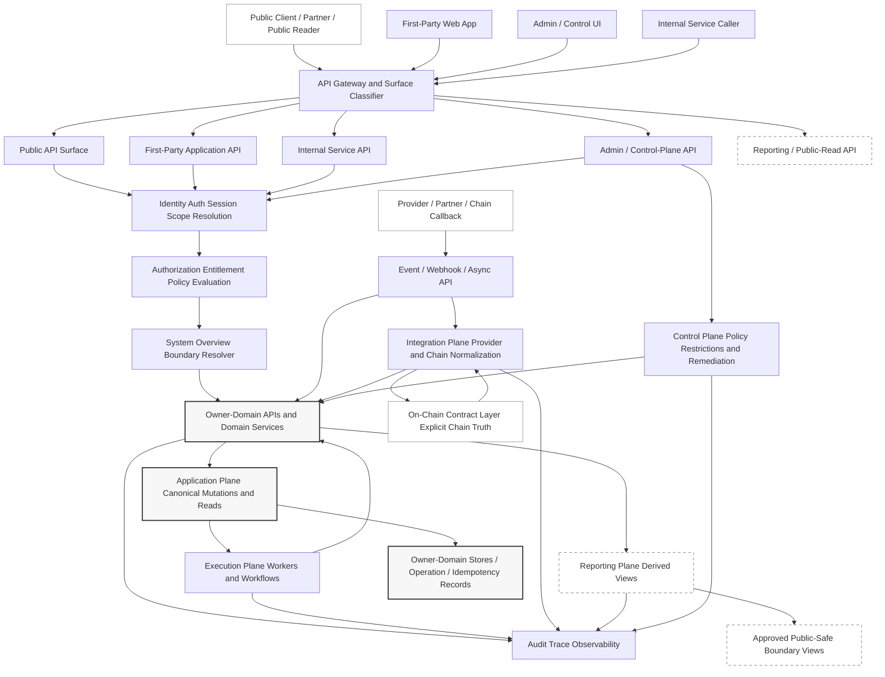
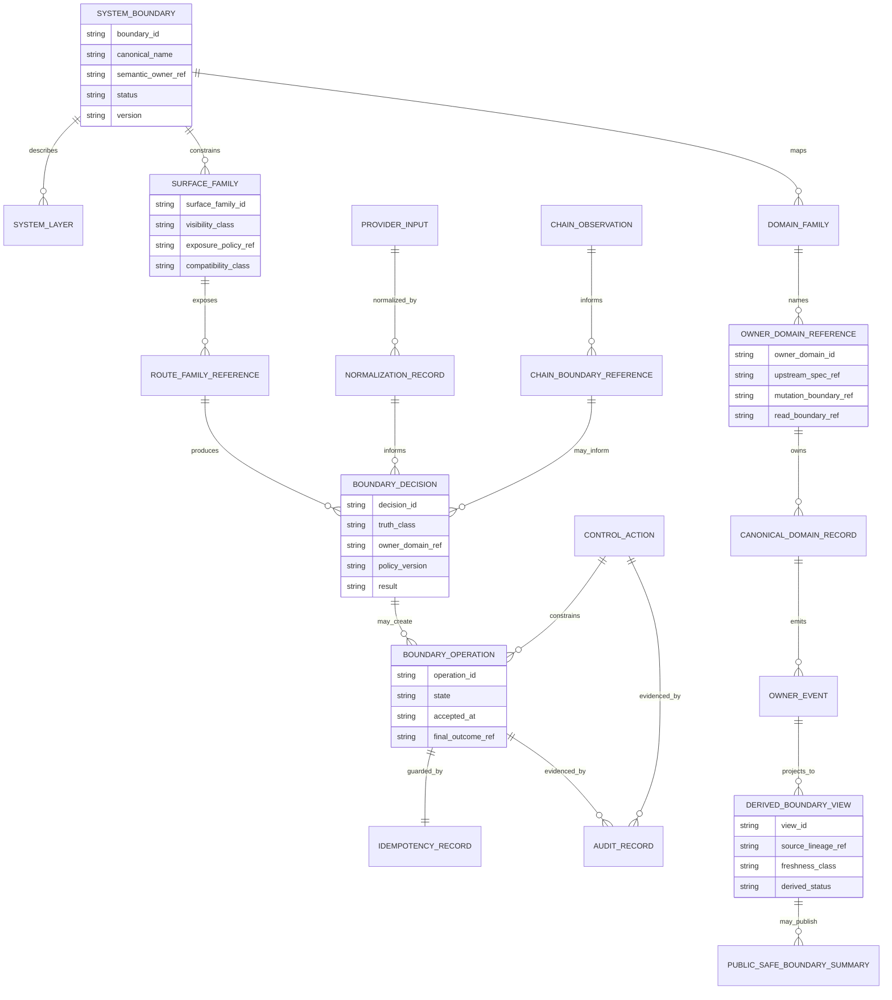
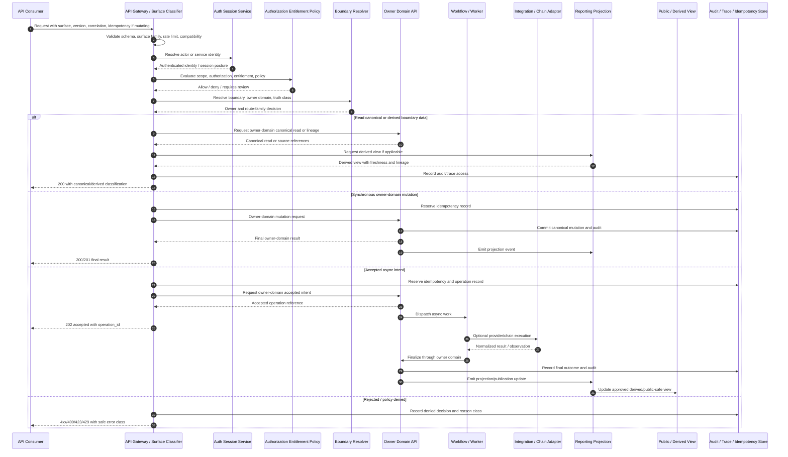

# FUZE System Overview and Boundaries API Specification

## Document Metadata

- **Document Name:** `SYSTEM_OVERVIEW_AND_BOUNDARIES_API_SPEC.md`
- **Document Type:** Production-grade FUZE API SPEC v2
- **Status:** Draft canonical API specification
- **Version:** 2.0.0
- **Effective Date:** 2026-04-24
- **Last Updated:** 2026-04-24
- **Reviewed On:** 2026-04-24
- **Document Owner:** FUZE Platform API Architecture and Platform Architecture Governance
- **Approval Authority:** FUZE Platform Architecture and Specification Governance Authority; named approver not explicitly specified in retrieved governing materials
- **Review Cadence:** Quarterly and whenever top-level platform layer, product boundary, chain boundary, public trust surface, control-plane, API surface family, or ownership rule materially changes
- **Governing Layer:** API SPEC v2 / platform constitution API contract layer / system overview and ecosystem boundary expression
- **Parent Registry:** `API_SPEC_INDEX.md` as historical API registry and the FUZE API SPEC v2 Canonical File Registry
- **Upstream Semantic Registry:** `REFINED_SYSTEM_SPEC_INDEX.md`
- **Upstream API Registry:** `API_SPEC_INDEX.md`
- **Primary Audience:** Platform architecture, backend engineering, frontend engineering, API design, internal service authors, public API authors, event contract authors, implementation-contract authors, data engineering, security, audit, operations, governance, finance, transparency/reporting authors, SDK/OpenAPI/AsyncAPI derivation authors
- **Primary Purpose:** Define how FUZE APIs must expose, enforce, and preserve the canonical system overview and ecosystem boundary model without redefining the refined system semantics that own FUZE's architectural truth
- **Primary Upstream References:**
  - `REFINED_SYSTEM_SPEC_INDEX.md`
  - `API_SPEC_INDEX.md`
  - `DOCS_SPEC_INDEX.md`
  - `SYSTEM_SPEC_INDEX.md`
  - `SYSTEM_OVERVIEW_AND_BOUNDARIES_SPEC.md`
  - `SYSTEM_BOUNDARY_AND_OWNERSHIP_SPEC.md`
  - `PLATFORM_ARCHITECTURE_SPEC.md`
  - `DOMAIN_OWNERSHIP_MATRIX_SPEC.md`
  - `DATA_MODEL_AND_ENTITY_OWNERSHIP_SPEC.md`
  - `ONCHAIN_OFFCHAIN_RESPONSIBILITY_SPEC.md`
  - `PRODUCT_BOUNDARY_AND_DOMAIN_OWNERSHIP_SPEC.md`
  - `PRODUCT_ADMISSION_AND_EXPANSION_GATE_SPEC.md`
  - `API_ARCHITECTURE_SPEC.md`
  - `PUBLIC_API_SPEC.md`
  - `INTERNAL_SERVICE_API_SPEC.md`
  - `EVENT_MODEL_AND_WEBHOOK_SPEC.md`
  - `IDEMPOTENCY_AND_VERSIONING_SPEC.md`
  - `MIGRATION_AND_BACKWARD_COMPATIBILITY_SPEC.md`
  - `FUZE_ACCOUNT_ACCESS_AND_SESSION_THESIS_FINAL_SPEC.md`
  - `FUZE_ACCOUNT_ACCESS_AND_SESSION_CANONICAL_FINAL_SPEC.md`
  - `FUZE_WORKSPACE_ACCESS_CONTROL_BASICS_THESIS_FINAL_SPEC.md`
- **Primary Downstream Dependents:**
  - `PLATFORM_ARCHITECTURE_API_SPEC.md`
  - `DOMAIN_OWNERSHIP_MATRIX_API_SPEC.md`
  - `DATA_MODEL_AND_ENTITY_OWNERSHIP_API_SPEC.md`
  - `ONCHAIN_OFFCHAIN_RESPONSIBILITY_API_SPEC.md`
  - `PRODUCT_BOUNDARY_AND_DOMAIN_OWNERSHIP_API_SPEC.md`
  - `PRODUCT_ADMISSION_AND_EXPANSION_GATE_API_SPEC.md`
  - identity/account/auth/session API specifications
  - workspace/access-control/entitlement API specifications
  - commercial/credits/billing/payout API specifications
  - AI/workflow/async execution API specifications
  - public trust, registry, transparency, governance, treasury, and chain-adjacent API specifications
  - OpenAPI, AsyncAPI, SDK, implementation-contract, gateway, audit, observability, and migration artifacts
- **API Surface Families Covered:** Public metadata/read surfaces where approved; first-party application APIs; internal service APIs; admin/control-plane APIs; event/async APIs; reporting/read-model APIs; chain-adjacent observation and coordination APIs; implementation-facing API contracts
- **API Surface Families Excluded:** Raw database schemas, raw smart-contract ABI definitions, private infrastructure runbooks, product-local endpoint catalogs, exact queue/broker implementation, exact UI component contracts, raw provider APIs, and unapproved public disclosure surfaces
- **Canonical System Owner(s):** FUZE Platform Architecture for top-level system overview and ecosystem boundary interpretation; canonical narrower domain owners retain ownership of their own semantics
- **Canonical API Owner:** FUZE Platform API Architecture and API Governance
- **Supersedes:** Earlier weak or implicit API interpretations that allowed endpoint convenience, frontend convenience, internal service convenience, provider callbacks, reporting views, or admin tooling to redefine the FUZE system overview or top-level ecosystem boundaries
- **Superseded By:** None
- **Related Decision Records:** Not explicitly specified in retrieved governing materials
- **Canonical Status Note:** This API specification expresses the refined system overview and boundaries at the API-contract layer. It does not own FUZE's semantic system overview; that ownership remains with `SYSTEM_OVERVIEW_AND_BOUNDARIES_SPEC.md` and adjacent refined system specifications.
- **Implementation Status:** Ready for downstream implementation-contract derivation; individual route catalogs, schemas, gateway policies, OpenAPI/AsyncAPI definitions, and SDK surfaces remain downstream
- **Approval Status:** Draft pending FUZE architecture approval workflow
- **Change Summary:** Created API SPEC v2 document for the FUZE system overview and boundaries domain. Formalized API surface families, top-level route family posture, truth classes, boundary rules, request/response/error/status expectations, idempotency and replay requirements, public/internal/admin/event separation, diagrams, flow views, acceptance criteria, test cases, and implementation-contract guardrails.

## Purpose

This document defines the FUZE API contract posture for the system overview and top-level boundary model.

It governs how API surfaces MUST expose, enforce, reference, and preserve the canonical FUZE ecosystem shape across:

- shared platform core boundaries
- bounded product domains
- chain-connected economic and governance rails
- reporting and public-trust read models
- control-plane and governance-sensitive pathways
- external provider and dependency boundaries
- identity, session, workspace, authorization, entitlement, commercial, AI/workflow, audit, security, reporting, and product-extension surfaces

This API specification does not redefine what FUZE is. The refined system overview owns that semantic meaning. This API specification defines how interface contracts MUST preserve that meaning when implemented as public, first-party, internal, admin/control, event/webhook, reporting, chain-adjacent, or implementation-facing surfaces.

## Scope

This specification governs:

1. API-level expression of the FUZE top-level system overview.
2. API-level expression of major ecosystem boundaries.
3. Interface-family rules for exposing boundary metadata, surface capabilities, domain ownership references, accepted async intent, canonical reads, derived reads, and public-safe system structure.
4. API constraints that prevent surfaces, workers, providers, reporting systems, dashboards, public pages, or admin tools from becoming shadow semantic owners.
5. Contract expectations for request shape, response shape, error semantics, status classes, idempotency, retry safety, audit lineage, correlation, authorization, entitlement, rate limiting, versioning, migration, and downstream derivation.
6. Diagrams, flow views, acceptance criteria, and test cases for implementation review.

## Out of Scope

This specification does not define:

- detailed product-local route catalogs
- final entity schemas for every platform domain
- database table structure or storage technology
- exact smart-contract ABIs or chain event schemas
- exact external provider API contracts
- exact queue names, worker implementation, or retry algorithm internals
- exact UI component hierarchy
- detailed role/permission matrices
- detailed pricing, payout, credits, treasury, reserve, or billing formulas
- exact public report content
- full operational runbooks

Those belong to narrower API specifications, implementation-contract specifications, service specs, event catalogs, data model specs, chain specs, or runbooks. They MUST remain consistent with this system overview and boundaries API specification.

## Design Goals

1. Preserve FUZE as one coherent platform ecosystem at the API layer.
2. Make API surface families explicit rather than letting endpoint location imply ownership.
3. Prevent public, first-party, internal, admin/control, reporting, worker, provider, and chain-adjacent APIs from redefining top-level system boundaries.
4. Preserve separation among identity, authentication, sessions, workspace scope, authorization, entitlement, product behavior, billing, credits, payout, chain truth, reporting, and governance control.
5. Make accepted-state and final-outcome semantics explicit for asynchronous and chain-adjacent flows.
6. Support OpenAPI, AsyncAPI, SDK, gateway, service-contract, event-contract, audit, monitoring, and migration derivation without semantic drift.
7. Provide testable API rules that reduce route drift, schema drift, owner drift, public exposure drift, error drift, and implementation drift.
8. Make boundary-significant actions reconstructable through audit, correlation, idempotency, and policy references.

## Non-Goals

This API specification is not intended to:

- make a single all-purpose `/system` API the owner of FUZE semantics
- replace owner-domain API specifications
- create broad public introspection into internal architecture
- let frontend or SDK ergonomics weaken architecture boundaries
- let internal service APIs become privileged broad-write shortcuts
- let admin/control APIs bypass owner-domain mutation contracts
- let event payloads replace owner-domain APIs
- let reporting APIs become canonical mutation owners
- let raw chain observations or provider callbacks become FUZE truth
- turn the refined system overview into a mutable runtime configuration surface

## Core Principles

### 1. Semantic Ownership Remains Upstream

`SYSTEM_OVERVIEW_AND_BOUNDARIES_SPEC.md` owns the semantic model for FUZE's ecosystem overview and boundary interpretation. This API spec owns interface-contract expression only.

### 2. API Surfaces Preserve, Not Recreate, Boundaries

APIs MAY expose boundary-aware resources, route families, status references, and read models. They MUST NOT create alternate boundary models or local owner ontologies.

### 3. Owner-Domain Termination

Material state changes MUST terminate in the owning domain. A system-overview or boundary API MAY route, validate, describe, or return boundary references, but it MUST NOT mutate canonical domain truth on behalf of an owner unless the route is explicitly owned by that domain or delegated through a governed owner-controlled command path.

### 4. Layer Separation Is Contractual

Public, first-party, internal, admin/control, event/webhook, reporting, and chain-adjacent surfaces MUST be separate contract families with explicit visibility, authorization, compatibility, rate-limit, and audit posture.

### 5. Derived Reads Remain Derived

System maps, dashboards, registries, API catalogs, public summaries, and architecture views are derived or publication-oriented by default. They MUST preserve lineage to owning specifications or owning domains and MUST NOT become write owners.

### 6. External Inputs Require Normalization

Provider callbacks, external identity claims, payment callbacks, wallet signals, chain observations, partner submissions, AI-provider responses, and infrastructure events remain provider-input or implementation-adapter truth until normalized through an owner-controlled boundary.

### 7. Control Without Ownership

Admin, support, security, rollout, and governance-control APIs MAY constrain, pause, approve, remediate, or correct behavior. They MUST remain reason-coded, policy-constrained, audited, and separated from ordinary application APIs. They MUST NOT silently become owners of ordinary business truth.

### 8. Accepted Async Intent Is Not Final Success

APIs MAY return accepted async intent for work that continues in workers, workflows, provider integrations, or chain-adjacent execution. Such responses MUST provide an operation reference and MUST NOT represent final business success until the owner domain finalizes the outcome.

### 9. Conservative Public Exposure

Public APIs MUST expose narrower, stable, public-safe representations. Internal architecture detail, sensitive control posture, provider internals, security posture, unreconciled chain assumptions, and non-public product boundary data MUST NOT leak through public convenience routes.

### 10. Future-Safe Interface Coherence

API families MUST support future products, providers, chain rails, reporting obligations, SDKs, and implementation contracts without changing FUZE's core boundary semantics.

## Canonical Definitions

### System Overview API

The API contract family that exposes or enforces approved top-level FUZE ecosystem structure, boundary references, surface classification, domain-owner references, and boundary-safe read models.

### Boundary Resource

An API-facing representation of a top-level system boundary, domain boundary, API surface family, or layer relationship. A boundary resource is descriptive or policy-referential unless a narrower owner-domain spec grants mutation authority.

### Surface Family

A categorized API exposure family: public, first-party application, internal service, admin/control-plane, event/webhook, reporting/read-model, chain-adjacent, or implementation-facing.

### Boundary-Aware Request

A request that carries enough actor, scope, surface, idempotency, correlation, policy, and owner-domain context to preserve the correct top-level FUZE boundary.

### Boundary Decision

A determinate contract-level classification of which owner domain, surface family, policy family, or execution path governs a requested action or read.

### System Map Read Model

A derived API view describing approved ecosystem structure, domain families, surface families, dependency boundaries, or public-safe architecture references. It is not the semantic source of truth.

### Owner-Domain Mutation

A write accepted by the canonical owner of the relevant domain truth. System overview APIs may identify or route to owner-domain mutations but MUST NOT perform ownerless writes.

### Public-Safe Boundary View

A public or partner-safe projection of FUZE's system structure that has been approved for disclosure and omits internal-only implementation, control, security, provider, or unreconciled state.

### Accepted Boundary Operation

A durable operation record indicating that a boundary-sensitive request has been admitted for validation, routing, review, async execution, or finalization. It is not final business success.

## Truth Class Taxonomy

This API domain MUST preserve the following truth classes:

1. **Semantic truth** — owned by refined system specs and owner-domain specs; defines what FUZE layers and boundaries mean.
2. **API contract truth** — owned by this API spec and adjacent API specs; defines surfaces, request/response/error semantics, idempotency, compatibility, and exposure posture.
3. **Policy truth** — owned by relevant policy and control domains; defines whether a boundary, route, action, or exposure is allowed.
4. **Runtime truth** — request processing, accepted operation state, worker progress, provider availability, chain observation status, and live control posture.
5. **Ledger / storage truth** — durable owner-domain records, operation records, idempotency records, audit records, and version lineage.
6. **Provider-input truth** — raw input from providers, partners, wallets, payment processors, AI vendors, infrastructure, or chain indexers before FUZE normalization.
7. **Event / async execution truth** — emitted events, subscriptions, jobs, workflows, callbacks, and async operation states.
8. **Projection / reporting truth** — system maps, API catalogs, read models, dashboards, public summaries, and reporting artifacts.
9. **Public read-model truth** — approved public-safe publication artifacts derived from canonical sources.
10. **Presentation truth** — UI labels, documentation snippets, SDK ergonomics, diagrams, explanations, and human-readable summaries.

These truth classes MUST NOT be collapsed. No API response, documentation page, generated SDK type, or dashboard output may imply that derived or presentational truth replaces semantic or owner-domain truth.

## Architectural Position in the Spec Hierarchy

This document sits below:

- `REFINED_SYSTEM_SPEC_INDEX.md`
- `SYSTEM_OVERVIEW_AND_BOUNDARIES_SPEC.md`
- `SYSTEM_BOUNDARY_AND_OWNERSHIP_SPEC.md`
- `PLATFORM_ARCHITECTURE_SPEC.md`
- `DOMAIN_OWNERSHIP_MATRIX_SPEC.md`
- `DATA_MODEL_AND_ENTITY_OWNERSHIP_SPEC.md`
- `ONCHAIN_OFFCHAIN_RESPONSIBILITY_SPEC.md`
- foundation account/session/access-control thesis and canonical documents

It sits alongside or above narrower API expression documents, including:

- `PLATFORM_ARCHITECTURE_API_SPEC.md`
- `DOMAIN_OWNERSHIP_MATRIX_API_SPEC.md`
- `DATA_MODEL_AND_ENTITY_OWNERSHIP_API_SPEC.md`
- `ONCHAIN_OFFCHAIN_RESPONSIBILITY_API_SPEC.md`
- `PRODUCT_BOUNDARY_AND_DOMAIN_OWNERSHIP_API_SPEC.md`
- `API_ARCHITECTURE_SPEC.md`
- `PUBLIC_API_SPEC.md`
- `INTERNAL_SERVICE_API_SPEC.md`
- `EVENT_MODEL_AND_WEBHOOK_SPEC.md`
- `IDEMPOTENCY_AND_VERSIONING_SPEC.md`
- `MIGRATION_AND_BACKWARD_COMPATIBILITY_SPEC.md`

This document governs API expression of top-level ecosystem overview and boundary interpretation. It does not absorb narrower domain API ownership.

## Upstream Semantic Owners

The following upstream refined system specs are semantic owners for this API domain:

1. `SYSTEM_OVERVIEW_AND_BOUNDARIES_SPEC.md` — canonical ecosystem overview, layer model, system shape, top-level boundary interpretation, domain map, and architectural separations.
2. `SYSTEM_BOUNDARY_AND_OWNERSHIP_SPEC.md` — canonical ownership, truth-family ownership, mutation-owner interpretation, and top-level boundary ownership.
3. `PLATFORM_ARCHITECTURE_SPEC.md` — platform plane separation, shared-core architecture, runtime interaction posture, product-extension architecture, integration and chain-adjacent posture.
4. `DOMAIN_OWNERSHIP_MATRIX_SPEC.md` — canonical owner assignment for material domains.
5. `DATA_MODEL_AND_ENTITY_OWNERSHIP_SPEC.md` — entity-family ownership, persistence discipline, canonical-versus-derived storage posture.
6. `ONCHAIN_OFFCHAIN_RESPONSIBILITY_SPEC.md` — division between chain-committed truth and off-chain policy, accounting, execution, product, reporting, and control responsibility.
7. Identity, session, and workspace/access-control foundation documents — canonical separation of identity, authentication, session, workspace, authorization, and access-control foundations.

## API Surface Families

### Public API Surface

Public exposure MAY include:

- public-safe platform status and version references
- approved public boundary metadata
- approved public product catalog or surface classification references
- public registry or transparency links where governed by public-trust specs
- public-safe chain-reference summaries where approved

Public exposure MUST NOT include:

- internal service topology
- privileged control-plane route inventories
- internal domain mutation maps
- sensitive provider integration posture
- security-control internals
- unreconciled operational state presented as final truth
- domain ownership data not approved for public visibility

### First-Party Application API Surface

First-party application APIs MAY expose authenticated system overview information needed for product UX, workspace context, entitlement-aware capability navigation, and user-safe boundary-aware state.

They MUST NOT allow frontend convenience to:

- bypass owner-domain mutation APIs
- infer authorization from login success
- infer entitlement from UI visibility
- treat derived product or dashboard views as canonical
- mutate system boundary records directly

### Internal Service API Surface

Internal service APIs MAY expose richer boundary and owner-domain references for service collaboration, routing, validation, contract resolution, and implementation-contract enforcement.

They MUST:

- require service identity
- require bounded service scope grants
- preserve owner-domain termination
- separate canonical reads from derived operational reads
- preserve idempotency, audit, and trace lineage
- avoid hidden broad-write APIs

### Admin / Control-Plane API Surface

Admin/control APIs MAY expose route families for:

- boundary classification correction
- product admission or containment workflow references
- privileged inspection of boundary drift
- policy-enforced exposure changes
- remediation, suspension, restriction, or review workflows

They MUST be:

- separate from ordinary application APIs
- reason-coded
- policy-versioned where relevant
- strongly authorized
- audit-visible
- bounded to approved corrective/control pathways
- unable to mutate owner-domain business truth without owner-domain acceptance

### Event / Webhook / Async API Surface

Event and webhook APIs MAY communicate:

- owner-domain boundary-significant commits
- accepted async intents
- product admission or boundary review status changes
- projection refreshes
- public-safe publication readiness where approved
- control-plane restrictions or releases where permitted

Events MUST NOT become write owners. External webhooks MUST expose approved outcomes or public-safe projections, not raw internal owner-domain state unless explicitly approved.

### Reporting / Read-Model API Surface

Reporting APIs MAY expose:

- derived system maps
- domain classification views
- route-family governance views
- compliance and audit review views
- public-safe or internal architecture summaries

They MUST preserve source lineage and freshness. They MUST NOT mutate canonical source records or become semantic owners.

### Chain-Adjacent API Surface

Chain-adjacent APIs MAY expose or coordinate:

- chain-reference summaries
- observation status
- reconciliation references
- chain-submission operation references
- public registry links
- chain-truth versus off-chain-policy distinction

They MUST NOT imply that on-chain state owns broader off-chain business meaning unless the relevant chain spec explicitly commits that meaning.

### Implementation-Facing API Surface

Implementation-facing contracts MAY define machine-readable rules, gateway metadata, route ownership tags, operation taxonomies, and SDK-safe boundary classifications.

They MUST derive from this spec and adjacent API specs without creating an independent API ontology.

## System / API Boundaries

### Boundary 1: System Overview APIs Are Not System Semantics Owners

System overview APIs MAY expose or validate boundary-aware information. They MUST NOT redefine FUZE's system overview, product/platform separation, chain/off-chain posture, or owner-domain meaning.

### Boundary 2: Boundary APIs Are Not Broad Mutation APIs

A route that classifies or resolves an owner domain MUST NOT directly mutate that owner's canonical state unless it is itself owned by the owner domain or delegates through a governed owner-domain command.

### Boundary 3: API Surface Family Is Not Ownership

The fact that a route is public, internal, admin, event, or reporting does not determine semantic ownership. Ownership is derived from the refined system specs and owner-domain specs.

### Boundary 4: Runtime Routing Is Not Canonical Interpretation

Gateway routing, BFF composition, service mesh policies, feature flags, workflow routing, and queue dispatch are runtime truth. They MUST preserve, not redefine, boundary truth.

### Boundary 5: Read Models Are Downstream

System maps, route catalogs, dashboards, SDK docs, and public summaries are downstream projections unless a narrower specification explicitly elevates a defined publication artifact.

## Adjacent API Boundaries

- `SYSTEM_BOUNDARY_AND_OWNERSHIP_API_SPEC.md` governs ownership API expression and mutation-owner posture.
- `PLATFORM_ARCHITECTURE_API_SPEC.md` governs API expression of plane separation and shared-core architecture.
- `DOMAIN_OWNERSHIP_MATRIX_API_SPEC.md` governs routeable owner-domain assignments and domain matrix exposure.
- `DATA_MODEL_AND_ENTITY_OWNERSHIP_API_SPEC.md` governs entity ownership and storage/read-model implications.
- `ONCHAIN_OFFCHAIN_RESPONSIBILITY_API_SPEC.md` governs API expression of chain/off-chain responsibility.
- `PRODUCT_BOUNDARY_AND_DOMAIN_OWNERSHIP_API_SPEC.md` governs product-bounded extension API posture.
- `API_ARCHITECTURE_SPEC.md` governs cross-family API architecture.
- `PUBLIC_API_SPEC.md` governs public/external exposure posture.
- `INTERNAL_SERVICE_API_SPEC.md` governs service-to-service collaboration posture.
- `EVENT_MODEL_AND_WEBHOOK_SPEC.md` governs event/webhook semantics.
- `IDEMPOTENCY_AND_VERSIONING_SPEC.md` governs replay-safety and contract evolution.

## Conflict Resolution Rules

When API materials, implementations, route catalogs, generated schemas, SDKs, or operational behavior conflict:

1. `REFINED_SYSTEM_SPEC_INDEX.md` wins on refined-library membership, activation, and refined-vs-legacy precedence.
2. `SYSTEM_OVERVIEW_AND_BOUNDARIES_SPEC.md` wins on ecosystem shape, top-level layer model, and boundary interpretation.
3. `SYSTEM_BOUNDARY_AND_OWNERSHIP_SPEC.md` wins on ownership, mutation-owner interpretation, and canonical truth-family ownership.
4. `PLATFORM_ARCHITECTURE_SPEC.md` wins on plane separation and shared-core runtime architecture.
5. Owner-domain refined specifications win on the meaning and lifecycle of their specific domain truth.
6. This API specification wins on API-level expression of the system overview and boundary posture when not contradicting upstream semantic owners.
7. `API_ARCHITECTURE_SPEC.md`, `PUBLIC_API_SPEC.md`, `INTERNAL_SERVICE_API_SPEC.md`, `EVENT_MODEL_AND_WEBHOOK_SPEC.md`, `IDEMPOTENCY_AND_VERSIONING_SPEC.md`, and `MIGRATION_AND_BACKWARD_COMPATIBILITY_SPEC.md` win on their narrower interface-family mechanics where consistent with upstream semantics.
8. Public, first-party, internal, admin/control, reporting, event, provider, worker, SDK, dashboard, and generated-code convenience never wins over refined semantic truth.
9. Where ambiguity remains, FUZE MUST choose the most conservative architecture-consistent interpretation, fail closed for unsafe exposure or mutation, and record the ambiguity for refinement.

## Default Decision Rules

1. Cross-product capabilities exposed by APIs default to platform ownership.
2. Product-local APIs default to product ownership only if they do not redefine shared platform primitives.
3. Authentication success never implies final authorization.
4. Session validity never implies workspace scope or entitlement.
5. Entitlement remains distinct from authorization, billing, credits, UI visibility, and role labels.
6. External provider state defaults to provider-input truth until normalized and accepted by an owner domain.
7. Chain observations default to chain-adjacent or chain-native references only for explicitly committed contract meanings.
8. Reporting, search, dashboards, exports, public pages, and SDK docs default to derived/presentation truth.
9. Admin/control actions default to control truth, not business-domain ownership.
10. Async operation acceptance defaults to accepted intent, not final success.
11. If a route cannot name its owner domain, surface family, truth class, idempotency posture, authorization model, audit requirements, and migration posture, it is incomplete and MUST NOT be treated as production-grade.

## Roles / Actors / API Consumers

### Human Actors

- unauthenticated public readers
- authenticated users
- workspace members
- workspace owners/admins
- product operators
- support operators
- security reviewers
- finance/treasury reviewers
- governance/control approvers
- public, partner, community, investor, and auditor readers of approved trust surfaces

### System Actors

- first-party web application
- first-party admin surface
- public API clients
- partner clients
- API gateway
- platform domain services
- product domain services
- internal service callers
- workflow orchestrators
- workers and schedulers
- integration adapters
- chain-adjacent services
- reporting and registry publishers
- audit and observability systems
- control-plane services
- OpenAPI/AsyncAPI/SDK generators

## Resource / Entity Families

This API domain may expose or reference the following resource families:

- `SystemBoundary`
- `SystemLayer`
- `DomainFamily`
- `SurfaceFamily`
- `OwnerDomainReference`
- `BoundaryDecision`
- `SystemMapView`
- `BoundaryReadModel`
- `BoundaryOperation`
- `BoundaryPolicyReference`
- `BoundaryAuditReference`
- `BoundaryVersionReference`
- `PublicSafeBoundarySummary`
- `ChainBoundaryReference`
- `ProviderBoundaryReference`
- `ControlPlaneBoundaryReference`
- `ImplementationContractReference`

Resource names are conceptual. Downstream OpenAPI documents MAY choose route-specific schemas, but the schemas MUST preserve the truth-class and ownership semantics in this document.

## Ownership Model

API ownership is separated across five dimensions:

1. **Semantic ownership:** upstream refined system specs and owner-domain specs define meaning.
2. **API contract ownership:** this spec and adjacent API specs define route-family, request, response, error, idempotency, compatibility, and exposure posture.
3. **Mutation ownership:** owner-domain APIs accept canonical mutations.
4. **Runtime execution ownership:** workflow, worker, integration, and chain-adjacent systems execute work without owning business meaning.
5. **Presentation/publication ownership:** reporting, public trust, documentation, and frontend surfaces render or publish approved views without becoming source owners.

No endpoint, route group, SDK class, event name, or dashboard widget may collapse these dimensions.

## Authority / Decision Model

### Platform API Authority

The platform API authority governs shared surface classification, API contract posture, and boundary-preserving route discipline.

### Owner-Domain Authority

Owner domains decide canonical business meaning, validation, mutation acceptance, lifecycle transitions, and owner-emitted events.

### Control Authority

Control-plane systems may authorize, pause, correct, escalate, or remediate boundary-sensitive actions. They do not own ordinary business truth.

### Public Exposure Authority

Public exposure is narrower than internal capability. Public-safe views require explicit approval and MUST preserve source lineage and disclosure classification.

### Runtime Authority

Runtime systems may execute, retry, observe, and report progress. They do not become semantic owners.

## Authentication Model

Authentication requirements depend on surface family:

- Public unauthenticated reads MAY exist only for explicitly approved public-safe views.
- Authenticated public and first-party APIs MUST resolve canonical account identity through approved identity/session systems.
- Internal service APIs MUST authenticate service principals.
- Admin/control APIs MUST require stronger actor or service authentication.
- Partner APIs MUST require approved client identity, signature posture where relevant, and partner scope.
- Webhooks MUST verify signatures, source authenticity, timestamp freshness, replay posture, and payload class before processing.

Authentication MUST NOT be treated as authorization, workspace scope, entitlement, or business-domain acceptance.

## Authorization / Scope / Permission Model

Boundary-aware API requests MUST evaluate authorization according to the relevant surface and owner domain:

1. Resolve actor or service identity.
2. Resolve session state where human/user-facing.
3. Resolve workspace/organization scope where relevant.
4. Evaluate scoped authorization separately from authentication.
5. Evaluate entitlement/capability separately from authorization where product or commercial capability is involved.
6. Apply surface-specific exposure policy.
7. Apply owner-domain mutation/read policy.
8. Apply control-plane restrictions, rollout gates, or incident constraints where relevant.

A response MUST NOT represent a route as available or successful merely because authentication succeeded.

## Entitlement / Capability-Gating Model

Entitlement and capability gating apply when a system overview or boundary-aware API exposes product availability, capability navigation, feature access, commercial eligibility, API surface availability, or partner/public contract availability.

Entitlement MUST remain distinct from:

- identity
- session validity
- workspace membership
- authorization
- billing truth
- credits truth
- UI visibility
- feature flag visibility
- reporting publication

## API State Model

### Canonical States

Canonical state families remain owned by their upstream domains. This API spec may reference them but not own them.

### API Contract States

API contract states include:

- `available`
- `restricted`
- `deprecated`
- `superseded`
- `disabled`
- `internal_only`
- `public_safe`
- `requires_review`
- `migration_pending`
- `unknown_or_unclassified`

### Operation States

Boundary-sensitive operations MUST use explicit operation states, such as:

- `received`
- `validated`
- `accepted`
- `pending_owner_domain`
- `pending_policy_review`
- `pending_async_execution`
- `pending_normalization`
- `pending_chain_confirmation`
- `succeeded`
- `failed`
- `rejected`
- `cancelled`
- `expired`
- `superseded`
- `requires_remediation`

Accepted states MUST NOT be documented as final success.

## Lifecycle / Workflow Model

A boundary-aware API lifecycle generally follows:

1. Request enters through a declared surface family.
2. Gateway or receiving service validates contract version, schema, content type, size, idempotency, rate limit, and correlation headers.
3. Authentication is resolved according to surface family.
4. Workspace, organization, product, partner, or public scope is resolved where relevant.
5. Authorization and entitlement are evaluated as separate decisions.
6. The request is classified into a truth class and owner-domain route family.
7. Policy, rollout, migration, and control-plane restrictions are evaluated.
8. If read-only, the API returns a canonical read or derived read with source lineage and freshness class.
9. If mutating, the request is delegated to or accepted by the owner-domain mutation boundary.
10. If async, the owner domain records accepted intent and returns an operation reference.
11. Events, audit records, traces, and metrics are emitted according to the committed result or accepted operation.
12. Derived projections, public-safe summaries, and reporting views update downstream without rewriting source truth.
13. Failures preserve the distinction among request rejection, accepted intent failure, owner-domain failure, provider failure, chain-observation lag, and projection lag.

## Architecture Diagram — Mermaid flowchart

## Data Design — Mermaid Diagram

## Flow View

### Synchronous Boundary Read

1. Client calls a declared public, first-party, internal, or reporting route.
2. Gateway classifies the surface family and validates contract version.
3. Actor/service identity and scope are resolved.
4. Authorization, entitlement, exposure policy, and rate-limit checks run.
5. Boundary resolver determines whether the request targets canonical owner-domain data or a derived boundary view.
6. API returns:
   - canonical owner-domain read if allowed and owned by the relevant domain; or
   - derived read with lineage, freshness, and non-canonical status.
7. Audit and observability record the access and decision class.

### Mutating Boundary-Sensitive Request

1. Request enters a declared mutating route family.
2. Idempotency key and correlation ID are required.
3. Surface family, actor/service identity, scope, authorization, entitlement, policy, and control restrictions are validated.
4. Boundary resolver identifies the owner-domain mutation boundary.
5. The owner domain validates and either rejects, synchronously commits, or accepts async intent.
6. Response returns canonical final success only if the owner domain committed final state.
7. If async, response returns `202 Accepted` with operation reference.
8. Events, audit, operation records, idempotency records, and projections update downstream.

### Provider / Chain / External Input

1. Callback or observation enters through event/webhook/integration surface.
2. Signature, source, timestamp, replay, schema, and payload class are verified.
3. Raw input is stored or referenced as provider-input truth.
4. Integration plane normalizes the input.
5. Owner domain evaluates whether normalized input may change FUZE truth.
6. Owner domain commits, rejects, quarantines, or requires review.
7. External input never directly mutates canonical truth.

### Admin / Control Remediation

1. Authorized operator initiates a control action.
2. Control route requires strong auth, scoped permission, reason code, policy version, and correlation ID.
3. Control domain evaluates whether the action may constrain, pause, remediate, or request correction.
4. Any business-state mutation still flows through the owner-domain boundary.
5. Audit records capture actor, reason, policy, before/after references, and downstream effects.

## Data Flows — Mermaid sequenceDiagram

## Request Model

Boundary-aware API requests SHOULD include, and mutating or control-sensitive requests MUST include:

- `request_id` or equivalent correlation identifier
- `idempotency_key` for mutating or accepted-intent requests
- `actor_context` or authenticated actor reference
- `service_principal` for internal service calls
- `workspace_id`, `organization_id`, `product_id`, or `public_visibility_context` where relevant
- `surface_family`
- `api_version`
- `operation_type`
- `owner_domain_hint` only as a hint, never as authority
- `policy_context` where policy-sensitive
- `reason_code` for admin/control/correction/remediation actions
- `client_capability_version` where SDK or compatibility behavior matters
- `traceparent` or equivalent distributed trace context

Requests MUST NOT rely on hidden route location, frontend state, UI visibility, or provider-supplied labels as authoritative owner-domain decisions.

## Response Model

Responses MUST distinguish:

- canonical owner-domain reads
- derived or reporting reads
- public-safe publication reads
- accepted async intent
- final business success
- partial/degraded status
- rejected/denied status
- policy/control restricted status
- normalization pending status
- chain observation or confirmation pending status
- superseded/deprecated route or representation status

Successful responses SHOULD include:

- `result_type`
- `truth_class`
- `owner_domain_ref`
- `source_lineage_ref` where derived
- `operation_id` where async or control-sensitive
- `idempotency_key` echo where relevant
- `correlation_id`
- `policy_version` where policy-sensitive
- `freshness` or `as_of` timestamp for derived/reporting views
- `warnings` for degraded, lagging, estimated, or public-safe redacted views

## Error / Result / Status Model

### Required Error Classes

- `AUTHENTICATION_REQUIRED`
- `AUTHENTICATION_INVALID`
- `AUTHORIZATION_DENIED`
- `ENTITLEMENT_REQUIRED`
- `SCOPE_REQUIRED`
- `SURFACE_NOT_ALLOWED`
- `OWNER_DOMAIN_REQUIRED`
- `OWNER_DOMAIN_MISMATCH`
- `BOUNDARY_CLASSIFICATION_CONFLICT`
- `DERIVED_VIEW_NOT_CANONICAL`
- `PUBLIC_EXPOSURE_DENIED`
- `CONTROL_POLICY_DENIED`
- `REASON_CODE_REQUIRED`
- `IDEMPOTENCY_KEY_REQUIRED`
- `IDEMPOTENCY_CONFLICT`
- `REPLAY_REJECTED`
- `RATE_LIMITED`
- `PROVIDER_INPUT_UNNORMALIZED`
- `CHAIN_CONFIRMATION_PENDING`
- `ACCEPTED_NOT_FINAL`
- `MIGRATION_VERSION_UNSUPPORTED`
- `ROUTE_DEPRECATED`
- `SYSTEM_BOUNDARY_UNCLASSIFIED`
- `DEGRADED_MODE_RESTRICTED`

### Status Semantics

- `200 OK` MAY indicate successful canonical read, derived read, or final mutation result, but the response MUST identify the result class.
- `201 Created` MUST be used only when the owning domain created canonical state or a canonical operation record.
- `202 Accepted` MUST mean accepted intent, not final success.
- `204 No Content` MUST NOT hide whether the action was canonical, derived, or control-only where that distinction matters.
- `400` indicates malformed or contract-invalid request.
- `401` indicates authentication failure.
- `403` indicates authorization, entitlement, surface, policy, or public exposure denial; response body SHOULD classify the denial safely.
- `404` MUST NOT leak hidden internal boundary existence to unauthorized callers.
- `409` indicates owner-domain, idempotency, boundary-classification, migration, or conflict condition.
- `423` MAY indicate control-plane lock, containment, or policy hold.
- `429` indicates rate or abuse-control limit.
- `5xx` indicates platform failure and MUST preserve audit/trace references where safe.

## Idempotency / Retry / Replay Model

Idempotency is mandatory for:

- mutating boundary-sensitive requests
- accepted async intent creation
- admin/control actions
- provider callback processing
- chain-adjacent submission or reconciliation requests
- public business actions
- migration/cutover actions
- correction, supersession, or remediation requests

Rules:

1. Idempotency keys MUST be scoped by actor/service, route family, owner domain, operation type, and relevant resource scope.
2. Replayed identical requests MUST return the original accepted or final outcome where safe.
3. Replayed requests with same key but conflicting body MUST return `IDEMPOTENCY_CONFLICT`.
4. Provider callbacks MUST use provider event identity plus FUZE normalization lineage to prevent duplicate effects.
5. Chain observations MUST be deduplicated by chain, contract, transaction/event reference, block/log identity, and reconciliation class.
6. Worker retries MUST call owner-domain APIs idempotently rather than directly rewriting canonical state.
7. Admin/control actions MUST be idempotent by reason-coded operation reference and MUST not duplicate remediation effects.

## Rate Limit / Abuse-Control Model

Rate limits MUST be applied by surface family and risk class:

- public unauthenticated views: strict anonymous and IP/client limits
- authenticated public/first-party APIs: actor, workspace, product, and operation limits
- partner APIs: partner-client limits, signature failure limits, and replay thresholds
- internal APIs: service-principal and dependency-protection budgets
- admin/control APIs: low-volume high-audit limits with break-glass exceptions only where approved
- reporting APIs: export and query cost controls
- webhook/event ingress: signature failure, replay, source, and payload-class limits

Rate limiting MUST NOT be used as a substitute for authorization, entitlement, or owner-domain validation.

## Endpoint / Route Family Model

This specification does not mandate exact endpoint names. It defines allowable route families.

### Allowed Conceptual Route Families

- `GET /system/overview` — approved internal or public-safe system overview read model
- `GET /system/boundaries` — boundary list or map with surface-specific visibility
- `GET /system/boundaries/{boundary_id}` — boundary detail with canonical/derived classification
- `GET /system/layers` — approved layer taxonomy view
- `GET /system/surface-families` — API surface-family taxonomy and compatibility class
- `POST /system/boundary-decisions:resolve` — internal or implementation-facing boundary resolution; not a mutation owner
- `GET /system/boundary-decisions/{decision_id}` — decision reference where durable
- `GET /system/owner-domain-references` — owner-domain reference map, visibility-bounded
- `GET /system/maps/{map_id}` — derived system map read model with source lineage
- `POST /system/boundary-operations` — only for owner-approved review/control workflows, not broad mutation
- `GET /system/boundary-operations/{operation_id}` — operation state
- `POST /admin/system/boundary-corrections` — admin/control correction request, reason-coded and audited
- `GET /internal/system/boundary-classifications` — internal service boundary classification read
- `POST /internal/system/boundary-classifications:validate` — validation for implementation/CI or route governance

### Forbidden Route Patterns

- public broad route exposing full internal topology
- route that mutates owner-domain truth using only boundary metadata
- route that lets products register themselves as owners without product admission governance
- route that treats provider or chain callback as final business state
- route that returns derived system maps without source lineage
- route that allows admin mutation without reason code and audit
- route that hides accepted async intent behind `200 OK` final success semantics

## Public API Considerations

Public APIs MUST be narrow, stable, and safe. They MAY expose approved public-safe summaries of the FUZE ecosystem, product catalog, platform status, public registry references, and transparency links. They MUST NOT expose internal owner-domain maps, control pathways, service topology, or sensitive boundary metadata.

Public responses MUST label derived or public-safe status and provide appropriate `as_of`, freshness, and source-lineage references where material.

## First-Party Application API Considerations

First-party application APIs MAY expose richer boundary-aware context to support navigation, workspace/product scoping, entitlement-aware capability discovery, and UX composition.

They MUST treat frontend state as presentation truth. First-party routes MUST not let UI needs collapse identity, session, scope, authorization, entitlement, billing, credits, product, chain, or reporting boundaries.

## Internal Service API Considerations

Internal service APIs MAY expose implementation-facing boundary and owner-domain references needed for routing, validation, service collaboration, and contract governance.

They MUST require explicit service identity, scope grants, audit lineage, and owner-domain termination. Internal routes MUST NOT become hidden broad-write shortcuts or undocumented semantic owners.

## Admin / Control-Plane API Considerations

Admin/control APIs MUST be distinct from ordinary application and internal APIs. They may manage review, correction, containment, migration, exposure changes, or boundary drift detection.

Admin/control APIs MUST require:

- stronger authorization
- reason codes
- policy version references
- correlation IDs
- audit records
- before/after references where applicable
- explicit owner-domain acceptance for business-state changes
- rollback/remediation linkage where applicable

## Event / Webhook / Async API Considerations

Events and webhooks MUST preserve owner-domain event semantics. Event emission SHOULD follow durable owner-domain commits or accepted operation records. Webhooks MUST expose only approved external-safe event classes.

Async operation APIs MUST distinguish:

- request accepted
- owner-domain intent accepted
- execution started
- provider/chain pending
- final owner-domain success
- final owner-domain failure
- projection/publication updated

## Chain-Adjacent API Considerations

Chain-adjacent APIs MUST preserve the distinction between:

- chain-native committed truth
- off-chain policy truth
- accounting truth
- product truth
- reporting/publication truth
- observation/indexer status
- reconciliation status

Chain observation lag MUST not be represented as changed chain truth. Chain transaction submission MUST not be represented as final business completion until the applicable owner-domain and chain-specific finality rules are satisfied.

## Data Model / Storage Support Implications

Implementations MUST support:

- durable operation records for mutating and accepted-intent requests
- idempotency records for replay protection
- audit records for boundary-significant decisions
- source-lineage references for derived views
- policy-version references for policy-sensitive decisions
- route/surface compatibility metadata
- owner-domain references tied to upstream specs
- provider-input and normalization lineage where external signals are involved
- chain observation and reconciliation references where chain-adjacent

Storage implementations MUST keep canonical owner-domain records separate from derived views, projections, caches, documentation, and public-safe summaries.

## Read Model / Projection / Reporting Rules

1. System maps and boundary summaries are derived unless explicitly elevated by narrower specification.
2. Derived views MUST include source lineage where material.
3. Derived views MUST include freshness, lag, or reconciliation-pending status where material.
4. Public-safe views MUST omit internal-only detail.
5. Reporting views MUST not mutate canonical source records.
6. Search indexes, analytics views, dashboards, and SDK docs MUST not become semantic owners.
7. If a derived view conflicts with owner-domain truth, owner-domain truth wins and the view must be corrected or superseded.

## Security / Risk / Privacy Controls

API implementations MUST:

- minimize public exposure of internal boundary detail
- apply least privilege by surface family
- prevent cross-tenant/workspace leakage
- treat unclassified boundary data as restricted by default
- filter before expose, not expose then redact
- verify provider and webhook signatures
- protect idempotency and operation identifiers from enumeration
- prevent public or partner inference of internal control posture
- fail closed when boundary, scope, entitlement, or owner-domain classification is ambiguous
- log sensitive decisions without leaking sensitive payloads into traces

## Audit / Traceability / Observability Requirements

Boundary-significant API behavior MUST be reconstructable. Implementations MUST preserve:

- actor or service principal
- surface family
- route family
- API version
- request/correlation/trace identifiers
- idempotency key reference where relevant
- resolved workspace/product/public scope
- authorization and entitlement decision class
- owner-domain reference
- truth class
- policy version and reason code where relevant
- operation state transitions
- provider/chain normalization references where relevant
- source lineage for derived/public views
- final outcome and failure class

Observability MUST distinguish request success from business success, accepted intent from final outcome, and projection update from source mutation.

## Failure Handling / Edge Cases

### Boundary Ambiguity

If the API cannot identify the correct owner domain or boundary layer, it MUST fail closed with `SYSTEM_BOUNDARY_UNCLASSIFIED` or route to review. It MUST NOT guess a write owner.

### Derived View Staleness

If a system map or reporting view is stale, the response MUST label lag/freshness and MUST NOT claim canonical finality.

### Provider Failure

Provider unavailability or callback inconsistency MUST remain provider/input or runtime truth. It MUST NOT mutate FUZE truth without normalization and owner-domain acceptance.

### Chain Observation Lag

Chain indexing or RPC lag MUST be represented as observation uncertainty, not changed chain truth.

### Control-Plane Lock

When control-plane policy restricts a route, APIs MUST return a policy-safe restricted response and preserve audit lineage.

### Partial Async Completion

If accepted work partially completes, operation state MUST expose the last durable owner-domain accepted state and must not collapse into misleading binary success/failure.

### Migration Coexistence

During migration, old and new route families MUST preserve the same owner-domain semantics and idempotency behavior. Compatibility aliases MUST not create new owners.

## Migration / Versioning / Compatibility / Deprecation Rules

1. Route versions MUST preserve upstream boundary semantics.
2. Deprecation MUST include replacement route family, compatibility window, and migration behavior where applicable.
3. Compatibility aliases MUST be presentation/transport compatibility only; they MUST NOT create alternate truth ownership.
4. Public API changes require stricter compatibility posture than internal APIs.
5. Internal APIs may evolve faster but MUST maintain explicit migration contracts.
6. Event/webhook schema evolution MUST preserve event meaning and owner-domain outcome classification.
7. OpenAPI/AsyncAPI/SDK generations MUST preserve truth class, result class, accepted-state semantics, idempotency requirements, and authorization requirements.
8. Breaking changes to surface-family posture, owner-domain references, or public exposure require architecture review.

## OpenAPI / AsyncAPI / SDK Derivation Rules

Generated artifacts MUST:

- distinguish surface family
- identify owner-domain reference fields where applicable
- represent canonical vs derived reads explicitly
- represent `202 Accepted` operation references distinctly from final success
- include idempotency headers/fields for mutating requests
- include correlation/trace header requirements
- expose error classes as stable enums
- preserve public-safe redaction rules
- avoid SDK helper methods that imply derived views are canonical
- avoid flattening authorization, entitlement, and session semantics into one boolean
- include deprecation and migration metadata

## Implementation-Contract Guardrails

1. No route may be production-grade without a named surface family.
2. No mutating route may be production-grade without a named owner domain.
3. No boundary-sensitive route may omit audit and correlation requirements.
4. No accepted async route may omit operation-state semantics.
5. No public route may expose internal topology or privileged control semantics.
6. No admin/control route may operate without reason code and policy constraints.
7. No worker or webhook route may bypass owner-domain validation.
8. No reporting/read-model route may silently write canonical source truth.
9. No SDK abstraction may erase the distinction between session, authorization, entitlement, and owner-domain acceptance.
10. No migration alias may become a permanent hidden alternate architecture.

## Downstream Execution Staging

1. Inventory boundary-sensitive route families across public, first-party, internal, admin/control, event/webhook, reporting, and chain-adjacent surfaces.
2. Tag each route with surface family, owner domain, truth class, idempotency posture, audit class, and compatibility class.
3. Implement gateway enforcement for surface classification, rate limit, version, correlation, and idempotency requirements.
4. Implement owner-domain boundary resolution for mutating and accepted-intent routes.
5. Implement derived-read source lineage and freshness labeling.
6. Implement operation records for async, provider, chain, and control-sensitive flows.
7. Implement audit and observability dashboards that distinguish accepted intent, final owner-domain outcome, and projection/publication state.
8. Generate OpenAPI/AsyncAPI/SDK artifacts only after route metadata satisfies quality gates.

## Required Downstream Specs / Contract Layers

- `PLATFORM_ARCHITECTURE_API_SPEC.md`
- `DOMAIN_OWNERSHIP_MATRIX_API_SPEC.md`
- `DATA_MODEL_AND_ENTITY_OWNERSHIP_API_SPEC.md`
- `ONCHAIN_OFFCHAIN_RESPONSIBILITY_API_SPEC.md`
- `PRODUCT_BOUNDARY_AND_DOMAIN_OWNERSHIP_API_SPEC.md`
- `PRODUCT_ADMISSION_AND_EXPANSION_GATE_API_SPEC.md`
- public API route catalogs
- internal service API route catalogs
- admin/control API route catalogs
- event/webhook catalogs
- operation-status contract
- route metadata contract
- OpenAPI/AsyncAPI generation rules
- gateway policy configuration
- audit and observability implementation contracts

## Boundary Violation Detection / Non-Canonical API Patterns

The following patterns are forbidden unless explicitly approved and bounded by a narrower governing specification:

- frontend route mutates platform truth directly
- product API redefines account, session, workspace, authorization, entitlement, credits, billing, payout, chain, or public registry semantics
- internal service route writes another domain's canonical records directly
- reporting API updates source-domain truth
- public API exposes internal topology or admin/control state
- event consumer treats event delivery as permission to mutate without owner-domain validation
- provider callback directly becomes FUZE canonical truth
- chain observation becomes off-chain policy truth without owner-domain reconciliation
- admin route mutates business truth without owner-domain acceptance
- SDK helper collapses session, authorization, entitlement, and capability into one access flag
- route compatibility alias creates hidden permanent alternate architecture
- async operation status is presented as final success before owner-domain finalization

## Canonical Examples / Anti-Examples

### Canonical Examples

- A first-party product UI calls a product API, which resolves account, session, workspace scope, authorization, entitlement, and then delegates a shared credits mutation to the Platform Credits owner domain.
- A public system status endpoint exposes a public-safe, derived platform status view with freshness and source lineage.
- A provider callback is stored as provider-input truth, normalized by the integration plane, and only then submitted to the owner domain for acceptance.
- A control-plane correction route records actor, reason, policy version, and audit lineage, then requests owner-domain correction rather than writing source records directly.
- An async route returns `202 Accepted` with `operation_id` and later finalizes through the owner domain.

### Anti-Examples

- A dashboard route modifies workspace ownership because it has admin visibility.
- A public API returns a derived system map as the only canonical owner-domain map without source lineage.
- A worker updates billing, credits, and entitlement records in separate stores without owner-domain idempotency and validation.
- A chain indexer event directly marks a payout business outcome final before reconciliation.
- A product route creates its own account or entitlement semantics to simplify onboarding.
- An SDK method named `canUseFeature` returns true based only on session validity or UI flag visibility.

## Acceptance Criteria

1. Every route family derived from this spec declares a surface family.
2. Every mutating route declares a canonical owner domain or is rejected from production readiness.
3. Public routes expose only public-safe boundary views and omit internal topology, control routes, and sensitive provider/security detail.
4. First-party application routes evaluate authentication, session, scope, authorization, and entitlement as separate decisions where applicable.
5. Internal service routes require service identity, bounded service scope, owner-domain termination, and audit lineage.
6. Admin/control routes require stronger authorization, reason code, policy version where applicable, audit record, and owner-domain acceptance for business-state changes.
7. Event and webhook routes verify source authenticity, replay posture, schema version, and normalization state before owner-domain influence.
8. Async accepted operations return `202 Accepted` with operation reference and never claim final business success until owner-domain finalization.
9. Derived read models include source lineage and freshness/as-of semantics where material.
10. Error responses use stable error classes and do not leak unauthorized boundary existence.
11. Idempotency is enforced for all mutating, async, provider, chain-adjacent, migration, correction, and control-sensitive requests.
12. Rate limits are applied by surface family and risk class without replacing authorization or entitlement.
13. Observability distinguishes request success, accepted intent, final owner-domain outcome, provider/chain status, and projection/publication state.
14. Migration aliases preserve owner-domain semantics and do not create shadow owners.
15. OpenAPI/AsyncAPI/SDK outputs preserve truth class, surface family, accepted-state semantics, error classes, and idempotency requirements.
16. Boundary ambiguity fails closed or routes to review; it never guesses a write owner.
17. Test coverage includes positive, negative, authorization, entitlement, idempotency, replay, conflict, rate-limit, degraded-mode, audit, migration, and boundary-violation cases.

## Test Cases

### Positive Tests

1. **Public-safe overview read**: unauthenticated caller requests approved public overview; API returns public-safe derived view with `truth_class=public_read_model` and `as_of` timestamp.
2. **First-party scoped boundary read**: authenticated workspace member requests product capability map; API resolves session, workspace scope, authorization, entitlement, and returns caller-safe view.
3. **Internal boundary resolution**: service principal validates route ownership; API returns owner-domain reference and surface classification without mutating state.
4. **Admin correction request**: authorized operator submits reason-coded boundary correction; API creates operation record, audit record, and owner-domain correction request.
5. **Async accepted operation**: mutating boundary-sensitive request returns `202 Accepted` with operation ID and finalizes later through owner-domain event.

### Negative / Boundary Tests

6. **Unauthenticated restricted read**: unauthenticated caller requests internal boundary map; API returns `401` or safe `404` without leaking existence.
7. **Authorization denied**: authenticated user lacks workspace permission; API returns `AUTHORIZATION_DENIED` and audit denial class.
8. **Entitlement denied**: user has permission but lacks capability entitlement; API returns `ENTITLEMENT_REQUIRED`, not `AUTHORIZATION_DENIED`.
9. **Owner mismatch**: route attempts to mutate credits truth through product-local boundary route; API rejects with `OWNER_DOMAIN_MISMATCH`.
10. **Derived view mutation attempt**: reporting route attempts source mutation; API rejects with `DERIVED_VIEW_NOT_CANONICAL` or `SURFACE_NOT_ALLOWED`.

### Idempotency / Replay Tests

11. **Duplicate mutating request**: same idempotency key and body returns original operation/result.
12. **Idempotency conflict**: same idempotency key with different body returns `IDEMPOTENCY_CONFLICT`.
13. **Provider replay**: duplicate provider callback is deduped by provider event and FUZE normalization lineage.
14. **Chain observation duplicate**: duplicate chain log observation does not duplicate owner-domain consequence.
15. **Worker retry**: worker retries accepted operation and owner-domain API returns stable idempotent finalization.

### Conflict / Rate-Limit / Abuse Tests

16. **Boundary unclassified**: route without owner-domain classification fails readiness and runtime request returns `SYSTEM_BOUNDARY_UNCLASSIFIED`.
17. **Rate-limited public caller**: excessive public overview reads return `429` without changing authorization semantics.
18. **Signature failure**: webhook with invalid signature is rejected and does not create owner-domain mutation.
19. **Control lock**: control-plane restriction causes mutating route to return `CONTROL_POLICY_DENIED` or `423`.
20. **Migration alias consistency**: old and new route versions produce same owner-domain outcome and idempotency behavior.

### Degraded / Observability / Audit Tests

21. **Projection lag**: reporting view returns lag/freshness warning and does not claim canonical finality.
22. **Provider outage**: provider unavailable result remains runtime/provider status and does not mutate FUZE truth.
23. **Chain RPC lag**: chain-adjacent API reports observation uncertainty without changing chain truth.
24. **Audit completeness**: mutating request audit includes actor/service, scope, surface family, owner domain, idempotency ref, policy version, and final outcome.
25. **Trace separation**: observability dashboard shows request success, accepted intent, worker execution, owner finalization, and projection update as separate stages.

### SDK / OpenAPI / AsyncAPI Tests

26. **SDK access helper**: generated SDK exposes separate session, authorization, entitlement, and capability fields rather than one overloaded boolean.
27. **OpenAPI idempotency**: generated OpenAPI marks idempotency key required for mutating route.
28. **AsyncAPI owner event**: generated event contract marks owner-domain event source and distinguishes projection update from canonical mutation.
29. **Deprecated route**: generated spec includes deprecation metadata, replacement route, and compatibility window.
30. **Public schema redaction**: public schema omits internal owner-domain metadata not approved for public exposure.

## Dependencies / Cross-Spec Links

This specification depends on:

- `REFINED_SYSTEM_SPEC_INDEX.md`
- `API_SPEC_INDEX.md`
- `DOCS_SPEC_INDEX.md`
- `SYSTEM_SPEC_INDEX.md`
- `SYSTEM_OVERVIEW_AND_BOUNDARIES_SPEC.md`
- `SYSTEM_BOUNDARY_AND_OWNERSHIP_SPEC.md`
- `PLATFORM_ARCHITECTURE_SPEC.md`
- `DOMAIN_OWNERSHIP_MATRIX_SPEC.md`
- `DATA_MODEL_AND_ENTITY_OWNERSHIP_SPEC.md`
- `ONCHAIN_OFFCHAIN_RESPONSIBILITY_SPEC.md`
- `PRODUCT_BOUNDARY_AND_DOMAIN_OWNERSHIP_SPEC.md`
- `PRODUCT_ADMISSION_AND_EXPANSION_GATE_SPEC.md`
- `API_ARCHITECTURE_SPEC.md`
- `PUBLIC_API_SPEC.md`
- `INTERNAL_SERVICE_API_SPEC.md`
- `EVENT_MODEL_AND_WEBHOOK_SPEC.md`
- `IDEMPOTENCY_AND_VERSIONING_SPEC.md`
- `MIGRATION_AND_BACKWARD_COMPATIBILITY_SPEC.md`
- identity/account/auth/session and workspace/access-control foundation documents

## Explicitly Deferred Items

- Exact OpenAPI path and schema definitions for each route family.
- Exact AsyncAPI event payload fields.
- Machine-readable route metadata registry.
- Detailed gateway policy configuration.
- Exact storage schema for operation, idempotency, audit, and derived-view lineage records.
- Public disclosure approval matrix for public-safe boundary views.
- Final implementation split between modular monolith and separate services.
- Exact SDK package structure and method names.

Deferred items MUST not be interpreted as permission to weaken the boundary, ownership, truth-class, idempotency, authorization, audit, migration, or public exposure rules in this document.

## Final Normative Summary

1. This API specification governs interface-contract expression of FUZE's system overview and top-level ecosystem boundaries.
2. Refined system specifications own semantic truth; this API spec owns API contract expression.
3. API route families MUST preserve public, first-party, internal, admin/control, event/webhook, reporting, chain-adjacent, and implementation-facing separation.
4. Material mutations MUST terminate in owner domains.
5. Derived reads, system maps, reports, dashboards, SDK docs, and public summaries MUST remain downstream to canonical source truth.
6. Provider, partner, wallet, payment, AI-vendor, and chain-originated inputs MUST remain non-canonical until normalized and accepted by owner domains.
7. Admin/control APIs MUST be bounded, reason-coded, policy-constrained, audited, and separated from ordinary application APIs.
8. Async accepted intent MUST not be represented as final business success.
9. Public APIs MUST default to narrow, stable, public-safe exposure.
10. Idempotency, replay safety, auditability, observability, migration safety, and boundary-violation detection are mandatory production-readiness requirements.

## Quality Gate Checklist

- [x] Upstream refined semantic owners are explicit.
- [x] Canonical API owner is explicit.
- [x] API surface families are explicit.
- [x] Mutation boundaries are explicit.
- [x] Read boundaries are explicit.
- [x] Adjacent API boundaries are explicit.
- [x] Truth classes are explicit.
- [x] Conflict-resolution rules are explicit.
- [x] Default decision rules are explicit.
- [x] Public, first-party, internal, admin/control, event/webhook, reporting, and chain-adjacent distinctions are explicit.
- [x] Non-canonical API patterns are called out.
- [x] Operator/admin override paths are bounded, reason-coded, and audited.
- [x] Read-model, cache, reporting, and projection rules are explicit.
- [x] On-chain vs off-chain responsibilities are explicit where relevant.
- [x] Accepted-state vs final-success semantics are explicit.
- [x] Idempotency and replay requirements are explicit.
- [x] Request, response, error, result, and status classes are explicit.
- [x] Failure and degraded-mode behaviors are explicit.
- [x] Audit, traceability, and observability requirements are explicit.
- [x] Versioning, migration, compatibility, and deprecation rules are explicit.
- [x] OpenAPI, AsyncAPI, and SDK guardrails are explicit.
- [x] Dependencies and downstream impacts are explicit.
- [x] Non-goals and deferred items are explicit.
- [x] Architecture Diagram uses Mermaid `flowchart` syntax.
- [x] Architecture Diagram clarifies consumers, surfaces, owner domains, planes, event/async systems, chain-adjacent systems, stores, and downstream consumers.
- [x] Data Design diagram uses Mermaid syntax.
- [x] Data Design distinguishes canonical records from derived views, public-safe summaries, provider inputs, chain observations, operation records, idempotency records, and audit records.
- [x] Flow View includes synchronous, asynchronous, failure, retry, audit, admin/operator, and finalization paths.
- [x] Data Flows use Mermaid `sequenceDiagram` syntax.
- [x] Sequence diagram distinguishes accepted-state responses from final business outcomes.
- [x] Acceptance Criteria are concrete and testable.
- [x] Acceptance Criteria include observable pass/fail conditions.
- [x] Test Cases cover positive, negative, authorization, entitlement, idempotency, retry, conflict, rate-limit, degraded-mode, audit, migration, and boundary-violation behavior.
