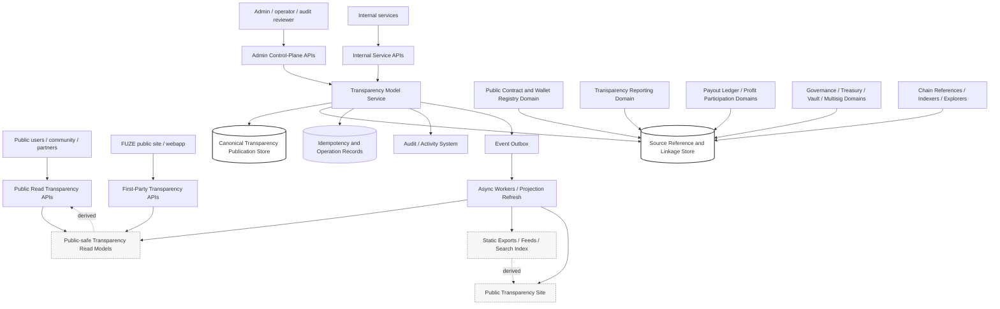
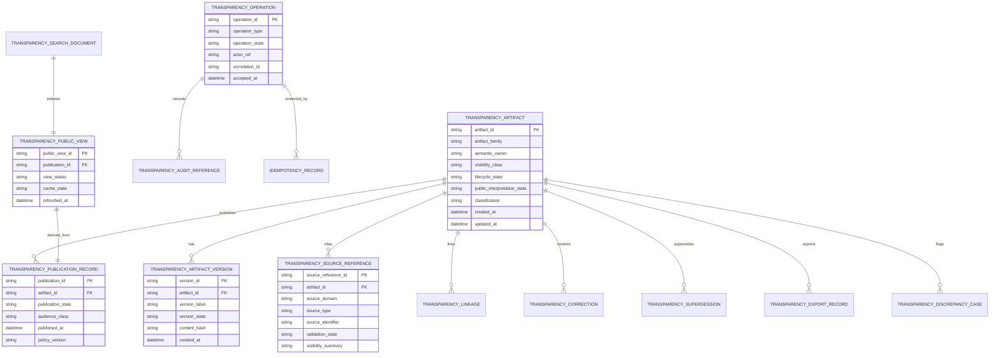
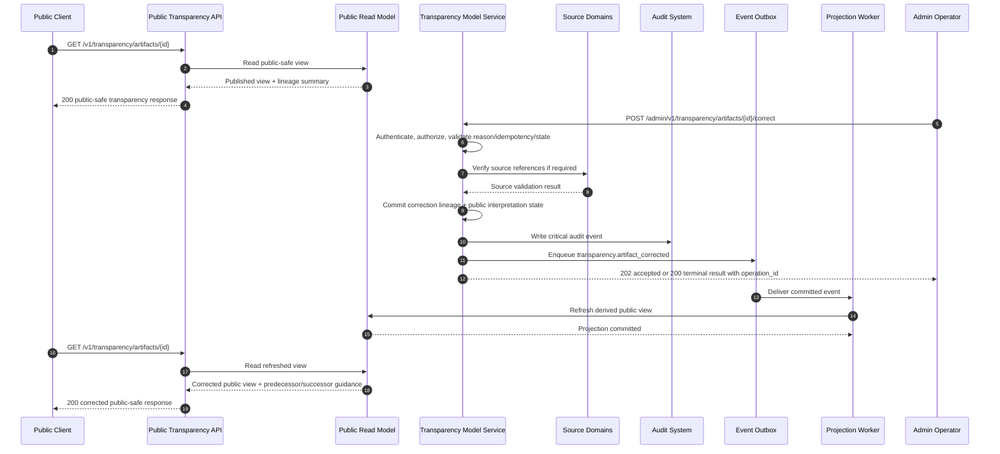

# TRANSPARENCY_MODEL_API_SPEC.md

## Document Metadata

- **Document Name:** `TRANSPARENCY_MODEL_API_SPEC.md`
- **Document Type:** FUZE API Specification v2
- **Status:** Draft production-grade API specification
- **Version:** 2.0.0
- **Effective Date:** 2026-04-25
- **Last Updated:** 2026-04-25
- **Reviewed On:** 2026-04-25
- **Document Owner:** FUZE Transparency Model and Public Trust Interpretation Domain for semantic ownership; FUZE API Architecture Domain for interface-contract posture
- **Approval Authority:** Not explicitly specified in retrieved governing materials; approval remains governed by the active FUZE approval workflow and refined-system registry process
- **Review Cadence:** SHOULD be reviewed quarterly and whenever public-trust posture, public API posture, registry posture, payout publication posture, treasury/governance controls, chain architecture, stakeholder reporting, or transparency-sensitive publication rules materially change
- **Governing Layer:** API contract layer derived from the refined transparency-model system semantics
- **Parent Registry:** FUZE API SPEC v2 Canonical File Registry
- **Upstream Semantic Registry:** `REFINED_SYSTEM_SPEC_INDEX.md`
- **Upstream API Registry:** `API_SPEC_INDEX.md`
- **Primary Audience:** Platform architecture, backend engineering, public API authors, frontend/public-site authors, reporting authors, registry authors, payout-ledger publication authors, treasury/governance stakeholders, security, audit/compliance, runtime operations, OpenAPI/AsyncAPI/SDK authors, implementation-contract authors
- **Primary Purpose:** Define the production-grade API contract architecture for exposing, maintaining, deriving, correcting, superseding, linking, and observing FUZE transparency-model artifacts and public-trust interpretation views without redefining refined transparency semantics or source-domain truth
- **Primary Upstream References:** `REFINED_SYSTEM_SPEC_INDEX.md`; `DOCS_SPEC_INDEX.md`; `SYSTEM_SPEC_INDEX.md`; `API_SPEC_INDEX.md`; `TRANSPARENCY_MODEL_SPEC.md`; `TRANSPARENCY_REPORTING_SPEC.md`; `PUBLIC_CONTRACT_AND_WALLET_REGISTRY_SPEC.md`; `INVESTOR_AND_COMMUNITY_REPORTING_SPEC.md`; `PUBLIC_API_SPEC.md`; `API_ARCHITECTURE_SPEC.md`; `INTERNAL_SERVICE_API_SPEC.md`; `EVENT_MODEL_AND_WEBHOOK_SPEC.md`; `IDEMPOTENCY_AND_VERSIONING_SPEC.md`; `MIGRATION_AND_BACKWARD_COMPATIBILITY_SPEC.md`; `AUDIT_LOG_AND_ACTIVITY_SPEC.md`; `AUDIT_AND_ACCESS_TRACEABILITY_SPEC.md`; `SECURITY_AND_RISK_CONTROL_SPEC.md`; `DATA_CLASSIFICATION_AND_HANDLING_SPEC.md`; `PAYOUT_LEDGER_SPEC.md`; `PROFIT_PARTICIPATION_SYSTEM_SPEC.md`; `SNAPSHOT_AND_ELIGIBILITY_PIPELINE_SPEC.md`; `CHAIN_ARCHITECTURE_SPEC.md`; `GOVERNANCE_MODEL_SPEC.md`; `TREASURY_CONTROL_POLICY_SPEC.md`; `VAULT_ACTION_POLICY_SPEC.md`; `MULTISIG_AND_TIMELOCK_SPEC.md`; `FOUNDATION_GOVERNANCE_SPEC.md`
- **Primary Downstream Dependents:** `TRANSPARENCY_REPORTING_API_SPEC.md`; `INVESTOR_AND_COMMUNITY_REPORTING_API_SPEC.md`; `PUBLIC_METADATA_API_SPEC.md`; `PUBLIC_TRANSPARENCY_API_SPEC.md`; `PUBLIC_REGISTRY_LOOKUP_API_SPEC.md`; `PUBLIC_PAYOUT_STATUS_API_SPEC.md`; public transparency sites; public trust exports; registry and payout-ledger publication surfaces; stakeholder reporting portals; OpenAPI/AsyncAPI/SDK derivation artifacts; implementation-contract specs for transparency services, publication workflows, read models, caches, indexes, and event catalogs
- **API Surface Families Covered:** public-read, first-party authenticated read, internal service, admin/control-plane, event/async, reporting/export, chain-adjacent reference surfaces
- **API Surface Families Excluded:** raw treasury control execution, raw governance approval execution, raw payout execution, contract ABI execution, raw chain indexer ingestion, raw accounting ledgers, secret/config surfaces, private investor-only document rooms, unrestricted analytics dashboards, generic website rendering implementation
- **Canonical System Owner(s):** FUZE Transparency Model and Public Trust Interpretation Domain owns transparency-model semantics, public-trust interpretation posture, transparency truth taxonomy, cross-artifact coherence rules, and transparency-safe publication framing
- **Canonical API Owner:** FUZE API Architecture Domain, implemented by the transparency-model API service boundary and downstream public/internal/admin route families
- **Supersedes:** No exact same-name v1 API specification was found in the retrieved materials. This document supersedes any weaker or implied API-layer interpretation that treats transparency-model APIs as generic public pages, dashboards, export conveniences, registry aliases, reporting aliases, or source-domain mutation owners.
- **Superseded By:** None currently defined
- **Related Decision Records:** Not explicitly specified in retrieved governing materials
- **Canonical Status Note:** This API specification derives from the active refined transparency-model system specification. It governs API contract expression only. Refined system specs own semantic truth; API specs own interface-contract expression.
- **Implementation Status:** Normative API contract draft; downstream implementation contracts, OpenAPI/AsyncAPI artifacts, route inventories, SDKs, public sites, exports, indexes, and admin/control-plane tools MUST align before production use
- **Approval Status:** Draft pending explicit FUZE approval workflow
- **Change Summary:** Introduces a v2 API contract for the transparency-model domain, separating transparency-model API truth from source-domain truth, registry truth, reporting truth, payout truth, governance/treasury truth, public-read projection truth, runtime truth, audit truth, and presentation truth. Adds route-family posture, request/response/error semantics, idempotency and replay rules, publication/correction/supersession controls, event behavior, diagrams, acceptance criteria, and production-readiness test cases.

---

## Purpose

This specification defines the FUZE API contract for the Transparency Model domain.

The API exists to expose and operate FUZE's public-trust interpretation layer in a controlled, versioned, public-safe, lineage-preserving, and audit-ready way. It makes transparency artifacts, transparency families, source linkages, explanatory mappings, correction lineage, supersession state, public-safe transparency views, and downstream publication signals available through bounded API surfaces without allowing those APIs to become the semantic owner of chain state, registry entries, payout execution, treasury/governance controls, accounting truth, or reporting truth.

This API is not a generic content-management API. It is an interface-contract layer over a trust-sensitive platform model. Its routes, responses, events, read models, and admin paths MUST preserve the governing principle that transparency in FUZE is a bounded public-trust interpretation layer: architecture-aligned, source-linked, historically intelligible, public-safe, and subordinate to stronger source-domain truth.

---

## Scope

This API specification governs:

1. API surface families for transparency-model reads, writes, publication workflows, corrections, supersessions, restrictions, exports, and events.
2. Public-read contract rules for transparency artifacts, artifact families, transparency views, public interpretation state, and transparency linkages.
3. First-party authenticated read rules for bounded enhanced transparency views where policy permits.
4. Internal service API rules for creating, validating, linking, generating, indexing, and publishing transparency artifacts and derived views.
5. Admin/control-plane API rules for publish, restrict, correct, supersede, withdraw-if-required, resolve discrepancy, and remediate export/index failures.
6. Event/async rules for transparency artifact lifecycle, publication, correction, supersession, export, discrepancy, and public-view refresh behavior.
7. Request, response, error, result, idempotency, retry, replay, rate-limit, audit, traceability, observability, migration, versioning, compatibility, and deprecation requirements.
8. Read-model, projection, cache, search-index, export, and public-site constraints for transparency-model data.
9. Guardrails for OpenAPI, AsyncAPI, SDK, implementation-contract, and downstream storage/event derivation.

---

## Out of Scope

This API specification does not govern:

1. Canonical chain-native contract state, chain balances, block observations, or ABI execution.
2. Canonical public contract and wallet registry designation truth for individual registry entries.
3. Exact transparency-report generation, reporting-period cadence, report content composition, and report artifact publication logic in full depth.
4. Exact investor/community reporting audience segmentation, release windows, private stakeholder packages, and investor/private artifacts in full depth.
5. Payout-cycle execution, payout entitlement logic, claim execution, Base settlement, or payout ledger semantic ownership.
6. Treasury-control, vault-action, Foundation-governance, multisig, timelock, or governance-approval execution mechanics.
7. Raw accounting ledgers, finance workpapers, legal opinions, tax treatment, or board/private investor material handling.
8. Public website information architecture, visual design, rendering, copywriting, SEO, or CDN implementation detail.
9. Storage engine internals, queue internals, indexer internals, and observability vendor topology except where contract behavior must preserve lineage and safety.

Out-of-scope domains MAY provide source references or consume transparency artifacts, but they MUST NOT be redefined by this API.

---

## Design Goals

1. Preserve refined transparency-model semantics at the API layer.
2. Make transparency APIs public-safe without weakening transparency's structural, source-linked, historically intelligible posture.
3. Separate public-read surfaces, first-party surfaces, internal service APIs, admin/control-plane APIs, events/webhooks, reporting exports, and chain-adjacent reference surfaces.
4. Prevent dashboards, static pages, caches, indexes, exports, SDKs, or partner integrations from becoming shadow transparency owners.
5. Make source-domain references explicit without exposing unsafe internal detail.
6. Support deterministic publication, correction, supersession, restriction, withdrawal-if-required, discrepancy, and export behavior.
7. Preserve clear accepted-state versus final-outcome semantics for async generation, export, refresh, and remediation workflows.
8. Provide stable route, request, response, error, status, idempotency, and audit behavior for downstream implementation.
9. Support OpenAPI/AsyncAPI/SDK generation without allowing generated artifacts to reinterpret transparency truth.
10. Reduce route drift, schema drift, ownership drift, public exposure drift, public interpretation drift, and test drift.

---

## Non-Goals

This API does not aim to:

1. Publish all internal operational state in the name of transparency.
2. Convert raw chain visibility into full transparency without interpretation, source linkage, and public-trust framing.
3. Allow public-facing convenience views to replace source-domain truth.
4. Turn public transparency APIs into admin mutation surfaces.
5. Treat transparency artifacts as canonical owners of payout, registry, treasury, governance, chain, wallet-link, or accounting truth.
6. Hide corrections, supersessions, or retractions behind silent updates.
7. Expose private operational wallet inventories, signer topology, secret material, private source notes, or restricted control details.
8. Use generic analytics dashboards as official transparency-model surfaces.
9. Provide final database schemas, rendering templates, or machine-readable OpenAPI definitions directly inside this governance document.

---

## Core Principles

### Refined-Semantics Preservation

Refined transparency-model semantics own domain truth. This API MUST express those semantics through interface contracts and MUST NOT redefine them for route, SDK, dashboard, or client convenience.

### Source-Domain Subordination

Transparency APIs expose derived public-trust interpretation. Source domains retain ownership of their canonical truth. API responses MUST distinguish transparency interpretation from registry truth, payout truth, chain truth, treasury truth, governance truth, audit truth, and reporting truth.

### Public-Safe Legibility

Public transparency views MUST improve public legibility while withholding unsafe or non-approved internal detail.

### Explicit Lineage

Material transparency artifacts MUST carry source-reference posture, publication lineage, correction lineage, supersession posture, and where appropriate export/index lineage.

### Correction and Supersession Discipline

Material changes to public interpretation MUST be explicit, historically intelligible, and auditable. Silent rewrite is forbidden.

### Surface-Family Separation

Public, first-party, internal, admin/control-plane, event/async, reporting/export, and chain-adjacent route families MUST remain separate. Internal service power MUST NOT leak through public or first-party routes.

### Derived Views Are Not Owners

Public sites, public APIs, search indexes, feeds, caches, reports, and exports are derived or publication-oriented surfaces. They MUST NOT own semantic truth.

### Conservative Exposure Default

Ambiguous exposure defaults to withheld, restricted, or review-required. Public convenience does not justify broader disclosure.

---

## Canonical Definitions

- **Transparency Model:** The governing FUZE public-trust interpretation model that defines how the platform becomes publicly legible through coherent, source-linked, architecture-aligned transparency artifacts.
- **Transparency Artifact:** A trust-sensitive artifact, view, mapping, explanation, report linkage, registry linkage, payout linkage, public summary, or stakeholder-facing reference produced under transparency-model rules.
- **Transparency Artifact Family:** A governed grouping of transparency artifacts such as registry-linked explanation, payout-linked summary, governance-sensitive disclosure, reserve/vault mapping, chain-reference explanation, recurring transparency family, or stakeholder-report linkage.
- **Transparency View:** A derived API/read-model representation of one or more transparency artifacts or artifact families.
- **Transparency Publication Record:** The canonical record of publication state, visibility class, version, correction, supersession, and lineage for a transparency artifact.
- **Transparency Source Reference:** A bounded reference to stronger source-domain truth used to support a transparency artifact.
- **Transparency Linkage:** A governed relationship among transparency artifacts and source or publication artifacts, including registry entries, payout ledger entries, reports, governance references, chain references, and public metadata.
- **Public Interpretation State:** The active public-facing interpretive meaning of a transparency artifact after applying publication, correction, restriction, withdrawal, and supersession lineage.
- **Transparency Correction:** A governed change that clarifies, amends, or corrects an artifact's public interpretation while preserving historical lineage.
- **Transparency Supersession:** A governed replacement of one artifact or interpretation by another with explicit predecessor/successor linkage.
- **Public-Safe Transparency Data:** A subset of transparency-model data approved for public exposure under visibility, classification, and policy rules.
- **Presentation Truth:** Public labels, copy, grouping, summaries, charts, pages, and explanatory framing that help comprehension but do not own source truth.

---

## Truth Class Taxonomy

The API MUST preserve these truth classes:

1. **Semantic Truth:** Refined transparency-model rules, artifact taxonomy, visibility posture, coherence rules, correction/supersession semantics, and public-trust interpretation rules.
2. **API Contract Truth:** Route families, request/response contracts, error/result/status classes, idempotency posture, versioning, compatibility, and exposure boundaries governed by this API spec.
3. **Policy Truth:** Visibility classes, audience restrictions, publication eligibility rules, disclosure approvals, governance/policy references, and data classification constraints.
4. **Runtime Truth:** Jobs, accepted operations, export attempts, index refreshes, retries, failures, degraded-mode state, and operation references.
5. **Source-Domain Truth:** Registry truth, payout truth, chain truth, governance truth, treasury truth, accounting truth, wallet-link truth, and other canonical source truths.
6. **Publication Truth:** Canonical transparency publication records, visibility state, version lineage, correction lineage, supersession lineage, and restriction/withdrawal posture.
7. **Provider/Input Truth:** Chain observations, third-party verification inputs, explorer references, partner references, source snapshots, and normalized inputs before owner-domain validation.
8. **Event / Async Execution Truth:** Internal domain events, webhook-safe derived events, outbox records, delivery attempts, replay state, and async operation status.
9. **Projection / Reporting Truth:** Public views, public metadata, transparency reports, stakeholder reports, search indexes, API read models, feeds, exports, and caches.
10. **Presentation Truth:** Copy, labels, UI grouping, explanatory summaries, charts, diagrams, and page composition.
11. **Audit Truth:** Immutable audit/activity records for trust-sensitive create, publish, correct, supersede, restrict, withdraw, export, resolve, and override actions.

API implementations MUST NOT collapse these into one generic `transparency_status`, `public_page`, `dashboard_record`, or `content_item` abstraction when distinct downstream behavior depends on the distinction.

---

## Architectural Position in the Spec Hierarchy

This API specification sits below the refined-system registry and the refined `TRANSPARENCY_MODEL_SPEC.md`. It also depends on cross-cutting API, public API, internal API, event/webhook, idempotency/versioning, migration/backward compatibility, security, audit, data classification, runtime, and public-trust specifications.

It sits above or alongside downstream route inventories, OpenAPI files, AsyncAPI files, SDK packages, event catalogs, database schema specs, projection/index contracts, public-site implementation specs, export pipeline specs, admin/control-plane implementation specs, and operational runbooks.

This API spec governs interface-contract expression. It MUST NOT override upstream refined semantic ownership.

---

## Upstream Semantic Owners

Primary upstream semantic owner:

- `TRANSPARENCY_MODEL_SPEC.md` owns transparency-model semantics, public-trust interpretation posture, transparency truth taxonomy, cross-artifact coherence, correction/supersession posture, and transparency-safe publication framing.

Material adjacent semantic owners:

- `PUBLIC_CONTRACT_AND_WALLET_REGISTRY_SPEC.md` owns registry publication truth for official contract and designated wallet records.
- `TRANSPARENCY_REPORTING_SPEC.md` owns recurring transparency-report truth, reporting periods, report generation, report publication state, source snapshots, report corrections, and report supersessions.
- `INVESTOR_AND_COMMUNITY_REPORTING_SPEC.md` owns stakeholder-report truth and audience-specific reporting posture.
- `PAYOUT_LEDGER_SPEC.md` owns payout-cycle ledger truth and payout publication linkage.
- `PROFIT_PARTICIPATION_SYSTEM_SPEC.md` owns profit-participation semantics.
- `SNAPSHOT_AND_ELIGIBILITY_PIPELINE_SPEC.md` owns eligibility dataset truth and cycle-specific derivation lineage.
- `CHAIN_ARCHITECTURE_SPEC.md` owns chain-adjacent platform posture.
- `GOVERNANCE_MODEL_SPEC.md`, `TREASURY_CONTROL_POLICY_SPEC.md`, `VAULT_ACTION_POLICY_SPEC.md`, `MULTISIG_AND_TIMELOCK_SPEC.md`, and `FOUNDATION_GOVERNANCE_SPEC.md` own sensitive economic/control truth.
- `PUBLIC_API_SPEC.md`, `API_ARCHITECTURE_SPEC.md`, `INTERNAL_SERVICE_API_SPEC.md`, and `EVENT_MODEL_AND_WEBHOOK_SPEC.md` own cross-cutting interface posture.
- `AUDIT_LOG_AND_ACTIVITY_SPEC.md` and `AUDIT_AND_ACCESS_TRACEABILITY_SPEC.md` own audit/activity semantics.
- `DATA_CLASSIFICATION_AND_HANDLING_SPEC.md` owns data handling posture and exposure constraints.

---

## API Surface Families

### Public Read Surface

Public read routes expose approved transparency-model artifacts, artifact families, public-safe linkages, public interpretation states, correction/supersession metadata, and public-safe source-reference summaries.

Public routes MUST be read-only. They MUST NOT expose unpublished drafts, internal notes, private source details, signer topology, private wallet inventories, raw control data, raw ledgers, or operator-only discrepancy details.

### First-Party Authenticated Surface

First-party authenticated routes MAY expose bounded enriched transparency context to FUZE webapp or approved first-party clients when policy permits. These routes remain read-oriented unless a separate approved first-party mutation spec exists. Authentication does not imply broader publication rights.

### Internal Service Surface

Internal service routes support controlled creation, update, source-linking, verification, generation, validation, export preparation, projection refresh, and status inspection for transparency-model records. They require service identity, least privilege, idempotency for mutations, and audit linkage where trust-sensitive.

### Admin / Control-Plane Surface

Admin/control-plane routes support privileged actions such as publish, restrict, correct, supersede, withdraw-if-required, resolve discrepancy, retry export, and quarantine publication. They require authenticated operator identity, authorization, reason code, correlation ID, idempotency key, policy version reference where applicable, and audit capture.

### Event / Async Surface

Event surfaces communicate lifecycle and synchronization signals. Internal events MAY represent committed transparency-domain changes. Public webhooks, if later approved, MUST expose only stable public-safe lifecycle signals and MUST NOT mirror internal events automatically.

### Reporting / Export Surface

Reporting/export surfaces generate or expose approved transparency artifacts, feeds, public metadata, static exports, and search-index inputs. They remain derived and MUST preserve source lineage and publication lineage.

### Chain-Adjacent Reference Surface

Chain-adjacent routes MAY expose bounded references to approved contracts, addresses, explorer links, chain IDs, transaction references, or chain-observation summaries. They MUST label them as references or source inputs unless a stronger owner-domain has validated and published them.

---

## System / API Boundaries

This API owns interface contracts for transparency-model resources. It does not own source-domain mutation truth.

Allowed API ownership:

- create or update transparency artifacts as transparency-model artifacts
- link approved source references without mutating source-domain truth
- publish, restrict, correct, supersede, or withdraw transparency artifacts through bounded publication controls
- expose public-safe transparency views
- emit transparency lifecycle events
- generate derived exports and projections from canonical transparency publication truth

Forbidden ownership:

- changing registry entry truth through transparency routes
- changing payout-cycle truth through transparency routes
- changing chain-native state or contract state through transparency routes
- changing governance approval, treasury control, vault action, or multisig/timelock execution truth through transparency routes
- changing accounting truth through transparency routes
- treating public sites, dashboards, or exports as canonical transparency mutation owners

---

## Adjacent API Boundaries

- `PUBLIC_CONTRACT_AND_WALLET_REGISTRY_API_SPEC.md` owns route contracts for registry entry lookup, designation, publication, verification, and correction.
- `TRANSPARENCY_REPORTING_API_SPEC.md` owns recurring report generation, reporting period, source snapshot, attestation, publication, correction, and report artifact routes.
- `INVESTOR_AND_COMMUNITY_REPORTING_API_SPEC.md` owns stakeholder-reporting APIs and audience-specific report posture.
- `PUBLIC_METADATA_API_SPEC.md` owns generalized public metadata discovery if split from transparency-model views.
- `PUBLIC_TRANSPARENCY_API_SPEC.md` owns public transparency site/API delivery surfaces when separated as a public companion layer.
- `PUBLIC_PAYOUT_STATUS_API_SPEC.md` owns public payout status publication surfaces.
- `PUBLIC_REGISTRY_LOOKUP_API_SPEC.md` owns public lookup convenience surfaces for registry data.
- `GOVERNANCE_MODEL_API_SPEC.md`, `TREASURY_CONTROL_POLICY_API_SPEC.md`, `VAULT_ACTION_POLICY_API_SPEC.md`, and `MULTISIG_AND_TIMELOCK_API_SPEC.md` own control and governance API contracts.
- `EVENT_MODEL_AND_WEBHOOK_SPEC.md` and future AsyncAPI specs own event/webhook contract derivation.

If a route appears to span multiple domains, it MUST name a canonical owner and consume adjacent domains through references or service contracts rather than creating a merged owner.

---

## Conflict Resolution Rules

1. The active refined registry wins on refined-library membership and precedence.
2. Higher-order boundary and platform architecture specs win on platform-wide ownership and plane separation.
3. The refined `TRANSPARENCY_MODEL_SPEC.md` wins on transparency-model semantics.
4. Source-domain specs win on their canonical truth: registry, payout, chain, treasury, governance, accounting, wallet-link, audit, and reporting domains retain their meaning.
5. This API spec wins on transparency-model interface-contract expression only.
6. Public API, internal API, event/webhook, idempotency/versioning, migration, security, audit, data-classification, and runtime specs win on their cross-cutting concerns where they do not override refined domain truth.
7. Public sites, dashboards, exports, SDKs, generated clients, caches, and indexes never win over canonical transparency-model or source-domain truth.
8. When ambiguity remains, FUZE MUST choose the narrower, more conservative, trust-preserving, architecture-consistent interpretation and escalate into explicit refinement or decision work.

---

## Default Decision Rules

1. Transparency API records are derived public-trust interpretation records unless explicitly classified as canonical transparency publication records.
2. Ambiguous data exposure defaults to non-public or review-required.
3. Ambiguous public meaning defaults to explicit labeling, caveat, restriction, correction, or supersession rather than silent reinterpretation.
4. Public transparency routes default to read-only.
5. Admin/control-plane routes default to separate privileged surfaces with reason-coded, audited, idempotent mutations.
6. Internal service routes default to least-privilege service identity and idempotent writes.
7. Async workflows default to accepted-state responses and stable operation references, not fake synchronous finality.
8. Source references default to link/reference posture unless the source owner has validated and published the source truth.
9. Derived projections, caches, feeds, and exports default to stale/unavailable posture when not refreshed, not new truth.
10. If a transparency artifact cannot name its source-domain references and publication lineage, it MUST NOT be publicly published.

---

## Roles / Actors / API Consumers

### Public Consumers

- Public users
- Community members
- Token holders and prospective holders
- Partners and external verifiers
- Search engines and public archival tools where allowed
- Unauthenticated public clients

### First-Party Consumers

- FUZE public website
- FUZE webapp
- FUZE transparency pages
- FUZE investor/community portal where approved
- First-party reporting views

### Internal Consumers

- Transparency model service
- Transparency reporting service
- Public registry service
- Payout-ledger publication service
- Governance/treasury reference services
- Chain-reference/indexing services
- Public metadata service
- Export and search-index pipelines
- Audit and monitoring systems

### Admin / Operator Consumers

- FUZE admin/control-plane users
- Transparency publication operators
- Audit/compliance reviewers
- Treasury/governance reviewers where required
- Security operators for containment or restricted-publication flows
- Incident/remediation operators

### Downstream Contract Consumers

- OpenAPI/AsyncAPI generators
- SDK maintainers
- Event catalog authors
- Database/storage contract authors
- QA/contract-test authors
- Runtime/runbook authors

---

## Resource / Entity Families

### Canonical Transparency API Resources

- `transparency_artifact`
- `transparency_artifact_family`
- `transparency_publication_record`
- `transparency_artifact_version`
- `transparency_source_reference`
- `transparency_linkage`
- `transparency_correction`
- `transparency_supersession`
- `transparency_restriction`
- `transparency_discrepancy_case`
- `transparency_export_record`
- `transparency_projection_refresh`
- `transparency_operation`
- `transparency_policy_reference`
- `transparency_audit_reference`

### Derived Resource Families

- `transparency_public_view`
- `transparency_public_feed_item`
- `transparency_search_index_document`
- `transparency_static_export`
- `transparency_public_metadata_card`
- `transparency_site_view_model`
- `transparency_partner_view`

### External or Adjacent References

- `registry_entry_reference`
- `payout_ledger_reference`
- `transparency_report_reference`
- `stakeholder_report_reference`
- `chain_reference`
- `governance_reference`
- `treasury_policy_reference`
- `audit_event_reference`
- `source_snapshot_reference`

References MUST NOT be mistaken for ownership of the referenced object.

---

## Ownership Model

The Transparency Model domain owns:

1. Transparency artifact taxonomy and public-trust interpretation semantics.
2. Transparency publication records and public interpretation state.
3. Transparency artifact source-linkage and coherence posture.
4. Transparency correction and supersession semantics at the transparency-model layer.
5. Public-safe transparency view derivation rules.
6. Transparency-model discrepancy cases and remediation posture.
7. API contract rules for transparency-model surfaces in this document.

It does not own:

1. Registry entry truth.
2. Payout-cycle, payout-ledger, claim, or payout-execution truth.
3. Chain-native state.
4. Treasury, vault, Foundation, governance, multisig, or timelock control truth.
5. Account/session/wallet-link truth.
6. Raw accounting truth.
7. Audit/activity truth, except by producing auditable actions and references.
8. Reporting-period/report artifact truth governed by narrower reporting domains.
9. Public website rendering as a semantic owner.

---

## Authority / Decision Model

- Source domains authorize and validate their own canonical facts.
- The Transparency Model domain authorizes public-trust interpretation and public-safe coherence across those facts.
- The API layer enforces route-family, request, response, error, idempotency, audit, and compatibility posture.
- Admin/control-plane users may perform privileged publication actions only if authorized by policy, route family, current state, and reason-coded workflow.
- Public clients may read only approved public-safe interpretations.
- First-party clients may read policy-approved enriched views but do not gain semantic authority.
- Internal services may write or link transparency-model records only within least-privilege service contracts.
- Generated SDKs and public sites are consumers, not owners.

---

## Authentication Model

### Public Read Routes

Public routes MAY be unauthenticated. They MUST still enforce public visibility, rate limits, abuse controls, safe error behavior, and no exposure of restricted fields.

### First-Party Authenticated Routes

Authenticated first-party routes MUST validate user or client session and audience posture. Authentication does not imply authorization to view unpublished or restricted artifacts.

### Internal Service Routes

Internal routes MUST require service-to-service authentication. Service identity MUST be explicit and scoped to operation class. Network location alone is insufficient.

### Admin / Control-Plane Routes

Admin routes MUST require authenticated human operator identity or explicitly approved privileged service identity, plus authorization, reason code, correlation ID, idempotency key, and audit capture.

### Event/Webhook Routes

Inbound callbacks, if any, MUST be authenticated, signed, replay-protected, and treated as normalized-input truth until the owner domain validates them. Outbound webhooks MUST use version-aware signing and delivery controls if public webhooks are approved.

---

## Authorization / Scope / Permission Model

Authorization MUST evaluate:

1. Caller identity and caller class.
2. Surface family.
3. Operation class: read, create, update, verify, publish, restrict, correct, supersede, withdraw, export, retry, resolve, inspect.
4. Visibility class of the target artifact.
5. Current lifecycle state.
6. Data classification posture.
7. Source-domain linkage sensitivity.
8. Policy version and governance/control requirements where applicable.
9. Object-level constraints.
10. Function-level authority.
11. Admin/control-plane elevation and reason-code requirements.

Public access MUST never be granted merely because an artifact exists. Public access requires an explicit public publication state and public-safe classification.

---

## Entitlement / Capability-Gating Model

Most public transparency reads are not entitlement-gated. However, enhanced first-party, partner, investor/community, or stakeholder-facing views MAY be capability-gated or audience-gated by downstream reporting specs.

Capability gating MUST NOT override data classification, public-safe exposure, source-domain policy, or transparency publication state. A capable caller may still be denied if the artifact is unpublished, restricted, withdrawn, unsafe, or outside the caller audience.

---

## API State Model

### Transparency Artifact State

- `draft`
- `source_linked`
- `verification_pending`
- `verified`
- `publication_ready`
- `published`
- `restricted`
- `deprecated`
- `superseded`
- `withdrawn_if_required`
- `archived`

### Publication State

- `unpublished`
- `published_public`
- `published_stakeholder_if_approved`
- `restricted`
- `hidden`
- `withdrawn`
- `archived`

### Correction State

- `none`
- `identified`
- `review_required`
- `approved`
- `published_correction`
- `closed`

### Supersession State

- `not_superseded`
- `supersession_pending`
- `superseded_by_current`
- `supersedes_prior`
- `supersession_disputed`

### Export / Projection State

- `not_started`
- `accepted`
- `running`
- `published`
- `stale`
- `failed`
- `quarantined`
- `superseded`

### Operation State

- `accepted`
- `validated`
- `running`
- `succeeded`
- `failed_retryable`
- `failed_terminal`
- `cancelled`
- `requires_operator_review`

State names MAY be refined in downstream implementation contracts, but these semantic distinctions MUST remain expressible.

---

## Lifecycle / Workflow Model

1. A transparency-relevant source state, platform structure, registry entry, payout artifact, governance reference, chain reference, or reporting artifact is identified.
2. Internal service creates a transparency artifact draft or updates an existing draft.
3. Source references are attached and classified.
4. Policy, visibility, source-domain, data-classification, and public-safe checks run.
5. Artifact moves to verification or publication-ready state only when source linkage and exposure posture are adequate.
6. Admin/control-plane action publishes, restricts, corrects, supersedes, or withdraws with reason code and audit lineage.
7. Public views, indexes, feeds, static exports, and site models refresh from canonical publication truth.
8. Events are emitted after committed state changes.
9. Public and first-party reads return only visibility-appropriate data and lineage summaries.
10. Discrepancies, stale views, failed exports, or source-domain mismatches enter explicit review/remediation flow.
11. Corrections and supersessions preserve predecessor/successor lineage and public interpretation state.

---

## Architecture Diagram — Mermaid flowchart

---

## Data Design — Mermaid Diagram

Canonical data is held in transparency artifact, version, source-reference, linkage, publication, correction, supersession, operation, idempotency, and audit-reference records. Public views, search documents, feeds, exports, and site models are derived and MUST NOT become mutation owners.

---

## Flow View

### Public Read Flow

1. Public client requests a transparency artifact, family, public view, or linkage.
2. API applies route-level rate limit and abuse checks.
3. API resolves only `published_public` and public-safe records.
4. API reads from public transparency read model or canonical publication store if direct reads are allowed.
5. API includes public-safe lineage summaries, current/superseded/corrected state, and stale/export status where relevant.
6. API withholds private source details, unpublished drafts, operator notes, restricted records, and unsafe control information.
7. API emits access telemetry where appropriate without creating audit noise for ordinary public reads.

### Internal Artifact Creation Flow

1. Internal service submits artifact creation request with idempotency key and correlation ID.
2. API authenticates service identity and checks service scope.
3. API validates artifact family, visibility class, source-domain references, classification, and required fields.
4. API stores idempotency record and creates draft/source-linked artifact.
5. API records operation and audit references where required.
6. API emits `transparency.artifact_created` after commit.
7. Async workers may validate references or prepare derived projections.

### Admin Publication Flow

1. Operator submits publish request with reason code, idempotency key, policy version reference, and correlation ID.
2. API authenticates operator identity and evaluates authorization, object state, classification, source completeness, and publication eligibility.
3. API blocks publication if source linkage is incomplete, artifact is unsafe, policy approval is missing, or current state is invalid.
4. API commits publication state and operation record atomically.
5. API writes critical audit record.
6. API emits lifecycle event after commit.
7. Projection/export workers refresh public views.
8. Public routes expose the artifact only after publication state and public view are available or after direct canonical public read is safe.

### Correction / Supersession Flow

1. Discrepancy or correction need is identified by internal review, source-domain change, audit finding, or operator request.
2. Admin/control-plane route receives correction or supersession request with reason code and idempotency key.
3. API checks authority, current state, source references, replacement artifact if any, correction type, and public-safe explanation requirement.
4. API creates correction or supersession lineage without deleting prior public history.
5. API updates public interpretation state.
6. API emits correction/supersession event after commit.
7. Public views expose current state and predecessor/successor guidance.

### Degraded Mode Flow

1. If source-domain, projection, export, or cache dependency is unavailable, API must not invent transparency meaning.
2. Public routes return last known public-safe view with stale metadata or a safe unavailable response.
3. Internal/admin routes return dependency-specific errors with correlation IDs.
4. Remediation operations remain explicit, audited, and reason-coded.
5. Once dependencies recover, projection refresh uses canonical publication truth and recorded operation lineage.

---

## Data Flows — Mermaid sequenceDiagram

---

## Request Model

### Common Request Headers

- `X-Correlation-Id`: REQUIRED for all mutation routes and SHOULD be accepted on read routes.
- `Idempotency-Key`: REQUIRED for all mutation-capable routes.
- `X-FUZE-Client`: SHOULD identify approved clients where applicable.
- `Authorization`: REQUIRED for first-party authenticated, internal, admin, and partner routes.
- `Content-Type: application/json`: REQUIRED for JSON mutation routes.
- `Accept: application/json`: SHOULD be supported for API responses.

### Common Mutation Fields

Mutation requests SHOULD include or derive:

- `operation_type`
- `artifact_id` or target reference
- `artifact_family`
- `visibility_class`
- `source_references`
- `policy_version_reference` where applicable
- `reason_code` for privileged actions
- `operator_note` for admin/control-plane actions, not public
- `public_explanation_summary` where public correction/retraction requires explanation
- `requested_by` derived from authentication, not client-supplied as authority

### Public Read Request Rules

Public reads MAY support filtering by:

- `artifact_family`
- `visibility_class=public`
- `publication_state`
- `current_only`
- `source_domain`
- `linked_reference_type`
- `updated_after`
- pagination and stable sorting

Public request filters MUST NOT expose restricted records through enumeration side channels.

### Internal/Admin Request Rules

Internal/admin requests MUST:

- identify target artifacts explicitly
- provide idempotency keys for mutations
- include correlation IDs
- include reason codes for privileged actions
- include policy version references where required
- be rejected if state transition is invalid
- be rejected if requested action would collapse source-domain truth or bypass owner-domain validation

---

## Response Model

### Common Response Fields

API responses SHOULD include:

- `resource_type`
- `id`
- `artifact_family`
- `lifecycle_state`
- `publication_state`
- `public_interpretation_state`
- `visibility_class`
- `version`
- `source_reference_summary`
- `lineage_summary`
- `correction_summary` where applicable
- `supersession_summary` where applicable
- `links`
- `created_at`
- `updated_at`
- `published_at` where applicable
- `correlation_id` for mutation results and errors

### Public Response Rules

Public responses MUST:

- expose only public-safe fields
- label derived/public interpretation status
- distinguish current, corrected, superseded, deprecated, withdrawn, stale, and unavailable states
- include predecessor/successor guidance where material
- avoid private source details, internal notes, raw ledgers, signer topology, secret/config data, and restricted control details
- avoid implying that transparency views are canonical source-domain truth

### Internal Response Rules

Internal responses MAY include richer canonical transparency metadata but MUST preserve classification and caller scope. Internal responses SHOULD include validation state, source references, operation references, projection state, and audit references where authorized.

### Admin Response Rules

Admin responses MUST include operation outcome, target resource, resulting state, reason-code echo, audit reference, correlation ID, idempotency result status, and any required next action.

### Async Accepted Response Rules

Async accepted responses MUST include:

- `operation_id`
- `operation_state=accepted`
- `accepted_at`
- target resource reference
- current known state
- polling/status route if supported
- expected finalization semantics without promising final success

---

## Error / Result / Status Model

Errors MUST use structured problem-details style objects.

### Required Error Fields

- `type`
- `title`
- `status`
- `code`
- `detail`
- `instance`
- `correlation_id`
- `retryable`
- `visibility_safe_detail`

### Core Error Codes

#### Authentication / Authorization

- `TRANSPARENCY_AUTHENTICATION_REQUIRED`
- `TRANSPARENCY_PERMISSION_DENIED`
- `TRANSPARENCY_OPERATOR_PERMISSION_DENIED`
- `TRANSPARENCY_SERVICE_SCOPE_DENIED`
- `TRANSPARENCY_AUDIENCE_NOT_ALLOWED`

#### Visibility / Publication

- `TRANSPARENCY_NOT_PUBLISHED`
- `TRANSPARENCY_RESTRICTED`
- `TRANSPARENCY_WITHDRAWN`
- `TRANSPARENCY_PUBLICATION_FORBIDDEN`
- `TRANSPARENCY_PRIVATE_METADATA_FORBIDDEN`

#### State / Conflict

- `TRANSPARENCY_STATE_INVALID`
- `TRANSPARENCY_ALREADY_PUBLISHED`
- `TRANSPARENCY_ALREADY_SUPERSEDED`
- `TRANSPARENCY_SUPERSESSION_CONFLICT`
- `TRANSPARENCY_CORRECTION_CONFLICT`
- `TRANSPARENCY_DISCREPANCY_ALREADY_RESOLVED`

#### Source / Lineage

- `TRANSPARENCY_SOURCE_REFERENCE_REQUIRED`
- `TRANSPARENCY_SOURCE_REFERENCE_INVALID`
- `TRANSPARENCY_SOURCE_DOMAIN_UNAVAILABLE`
- `TRANSPARENCY_SOURCE_VALIDATION_FAILED`
- `TRANSPARENCY_LINEAGE_INCOMPLETE`

#### Idempotency / Request Integrity

- `TRANSPARENCY_IDEMPOTENCY_KEY_REQUIRED`
- `TRANSPARENCY_IDEMPOTENCY_CONFLICT`
- `TRANSPARENCY_REQUEST_INVALID`
- `TRANSPARENCY_REQUEST_UNPROCESSABLE`
- `TRANSPARENCY_REASON_CODE_REQUIRED`
- `TRANSPARENCY_POLICY_VERSION_REQUIRED`

#### Runtime / Projection / Export

- `TRANSPARENCY_OPERATION_ACCEPTED`
- `TRANSPARENCY_OPERATION_PENDING`
- `TRANSPARENCY_EXPORT_FAILED`
- `TRANSPARENCY_PROJECTION_STALE`
- `TRANSPARENCY_PROJECTION_UNAVAILABLE`
- `TRANSPARENCY_DEPENDENCY_DEGRADED`

Public errors MUST NOT leak restricted object existence when doing so would broaden exposure.

---

## Idempotency / Retry / Replay Model

Idempotency is REQUIRED for all mutation-capable routes, including:

- create artifact
- attach source reference
- verify artifact
- publish artifact
- restrict artifact
- correct artifact
- supersede artifact
- withdraw artifact
- resolve discrepancy
- generate export
- refresh projection
- retry failed export

Rules:

1. Idempotency key scope MUST include caller, route family, operation type, target resource, and request hash.
2. Replay of the same semantic request MUST return the original terminal or accepted result.
3. Replay of the same key with a different semantic request MUST fail with `TRANSPARENCY_IDEMPOTENCY_CONFLICT`.
4. Retry-safe async operations MUST retain stable operation IDs.
5. Admin/control-plane replays MUST NOT duplicate publication, correction, supersession, audit, export, or event records.
6. Event consumers MUST deduplicate by event ID and source operation ID.
7. Projection refreshes MUST be safe to replay from canonical publication truth.

---

## Rate Limit / Abuse-Control Model

Public routes MUST enforce rate limits appropriate to unauthenticated public access and trust-sensitive enumeration risk.

Required controls:

- route-family-specific rate limits
- IP/client/user-agent abuse heuristics where applicable
- pagination limits and maximum page size
- search/filter complexity limits
- cache-aware public read behavior where safe
- enumeration protection for restricted/unpublished artifacts
- stricter limits for partner, export, search, and high-volume public metadata routes
- alerting for scraping, probing, or repeated restricted-object lookups

Admin and internal routes MUST enforce operation quotas, concurrency controls, and safety limits to prevent accidental bulk publication, mass correction, or runaway export/projection jobs.

---

## Endpoint / Route Family Model

The following route families are normative patterns, not final OpenAPI listings. Downstream OpenAPI files MUST preserve these boundaries.

### Public Read Routes

- `GET /v1/transparency/artifacts`
- `GET /v1/transparency/artifacts/{artifact_id}`
- `GET /v1/transparency/families`
- `GET /v1/transparency/families/{family_id}`
- `GET /v1/transparency/linkages`
- `GET /v1/transparency/linkages/{linkage_id}`
- `GET /v1/transparency/public-interpretations/{artifact_id}`
- `GET /v1/transparency/changes`

Public routes MUST only expose `published_public` and public-safe records.

### First-Party Authenticated Routes

- `GET /app/v1/transparency/artifacts/{artifact_id}`
- `GET /app/v1/transparency/views/{view_id}`
- `GET /app/v1/transparency/linkages/{linkage_id}`

First-party routes MAY include bounded additional context if allowed by policy and classification.

### Internal Service Routes

- `POST /internal/v1/transparency/artifacts`
- `PATCH /internal/v1/transparency/artifacts/{artifact_id}`
- `POST /internal/v1/transparency/artifacts/{artifact_id}/source-references`
- `POST /internal/v1/transparency/artifacts/{artifact_id}/verify`
- `POST /internal/v1/transparency/artifacts/{artifact_id}/prepare-publication`
- `POST /internal/v1/transparency/projections/refresh`
- `POST /internal/v1/transparency/exports`
- `GET /internal/v1/transparency/artifacts/{artifact_id}`
- `GET /internal/v1/transparency/operations/{operation_id}`

### Admin / Control-Plane Routes

- `POST /admin/v1/transparency/artifacts/{artifact_id}/publish`
- `POST /admin/v1/transparency/artifacts/{artifact_id}/restrict`
- `POST /admin/v1/transparency/artifacts/{artifact_id}/correct`
- `POST /admin/v1/transparency/artifacts/{artifact_id}/supersede`
- `POST /admin/v1/transparency/artifacts/{artifact_id}/withdraw`
- `POST /admin/v1/transparency/discrepancies`
- `POST /admin/v1/transparency/discrepancies/{case_id}/resolve`
- `POST /admin/v1/transparency/exports/{export_id}/retry`
- `GET /admin/v1/transparency/audit-references/{artifact_id}`

Admin routes MUST be privileged, reason-coded, idempotent, audited, and policy-constrained.

### Event / Async Families

Internal events SHOULD include:

- `transparency.artifact_created`
- `transparency.source_reference_attached`
- `transparency.artifact_verified`
- `transparency.artifact_publication_prepared`
- `transparency.artifact_published`
- `transparency.artifact_restricted`
- `transparency.artifact_corrected`
- `transparency.artifact_superseded`
- `transparency.artifact_withdrawn`
- `transparency.discrepancy_opened`
- `transparency.discrepancy_resolved`
- `transparency.export_generated`
- `transparency.export_failed`
- `transparency.public_view_refreshed`

Public webhooks are deferred unless explicitly approved by a downstream public webhook catalog.

---

## Public API Considerations

Public transparency APIs MUST be stable, conservative, public-safe, and historically intelligible.

Public responses SHOULD include enough lineage to preserve trust, but MUST NOT expose private source internals. Public APIs MUST distinguish:

- current versus historical artifacts
- corrected versus uncorrected artifacts
- superseded versus active artifacts
- source-linked versus unlinked or unavailable summaries
- public-safe references versus raw source data
- transparency interpretation versus canonical source-domain truth

Public APIs MUST NOT:

- expose drafts or unpublished artifacts
- reveal restricted artifact existence if not safe
- expose internal notes, operator notes, private source details, raw ledgers, signer topology, or secret material
- provide write operations
- imply treasury, governance, payout, chain, or registry mutations

---

## First-Party Application API Considerations

First-party clients MAY consume public transparency APIs directly or use authenticated first-party routes. Authenticated routes MUST NOT become a shortcut for unpublished data unless a narrower approved spec grants access.

First-party UI MUST preserve state labels, correction/supersession guidance, public interpretation status, and stale/unavailable posture. UI convenience MUST NOT hide material lineage or material corrections.

---

## Internal Service API Considerations

Internal service APIs are not broad-write shortcuts. They MUST:

- authenticate service identity
- enforce least privilege
- validate artifact family and visibility class
- require idempotency keys for mutations
- preserve source-domain references
- store operation and audit references
- emit events only after committed state
- avoid bypassing admin/control-plane publication requirements
- avoid mutating source-domain truth

Internal services MAY prepare artifacts, validate source references, refresh projections, and generate exports, but publication to public surfaces requires explicit publication-state transition.

---

## Admin / Control-Plane API Considerations

Admin/control-plane APIs MUST be separated from public and first-party routes. They MUST require:

- authenticated operator identity
- explicit authorization
- reason code
- operator note where required
- policy version reference where applicable
- idempotency key
- correlation ID
- audit capture
- state transition validation
- public-safe explanation for material correction, restriction, or withdrawal where policy requires

Admin actions MUST be bounded. They may publish, restrict, correct, supersede, withdraw, resolve discrepancies, or retry exports, but they MUST NOT mutate registry, payout, chain, treasury, governance, or accounting source truth.

---

## Event / Webhook / Async API Considerations

Internal events MUST be emitted after committed owner-domain state changes. They are synchronization signals and MUST NOT become mutation owners.

Async operations MUST use stable operation references. Accepted responses MUST not imply final success. Public view refresh, static export generation, search-index update, and feed update may lag canonical publication state; lag MUST be observable and safe.

Public webhooks for transparency-model changes are intentionally deferred unless approved by future webhook specs. If approved, public webhook payloads MUST be public-safe, versioned, signed, retry-safe, deduplicated, and narrower than internal events.

---

## Chain-Adjacent API Considerations

Transparency APIs may reference chain IDs, contract addresses, transaction hashes, explorer links, and chain-observation summaries only as public-safe references or source inputs unless a stronger domain owns validated meaning.

Rules:

1. Raw chain visibility is not full transparency.
2. Chain references MUST be labeled as references and linked to registry/reporting/payout/governance context where needed.
3. Chain observations from indexers or providers remain input truth until validated by the appropriate owner domain.
4. Transparency APIs MUST NOT claim contract execution, payout execution, treasury control, or governance approval merely because a chain reference exists.
5. Restricted wallet/control information MUST remain withheld even if some address-level information is publicly visible on-chain.

---

## Data Model / Storage Support Implications

Implementations SHOULD support durable storage for:

- transparency artifacts
- artifact families
- artifact versions
- source references
- linkages
- publication records
- correction records
- supersession records
- restriction/withdrawal records
- discrepancy cases
- operation records
- idempotency records
- audit references
- export records
- projection refresh records
- public view derivation metadata

Derived storage MAY include:

- public read models
- public feeds
- search index documents
- static export manifests
- public metadata cards
- site view models
- partner verification views

Derived stores MUST preserve lineage to canonical transparency publication records and MUST NOT become mutation owners.

---

## Read Model / Projection / Reporting Rules

1. Public read models MUST derive from canonical transparency publication records.
2. Search indexes MUST use public-safe fields only.
3. Static exports MUST record export lineage and content hash.
4. Feeds MUST preserve state labels and correction/supersession lineage where material.
5. Caches MUST preserve stale markers or invalidation metadata.
6. Reports consuming transparency-model artifacts MUST link back to source artifacts and stronger source domains.
7. Public-read projections MUST not silently omit material correction or supersession state if omission would mislead.
8. Projection lag MUST be represented as lag, not as changed source truth.
9. Public dashboards MUST remain derived explanatory surfaces, not canonical transparency records.

---

## Security / Risk / Privacy Controls

Transparency APIs MUST enforce:

- least-privilege by route family
- public-safe field allowlists
- data classification checks before publication
- private source-detail redaction
- signer/control topology protection
- secret/config exclusion
- restricted wallet/control detail exclusion
- no public exposure of raw internal ledgers or workpapers
- safe structured errors
- rate limits and enumeration resistance
- audit capture for privileged actions
- operation/correlation tracing
- remediation and containment support for accidental publication
- break-glass or emergency restriction only through reason-coded, audited, policy-constrained admin routes

Privacy and security constraints apply even when the underlying topic is public-trust-related.

---

## Audit / Traceability / Observability Requirements

### Audit Requirements

Critical audit capture is REQUIRED for:

- publish
- restrict
- correct
- supersede
- withdraw
- resolve discrepancy
- override validation
- retry or force export after failure
- change visibility class
- change source-reference validation state
- emergency containment

Audit records SHOULD include:

- actor identity
- service identity where applicable
- operation type
- target resource
- prior state
- resulting state
- reason code
- policy version
- correlation ID
- idempotency key reference
- source references
- public explanation summary where applicable
- timestamp

### Observability Requirements

Systems MUST emit metrics and traces for:

- publication latency
- projection/export lag
- failed exports
- stale public views
- correction/supersession volume
- rejected publication attempts
- denied admin actions
- source validation failures
- public API error rates
- rate-limit and abuse events
- dependency degradation

### Traceability Requirements

Every material public transparency response SHOULD be traceable to canonical publication record, artifact version, source-reference summary, and correction/supersession state without exposing restricted internals.

---

## Failure Handling / Edge Cases

### Missing Source Reference

Publication MUST fail if material source references are missing. Error: `TRANSPARENCY_SOURCE_REFERENCE_REQUIRED`.

### Source Domain Unavailable

Validation MAY return accepted/pending only if public publication is not finalized. Public routes MUST use last known safe state or unavailable/stale posture.

### Projection Lag

Public routes MAY serve last known public-safe projection with `stale` metadata. They MUST NOT invent updated meaning.

### Correction Required After Publication

API MUST preserve prior public state, add correction lineage, and expose public correction guidance where required.

### Supersession Conflict

If two artifacts attempt to supersede the same current artifact, API MUST reject conflicting transition until resolved.

### Restricted Artifact Lookup

Public routes MUST return safe `404` or `403` according to enumeration policy without leaking restricted details.

### Emergency Withdrawal

Emergency withdrawal MAY hide or restrict public visibility but MUST preserve internal lineage, audit, reason code, and, where policy requires, public explanation.

### Duplicate Submission

Idempotent replay returns prior result. Different request with same key fails.

### Partial Export Failure

Canonical publication state remains authoritative. Export records show failure. Public derived surfaces indicate stale/unavailable if affected.

### Source Domain Later Corrects Truth

Transparency artifact MUST enter discrepancy/correction review if the source correction materially changes public interpretation.

---

## Migration / Versioning / Compatibility / Deprecation Rules

1. Route families MUST use explicit versions such as `/v1`, `/internal/v1`, and `/admin/v1`.
2. Additive public response fields are preferred.
3. State meanings MUST NOT change silently.
4. Public interpretation semantics MUST preserve historical intelligibility across migrations.
5. Identifier migrations MUST preserve predecessor/successor mapping.
6. Deprecated public fields SHOULD include deprecation metadata and compatibility windows.
7. Breaking changes require a new version or explicitly governed migration plan.
8. Public exports and feeds MUST preserve historical readability during route or schema migration.
9. SDKs MUST preserve canonical state labels and must not rename away material truth distinctions.
10. Migration tools MUST not become shadow mutation owners.

Breaking changes include:

- changing meaning of publication/correction/supersession states
- removing lineage fields needed for public interpretation
- widening public visibility without policy approval
- changing identifier semantics incompatibly
- changing source-reference meaning
- converting derived projections into implied source truth

---

## OpenAPI / AsyncAPI / SDK Derivation Rules

OpenAPI artifacts MUST:

- preserve route-family separation
- include visibility and publication-state fields where required
- include structured error codes
- represent accepted async operation references
- require idempotency headers on mutation routes
- include security schemes by route family
- preserve correction/supersession states
- mark public-safe response schemas separately from internal/admin schemas

AsyncAPI artifacts MUST:

- distinguish internal events from any future public webhooks
- include event IDs, source operation IDs, occurred timestamps, resource references, version, and deduplication fields
- avoid exposing restricted internal event payload fields publicly

SDKs MUST:

- not hide correction/supersession state
- not collapse visibility and publication state
- not imply public writes
- expose typed error codes
- expose operation polling semantics for accepted async routes

---

## Implementation-Contract Guardrails

Downstream implementation contracts MUST preserve:

1. canonical transparency-model ownership
2. route-family separation
3. public-safe field allowlists
4. source-reference linkage
5. publication-state and public-interpretation state
6. correction and supersession lineage
7. admin reason-code/audit requirements
8. idempotency and replay safety
9. event-after-commit discipline
10. derived projection subordination
11. stale/unavailable degraded-mode posture
12. migration compatibility and historical intelligibility
13. no mutation of source-domain truth through transparency APIs

Implementation contracts MUST explicitly document service boundaries, storage tables, event schemas, projection logic, export manifests, access policies, and test fixtures that enforce these guardrails.

---

## Downstream Execution Staging

Recommended staging:

1. Confirm refined semantic sources and route ownership.
2. Define route inventory by surface family.
3. Define storage and idempotency records.
4. Define public-safe response schemas.
5. Define internal/admin mutation schemas.
6. Define event catalog and outbox behavior.
7. Define projection/export pipeline contracts.
8. Define audit and observability contracts.
9. Generate OpenAPI/AsyncAPI drafts.
10. Build contract tests and migration tests.
11. Conduct security/public-exposure review.
12. Conduct API architecture review.
13. Conduct production readiness review.

---

## Required Downstream Specs / Contract Layers

- OpenAPI specification for public, first-party, internal, and admin routes
- AsyncAPI/event catalog for transparency lifecycle events
- Database/storage contract for canonical and derived records
- Public-safe field allowlist policy
- Data classification mapping for transparency resources
- Audit event contract
- Idempotency and operation-record contract
- Projection/export contract
- Search-index contract
- Admin/control-plane implementation contract
- Public website consumption contract
- Migration/deprecation plan for public routes and exports
- Contract test suite and regression fixtures

---

## Boundary Violation Detection / Non-Canonical API Patterns

The following patterns are forbidden unless an explicit approved exception exists:

1. Public route that publishes, corrects, supersedes, restricts, withdraws, or mutates transparency artifacts.
2. First-party route that exposes unpublished artifacts because the UI is internal-ish.
3. Admin route hidden under public route namespace.
4. Internal service route used to bypass publication approval.
5. Transparency API route that mutates registry, payout, treasury, governance, accounting, chain, or wallet-link truth.
6. API response that presents chain visibility as full transparency without explanation or linkage.
7. Public view that omits material correction or supersession lineage.
8. Cache, dashboard, export, or search index treated as canonical transparency owner.
9. Source-domain callback accepted as canonical truth without validation.
10. Operator note or private source detail exposed in public response.
11. Silent replacement of published artifact content without correction/supersession record.
12. SDK type that collapses `restricted`, `withdrawn`, `superseded`, and `not_found` into one misleading state.
13. Rate-limit bypass for public trust endpoints because they are read-only.
14. Public error detail that leaks restricted artifact existence or internal topology.

---

## Canonical Examples / Anti-Examples

### Canonical Example: Public Artifact Detail

A public client requests a published transparency artifact. The response includes artifact family, public interpretation state, public-safe source-reference summary, publication timestamp, current/superseded status, correction summary if applicable, and links to approved related public artifacts. It does not expose internal source snapshots, operator notes, or private governance review records.

### Canonical Example: Admin Correction

An operator corrects a published artifact after a source-domain clarification. The request includes reason code, idempotency key, correlation ID, public correction summary, and source-reference update. The API validates authority and state, writes correction lineage, writes audit record, emits event, and triggers projection refresh. Public view shows corrected status and historical guidance.

### Anti-Example: Dashboard as Truth

A public dashboard manually edits a transparency description to reflect a new interpretation without updating canonical transparency publication records. This is forbidden because the dashboard becomes a shadow semantic owner.

### Anti-Example: Registry Mutation Through Transparency API

An admin uses a transparency route to mark a wallet as official. This is forbidden. Registry designation belongs to the public contract and wallet registry domain.

### Anti-Example: Silent Supersession

A static export replaces a published artifact file without preserving predecessor/successor lineage. This is forbidden because public meaning is silently rewritten.

---

## Acceptance Criteria

1. Public routes expose only records with approved public publication state and public-safe classification.
2. Public responses distinguish current, corrected, superseded, restricted, withdrawn, stale, and unavailable states where relevant.
3. Public responses never expose operator notes, private source details, signer topology, raw internal ledgers, secret/config data, or restricted control details.
4. Every mutation route requires authentication appropriate to route family.
5. Every mutation route requires idempotency key and correlation ID.
6. Admin/control-plane publication, correction, supersession, restriction, withdrawal, and discrepancy resolution require reason code and audit capture.
7. Internal service writes cannot publish public artifacts unless the route is explicitly a publication workflow with required controls.
8. Transparency API routes cannot mutate registry, payout, chain, treasury, governance, accounting, or wallet-link source truth.
9. Source references are required before public publication for material artifacts.
10. Publication fails if visibility/classification checks do not pass.
11. Idempotent replay returns the original result for the same semantic request.
12. Idempotent replay with changed payload fails with idempotency conflict.
13. Events are emitted only after committed state changes.
14. Async accepted responses include stable operation IDs and do not imply final success.
15. Projection/export failures do not alter canonical publication truth.
16. Public stale views are labeled stale or unavailable rather than treated as updated truth.
17. Corrections and supersessions preserve predecessor/successor lineage.
18. Emergency withdrawal preserves internal audit lineage and reason code.
19. Search indexes and static exports include only public-safe fields.
20. OpenAPI/SDK derivation preserves route-family separation and state distinctions.
21. Public errors do not leak restricted object existence or internal topology.
22. Migration/deprecation plans preserve historical public interpretability.
23. Observability can detect projection lag, failed exports, denied publication attempts, and stale public views.
24. Contract tests verify authorization, idempotency, error semantics, publication controls, correction lineage, event emission, and public-safe response schemas.

---

## Test Cases

### Positive Path Tests

1. Public user lists transparency artifacts and receives only published public-safe artifacts.
2. Public user retrieves a current artifact and receives publication state, source-reference summary, and lineage summary.
3. Public user retrieves a corrected artifact and sees correction summary and current public interpretation state.
4. Internal service creates a draft artifact with valid idempotency key and receives created draft result.
5. Internal service attaches a valid source reference and artifact moves to `source_linked`.
6. Admin publishes a verified artifact with reason code and receives terminal published result or accepted operation result.
7. Projection worker refreshes public read model from canonical publication record after publication event.
8. Public API returns refreshed artifact after projection success.

### Negative Path Tests

1. Public user requests unpublished artifact and receives safe not-found or forbidden response according to policy.
2. Public user attempts mutation and route is unavailable or method is rejected.
3. Internal service without scope attempts artifact creation and receives service-scope denied.
4. Admin attempts publish without reason code and receives `TRANSPARENCY_REASON_CODE_REQUIRED`.
5. Admin attempts publish without source references and receives `TRANSPARENCY_SOURCE_REFERENCE_REQUIRED`.
6. Admin attempts supersession with invalid replacement artifact and receives `TRANSPARENCY_SUPERSESSION_CONFLICT`.
7. Public response schema test confirms restricted fields are absent.

### Authentication / Authorization / Scope Tests

1. Unauthenticated public read succeeds only for public-safe published artifacts.
2. Authenticated first-party read does not reveal restricted unpublished artifacts without policy-approved audience.
3. Internal service identity cannot call admin routes.
4. Admin operator without publication permission cannot publish.
5. Security operator can emergency restrict only through approved route with reason code and audit.

### Entitlement / Capability-Gating Tests

1. Partner-capable client can read approved partner transparency view if policy permits.
2. Partner-capable client cannot read investor-only or restricted artifacts.
3. Capability does not override withdrawn state.

### Idempotency / Retry / Replay Tests

1. Duplicate artifact creation with same idempotency key and same request returns original result.
2. Duplicate artifact creation with same key but different payload returns idempotency conflict.
3. Replayed publish request does not duplicate audit or event records.
4. Retried projection refresh produces one final public view state.
5. Event consumer deduplicates repeated `transparency.artifact_published` event by event ID/source operation ID.

### Conflict / Concurrency Tests

1. Two admins attempt conflicting supersessions; one succeeds and the other receives conflict.
2. Publish request during active correction review fails or enters review-required state according to policy.
3. Source-domain correction during export generation opens discrepancy or blocks final public refresh.

### Rate Limit / Abuse Tests

1. Public list endpoint enforces page-size maximum.
2. Repeated restricted-object probes trigger safe errors and abuse metrics.
3. High-volume public search filters are throttled.
4. Admin bulk publication attempt is blocked or rate-limited unless explicitly approved.

### Failure / Degraded-Mode Tests

1. Source-domain validation dependency is unavailable; publish does not finalize.
2. Public projection store is stale; API returns stale marker or safe unavailable response.
3. Export worker fails; canonical publication state remains unchanged and export record shows failed state.
4. Audit service unavailable for critical admin publish; mutation is blocked or safely queued only if audit durability policy allows.

### Audit / Traceability / Observability Tests

1. Publish action produces audit record with actor, reason, prior/resulting state, correlation ID, idempotency key, and target artifact.
2. Correction action produces public correction lineage and audit event.
3. Trace can connect public artifact response to publication record, artifact version, and source-reference summary.
4. Metrics detect projection lag and export failure.

### Migration / Compatibility Tests

1. New optional response field does not break existing public clients.
2. Deprecated field carries deprecation metadata during compatibility window.
3. State meaning remains stable across `/v1` patch release.
4. Identifier migration preserves predecessor/successor mapping and public historical readability.

### Boundary-Violation Tests

1. Transparency route attempting registry designation mutation is rejected.
2. Transparency route attempting payout ledger mutation is rejected.
3. Public site cache cannot write canonical artifact state.
4. SDK cannot hide correction/supersession status in generated model.
5. Public API cannot expose signer topology even when linked to public wallet reference.

---

## Dependencies / Cross-Spec Links

Primary dependencies:

- `REFINED_SYSTEM_SPEC_INDEX.md`
- `TRANSPARENCY_MODEL_SPEC.md`
- `PUBLIC_CONTRACT_AND_WALLET_REGISTRY_SPEC.md`
- `TRANSPARENCY_REPORTING_SPEC.md`
- `INVESTOR_AND_COMMUNITY_REPORTING_SPEC.md`
- `PUBLIC_API_SPEC.md`
- `API_ARCHITECTURE_SPEC.md`
- `INTERNAL_SERVICE_API_SPEC.md`
- `EVENT_MODEL_AND_WEBHOOK_SPEC.md`
- `IDEMPOTENCY_AND_VERSIONING_SPEC.md`
- `MIGRATION_AND_BACKWARD_COMPATIBILITY_SPEC.md`
- `AUDIT_LOG_AND_ACTIVITY_SPEC.md`
- `AUDIT_AND_ACCESS_TRACEABILITY_SPEC.md`
- `DATA_CLASSIFICATION_AND_HANDLING_SPEC.md`
- `SECURITY_AND_RISK_CONTROL_SPEC.md`
- `MONITORING_ALERTING_AND_INCIDENT_RESPONSE_SPEC.md`
- `PAYOUT_LEDGER_SPEC.md`
- `PROFIT_PARTICIPATION_SYSTEM_SPEC.md`
- `SNAPSHOT_AND_ELIGIBILITY_PIPELINE_SPEC.md`
- `CHAIN_ARCHITECTURE_SPEC.md`
- `GOVERNANCE_MODEL_SPEC.md`
- `TREASURY_CONTROL_POLICY_SPEC.md`
- `VAULT_ACTION_POLICY_SPEC.md`
- `MULTISIG_AND_TIMELOCK_SPEC.md`
- `FOUNDATION_GOVERNANCE_SPEC.md`

Downstream dependencies:

- Public transparency route OpenAPI spec
- Internal/admin transparency route OpenAPI spec
- Transparency event AsyncAPI spec
- Transparency projection/export implementation contract
- Public transparency website consumption contract
- Transparency storage/schema implementation contract
- Transparency audit contract
- Transparency contract-test suite

---

## Explicitly Deferred Items

1. Exact OpenAPI schema files.
2. Exact AsyncAPI event payload schemas.
3. Exact database schema and indexing definitions.
4. Exact public website rendering templates.
5. Exact public copy and content style guide.
6. Exact partner webhook approval posture.
7. Exact investor/community audience gating beyond dependency on downstream reporting specs.
8. Exact public artifact retention durations beyond preserving historical intelligibility and compatibility with retention specs.
9. Exact chain explorer/provider integration details.
10. Exact governance approval workflow names and thresholds.

Deferred items MUST remain compatible with this API spec and upstream refined semantics.

---

## Final Normative Summary

The FUZE Transparency Model API is the interface-contract expression of FUZE's public-trust interpretation layer. It exists to make transparency artifacts, public interpretation state, source linkages, correction lineage, supersession lineage, and public-safe views accessible and operable through bounded API surfaces while preserving refined semantic ownership and source-domain truth separation.

This API MUST remain public-safe, lineage-preserving, idempotent, auditable, observable, migration-safe, and explicit about route-family boundaries. It MUST NOT become a source-domain mutation layer, a generic CMS, a public dashboard shortcut, or a mechanism for silently rewriting public trust history. Public, first-party, internal, admin/control-plane, event/async, export/reporting, and chain-adjacent surfaces MUST remain separated. Derived views, reports, indexes, feeds, caches, exports, and SDKs MUST remain subordinate to canonical transparency publication records and stronger source-domain truth.

If convenience conflicts with transparency discipline, FUZE MUST choose the conservative, public-safe, architecture-consistent interpretation and escalate unresolved ambiguity through explicit refinement.

---

## Quality Gate Checklist

- [x] Upstream refined semantic owners are explicit.
- [x] Canonical API owner is explicit.
- [x] API surface families are explicit.
- [x] Mutation boundaries are explicit.
- [x] Read boundaries are explicit.
- [x] Adjacent API boundaries are explicit.
- [x] Truth classes are explicit.
- [x] Conflict-resolution rules are explicit.
- [x] Default decision rules are explicit.
- [x] Public, first-party, internal, admin/control, event/webhook, reporting/export, and chain-adjacent distinctions are explicit.
- [x] Non-canonical API patterns are called out clearly.
- [x] Operator/admin override paths are bounded, reason-coded, policy-constrained, idempotent, and audited.
- [x] Read-model, cache, reporting, export, and projection rules are explicit.
- [x] On-chain vs off-chain and chain-adjacent responsibilities are explicit.
- [x] Accepted-state vs final success semantics are explicit.
- [x] Idempotency and replay requirements are explicit.
- [x] Request, response, error, result, and status classes are explicit.
- [x] Failure and degraded-mode behaviors are explicit.
- [x] Audit, traceability, and observability requirements are explicit.
- [x] Versioning, migration, compatibility, and deprecation rules are explicit.
- [x] OpenAPI / AsyncAPI / SDK guardrails are explicit.
- [x] Dependencies and downstream impacts are explicit.
- [x] Non-goals and deferred items are explicit.
- [x] Architecture Diagram uses Mermaid `flowchart` syntax.
- [x] Architecture Diagram clarifies consumers, surfaces, owner domains, services, data stores, event systems, async workers, chain-adjacent systems, and downstream consumers.
- [x] Data Design diagram uses Mermaid syntax.
- [x] Data Design distinguishes canonical data from derived/projected/indexed/exported/public-read data.
- [x] Flow View includes synchronous, asynchronous, failure, retry, audit, admin/operator, and finalization paths.
- [x] Data Flows use Mermaid `sequenceDiagram` syntax.
- [x] Data Flows distinguish accepted-state responses from final outcomes where relevant.
- [x] Acceptance Criteria are concrete and testable.
- [x] Test Cases cover positive, negative, authorization, entitlement/capability, idempotency, retry, conflict, rate-limit, degraded-mode, audit, migration, and boundary-violation behavior.
