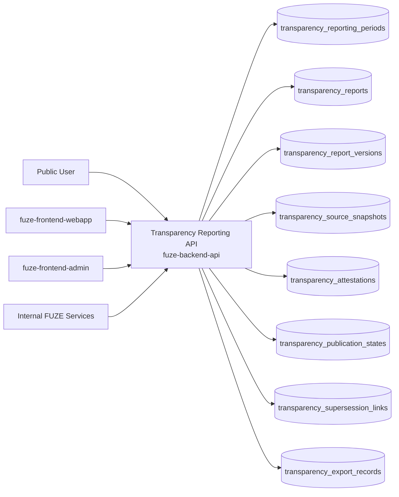
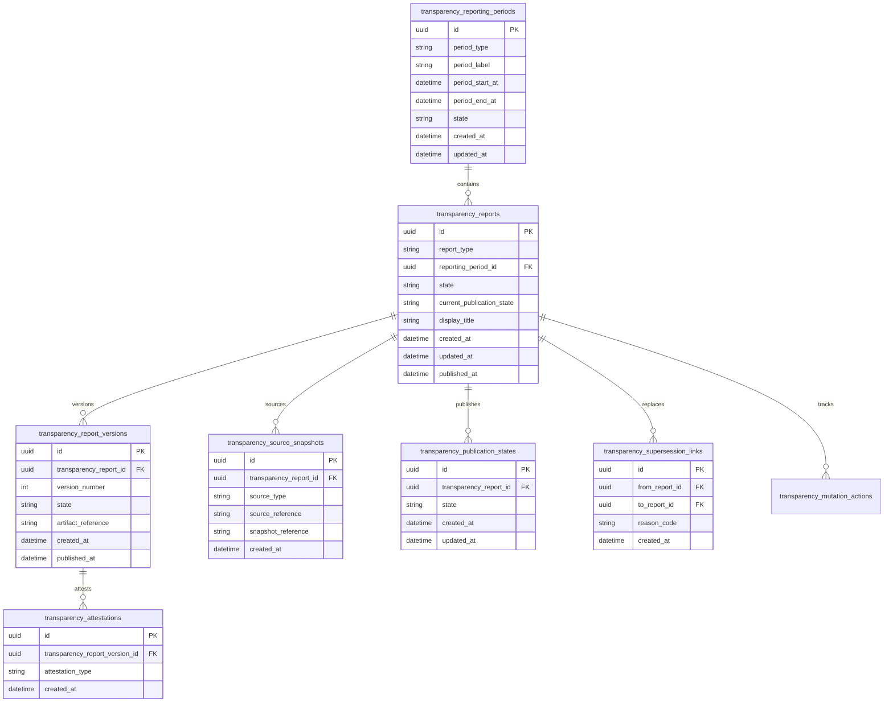
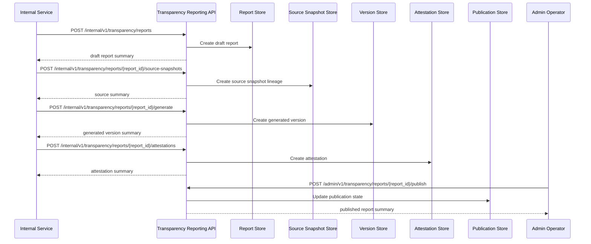

# TRANSPARENCY_REPORTING_API_SPEC

## 1. Title

**TRANSPARENCY_REPORTING_API_SPEC.md**

---

## 2. Document Metadata

- **Document Name:** TRANSPARENCY_REPORTING_API_SPEC.md
- **API Classification:** public, internal, admin, event-driven, chain-adjacent
- **Owning Domain:** Transparency Reporting Domain
- **Primary Implementing Repo:** `fuze-backend-api`
- **Primary System of Record:** transparency report definitions, reporting periods, published report artifacts, source-snapshot lineage, publication state, attestation metadata, and correction/remediation records in `fuze-backend-api`
- **Status:** Draft for canonical source-of-truth approval
- **Purpose:** Define the production-grade API contract architecture for FUZE transparency reporting, reporting-period publication, public trust artifact generation, source-lineage traceability, and controlled correction-safe transparency disclosure across the platform
- **Canonical Folder:** `fuze.ac > docs > api-spec`

---

## 2.1 API Classification Header

- **API Classification:** public | internal | admin | event-driven | chain-adjacent
- **Owning Domain:** Transparency Reporting Domain
- **Primary Implementing Repo:** `fuze-backend-api`
- **Primary System of Record:** transparency reporting and publication-control domain

---

## 3. Purpose

This document defines the canonical API specification for FUZE transparency reporting operations. It translates the governing FUZE platform architecture, transparency model, transparency reporting rules, public contract and wallet registry rules, chain architecture, profit participation and payout reporting rules, treasury control expectations, audit requirements, and API architecture rules into an implementation-ready API contract.

This API exists because FUZE positions transparency as a platform principle rather than a marketing afterthought. Transparency reports are public trust artifacts that summarize approved, policy-bounded views of platform performance, wallet and contract references, payout-related disclosures, and other reportable facts tied to FUZE’s transparency model. These reports must therefore be backend-governed, source-linked, publication-safe, versioned, and correction-safe. They cannot depend on ad hoc spreadsheets, ephemeral operator notes, or informal public posts.

Accordingly, this specification defines how reporting periods and report artifacts are represented, how report source snapshots and attestations are linked, how published transparency reports are exposed publicly, how internal/admin flows generate and publish transparency reports safely, and how transparency reporting remains auditable, idempotent, and architecture-consistent across FUZE.

---

## 4. Scope

This specification covers:

- public list and detail APIs for published transparency reports
- public APIs for reporting-period metadata and report artifact access
- internal service APIs for transparency report generation, source binding, and publication preparation
- admin/control-plane APIs for publish, supersede, correct, retract-if-required, and discrepancy resolution
- source-snapshot and attestation metadata APIs
- event emission requirements for transparency reporting lifecycle changes
- request, response, error, idempotency, versioning, audit, and database-shape rules for this domain

This specification does **not** redefine:

- full treasury policy semantics
- full profit participation and payout execution semantics
- full public wallet registry semantics
- full investor/community reporting semantics
- full accounting-policy text or legal disclaimers
- external document rendering implementation detail
- on-chain proof generation standards for every future reporting class

Those remain governed by their own source-of-truth specifications.

---

## 5. Source-of-Truth Inputs

### Primary FUZE docs and specs used

#### Highest-priority platform and ownership sources
- `SYSTEM_SPEC_INDEX.md`
- `SYSTEM_BOUNDARY_AND_OWNERSHIP_SPEC.md`
- `SYSTEM_OVERVIEW_AND_BOUNDARIES_SPEC.md`
- `PLATFORM_ARCHITECTURE_SPEC.md`
- `DOMAIN_OWNERSHIP_MATRIX_SPEC.md`
- `DATA_MODEL_AND_ENTITY_OWNERSHIP_SPEC.md`
- `ONCHAIN_OFFCHAIN_RESPONSIBILITY_SPEC.md`

#### Primary transparency / reporting / trust sources
- `TRANSPARENCY_REPORTING_SPEC.md`
- `TRANSPARENCY_MODEL_SPEC.md`
- `INVESTOR_AND_COMMUNITY_REPORTING_SPEC.md`
- `PUBLIC_CONTRACT_AND_WALLET_REGISTRY_SPEC.md`
- `PAYOUT_LEDGER_SPEC.md`
- `PROFIT_PARTICIPATION_SYSTEM_SPEC.md`
- `SNAPSHOT_AND_ELIGIBILITY_PIPELINE_SPEC.md`
- `TREASURY_CONTROL_POLICY_SPEC.md`
- `VAULT_ACTION_POLICY_SPEC.md`
- `CHAIN_ARCHITECTURE_SPEC.md`

#### API and runtime sources
- `API_ARCHITECTURE_SPEC.md`
- `PUBLIC_API_SPEC.md`
- `INTERNAL_SERVICE_API_SPEC.md`
- `EVENT_MODEL_AND_WEBHOOK_SPEC.md`
- `IDEMPOTENCY_AND_VERSIONING_SPEC.md`
- `MIGRATION_AND_BACKWARD_COMPATIBILITY_SPEC.md`
- `AUDIT_LOG_AND_ACTIVITY_SPEC.md`

#### Security and operations sources
- `SECURITY_AND_RISK_CONTROL_SPEC.md`
- `MONITORING_ALERTING_AND_INCIDENT_RESPONSE_SPEC.md`
- `SECRETS_CONFIG_AND_ENVIRONMENT_SPEC.md`

#### Core docs inputs
- `DOCS_SPEC.md`
- `FUZE_CHAIN_ARCHITECTURE.md`
- `STABLECOIN_PROFIT_PARTICIPATION.md`
- `FUZE_TOKENOMICS_TABLES.md`
- `ONEPAGE_PAPER.md`
- `FUZE_WHITEPAPER_v.2026.3.0.1.pdf`

#### Format guides
- `The_API_Specification_guide.md`
- `Database_Schemas_Guide.md`

### Highest-priority interpretation applied

For this file, the most important governing interpretation is:

1. transparency reports are public trust artifacts derived from approved source-of-truth data
2. backend owns canonical transparency reporting truth and publication state
3. transparency reports must remain explicitly linked to source snapshots, reporting periods, and publication lineage
4. public reports are distinct from raw internal ledgers, raw audit data, and private operational details
5. admin/control-plane may publish, supersede, correct, or retract under controlled policy but must preserve public trust lineage
6. published transparency outputs must remain separated from investor-private materials, private wallet operations, and non-public internal controls

### Supporting external standards used only as guidance

- HTTP semantics for public document and list APIs plus controlled mutation APIs
- structured problem-details error design
- general public-report versioning, attestation, and correction-lineage patterns as supporting guidance

External guidance does not override FUZE source-of-truth documents.

---

## 6. Governing Architecture and Ownership Interpretation

This API belongs to the **Transparency Reporting Domain** because it owns the public publication layer for transparency reports, reporting periods, source-linked report artifacts, and correction-safe trust disclosures.

This API is implemented primarily in `fuze-backend-api` because:

- backend owns durable transparency reporting and publication truth
- public trust artifacts must be centrally controlled
- reports require explicit linkage to approved source snapshots and reporting periods
- correction, supersession, and attestation handling must be backend-governed
- audit generation and discrepancy handling must be centralized

This API is **not** owned by:

- `fuze-frontend-webapp`, because webapp only reads and displays published reports
- `fuze-frontend-admin`, because admin may publish or correct reports but must not own transparency truth
- `fuze-public-registry`, because that repository or delivery surface stores derived public artifacts while canonical mutable reporting truth is owned by `fuze-backend-api`
- payout, treasury, or public wallet registry domains, because those domains may provide approved source data but do not own transparency report publication semantics
- on-chain contracts, because the reports are off-chain trust artifacts even when they reference on-chain facts

### Architectural implications

- one reporting period may have one or more report artifacts
- one published transparency report must link to explicit source snapshots and approved data provenance
- public report views must remain bounded and safe for public disclosure
- superseded or corrected reports must preserve lineage to prior published versions
- public transparency reporting is a disclosure layer, not itself a financial execution or governance action
- raw operational or sensitive source data must remain private unless explicitly published through bounded report content

---

## 7. Domain Responsibilities

The Transparency Reporting API domain is responsible for:

1. maintaining canonical transparency reporting periods and report artifacts
2. exposing public list and detail views for published transparency reports
3. recording source snapshots, attestation metadata, and publication lineage
4. supporting internal report generation and export-safe publication preparation
5. supporting admin publish, supersede, correct, and retract workflows
6. supporting derived artifact export to public trust surfaces
7. emitting reporting lifecycle events
8. generating audit lineage for sensitive publication and correction actions
9. preserving separation between public reporting truth and raw internal source data
10. supporting safe public lookup of historical and current transparency disclosures

The domain is not responsible for:

- executing payouts, treasury, or vault actions
- mutating source ledgers as the source of truth
- replacing investor-private or internal financial reporting
- exposing private wallet inventories or secret material
- acting as the raw accounting system of record
- proving all on-chain facts directly within the API response format

---

## 8. Out of Scope

The following are out of scope for this API specification:

- private board or investor-only reporting exposure
- raw accounting workbook exposure
- legal opinion workflows
- final PDF/HTML rendering implementation details
- private audit workpapers
- public static-site generation internals outside canonical export lineage
- chain-indexing subsystem internals
- third-party assurance workflow implementation detail

Where later detailed specs are needed, they must remain compatible with this API.

---

## 9. Canonical Entities and Data Ownership

### Durable entities

#### 9.1 transparency_reporting_periods
- **Owner:** Transparency Reporting Domain
- **Purpose:** canonical reporting-period definitions such as quarter, month, or special disclosure period
- **Nature:** source-of-truth durable entity

#### 9.2 transparency_reports
- **Owner:** Transparency Reporting Domain
- **Purpose:** canonical report records for one reporting period and report class
- **Nature:** source-of-truth durable entity

#### 9.3 transparency_report_versions
- **Owner:** Transparency Reporting Domain
- **Purpose:** immutable version lineage for published and unpublished report variants
- **Nature:** source-of-truth durable entity

#### 9.4 transparency_source_snapshots
- **Owner:** Transparency Reporting Domain
- **Purpose:** approved references to source data snapshots used for report generation
- **Nature:** source-of-truth durable lineage entity

#### 9.5 transparency_attestations
- **Owner:** Transparency Reporting Domain
- **Purpose:** attestation, preparation, or verification metadata linked to report versions
- **Nature:** durable attestation lineage entity

#### 9.6 transparency_publication_states
- **Owner:** Transparency Reporting Domain
- **Purpose:** publication lifecycle and visibility state for reports
- **Nature:** source-of-truth durable entity

#### 9.7 transparency_supersession_links
- **Owner:** Transparency Reporting Domain
- **Purpose:** links between superseded, corrected, or retracted report versions
- **Nature:** durable lineage entity

#### 9.8 transparency_export_records
- **Owner:** Transparency Reporting Domain
- **Purpose:** lineage of public artifact generation and export publication pushes
- **Nature:** durable export lineage entity

#### 9.9 transparency_discrepancy_cases
- **Owner:** Transparency Reporting Domain
- **Purpose:** review and remediation records for missing, incorrect, conflicting, or stale transparency reports
- **Nature:** durable review/remediation entity

#### 9.10 transparency_mutation_actions
- **Owner:** Transparency Reporting Domain
- **Purpose:** high-level action records for generate, publish, supersede, correct, retract, export, and resolve discrepancies
- **Nature:** durable action records with audit linkage

#### 9.11 transparency_audit_events
- **Owner:** Audit / Activity domain, sourced by Transparency Reporting Domain
- **Purpose:** immutable trail for sensitive publication and correction actions
- **Nature:** durable audit records

### Derived or cached entities

#### 9.12 transparency_public_views
- **Owner:** derived read-model layer
- **Purpose:** public-safe list and detail representations of published reports
- **Nature:** derived

#### 9.13 transparency_lookup_views
- **Owner:** derived read-model layer
- **Purpose:** optimized reporting-period and report lookup responses
- **Nature:** derived

#### 9.14 transparency_discrepancy_views
- **Owner:** derived ops read-model layer
- **Purpose:** visibility into stale, conflicting, or failed report publication conditions
- **Nature:** derived

---

## 10. State Model and Lifecycle

### 10.1 reporting period lifecycle

Possible states:

- `draft`
- `open`
- `closed`
- `published`
- `archived`

### 10.2 transparency report lifecycle

Possible states:

- `draft`
- `generated`
- `verified_if_required`
- `published`
- `deprecated`
- `superseded`
- `retracted_if_required`

### 10.3 report version lifecycle

Possible states:

- `draft`
- `generated`
- `published`
- `superseded`
- `archived`

### 10.4 publication lifecycle

Possible states:

- `unpublished`
- `published`
- `hidden`
- `retracted`
- `archived`

### 10.5 export lifecycle

Possible states:

- `pending`
- `generated`
- `published`
- `failed`
- `superseded`

Lifecycle notes:
- generated does not imply public visibility
- published reports must remain historically queryable according to policy even after supersession or correction
- corrections and supersession must preserve public lineage rather than erase prior disclosure history
- retraction is exceptional and must preserve trust-oriented explanation metadata

---

## 11. API Surface Overview

The API surface is divided into four families:

### 11.1 Public read APIs
Used by public users, partners, community members, and general readers for:
- listing published transparency reports
- retrieving one report detail
- reading reporting-period metadata
- accessing current and historical published report artifacts

### 11.2 First-party authenticated read APIs
Used by `fuze-frontend-webapp` and approved first-party clients for:
- reading the same public report views
- optionally reading bounded publication metadata if policy allows

### 11.3 Internal service APIs
Used by trusted internal services for:
- creating report drafts
- binding source snapshots
- writing attestation metadata
- generating exports
- reading canonical reporting truth

### 11.4 Admin / control-plane APIs
Used by `fuze-frontend-admin` through backend-only privileged routes for:
- publish, supersede, correct, retract actions
- source-snapshot remediation
- export retry/remediation
- discrepancy resolution

---

## 12. Authentication and Authorization Model

### 12.1 Authentication posture by route family

#### Public read routes
No authentication required:
- list published reports
- published report detail views
- published reporting-period metadata
- public artifact access routes where applicable

#### Internal service routes
Require internal service identity with explicit least privilege:
- create drafts
- attach source snapshots and attestations
- trigger generation and export
- read canonical report and period records

#### Admin routes
Require privileged operator identity plus reason-coded actions:
- publish, supersede, correct, retract reports
- update or remediate source lineage
- resolve discrepancies
- retry exports

### 12.2 Authorization checkpoints

Authorization must evaluate:
- caller identity and route family
- whether target report or period is public-only or privileged internal state
- whether internal service has write privilege for reporting mutations
- whether admin/operator role is present for publication or correction actions
- whether current state allows requested mutation

### 12.3 Sensitive action rules

The following require heightened checks:
- publication of new transparency reports
- correction or retraction of published reports
- supersession of current public reports
- source-snapshot changes for generated reports
- export retry after failure
- discrepancy-resolution actions

---

## 13. API Endpoints / Interface Contracts

## 13.1 Public Read APIs

### 13.1.1 `GET /v1/transparency/reports`
**Purpose:** list published transparency reports  
**Caller Type:** public  
**Auth Expectation:** none  
**Query Parameters Summary:**
- optional `report_type`
- optional `period_type`
- optional `year`
- pagination
**Response Summary:**
- published report summaries
- reporting-period summary
- publication timestamp
- current/deprecated/superseded status
- artifact availability summary
**Side Effects:** none
**Audit Requirements:** access logging optional
**Emitted Events:** none required

### 13.1.2 `GET /v1/transparency/reports/{report_id}`
**Purpose:** retrieve one published transparency report detail  
**Caller Type:** public  
**Response Summary:**
- public detail view
- reporting period metadata
- publication status
- version summary
- supersession/replacement guidance where relevant
- public artifact references
**Side Effects:** none

### 13.1.3 `GET /v1/transparency/periods`
**Purpose:** list reporting periods with published-report availability  
**Caller Type:** public  
**Query Parameters Summary:**
- optional `period_type`
- optional `state`
- pagination
**Response Summary:** reporting-period summaries and report availability metadata
**Side Effects:** none

### 13.1.4 `GET /v1/transparency/periods/{reporting_period_id}`
**Purpose:** retrieve one reporting-period detail with published report references  
**Caller Type:** public  
**Response Summary:** period detail, published report links, and bounded status summaries
**Side Effects:** none

## 13.2 Internal Service APIs

### 13.2.1 `POST /internal/v1/transparency/reports`
**Purpose:** create draft transparency report for a reporting period  
**Caller Type:** internal trusted service  
**Auth Expectation:** service-to-service identity only  
**Request Body Summary:**
- `report_type`
- `reporting_period_id`
- optional `draft_summary`
- optional `publication_target`
- `idempotency_key`
**Response Summary:** draft report summary and current version summary
**Side Effects:** creates report draft and initial version lineage
**Idempotency Behavior:** required
**Audit Requirements:** sensitive reporting-ingest audit
**Emitted Events:** `transparency.report_created`

### 13.2.2 `POST /internal/v1/transparency/reports/{report_id}/source-snapshots`
**Purpose:** attach approved source snapshot lineage to report draft or generated version  
**Caller Type:** internal trusted service  
**Request Body Summary:**
- `source_type`
- `source_reference`
- `snapshot_reference`
- optional `snapshot_summary`
- `idempotency_key`
**Response Summary:** source-snapshot summary and updated report-state summary
**Side Effects:** creates source-snapshot lineage for report
**Idempotency Behavior:** required
**Audit Requirements:** source-lineage audit
**Emitted Events:** `transparency.source_snapshot_attached`

### 13.2.3 `POST /internal/v1/transparency/reports/{report_id}/generate`
**Purpose:** generate report artifact and current version from bound source snapshots  
**Caller Type:** internal trusted service  
**Request Body Summary:**
- optional `generation_profile`
- `idempotency_key`
**Response Summary:** generated report-version summary and artifact summary
**Side Effects:** creates or updates generated version and export-prep lineage
**Idempotency Behavior:** required
**Audit Requirements:** report-generation audit
**Emitted Events:** `transparency.report_generated`

### 13.2.4 `POST /internal/v1/transparency/reports/{report_id}/attestations`
**Purpose:** attach attestation or verification metadata to report version  
**Caller Type:** internal trusted service  
**Request Body Summary:**
- `attestation_type`
- `attestation_summary`
- `idempotency_key`
**Response Summary:** attestation summary
**Side Effects:** creates attestation lineage and may advance verification state
**Idempotency Behavior:** required
**Audit Requirements:** attestation audit
**Emitted Events:** `transparency.report_attested`

### 13.2.5 `POST /internal/v1/transparency/exports`
**Purpose:** generate or push derived public transparency artifact from canonical report truth  
**Caller Type:** internal trusted service  
**Request Body Summary:**
- optional `report_id`
- optional `export_scope`
- optional `target_artifact`
- `idempotency_key`
**Response Summary:** export-record summary
**Side Effects:** creates export lineage and may generate public artifact
**Idempotency Behavior:** required
**Audit Requirements:** export audit where sensitivity requires
**Emitted Events:** `transparency.export_generated`, `transparency.export_failed`

### 13.2.6 `GET /internal/v1/transparency/reports/{report_id}`
**Purpose:** retrieve canonical transparency-report truth for trusted services  
**Caller Type:** internal trusted service  
**Response Summary:** full report, versions, source snapshots, attestations, publication, supersession, and export lineage
**Side Effects:** none

## 13.3 Admin / Control-Plane APIs

### 13.3.1 `POST /admin/v1/transparency/reports/{report_id}/publish`
**Purpose:** publish generated/verified transparency report to public read surfaces  
**Caller Type:** admin/operator  
**Request Body Summary:**
- `reason_code`
- `operator_note`
- `idempotency_key`
**Response Summary:** published report summary
**Side Effects:** publication state moves to published, report becomes visible on public routes
**Audit Requirements:** critical audit
**Emitted Events:** `transparency.report_published`

### 13.3.2 `POST /admin/v1/transparency/reports/{report_id}/supersede`
**Purpose:** supersede one published report with a corrected or newer report version  
**Caller Type:** admin/operator  
**Request Body Summary:**
- `replacement_report_id`
- `reason_code`
- `operator_note`
- `idempotency_key`
**Response Summary:** supersession summary
**Side Effects:** creates supersession linkage and updates public current/preferred state
**Audit Requirements:** critical audit
**Emitted Events:** `transparency.report_superseded`

### 13.3.3 `POST /admin/v1/transparency/reports/{report_id}/correct`
**Purpose:** apply correction-safe metadata or bounded public correction note to one report  
**Caller Type:** admin/operator  
**Request Body Summary:**
- `correction_type`
- `correction_summary`
- `reason_code`
- `operator_note`
- `idempotency_key`
**Response Summary:** corrected report summary
**Side Effects:** may create new version or attach bounded correction lineage according to policy
**Audit Requirements:** critical audit
**Emitted Events:** `transparency.report_corrected`

### 13.3.4 `POST /admin/v1/transparency/reports/{report_id}/retract`
**Purpose:** retract a published report under exceptional controlled policy  
**Caller Type:** admin/operator  
**Request Body Summary:**
- `reason_code`
- `public_explanation_summary`
- `operator_note`
- `idempotency_key`
**Response Summary:** retracted report summary
**Side Effects:** publication state moves to retracted/hidden according to policy with preserved lineage
**Audit Requirements:** critical audit
**Emitted Events:** `transparency.report_retracted`

### 13.3.5 `POST /admin/v1/transparency/discrepancies`
**Purpose:** resolve transparency reporting discrepancy under controlled policy  
**Caller Type:** admin/operator  
**Request Body Summary:**
- `target_reference_type`
- `target_reference_id`
- `resolution_code`
- `operator_note`
- `related_case_id`
- `idempotency_key`
**Response Summary:** discrepancy-resolution summary
**Side Effects:** may publish, supersede, correct, retract, or retry export with preserved lineage
**Audit Requirements:** critical audit
**Emitted Events:** `transparency.discrepancy_resolved`

---

## 14. Request Rules

### 14.1 General request rules
- all mutation-capable routes must require JSON requests with explicit content type
- all mutation routes must carry correlation IDs
- sensitive reporting mutations must carry idempotency keys
- admin mutations must require reason codes and operator notes
- no route may accept frontend-authored transparency truth as authoritative input

### 14.2 Sensitive-action request requirements
The following requests require heightened validation:
- report generation for public publication
- source-snapshot binding changes after generation
- publication, correction, supersession, or retraction
- export generation and retry
- discrepancy-resolution actions

Heightened validation may include:
- reporting-period integrity checks
- source-snapshot completeness checks
- publication-state checks
- operator role confirmation
- governance/finance/security case linkage for sensitive reports

### 14.3 Scope integrity rule
Transparency-report mutations must target valid and authorized reports, periods, and source references. Services and operators must not mutate unrelated or unauthorized reporting state.

### 14.4 Public-private separation rule
Only explicitly published public-safe metadata and artifacts may appear on public routes. Internal preparation notes, operator notes, private source details, or raw sensitive ledgers must remain out of public responses.

---

## 15. Response Rules

### 15.1 Success response rules
Successful responses must include:
- stable resource identifiers
- timestamps for created/updated state
- state/status values
- reporting-period summaries
- publication/version summaries where relevant
- correlation references for mutations

### 15.2 Async-accepted response rules
If generation, export, or discrepancy remediation is async, the response must:
- return accepted status
- include action or job ID
- provide follow-up status semantics

### 15.3 Terminal mutation response rules
Terminal mutation responses must clearly show:
- target report, version, period, or export
- mutation type
- resulting report/publication state
- correction, supersession, or retraction effects where relevant
- whether public views may refresh asynchronously

### 15.4 Read response rules
Read responses must distinguish:
- canonical report truth on internal routes
- public-safe report views on public routes
- publication status
- supersession/correction guidance where relevant

---

## 16. Error Model

The API uses structured problem-details style error responses.

### 16.1 Required error fields
- `type`
- `title`
- `status`
- `code`
- `detail`
- `instance`
- `correlation_id`

### 16.2 Common error codes

#### Authorization / permission errors
- `TRANSPARENCY_PERMISSION_DENIED`
- `TRANSPARENCY_OPERATOR_PERMISSION_DENIED`
- `TRANSPARENCY_SERVICE_PERMISSION_DENIED`

#### State conflict errors
- `TRANSPARENCY_REPORT_STATE_INVALID`
- `TRANSPARENCY_REPORT_ALREADY_PUBLISHED`
- `TRANSPARENCY_REPORT_ALREADY_RETRACTED`
- `TRANSPARENCY_SUPERSESSION_CONFLICT`
- `TRANSPARENCY_EXPORT_CONFLICT`

#### Policy / safety errors
- `TRANSPARENCY_SOURCE_SNAPSHOT_REQUIRED`
- `TRANSPARENCY_VERIFICATION_REQUIRED`
- `TRANSPARENCY_PUBLICATION_FORBIDDEN`
- `TRANSPARENCY_CORRECTION_NOT_ALLOWED`
- `TRANSPARENCY_PRIVATE_METADATA_FORBIDDEN`

#### Request integrity errors
- `TRANSPARENCY_IDEMPOTENCY_KEY_REQUIRED`
- `TRANSPARENCY_REQUEST_INVALID`
- `TRANSPARENCY_REQUEST_UNPROCESSABLE`

#### Dependency or provider errors
- `TRANSPARENCY_EXPORT_UNAVAILABLE`
- `TRANSPARENCY_STORAGE_UNAVAILABLE`
- `TRANSPARENCY_GENERATION_UNAVAILABLE`

### 16.3 Error handling rules
- do not expose hidden internal finance/security or private source detail in public responses
- do not imply payout or treasury execution from report publication
- distinguish unpublished/no-match from forbidden/internal visibility
- distinguish source-snapshot-required from generic invalid state
- include retry guidance only where safe

---

## 17. Idempotency and Mutation Safety

### 17.1 Required idempotent mutations
The following mutation routes require idempotent behavior:
- report creation
- source-snapshot attachment
- report generation
- attestation creation
- export generation
- publish
- supersede
- correct
- retract
- discrepancy resolution

### 17.2 Idempotency key rules
- mutation requests must supply `Idempotency-Key`
- backend stores key scope, request hash, actor, and terminal result
- replay of same semantic request returns original terminal outcome
- replay of same key with different semantic request must fail with conflict

### 17.3 Mutation safety rules
- one current public report per report type and reporting period under current-publication policy unless explicit supersession lineage exists
- publication must not occur before required source lineage and verification state
- corrections and supersession must preserve old-to-new lineage
- retraction must preserve trust-oriented historical trace
- exports must derive from canonical reporting truth, not bypass it

---

## 18. Versioning and Compatibility Rules

### 18.1 Versioning
This API family is versioned under `/v1`, `/internal/v1`, and `/admin/v1` route families.

### 18.2 Compatibility approach
- additive evolution preferred
- no silent semantic change to published, superseded, corrected, or retracted states
- new report types, period types, and artifact references may be added without breaking existing contracts
- response fields may be added but existing meanings must remain stable

### 18.3 Breaking-change rules
Breaking changes include:
- changing the meaning of published/superseded/retracted states
- changing public report-version semantics incompatibly
- removing critical period or replacement fields
- changing historical lookup semantics incompatibly

Such changes require explicit migration planning and version evolution.

### 18.4 Deprecation
Deprecated routes or fields must:
- be documented explicitly
- carry deprecation metadata where supported
- preserve compatibility windows long enough for public and first-party consumers

---

## 19. Event Emission and Webhook Behavior

This domain is event-capable.

### 19.1 Internal events
The Transparency Reporting domain must emit canonical internal events such as:
- `transparency.report_created`
- `transparency.source_snapshot_attached`
- `transparency.report_generated`
- `transparency.report_attested`
- `transparency.report_published`
- `transparency.report_superseded`
- `transparency.report_corrected`
- `transparency.report_retracted`
- `transparency.export_generated`
- `transparency.export_failed`
- `transparency.discrepancy_resolved`

### 19.2 Event payload minimums
Each event should contain:
- event ID
- event type
- occurred_at
- report ID
- report type
- reporting period summary
- version reference where relevant
- actor type
- correlation ID
- reason code where applicable

### 19.3 External webhook posture
This specification does not expose general third-party outbound transparency-report webhooks by default. Any future outbound transparency-report webhook surface must be narrow, security-reviewed, and governed by a separate contract.

---

## 20. Audit and Activity Requirements

The following actions must generate durable audit events:

- report creation and generation
- source-snapshot attachment for published or publishable reports
- attestation creation
- publication
- correction, supersession, or retraction
- export generation or failure where sensitivity requires
- discrepancy resolution
- other sensitive transparency-domain mutations

### Required audit fields
- audit event ID
- actor type and actor reference
- target report / version / export / discrepancy reference as applicable
- action type
- before/after transparency summary where applicable
- reason code
- correlation ID
- operator note if operator action
- occurred_at

Public-facing activity may show selected publication events, but canonical internal audit truth remains durable and immutable.

---

## 21. Data Model and Database Schema View

### 21.1 `transparency_reporting_periods`
- `id` PK
- `period_type`
- `period_label`
- `period_start_at`
- `period_end_at`
- `state`
- `created_at`
- `updated_at`
- `published_at` nullable

**Constraints:**
- unique (`period_type`, `period_start_at`, `period_end_at`)
- index on `state`

### 21.2 `transparency_reports`
- `id` PK
- `report_type`
- `reporting_period_id` FK -> `transparency_reporting_periods.id`
- `state`
- `current_publication_state`
- `display_title`
- `public_summary_json`
- `created_at`
- `updated_at`
- `published_at` nullable
- `retracted_at` nullable

**Constraints:**
- index on (`report_type`, `state`)
- index on (`reporting_period_id`, `current_publication_state`)

### 21.3 `transparency_report_versions`
- `id` PK
- `transparency_report_id` FK -> `transparency_reports.id`
- `version_number`
- `state`
- `artifact_reference`
- `created_at`
- `published_at` nullable
- `superseded_at` nullable

**Constraints:**
- unique (`transparency_report_id`, `version_number`)
- index on `state`

### 21.4 `transparency_source_snapshots`
- `id` PK
- `transparency_report_id` FK -> `transparency_reports.id`
- `source_type`
- `source_reference`
- `snapshot_reference`
- `snapshot_summary_json`
- `created_at`

**Constraints:**
- index on `transparency_report_id`
- index on (`source_type`, `source_reference`)

### 21.5 `transparency_attestations`
- `id` PK
- `transparency_report_version_id` FK -> `transparency_report_versions.id`
- `attestation_type`
- `attestation_summary_json`
- `created_at`

**Constraints:**
- index on `transparency_report_version_id`

### 21.6 `transparency_publication_states`
- `id` PK
- `transparency_report_id` FK -> `transparency_reports.id`
- `state`
- `reason_code` nullable
- `created_at`
- `updated_at`

**Constraints:**
- index on `transparency_report_id`
- index on `state`

### 21.7 `transparency_supersession_links`
- `id` PK
- `from_report_id` FK -> `transparency_reports.id`
- `to_report_id` FK -> `transparency_reports.id`
- `reason_code`
- `created_at`

**Constraints:**
- unique (`from_report_id`, `to_report_id`)
- index on `from_report_id`
- index on `to_report_id`

### 21.8 `transparency_export_records`
- `id` PK
- `report_id` nullable FK -> `transparency_reports.id`
- `export_scope`
- `target_artifact`
- `state`
- `source_snapshot_reference`
- `created_at`
- `completed_at` nullable
- `failed_at` nullable

### 21.9 `transparency_discrepancy_cases`
- `id` PK
- `target_reference_type`
- `target_reference_id`
- `state`
- `resolution_code` nullable
- `created_at`
- `updated_at`
- `closed_at` nullable

### 21.10 `transparency_mutation_actions`
- `id` PK
- `target_reference_type`
- `target_reference_id`
- `action_type`
- `state`
- `reason_code`
- `operator_note` nullable
- `requested_by_actor_type`
- `requested_by_actor_id`
- `created_at`
- `executed_at` nullable
- `closed_at` nullable
- `correlation_id`

### 21.11 `idempotency_records`
- `id` PK
- `idempotency_key`
- `scope_family`
- `actor_reference`
- `request_hash`
- `response_hash`
- `terminal_status`
- `created_at`
- `expires_at`

### 21.12 `audit_log_entries`
Domain-sourced audit records written into the audit domain.

### Normalization notes
- canonical reporting truth stays in reporting periods, reports, versions, source snapshots, attestations, publication states, and supersession links
- public list/detail routes must derive from canonical current published state
- private preparation notes or raw source data must remain outside public response shapes
- public artifact exports remain derived from canonical transparency-report truth

### Reconciliation notes
- one current public report should reconcile to one current reporting period and report type under current-publication policy
- corrected or superseded reports must preserve replacement lineage
- export records must reconcile to canonical report/version snapshots
- missing or conflicting source-snapshot conditions must be explicitly reviewable

---

## 22. Architecture Diagram — Mermaid flowchart



---

## 23. Data Design — Mermaid Diagram



---

## 24. Flow View

### 24.1 Happy path — generate and publish report
1. internal service creates draft transparency report for a reporting period
2. approved source snapshots are attached
3. report artifact is generated and versioned
4. attestation metadata is attached if required
5. admin publishes the report
6. report becomes visible on public list/detail/period routes
7. audit and transparency events are emitted

### 24.2 Happy path — public historical lookup
1. public actor lists reports or periods
2. backend returns current and historical published report summaries
3. public actor opens one published report detail
4. public-safe artifact references and bounded metadata are returned
5. if superseded, replacement guidance is included

### 24.3 Alternate path — correct and supersede
1. published report later requires correction
2. corrected report version or replacement report is generated
3. admin supersedes older public report
4. older report remains historically visible with supersession guidance
5. new report becomes current public reference

### 24.4 Failure path — missing source lineage
1. generate or publish action is attempted
2. backend detects missing or insufficient source-snapshot or attestation state
3. request is rejected
4. no public visibility change occurs

### 24.5 Failure and remediation path — discrepancy or failed export
1. report or export fails, becomes stale, or conflicts with expected reporting state
2. admin opens discrepancy resolution
3. backend preserves existing lineage
4. report may be corrected, superseded, retracted, or export retried
5. discrepancy closes with preserved history

### 24.6 Retraction path
1. published report requires exceptional retraction
2. admin applies retraction with public explanation summary
3. public state moves to retracted/hidden according to policy
4. historical lineage remains queryable internally and public trust messaging remains explicit

### 24.7 Retry behavior
- duplicate report creation returns same draft report result
- duplicate source-snapshot attach returns same lineage result where applicable
- duplicate generate/publish/supersede/correct returns same terminal action result
- duplicate export/discrepancy actions return same terminal action result

---

## 25. Data Flows — Mermaid sequenceDiagram



---

## 26. Security and Risk Controls

1. **Transparency-report truth is backend-owned**  
   Frontends and informal surfaces may not authoritatively define public transparency-report truth.

2. **Public reports are distinct from raw internal data**  
   The API must keep published reports separate from private ledgers, private notes, and raw source data.

3. **Source-lineage-before-publication**  
   Publication must require explicit source-snapshot lineage and required verification state according to policy.

4. **Least privilege**  
   Internal write and admin publication routes must be limited to authorized services and operators.

5. **Immutable lineage for public trust changes**  
   Corrections, supersession, and retraction must preserve historical lineage rather than erase prior disclosures.

6. **Public-private field separation**  
   Public routes must never expose internal preparation notes, raw sensitive source data, or operator/security details.

7. **Problem-details discipline**  
   Error bodies must be structured and safe, without exposing hidden internal-only details.

8. **Audit immutability**  
   Sensitive reporting actions require durable immutable audit lineage.

9. **Replay resistance**  
   Report creation, source binding, generation, publication, correction, and export actions must be idempotent and replay-safe.

10. **Public trust messaging control**  
    Superseded or retracted reports must guide readers clearly without silently disappearing when historical visibility is still required.

---

## 27. Operational Considerations

- public report list/detail routes should be highly available and cache-friendly
- publication and correction flows are correctness-sensitive and must preserve trust integrity
- export generation and public artifact sync should be observable and retryable
- missing-source-lineage and conflicting-period anomalies should surface clearly to ops views
- monitoring should alert on:
  - failed report generation attempts
  - publication failures
  - export generation failures
  - unusual supersession or retraction volume
  - public lookup failures
  - canonical report vs export drift

---

## 28. Acceptance Criteria

1. The API preserves the distinction between transparency reporting truth and raw internal source data.
2. Only `fuze-backend-api` owns canonical transparency reporting and publication truth.
3. Reporting periods, reports, versions, source snapshots, attestations, and publication state are durable and backend-owned.
4. Public routes expose only published public-safe report metadata and artifacts.
5. Source lineage and required verification are enforced before publication.
6. Correction, supersession, and retraction preserve immutable lineage.
7. Publication, correction, and export actions are idempotent and auditable.
8. Internal and admin transparency routes are least-privilege and backend-only.
9. Admin routes require reason-coded privileged authorization.
10. Event emissions exist for major transparency-report mutations.
11. Response and error semantics are stable and machine-readable.
12. Database schema separates periods, reports, versions, source snapshots, attestations, publication states, and supersession layers.
13. Public consumers can rely on canonical published report routes without needing hidden internal context.
14. Discrepancy handling is supported and safely replayable.
15. Mermaid diagrams remain consistent with prose and data model.

---

## 29. Test Cases

### 29.1 Positive cases
1. Internal service creates draft transparency report successfully.
2. Internal service attaches source snapshot successfully.
3. Internal service generates report version successfully.
4. Internal service attaches attestation successfully.
5. Admin publishes verified/generated report successfully.
6. Public actor lists published reports successfully.
7. Public actor reads published report detail successfully.
8. Admin supersedes old report successfully.

### 29.2 Negative cases
9. Public user cannot access internal draft report detail.
10. Internal service without write privilege cannot create report.
11. Publish without required source lineage returns `TRANSPARENCY_SOURCE_SNAPSHOT_REQUIRED`.
12. Publish without required verification returns `TRANSPARENCY_VERIFICATION_REQUIRED`.
13. Attempt to supersede with invalid replacement state returns state conflict.
14. Public lookup for unpublished report returns no-match or unpublished-safe result.

### 29.3 Authorization cases
15. Ordinary public user cannot call admin publish/correct/retract routes.
16. Internal service without export privilege cannot trigger export.
17. Operator without publication privilege cannot publish report.
18. Report publication does not authorize payout, treasury, or governance execution.

### 29.4 Idempotency and replay cases
19. Repeating report creation with same idempotency key returns original draft report result.
20. Repeating source-snapshot attachment with same idempotency key returns original source-lineage result.
21. Repeating publish with same idempotency key returns original publish result.
22. Repeating export or discrepancy resolution with same idempotency key returns original action result.

### 29.5 Concurrency cases
23. Concurrent publish and supersede actions preserve one explicit current public lineage.
24. Concurrent duplicate draft creation attempts on same report type and period produce one canonical current draft lineage and one duplicate-safe outcome where policy requires uniqueness.
25. Concurrent correct and retract actions preserve explicit lineage without hidden overwrite.

### 29.6 Recovery / admin cases
26. Superseded report remains historically queryable with replacement guidance.
27. Export failure can be retried under controlled policy with explicit export lineage.
28. Discrepancy resolution closes source-lineage or publication conflict with preserved audit history.

### 29.7 Event and audit cases
29. Successful report creation emits `transparency.report_created`.
30. Successful source-snapshot attach emits `transparency.source_snapshot_attached`.
31. Successful publication emits `transparency.report_published`.
32. Successful supersession emits `transparency.report_superseded`.
33. Successful discrepancy resolution emits `transparency.discrepancy_resolved` with critical audit lineage.

---

## 30. Open Questions or Explicit Deferred Decisions

1. Exact report-type taxonomy for all future transparency disclosures is deferred.
2. Exact attestation requirements by report class are deferred.
3. Exact public export format and sync cadence to derived public surfaces are deferred.
4. Exact historical visibility policy for retracted reports is deferred.
5. Exact public-safe field set for every report type is deferred.
6. Exact discrepancy taxonomy for transparency-report conflicts is deferred.

---

## 31. Implementation Notes for `fuze-backend-api`

Recommended backend module layout:

```text
modules/platform/
  transparency-reporting/
  public-registry/
  audit-log/
  control-plane/
  integrations/
```

Implementation guidance:
- keep reporting-period identity, report/version lineage, source snapshot binding, attestation, publication, and supersession lineage in one canonical domain service
- perform report-period integrity and source-lineage completeness checks inside the commit boundary
- keep publication, correction, supersession, and retraction actions explicit and idempotent
- treat admin remediations as domain actions, not ad hoc row edits
- emit events only after canonical state commit succeeds
- publish public report views from canonical truth; do not let derived exports mutate canonical reporting state

---

## 32. Frontend Consumption Notes

### For `fuze-frontend-webapp`
- may read public report lists, detail pages, and period pages
- must not infer unpublished or draft transparency truth from frontend configuration alone
- must treat backend public transparency responses as authoritative
- should clearly distinguish current, superseded, corrected, and retracted reports when publicly visible

### For `fuze-frontend-admin`
- may trigger privileged publish, supersede, correct, retract, export-retry, and discrepancy actions only through backend admin APIs
- must require operator reason input for sensitive mutations
- must not directly mutate canonical transparency-report truth client-side
- should present immutable publication lineage and correction history separately from current public view

---

## 33. Contract Derivation Notes

### OpenAPI / AsyncAPI
This spec should later derive into:
- public list, detail, and reporting-period operations
- internal report creation, source binding, generation, attestation, and export operations
- admin publish / supersede / correct / retract / discrepancy operations
- shared problem-details schema
- transparency-report lifecycle events in AsyncAPI

### Future `fuze-sdk`
Future `fuze-sdk` packages may derive:
- public transparency-report lookup helpers
- typed report, period, and status models
- public supersession/correction guidance helpers
- problem-error models for transparency-report outcomes

The SDK must derive from approved API contracts and must not become the source of truth over this narrative specification.
