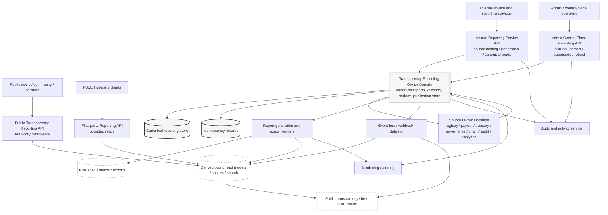
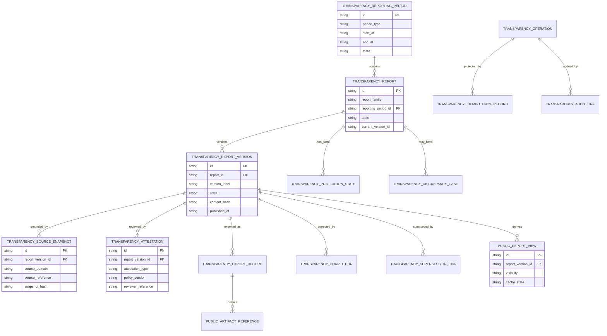
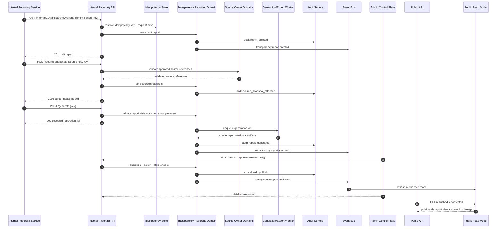

# FUZE Transparency Reporting API Specification

## Document Metadata

- **Document Name:** `TRANSPARENCY_REPORTING_API_SPEC.md`
- **Document Type:** API SPEC v2 / Production-grade interface-contract specification
- **Status:** Draft refined API specification pending canonical approval
- **Version:** 2.0.0
- **Effective Date:** 2026-04-25
- **Last Updated:** 2026-04-25
- **Reviewed On:** 2026-04-25
- **Document Owner:** FUZE Transparency Reporting API Domain; named individual owner not explicitly specified in retrieved governing materials
- **Approval Authority:** FUZE canonical specification approval workflow; exact named approver not explicitly specified in retrieved governing materials
- **Review Cadence:** Quarterly and whenever transparency posture, publication controls, reporting cadence, public API posture, payout/registry/governance reporting obligations, source-lineage requirements, or public-trust disclosure policy materially changes
- **Governing Layer:** API contract layer for recurring transparency reporting, transparency report publication, reporting source-lineage, and public-safe report exposure
- **Parent Registry:** FUZE API SPEC v2 Canonical File Registry
- **Upstream Semantic Registry:** `REFINED_SYSTEM_SPEC_INDEX.md`
- **Upstream API Registry:** `API_SPEC_INDEX.md`
- **Primary Audience:** Platform architecture, backend/API engineering, public API authors, admin/control-plane authors, reporting authors, public-trust surface authors, treasury/governance stakeholders, audit/compliance, security, runtime operations, OpenAPI/AsyncAPI/SDK authors, implementation-contract authors
- **Primary Purpose:** Define the production-grade API contract for transparency report families, reporting periods, source-linked report generation, publication, correction, supersession, retraction-if-required, public-safe reads, exports, and lifecycle events without allowing the reporting API to redefine source-domain truth.
- **Primary Upstream References:** `REFINED_SYSTEM_SPEC_INDEX.md`; `DOCS_SPEC_INDEX.md`; `SYSTEM_SPEC_INDEX.md`; `API_SPEC_INDEX.md`; `TRANSPARENCY_REPORTING_SPEC.md`; `TRANSPARENCY_MODEL_SPEC.md`; `PUBLIC_CONTRACT_AND_WALLET_REGISTRY_SPEC.md`; `PUBLIC_API_SPEC.md`; `API_ARCHITECTURE_SPEC.md`; `INTERNAL_SERVICE_API_SPEC.md`; `EVENT_MODEL_AND_WEBHOOK_SPEC.md`; `IDEMPOTENCY_AND_VERSIONING_SPEC.md`; `MIGRATION_AND_BACKWARD_COMPATIBILITY_SPEC.md`; `AUDIT_LOG_AND_ACTIVITY_SPEC.md`; `AUDIT_AND_ACCESS_TRACEABILITY_SPEC.md`; `SECURITY_AND_RISK_CONTROL_SPEC.md`; `MONITORING_ALERTING_AND_INCIDENT_RESPONSE_SPEC.md`; `DATA_CLASSIFICATION_AND_HANDLING_SPEC.md`; `DATA_RETENTION_DELETION_AND_ARCHIVAL_SPEC.md`; `PAYOUT_LEDGER_SPEC.md`; `PROFIT_PARTICIPATION_SYSTEM_SPEC.md`; `SNAPSHOT_AND_ELIGIBILITY_PIPELINE_SPEC.md`; `TREASURY_CONTROL_POLICY_SPEC.md`; `VAULT_ACTION_POLICY_SPEC.md`; `MULTISIG_AND_TIMELOCK_SPEC.md`; `GOVERNANCE_MODEL_SPEC.md`; `FOUNDATION_GOVERNANCE_SPEC.md`; `CHAIN_ARCHITECTURE_SPEC.md`; `FUZE_ACCOUNT_ACCESS_AND_SESSION_THESIS_FINAL_SPEC.md`; `FUZE_ACCOUNT_ACCESS_AND_SESSION_CANONICAL_FINAL_SPEC.md`; `FUZE_WORKSPACE_ACCESS_CONTROL_BASICS_THESIS_FINAL_SPEC.md`
- **Primary Downstream Dependents:** `PUBLIC_TRANSPARENCY_API_SPEC.md`; `INVESTOR_AND_COMMUNITY_REPORTING_API_SPEC.md`; `PUBLIC_METADATA_API_SPEC.md`; `PUBLIC_PAYOUT_STATUS_API_SPEC.md`; `PUBLIC_REGISTRY_LOOKUP_API_SPEC.md`; public transparency sites; transparency export/publication pipelines; report-generation workers; attestation services; discrepancy/correction runbooks; OpenAPI/AsyncAPI/SDK artifacts; admin/control-plane implementation contracts
- **API Surface Families Covered:** Public read, first-party read, internal service, admin/control-plane, event, webhook-if-approved, reporting/export, chain-adjacent reference surfaces
- **API Surface Families Excluded:** Raw accounting APIs, raw audit-log APIs, raw chain-indexer APIs, private investor-data APIs, static rendering internals, treasury execution APIs, payout execution APIs, registry mutation APIs, governance approval APIs
- **Canonical System Owner(s):** FUZE Transparency Reporting Domain owns transparency report-family semantics, reporting cadence posture, publication-state governance, source-lineage grounding, correction/supersession discipline, and public trust-safe recurring reporting behavior. Source domains retain canonical ownership of underlying registry, payout, treasury, governance, chain, audit, analytics, and accounting truth.
- **Canonical API Owner:** FUZE Transparency Reporting API Domain
- **Supersedes:** API SPEC v1 `TRANSPARENCY_REPORTING_API_SPEC.md` where it is incomplete, weaker, route-dump-oriented, or inconsistent with refined system semantics
- **Superseded By:** None currently defined
- **Related Decision Records:** Not explicitly specified in retrieved governing materials
- **Canonical Status Note:** This API spec is a v2 interface-contract expression of refined transparency-reporting semantics. It does not replace `TRANSPARENCY_REPORTING_SPEC.md`, which remains semantic source truth.
- **Implementation Status:** Normative API-contract draft for downstream implementation planning and contract generation
- **Approval Status:** Pending explicit approval workflow
- **Change Summary:** Upgrades the v1 transparency reporting API into a v2 production-grade contract with explicit truth classes, API surface families, lifecycle state, source-lineage and correction-lineage requirements, idempotency, replay, public/private separation, admin bounds, event/export behavior, diagrams, acceptance criteria, test cases, and downstream guardrails.

## Purpose

This specification defines the FUZE Transparency Reporting API contract. It governs how FUZE exposes, mutates, publishes, corrects, supersedes, retracts-if-required, exports, and audits transparency reports through public, first-party, internal, admin/control-plane, reporting/export, and event-oriented API surfaces.

Transparency reports are public-trust artifacts. They explain trust-relevant structures, cycles, periods, and changes across FUZE, including registry-linked structural updates, payout-related public summaries, governance/control disclosures, treasury/reserve summaries, token/credits context where approved, and other report families defined by the Transparency Reporting domain. They are not raw source-domain truth. They are derived, source-linked, public-safe report artifacts governed by canonical reporting semantics.

This API exists to make report production and exposure implementation-safe: source-linked, idempotent, auditable, correction-safe, public/private separated, versioned, and compatible with downstream public surfaces and contract artifacts.

## Scope

This API specification governs:

- public read APIs for published transparency reports, reporting periods, report versions, public artifacts, and public-safe correction/supersession guidance;
- first-party application APIs for bounded report consumption by FUZE-owned clients;
- internal service APIs for creating report drafts, binding source snapshots, generating report versions, attaching attestations, preparing exports, and reading canonical report records;
- admin/control-plane APIs for publish, correct, supersede, retract-if-required, restrict, unrestrict, retry export, and resolve discrepancy actions;
- event and webhook posture for report lifecycle changes and approved downstream notifications;
- request, response, error, status, idempotency, audit, observability, versioning, and migration rules for the transparency reporting API domain;
- read-model, projection, public artifact, cache, and export rules for derived transparency-reporting surfaces.

## Out of Scope

This API specification does not govern:

- source-domain semantics for treasury, governance, payout, registry, chain, accounting, audit, analytics, billing, credits, or investor/private-reporting truth;
- raw accounting workbook exposure or legal-review workflow details;
- exact PDF/HTML/static-site rendering internals;
- exact database schema details beyond API-supporting entity families;
- exact chain-indexer internals or smart-contract ABI details;
- private board or investor-only reporting exposure;
- final legal disclaimer wording;
- runtime incident runbooks except where API behavior, audit, status, or degraded-mode response is required.

## Design Goals

1. Preserve refined transparency-reporting semantics at the API boundary.
2. Keep reports source-linked, correction-safe, historically intelligible, and public-safe.
3. Distinguish public-safe reads from canonical internal reporting records.
4. Separate report publication from source-domain truth, source-domain mutation, and public-site rendering.
5. Require idempotent and replay-safe mutations for generation, source binding, publication, correction, supersession, retraction, export, and discrepancy resolution.
6. Make admin/control actions reason-coded, policy-constrained, auditable, and separate from ordinary application APIs.
7. Support OpenAPI, AsyncAPI, SDK, event catalog, worker, and implementation-contract derivation without allowing derived artifacts to reinterpret domain semantics.
8. Ensure public read models remain derived from canonical reporting truth and never become hidden mutation owners.

## Non-Goals

- Do not create a generic public reporting framework for all FUZE information.
- Do not expose raw internal finance, security, audit, operational, workspace, user, or private source material.
- Do not allow static pages, spreadsheets, dashboards, exports, public sites, or frontends to mint canonical report truth.
- Do not collapse registry truth, payout truth, governance truth, treasury truth, chain truth, audit truth, analytics truth, and reporting truth into one ambiguous API.
- Do not make public report availability equivalent to final source-domain settlement, execution, approval, or chain finality.

## Core Principles

### 1. Semantic Source Separation
`TRANSPARENCY_REPORTING_SPEC.md` owns transparency-reporting meaning. This API owns interface expression of that meaning. Source-domain specifications own the underlying facts summarized or linked by reports.

### 2. Report-Is-Derived-Public-Artifact
A transparency report is a governed public explanation artifact. It does not replace registry, payout, treasury, governance, chain, audit, accounting, or analytics truth.

### 3. Source-Lineage Requirement
Material report versions MUST be backed by approved source references, source snapshots, attestation metadata where required, and validation lineage sufficient for audit and correction.

### 4. Public-Safe Exposure
Public APIs MUST expose only approved public-safe report content, publication metadata, public artifacts, correction/supersession guidance, and bounded source references.

### 5. Correction Visibility
Material corrections, supersessions, restrictions, and retractions MUST preserve lineage. Silent overwrite of public-trust artifacts is forbidden.

### 6. Owner-Domain Mutation Boundary
Canonical reporting mutations terminate in the Transparency Reporting domain. Source-domain mutations terminate in their respective owner domains.

### 7. Accepted-State Discipline
Generation, export, discrepancy remediation, and other deferred work MUST distinguish accepted async intent from final report generation, publication, or export outcome.

### 8. Derived-Read Discipline
Public views, reports lists, static exports, public sites, search indexes, feeds, and caches MAY present reporting truth but MUST NOT become canonical write owners.

## Canonical Definitions

- **Transparency Report:** A public-trust artifact generated, reviewed, published, corrected, superseded, restricted, or archived under FUZE transparency-reporting rules.
- **Report Family:** A governed category of transparency report with defined structural focus and cadence posture.
- **Reporting Period:** A bounded calendar or reporting window for periodic report families.
- **Reporting Cycle:** A bounded domain-specific execution or publication window, such as a payout cycle or registry-change cycle.
- **Event-Driven Report:** A report or notice published because a structural or trust-sensitive event occurred.
- **Report Version:** An immutable durable version of a report artifact or report body.
- **Publication State:** A report's current visibility and public-meaning state.
- **Source Snapshot:** A durable reference to approved source data, source-domain artifact, or validated snapshot used to generate a report.
- **Attestation:** Bounded metadata showing preparation, validation, review, approval, or verification posture for a report version.
- **Correction Lineage:** Durable linkage that explains corrected, superseded, restricted, withdrawn, or retracted report meaning over time.
- **Export Record:** A durable record of public artifact generation or propagation from canonical report truth.
- **Discrepancy Case:** A bounded remediation record for stale, conflicting, missing, unsafe, or incorrect report state.

## Truth Class Taxonomy

This API MUST preserve these truth classes:

1. **Semantic truth:** Report-family meaning, cadence posture, public-trust role, publication-state meaning, correction semantics, and report/source separation owned by refined system specs.
2. **API contract truth:** Route families, request/response/error/status conventions, required identifiers, idempotency, versioning, and exposure rules owned by this API spec.
3. **Policy truth:** Publication eligibility, public-safety policy, reason-code requirements, role/scope requirements, disclosure limits, and governance or approval constraints.
4. **Runtime truth:** Current request, job, export, retry, generation, discrepancy, or dependency state.
5. **Storage truth:** Durable reporting-period, report, report-version, source-snapshot, attestation, publication-state, export, discrepancy, idempotency, and audit-link records.
6. **Source-domain truth:** Registry, payout, treasury, governance, chain, audit, accounting, analytics, and other canonical truths referenced by reports.
7. **Public read-model truth:** Public-safe lists, details, feeds, search indexes, static artifacts, and public-site views derived from canonical report truth.
8. **Presentation truth:** Labels, summaries, charts, explanatory copy, and rendered artifacts.
9. **Event truth:** Lifecycle events emitted by reporting APIs and consumed by downstream projections, sites, feeds, webhooks, or monitoring.
10. **Audit truth:** Immutable evidence of sensitive mutations, control-plane decisions, public exposure, correction, and remediation actions.

No API route, worker, site, report renderer, or export process may collapse these classes into one mutable surface.

## Architectural Position in the Spec Hierarchy

This API spec sits below the refined semantic registry and transparency-reporting system spec. It expresses those semantics through interface contracts. It sits alongside domain API specs for public transparency, investor/community reporting, public metadata, public payout status, registry lookup, audit/activity, events/webhooks, and API architecture.

## Upstream Semantic Owners

- `TRANSPARENCY_REPORTING_SPEC.md` owns report-family, cadence, publication, correction, source-lineage, and public-trust reporting semantics.
- `TRANSPARENCY_MODEL_SPEC.md` owns the higher-order public-trust interpretation layer and transparency coherence rules.
- `PUBLIC_CONTRACT_AND_WALLET_REGISTRY_SPEC.md` owns registry entry publication truth and official contract/wallet designation truth.
- `PAYOUT_LEDGER_SPEC.md`, `PROFIT_PARTICIPATION_SYSTEM_SPEC.md`, and `SNAPSHOT_AND_ELIGIBILITY_PIPELINE_SPEC.md` own payout, profit-participation, and eligibility-source truth.
- `TREASURY_CONTROL_POLICY_SPEC.md`, `VAULT_ACTION_POLICY_SPEC.md`, `MULTISIG_AND_TIMELOCK_SPEC.md`, `GOVERNANCE_MODEL_SPEC.md`, and `FOUNDATION_GOVERNANCE_SPEC.md` own governance, treasury, vault, and control truth.
- `CHAIN_ARCHITECTURE_SPEC.md` and on-chain/off-chain responsibility materials own chain-adjacent boundary interpretation.
- `AUDIT_LOG_AND_ACTIVITY_SPEC.md` and `AUDIT_AND_ACCESS_TRACEABILITY_SPEC.md` own audit truth and access traceability.
- `API_ARCHITECTURE_SPEC.md`, `PUBLIC_API_SPEC.md`, `INTERNAL_SERVICE_API_SPEC.md`, `EVENT_MODEL_AND_WEBHOOK_SPEC.md`, `IDEMPOTENCY_AND_VERSIONING_SPEC.md`, and `MIGRATION_AND_BACKWARD_COMPATIBILITY_SPEC.md` own shared API posture.

## API Surface Families

### Public Read Surface
Exposes published, public-safe transparency reports and bounded metadata. It is read-only, narrower than internal truth, and compatibility-sensitive.

### First-Party Application Surface
Supports FUZE-owned clients that render published or caller-appropriate report views. It MUST NOT expose privileged mutation power.

### Internal Service Surface
Supports owner-aligned service collaboration for draft creation, source binding, generation, attestation, export preparation, canonical reads, and projection refresh.

### Admin / Control-Plane Surface
Supports privileged publication, correction, supersession, retraction-if-required, restriction, export retry, and discrepancy remediation. It is reason-coded, policy-constrained, audited, and separate from ordinary application routes.

### Event / Webhook / Async Surface
Emits lifecycle events for downstream projections, public sites, search indexes, notification/reporting pipelines, webhook subscribers where approved, monitoring, and audit linkage.

### Reporting / Export Surface
Produces public artifacts or export records from canonical report truth. It MUST NOT act as canonical report truth.

### Chain-Adjacent Surface
May include source references, chain references, contract registry links, or proof pointers where approved. It MUST NOT interpret raw chain state as report truth without source-domain validation.

## System / API Boundaries

- Public APIs expose only `published_public` or explicitly public-safe historical states.
- Internal APIs may expose canonical report records to authorized services only.
- Admin/control APIs mutate reporting lifecycle state but may not alter source-domain truth.
- Event APIs announce reporting lifecycle changes but may not become canonical report storage.
- Export APIs produce derived artifacts; canonical report truth remains in reporting owner-domain storage.
- Static/public sites render public-safe derived state and never own publication lifecycle truth.

## Adjacent API Boundaries

- `PUBLIC_TRANSPARENCY_API_SPEC.md` governs broader public transparency views and may consume this API's published report views.
- `INVESTOR_AND_COMMUNITY_REPORTING_API_SPEC.md` governs audience-specific reporting packaging and must not broaden public exposure beyond this API's publication posture.
- `PUBLIC_CONTRACT_AND_WALLET_REGISTRY_API_SPEC.md` governs registry lookup/publication API semantics; transparency reports may link to registry entries but do not mutate them.
- `PUBLIC_METADATA_API_SPEC.md` may expose discovery metadata derived from report publication state.
- `PUBLIC_PAYOUT_STATUS_API_SPEC.md` may expose payout-status views derived from payout owner domains; this API may link approved reports but does not own payout status.
- `AUDIT_LOG_AND_ACTIVITY_API_SPEC.md` owns immutable audit read and write behavior; this API emits audit-linked events and mutation references.
- `EVENT_MODEL_AND_WEBHOOK_SPEC.md` governs event envelope, delivery, replay, and webhook behavior.

## Conflict Resolution Rules

1. `REFINED_SYSTEM_SPEC_INDEX.md` and constitutional boundary specs win over this API spec.
2. `TRANSPARENCY_REPORTING_SPEC.md` wins on report-family, publication-state, correction-lineage, and source-lineage semantics.
3. Source-domain specs win on the meaning and validity of facts summarized by reports.
4. `TRANSPARENCY_MODEL_SPEC.md` wins on public-trust interpretation and coherence.
5. API architecture specs win on shared surface-family, accepted-state, idempotency, versioning, migration, and event-contract conventions.
6. This API spec wins on transparency-reporting route families, request/response/error/status expectations, admin action constraints, and public/private API exposure within its scope.
7. Public sites, exports, dashboards, PDFs, files, feeds, caches, SDKs, and frontend convenience never win over canonical report or source-domain truth.
8. When ambiguity remains, the API MUST choose the narrower, more conservative, trust-preserving interpretation and require explicit review.

## Default Decision Rules

1. Public exposure defaults to denied until a report version is explicitly published under approved lifecycle state.
2. Mutation defaults to owner-domain internal/admin APIs, never public routes.
3. Report generation defaults to accepted async intent when source gathering, validation, rendering, or export can be deferred.
4. Source references are required for material report versions; missing source lineage blocks publication.
5. Correction and supersession default to visible lineage, not overwrite.
6. Public artifact failures default to explicit stale/unavailable status, not fabricated current status.
7. Ambiguous report-family classification defaults to the narrower, more structured report family.
8. Ambiguous audience exposure defaults to the narrower audience.
9. Chain-originating data defaults to provider/chain input truth until validated by the relevant owner domain.
10. Admin intervention defaults to reason-coded, audited, policy-constrained control-plane action.

## Roles / Actors / API Consumers

### Human Actors
- Public users and community members
- Holders, partners, and ecosystem observers
- Internal reporting authors
- Treasury/governance reviewers
- Audit/compliance reviewers
- Security and runtime operators
- Admin/control-plane operators
- Public API and site authors

### System Actors
- Public API gateway
- FUZE first-party clients
- Transparency reporting service
- Transparency model service
- Source-domain services
- Report-generation workers
- Attestation/review services
- Export/publication pipeline
- Public site/static artifact delivery
- Public registry service
- Payout-ledger publication service
- Audit/activity service
- Event bus/webhook delivery system
- Monitoring/alerting systems
- Admin/control-plane backend

## Resource / Entity Families

### Canonical API Resources
- `transparency_reporting_period`
- `transparency_reporting_cycle`
- `transparency_report`
- `transparency_report_version`
- `transparency_source_snapshot`
- `transparency_attestation`
- `transparency_publication_state`
- `transparency_correction`
- `transparency_supersession_link`
- `transparency_export_record`
- `transparency_discrepancy_case`
- `transparency_operation`
- `transparency_idempotency_record`
- `transparency_audit_link`

### Derived API Resources
- `transparency_public_report_summary`
- `transparency_public_report_detail`
- `transparency_public_period_summary`
- `transparency_public_feed_item`
- `transparency_public_artifact_reference`
- `transparency_report_search_index_record`
- `transparency_public_sitemap_record`

## Ownership Model

The Transparency Reporting API domain owns canonical report API contracts and mutations for transparency report records. It does not own the source-domain facts referenced by reports. Source-domain records may be referenced, snapshot-linked, attested, or summarized, but they are not mutated by this API unless an explicit source-domain API call occurs through that source owner.

Admin/control operators can trigger report lifecycle mutations only through bounded control-plane routes. They do not acquire semantic authority over registry, payout, treasury, governance, or chain facts by publishing or correcting a report.

## Authority / Decision Model

- **Report-family authority:** Transparency Reporting Domain.
- **Public-trust interpretation authority:** Transparency Model Domain.
- **Source-fact authority:** The relevant source owner domain.
- **Publication action authority:** Transparency Reporting Domain plus required review/policy gates.
- **Control-plane authority:** Bounded admin roles with reason codes, policy checks, and audit linkage.
- **API contract authority:** Transparency Reporting API Domain under platform API architecture rules.
- **Derived surface authority:** Read-only rendering or discovery authority only.

## Authentication Model

- Public read routes MAY be unauthenticated but MUST apply abuse controls and public-safe filtering.
- First-party routes require FUZE client authentication where caller-specific behavior is present.
- Internal routes require service-to-service authentication and explicit service scopes.
- Admin/control routes require authenticated operator identity, session validity, privileged role, policy checks, reason codes, and correlation IDs.
- Event/webhook administration requires internal or privileged authentication. Public webhook consumption, if approved, uses signed delivery rather than public mutation power.

## Authorization / Scope / Permission Model

Required authorization dimensions:

- `transparency.report.read_public`
- `transparency.report.read_internal`
- `transparency.report.create`
- `transparency.source_snapshot.attach`
- `transparency.report.generate`
- `transparency.report.attest`
- `transparency.report.publish`
- `transparency.report.correct`
- `transparency.report.supersede`
- `transparency.report.retract`
- `transparency.report.restrict`
- `transparency.export.generate`
- `transparency.export.retry`
- `transparency.discrepancy.resolve`

Scope checks MUST consider report family, target audience, publication state, source-domain sensitivity, operator role, policy version, and requested mutation state transition.

## Entitlement / Capability-Gating Model

Public reports generally do not require product entitlement once published publicly. First-party, internal, admin, export, and partner surfaces MAY require capability gates for privileged visibility or mutation. Capability gates MUST NOT override authorization, policy, public-safety, source-domain restrictions, or publication-state rules.

## API State Model

### Reporting Period States
- `draft`
- `open`
- `closed`
- `published`
- `archived`

### Report States
- `draft`
- `generated`
- `verified_if_required`
- `approved_for_publication`
- `published`
- `deprecated`
- `superseded`
- `restricted`
- `retracted_if_required`
- `archived`

### Version States
- `draft`
- `generated`
- `validated`
- `published`
- `corrected`
- `superseded`
- `archived`

### Operation States
- `requested`
- `validated`
- `accepted`
- `running`
- `applied`
- `previously_applied`
- `conflicted`
- `failed_retryable`
- `failed_terminal`
- `compensated`

`accepted` is not final business success. `published` is not source-domain settlement. `superseded` and `corrected` preserve lineage rather than erase history.

## Lifecycle / Workflow Model

1. A reporting period, cycle, or structural event becomes eligible for reporting.
2. Authorized internal services create a draft report under a report family.
3. Source snapshots are bound from approved source-domain references.
4. Generation workers produce a report version and artifacts.
5. Required review/attestation gates validate source lineage, public-safety, family correctness, and disclosure posture.
6. Admin/control action publishes the report with reason code, policy version, correlation ID, and audit linkage.
7. Public read models, public artifacts, feeds, search indexes, and public sites refresh from canonical report truth.
8. Events are emitted for downstream projections, monitoring, and approved webhooks.
9. Corrections, supersessions, restrictions, or retractions follow explicit lifecycle routes with durable lineage and audit records.
10. Failed exports, stale projections, or discrepancies enter remediation without altering source-domain truth.

## Architecture Diagram — Mermaid flowchart

## Data Design — Mermaid Diagram

## Flow View

### Synchronous Public Read
1. Caller requests a report list or detail.
2. Public API validates parameters and rate-limit posture.
3. API reads only the public-safe derived view or canonical published view approved for public exposure.
4. API returns current status, correction/supersession guidance, artifact references, and cache freshness metadata.
5. API MUST NOT expose draft, operator note, private source, raw audit, or internal remediation fields.

### Internal Generate and Publish
1. Internal service creates draft with idempotency key.
2. Internal service binds source snapshots.
3. Generation route accepts work and returns operation reference when async.
4. Worker creates report version and export-prep records.
5. Review/attestation route validates required source lineage.
6. Admin publish route enforces role, policy, state, source, reason-code, and audit checks.
7. Canonical publication state changes to published.
8. Events refresh derived public views and artifacts.

### Correction / Supersession
1. Discrepancy or correction request is opened.
2. Admin/control route validates state, reason code, replacement/correction payload, and policy.
3. API creates correction or supersession lineage.
4. Public view updates to show current meaning and prior-version context.
5. Audit and event records are emitted.

### Failure and Degraded Mode
1. If source validation fails, publication is blocked.
2. If export generation fails, canonical report state remains intact and export status becomes `failed_retryable` or `failed_terminal`.
3. If public view refresh fails, public response must indicate stale/unavailable posture rather than fabricate freshness.
4. If source-domain contradiction is detected, report state moves to discrepancy review and publication is blocked or restricted.

## Data Flows — Mermaid sequenceDiagram

## Request Model

All mutation requests MUST include:

- stable target identifiers or creation attributes;
- `Idempotency-Key` header unless explicitly read-only;
- `X-Correlation-Id` or platform equivalent;
- authenticated actor or service identity;
- request timestamp;
- reason code for admin/control actions;
- policy version or server-resolved policy reference for publication-sensitive actions;
- bounded payloads that do not embed arbitrary private source data into public report content.

Public read requests MAY include filters such as `report_family`, `period_type`, `year`, `state`, `version`, `current_only`, `include_superseded`, `artifact_type`, and pagination fields. Public filters MUST be bounded and abuse-controlled.

## Response Model

### Public Read Responses
MUST include:

- stable public report ID;
- report family;
- public title/summary;
- reporting period/cycle/event window;
- publication state;
- current version;
- publication timestamp;
- correction/supersession/retraction guidance where applicable;
- public artifact references;
- cache/projection freshness where relevant.

MUST NOT include private source records, operator notes, raw audit events, draft versions, hidden policy decisions, private wallet inventories, private payout records, or unsafe operational details.

### Mutation Responses
MUST include:

- operation ID;
- resulting resource ID;
- resulting state;
- idempotency outcome (`applied`, `previously_applied`, `accepted`, or `conflicted`);
- correlation ID;
- audit reference where allowed;
- async status URL or operation reference when work is deferred.

### Async Accepted Responses
MUST use accepted-state semantics and include `operation_id`, `status`, `status_url`, `retry_after_if_applicable`, and expected terminal state categories without promising final business success.

## Error / Result / Status Model

Structured problem-details responses MUST include:

- `type`
- `title`
- `status`
- `code`
- `detail`
- `instance`
- `correlation_id`
- `retryable`
- optional `operation_id`
- optional `policy_reference`

### Required Error Codes

- `TRANSPARENCY_REPORT_NOT_FOUND`
- `TRANSPARENCY_REPORT_NOT_PUBLIC`
- `TRANSPARENCY_PERMISSION_DENIED`
- `TRANSPARENCY_OPERATOR_PERMISSION_DENIED`
- `TRANSPARENCY_SERVICE_PERMISSION_DENIED`
- `TRANSPARENCY_REPORT_STATE_INVALID`
- `TRANSPARENCY_REPORT_ALREADY_PUBLISHED`
- `TRANSPARENCY_REPORT_ALREADY_RETRACTED`
- `TRANSPARENCY_SOURCE_SNAPSHOT_REQUIRED`
- `TRANSPARENCY_SOURCE_REFERENCE_INVALID`
- `TRANSPARENCY_VERIFICATION_REQUIRED`
- `TRANSPARENCY_PUBLICATION_FORBIDDEN`
- `TRANSPARENCY_CORRECTION_NOT_ALLOWED`
- `TRANSPARENCY_SUPERSESSION_CONFLICT`
- `TRANSPARENCY_PRIVATE_METADATA_FORBIDDEN`
- `TRANSPARENCY_IDEMPOTENCY_KEY_REQUIRED`
- `TRANSPARENCY_IDEMPOTENCY_CONFLICT`
- `TRANSPARENCY_RATE_LIMITED`
- `TRANSPARENCY_EXPORT_UNAVAILABLE`
- `TRANSPARENCY_GENERATION_UNAVAILABLE`
- `TRANSPARENCY_PROJECTION_STALE`

## Idempotency / Retry / Replay Model

Idempotency is required for:

- create report;
- attach source snapshot;
- generate report;
- create attestation;
- generate export;
- publish report;
- correct report;
- supersede report;
- retract or restrict report;
- resolve discrepancy.

The idempotency store MUST record key, scope, actor, route family, request hash, target resource, operation result, terminal status, correlation ID, and expiration. Replays with identical semantic request return the original result. Replays with conflicting payloads return `TRANSPARENCY_IDEMPOTENCY_CONFLICT`. Retry-safe operations MUST avoid duplicate report versions, duplicate publication actions, duplicate correction lineage, duplicate exports, duplicate events, and duplicate audit actions.

## Rate Limit / Abuse-Control Model

Public list/detail routes MUST be rate-limited, cache-aware, and protected against scraping patterns that could amplify operational load. Public errors MUST not reveal private report existence. Admin and internal routes MUST use stricter behavioral controls, anomaly detection, and monitoring for repeated failed mutations, publication attempts, or export retries.

## Endpoint / Route Family Model

Route names are contract-family guidance. Downstream OpenAPI MAY refine exact path parameters while preserving semantics.

### Public Read Routes

- `GET /v1/transparency/reports`
- `GET /v1/transparency/reports/{report_id}`
- `GET /v1/transparency/reports/{report_id}/versions/{version_id}`
- `GET /v1/transparency/periods`
- `GET /v1/transparency/periods/{period_id}`
- `GET /v1/transparency/artifacts/{artifact_id}`
- `GET /v1/transparency/feed`

Public routes are read-only and expose published public-safe views only.

### First-Party Read Routes

- `GET /app/v1/transparency/reports`
- `GET /app/v1/transparency/reports/{report_id}`
- `GET /app/v1/transparency/reporting-status`

First-party routes MAY include bounded caller-context hints but MUST NOT expose unpublished report truth unless explicitly authorized by internal/admin policy.

### Internal Service Routes

- `POST /internal/v1/transparency/reports`
- `GET /internal/v1/transparency/reports/{report_id}`
- `POST /internal/v1/transparency/reports/{report_id}/source-snapshots`
- `POST /internal/v1/transparency/reports/{report_id}/generate`
- `POST /internal/v1/transparency/reports/{report_id}/attestations`
- `POST /internal/v1/transparency/exports`
- `GET /internal/v1/transparency/operations/{operation_id}`
- `POST /internal/v1/transparency/projections/refresh`

Internal routes require service identity, least privilege, idempotency for mutations, and audit linkage where sensitive.

### Admin / Control-Plane Routes

- `POST /admin/v1/transparency/reports/{report_id}/publish`
- `POST /admin/v1/transparency/reports/{report_id}/correct`
- `POST /admin/v1/transparency/reports/{report_id}/supersede`
- `POST /admin/v1/transparency/reports/{report_id}/retract`
- `POST /admin/v1/transparency/reports/{report_id}/restrict`
- `POST /admin/v1/transparency/exports/{export_id}/retry`
- `POST /admin/v1/transparency/discrepancies`
- `POST /admin/v1/transparency/discrepancies/{case_id}/resolve`

Admin routes require privileged operator identity, reason codes, policy checks, correlation IDs, idempotency, and critical audit.

## Public API Considerations

Public responses MUST be stable, narrow, public-safe, cacheable where appropriate, and explicit about correction/supersession state. Public APIs MUST NOT expose unpublished report existence, hidden source references, private operator notes, raw ledger/audit data, private wallet inventories, or non-public governance/treasury detail.

## First-Party Application API Considerations

First-party clients consume the same public-safe reporting truth unless explicitly operating inside an admin/control-plane context. First-party convenience MUST NOT justify broader report truth exposure or direct mutation from UI clients.

## Internal Service API Considerations

Internal APIs enable owner-aligned orchestration across reporting, source domains, workers, export pipelines, and projection systems. Internal service APIs MUST use service identity and MUST NOT create hidden broad-write shortcuts to source domains.

## Admin / Control-Plane API Considerations

Admin/control actions are exceptional and trust-sensitive. They MUST be bounded, reason-coded, policy-constrained, audited, observable, and separated from ordinary application APIs. Admin routes MUST NOT silently rewrite history, hide material corrections, or bypass source-domain validation.

## Event / Webhook / Async API Considerations

### Event Families

- `transparency.report.created`
- `transparency.source_snapshot.attached`
- `transparency.report.generated`
- `transparency.report.attested`
- `transparency.report.published`
- `transparency.report.corrected`
- `transparency.report.superseded`
- `transparency.report.restricted`
- `transparency.report.retracted`
- `transparency.export.generated`
- `transparency.export.failed`
- `transparency.discrepancy.opened`
- `transparency.discrepancy.resolved`

Events MUST include event ID, event type, occurred_at, subject references, report family, version reference where applicable, actor/service reference when allowed, correlation ID, causation ID, idempotency reference where applicable, and public-safe payload classification.

Webhooks, if approved, MUST expose only public-safe lifecycle signals and MUST not deliver private report-source, operator-note, or raw-source data.

## Chain-Adjacent API Considerations

Reports may reference chain-adjacent facts, contract addresses, wallet registry entries, transaction hashes, proof references, or cycle identifiers where approved. Such references remain source references. Raw chain state does not become transparency-reporting truth until validated through the relevant source domain and bound as approved source lineage.

## Data Model / Storage Support Implications

Implementation storage MUST support:

- immutable report-version records;
- explicit publication-state records;
- source snapshot references and hashes where applicable;
- attestation/review metadata;
- correction and supersession links;
- export records and artifact hashes;
- idempotency records;
- operation records for accepted async work;
- audit references;
- derived public read-model refresh state;
- retention and archival state.

Database implementation details may vary, but these distinctions MUST remain representable.

## Read Model / Projection / Reporting Rules

Public read models are derived. They MUST be refreshable from canonical report truth. They MUST expose freshness metadata where stale state could affect trust. Search indexes, feeds, exports, public sites, SDK caches, and static artifacts MUST preserve correction/supersession guidance and MUST NOT present superseded report versions as current.

## Security / Risk / Privacy Controls

- Public endpoints must enforce information minimization.
- Admin/control endpoints require strong authentication, authorization, reason codes, and audit.
- Source snapshot payloads must avoid embedding private source data in report records unless required and protected.
- Report artifacts must be classified before publication.
- Sensitive source-domain references must be redacted or summarized for public routes.
- Public report content must pass disclosure-safety checks before publication.
- Suspicious public scraping, mutation attempts, failed admin actions, and repeated export retries must be monitored.

## Audit / Traceability / Observability Requirements

All sensitive mutations MUST produce audit-linked records, including actor/service identity, action, target, prior state, new state, reason code, policy version, source references, idempotency key, correlation ID, trace ID, and timestamp. Observability MUST cover generation latency, export failures, stale projections, publication errors, correction/supersession actions, public API error rates, rate-limit events, and downstream event delivery failures.

## Failure Handling / Edge Cases

- Missing source lineage blocks publication.
- Source-domain contradiction blocks publication or triggers discrepancy review.
- Duplicate generation requests return idempotent results.
- Conflicting idempotent requests fail with conflict.
- Export failure does not alter canonical report truth.
- Public view stale state must be declared or served according to cache policy with explicit freshness.
- Retracted reports must preserve lineage and public explanation where policy allows.
- Unauthorized admin mutation attempts must be denied and audited.
- Public requests for unpublished reports return public-safe not-found/forbidden behavior without leaking private state.
- Chain finality or provider uncertainty must be represented as source uncertainty, not report finality.

## Migration / Versioning / Compatibility / Deprecation Rules

- Public route versions MUST preserve stable semantics across compatibility windows.
- Breaking changes require new versioned route family or documented migration path.
- Report resource identifiers MUST be stable.
- Deprecated response fields MUST remain during compatibility windows or be version-gated.
- Superseded reports remain historically queryable according to retention/publication policy.
- Migration from API v1 MUST preserve public report lineage, source snapshots, publication state, correction state, and artifact references.
- OpenAPI and SDK artifacts MUST mark public-safe vs internal/admin fields explicitly.

## OpenAPI / AsyncAPI / SDK Derivation Rules

OpenAPI derivation MUST:

- separate public, first-party, internal, and admin route groups;
- mark admin/control routes as privileged;
- include problem-details error schemas and required error codes;
- model idempotency headers and correlation IDs;
- distinguish accepted async responses from terminal mutation responses;
- include public-safe response schemas separate from internal canonical schemas;
- preserve correction/supersession fields.

AsyncAPI/event derivation MUST:

- include event families listed above;
- define subject, correlation, causation, replay, and payload classification rules;
- preserve event idempotency and delivery semantics;
- avoid exposing private fields in public webhook payloads.

SDK derivation MUST not expose internal/admin route helpers in public SDKs unless explicitly approved and access-controlled.

## Implementation-Contract Guardrails

- Do not let frontend clients submit canonical report truth.
- Do not let export/rendering pipelines become publication-state owners.
- Do not bypass owner-domain validation for source references.
- Do not publish reports without source-lineage completeness checks.
- Do not silently overwrite report versions.
- Do not use raw chain data, raw analytics, or raw dashboards as report truth without validation and source binding.
- Do not make public artifacts broader than public API contracts.
- Do not suppress correction or supersession lineage to simplify UX.
- Do not reuse ordinary application roles for publication/correction control-plane authority.

## Downstream Execution Staging

1. Align v2 route families with existing v1 transparency reporting routes.
2. Define canonical schemas for periods, reports, versions, source snapshots, attestations, operations, exports, and public views.
3. Implement idempotency, operation references, and structured errors.
4. Implement public-safe read models and cache freshness indicators.
5. Implement admin/control policy gates and audit linkage.
6. Implement event emission and projection refresh.
7. Implement migration scripts preserving v1 public reports and lineage.
8. Generate OpenAPI/AsyncAPI artifacts and contract tests.
9. Run production-readiness review with security, audit, runtime, and public-trust stakeholders.

## Required Downstream Specs / Contract Layers

- OpenAPI public route contract
- OpenAPI internal route contract
- OpenAPI admin/control route contract
- AsyncAPI event catalog
- Report generation worker contract
- Export/public artifact contract
- Source snapshot reference contract
- Admin/control reason-code catalog
- Public read-model schema contract
- Audit event mapping contract
- Migration and compatibility plan

## Boundary Violation Detection / Non-Canonical API Patterns

Forbidden patterns include:

- public route mutates report truth;
- admin route mutates source-domain payout, registry, treasury, governance, or chain truth;
- report renderer updates publication state directly;
- public site contains current report meaning not traceable to canonical report version;
- report version is overwritten without correction/supersession lineage;
- source snapshot is attached after publication without correction workflow;
- raw spreadsheet/dashboard is published as canonical report without source binding and review;
- public API exposes private source detail or operator notes;
- event consumer treats lifecycle event as canonical report storage;
- SDK exposes admin routes as ordinary public API helpers.

Boundary violation detection SHOULD produce audit records, monitoring alerts, and remediation cases.

## Canonical Examples / Anti-Examples

### Canonical Example
A quarterly transparency report is created for a closed reporting period, bound to approved registry, payout-ledger, treasury, and governance source snapshots, generated by a worker, attested by required reviewers, published through admin/control route with a reason code, emitted as `transparency.report.published`, and exposed publicly through derived report views with artifact hash and correction lineage fields.

### Anti-Example
A frontend dashboard exports a PDF directly from analytics tables, uploads it to the public site, labels it the official transparency report, and later replaces the file after discovering errors. This is forbidden because it bypasses canonical report truth, source lineage, publication controls, correction lineage, audit, and public API consistency.

### Canonical Correction Example
A published report contains a public-safe summary error. Admin/control opens a discrepancy case, validates the corrected content, creates a corrected version or correction note, preserves the original version, publishes the correction with reason code and audit linkage, and updates public read models to show current and prior meaning.

## Acceptance Criteria

1. Public report list returns only published public-safe reports and never returns draft, internal, or restricted records.
2. Public report detail includes correction/supersession guidance whenever the current report version is corrected, superseded, restricted, or retracted.
3. Internal report creation requires service identity and idempotency key.
4. Report generation without required source snapshots is rejected with `TRANSPARENCY_SOURCE_SNAPSHOT_REQUIRED`.
5. Publish action requires privileged operator identity, reason code, correlation ID, policy check, idempotency key, and audit record.
6. Replayed publish request with the same idempotency key and same payload returns `previously_applied` without duplicate events or duplicate audit actions.
7. Replayed mutation with same idempotency key and different payload returns `TRANSPARENCY_IDEMPOTENCY_CONFLICT`.
8. Correction and supersession actions preserve prior report-version lineage and expose public-safe current/previous guidance.
9. Export failure does not change canonical report publication state and is visible through operation/export status.
10. Public API never exposes operator notes, raw source payloads, private wallet inventories, raw audit records, or unpublished report details.
11. Event payloads include event ID, subject, type, occurred_at, correlation ID, and payload classification.
12. Public view refresh failures are represented as stale/unavailable state rather than fabricated freshness.
13. Admin unauthorized mutation attempts are denied and audited.
14. OpenAPI output separates public, internal, and admin schemas and marks privileged routes.
15. Migration preserves v1 report identifiers or maps them through durable aliases while preserving publication/correction lineage.
16. Derived public sites can be rebuilt from canonical report records and export records.

## Test Cases

### Positive Path Tests
1. Create draft report with valid internal service identity, valid period, valid family, and idempotency key; expect 201 and draft state.
2. Attach valid source snapshots; expect source lineage bound and audit/event emitted.
3. Generate report with complete sources; expect 202 accepted or 200/201 generated with operation/report-version reference.
4. Publish verified report through admin route; expect published state, audit record, event emission, and public view refresh.
5. Retrieve public published report; expect public-safe fields, artifact references, and no private fields.

### Negative Path Tests
6. Public caller requests unpublished report; expect public-safe not-found/forbidden behavior with no state leakage.
7. Generate report without source snapshots; expect `TRANSPARENCY_SOURCE_SNAPSHOT_REQUIRED`.
8. Admin publish without reason code; expect validation/policy denial.
9. Internal service with insufficient scope attempts source snapshot mutation; expect `TRANSPARENCY_SERVICE_PERMISSION_DENIED`.
10. Public route attempts mutation; expect method not allowed or permission denial.

### Authorization / Entitlement / Scope Tests
11. Operator lacking publish permission attempts publish; expect denial and audit.
12. Operator with correction permission but not retraction permission attempts retract; expect denial and audit.
13. Service authorized for exports but not source binding attempts source binding; expect denial.

### Idempotency / Retry / Replay Tests
14. Repeat identical create report request with same key; expect previous result.
15. Repeat publish after success with same key; expect `previously_applied` and no duplicate event.
16. Retry export after retryable failure with new authorized retry operation; expect retry operation linked to original failure.
17. Same idempotency key with different request hash; expect idempotency conflict.

### Conflict / Concurrency Tests
18. Two admins attempt to publish different versions as current; expect one success and one supersession/publication conflict.
19. Source-domain contradiction detected after generation but before publish; expect publication blocked and discrepancy case opened.
20. Correction attempted against already retracted report without allowed policy; expect correction not allowed.

### Rate Limit / Abuse Tests
21. Public report list scraping exceeds limit; expect rate-limit response with no private state.
22. Repeated failed admin actions trigger monitoring alert.

### Degraded-Mode / Failure Tests
23. Export worker fails; expect export `failed_retryable` and canonical report unchanged.
24. Public projection stale; expect stale metadata or fallback public-safe response according to policy.
25. Event bus unavailable during publish; expect transaction/outbox behavior preserving eventual event delivery or clear retry status.

### Audit / Traceability Tests
26. Publish audit record includes actor, role, reason code, policy version, source references, prior/new state, idempotency key, correlation ID, and timestamp.
27. Correction audit record links original version, corrected version, discrepancy case, and public explanation.

### Migration / Compatibility Tests
28. v1 public report route remains compatible or redirects to v2 mapping during compatibility window.
29. Deprecated field remains present until announced removal window ends.
30. Legacy report records migrate with version lineage and source-reference placeholders rather than losing history.

### Boundary-Violation Tests
31. Export pipeline attempts direct publication-state write; expect blocked and audited.
32. Public site submits report content as canonical truth; expect rejected.
33. Event consumer attempts to infer current report state from event only; contract tests require canonical read confirmation.

## Dependencies / Cross-Spec Links

This API depends on active refined registry governance, transparency reporting semantics, transparency model semantics, public API posture, API architecture posture, internal service API posture, event/webhook semantics, idempotency/versioning rules, migration compatibility rules, audit/activity rules, security/risk controls, monitoring/incident posture, data classification and retention rules, public contract/wallet registry semantics, payout-ledger and profit-participation semantics, treasury/governance/vault/multisig semantics, and chain-architecture boundaries.

## Explicitly Deferred Items

- Exact machine-readable OpenAPI and AsyncAPI files.
- Exact report family enumeration beyond canonical family semantics.
- Exact artifact rendering engine and template implementation.
- Exact legal disclaimer language.
- Exact external assurance provider integration workflow.
- Exact public CDN/static-site infrastructure.
- Exact retention duration for all report artifacts where not already governed by retention policy.
- Exact UI workflows for admin/control screens.

## Final Normative Summary

The FUZE Transparency Reporting API is the interface-contract layer for recurring, source-linked, public-safe, correction-safe transparency reporting. It does not own the underlying registry, payout, treasury, governance, chain, audit, accounting, or analytics facts that reports reference. It owns how report records, versions, source snapshots, publication state, correction lineage, exports, public-safe reads, admin mutations, events, audit linkage, and derived views are exposed and governed through APIs.

All downstream implementations MUST preserve source-domain separation, public/private boundary discipline, idempotent mutation safety, accepted-state semantics, correction visibility, admin/control auditability, and derived-read subordination.

## Quality Gate Checklist

- [x] Upstream refined semantic owners are explicit.
- [x] Canonical API owner is explicit.
- [x] API surface families are explicit.
- [x] Mutation boundaries are explicit.
- [x] Read boundaries are explicit.
- [x] Adjacent API boundaries are explicit.
- [x] Truth classes are explicit.
- [x] Conflict-resolution rules are explicit.
- [x] Default decision rules are explicit.
- [x] Public, first-party, internal, admin/control, event/webhook, reporting/export, and chain-adjacent distinctions are explicit.
- [x] Non-canonical API patterns are called out.
- [x] Operator/admin override paths are bounded, reason-coded, and audited.
- [x] Read-model, cache, reporting, and projection rules are explicit.
- [x] On-chain versus off-chain responsibilities are explicit where relevant.
- [x] Accepted-state versus final success semantics are explicit.
- [x] Idempotency and replay requirements are explicit.
- [x] Request, response, error, result, and status classes are explicit.
- [x] Failure and degraded-mode behaviors are explicit.
- [x] Audit, traceability, and observability requirements are explicit.
- [x] Versioning, migration, compatibility, and deprecation rules are explicit.
- [x] OpenAPI / AsyncAPI / SDK guardrails are explicit.
- [x] Dependencies and downstream impacts are explicit.
- [x] Non-goals and deferred items are explicit.
- [x] Architecture Diagram uses Mermaid `flowchart` syntax.
- [x] Data Design diagram uses Mermaid syntax and distinguishes canonical from derived data.
- [x] Flow View includes synchronous, async, failure, retry, audit, admin/operator, and finalization paths where relevant.
- [x] Data Flows use Mermaid `sequenceDiagram` syntax and distinguish accepted state from final outcome.
- [x] Acceptance Criteria are concrete and testable.
- [x] Test Cases include positive, negative, authorization, entitlement/scope, idempotency, retry, conflict, rate-limit, degraded-mode, audit, migration, and boundary-violation coverage.
