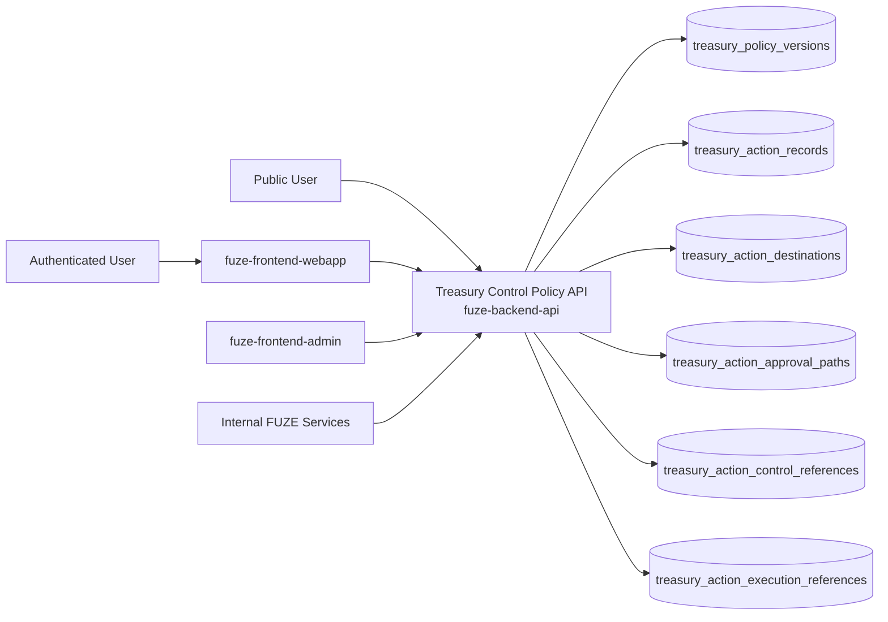
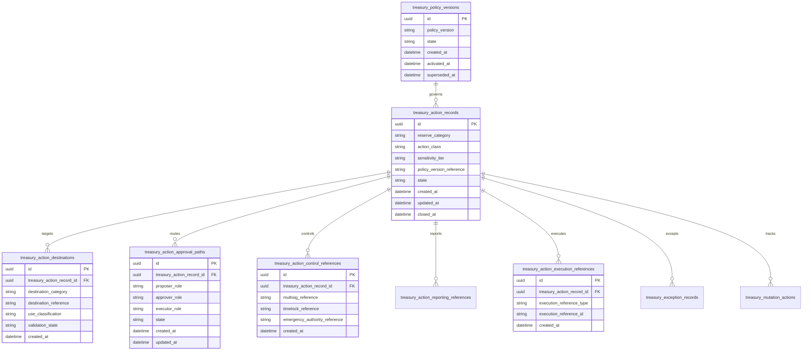
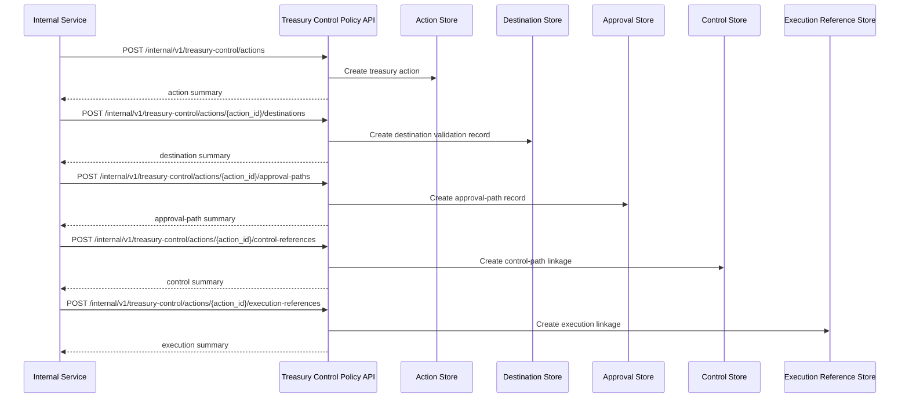

# TREASURY_CONTROL_POLICY_API_SPEC

## 1. Title

**TREASURY_CONTROL_POLICY_API_SPEC.md**

---

## 2. Document Metadata

- **Document Name:** TREASURY_CONTROL_POLICY_API_SPEC.md
- **API Classification:** internal, admin, event-driven, public-read, chain-adjacent
- **Owning Domain:** Treasury Control Policy Domain
- **Primary Implementing Repo:** `fuze-backend-api`
- **Primary Chain-Adjacent Dependency:** `fuze-contracts`
- **Primary System of Record:** treasury action records, policy versions, category-aware approval paths, sensitivity tiers, destination restrictions, execution-control references, reporting references, and correction-safe treasury-control lineage in `fuze-backend-api`
- **Status:** Draft for canonical source-of-truth approval
- **Purpose:** Define the production-grade API contract architecture for FUZE treasury-control policy enforcement, treasury-action proposal and approval coordination, category-aware destination control, treasury-action auditability, and structured reporting-safe lifecycle management across the platform
- **Canonical Folder:** `fuze.ac > docs > api-spec`

---

## 2.1 API Classification Header

- **API Classification:** internal | admin | event-driven | public-read | chain-adjacent
- **Owning Domain:** Treasury Control Policy Domain
- **Primary Implementing Repo:** `fuze-backend-api`
- **Primary Chain-Adjacent Dependency:** `fuze-contracts`
- **Primary System of Record:** treasury-control policy and treasury-action governance domain

---

## 3. Purpose

This document defines the canonical API specification for FUZE treasury-control policy operations. It translates the governing FUZE platform architecture, treasury control policy, vault action policy, foundation governance constraints, multisig and timelock expectations, transparency model, audit requirements, and API architecture rules into an implementation-ready API contract.

This API exists because FUZE treasury-sensitive behavior cannot be governed through informal operator discretion. Treasury-controlled value must remain category-aware, policy-bounded, approval-path explicit, destination-restricted, and explainable before and after execution. Treasury control is therefore not merely a contract permission issue. It is a policy-governed operating domain that must preserve the distinct meaning of Treasury Reserve, Foundation, Holder Incentives, Ecosystem Partnership, Liquidity Operations, Transparency/Stability, and treasury-adjacent vesting structures. fileciteturn17file3L1-L25 fileciteturn17file4L37-L89

Accordingly, this specification defines how treasury policy versions, treasury action records, reserve-category interpretation, approval paths, destination restrictions, execution-control references, and reporting lineage are represented, and how treasury-control behavior remains auditable, idempotent, and architecture-consistent across FUZE. Treasury control must preserve meaningful separation among proposal, approval, and execution, and it must support clear reporting and auditability for material actions. fileciteturn17file2L1-L38 fileciteturn17file0L5-L28

---

## 4. Scope

This specification covers:

- internal APIs for treasury policy versioning and treasury-action lifecycle management
- internal APIs for category-aware treasury-action proposal, approval, execution-control linkage, and reporting linkage
- internal APIs for destination restriction validation and sensitivity-tier enforcement
- internal read APIs for canonical treasury-control truth
- admin/control-plane APIs for approve, reject, pause, escalate, exceptional-action handling, supersede, and discrepancy resolution
- public-read APIs for bounded treasury-control policy summaries and public-safe treasury-action reporting references where policy allows
- event emission requirements for treasury-control lifecycle changes
- request, response, error, idempotency, versioning, audit, and database-shape rules for this domain

This specification does **not** redefine:

- the full vault-action allow/deny matrix in contract detail
- multisig signing or timelock execution internals in full detail
- Foundation governance internals in full detail
- raw treasury accounting exports
- profit participation execution semantics in full detail
- low-level contract ABI implementations
- public transparency-report composition in full detail

Those remain governed by their own source-of-truth specifications. fileciteturn17file3L17-L29 fileciteturn17file7L17-L29

---

## 5. Source-of-Truth Inputs

### Primary FUZE docs and specs used

#### Highest-priority platform and ownership sources
- `SYSTEM_SPEC_INDEX.md`
- `DOCS_SPEC.md`
- `SYSTEM_BOUNDARY_AND_OWNERSHIP_SPEC.md`
- `SYSTEM_OVERVIEW_AND_BOUNDARIES_SPEC.md`
- `PLATFORM_ARCHITECTURE_SPEC.md`
- `DOMAIN_OWNERSHIP_MATRIX_SPEC.md`
- `DATA_MODEL_AND_ENTITY_OWNERSHIP_SPEC.md`
- `ONCHAIN_OFFCHAIN_RESPONSIBILITY_SPEC.md`

#### Primary treasury / governance / control sources
- `TREASURY_CONTROL_POLICY_SPEC.md`
- `VAULT_ACTION_POLICY_SPEC.md`
- `FOUNDATION_GOVERNANCE_SPEC.md`
- `MULTISIG_AND_TIMELOCK_SPEC.md`
- `GOVERNANCE_MODEL_SPEC.md`
- `TRANSPARENCY_MODEL_SPEC.md`
- `TRANSPARENCY_REPORTING_SPEC.md`
- `PROFIT_PARTICIPATION_SYSTEM_SPEC.md`
- `CHAIN_ARCHITECTURE_SPEC.md`
- `PUBLIC_CONTRACT_AND_WALLET_REGISTRY_SPEC.md`

#### Core docs inputs
- `FUZE_WHITEPAPER_v.2026.3.0.1.pdf`
- `FUZE_CHAIN_ARCHITECTURE.md`
- `TOKEN_CONTRACT_ARCHITECTURE_.md`
- `FUZE_TOKENOMICS_TABLES.md`
- `ALLOCATION_WALLET_MAP.md`
- tokenomics vault docs under `fuze.ac > docs/tokenomics/`

#### API and runtime sources
- `API_ARCHITECTURE_SPEC.md`
- `PUBLIC_API_SPEC.md`
- `INTERNAL_SERVICE_API_SPEC.md`
- `EVENT_MODEL_AND_WEBHOOK_SPEC.md`
- `IDEMPOTENCY_AND_VERSIONING_SPEC.md`
- `MIGRATION_AND_BACKWARD_COMPATIBILITY_SPEC.md`
- `AUDIT_LOG_AND_ACTIVITY_SPEC.md`

#### Security and operations sources
- `SECURITY_AND_RISK_CONTROL_SPEC.md`
- `MONITORING_ALERTING_AND_INCIDENT_RESPONSE_SPEC.md`
- `SECRETS_CONFIG_AND_ENVIRONMENT_SPEC.md`

#### Format guides
- `The_API_Specification_guide.md`
- `Database_Schemas_Guide.md`

### Highest-priority interpretation applied

For this file, the most important governing interpretation is:

1. treasury-controlled capital may be activated only through explicit category-aware policy, bounded authority, and auditable governance pathways
2. backend owns canonical treasury-action policy truth and treasury-action lifecycle truth
3. treasury control must preserve the distinct meaning of each reserve category rather than treating all treasury value as one flexible pool
4. proposal, approval, and execution should remain meaningfully separated for material treasury-sensitive actions
5. treasury-sensitive funding for profit participation is a treasury-sensitive action with stronger transparency and reporting implications than routine treasury movement
6. Foundation-sensitive flows must remain more conservative than ordinary treasury behavior and must not be collapsed into ordinary treasury convenience

These interpretations are directly grounded in the treasury control policy and vault action policy documents. fileciteturn17file3L35-L79 fileciteturn17file2L1-L38 fileciteturn17file7L64-L90

### Supporting external standards used only as guidance

- HTTP semantics for internal mutation and bounded public-read APIs
- structured problem-details error design
- general approval-workflow, policy-versioning, and correction-lineage patterns as supporting guidance

External guidance does not override FUZE source-of-truth documents.

---

## 6. Governing Architecture and Ownership Interpretation

This API belongs to the **Treasury Control Policy Domain** because it owns the canonical lifecycle of:

- treasury policy version interpretation,
- treasury-sensitive action records,
- action-class and sensitivity-tier determination,
- reserve-category-aware proposal and approval routing,
- destination and use restriction validation,
- execution-control linkage,
- reporting linkage,
- and correction-safe treasury-governance history.

This API is implemented primarily in `fuze-backend-api` because:

- backend owns durable policy and treasury-action truth
- treasury-sensitive actions require centralized rule enforcement and auditability
- vault and contract controls need explicit off-chain governance-path records
- multiple adjacent domains depend on treasury-action results while remaining separate
- public trust requires structured policy and reporting lineage in addition to contract execution traces

This API is **not** owned by:

- `fuze-frontend-webapp`, because frontend only reads bounded public-safe policy and action summaries
- `fuze-frontend-admin`, because admin may propose, approve, escalate, or pause but must not own policy truth
- `fuze-contracts`, because contracts enforce or execute certain actions but do not own the full policy interpretation or approval-path history
- vault-specific domains, because vaults define what categories can do, while treasury control defines how treasury-sensitive actions are governed
- profit participation domain, because payout funding consumes treasury-sensitive approval outputs but does not own treasury-control policy
- transparency reporting domain, because it reports treasury-sensitive actions but does not own the underlying control truth

### Architectural implications

- every treasury-sensitive action must have stable identity and explicit category context
- every material action must preserve proposal, approval, and execution separation where policy requires
- destination restrictions and use restrictions must be explicit and reviewable
- treasury action policy and vault action policy remain linked but distinct: treasury control governs **how** treasury-sensitive actions are controlled, while vault action policy governs **what** vaults are meaningfully allowed to do. fileciteturn17file5L31-L49
- corrections and supersession must preserve historical governance meaning rather than silently rewriting actions

---

## 7. Domain Responsibilities

The Treasury Control Policy API domain is responsible for:

1. maintaining canonical treasury policy versions and treasury action records
2. classifying treasury actions by reserve category, action class, and sensitivity tier
3. validating destination and use restrictions for treasury-sensitive actions
4. preserving proposal, approval, and execution role separation for material actions
5. recording control-path references such as multisig, timelock, emergency authority, or exceptional treatment
6. linking treasury actions to audit, public reporting, registry, and payout references where applicable
7. supporting admin approve, reject, pause, escalate, exceptional-action, supersede, and discrepancy workflows
8. emitting treasury-control lifecycle events
9. generating audit lineage for sensitive treasury-control actions
10. preserving separation between treasury policy, vault policy, Foundation governance, and execution settlement

The domain is not responsible for:

- owning the final contract-level execution result
- replacing vault action policy
- replacing multisig/timelock technical enforcement
- replacing internal accounting systems
- replacing narrative transparency reports
- allowing generic discretionary treasury behavior without policy-bounded structure

---

## 8. Out of Scope

The following are out of scope for this API specification:

- full raw accounting-book modeling
- low-level multisig signer management
- chain-node or explorer integration internals
- product-level operational budget approval workflows that are not treasury-sensitive
- end-user UI design for treasury reporting
- full legal review workflows
- full DAO-lite future-state voting mechanics

Where later detailed specs are needed, they must remain compatible with this API.

---

## 9. Canonical Entities and Data Ownership

### Durable entities

#### 9.1 treasury_policy_versions
- **Owner:** Treasury Control Policy Domain
- **Purpose:** canonical policy versions governing treasury-sensitive actions
- **Nature:** source-of-truth durable entity

#### 9.2 treasury_action_records
- **Owner:** Treasury Control Policy Domain
- **Purpose:** canonical treasury-sensitive action records
- **Nature:** source-of-truth durable entity

#### 9.3 treasury_action_categories
- **Owner:** Treasury Control Policy Domain
- **Purpose:** category-aware classification of reserve category, action class, and sensitivity tier
- **Nature:** source-of-truth durable entity

#### 9.4 treasury_action_destinations
- **Owner:** Treasury Control Policy Domain
- **Purpose:** destination category, destination type, and destination restriction posture
- **Nature:** source-of-truth durable lineage entity

#### 9.5 treasury_action_approval_paths
- **Owner:** Treasury Control Policy Domain
- **Purpose:** explicit proposal, approval, and execution role-path records
- **Nature:** source-of-truth durable lineage entity

#### 9.6 treasury_action_control_references
- **Owner:** Treasury Control Policy Domain
- **Purpose:** structured references to multisig, timelock, emergency authority, or exceptional control paths
- **Nature:** source-of-truth durable lineage entity

#### 9.7 treasury_action_reporting_references
- **Owner:** Treasury Control Policy Domain
- **Purpose:** references to transparency, registry, or payout-related reporting artifacts
- **Nature:** durable reporting-lineage entity

#### 9.8 treasury_action_execution_references
- **Owner:** Treasury Control Policy Domain
- **Purpose:** bounded references to downstream contract or operational execution artifacts
- **Nature:** durable execution-lineage entity

#### 9.9 treasury_exception_records
- **Owner:** Treasury Control Policy Domain
- **Purpose:** emergency or exceptional treasury-treatment records with post-incident review requirements
- **Nature:** durable exceptional-case entity

#### 9.10 treasury_discrepancy_cases
- **Owner:** Treasury Control Policy Domain
- **Purpose:** review and remediation records for invalid, stale, miscategorized, or misreported treasury-sensitive actions
- **Nature:** durable review/remediation entity

#### 9.11 treasury_mutation_actions
- **Owner:** Treasury Control Policy Domain
- **Purpose:** high-level action records for create, approve, reject, pause, escalate, exceptional, supersede, and resolve discrepancy
- **Nature:** durable action records with audit linkage

#### 9.12 treasury_audit_events
- **Owner:** Audit / Activity domain, sourced by Treasury Control Policy Domain
- **Purpose:** immutable trail for sensitive treasury-control actions
- **Nature:** durable audit records

### Derived or cached entities

#### 9.13 treasury_public_policy_views
- **Owner:** derived read-model layer
- **Purpose:** public-safe treasury-policy and treasury-action summaries
- **Nature:** derived

#### 9.14 treasury_internal_status_views
- **Owner:** derived read-model layer
- **Purpose:** trusted treasury action and approval-path operational summaries
- **Nature:** derived

#### 9.15 treasury_discrepancy_views
- **Owner:** derived ops read-model layer
- **Purpose:** visibility into stale, invalid, or miscategorized treasury conditions
- **Nature:** derived

---

## 10. State Model and Lifecycle

### 10.1 treasury policy version lifecycle

Possible states:

- `draft`
- `active`
- `deprecated`
- `superseded`
- `archived`

### 10.2 treasury action lifecycle

Possible states:

- `draft`
- `proposed`
- `under_review`
- `approved`
- `rejected`
- `ready_for_execution`
- `executed_reference_linked`
- `reported`
- `paused`
- `superseded`
- `closed`

### 10.3 approval-path lifecycle

Possible states:

- `proposal_recorded`
- `approval_pending`
- `approved`
- `rejected`
- `execution_linked`
- `closed`

### 10.4 exceptional-action lifecycle

Possible states:

- `declared`
- `containment_active`
- `post_review_pending`
- `closed`
- `superseded`

### 10.5 discrepancy lifecycle

Possible states:

- `opened`
- `under_review`
- `resolved`
- `failed`
- `closed`

Lifecycle notes:
- treasury action approval is distinct from execution linkage
- reported is distinct from executed_reference_linked
- exceptional treatment must remain explicitly narrower than normal deployment authority
- supersession must preserve prior governance meaning and historical explanation

---

## 11. API Surface Overview

The API surface is divided into four families:

### 11.1 Public-read APIs
Used by public users, holders, and community observers for:
- reading bounded treasury-control policy summaries
- reading public-safe treasury-action reporting summaries
- reading category-aware and sensitivity-aware public explanations where policy allows

### 11.2 First-party authenticated read APIs
Used by `fuze-frontend-webapp` and approved first-party clients for:
- reading bounded treasury-related public-safe and first-party-safe action summaries where policy allows
- reading linked payout or reporting references without exposing internal-only governance detail

### 11.3 Internal service APIs
Used by trusted internal services for:
- creating treasury actions
- validating categories and destinations
- recording approval-path and control references
- linking execution and reporting references
- reading canonical truth

### 11.4 Admin / control-plane APIs
Used by `fuze-frontend-admin` through backend-only privileged routes for:
- approve, reject, pause, escalate, exceptional-action, supersede, and discrepancy actions
- control-path repair and policy-governed remediation workflows

---

## 12. Authentication and Authorization Model

### 12.1 Authentication posture by route family

#### Public-read routes
No authentication required:
- list public-safe treasury policy summaries
- read public-safe treasury-action summaries and references where published

#### Authenticated read routes
Require valid authenticated session:
- read bounded first-party-safe treasury-related summaries where actor has visibility under policy

#### Internal service routes
Require internal service identity with explicit least privilege:
- create treasury actions
- record categories, destinations, approval paths, control references, and reporting links
- read canonical truth

#### Admin routes
Require privileged operator identity plus reason-coded actions:
- approve, reject, pause, escalate, declare exceptional treatment, supersede, and resolve discrepancy cases

### 12.2 Authorization checkpoints

Authorization must evaluate:
- caller identity and route family
- whether target action is public-safe, first-party-safe, or privileged internal state
- whether internal service has create/approve/link/read privilege
- whether admin/operator role is present for sensitive governance actions
- whether current action state allows requested mutation
- whether reserve category and sensitivity tier require stronger control-path validation

### 12.3 Sensitive action rules

The following require heightened checks:
- approval of material treasury-sensitive actions
- actions affecting Foundation-sensitive or liquidity-sensitive categories
- profit-participation funding actions
- destination changes after approval
- emergency or exceptional treatment
- discrepancy-resolution actions

Treasury control policy explicitly requires meaningful separation among proposal, approval, and execution whenever feasible, and it requires stronger safeguards for Foundation-sensitive actions and payout-cycle funding. fileciteturn17file2L1-L38 fileciteturn17file1L1-L40

---

## 13. API Endpoints / Interface Contracts

## 13.1 Public-Read APIs

### 13.1.1 `GET /v1/treasury-control/policies`
**Purpose:** list published public-safe treasury policy summaries  
**Caller Type:** public  
**Auth Expectation:** none  
**Query Parameters Summary:**
- optional `state`
- pagination
**Response Summary:**
- policy version summaries
- active/superseded posture
- public-safe category and control summaries
- timestamps
**Side Effects:** none
**Audit Requirements:** access logging optional
**Emitted Events:** none required

### 13.1.2 `GET /v1/treasury-control/actions`
**Purpose:** list published public-safe treasury action summaries  
**Caller Type:** public  
**Query Parameters Summary:**
- optional `reserve_category`
- optional `action_class`
- optional `sensitivity_tier`
- pagination
**Response Summary:**
- public-safe action summaries
- category, action class, and status
- bounded reporting and registry references
**Side Effects:** none

### 13.1.3 `GET /v1/treasury-control/actions/{treasury_action_id}`
**Purpose:** retrieve one public-safe treasury action detail  
**Caller Type:** public  
**Response Summary:**
- public-safe action detail
- category and sensitivity summary
- destination-category summary
- reporting and public registry references where published
- correction or supersession guidance where relevant
**Side Effects:** none

## 13.2 First-Party Authenticated Read APIs

### 13.2.1 `GET /v1/treasury-control/me/actions`
**Purpose:** retrieve bounded first-party-safe treasury-related action summaries where actor has policy visibility  
**Caller Type:** authenticated user  
**Auth Expectation:** valid authenticated session  
**Query Parameters Summary:**
- optional `reference_type`
- pagination
**Response Summary:**
- bounded treasury-related summaries
- linked public reporting or payout guidance where applicable
**Side Effects:** none

## 13.3 Internal Service APIs

### 13.3.1 `POST /internal/v1/treasury-control/actions`
**Purpose:** create draft treasury-sensitive action record  
**Caller Type:** internal trusted service  
**Auth Expectation:** service-to-service identity only  
**Request Body Summary:**
- `reserve_category`
- `action_class`
- `sensitivity_tier`
- `policy_version_reference`
- optional `proposal_summary`
- `idempotency_key`
**Response Summary:** treasury-action summary
**Side Effects:** creates draft/proposed treasury action and category record
**Idempotency Behavior:** required
**Audit Requirements:** sensitive treasury-action creation audit
**Emitted Events:** `treasury_control.action_created`

### 13.3.2 `POST /internal/v1/treasury-control/actions/{treasury_action_id}/destinations`
**Purpose:** attach destination and use-restriction metadata to one treasury action  
**Caller Type:** internal trusted service  
**Request Body Summary:**
- `destination_category`
- `destination_reference`
- `use_classification`
- `idempotency_key`
**Response Summary:** destination summary and validation posture
**Side Effects:** creates destination linkage and restriction evaluation record
**Idempotency Behavior:** required
**Audit Requirements:** destination-link audit
**Emitted Events:** `treasury_control.destination_validated`

### 13.3.3 `POST /internal/v1/treasury-control/actions/{treasury_action_id}/approval-paths`
**Purpose:** record proposal, approval, and execution-path structure for one treasury action  
**Caller Type:** internal trusted service  
**Request Body Summary:**
- `proposer_role`
- `approver_role`
- `executor_role`
- optional `approval_path_summary`
- `idempotency_key`
**Response Summary:** approval-path summary
**Side Effects:** creates approval-path lineage and may move action into under_review
**Idempotency Behavior:** required
**Audit Requirements:** approval-path audit
**Emitted Events:** `treasury_control.approval_path_recorded`

### 13.3.4 `POST /internal/v1/treasury-control/actions/{treasury_action_id}/control-references`
**Purpose:** attach multisig, timelock, emergency, or exceptional control references to one action  
**Caller Type:** internal trusted service  
**Request Body Summary:**
- optional `multisig_reference`
- optional `timelock_reference`
- optional `emergency_authority_reference`
- optional `control_summary`
- `idempotency_key`
**Response Summary:** control-reference summary
**Side Effects:** creates control-path linkage
**Idempotency Behavior:** required
**Audit Requirements:** control-reference audit
**Emitted Events:** `treasury_control.control_linked`

### 13.3.5 `POST /internal/v1/treasury-control/actions/{treasury_action_id}/reporting-references`
**Purpose:** attach reporting, registry, or payout references to one treasury action  
**Caller Type:** internal trusted service  
**Request Body Summary:**
- optional `transparency_report_reference`
- optional `public_registry_reference`
- optional `payout_linkage_reference`
- `idempotency_key`
**Response Summary:** reporting-reference summary
**Side Effects:** creates reporting and trust-surface linkage
**Idempotency Behavior:** required
**Audit Requirements:** reporting-link audit
**Emitted Events:** `treasury_control.reporting_linked`

### 13.3.6 `POST /internal/v1/treasury-control/actions/{treasury_action_id}/execution-references`
**Purpose:** link downstream execution reference to one treasury action  
**Caller Type:** internal trusted service  
**Request Body Summary:**
- `execution_reference_type`
- `execution_reference_id`
- optional `execution_summary`
- `idempotency_key`
**Response Summary:** execution-reference summary and updated action state
**Side Effects:** creates execution linkage and may move action into executed_reference_linked
**Idempotency Behavior:** required
**Audit Requirements:** execution-link audit
**Emitted Events:** `treasury_control.execution_linked`

### 13.3.7 `GET /internal/v1/treasury-control/actions/{treasury_action_id}`
**Purpose:** retrieve canonical treasury-control truth  
**Caller Type:** internal trusted service  
**Response Summary:** full treasury action, category, destination, approval-path, control references, execution references, reporting references, and discrepancy lineage
**Side Effects:** none

## 13.4 Admin / Control-Plane APIs

### 13.4.1 `POST /admin/v1/treasury-control/actions/{treasury_action_id}/approve`
**Purpose:** approve treasury-sensitive action under controlled policy  
**Caller Type:** admin/operator  
**Request Body Summary:**
- `reason_code`
- `operator_note`
- `idempotency_key`
**Response Summary:** approved action summary
**Side Effects:** action moves to approved or ready_for_execution if checks pass
**Audit Requirements:** critical audit
**Emitted Events:** `treasury_control.action_approved`

### 13.4.2 `POST /admin/v1/treasury-control/actions/{treasury_action_id}/reject`
**Purpose:** reject treasury-sensitive action under controlled policy  
**Caller Type:** admin/operator  
**Request Body Summary:**
- `reason_code`
- `operator_note`
- `idempotency_key`
**Response Summary:** rejected action summary
**Side Effects:** action moves to rejected
**Audit Requirements:** critical audit
**Emitted Events:** `treasury_control.action_rejected`

### 13.4.3 `POST /admin/v1/treasury-control/actions/{treasury_action_id}/pause`
**Purpose:** pause treasury-sensitive action under controlled policy  
**Caller Type:** admin/operator  
**Request Body Summary:**
- `reason_code`
- `operator_note`
- `idempotency_key`
**Response Summary:** paused action summary
**Side Effects:** action moves to paused
**Audit Requirements:** critical audit
**Emitted Events:** `treasury_control.action_paused`

### 13.4.4 `POST /admin/v1/treasury-control/actions/{treasury_action_id}/escalate`
**Purpose:** escalate treasury-sensitive action to stronger governance/control path  
**Caller Type:** admin/operator  
**Request Body Summary:**
- `escalation_type`
- `reason_code`
- `operator_note`
- `idempotency_key`
**Response Summary:** escalation summary
**Side Effects:** action control path strengthens, for example via stronger approval or timelock posture
**Audit Requirements:** critical audit
**Emitted Events:** `treasury_control.action_escalated`

### 13.4.5 `POST /admin/v1/treasury-control/actions/{treasury_action_id}/exceptional`
**Purpose:** declare emergency or exceptional treasury treatment under controlled policy  
**Caller Type:** admin/operator  
**Request Body Summary:**
- `exception_type`
- `public_or_internal_summary`
- `reason_code`
- `operator_note`
- `idempotency_key`
**Response Summary:** exceptional-action summary
**Side Effects:** creates exception record and may restrict ordinary execution path until review completes
**Audit Requirements:** critical audit
**Emitted Events:** `treasury_control.exception_declared`

### 13.4.6 `POST /admin/v1/treasury-control/actions/{treasury_action_id}/supersede`
**Purpose:** supersede one treasury-sensitive action with a replacement record under controlled policy  
**Caller Type:** admin/operator  
**Request Body Summary:**
- `replacement_treasury_action_id`
- `reason_code`
- `operator_note`
- `idempotency_key`
**Response Summary:** supersession summary
**Side Effects:** creates old-to-new supersession linkage and updates current policy-visible preference
**Audit Requirements:** critical audit
**Emitted Events:** `treasury_control.action_superseded`

### 13.4.7 `POST /admin/v1/treasury-control/discrepancies`
**Purpose:** resolve treasury-control discrepancy under controlled policy  
**Caller Type:** admin/operator  
**Request Body Summary:**
- `target_reference_type`
- `target_reference_id`
- `resolution_code`
- `operator_note`
- `related_case_id`
- `idempotency_key`
**Response Summary:** discrepancy-resolution summary
**Side Effects:** may correct, supersede, pause, escalate, or close discrepancy posture with preserved lineage
**Audit Requirements:** critical audit
**Emitted Events:** `treasury_control.discrepancy_resolved`

---

## 14. Request Rules

### 14.1 General request rules
- all mutation-capable routes must require JSON requests with explicit content type
- all mutation routes must carry correlation IDs
- sensitive treasury-control mutations must carry idempotency keys
- admin mutations must require reason codes and operator notes
- no route may accept frontend-authored treasury-control truth as authoritative input

### 14.2 Sensitive-action request requirements
The following requests require heightened validation:
- proposal or approval of material treasury-sensitive actions
- Foundation-sensitive actions
- profit-participation funding actions
- destination or use changes after action enters under_review or approved state
- escalation or exceptional treatment
- discrepancy-resolution actions

Heightened validation may include:
- reserve-category and vault-role consistency checks
- destination-category restriction checks
- control-path completeness checks
- reporting-lineage requirements
- operator role confirmation
- governance/finance/security case linkage for sensitive actions

### 14.3 Scope integrity rule
Treasury-control mutations must target valid and authorized policy versions, action records, destination records, control references, and discrepancy records. Services and operators must not mutate unrelated or unauthorized treasury-control state.

### 14.4 Layer-separation rule
Treasury-control policy must remain the governance-and-policy layer for treasury-sensitive actions. It must not collapse:
- vault-action meaning,
- multisig/timelock execution,
- accounting truth,
- profit participation execution,
- or transparency reporting
into one ambiguous state object.

---

## 15. Response Rules

### 15.1 Success response rules
Successful responses must include:
- stable resource identifiers
- timestamps for created/updated state
- state/status values
- action, category, or destination summaries where relevant
- control-path and reporting-reference summaries where relevant
- correlation references for mutations

### 15.2 Async-accepted response rules
If escalation, exceptional review, or discrepancy remediation is async, the response must:
- return accepted status
- include action or job ID
- provide follow-up status semantics

### 15.3 Terminal mutation response rules
Terminal mutation responses must clearly show:
- target action or discrepancy
- mutation type
- resulting policy/action/control-path state
- pause, escalation, exceptional, supersession, or closure effects where relevant
- whether public-safe views may refresh asynchronously

### 15.4 Read response rules
Read responses must distinguish:
- canonical internal treasury-control truth
- public-safe treasury policy summaries
- public-safe treasury action reporting views
- execution references versus final downstream execution outcomes

---

## 16. Error Model

The API uses structured problem-details style error responses.

### 16.1 Required error fields
- `type`
- `title`
- `status`
- `code`
- `detail`
- `instance`
- `correlation_id`

### 16.2 Common error codes

#### Authorization / permission errors
- `TREASURY_CONTROL_PERMISSION_DENIED`
- `TREASURY_CONTROL_OPERATOR_PERMISSION_DENIED`
- `TREASURY_CONTROL_SERVICE_PERMISSION_DENIED`
- `TREASURY_CONTROL_AUDIENCE_PERMISSION_DENIED`

#### State conflict errors
- `TREASURY_CONTROL_ACTION_STATE_INVALID`
- `TREASURY_CONTROL_POLICY_STATE_INVALID`
- `TREASURY_CONTROL_APPROVAL_PATH_INVALID`
- `TREASURY_CONTROL_SUPERSESSION_CONFLICT`
- `TREASURY_CONTROL_ESCALATION_CONFLICT`

#### Policy / safety errors
- `TREASURY_CONTROL_DESTINATION_NOT_ALLOWED`
- `TREASURY_CONTROL_POLICY_VERSION_REQUIRED`
- `TREASURY_CONTROL_APPROVAL_REQUIRED`
- `TREASURY_CONTROL_EXCEPTION_NOT_ALLOWED`
- `TREASURY_CONTROL_FOUNDATION_RESTRICTION`

#### Request integrity errors
- `TREASURY_CONTROL_IDEMPOTENCY_KEY_REQUIRED`
- `TREASURY_CONTROL_REQUEST_INVALID`
- `TREASURY_CONTROL_REQUEST_UNPROCESSABLE`

#### Dependency or provider errors
- `TREASURY_CONTROL_EXECUTION_UNAVAILABLE`
- `TREASURY_CONTROL_STORAGE_UNAVAILABLE`
- `TREASURY_CONTROL_RECONCILIATION_UNAVAILABLE`

### 16.3 Error handling rules
- do not expose hidden internal governance, treasury, or security detail in public or low-privilege responses
- do not imply permitted execution merely because a draft or proposed treasury action exists
- distinguish destination-restriction failure from generic invalid state
- distinguish policy-version-required from generic invalid request
- include retry guidance only where safe

---

## 17. Idempotency and Mutation Safety

### 17.1 Required idempotent mutations
The following mutation routes require idempotent behavior:
- treasury-action creation
- destination attachment
- approval-path recording
- control-reference attachment
- reporting-reference attachment
- execution-reference linking
- approve
- reject
- pause
- escalate
- exceptional
- supersede
- discrepancy resolution

### 17.2 Idempotency key rules
- mutation requests must supply `Idempotency-Key`
- backend stores key scope, request hash, actor, and terminal result
- replay of same semantic request returns original terminal outcome
- replay of same key with different semantic request must fail with conflict

### 17.3 Mutation safety rules
- one canonical visible treasury action per current action lineage unless explicit supersession exists
- destination and control-path records must remain referentially consistent with reserve category and sensitivity tier
- approval, execution linkage, and reporting linkage must preserve proposal/approval/execution separation
- corrections and supersession must preserve prior treasury-action lineage
- exceptional treatment must not silently normalize into routine treasury behavior

---

## 18. Versioning and Compatibility Rules

### 18.1 Versioning
This API family is versioned under `/v1`, `/internal/v1`, and `/admin/v1` route families.

### 18.2 Compatibility approach
- additive evolution preferred
- no silent semantic change to proposed, approved, ready_for_execution, executed_reference_linked, reported, paused, or superseded states
- new reserve categories, action classes, destination types, or control reference types may be added without breaking existing contracts
- response fields may be added but existing meanings must remain stable

### 18.3 Breaking-change rules
Breaking changes include:
- changing the meaning of treasury-action lifecycle states
- changing public-safe treasury-control visibility semantics incompatibly
- removing critical category, destination, or control-path fields
- changing exceptional-treatment or supersession semantics incompatibly

Such changes require explicit migration planning and version evolution.

### 18.4 Deprecation
Deprecated routes or fields must:
- be documented explicitly
- carry deprecation metadata where supported
- preserve compatibility windows long enough for public, first-party, and internal consumers

---

## 19. Event Emission and Webhook Behavior

This domain is event-capable.

### 19.1 Internal events
The Treasury Control Policy domain must emit canonical internal events such as:
- `treasury_control.action_created`
- `treasury_control.destination_validated`
- `treasury_control.approval_path_recorded`
- `treasury_control.control_linked`
- `treasury_control.reporting_linked`
- `treasury_control.execution_linked`
- `treasury_control.action_approved`
- `treasury_control.action_rejected`
- `treasury_control.action_paused`
- `treasury_control.action_escalated`
- `treasury_control.exception_declared`
- `treasury_control.action_superseded`
- `treasury_control.discrepancy_resolved`

### 19.2 Event payload minimums
Each event should contain:
- event ID
- event type
- occurred_at
- treasury action ID
- reserve category
- action class
- sensitivity tier
- actor type
- correlation ID
- reason code where applicable

### 19.3 External webhook posture
This specification does not expose general third-party outbound treasury-control webhooks by default. Any future outbound treasury-status webhook surface must be narrow, security-reviewed, and governed by a separate contract.

---

## 20. Audit and Activity Requirements

The following actions must generate durable audit events:

- treasury-action creation
- destination validation
- approval-path recording
- approve, reject, pause, escalate, and exceptional treatment
- execution-reference and reporting-reference linkage for material actions
- supersession and discrepancy-resolution actions
- other sensitive treasury-control mutations

### Required audit fields
- audit event ID
- actor type and actor reference
- target action / category / destination / control path / discrepancy reference as applicable
- action type
- before/after summary where applicable
- reason code
- correlation ID
- operator note if operator action
- occurred_at

Treasury control policy explicitly requires treasury-sensitive actions to remain explainable and auditably structured over time. fileciteturn17file0L5-L28

---

## 21. Data Model and Database Schema View

### 21.1 `treasury_policy_versions`
- `id` PK
- `policy_version`
- `state`
- `policy_summary_json`
- `created_at`
- `activated_at` nullable
- `superseded_at` nullable

**Constraints:**
- unique `policy_version`
- index on `state`

### 21.2 `treasury_action_records`
- `id` PK
- `reserve_category`
- `action_class`
- `sensitivity_tier`
- `policy_version_reference`
- `state`
- `created_at`
- `updated_at`
- `closed_at` nullable

**Constraints:**
- index on (`reserve_category`, `action_class`)
- index on `state`

### 21.3 `treasury_action_destinations`
- `id` PK
- `treasury_action_record_id` FK -> `treasury_action_records.id`
- `destination_category`
- `destination_reference`
- `use_classification`
- `validation_state`
- `created_at`

**Constraints:**
- index on `treasury_action_record_id`
- index on `validation_state`

### 21.4 `treasury_action_approval_paths`
- `id` PK
- `treasury_action_record_id` FK -> `treasury_action_records.id`
- `proposer_role`
- `approver_role`
- `executor_role`
- `state`
- `created_at`
- `updated_at`

**Constraints:**
- index on `treasury_action_record_id`
- index on `state`

### 21.5 `treasury_action_control_references`
- `id` PK
- `treasury_action_record_id` FK -> `treasury_action_records.id`
- `multisig_reference` nullable
- `timelock_reference` nullable
- `emergency_authority_reference` nullable
- `created_at`

**Constraints:**
- index on `treasury_action_record_id`

### 21.6 `treasury_action_reporting_references`
- `id` PK
- `treasury_action_record_id` FK -> `treasury_action_records.id`
- `transparency_report_reference` nullable
- `public_registry_reference` nullable
- `payout_linkage_reference` nullable
- `created_at`

**Constraints:**
- index on `treasury_action_record_id`

### 21.7 `treasury_action_execution_references`
- `id` PK
- `treasury_action_record_id` FK -> `treasury_action_records.id`
- `execution_reference_type`
- `execution_reference_id`
- `execution_summary_json`
- `created_at`

**Constraints:**
- index on `treasury_action_record_id`
- index on (`execution_reference_type`, `execution_reference_id`)

### 21.8 `treasury_exception_records`
- `id` PK
- `treasury_action_record_id` FK -> `treasury_action_records.id`
- `exception_type`
- `summary_json`
- `state`
- `created_at`
- `closed_at` nullable

### 21.9 `treasury_discrepancy_cases`
- `id` PK
- `target_reference_type`
- `target_reference_id`
- `state`
- `resolution_code` nullable
- `created_at`
- `updated_at`
- `closed_at` nullable

### 21.10 `treasury_mutation_actions`
- `id` PK
- `target_reference_type`
- `target_reference_id`
- `action_type`
- `state`
- `reason_code`
- `operator_note` nullable
- `requested_by_actor_type`
- `requested_by_actor_id`
- `created_at`
- `executed_at` nullable
- `closed_at` nullable
- `correlation_id`

### 21.11 `idempotency_records`
- `id` PK
- `idempotency_key`
- `scope_family`
- `actor_reference`
- `request_hash`
- `response_hash`
- `terminal_status`
- `created_at`
- `expires_at`

### 21.12 `audit_log_entries`
Domain-sourced audit records written into the audit domain.

### Normalization notes
- canonical treasury-control truth stays in policy versions, action records, destinations, approval paths, control references, execution references, and discrepancy records
- vault-action and Foundation governance truth remain external and are referenced, not duplicated
- public-safe views must derive from canonical treasury-control truth filtered by disclosure policy
- execution and reporting references remain explicit rather than embedded as opaque strings

### Reconciliation notes
- one visible treasury action should reconcile to one current action lineage under current preference
- destination restrictions and action class must reconcile with reserve category meaning
- approval paths must reconcile to required control-path posture
- profit-participation funding actions must reconcile to payout linkage and reporting requirements where applicable
- discrepancy cases must preserve review lineage for failed or conflicting treasury-control conditions

---

## 22. Architecture Diagram — Mermaid flowchart



---

## 23. Data Design — Mermaid Diagram



---

## 24. Flow View

### 24.1 Happy path — propose, approve, execute, report
1. internal service creates draft treasury-sensitive action
2. destination and use restrictions are attached and validated
3. proposal, approval, and execution roles are recorded
4. control references such as multisig and timelock are linked where required
5. admin approves the action
6. downstream execution reference is linked after execution path proceeds
7. reporting and public registry references are attached
8. public-safe treasury action view becomes explainable and historically traceable

### 24.2 Happy path — profit-participation funding action
1. treasury-sensitive funding action is proposed for a payout cycle
2. system validates reserve-category meaning and stronger reporting implications
3. approval path and control references are recorded
4. admin approves action after payout preparation is ready
5. payout linkage reference and reporting reference are attached
6. public-safe treasury action summary shows category-aware, holder-facing context

### 24.3 Alternate path — Foundation-sensitive escalation
1. action touches Foundation-sensitive capital or similar high-trust category
2. destination validation and policy checks require stronger restraint
3. operator escalates to stronger governance/control path
4. additional review or stricter timelock/multisig posture is linked
5. action proceeds only if higher-control requirements are satisfied

### 24.4 Failure path — destination or category violation
1. treasury action is created or modified
2. backend detects destination-category mismatch, category drift risk, or disallowed use classification
3. request is rejected or paused
4. no effective approval or public reporting is produced

### 24.5 Failure and remediation path — discrepancy or misreporting
1. treasury action, category, destination, or reporting linkage becomes stale or inconsistent
2. admin opens discrepancy-resolution flow
3. backend preserves existing lineage
4. corrected or superseding treasury action or linkage is created
5. discrepancy closes with preserved history

### 24.6 Exceptional-action path
1. emergency or exceptional condition is detected
2. operator declares exceptional treatment with explicit reason and narrower containment posture
3. ordinary governance shortcuts are not normalized into standing authority
4. post-incident review remains required
5. exceptional record closes only after structured review

### 24.7 Retry behavior
- duplicate treasury-action creation returns same canonical action result
- duplicate destination or control-reference attachment returns same lineage result where applicable
- duplicate approve/reject/pause/escalate/exceptional/supersede/discrepancy actions return same terminal action result

---

## 25. Data Flows — Mermaid sequenceDiagram



---

## 26. Security and Risk Controls

1. **Treasury-control truth is backend-owned**  
   Frontends and informal channels may not authoritatively define treasury-sensitive action truth.

2. **Category-aware control is mandatory**  
   Treasury authority is not a blanket right to move ecosystem capital. Each reserve category must remain subject to role-appropriate action rules and bounded deployment meaning. fileciteturn17file3L35-L79 fileciteturn17file4L74-L100

3. **Proposal, approval, and execution separation**  
   Material treasury actions must preserve meaningful separation among proposal, approval, and execution whenever feasible. fileciteturn17file2L1-L38

4. **Destination discipline**  
   Destination and use restrictions must be explicit and validated against reserve-category meaning. Treasury misuse often appears first as destination ambiguity rather than explicit theft. fileciteturn17file1L41-L73

5. **Foundation-sensitive restraint**  
   Foundation-sensitive actions require stronger restraint and must not be normalized into ordinary treasury convenience. fileciteturn17file2L75-L94 fileciteturn17file5L49-L72

6. **Profit-participation funding sensitivity**  
   Payout-cycle funding is treasury-sensitive but is not equivalent to routine treasury deployment. It requires tighter linkage to reporting and payout-ledger structures. fileciteturn17file1L1-L28

7. **Emergency paths remain narrow**  
   Emergency or exceptional actions should prioritize containment over convenience, remain limited, and require post-incident review. fileciteturn17file1L74-L107

8. **Problem-details discipline**  
   Error bodies must be structured and safe, without exposing hidden internal-only details.

9. **Audit immutability**  
   Sensitive treasury-control actions require durable immutable audit lineage.

10. **Reporting explainability**  
    A treasury action that cannot be explained clearly after execution was probably not governed clearly enough before execution. Reporting structure is part of the control system, not an optional communication layer. fileciteturn17file0L5-L16

---

## 27. Operational Considerations

- treasury-action and approval-path reads for trusted operators should be highly available
- destination validation, approval routing, and control-reference integrity are correctness-sensitive
- Foundation-sensitive, liquidity-sensitive, and payout-funding actions should surface clearly to ops views
- exceptional-treatment and discrepancy workflows should be observable and reviewable
- monitoring should alert on:
  - missing approval-path records for material treasury actions
  - destination mismatches or policy violations
  - control-reference omissions for high-sensitivity actions
  - unusual exceptional-treatment frequency
  - reporting-link gaps for executed material actions
  - public-safe view inconsistency versus canonical treasury-control state

---

## 28. Acceptance Criteria

1. The API preserves the distinction between treasury-control policy truth, vault action truth, Foundation governance truth, execution truth, and transparency-report truth.
2. Only `fuze-backend-api` owns canonical treasury policy version and treasury-action truth.
3. Treasury policy versions, action records, destinations, approval paths, control references, execution references, and discrepancy records are durable and backend-owned.
4. Public and first-party routes expose only bounded safe treasury-control views.
5. Category-aware destination and use restrictions are explicit and validated.
6. Proposal, approval, and execution separation is preserved for material treasury actions.
7. Foundation-sensitive and payout-funding actions are handled with stronger policy sensitivity.
8. Approval, escalation, exceptional treatment, correction, and discrepancy actions preserve immutable lineage.
9. Treasury-control mutation actions are idempotent and auditable.
10. Internal and admin treasury-control routes are least-privilege and backend-only.
11. Admin routes require reason-coded privileged authorization.
12. Event emissions exist for major treasury-control mutations.
13. Database schema separates policy versions, actions, destinations, approval paths, control references, reporting references, and discrepancy layers.
14. Public-safe consumers can rely on treasury-control views without needing hidden internal governance detail.
15. Mermaid diagrams remain consistent with prose and data model.

---

## 29. Test Cases

### 29.1 Positive cases
1. Internal service creates draft treasury action successfully.
2. Internal service validates destination successfully.
3. Internal service records approval path successfully.
4. Internal service links control references successfully.
5. Internal service links reporting references successfully.
6. Admin approves treasury action successfully.
7. Admin escalates Foundation-sensitive action successfully.
8. Public actor reads published public-safe treasury action summary successfully.

### 29.2 Negative cases
9. Public user cannot access internal treasury-control truth or discrepancy detail.
10. Internal service without write privilege cannot create treasury action.
11. Treasury action without policy version returns `TREASURY_CONTROL_POLICY_VERSION_REQUIRED`.
12. Disallowed destination returns `TREASURY_CONTROL_DESTINATION_NOT_ALLOWED`.
13. Foundation-sensitive action violating stronger restraint returns `TREASURY_CONTROL_FOUNDATION_RESTRICTION`.
14. Exceptional treatment in ineligible state returns `TREASURY_CONTROL_EXCEPTION_NOT_ALLOWED`.

### 29.3 Authorization cases
15. Ordinary public or authenticated user cannot call treasury-control admin APIs.
16. Internal service without destination-validation privilege cannot attach destination records.
17. Operator without approval privilege cannot approve treasury action.
18. Approved treasury action does not prove downstream execution or payout completion by itself.

### 29.4 Idempotency and replay cases
19. Repeating treasury-action creation with same idempotency key returns original action result.
20. Repeating control-reference attachment with same idempotency key returns original linkage result.
21. Repeating approve or pause with same idempotency key returns original terminal action result.
22. Repeating exceptional or discrepancy resolution with same idempotency key returns original terminal action result.

### 29.5 Concurrency cases
23. Concurrent destination updates preserve one explicit current validation lineage and duplicate-safe outcomes where appropriate.
24. Concurrent approve and escalate actions preserve explicit lifecycle ordering without hidden overwrite.
25. Concurrent supersede and pause actions preserve explicit visible lineage without ambiguity.

### 29.6 Recovery / admin cases
26. Stale or misreported treasury action can be corrected under controlled policy with explicit lineage.
27. Superseded treasury action remains historically linked to the original record.
28. Discrepancy resolution closes category, destination, or reporting conflict with preserved audit history.

### 29.7 Event and audit cases
29. Successful treasury action creation emits `treasury_control.action_created`.
30. Successful destination validation emits `treasury_control.destination_validated`.
31. Successful approval emits `treasury_control.action_approved`.
32. Successful exceptional declaration emits `treasury_control.exception_declared`.
33. Successful discrepancy resolution emits `treasury_control.discrepancy_resolved` with critical audit lineage.

---

## 30. Open Questions or Explicit Deferred Decisions

1. Exact reserve-category and action-class taxonomy code sets are deferred.
2. Exact destination-category taxonomy and validation matrix are deferred.
3. Exact sensitivity-tier to multisig/timelock mapping rules are deferred.
4. Exact public-safe disclosure depth for treasury actions by category is deferred.
5. Exact exceptional-treatment rollback taxonomy is deferred.
6. Exact discrepancy taxonomy for treasury-control conflicts is deferred.

---

## 31. Implementation Notes for `fuze-backend-api`

Recommended backend module layout:

```text
modules/platform/
  treasury-control/
  vault-policy/
  governance/
  payout-ledger/
  transparency-reporting/
  audit-log/
  control-plane/
  integrations/
```

Implementation guidance:
- keep policy versions, treasury actions, category/destination validation, approval-path logic, and control-reference linkage in one canonical domain service
- perform category, destination, sensitivity, and control-path completeness checks inside the commit boundary
- keep approve, reject, pause, escalate, exceptional, supersede, and discrepancy actions explicit and idempotent
- treat admin remediations as domain actions, not ad hoc row edits
- emit events only after canonical state commit succeeds
- publish public-safe treasury-control views from canonical truth; do not let derived views mutate treasury-control state

---

## 32. Frontend Consumption Notes

### For `fuze-frontend-webapp`
- may read public-safe treasury policy and treasury-action summaries where approved
- must not infer reserve-category permissibility from isolated contract transfers alone
- must treat backend treasury-control responses as authoritative for structured treasury-governance status
- should clearly distinguish proposed, approved, executed-reference-linked, reported, paused, corrected, and superseded states when visible

### For `fuze-frontend-admin`
- may trigger privileged approve, reject, pause, escalate, exceptional, supersede, and discrepancy actions only through backend admin APIs
- must require operator reason input for sensitive mutations
- must not directly mutate canonical treasury-control truth client-side
- should present immutable treasury-action history and correction lineage separately from current visible state

---

## 33. Contract Derivation Notes

### OpenAPI / AsyncAPI
This spec should later derive into:
- public policy/action read operations and bounded first-party-safe summary operations
- internal treasury-action creation, destination, approval-path, control-reference, reporting-reference, and execution-reference operations
- admin approve / reject / pause / escalate / exceptional / supersede / discrepancy operations
- shared problem-details schema
- treasury-control lifecycle events in AsyncAPI

### Future `fuze-sdk`
Future `fuze-sdk` packages may derive:
- public treasury-policy lookup helpers
- public-safe treasury-action summary helpers
- typed treasury-action, category, and sensitivity summary models
- problem-error models for treasury-control outcomes

The SDK must derive from approved API contracts and must not become the source of truth over this narrative specification.
