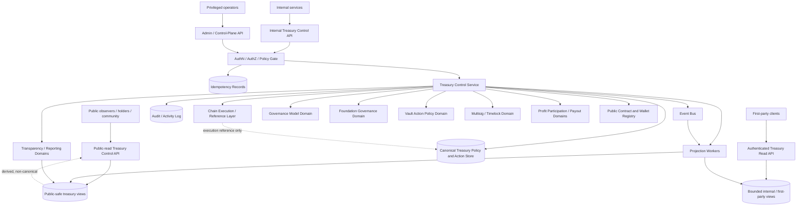
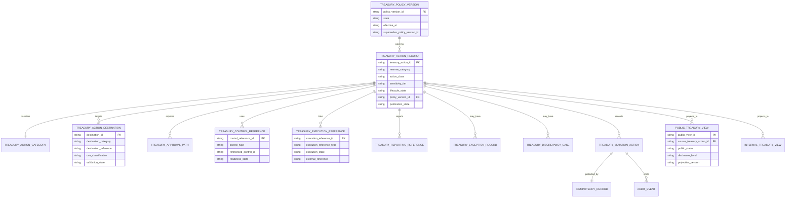
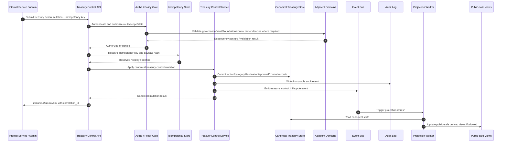

# TREASURY_CONTROL_POLICY_API_SPEC.md

## Document Metadata

- **Document Name:** `TREASURY_CONTROL_POLICY_API_SPEC.md`
- **Document Type:** Production-grade FUZE API SPEC v2
- **Status:** Draft API SPEC v2 generated from active refined system semantics
- **Version:** 2.0.0-api-v2
- **Effective Date:** 2026-04-25
- **Last Updated:** 2026-04-25
- **Reviewed On:** 2026-04-25
- **Document Owner:** FUZE Treasury Control Policy Domain; named individual owner is not explicitly specified in the retrieved governing materials
- **Approval Authority:** Not explicitly specified in the retrieved governing materials; constitutional approval authority remains governed by `REFINED_SYSTEM_SPEC_INDEX.md` and active FUZE approval workflow
- **Review Cadence:** Quarterly and whenever treasury architecture, Foundation boundaries, vault-action posture, multisig/timelock posture, payout funding posture, transparency posture, or public-trust-sensitive reserve treatment materially changes
- **Governing Layer:** API contract layer derived from platform governance / treasury-governed capital control architecture / category-aware treasury policy layer
- **Parent Registry:** API SPEC v2 Canonical File Registry
- **Upstream Semantic Registry:** `REFINED_SYSTEM_SPEC_INDEX.md`
- **Upstream API Registry:** `API_SPEC_INDEX.md`
- **Primary Audience:** Platform architecture, backend engineering, API engineering, contracts engineering, treasury/finance stakeholders, governance/control-plane authors, security engineering, audit/compliance, public-trust/reporting authors, QA, implementation-contract authors, SDK/OpenAPI/AsyncAPI authors
- **Primary Purpose:** Define the production-grade API contract for FUZE treasury-control policy surfaces without redefining treasury-control semantics owned by the active refined system specification
- **Primary Upstream References:** `REFINED_SYSTEM_SPEC_INDEX.md`, `API_SPEC_INDEX.md`, `DOCS_SPEC_INDEX.md`, `SYSTEM_SPEC_INDEX.md`, `TREASURY_CONTROL_POLICY_SPEC.md`, `GOVERNANCE_MODEL_SPEC.md`, `FOUNDATION_GOVERNANCE_SPEC.md`, `VAULT_ACTION_POLICY_SPEC.md`, `MULTISIG_AND_TIMELOCK_SPEC.md`, `PROFIT_PARTICIPATION_SYSTEM_SPEC.md`, `SNAPSHOT_AND_ELIGIBILITY_PIPELINE_SPEC.md`, `TRANSPARENCY_MODEL_SPEC.md`, `TRANSPARENCY_REPORTING_SPEC.md`, `PUBLIC_CONTRACT_AND_WALLET_REGISTRY_SPEC.md`, `CHAIN_ARCHITECTURE_SPEC.md`, `API_ARCHITECTURE_SPEC.md`, `PUBLIC_API_SPEC.md`, `INTERNAL_SERVICE_API_SPEC.md`, `EVENT_MODEL_AND_WEBHOOK_SPEC.md`, `IDEMPOTENCY_AND_VERSIONING_SPEC.md`, `MIGRATION_AND_BACKWARD_COMPATIBILITY_SPEC.md`, `AUDIT_LOG_AND_ACTIVITY_SPEC.md`, `SECURITY_AND_RISK_CONTROL_SPEC.md`, `MONITORING_ALERTING_AND_INCIDENT_RESPONSE_SPEC.md`
- **Primary Downstream Dependents:** Treasury-control backend services, governance/control-plane tooling, vault-action policy APIs, Foundation governance APIs, multisig/timelock APIs, profit-participation funding workflows, transparency/reporting APIs, public-safe treasury reporting surfaces, audit/monitoring systems, OpenAPI/AsyncAPI contracts, SDKs, implementation-contract specs, discrepancy/remediation runbooks
- **API Surface Families Covered:** Public-read, first-party authenticated read, internal service, admin/control-plane, event/async, reporting/export, chain-adjacent reference surfaces
- **API Surface Families Excluded:** Raw contract ABI endpoints, low-level multisig signer custody APIs, raw treasury accounting exports, full payout execution APIs, generic product-budget APIs, unbounded public treasury-detail APIs, legal-review workflow APIs
- **Canonical System Owner(s):** Treasury Control Policy Domain for treasury-control truth; adjacent owners include Governance Model, Foundation Governance, Vault Action Policy, Multisig/Timelock, Profit Participation, Transparency/Reporting, Public Registry, Chain Architecture, Audit/Activity, and Security/Risk domains
- **Canonical API Owner:** Treasury Control Policy API Domain
- **Supersedes:** Historical v1 `TREASURY_CONTROL_POLICY_API_SPEC.md` where weaker, less explicit, or not in API SPEC v2 format
- **Superseded By:** Not yet known
- **Related Decision Records:** Not explicitly specified in the retrieved governing materials
- **Canonical Status Note:** This API spec is canonical for interface-contract expression only. It MUST preserve, not redefine, `TREASURY_CONTROL_POLICY_SPEC.md` semantics.
- **Implementation Status:** Normative API contract target; downstream implementation must align before production reliance
- **Approval Status:** Draft pending explicit FUZE approval workflow
- **Change Summary:** Upgrades the existing treasury-control API posture into API SPEC v2 format with stronger surface-family separation, owner-domain mutation discipline, accepted-state semantics, idempotency/replay rules, public-safe read rules, audit/observability requirements, diagrams, acceptance criteria, and implementation-grade test cases.

## Title

FUZE Treasury Control Policy API Specification

## Purpose

This API specification defines how FUZE exposes, mutates, reads, audits, projects, reports, and integrates treasury-control policy behavior at the interface layer.

The API exists because treasury-controlled capital may only be activated through explicit category-aware policy, bounded authority, destination/use discipline, auditability, and governance pathways. The interface contract must preserve the semantic rule that treasury control is a distinct governance domain and not a generic wallet-transfer, admin approval, public-dashboard, or contract-execution convenience layer.

This document governs API contract truth. It does not own semantic truth. The active refined `TREASURY_CONTROL_POLICY_SPEC.md` owns treasury-control semantics.

## Scope

This specification governs:

1. Public-safe treasury-control policy and treasury-action read surfaces.
2. First-party authenticated read surfaces for bounded treasury-related summaries.
3. Internal service APIs for treasury policy versions, treasury-sensitive actions, reserve-category classification, action-class classification, sensitivity-tier assignment, destination/use restrictions, approval-path records, control references, execution references, reporting references, discrepancy cases, and exception records.
4. Admin/control-plane APIs for reason-coded approval, rejection, pause, escalation, exceptional handling, supersession, discrepancy resolution, and public-visibility control.
5. Event and async API behavior for lifecycle changes, read-model projection, reporting linkage, and remediation.
6. Chain-adjacent reference APIs that link treasury-control truth to on-chain execution references without collapsing execution truth into policy truth.
7. Request, response, status, error, idempotency, retry, rate-limit, audit, observability, migration, versioning, OpenAPI, AsyncAPI, and SDK derivation guardrails.

## Out of Scope

This specification does not govern:

1. Full smart-contract implementation of any treasury, Foundation, vault, vesting, or control contract.
2. Exact multisig signer identity, quorum configuration, key custody, or timelock delay parameters.
3. Full Foundation stewardship semantics.
4. Vault-specific allowed-use matrices in full detail.
5. Payout-cycle execution, eligibility truth, claim truth, or payout-ledger settlement truth.
6. Raw treasury accounting-book exports.
7. Full public transparency-report composition.
8. Low-level chain-node, explorer, indexer, ABI, or wallet UX internals.
9. Generic product budget approvals that are not treasury-sensitive.
10. Future DAO-lite participation mechanics unless separately activated by approved governance specifications.

## Design Goals

1. Preserve treasury-control semantic truth in every API surface.
2. Prevent route, schema, ownership, authorization, public-exposure, event, and implementation drift.
3. Make reserve category, action class, sensitivity tier, destination/use restrictions, policy version, approval path, control references, execution references, reporting references, and correction lineage explicit.
4. Separate proposal, approval, execution-linkage, reporting, and public-safe publication.
5. Preserve public/internal/admin/control/event distinction.
6. Ensure all treasury-sensitive mutations are idempotent, audited, reason-coded where privileged, observable, and replay-safe.
7. Ensure derived public views remain bounded and subordinate to canonical treasury-control records.
8. Support OpenAPI, AsyncAPI, SDK, QA, regression testing, audit review, and implementation-contract derivation without permitting downstream reinterpretation.

## Non-Goals

1. This spec does not make all treasury reserve categories interchangeable.
2. This spec does not allow product urgency, public convenience, operator discretion, or provider/chain output to override treasury-control policy.
3. This spec does not replace multisig/timelock enforcement with procedural trust.
4. This spec does not expose internal treasury governance detail through public APIs by default.
5. This spec does not transform derived reporting views into canonical owner-domain truth.
6. This spec does not define exact money-movement execution mechanics.

## Core Principles

1. **Refined semantics first:** APIs MUST derive from the active refined treasury-control specification.
2. **Treasury is not one pool:** Reserve category MUST remain explicit and MUST affect allowed action, approval, destination, reporting, and public-exposure posture.
3. **Proposal, approval, execution, and reporting are separate:** No endpoint may collapse these lifecycle phases into a single unreviewable mutation.
4. **Control references are not execution truth:** Multisig, timelock, emergency authority, and exceptional-path references indicate control posture; they do not by themselves prove final execution.
5. **Execution references are not policy truth:** Chain transactions and operational execution artifacts are linked outcomes, not semantic owners.
6. **Public-safe views are derived:** Public summaries, dashboards, exports, registry links, and transparency references MUST remain subordinate to canonical treasury-control records.
7. **Exceptional handling is narrow:** Emergency and exceptional APIs MUST be bounded, reason-coded, audited, time-limited or review-gated, and followed by post-review.
8. **Replay safety is mandatory:** All mutations that create, approve, reject, pause, escalate, supersede, link, remediate, publish, or correct treasury-control state MUST require idempotency protection.
9. **Fail closed:** Authorization, policy, destination, sensitivity, control-path, or lineage ambiguity MUST fail closed.

## Canonical Definitions

- **Treasury-Controlled Capital:** Capital governed under FUZE treasury-control policy, including treasury-governed and treasury-adjacent reserve categories with category-specific constraints.
- **Reserve Category:** The canonical category used to interpret the purpose, allowable action space, reporting posture, and trust meaning of a treasury-controlled capital pool.
- **Treasury-Sensitive Action:** A control-relevant action affecting treasury-controlled capital, treasury configuration, treasury-linked payout funding, or reserve-category interpretation.
- **Action Class:** A governed class of treasury-sensitive action, including observation/reporting, administrative configuration, internal coordination, category deployment, payout-related funding, and exceptional/emergency action.
- **Sensitivity Tier:** The risk and trust significance level attached to a treasury-sensitive action.
- **Destination Category:** The canonical classification of where treasury-controlled capital is intended to move or what it will affect.
- **Treasury Policy Version:** The canonical policy record describing active treasury-control rules and version lineage.
- **Treasury Control Reference:** A structured reference to bounded control mechanisms such as multisig, timelock, emergency authority, or exceptional path.
- **Treasury Execution Reference:** A bounded reference to downstream contract or operational execution artifact linked to an approved treasury action.
- **Treasury Reporting Reference:** A structured reference to transparency, registry, payout, investor/community, or public-safe reporting artifact linked to a treasury-sensitive action.
- **Public-Safe Treasury View:** A derived read model suitable for public exposure after policy and disclosure checks.

## Truth Class Taxonomy

The API MUST preserve these truth classes:

1. **Semantic truth:** Owned by `TREASURY_CONTROL_POLICY_SPEC.md`.
2. **API contract truth:** Owned by this API spec; governs routes, request/response shape, statuses, errors, idempotency, authorization, events, and projections.
3. **Policy truth:** Treasury policy versions, reserve-category rules, action classes, sensitivity tiers, destination/use restrictions, and approval-path posture.
4. **Runtime truth:** Async jobs, projection lag, retry state, discrepancy workflows, remediation work, and degraded-mode state.
5. **Execution truth:** Chain or operational execution artifacts linked to treasury actions but not owned by treasury-control policy.
6. **Audit truth:** Immutable audit/activity records for treasury-control access, decisions, mutations, corrections, and publication.
7. **Reporting/public-read truth:** Public-safe summaries, transparency references, registry links, exports, and stakeholder reports derived from canonical treasury-control records.
8. **Provider/chain-input truth:** External observations, chain events, explorer data, or provider callbacks before owner-domain validation.
9. **Projection truth:** Cached or indexed views derived from canonical treasury-control state.
10. **Presentation truth:** UI labels, status wording, dashboard summaries, and explanatory copy.

These classes MUST NOT be collapsed into a single treasury dashboard, omnibus admin route, or wallet-transfer API.

## Architectural Position in the Spec Hierarchy

This API spec sits below:

- `REFINED_SYSTEM_SPEC_INDEX.md`
- `DOCS_SPEC_INDEX.md`
- `SYSTEM_SPEC_INDEX.md`
- `API_SPEC_INDEX.md`
- `SYSTEM_BOUNDARY_AND_OWNERSHIP_SPEC.md`
- `SYSTEM_OVERVIEW_AND_BOUNDARIES_SPEC.md`
- `PLATFORM_ARCHITECTURE_SPEC.md`
- `DOMAIN_OWNERSHIP_MATRIX_SPEC.md`
- `DATA_MODEL_AND_ENTITY_OWNERSHIP_SPEC.md`
- `ONCHAIN_OFFCHAIN_RESPONSIBILITY_SPEC.md`
- `GOVERNANCE_MODEL_SPEC.md`
- `TREASURY_CONTROL_POLICY_SPEC.md`

It sits alongside or above downstream implementation-contract layers for:

- treasury-control backend route implementation
- admin/control-plane UX contracts
- public-safe treasury reporting APIs
- event and webhook contracts
- OpenAPI and AsyncAPI artifacts
- QA and regression test suites
- discrepancy/remediation runbooks

## Upstream Semantic Owners

Primary semantic owner:

- `TREASURY_CONTROL_POLICY_SPEC.md`

Material adjacent semantic owners:

- `GOVERNANCE_MODEL_SPEC.md` for higher-order governance classification, approval posture, exceptional governance, future participation boundaries, and public-safe governance visibility.
- `FOUNDATION_GOVERNANCE_SPEC.md` for Foundation stewardship, principal preservation, allowed-use/restricted-use treatment, and Foundation-sensitive actions.
- `VAULT_ACTION_POLICY_SPEC.md` for what each vault category may meaningfully do.
- `MULTISIG_AND_TIMELOCK_SPEC.md` for threshold, queue, arming, ready, execution-window, cancellation, expiry, pause, supersession, and emergency-override control semantics.
- `PROFIT_PARTICIPATION_SYSTEM_SPEC.md`, `SNAPSHOT_AND_ELIGIBILITY_PIPELINE_SPEC.md`, and `PAYOUT_LEDGER_SPEC.md` for payout/eligibility/payout-ledger truth.
- `TRANSPARENCY_MODEL_SPEC.md`, `TRANSPARENCY_REPORTING_SPEC.md`, and `INVESTOR_AND_COMMUNITY_REPORTING_SPEC.md` for public-trust interpretation and recurring reporting.
- `PUBLIC_CONTRACT_AND_WALLET_REGISTRY_SPEC.md` for official public designation of wallets/contracts.
- `CHAIN_ARCHITECTURE_SPEC.md` and `ONCHAIN_OFFCHAIN_RESPONSIBILITY_SPEC.md` for chain-adjacent truth boundaries.

## API Surface Families

### Public-Read Surface

Public users MAY read only published, public-safe treasury policy summaries and treasury-action summaries. Public routes MUST NOT expose internal approval rationale, signer identity, internal risk notes, private destination metadata, unreleased actions, remediation internals, or raw treasury accounting.

### First-Party Authenticated Surface

First-party clients MAY read bounded treasury-related summaries where the authenticated actor has visibility. This surface MUST NOT add mutation authority.

### Internal Service Surface

Internal service APIs MAY create and maintain canonical treasury-control records when called by explicitly authorized service identities. Internal service APIs MUST NOT act as hidden broad-write shortcuts.

### Admin / Control-Plane Surface

Admin APIs MAY approve, reject, pause, escalate, mark exceptional, supersede, resolve discrepancy, and manage publication posture only through privileged, policy-scoped, reason-coded, audited operations.

### Event / Async Surface

Events MUST represent lifecycle changes and projection triggers. Async accepted responses MUST distinguish accepted intent from final business outcome.

### Reporting / Export Surface

Reporting and export APIs MUST derive from canonical treasury-control records and MUST preserve source references, policy version, correction lineage, and public-safe filtering.

### Chain-Adjacent Surface

Chain-adjacent APIs MAY attach or read execution/control references. They MUST NOT treat chain observation alone as canonical treasury-control approval, policy, reporting, or correction truth.

## System / API Boundaries

This API governs how treasury-control semantics are expressed at the interface layer. It does not own contract execution, raw accounting, Foundation governance, vault-action policy, multisig/timelock internals, or public transparency composition.

Every route MUST preserve owner-domain mutation boundaries. A route that mutates treasury-control records MUST be owned by Treasury Control Policy API. A route that mutates vault, Foundation, payout, multisig/timelock, registry, or transparency truth MUST live in that domain and reference treasury-control records rather than mutate them as a side effect.

## Adjacent API Boundaries

- `GOVERNANCE_MODEL_API_SPEC.md` governs cross-cutting governance scope/action APIs. Treasury-control APIs consume governance posture and provide treasury-specific action records.
- `FOUNDATION_GOVERNANCE_API_SPEC.md` governs Foundation-specific action and principal-treatment APIs. Treasury-control APIs must escalate or defer Foundation-sensitive flows rather than weakening them.
- `VAULT_ACTION_POLICY_API_SPEC.md` governs vault-category allowed behavior. Treasury-control APIs govern how treasury-sensitive actions are controlled.
- `MULTISIG_AND_TIMELOCK_API_SPEC.md` governs thresholded/delayed control staging. Treasury-control APIs attach control references and require readiness checks but do not own signer/timelock internals.
- `PROFIT_PARTICIPATION_API_SPEC.md`, `SNAPSHOT_AND_ELIGIBILITY_PIPELINE_API_SPEC.md`, and `PAYOUT_LEDGER_API_SPEC.md` govern payout truth. Treasury-control APIs govern payout-funding as a treasury-sensitive formal event.
- `TRANSPARENCY_REPORTING_API_SPEC.md` and `INVESTOR_AND_COMMUNITY_REPORTING_API_SPEC.md` govern report composition. Treasury-control APIs provide source-linked reporting references.
- `PUBLIC_CONTRACT_AND_WALLET_REGISTRY_API_SPEC.md` governs public registry truth. Treasury-control APIs may link official wallet/contract references.
- `CHAIN_ARCHITECTURE_API_SPEC.md` governs chain architecture boundaries. Treasury-control APIs only reference chain execution artifacts.

## Conflict Resolution Rules

1. Active refined system specs override API v1 text.
2. `TREASURY_CONTROL_POLICY_SPEC.md` wins on treasury-control semantics.
3. `GOVERNANCE_MODEL_SPEC.md` wins on higher-order governance semantics.
4. `FOUNDATION_GOVERNANCE_SPEC.md` wins on Foundation stewardship semantics.
5. `VAULT_ACTION_POLICY_SPEC.md` wins on what vault categories may meaningfully do.
6. `MULTISIG_AND_TIMELOCK_SPEC.md` wins on multisig/timelock control-path semantics.
7. Payout, transparency, registry, chain, audit, and security specs win within their narrower domains.
8. This API spec wins only on treasury-control interface-contract expression.
9. Public dashboards, exports, UI labels, cached views, SDK conveniences, or route shortcuts never override canonical owner-domain truth.
10. Ambiguity MUST resolve to the more conservative, auditable, public-trust-preserving interpretation.

## Default Decision Rules

1. Missing reserve category, action class, sensitivity tier, policy version, destination/use rationale, or approval path blocks mutation.
2. Ambiguous reserve category defaults to higher-sensitivity review.
3. Ambiguous destination or use rationale defaults to disallowed or review-required.
4. Payout-related funding defaults to formal treasury-sensitive event treatment.
5. Foundation-sensitive flows default to stronger restraint and Foundation-governance consultation.
6. Public exposure defaults to narrow structural explanation.
7. Admin/operator override defaults to unavailable unless explicitly allowed, reason-coded, policy-scoped, audited, and reviewable.
8. Derived views may lag, but they MUST be reconcilable and MUST NOT invent state.
9. Chain execution reference without matching treasury-control approval remains unvalidated execution-input truth.
10. If idempotency or audit capture fails for a mutation, the mutation MUST fail closed or enter a contained recovery path.

## Roles / Actors / API Consumers

- **Public observer:** Reads published public-safe treasury policy/action summaries.
- **Holder/community observer:** Reads public-safe treasury explanations and reporting links.
- **Authenticated first-party user:** Reads bounded treasury-related records where visibility is allowed.
- **Internal treasury-control service:** Creates and maintains canonical treasury-control state.
- **Governance service:** Provides governance posture and approval linkage.
- **Vault/Foundation services:** Provide narrower category or Foundation policy references.
- **Multisig/timelock service:** Provides control references and readiness/queue state.
- **Chain execution service:** Provides execution references after approved control paths.
- **Transparency/reporting service:** Consumes reporting references and source records.
- **Audit/monitoring service:** Records immutable activity and observes control-plane health.
- **Privileged operator:** Performs bounded admin/control-plane actions.
- **Security/incident operator:** Performs pause, containment, escalation, or exceptional actions under stronger policy.

## Resource / Entity Families

Canonical API resource families:

1. `treasury_policy_versions`
2. `treasury_action_records`
3. `treasury_action_categories`
4. `treasury_action_destinations`
5. `treasury_action_approval_paths`
6. `treasury_action_control_references`
7. `treasury_action_execution_references`
8. `treasury_action_reporting_references`
9. `treasury_exception_records`
10. `treasury_discrepancy_cases`
11. `treasury_mutation_actions`
12. `treasury_public_policy_views`
13. `treasury_public_action_views`
14. `treasury_internal_status_views`
15. `treasury_export_jobs`
16. `treasury_idempotency_records`
17. `treasury_audit_events`

## Ownership Model

The Treasury Control Policy API owns canonical write APIs for treasury-control records and derived public-safe read APIs for treasury-control summaries. It does not own the final contract transaction, vault-allowed-use decision, Foundation principal-treatment decision, payout eligibility, payout ledger, public report composition, or raw accounting system.

Downstream APIs MUST reference treasury-control records by stable IDs and MUST NOT create local shadow treasury approvals, local treasury policy versions, or narrative-only treasury action records.

## Authority / Decision Model

Treasury-control API authority is layered:

1. **Authentication** proves caller identity.
2. **Authorization** proves route, scope, role, service identity, and actor permission.
3. **Treasury policy evaluation** proves reserve-category/action/destination/sensitivity compatibility.
4. **Adjacent-domain validation** proves Foundation, vault, payout, registry, chain, or multisig/timelock dependencies where relevant.
5. **Control-path validation** proves required approval/timelock/multisig/exception posture.
6. **Idempotency validation** proves safe mutation attempt handling.
7. **Audit capture** proves traceable decision lineage.
8. **Mutation termination** commits canonical treasury-control state or fails closed.

## Authentication Model

- Public-read routes require no user authentication but MUST enforce publication and public-safe filtering.
- First-party authenticated routes require valid session identity and visibility checks.
- Internal routes require service-to-service authentication with explicit service scopes.
- Admin/control-plane routes require privileged operator authentication, step-up requirements where configured, least-privilege role evaluation, reason code, and audit lineage.
- Event consumers require signed event delivery, consumer identity, topic authorization, replay protection, and version validation.

## Authorization / Scope / Permission Model

Required authorization dimensions:

1. `treasury_policy:read_public`
2. `treasury_policy:read_internal`
3. `treasury_policy:create`
4. `treasury_policy:activate`
5. `treasury_action:read_public`
6. `treasury_action:read_internal`
7. `treasury_action:create`
8. `treasury_action:classify`
9. `treasury_action:link_destination`
10. `treasury_action:link_approval_path`
11. `treasury_action:link_control_reference`
12. `treasury_action:link_execution_reference`
13. `treasury_action:link_reporting_reference`
14. `treasury_action:approve`
15. `treasury_action:reject`
16. `treasury_action:pause`
17. `treasury_action:escalate`
18. `treasury_action:declare_exception`
19. `treasury_action:supersede`
20. `treasury_discrepancy:resolve`
21. `treasury_publication:publish`
22. `treasury_publication:restrict`
23. `treasury_export:create`

Permissions MUST be evaluated against route family, actor identity, service identity, reserve category, action class, sensitivity tier, policy version, action state, and adjacent-domain constraints.

## Entitlement / Capability-Gating Model

Entitlement is not treasury authority. Product entitlement, token status, community visibility, investor classification, or stakeholder status MUST NOT grant mutation permission. Entitlements MAY affect access to certain public-safe or authenticated summary views only when policy allows.

## API State Model

### Treasury Policy Version States

- `draft`
- `active`
- `deprecated`
- `superseded`
- `archived`

### Treasury Action States

- `draft`
- `proposed`
- `under_review`
- `approved`
- `rejected`
- `ready_for_execution`
- `execution_submitted`
- `executed_reference_linked`
- `reported`
- `paused`
- `exception_declared`
- `superseded`
- `closed`

### Approval Path States

- `proposal_recorded`
- `approval_pending`
- `approved`
- `rejected`
- `execution_linked`
- `closed`

### Exceptional Action States

- `declared`
- `containment_active`
- `post_review_pending`
- `closed`
- `superseded`

### Discrepancy States

- `opened`
- `under_review`
- `resolved`
- `failed`
- `closed`

### Publication States

- `internal_only`
- `public_pending`
- `published`
- `restricted`
- `corrected`
- `superseded`

## Lifecycle / Workflow Model

1. A treasury-sensitive action is proposed through internal or admin-controlled APIs.
2. Reserve category, action class, sensitivity tier, destination category, use rationale, policy version, and adjacent-domain constraints are validated.
3. The approval path is recorded before material approval.
4. Control references are attached where required.
5. Privileged approval, rejection, pause, escalation, or exceptional treatment occurs through reason-coded admin/control-plane APIs.
6. Approved actions may become ready for execution.
7. Execution references may be linked after downstream execution path starts or completes.
8. Reporting references may be linked before or after execution depending on policy.
9. Public-safe views are projected only after publication policy checks.
10. Discrepancies, corrections, and supersessions preserve historical meaning.

## Architecture Diagram — Mermaid flowchart

## Data Design — Mermaid Diagram

## Flow View

### Standard Treasury-Sensitive Action Flow

1. Caller submits action creation request with idempotency key.
2. API authenticates caller and checks internal service or admin authorization.
3. API validates reserve category, action class, sensitivity tier, policy version, and source-domain references.
4. API creates canonical treasury action in `draft` or `proposed` state.
5. API emits `treasury_control.action_created` and writes audit record.
6. Destination/use records are attached and validated.
7. Approval path is recorded with proposal, approval, and execution role separation.
8. Control references are attached where required.
9. Admin approves, rejects, pauses, escalates, or declares exceptional treatment with reason code.
10. Approved action becomes `approved` or `ready_for_execution` depending on required control-path readiness.
11. Execution reference is linked by execution-owning service after downstream execution path.
12. Reporting reference is linked to transparency, registry, payout, or stakeholder report artifacts.
13. Public-safe projection worker emits bounded views if publication policy permits.
14. Corrections or supersessions preserve prior lineage and trigger projection refresh.

### Failure / Retry Flow

1. Duplicate request with same idempotency key returns original result when semantically identical.
2. Duplicate key with mismatched payload returns idempotency conflict.
3. Policy ambiguity fails closed.
4. Dependency outage returns accepted/retryable or dependency-unavailable status without creating contradictory state.
5. Partial projection failure leaves canonical state intact and opens remediation task if public view would become stale or misleading.

### Admin / Exceptional Flow

1. Operator authenticates with privileged identity.
2. API requires reason code, operator note, correlation ID, and idempotency key.
3. Policy gate validates exceptional authority and narrower-than-ordinary scope.
4. Containment state is recorded.
5. Audit and event records are emitted.
6. Post-review workflow is required before closure.
7. Public-safe explanation is published only if disclosure policy permits.

## Data Flows — Mermaid sequenceDiagram

## Request Model

All mutation requests MUST include:

- `idempotency_key`
- `correlation_id` or generated correlation context
- `request_actor` or service identity context
- `policy_version_reference` when policy applies
- resource identifiers using canonical IDs
- reason code for admin/control-plane mutations
- explicit reserve category, action class, sensitivity tier, destination/use information where relevant

Mutation requests MUST NOT include:

- frontend-authored treasury truth as authoritative input
- public-facing status labels as canonical state
- raw private notes intended for public exposure
- hidden destination or unclassified use rationale
- chain transaction hash as proof of approval
- operator override without policy-bound reason code

## Response Model

Success responses MUST include:

- stable resource ID
- lifecycle state
- publication state where relevant
- policy version reference
- reserve category, action class, sensitivity tier summary
- destination/control/execution/reporting reference summaries where relevant
- `correlation_id`
- `operation_id` for async flows
- `idempotency_replayed: true|false` where appropriate
- timestamps

Accepted async responses MUST include:

- `status: accepted`
- `operation_id`
- current accepted-state meaning
- follow-up status route or event expectation
- statement that accepted does not equal final business outcome

Public responses MUST include only public-safe fields and MUST distinguish:

- public action status
- correction/supersession status
- reporting references
- registry references where published
- projection timestamp/version

## Error / Result / Status Model

Error responses MUST follow structured problem-details style:

- `type`
- `title`
- `status`
- `code`
- `detail`
- `instance`
- `correlation_id`
- `retryable`
- optional `operation_id`

Required error codes include:

- `TREASURY_CONTROL_AUTHENTICATION_REQUIRED`
- `TREASURY_CONTROL_PERMISSION_DENIED`
- `TREASURY_CONTROL_SERVICE_PERMISSION_DENIED`
- `TREASURY_CONTROL_OPERATOR_PERMISSION_DENIED`
- `TREASURY_CONTROL_PUBLIC_VISIBILITY_DENIED`
- `TREASURY_CONTROL_POLICY_VERSION_REQUIRED`
- `TREASURY_CONTROL_POLICY_VERSION_INACTIVE`
- `TREASURY_CONTROL_RESERVE_CATEGORY_REQUIRED`
- `TREASURY_CONTROL_ACTION_CLASS_REQUIRED`
- `TREASURY_CONTROL_SENSITIVITY_TIER_REQUIRED`
- `TREASURY_CONTROL_DESTINATION_REQUIRED`
- `TREASURY_CONTROL_DESTINATION_NOT_ALLOWED`
- `TREASURY_CONTROL_USE_RESTRICTED`
- `TREASURY_CONTROL_FOUNDATION_RESTRICTION`
- `TREASURY_CONTROL_VAULT_POLICY_CONFLICT`
- `TREASURY_CONTROL_APPROVAL_PATH_REQUIRED`
- `TREASURY_CONTROL_CONTROL_REFERENCE_REQUIRED`
- `TREASURY_CONTROL_ACTION_STATE_INVALID`
- `TREASURY_CONTROL_ACTION_ALREADY_TERMINAL`
- `TREASURY_CONTROL_EXECUTION_REFERENCE_INVALID`
- `TREASURY_CONTROL_REPORTING_REFERENCE_INVALID`
- `TREASURY_CONTROL_IDEMPOTENCY_KEY_REQUIRED`
- `TREASURY_CONTROL_IDEMPOTENCY_CONFLICT`
- `TREASURY_CONTROL_RATE_LIMITED`
- `TREASURY_CONTROL_DEPENDENCY_UNAVAILABLE`
- `TREASURY_CONTROL_PROJECTION_STALE`
- `TREASURY_CONTROL_SUPERSESSION_CONFLICT`
- `TREASURY_CONTROL_EXCEPTION_NOT_ALLOWED`
- `TREASURY_CONTROL_AUDIT_WRITE_FAILED`

## Idempotency / Retry / Replay Model

Idempotency is mandatory for all non-read APIs.

Rules:

1. Idempotency scope MUST include caller identity, route family, target resource, payload hash, policy version, and operation type.
2. Identical replay returns original terminal or accepted result.
3. Mismatched payload with same key returns `TREASURY_CONTROL_IDEMPOTENCY_CONFLICT`.
4. Idempotency records MUST be retained long enough to cover client retries, async completion, and audit review.
5. Admin/control-plane idempotency records MUST be audit-linked.
6. Async execution reference linking MUST be idempotent against duplicate chain/provider callbacks.
7. Event consumers MUST implement replay-safe processing by event ID and source record version.

## Rate Limit / Abuse-Control Model

- Public-read APIs MUST be rate-limited by IP/client class and protected against enumeration.
- First-party APIs MUST be rate-limited by account/session/client.
- Internal APIs MUST enforce service quota and anomaly detection.
- Admin APIs MUST enforce stricter velocity controls, approval throttles, privileged action alerts, and high-sensitivity action review gates.
- Rate limiting MUST NOT silently suppress canonical mutation results; it must return explicit structured errors.

## Endpoint / Route Family Model

### Public-Read Routes

- `GET /v2/treasury-control/policies`
- `GET /v2/treasury-control/policies/{policy_version_id}`
- `GET /v2/treasury-control/actions`
- `GET /v2/treasury-control/actions/{treasury_action_id}`
- `GET /v2/treasury-control/actions/{treasury_action_id}/public-lineage`

### First-Party Authenticated Read Routes

- `GET /v2/treasury-control/me/actions`
- `GET /v2/treasury-control/me/references`

### Internal Service Routes

- `POST /internal/v2/treasury-control/policy-versions`
- `POST /internal/v2/treasury-control/actions`
- `POST /internal/v2/treasury-control/actions/{treasury_action_id}/categories`
- `POST /internal/v2/treasury-control/actions/{treasury_action_id}/destinations`
- `POST /internal/v2/treasury-control/actions/{treasury_action_id}/approval-paths`
- `POST /internal/v2/treasury-control/actions/{treasury_action_id}/control-references`
- `POST /internal/v2/treasury-control/actions/{treasury_action_id}/execution-references`
- `POST /internal/v2/treasury-control/actions/{treasury_action_id}/reporting-references`
- `GET /internal/v2/treasury-control/actions/{treasury_action_id}`
- `GET /internal/v2/treasury-control/policy-versions/{policy_version_id}`

### Admin / Control-Plane Routes

- `POST /admin/v2/treasury-control/actions/{treasury_action_id}/approve`
- `POST /admin/v2/treasury-control/actions/{treasury_action_id}/reject`
- `POST /admin/v2/treasury-control/actions/{treasury_action_id}/pause`
- `POST /admin/v2/treasury-control/actions/{treasury_action_id}/escalate`
- `POST /admin/v2/treasury-control/actions/{treasury_action_id}/declare-exception`
- `POST /admin/v2/treasury-control/actions/{treasury_action_id}/supersede`
- `POST /admin/v2/treasury-control/actions/{treasury_action_id}/publication`
- `POST /admin/v2/treasury-control/discrepancies/{discrepancy_id}/resolve`

### Reporting / Export Routes

- `POST /internal/v2/treasury-control/exports`
- `GET /internal/v2/treasury-control/exports/{export_job_id}`
- `GET /v2/treasury-control/public-exports/{public_export_id}` where explicitly approved

## Public API Considerations

Public APIs MUST be narrow, stable, cacheable, and public-safe. They MAY expose:

- policy version summaries
- reserve-category summaries
- public action status
- public-safe action class/sensitivity wording
- public reporting references
- public registry references
- correction/supersession lineage
- projection timestamps

Public APIs MUST NOT expose:

- internal operator notes
- unapproved actions
- private destination metadata
- raw risk scores
- signer identities or security-sensitive control details
- non-public treasury balances beyond approved reporting policy
- raw accounting records
- internal discrepancy/remediation notes

## First-Party Application API Considerations

First-party app APIs MUST use the same canonical resource IDs and status classes as internal APIs but filtered to actor visibility. First-party routes MUST NOT permit client-side mutation of treasury truth or act as convenience wrappers around admin APIs.

## Internal Service API Considerations

Internal service APIs MUST:

1. Use service identity with least privilege.
2. Require idempotency keys for mutations.
3. Preserve owner-domain write boundaries.
4. Validate adjacent-domain references.
5. Emit lifecycle events only after canonical mutation commit.
6. Use structured errors instead of silent fallback.

Internal APIs MUST NOT:

1. Accept broad JSON blobs as treasury-control truth.
2. Bypass policy version validation.
3. Mutate public views directly.
4. Treat chain/provider callbacks as owner-domain validation.
5. Implement hidden approval shortcuts.

## Admin / Control-Plane API Considerations

Admin/control-plane APIs MUST be:

- privileged
- least-privilege scoped
- reason-coded
- policy-constrained
- idempotent
- audit-linked
- observable
- reviewed for high/critical sensitivity actions
- separate from ordinary application APIs

Operator actions MUST NOT silently rewrite history. Corrections and supersessions MUST preserve prior state and lineage.

## Event / Webhook / Async API Considerations

Recommended internal event families:

- `treasury_control.policy_version_created`
- `treasury_control.policy_version_activated`
- `treasury_control.action_created`
- `treasury_control.category_classified`
- `treasury_control.destination_validated`
- `treasury_control.approval_path_recorded`
- `treasury_control.control_linked`
- `treasury_control.action_approved`
- `treasury_control.action_rejected`
- `treasury_control.action_paused`
- `treasury_control.action_escalated`
- `treasury_control.exception_declared`
- `treasury_control.execution_linked`
- `treasury_control.reporting_linked`
- `treasury_control.publication_changed`
- `treasury_control.action_superseded`
- `treasury_control.discrepancy_opened`
- `treasury_control.discrepancy_resolved`
- `treasury_control.projection_refreshed`

Event payloads MUST include:

- event ID
- event type
- source resource ID
- source resource version
- policy version reference
- lifecycle state
- correlation ID
- causation ID
- actor/service context where allowed
- public-safe flag where relevant

External webhooks MUST NOT expose internal-only treasury details unless explicitly approved by a public trust or partner contract.

## Chain-Adjacent API Considerations

Chain-adjacent behavior MUST follow these rules:

1. Treasury-control approval is off-chain policy truth.
2. On-chain transaction state is execution truth.
3. A chain transaction hash MAY be linked as execution reference only after owner-domain validation.
4. Multisig/timelock references MUST remain control references, not semantic treasury approval replacements.
5. Chain observations MUST be normalized before influencing treasury-control records.
6. Public chain links MUST be public-safe and registry-consistent.

## Data Model / Storage Support Implications

The storage layer SHOULD support at minimum:

- canonical treasury policy version table/store
- canonical treasury action record table/store
- category, action-class, sensitivity-tier records
- destination/use restriction records
- approval-path records
- control-reference records
- execution-reference records
- reporting-reference records
- exception records
- discrepancy cases
- mutation action records
- idempotency records
- audit events
- public-safe projections
- internal operational projections
- export job records

Storage MUST preserve lineage and MUST NOT destructively overwrite policy/action history.

## Read Model / Projection / Reporting Rules

1. Public-safe policy/action views are derived.
2. Internal status views are derived.
3. Reporting exports are derived.
4. Derived views MUST include source IDs, source versions, projection timestamps, and correction/supersession state.
5. Projection lag MUST be visible to internal monitoring and bounded for public-facing trust surfaces.
6. Reporting references are links, not ownership transfers.
7. Public-safe views MAY be restricted or corrected without deleting canonical history.

## Security / Risk / Privacy Controls

Required controls:

- least-privilege service and operator access
- reason-coded privileged mutations
- high-sensitivity approval gates
- Foundation-sensitive stronger gating
- destination/use restriction validation
- prevention of category drift
- anti-enumeration on public APIs
- protection of private notes and sensitive destinations
- audit write-before-success or atomic audit/commit pattern
- anomaly monitoring for approval velocity, rejected destination retries, escalation frequency, and public projection failures
- fail-closed behavior for policy and authorization uncertainty

## Audit / Traceability / Observability Requirements

All mutations MUST emit audit records containing:

- actor/service identity
- route family
- operation type
- target resource
- before/after state where permitted
- policy version
- reserve category
- action class
- sensitivity tier
- reason code where applicable
- idempotency key reference
- correlation ID
- causation ID
- adjacent-domain validation result references
- timestamp

Observability MUST track:

- mutation success/failure rates
- policy validation failures
- authorization denials
- idempotency conflicts
- public projection lag
- event delivery lag
- dependency outages
- high/critical action count
- exceptional-action lifecycle closure
- discrepancy age

## Failure Handling / Edge Cases

- **Missing policy version:** reject mutation.
- **Inactive policy version:** reject unless explicit migration route permits compatibility handling.
- **Ambiguous reserve category:** reject or escalate to higher-sensitivity review.
- **Destination changed after approval:** require revalidation, reason code, audit, and potentially new approval path.
- **Execution occurred without valid treasury approval:** open discrepancy; do not retroactively bless execution.
- **Projection stale:** keep canonical state; mark public view stale or suppress if misleading.
- **Audit unavailable:** fail closed for sensitive mutations or enter contained write-ahead recovery path.
- **Dependency unavailable:** return retryable dependency error or accepted async operation if no unsafe state is committed.
- **Duplicate provider/chain callback:** handle idempotently.
- **Exceptional action not post-reviewed:** keep exception open and alert until review closes.

## Migration / Versioning / Compatibility / Deprecation Rules

1. v1 route shapes MAY be temporarily supported through compatibility adapters.
2. Compatibility adapters MUST map to v2 canonical resources and statuses.
3. Legacy approvals or ad hoc admin sign-offs MUST be normalized into explicit treasury-control records or retired.
4. Historical labels MAY be preserved as lineage but MUST NOT override current canonical interpretation.
5. Deprecated fields MUST remain read-compatible only while migration is active.
6. Public API changes MUST be additive unless breaking change is approved and versioned.
7. Event schema changes MUST include version identifiers and replay-safe migration plan.
8. Migration MUST not collapse proposal, approval, execution, reporting, and publication into one state.

## OpenAPI / AsyncAPI / SDK Derivation Rules

OpenAPI artifacts MUST preserve:

- route-family separation
- public/internal/admin prefixes
- stable resource IDs
- required idempotency headers/body fields for mutations
- structured problem-details errors
- status enums
- lifecycle-state enums
- publication-state enums
- correlation ID requirements
- public-safe schemas separate from internal schemas

AsyncAPI artifacts MUST preserve:

- event type names
- source resource versioning
- replay-safe event IDs
- lifecycle event semantics
- public-safe flags
- consumer idempotency requirements

SDKs MUST NOT expose admin/control-plane methods through public or first-party client packages.

## Implementation-Contract Guardrails

Downstream implementation MUST preserve:

1. Treasury control remains distinct from source-domain truth and execution truth.
2. Reserve category, action class, sensitivity tier, destination/use restriction, and policy version remain explicit.
3. Proposal, approval, execution, reporting, and publication remain distinct lifecycle concepts.
4. Foundation-sensitive flows remain more conservative than ordinary treasury behavior.
5. Payout-funding treatment remains explicit.
6. Public-safe treasury visibility remains bounded and derived.
7. Exceptional treasury handling remains narrow and reviewable.
8. Correction and supersession lineage remain preserved.
9. Idempotency, replay safety, auditability, and observability remain mandatory.
10. Downstream teams MUST NOT create local treasury-control truth.

## Downstream Execution Staging

1. Stabilize v2 resource model and canonical IDs.
2. Map legacy v1 routes into v2 route families.
3. Implement idempotent internal mutation APIs.
4. Implement admin/control-plane reason-coded mutations.
5. Integrate governance, Foundation, vault, multisig/timelock, payout, registry, chain, transparency, audit, and monitoring references.
6. Implement public-safe projections.
7. Implement event and projection workers.
8. Implement discrepancy and correction workflows.
9. Generate OpenAPI/AsyncAPI artifacts.
10. Execute contract, security, audit, migration, and regression tests.

## Required Downstream Specs / Contract Layers

- Treasury-control OpenAPI v2 contract
- Treasury-control AsyncAPI event contract
- Treasury-control database/entity contract
- Treasury-control admin/control-plane implementation contract
- Treasury-control public-safe projection contract
- Treasury-control audit event contract
- Treasury-control remediation/discrepancy runbook
- Treasury-control migration plan from v1
- Multisig/timelock reference contract
- Payout funding linkage contract
- Transparency/reporting linkage contract

## Boundary Violation Detection / Non-Canonical API Patterns

Forbidden patterns:

1. Public route returns internal treasury approval notes.
2. Admin route approves and executes treasury action in one unseparated call.
3. Internal service writes public treasury summary directly.
4. Chain transaction hash is treated as proof of policy approval.
5. Payout funding is recorded as routine treasury movement.
6. Foundation-sensitive transfer is processed through ordinary treasury convenience.
7. Product team creates local treasury approval table.
8. Frontend submits final reserve category or sensitivity tier as authoritative truth.
9. Reporting page edits treasury-control history.
10. Supersession overwrites old state without preserving lineage.
11. Emergency route becomes ordinary shortcut authority.

## Canonical Examples / Anti-Examples

### Canonical Example — Category-Aware Treasury Deployment

A strategic treasury deployment is created with explicit reserve category, action class, sensitivity tier, destination, use rationale, active policy version, approval path, control reference, and reporting reference. Approval is reason-coded. Execution reference is linked after downstream execution. Public summary is derived after publication policy checks.

### Canonical Example — Payout Funding

A payout-cycle funding action is treated as treasury-sensitive, linked to payout-cycle readiness and reporting references, and not treated as routine internal movement.

### Canonical Example — Foundation-Sensitive Escalation

A proposed action touching Foundation-sensitive capital is escalated to Foundation governance and stronger control-path review before approval.

### Anti-Example — Omnibus Treasury Pool

An operator moves value between separated reserve categories because the business case sounds reasonable, without category-specific policy validation. This MUST be rejected or opened as a discrepancy.

### Anti-Example — Silent Public Rewrite

A public dashboard updates a treasury-action status without canonical action state change or correction/supersession lineage. This is forbidden.

## Acceptance Criteria

1. Public APIs expose only public-safe fields and never expose internal operator notes, private destinations, or unreleased actions.
2. Every mutation route requires idempotency protection and returns replay-safe behavior.
3. Admin/control-plane mutations require privileged identity, reason code, audit event, correlation ID, and policy validation.
4. Treasury action creation fails when reserve category, action class, sensitivity tier, policy version, or idempotency key is missing.
5. Destination changes after approval require revalidation and cannot silently preserve prior approval.
6. Foundation-sensitive actions trigger stronger validation or escalation.
7. Payout-funding actions are classified as treasury-sensitive formal events.
8. Chain execution references cannot create, approve, or retroactively validate treasury-control policy.
9. Public views include source resource version and projection timestamp.
10. Supersession preserves prior action lineage and does not destructively overwrite history.
11. Events are emitted only after canonical mutation commit.
12. Event consumers can replay safely by event ID and source version.
13. Public projection failures do not mutate canonical treasury state.
14. Migration adapters preserve v1 compatibility without hiding v2 canonical fields.
15. OpenAPI schemas distinguish public-safe, first-party, internal, and admin schemas.
16. Async accepted responses distinguish accepted intent from final business outcome.
17. Rate limiting returns structured errors and does not silently drop mutations.
18. Audit failure causes sensitive mutation to fail closed or enter approved recovery path.
19. Derived exports remain reconcilable to canonical treasury-control records.
20. Boundary-violation tests prevent local shadow treasury-control truth.

## Test Cases

### Positive Path Tests

1. Create treasury action with valid reserve category, action class, sensitivity tier, policy version, destination, and idempotency key; expect `201` and `treasury_control.action_created`.
2. Record approval path for proposed action; expect `approval_pending` and audit event.
3. Approve high-sensitivity action with privileged operator and reason code; expect `approved` or `ready_for_execution`.
4. Link multisig/timelock control reference; expect control-reference record and event.
5. Link execution reference after approved action; expect `executed_reference_linked` without changing semantic approval history.
6. Publish public-safe summary after reporting reference; expect derived view with projection version.

### Negative Path Tests

1. Create action without idempotency key; expect `TREASURY_CONTROL_IDEMPOTENCY_KEY_REQUIRED`.
2. Create action with inactive policy version; expect policy error.
3. Approve action without admin scope; expect permission denied.
4. Approve action with missing destination validation; expect approval-path or destination error.
5. Link chain transaction to unapproved action; expect execution-reference invalid or discrepancy workflow.
6. Public request for internal-only action; expect not found or visibility denied without leaking existence.

### Authorization / Entitlement Tests

1. Product-entitled user attempts mutation; expect permission denied.
2. Internal service without treasury scope attempts action creation; expect service permission denied.
3. Admin with read-only role attempts approval; expect operator permission denied.
4. Public user reads published summary; expect public-safe schema only.

### Idempotency / Retry / Replay Tests

1. Replay identical create request with same key; expect same result and `idempotency_replayed=true`.
2. Replay same key with changed payload; expect idempotency conflict.
3. Duplicate chain callback for same execution reference; expect idempotent result.
4. Event replay by consumer; expect no duplicate projection side effects.

### Conflict / Boundary Tests

1. Treasury action conflicts with vault policy; expect `TREASURY_CONTROL_VAULT_POLICY_CONFLICT`.
2. Foundation-sensitive action processed as ordinary treasury action; expect Foundation restriction or escalation.
3. Payout-funding action classified as routine transfer; expect validation error.
4. Public projection attempts to change canonical state; expect forbidden implementation test failure.

### Rate-Limit / Abuse-Control Tests

1. Public enumeration attempts exceed threshold; expect structured rate-limit error.
2. Admin performs abnormal approval burst; expect alert and throttle/escalation behavior.
3. Repeated destination-denied mutations trigger abuse telemetry.

### Degraded-Mode / Failure Tests

1. Audit store unavailable during approval; expect fail closed or contained recovery.
2. Projection worker delayed; expect canonical state intact and public view stale/held.
3. Adjacent-domain validation service unavailable; expect dependency-unavailable or async accepted only when safe.
4. Event bus temporarily unavailable; expect outbox/retry without duplicate canonical mutation.

### Migration / Compatibility Tests

1. v1 route maps to v2 canonical resource model without losing reserve category or policy version.
2. Legacy admin approval without reason code is rejected or normalized through migration workflow.
3. Deprecated public fields remain read-compatible but not authoritative.

### Audit / Observability Tests

1. Every mutation includes audit event with actor, operation, target, policy version, idempotency reference, and correlation ID.
2. Monitoring records projection lag and discrepancy age.
3. Exceptional action cannot close without post-review audit linkage.

## Dependencies / Cross-Spec Links

- `REFINED_SYSTEM_SPEC_INDEX.md`
- `API_SPEC_INDEX.md`
- `DOCS_SPEC_INDEX.md`
- `SYSTEM_SPEC_INDEX.md`
- `TREASURY_CONTROL_POLICY_SPEC.md`
- `GOVERNANCE_MODEL_SPEC.md`
- `FOUNDATION_GOVERNANCE_SPEC.md`
- `VAULT_ACTION_POLICY_SPEC.md`
- `MULTISIG_AND_TIMELOCK_SPEC.md`
- `PROFIT_PARTICIPATION_SYSTEM_SPEC.md`
- `SNAPSHOT_AND_ELIGIBILITY_PIPELINE_SPEC.md`
- `PAYOUT_LEDGER_SPEC.md`
- `TRANSPARENCY_MODEL_SPEC.md`
- `TRANSPARENCY_REPORTING_SPEC.md`
- `INVESTOR_AND_COMMUNITY_REPORTING_SPEC.md`
- `PUBLIC_CONTRACT_AND_WALLET_REGISTRY_SPEC.md`
- `CHAIN_ARCHITECTURE_SPEC.md`
- `API_ARCHITECTURE_SPEC.md`
- `PUBLIC_API_SPEC.md`
- `INTERNAL_SERVICE_API_SPEC.md`
- `EVENT_MODEL_AND_WEBHOOK_SPEC.md`
- `IDEMPOTENCY_AND_VERSIONING_SPEC.md`
- `MIGRATION_AND_BACKWARD_COMPATIBILITY_SPEC.md`
- `AUDIT_LOG_AND_ACTIVITY_SPEC.md`
- `SECURITY_AND_RISK_CONTROL_SPEC.md`
- `MONITORING_ALERTING_AND_INCIDENT_RESPONSE_SPEC.md`

## Explicitly Deferred Items

- Exact allowed-use matrix per reserve category.
- Exact quorum thresholds by action class and sensitivity.
- Exact timelock delays by reserve category and action class.
- Exact emergency-action escalation and rollback procedure.
- Exact public reporting disclosure depth for every treasury-sensitive action.
- Exact residual-handling rules for failed or partially executed treasury actions.
- Final machine-readable OpenAPI and AsyncAPI files.
- Final database schema and migration scripts.

Deferred items do not weaken the normative API boundaries in this document.

## Final Normative Summary

The Treasury Control Policy API is the canonical interface-contract layer for FUZE treasury-control policy behavior. It MUST preserve active refined treasury-control semantics: treasury-controlled capital is category-aware, policy-bounded, approval-path explicit, destination/use disciplined, auditable, reportable, and separated from ordinary operator discretion, contract execution truth, Foundation stewardship truth, vault-action truth, payout truth, public reporting truth, and presentation truth.

All implementations MUST preserve owner-domain mutation boundaries, public/internal/admin/event separation, idempotency, replay safety, audit lineage, correction/supersession history, public-safe derived-read discipline, and conservative conflict resolution.

## Quality Gate Checklist

- [x] Upstream refined semantic owners are explicit.
- [x] Canonical API owner is explicit.
- [x] API surface families are explicit.
- [x] Mutation boundaries are explicit.
- [x] Read boundaries are explicit.
- [x] Adjacent API boundaries are explicit.
- [x] Truth classes are explicit.
- [x] Conflict-resolution rules are explicit.
- [x] Default decision rules are explicit.
- [x] Public, first-party, internal, admin/control, event/webhook, reporting, and chain-adjacent distinctions are explicit.
- [x] Non-canonical API patterns are called out.
- [x] Operator/admin override paths are bounded, reason-coded, and audited.
- [x] Read-model, cache, reporting, and projection rules are explicit.
- [x] On-chain vs off-chain responsibilities are explicit.
- [x] Accepted-state vs final success semantics are explicit.
- [x] Idempotency and replay requirements are explicit.
- [x] Request, response, error, result, and status classes are explicit.
- [x] Failure and degraded-mode behaviors are explicit.
- [x] Audit, traceability, and observability requirements are explicit.
- [x] Versioning, migration, compatibility, and deprecation rules are explicit.
- [x] OpenAPI / AsyncAPI / SDK guardrails are explicit.
- [x] Dependencies and downstream impacts are explicit.
- [x] Non-goals and deferred items are explicit.
- [x] Architecture Diagram uses Mermaid `flowchart` syntax.
- [x] Architecture Diagram clarifies API consumers, surfaces, owner domains, services, data stores, event systems, async workers, chain-adjacent systems, and downstream consumers.
- [x] Data Design diagram uses Mermaid syntax.
- [x] Data Design distinguishes canonical data from derived, projected, reporting, public-read, provider/input, and presentation data.
- [x] Flow View covers synchronous, asynchronous, failure, retry, audit, admin/operator, and finalization paths where relevant.
- [x] Data Flows use Mermaid `sequenceDiagram` syntax.
- [x] Data Flows distinguish accepted-state responses from final business outcomes where relevant.
- [x] Acceptance Criteria are concrete and testable.
- [x] Test Cases cover positive, negative, authorization, entitlement, idempotency, retry, conflict, rate-limit, degraded-mode, audit, migration, and boundary-violation behavior.
