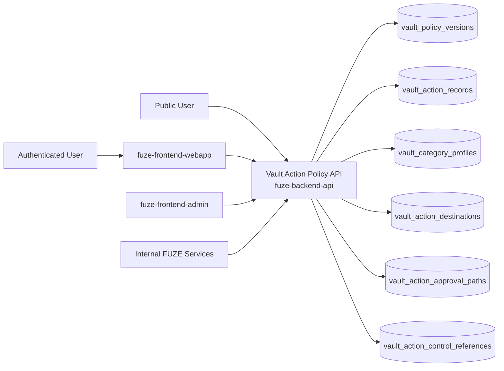
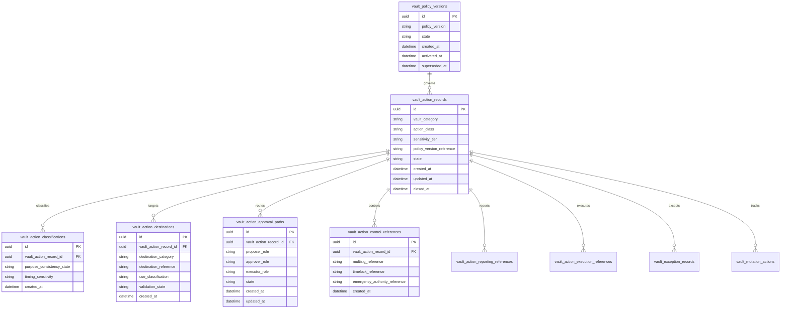
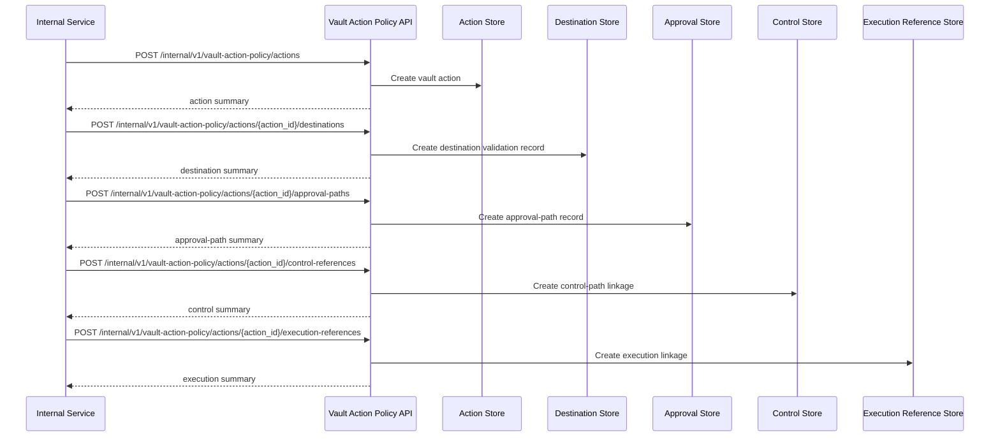

# VAULT_ACTION_POLICY_API_SPEC

## 1. Title

**VAULT_ACTION_POLICY_API_SPEC.md**

---

## 2. Document Metadata

- **Document Name:** VAULT_ACTION_POLICY_API_SPEC.md
- **API Classification:** internal, admin, event-driven, public-read, chain-adjacent
- **Owning Domain:** Vault Action Policy Domain
- **Primary Implementing Repo:** `fuze-backend-api`
- **Primary Chain-Adjacent Dependency:** `fuze-contracts`
- **Primary System of Record:** vault policy versions, vault action records, vault category profiles, action-class records, destination validations, approval-path records, control references, exception records, and correction-safe vault-action lineage in `fuze-backend-api`
- **Status:** Draft for canonical source-of-truth approval
- **Purpose:** Define the production-grade API contract architecture for FUZE vault-action policy enforcement, category-aware vault action governance, destination and timing discipline, action sensitivity handling, and structured audit/reporting-safe lifecycle management across the platform
- **Canonical Folder:** `fuze.ac > docs > api-spec`

---

## 2.1 API Classification Header

- **API Classification:** internal | admin | event-driven | public-read | chain-adjacent
- **Owning Domain:** Vault Action Policy Domain
- **Primary Implementing Repo:** `fuze-backend-api`
- **Primary Chain-Adjacent Dependency:** `fuze-contracts`
- **Primary System of Record:** vault-action policy and vault-sensitive action governance domain

---

## 3. Purpose

This document defines the canonical API specification for FUZE vault-action policy operations. It translates the governing FUZE platform architecture, vault action policy, treasury control policy, multisig and timelock expectations, foundation governance expectations, transparency model, audit requirements, and API architecture rules into an implementation-ready API contract.

This API exists because FUZE does not treat separated vaults as sufficient by themselves. Vault architecture answers where reserve-class capital resides, but not what each vault is meaningfully allowed to do over time. The FUZE vault-action policy establishes action classes, category-aware behavior, destination legibility, sensitivity discipline, timing discipline, emergency narrowness, audit lineage, and reporting compatibility so that vault purpose remains operationally enforceable rather than merely descriptive. The same action may be appropriate for one vault and inappropriate for another, and the API must preserve that distinction rather than collapsing vaults into a flexible omnibus reserve pool. fileciteturn18file0 fileciteturn18file2

Accordingly, this specification defines how vault policy versions, vault action records, vault category profiles, destination validations, approval paths, control references, exception records, and reporting references are represented, and how vault-action behavior remains auditable, idempotent, and architecture-consistent across FUZE.

---

## 4. Scope

This specification covers:

- internal APIs for vault policy versioning and vault-sensitive action lifecycle management
- internal APIs for vault category classification, action-class classification, destination validation, and timing-policy attachment
- internal APIs for approval-path, multisig/timelock, emergency, and reporting linkage
- internal read APIs for canonical vault-action policy truth
- admin/control-plane APIs for approve, reject, pause, escalate, exceptional containment, supersede, and discrepancy resolution
- public-read APIs for bounded public-safe vault-policy summaries and public-safe vault-action reporting summaries where policy allows
- event emission requirements for vault-action policy lifecycle changes
- request, response, error, idempotency, versioning, audit, and database-shape rules for this domain

This specification does **not** redefine:

- the full treasury-control policy domain
- the full foundation governance domain
- the final multisig signer set or timelock parameters
- low-level vault contract ABIs
- final reserve accounting exports
- final transparency-report composition
- full beneficiary-release logic for vesting contracts in contract detail

Those remain governed by their own source-of-truth specifications. fileciteturn18file0 fileciteturn18file7

---

## 5. Source-of-Truth Inputs

### Primary FUZE docs and specs used

#### Highest-priority platform and ownership sources
- `SYSTEM_SPEC_INDEX.md`
- `DOCS_SPEC.md`
- `SYSTEM_BOUNDARY_AND_OWNERSHIP_SPEC.md`
- `SYSTEM_OVERVIEW_AND_BOUNDARIES_SPEC.md`
- `PLATFORM_ARCHITECTURE_SPEC.md`
- `DOMAIN_OWNERSHIP_MATRIX_SPEC.md`
- `DATA_MODEL_AND_ENTITY_OWNERSHIP_SPEC.md`
- `ONCHAIN_OFFCHAIN_RESPONSIBILITY_SPEC.md`

#### Primary vault / treasury / governance / control sources
- `VAULT_ACTION_POLICY_SPEC.md`
- `TREASURY_CONTROL_POLICY_SPEC.md`
- `MULTISIG_AND_TIMELOCK_SPEC.md`
- `FOUNDATION_GOVERNANCE_SPEC.md`
- `GOVERNANCE_MODEL_SPEC.md`
- `TRANSPARENCY_REPORTING_SPEC.md`
- `TRANSPARENCY_MODEL_SPEC.md`
- `PROFIT_PARTICIPATION_SYSTEM_SPEC.md`
- `CHAIN_ARCHITECTURE_SPEC.md`

#### Core docs inputs
- `FUZE_WHITEPAPER_v.2026.3.0.1.pdf`
- `FUZE_TOKENOMICS_TABLES.md`
- `ALLOCATION_WALLET_MAP.md`
- tokenomics vault docs under `fuze.ac > docs/tokenomics/`, including:
  - `FOUNDATION_VAULT.md`
  - `TREASURY_RESERVE_VAULT.md`
  - `HOLDER_INCENTIVES_VAULT.md`
  - `ECOSYSTEM_PARTNERSHIP_VAULT.md`
  - `LIQUIDITY_OPERATIONS_VAULT.md`
  - `TRANSPARENCY_STABILITY_VAULT.md`
  - `TEAM_VESTING_VAULT.md`
  - `ADVISOR_VESTING_VAULT.md`

#### API and runtime sources
- `API_ARCHITECTURE_SPEC.md`
- `PUBLIC_API_SPEC.md`
- `INTERNAL_SERVICE_API_SPEC.md`
- `EVENT_MODEL_AND_WEBHOOK_SPEC.md`
- `IDEMPOTENCY_AND_VERSIONING_SPEC.md`
- `MIGRATION_AND_BACKWARD_COMPATIBILITY_SPEC.md`
- `AUDIT_LOG_AND_ACTIVITY_SPEC.md`

#### Security and operations sources
- `SECURITY_AND_RISK_CONTROL_SPEC.md`
- `MONITORING_ALERTING_AND_INCIDENT_RESPONSE_SPEC.md`
- `SECRETS_CONFIG_AND_ENVIRONMENT_SPEC.md`

#### Format guides
- `The_API_Specification_guide.md`
- `Database_Schemas_Guide.md`

### Highest-priority interpretation applied

For this file, the most important governing interpretation is:

1. vault action policy governs **what** each vault may meaningfully do, while treasury control governs **how** treasury-sensitive actions are controlled
2. backend owns canonical vault-action policy truth and vault-sensitive action lifecycle truth
3. vault purpose must constrain action space, destination, sensitivity, timing, and reporting
4. the same action may be allowed for one vault category and disallowed or exceptional for another
5. Foundation, Transparency/Stability, and Liquidity Operations require stronger restraint than ordinary treasury convenience
6. payout-related vault actions are holder-facing, high-trust events and should not be treated as ordinary transfers

These interpretations are grounded in the vault-action policy’s canonical principle, category-aware action profiles, destination rules, timing rules, and relationship to treasury control, Foundation governance, and payout-related behavior. fileciteturn18file0 fileciteturn18file1 fileciteturn18file3 fileciteturn18file5

### Supporting external standards used only as guidance

- HTTP semantics for internal mutation and bounded public-read APIs
- structured problem-details error design
- general policy-versioning, action-governance, and correction-lineage patterns as supporting guidance

External guidance does not override FUZE source-of-truth documents.

---

## 6. Governing Architecture and Ownership Interpretation

This API belongs to the **Vault Action Policy Domain** because it owns the canonical lifecycle of:

- vault policy version interpretation,
- vault-sensitive action records,
- category-aware action-class evaluation,
- destination legibility validation,
- sensitivity and timing treatment,
- governance-path and control-reference linkage,
- and correction-safe vault-action history.

This API is implemented primarily in `fuze-backend-api` because:

- backend owns durable vault-policy and vault-action truth
- vault-sensitive actions require centralized rule enforcement and category-aware validation
- contract-level vault separation alone is insufficient without explicit off-chain policy interpretation
- multiple adjacent governance and reporting domains need one canonical policy/action truth source
- public trust requires structured explanation and lineage in addition to contract execution traces

This API is **not** owned by:

- `fuze-frontend-webapp`, because frontend only reads bounded public-safe or first-party-safe summaries
- `fuze-frontend-admin`, because admin may propose, approve, pause, or escalate actions but must not own canonical policy truth
- `fuze-contracts`, because vault contracts enforce or execute some actions but do not own the full policy interpretation of what those actions mean
- treasury-control policy domain, because treasury control governs control posture while vault action policy governs vault-meaningful allowed behavior
- Foundation governance domain, because Foundation governance intensifies stewardship constraints but does not replace vault-action policy for all vaults
- product domains, because vault action policy is reserve-architecture governance, not product administration

### Architectural implications

- every material vault action must preserve explicit vault category context
- every material vault action must preserve action class, destination category, sensitivity tier, and approval-path meaning
- destination ambiguity is itself a policy risk and must be modeled explicitly
- timing-sensitive actions such as vesting release, payout-cycle funding, program launch allocation, timelock-gated deployment, and emergency containment require explicit timing treatment
- emergency pathways should remain narrow and recovery-oriented rather than becoming general discretionary overrides
- corrections and supersession must preserve historical governance meaning rather than silently rewriting records

---

## 7. Domain Responsibilities

The Vault Action Policy API domain is responsible for:

1. maintaining canonical vault policy versions and vault-sensitive action records
2. classifying vault actions by vault category, action class, sensitivity tier, destination category, and timing posture
3. validating whether a proposed action remains consistent with the published purpose of the source vault
4. preserving distinct action profiles for Foundation, Treasury Reserve, Team Vesting, Advisor Vesting, Holder Incentives, Ecosystem Partnership, Liquidity Operations, and Transparency / Stability vaults
5. recording proposal, approval, execution, emergency, and reporting-path linkage for vault-sensitive actions
6. linking vault actions to public reporting, registry, payout-cycle, and exception references where applicable
7. supporting admin approve, reject, pause, escalate, exceptional containment, supersede, and discrepancy workflows
8. emitting vault-action policy lifecycle events
9. generating audit lineage for sensitive vault-action policy mutations
10. preserving separation between vault policy, treasury control, multisig/timelock control, and downstream execution truth

The domain is not responsible for:

- owning raw vault contract execution state
- replacing treasury control policy
- replacing multisig/timelock technical enforcement
- replacing Foundation governance
- replacing transparency reports
- allowing broad discretionary reuse of vault capital outside category meaning

---

## 8. Out of Scope

The following are out of scope for this API specification:

- low-level signer-management or quorum configuration
- raw token transfer execution APIs
- full vesting-claim mechanics in contract detail
- raw reserve accounting exports
- end-user UI design for vault reporting
- generic product budget approvals that are not vault-sensitive
- external explorer integration specifics
- exact blocked-destination registry model and exact disclosure thresholds, which remain downstream refinements

---

## 9. Canonical Entities and Data Ownership

### Durable entities

#### 9.1 vault_policy_versions
- **Owner:** Vault Action Policy Domain
- **Purpose:** canonical policy versions governing vault-sensitive actions
- **Nature:** source-of-truth durable entity

#### 9.2 vault_action_records
- **Owner:** Vault Action Policy Domain
- **Purpose:** canonical vault-sensitive action records
- **Nature:** source-of-truth durable entity

#### 9.3 vault_category_profiles
- **Owner:** Vault Action Policy Domain
- **Purpose:** category-aware meaning and action-profile records for each vault category
- **Nature:** source-of-truth durable entity

#### 9.4 vault_action_classifications
- **Owner:** Vault Action Policy Domain
- **Purpose:** explicit classification of action class, sensitivity tier, timing sensitivity, and purpose-consistency evaluation
- **Nature:** source-of-truth durable entity

#### 9.5 vault_action_destinations
- **Owner:** Vault Action Policy Domain
- **Purpose:** destination category, destination reference, use rationale, and destination-legibility validation posture
- **Nature:** source-of-truth durable lineage entity

#### 9.6 vault_action_approval_paths
- **Owner:** Vault Action Policy Domain
- **Purpose:** explicit proposal, approval, and execution role-path records
- **Nature:** source-of-truth durable lineage entity

#### 9.7 vault_action_control_references
- **Owner:** Vault Action Policy Domain
- **Purpose:** structured references to multisig, timelock, emergency authority, or other bounded control paths
- **Nature:** source-of-truth durable lineage entity

#### 9.8 vault_action_reporting_references
- **Owner:** Vault Action Policy Domain
- **Purpose:** references to transparency reports, public registry references, payout-cycle references, and exception records
- **Nature:** durable reporting-lineage entity

#### 9.9 vault_exception_records
- **Owner:** Vault Action Policy Domain
- **Purpose:** exceptional or emergency vault-action records with post-incident review requirements
- **Nature:** durable exceptional-case entity

#### 9.10 vault_discrepancy_cases
- **Owner:** Vault Action Policy Domain
- **Purpose:** review and remediation records for invalid, stale, miscategorized, or misreported vault-sensitive actions
- **Nature:** durable review/remediation entity

#### 9.11 vault_mutation_actions
- **Owner:** Vault Action Policy Domain
- **Purpose:** high-level action records for create, approve, reject, pause, escalate, exceptional, supersede, and resolve discrepancy
- **Nature:** durable action records with audit linkage

#### 9.12 vault_audit_events
- **Owner:** Audit / Activity domain, sourced by Vault Action Policy Domain
- **Purpose:** immutable trail for sensitive vault-action policy actions
- **Nature:** durable audit records

### Derived or cached entities

#### 9.13 vault_public_policy_views
- **Owner:** derived read-model layer
- **Purpose:** public-safe vault policy and vault-action summaries
- **Nature:** derived

#### 9.14 vault_internal_status_views
- **Owner:** derived read-model layer
- **Purpose:** trusted vault-action and approval-path operational summaries
- **Nature:** derived

#### 9.15 vault_discrepancy_views
- **Owner:** derived ops read-model layer
- **Purpose:** visibility into stale, invalid, or miscategorized vault-sensitive conditions
- **Nature:** derived

---

## 10. State Model and Lifecycle

### 10.1 vault policy version lifecycle

Possible states:

- `draft`
- `active`
- `deprecated`
- `superseded`
- `archived`

### 10.2 vault action lifecycle

Possible states:

- `draft`
- `proposed`
- `under_review`
- `approved`
- `rejected`
- `ready_for_execution`
- `executed_reference_linked`
- `reported`
- `paused`
- `superseded`
- `closed`

### 10.3 approval-path lifecycle

Possible states:

- `proposal_recorded`
- `approval_pending`
- `approved`
- `rejected`
- `execution_linked`
- `closed`

### 10.4 exceptional-action lifecycle

Possible states:

- `declared`
- `containment_active`
- `post_review_pending`
- `closed`
- `superseded`

### 10.5 discrepancy lifecycle

Possible states:

- `opened`
- `under_review`
- `resolved`
- `failed`
- `closed`

Lifecycle notes:
- approval is distinct from execution linkage
- reported is distinct from executed_reference_linked
- exceptional treatment must remain explicitly narrower than normal action authorization
- supersession must preserve prior category meaning and public explanation

---

## 11. API Surface Overview

The API surface is divided into four families:

### 11.1 Public-read APIs
Used by public users, holders, and community observers for:
- reading bounded vault-policy summaries
- reading public-safe vault-action summaries
- reading category-aware and destination-aware public explanations where policy allows

### 11.2 First-party authenticated read APIs
Used by `fuze-frontend-webapp` and approved first-party clients for:
- reading bounded vault-related public-safe and first-party-safe summaries where policy allows
- reading linked payout or reporting references without exposing internal-only governance detail

### 11.3 Internal service APIs
Used by trusted internal services for:
- creating vault actions
- validating categories, action classes, destinations, and timing sensitivity
- recording approval paths and control references
- linking execution and reporting references
- reading canonical truth

### 11.4 Admin / control-plane APIs
Used by `fuze-frontend-admin` through backend-only privileged routes for:
- approve, reject, pause, escalate, exceptional containment, supersede, and discrepancy actions
- control-path repair and policy-governed remediation workflows

---

## 12. Authentication and Authorization Model

### 12.1 Authentication posture by route family

#### Public-read routes
No authentication required:
- list public-safe vault policy summaries
- read public-safe vault-action summaries and references where published

#### Authenticated read routes
Require valid authenticated session:
- read bounded first-party-safe vault-related summaries where actor has visibility under policy

#### Internal service routes
Require internal service identity with explicit least privilege:
- create vault actions
- classify actions
- record destinations, approval paths, control references, and reporting links
- read canonical truth

#### Admin routes
Require privileged operator identity plus reason-coded actions:
- approve, reject, pause, escalate, declare exceptional treatment, supersede, and resolve discrepancy cases

### 12.2 Authorization checkpoints

Authorization must evaluate:
- caller identity and route family
- whether target action is public-safe, first-party-safe, or privileged internal state
- whether internal service has create/classify/link/read privilege
- whether admin/operator role is present for sensitive governance actions
- whether current action state allows requested mutation
- whether vault category and sensitivity tier require stronger control-path validation

### 12.3 Sensitive action rules

The following require heightened checks:
- approval of material vault-sensitive actions
- Foundation-sensitive actions
- Transparency / Stability and Liquidity Operations actions
- payout-related vault actions
- destination changes after action enters under_review or approved state
- escalation or exceptional treatment
- discrepancy-resolution actions

---

## 13. API Endpoints / Interface Contracts

## 13.1 Public-Read APIs

### 13.1.1 `GET /v1/vault-action-policy/policies`
**Purpose:** list published public-safe vault policy summaries  
**Caller Type:** public  
**Auth Expectation:** none  
**Query Parameters Summary:**
- optional `state`
- pagination
**Response Summary:**
- policy version summaries
- active/superseded posture
- public-safe category and action-class summaries
- timestamps
**Side Effects:** none
**Audit Requirements:** access logging optional
**Emitted Events:** none required

### 13.1.2 `GET /v1/vault-action-policy/actions`
**Purpose:** list published public-safe vault-action summaries  
**Caller Type:** public  
**Query Parameters Summary:**
- optional `vault_category`
- optional `action_class`
- optional `sensitivity_tier`
- pagination
**Response Summary:**
- public-safe action summaries
- vault category, action class, destination category, and status
- bounded reporting and registry references
**Side Effects:** none

### 13.1.3 `GET /v1/vault-action-policy/actions/{vault_action_id}`
**Purpose:** retrieve one public-safe vault-action detail  
**Caller Type:** public  
**Response Summary:**
- public-safe action detail
- vault category and sensitivity summary
- destination-category summary
- reporting and public registry references where published
- correction or supersession guidance where relevant
**Side Effects:** none

## 13.2 First-Party Authenticated Read APIs

### 13.2.1 `GET /v1/vault-action-policy/me/actions`
**Purpose:** retrieve bounded first-party-safe vault-related action summaries where actor has policy visibility  
**Caller Type:** authenticated user  
**Auth Expectation:** valid authenticated session  
**Query Parameters Summary:**
- optional `reference_type`
- pagination
**Response Summary:**
- bounded vault-related summaries
- linked public reporting or payout guidance where applicable
**Side Effects:** none

## 13.3 Internal Service APIs

### 13.3.1 `POST /internal/v1/vault-action-policy/actions`
**Purpose:** create draft vault-sensitive action record  
**Caller Type:** internal trusted service  
**Auth Expectation:** service-to-service identity only  
**Request Body Summary:**
- `vault_category`
- `action_class`
- `sensitivity_tier`
- `policy_version_reference`
- optional `proposal_summary`
- `idempotency_key`
**Response Summary:** vault-action summary
**Side Effects:** creates draft/proposed vault action and classification record
**Idempotency Behavior:** required
**Audit Requirements:** sensitive vault-action creation audit
**Emitted Events:** `vault_action_policy.action_created`

### 13.3.2 `POST /internal/v1/vault-action-policy/actions/{vault_action_id}/destinations`
**Purpose:** attach destination and use-rationale metadata to one vault action  
**Caller Type:** internal trusted service  
**Request Body Summary:**
- `destination_category`
- `destination_reference`
- `use_classification`
- optional `timing_reference`
- `idempotency_key`
**Response Summary:** destination summary and validation posture
**Side Effects:** creates destination linkage and destination-legibility validation record
**Idempotency Behavior:** required
**Audit Requirements:** destination-link audit
**Emitted Events:** `vault_action_policy.destination_validated`

### 13.3.3 `POST /internal/v1/vault-action-policy/actions/{vault_action_id}/approval-paths`
**Purpose:** record proposal, approval, and execution-path structure for one vault action  
**Caller Type:** internal trusted service  
**Request Body Summary:**
- `proposer_role`
- `approver_role`
- `executor_role`
- optional `approval_path_summary`
- `idempotency_key`
**Response Summary:** approval-path summary
**Side Effects:** creates approval-path lineage and may move action into under_review
**Idempotency Behavior:** required
**Audit Requirements:** approval-path audit
**Emitted Events:** `vault_action_policy.approval_path_recorded`

### 13.3.4 `POST /internal/v1/vault-action-policy/actions/{vault_action_id}/control-references`
**Purpose:** attach multisig, timelock, emergency, or exceptional control references to one action  
**Caller Type:** internal trusted service  
**Request Body Summary:**
- optional `multisig_reference`
- optional `timelock_reference`
- optional `emergency_authority_reference`
- optional `control_summary`
- `idempotency_key`
**Response Summary:** control-reference summary
**Side Effects:** creates control-path linkage
**Idempotency Behavior:** required
**Audit Requirements:** control-reference audit
**Emitted Events:** `vault_action_policy.control_linked`

### 13.3.5 `POST /internal/v1/vault-action-policy/actions/{vault_action_id}/reporting-references`
**Purpose:** attach transparency, registry, payout, or exception references to one vault action  
**Caller Type:** internal trusted service  
**Request Body Summary:**
- optional `transparency_report_reference`
- optional `public_registry_reference`
- optional `payout_cycle_reference`
- optional `exception_reference`
- `idempotency_key`
**Response Summary:** reporting-reference summary
**Side Effects:** creates reporting and trust-surface linkage
**Idempotency Behavior:** required
**Audit Requirements:** reporting-link audit
**Emitted Events:** `vault_action_policy.reporting_linked`

### 13.3.6 `POST /internal/v1/vault-action-policy/actions/{vault_action_id}/execution-references`
**Purpose:** link downstream execution reference to one vault action  
**Caller Type:** internal trusted service  
**Request Body Summary:**
- `execution_reference_type`
- `execution_reference_id`
- optional `execution_summary`
- `idempotency_key`
**Response Summary:** execution-reference summary and updated action state
**Side Effects:** creates execution linkage and may move action into executed_reference_linked
**Idempotency Behavior:** required
**Audit Requirements:** execution-link audit
**Emitted Events:** `vault_action_policy.execution_linked`

### 13.3.7 `GET /internal/v1/vault-action-policy/actions/{vault_action_id}`
**Purpose:** retrieve canonical vault-action policy truth  
**Caller Type:** internal trusted service  
**Response Summary:** full vault action, vault category profile, classification, destination, approval-path, control references, execution references, reporting references, and discrepancy lineage
**Side Effects:** none

## 13.4 Admin / Control-Plane APIs

### 13.4.1 `POST /admin/v1/vault-action-policy/actions/{vault_action_id}/approve`
**Purpose:** approve vault-sensitive action under controlled policy  
**Caller Type:** admin/operator  
**Request Body Summary:**
- `reason_code`
- `operator_note`
- `idempotency_key`
**Response Summary:** approved action summary
**Side Effects:** action moves to approved or ready_for_execution if checks pass
**Audit Requirements:** critical audit
**Emitted Events:** `vault_action_policy.action_approved`

### 13.4.2 `POST /admin/v1/vault-action-policy/actions/{vault_action_id}/reject`
**Purpose:** reject vault-sensitive action under controlled policy  
**Caller Type:** admin/operator  
**Request Body Summary:**
- `reason_code`
- `operator_note`
- `idempotency_key`
**Response Summary:** rejected action summary
**Side Effects:** action moves to rejected
**Audit Requirements:** critical audit
**Emitted Events:** `vault_action_policy.action_rejected`

### 13.4.3 `POST /admin/v1/vault-action-policy/actions/{vault_action_id}/pause`
**Purpose:** pause vault-sensitive action under controlled policy  
**Caller Type:** admin/operator  
**Request Body Summary:**
- `reason_code`
- `operator_note`
- `idempotency_key`
**Response Summary:** paused action summary
**Side Effects:** action moves to paused
**Audit Requirements:** critical audit
**Emitted Events:** `vault_action_policy.action_paused`

### 13.4.4 `POST /admin/v1/vault-action-policy/actions/{vault_action_id}/escalate`
**Purpose:** escalate vault-sensitive action to stronger governance/control path  
**Caller Type:** admin/operator  
**Request Body Summary:**
- `escalation_type`
- `reason_code`
- `operator_note`
- `idempotency_key`
**Response Summary:** escalation summary
**Side Effects:** action control path strengthens, for example through stronger timelock or approval posture
**Audit Requirements:** critical audit
**Emitted Events:** `vault_action_policy.action_escalated`

### 13.4.5 `POST /admin/v1/vault-action-policy/actions/{vault_action_id}/exceptional`
**Purpose:** declare emergency or exceptional vault treatment under controlled policy  
**Caller Type:** admin/operator  
**Request Body Summary:**
- `exception_type`
- `public_or_internal_summary`
- `reason_code`
- `operator_note`
- `idempotency_key`
**Response Summary:** exceptional-action summary
**Side Effects:** creates exception record and may restrict ordinary action path until review completes
**Audit Requirements:** critical audit
**Emitted Events:** `vault_action_policy.exception_declared`

### 13.4.6 `POST /admin/v1/vault-action-policy/actions/{vault_action_id}/supersede`
**Purpose:** supersede one vault-sensitive action with a replacement record under controlled policy  
**Caller Type:** admin/operator  
**Request Body Summary:**
- `replacement_vault_action_id`
- `reason_code`
- `operator_note`
- `idempotency_key`
**Response Summary:** supersession summary
**Side Effects:** creates old-to-new supersession linkage and updates current policy-visible preference
**Audit Requirements:** critical audit
**Emitted Events:** `vault_action_policy.action_superseded`

### 13.4.7 `POST /admin/v1/vault-action-policy/discrepancies`
**Purpose:** resolve vault-action policy discrepancy under controlled policy  
**Caller Type:** admin/operator  
**Request Body Summary:**
- `target_reference_type`
- `target_reference_id`
- `resolution_code`
- `operator_note`
- `related_case_id`
- `idempotency_key`
**Response Summary:** discrepancy-resolution summary
**Side Effects:** may correct, supersede, pause, escalate, or close discrepancy posture with preserved lineage
**Audit Requirements:** critical audit
**Emitted Events:** `vault_action_policy.discrepancy_resolved`

---

## 14. Request Rules

### 14.1 General request rules
- all mutation-capable routes must require JSON requests with explicit content type
- all mutation routes must carry correlation IDs
- sensitive vault-action policy mutations must carry idempotency keys
- admin mutations must require reason codes and operator notes
- no route may accept frontend-authored vault-policy truth as authoritative input

### 14.2 Sensitive-action request requirements
The following requests require heightened validation:
- proposal or approval of material vault-sensitive actions
- Foundation-sensitive actions
- Transparency / Stability actions
- Liquidity Operations actions
- payout-related vault actions
- destination or use changes after action enters under_review or approved state
- escalation or exceptional treatment
- discrepancy-resolution actions

Heightened validation may include:
- vault-category and action-class consistency checks
- destination-category restriction checks
- timing-sensitivity checks
- control-path completeness checks
- operator role confirmation
- governance/finance/security case linkage for sensitive actions

### 14.3 Scope integrity rule
Vault-action policy mutations must target valid and authorized policy versions, action records, destination records, control references, and discrepancy records. Services and operators must not mutate unrelated or unauthorized vault-policy state.

### 14.4 Layer-separation rule
Vault-action policy must remain the meaning-and-behavior layer for reserve-class vaults. It must not collapse:
- treasury-control meaning,
- multisig/timelock execution,
- vesting contract behavior,
- payout-cycle execution,
- or transparency reporting
into one ambiguous state object.

---

## 15. Response Rules

### 15.1 Success response rules
Successful responses must include:
- stable resource identifiers
- timestamps for created/updated state
- state/status values
- action, category, or destination summaries where relevant
- control-path and reporting-reference summaries where relevant
- correlation references for mutations

### 15.2 Async-accepted response rules
If escalation, exceptional review, or discrepancy remediation is async, the response must:
- return accepted status
- include action or job ID
- provide follow-up status semantics

### 15.3 Terminal mutation response rules
Terminal mutation responses must clearly show:
- target action or discrepancy
- mutation type
- resulting policy/action/control-path state
- pause, escalation, exceptional, supersession, or closure effects where relevant
- whether public-safe views may refresh asynchronously

### 15.4 Read response rules
Read responses must distinguish:
- canonical internal vault-policy truth
- public-safe vault-policy summaries
- public-safe vault-action reporting views
- execution references versus final downstream execution outcomes

---

## 16. Error Model

The API uses structured problem-details style error responses.

### 16.1 Required error fields
- `type`
- `title`
- `status`
- `code`
- `detail`
- `instance`
- `correlation_id`

### 16.2 Common error codes

#### Authorization / permission errors
- `VAULT_ACTION_POLICY_PERMISSION_DENIED`
- `VAULT_ACTION_POLICY_OPERATOR_PERMISSION_DENIED`
- `VAULT_ACTION_POLICY_SERVICE_PERMISSION_DENIED`
- `VAULT_ACTION_POLICY_AUDIENCE_PERMISSION_DENIED`

#### State conflict errors
- `VAULT_ACTION_POLICY_ACTION_STATE_INVALID`
- `VAULT_ACTION_POLICY_POLICY_STATE_INVALID`
- `VAULT_ACTION_POLICY_APPROVAL_PATH_INVALID`
- `VAULT_ACTION_POLICY_SUPERSESSION_CONFLICT`
- `VAULT_ACTION_POLICY_ESCALATION_CONFLICT`

#### Policy / safety errors
- `VAULT_ACTION_POLICY_DESTINATION_NOT_ALLOWED`
- `VAULT_ACTION_POLICY_POLICY_VERSION_REQUIRED`
- `VAULT_ACTION_POLICY_APPROVAL_REQUIRED`
- `VAULT_ACTION_POLICY_EXCEPTION_NOT_ALLOWED`
- `VAULT_ACTION_POLICY_FOUNDATION_RESTRICTION`

#### Request integrity errors
- `VAULT_ACTION_POLICY_IDEMPOTENCY_KEY_REQUIRED`
- `VAULT_ACTION_POLICY_REQUEST_INVALID`
- `VAULT_ACTION_POLICY_REQUEST_UNPROCESSABLE`

#### Dependency or provider errors
- `VAULT_ACTION_POLICY_EXECUTION_UNAVAILABLE`
- `VAULT_ACTION_POLICY_STORAGE_UNAVAILABLE`
- `VAULT_ACTION_POLICY_RECONCILIATION_UNAVAILABLE`

### 16.3 Error handling rules
- do not expose hidden internal governance, treasury, or security detail in public or low-privilege responses
- do not imply permitted execution merely because a draft or proposed vault action exists
- distinguish destination-restriction failure from generic invalid state
- distinguish policy-version-required from generic invalid request
- include retry guidance only where safe

---

## 17. Idempotency and Mutation Safety

### 17.1 Required idempotent mutations
The following mutation routes require idempotent behavior:
- vault-action creation
- destination attachment
- approval-path recording
- control-reference attachment
- reporting-reference attachment
- execution-reference linking
- approve
- reject
- pause
- escalate
- exceptional
- supersede
- discrepancy resolution

### 17.2 Idempotency key rules
- mutation requests must supply `Idempotency-Key`
- backend stores key scope, request hash, actor, and terminal result
- replay of same semantic request returns original terminal outcome
- replay of same key with different semantic request must fail with conflict

### 17.3 Mutation safety rules
- one canonical visible vault action per current action lineage unless explicit supersession exists
- destination and control-path records must remain referentially consistent with vault category, action class, and sensitivity tier
- approval, execution linkage, and reporting linkage must preserve proposal/approval/execution separation
- corrections and supersession must preserve prior vault-action lineage
- exceptional treatment must not silently normalize into routine vault behavior

---

## 18. Versioning and Compatibility Rules

### 18.1 Versioning
This API family is versioned under `/v1`, `/internal/v1`, and `/admin/v1` route families.

### 18.2 Compatibility approach
- additive evolution preferred
- no silent semantic change to proposed, approved, ready_for_execution, executed_reference_linked, reported, paused, or superseded states
- new vault categories, action classes, destination types, or control-reference types may be added without breaking existing contracts
- response fields may be added but existing meanings must remain stable

### 18.3 Breaking-change rules
Breaking changes include:
- changing the meaning of vault-action lifecycle states
- changing public-safe vault-policy visibility semantics incompatibly
- removing critical category, destination, or control-path fields
- changing exceptional-treatment or supersession semantics incompatibly

Such changes require explicit migration planning and version evolution.

### 18.4 Deprecation
Deprecated routes or fields must:
- be documented explicitly
- carry deprecation metadata where supported
- preserve compatibility windows long enough for public, first-party, and internal consumers

---

## 19. Event Emission and Webhook Behavior

This domain is event-capable.

### 19.1 Internal events
The Vault Action Policy domain must emit canonical internal events such as:
- `vault_action_policy.action_created`
- `vault_action_policy.destination_validated`
- `vault_action_policy.approval_path_recorded`
- `vault_action_policy.control_linked`
- `vault_action_policy.reporting_linked`
- `vault_action_policy.execution_linked`
- `vault_action_policy.action_approved`
- `vault_action_policy.action_rejected`
- `vault_action_policy.action_paused`
- `vault_action_policy.action_escalated`
- `vault_action_policy.exception_declared`
- `vault_action_policy.action_superseded`
- `vault_action_policy.discrepancy_resolved`

### 19.2 Event payload minimums
Each event should contain:
- event ID
- event type
- occurred_at
- vault action ID
- vault category
- action class
- sensitivity tier
- actor type
- correlation ID
- reason code where applicable

### 19.3 External webhook posture
This specification does not expose general third-party outbound vault-action-policy webhooks by default. Any future outbound vault-status webhook surface must be narrow, security-reviewed, and governed by a separate contract.

---

## 20. Audit and Activity Requirements

The following actions must generate durable audit events:

- vault-action creation
- destination validation
- approval-path recording
- approve, reject, pause, escalate, and exceptional treatment
- execution-reference and reporting-reference linkage for material actions
- supersession and discrepancy-resolution actions
- other sensitive vault-action policy mutations

### Required audit fields
- audit event ID
- actor type and actor reference
- target action / category / destination / control path / discrepancy reference as applicable
- action type
- before/after summary where applicable
- reason code
- correlation ID
- operator note if operator action
- occurred_at

---

## 21. Data Model and Database Schema View

### 21.1 `vault_policy_versions`
- `id` PK
- `policy_version`
- `state`
- `policy_summary_json`
- `created_at`
- `activated_at` nullable
- `superseded_at` nullable

**Constraints:**
- unique `policy_version`
- index on `state`

### 21.2 `vault_action_records`
- `id` PK
- `vault_category`
- `action_class`
- `sensitivity_tier`
- `policy_version_reference`
- `state`
- `created_at`
- `updated_at`
- `closed_at` nullable

**Constraints:**
- index on (`vault_category`, `action_class`)
- index on `state`

### 21.3 `vault_category_profiles`
- `id` PK
- `vault_category`
- `allowed_profile_json`
- `restricted_profile_json`
- `disallowed_profile_json`
- `created_at`
- `updated_at`

**Constraints:**
- unique `vault_category`

### 21.4 `vault_action_classifications`
- `id` PK
- `vault_action_record_id` FK -> `vault_action_records.id`
- `purpose_consistency_state`
- `timing_sensitivity`
- `classification_summary_json`
- `created_at`

**Constraints:**
- index on `vault_action_record_id`

### 21.5 `vault_action_destinations`
- `id` PK
- `vault_action_record_id` FK -> `vault_action_records.id`
- `destination_category`
- `destination_reference`
- `use_classification`
- `timing_reference` nullable
- `validation_state`
- `created_at`

**Constraints:**
- index on `vault_action_record_id`
- index on `validation_state`

### 21.6 `vault_action_approval_paths`
- `id` PK
- `vault_action_record_id` FK -> `vault_action_records.id`
- `proposer_role`
- `approver_role`
- `executor_role`
- `state`
- `created_at`
- `updated_at`

**Constraints:**
- index on `vault_action_record_id`
- index on `state`

### 21.7 `vault_action_control_references`
- `id` PK
- `vault_action_record_id` FK -> `vault_action_records.id`
- `multisig_reference` nullable
- `timelock_reference` nullable
- `emergency_authority_reference` nullable
- `created_at`

**Constraints:**
- index on `vault_action_record_id`

### 21.8 `vault_action_reporting_references`
- `id` PK
- `vault_action_record_id` FK -> `vault_action_records.id`
- `transparency_report_reference` nullable
- `public_registry_reference` nullable
- `payout_cycle_reference` nullable
- `exception_reference` nullable
- `created_at`

**Constraints:**
- index on `vault_action_record_id`

### 21.9 `vault_action_execution_references`
- `id` PK
- `vault_action_record_id` FK -> `vault_action_records.id`
- `execution_reference_type`
- `execution_reference_id`
- `execution_summary_json`
- `created_at`

**Constraints:**
- index on `vault_action_record_id`
- index on (`execution_reference_type`, `execution_reference_id`)

### 21.10 `vault_exception_records`
- `id` PK
- `vault_action_record_id` FK -> `vault_action_records.id`
- `exception_type`
- `summary_json`
- `state`
- `created_at`
- `closed_at` nullable

### 21.11 `vault_discrepancy_cases`
- `id` PK
- `target_reference_type`
- `target_reference_id`
- `state`
- `resolution_code` nullable
- `created_at`
- `updated_at`
- `closed_at` nullable

### 21.12 `vault_mutation_actions`
- `id` PK
- `target_reference_type`
- `target_reference_id`
- `action_type`
- `state`
- `reason_code`
- `operator_note` nullable
- `requested_by_actor_type`
- `requested_by_actor_id`
- `created_at`
- `executed_at` nullable
- `closed_at` nullable
- `correlation_id`

### 21.13 `idempotency_records`
- `id` PK
- `idempotency_key`
- `scope_family`
- `actor_reference`
- `request_hash`
- `response_hash`
- `terminal_status`
- `created_at`
- `expires_at`

### 21.14 `audit_log_entries`
Domain-sourced audit records written into the audit domain.

### Normalization notes
- canonical vault-policy truth stays in policy versions, action records, category profiles, classifications, destinations, approval paths, control references, execution references, and discrepancy records
- treasury-control, Foundation governance, and multisig/timelock truth remain external and are referenced rather than duplicated
- public-safe views must derive from canonical vault-policy truth filtered by disclosure policy
- execution and reporting references remain explicit rather than embedded as opaque strings

### Reconciliation notes
- one visible vault action should reconcile to one current action lineage under current preference
- destination restrictions and action class must reconcile with vault-category meaning
- approval paths must reconcile to required control-path posture
- payout-related vault actions must reconcile to payout-cycle and reporting references where applicable
- discrepancy cases must preserve review lineage for failed or conflicting vault-action-policy conditions

---

## 22. Architecture Diagram — Mermaid flowchart



---

## 23. Data Design — Mermaid Diagram



---

## 24. Flow View

### 24.1 Happy path — propose, approve, execute, report
1. internal service creates draft vault-sensitive action
2. destination and use rationale are attached and validated
3. proposal, approval, and execution roles are recorded
4. control references such as multisig and timelock are linked where required
5. admin approves the action
6. downstream execution reference is linked after execution path proceeds
7. reporting and public registry references are attached
8. public-safe vault-action view becomes explainable and historically traceable

### 24.2 Happy path — payout-related vault action
1. payout-related vault action is proposed for treasury or other explicitly allowed category
2. system validates vault-category meaning and stronger trust implications
3. approval path and control references are recorded
4. admin approves action after payout preparation is ready
5. payout-cycle reference and reporting reference are attached
6. public-safe vault-action summary shows category-aware, holder-facing context

### 24.3 Alternate path — Foundation-sensitive escalation
1. action touches Foundation-sensitive capital or other stewardship-sensitive category
2. destination validation and policy checks require stronger restraint
3. operator escalates to stronger governance/control path
4. additional review or stronger timelock/multisig posture is linked
5. action proceeds only if higher-control requirements are satisfied

### 24.4 Failure path — destination or category violation
1. vault action is created or modified
2. backend detects destination-category mismatch, category drift risk, or disallowed use classification
3. request is rejected or paused
4. no effective approval or public reporting is produced

### 24.5 Failure and remediation path — discrepancy or misreporting
1. vault action, category, destination, or reporting linkage becomes stale or inconsistent
2. admin opens discrepancy-resolution flow
3. backend preserves existing lineage
4. corrected or superseding vault action or linkage is created
5. discrepancy closes with preserved history

### 24.6 Exceptional-action path
1. emergency or exceptional condition is detected
2. operator declares exceptional treatment with explicit reason and narrow containment posture
3. ordinary governance shortcuts are not normalized into standing authority
4. post-incident review remains required
5. exceptional record closes only after structured review

### 24.7 Retry behavior
- duplicate vault-action creation returns same canonical action result
- duplicate destination or control-reference attachment returns same lineage result where applicable
- duplicate approve/reject/pause/escalate/exceptional/supersede/discrepancy actions return same terminal action result

---

## 25. Data Flows — Mermaid sequenceDiagram



---

## 26. Security and Risk Controls

1. **Vault-action policy truth is backend-owned**  
   Frontends and informal channels may not authoritatively define vault-sensitive action truth.

2. **Purpose consistency is mandatory**  
   A vault action must remain consistent with the published purpose of the source vault category.

3. **Explicit authorization is mandatory**  
   No material vault action should occur based solely on operator convenience.

4. **Destination legibility is mandatory**  
   A vault action must have a destination and use rationale that can be explained structurally.

5. **Audit lineage is mandatory**  
   A vault action must preserve enough metadata, governance linkage, and reporting context to remain explainable later.

6. **Category preservation is mandatory**  
   A vault action should preserve category meaning rather than erode it.

7. **Emergency narrowness is mandatory**  
   Emergency controls should protect the vault without becoming a backdoor for ordinary discretionary use.

8. **Reporting compatibility is mandatory**  
   Material vault actions must remain compatible with transparency reporting and reserve-architecture visibility.

9. **Foundation-sensitive restraint**  
   Foundation actions should receive the strongest ordinary restraint among non-vesting categories.

10. **Recovery should restore clarity**  
    Recovery should restore structural clarity rather than quietly rewrite history.

---

## 27. Operational Considerations

- vault-action and approval-path reads for trusted operators should be highly available
- destination validation, category consistency, timing treatment, and control-reference integrity are correctness-sensitive
- Foundation-sensitive, Transparency/Stability-sensitive, Liquidity Operations-sensitive, and payout-related actions should surface clearly to ops views
- exceptional-treatment and discrepancy workflows should be observable and reviewable
- monitoring should alert on:
  - missing approval-path records for material vault actions
  - destination mismatches or policy violations
  - control-reference omissions for high-sensitivity actions
  - unusual exceptional-treatment frequency
  - reporting-link gaps for executed material actions
  - public-safe view inconsistency versus canonical vault-policy state

---

## 28. Acceptance Criteria

1. The API preserves the distinction between vault-action policy truth, treasury-control truth, Foundation governance truth, execution truth, and transparency-report truth.
2. Only `fuze-backend-api` owns canonical vault policy version and vault-action truth.
3. Vault policy versions, action records, category profiles, classifications, destinations, approval paths, control references, execution references, and discrepancy records are durable and backend-owned.
4. Public and first-party routes expose only bounded safe vault-policy views.
5. Category-aware destination and use restrictions are explicit and validated.
6. Proposal, approval, and execution separation is preserved for material vault actions.
7. Foundation-sensitive, Transparency/Stability-sensitive, Liquidity-sensitive, and payout-related actions are handled with stronger policy sensitivity.
8. Approval, escalation, exceptional treatment, correction, and discrepancy actions preserve immutable lineage.
9. Vault-action policy mutation actions are idempotent and auditable.
10. Internal and admin vault-action policy routes are least-privilege and backend-only.
11. Admin routes require reason-coded privileged authorization.
12. Event emissions exist for major vault-action-policy mutations.
13. Database schema separates policy versions, actions, category profiles, classifications, destinations, approval paths, control references, execution references, and discrepancy layers.
14. Public-safe consumers can rely on vault-policy views without needing hidden internal governance detail.
15. Mermaid diagrams remain consistent with prose and data model.

---

## 29. Test Cases

### 29.1 Positive cases
1. Internal service creates draft vault action successfully.
2. Internal service validates destination successfully.
3. Internal service records approval path successfully.
4. Internal service links control references successfully.
5. Internal service links reporting references successfully.
6. Admin approves vault action successfully.
7. Admin escalates Foundation-sensitive action successfully.
8. Public actor reads published public-safe vault-action summary successfully.

### 29.2 Negative cases
9. Public user cannot access internal vault-policy truth or discrepancy detail.
10. Internal service without write privilege cannot create vault action.
11. Vault action without policy version returns `VAULT_ACTION_POLICY_POLICY_VERSION_REQUIRED`.
12. Disallowed destination returns `VAULT_ACTION_POLICY_DESTINATION_NOT_ALLOWED`.
13. Foundation-sensitive action violating stronger restraint returns `VAULT_ACTION_POLICY_FOUNDATION_RESTRICTION`.
14. Exceptional treatment in ineligible state returns `VAULT_ACTION_POLICY_EXCEPTION_NOT_ALLOWED`.

### 29.3 Authorization cases
15. Ordinary public or authenticated user cannot call vault-policy admin APIs.
16. Internal service without destination-validation privilege cannot attach destination records.
17. Operator without approval privilege cannot approve vault action.
18. Approved vault action does not prove downstream execution or payout completion by itself.

### 29.4 Idempotency and replay cases
19. Repeating vault-action creation with same idempotency key returns original action result.
20. Repeating control-reference attachment with same idempotency key returns original linkage result.
21. Repeating approve or pause with same idempotency key returns original terminal action result.
22. Repeating exceptional or discrepancy resolution with same idempotency key returns original terminal action result.

### 29.5 Concurrency cases
23. Concurrent destination updates preserve one explicit current validation lineage and duplicate-safe outcomes where appropriate.
24. Concurrent approve and escalate actions preserve explicit lifecycle ordering without hidden overwrite.
25. Concurrent supersede and pause actions preserve explicit visible lineage without ambiguity.

### 29.6 Recovery / admin cases
26. Stale or misreported vault action can be corrected under controlled policy with explicit lineage.
27. Superseded vault action remains historically linked to the original record.
28. Discrepancy resolution closes category, destination, or reporting conflict with preserved audit history.

### 29.7 Event and audit cases
29. Successful vault action creation emits `vault_action_policy.action_created`.
30. Successful destination validation emits `vault_action_policy.destination_validated`.
31. Successful approval emits `vault_action_policy.action_approved`.
32. Successful exceptional declaration emits `vault_action_policy.exception_declared`.
33. Successful discrepancy resolution emits `vault_action_policy.discrepancy_resolved` with critical audit lineage.

---

## 30. Open Questions or Explicit Deferred Decisions

1. Exact vault-category and action-class taxonomy code sets are deferred.
2. Exact destination-category taxonomy and validation matrix are deferred.
3. Exact sensitivity-tier to multisig/timelock mapping rules are deferred.
4. Exact public-safe disclosure depth for vault actions by category is deferred.
5. Exact exceptional-treatment rollback taxonomy is deferred.
6. Exact discrepancy taxonomy for vault-policy conflicts is deferred.

---

## 31. Implementation Notes for `fuze-backend-api`

Recommended backend module layout:

```text
modules/platform/
  vault-action-policy/
  treasury-control/
  governance/
  payout-ledger/
  transparency-reporting/
  audit-log/
  control-plane/
  integrations/
```

Implementation guidance:
- keep policy versions, vault actions, category/destination validation, classification logic, approval-path logic, and control-reference linkage in one canonical domain service
- perform category, destination, sensitivity, timing, and control-path completeness checks inside the commit boundary
- keep approve, reject, pause, escalate, exceptional, supersede, and discrepancy actions explicit and idempotent
- treat admin remediations as domain actions, not ad hoc row edits
- emit events only after canonical state commit succeeds
- publish public-safe vault-policy views from canonical truth; do not let derived views mutate vault-policy state

---

## 32. Frontend Consumption Notes

### For `fuze-frontend-webapp`
- may read public-safe vault policy and vault-action summaries where approved
- must not infer vault-category permissibility from isolated contract transfers alone
- must treat backend vault-policy responses as authoritative for structured vault-governance status
- should clearly distinguish proposed, approved, executed-reference-linked, reported, paused, corrected, and superseded states when visible

### For `fuze-frontend-admin`
- may trigger privileged approve, reject, pause, escalate, exceptional, supersede, and discrepancy actions only through backend admin APIs
- must require operator reason input for sensitive mutations
- must not directly mutate canonical vault-policy truth client-side
- should present immutable vault-action history and correction lineage separately from current visible state

---

## 33. Contract Derivation Notes

### OpenAPI / AsyncAPI
This spec should later derive into:
- public policy/action read operations and bounded first-party-safe summary operations
- internal vault-action creation, destination, approval-path, control-reference, reporting-reference, and execution-reference operations
- admin approve / reject / pause / escalate / exceptional / supersede / discrepancy operations
- shared problem-details schema
- vault-action-policy lifecycle events in AsyncAPI

### Future `fuze-sdk`
Future `fuze-sdk` packages may derive:
- public vault-policy lookup helpers
- public-safe vault-action summary helpers
- typed vault-action, vault category, and sensitivity summary models
- problem-error models for vault-action-policy outcomes

The SDK must derive from approved API contracts and must not become the source of truth over this narrative specification.
