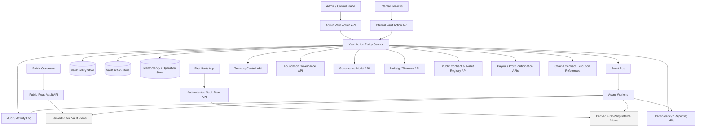
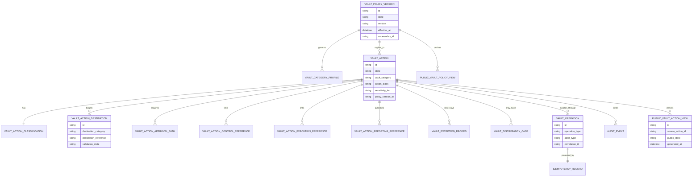
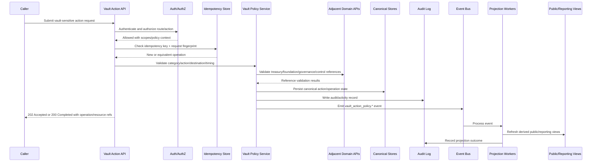

# FUZE Vault Action Policy API Specification

## Document Metadata

- **Document Name:** `VAULT_ACTION_POLICY_API_SPEC.md`
- **Document Type:** API SPEC v2 production-grade interface-contract specification
- **Status:** Draft canonical API SPEC v2
- **Version:** 2.0.0
- **Effective Date:** 2026-04-25
- **Last Updated:** 2026-04-25
- **Reviewed On:** 2026-04-25
- **Document Owner:** FUZE Vault Action Policy Domain; named individual owner not explicitly specified in retrieved governing materials
- **Approval Authority:** Not explicitly specified in retrieved governing materials; governed by FUZE refined registry and approval workflow
- **Review Cadence:** Quarterly and whenever treasury-control posture, Foundation stewardship posture, multisig/timelock posture, payout-funding posture, reserve architecture, tokenomics vault composition, public-trust reporting posture, or chain-adjacent control posture materially changes
- **Governing Layer:** API contract layer derived from the platform governance / reserve-behavior policy architecture / vault-meaning and vault-behavior control layer
- **Parent Registry:** API SPEC v2 Canonical File Registry
- **Upstream Semantic Registry:** `REFINED_SYSTEM_SPEC_INDEX.md`
- **Upstream API Registry:** `API_SPEC_INDEX.md`
- **Primary Audience:** Platform architecture, backend engineering, contracts engineering, treasury and finance stakeholders, governance/control-plane authors, security engineering, audit/compliance, transparency/reporting authors, implementation-contract authors, OpenAPI/AsyncAPI/SDK authors, QA and production-readiness reviewers
- **Primary Purpose:** Define the production-grade interface contract for FUZE vault-action policy APIs so vault purpose, category-aware action allowance, destination and timing discipline, vault-sensitive action lineage, and correction/supersession behavior remain enforceable through public-safe, first-party, internal, admin/control-plane, event, reporting, and chain-adjacent API surfaces.
- **Primary Upstream References:** `REFINED_SYSTEM_SPEC_INDEX.md`; `DOCS_SPEC_INDEX.md`; `SYSTEM_SPEC_INDEX.md`; `API_SPEC_INDEX.md`; `VAULT_ACTION_POLICY_SPEC.md`; `TREASURY_CONTROL_POLICY_SPEC.md`; `FOUNDATION_GOVERNANCE_SPEC.md`; `GOVERNANCE_MODEL_SPEC.md`; `MULTISIG_AND_TIMELOCK_SPEC.md`; `PROFIT_PARTICIPATION_SYSTEM_SPEC.md`; `TRANSPARENCY_MODEL_SPEC.md`; `TRANSPARENCY_REPORTING_SPEC.md`; `PUBLIC_CONTRACT_AND_WALLET_REGISTRY_SPEC.md`; `CHAIN_ARCHITECTURE_SPEC.md`; `ONCHAIN_OFFCHAIN_RESPONSIBILITY_SPEC.md`; `AUDIT_LOG_AND_ACTIVITY_SPEC.md`; `AUDIT_AND_ACCESS_TRACEABILITY_SPEC.md`; `SECURITY_AND_RISK_CONTROL_SPEC.md`; `EVENT_MODEL_AND_WEBHOOK_SPEC.md`; `IDEMPOTENCY_AND_VERSIONING_SPEC.md`; `MIGRATION_AND_BACKWARD_COMPATIBILITY_SPEC.md`.
- **Primary Downstream Dependents:** OpenAPI contracts for vault-action policy routes; AsyncAPI contracts for vault-action policy events; admin/control-plane implementation contracts; vault-sensitive treasury/governance workflows; multisig/timelock control-reference contracts; transparency/public reporting read models; public-safe vault summary APIs; discrepancy/remediation runbooks; QA and regression test suites.
- **API Surface Families Covered:** Public-read, first-party authenticated read, internal service, admin/control-plane, event/async, reporting/export, chain-adjacent reference APIs.
- **API Surface Families Excluded:** Raw contract ABI APIs, raw signer/key-custody APIs, final treasury accounting exports, full Foundation governance APIs, full treasury-control APIs, full multisig/timelock APIs, full payout execution APIs, full transparency-report composition APIs.
- **Canonical System Owner(s):** Vault Action Policy Domain for vault-purpose semantics, category-aware action allowance semantics, destination/timing legibility, vault-sensitive action meaning, and vault-policy correction/supersession lineage.
- **Canonical API Owner:** Vault Action Policy API Domain implemented through backend-owned canonical APIs.
- **Supersedes:** Historical `VAULT_ACTION_POLICY_API_SPEC.md` v1 interface material where it is weaker, underspecified, or inconsistent with active refined semantics.
- **Superseded By:** Not applicable.
- **Related Decision Records:** Not explicitly specified in retrieved governing materials.
- **Canonical Status Note:** This API spec is subordinate to refined system semantics. It expresses vault-action policy truth at the interface-contract layer and MUST NOT redefine vault meaning, treasury control, Foundation stewardship, multisig/timelock enforcement, profit-participation truth, chain execution truth, reporting truth, or public registry truth.
- **Implementation Status:** Ready for downstream implementation-contract derivation after review.
- **Approval Status:** Draft pending FUZE approval workflow.
- **Change Summary:** Upgrades the v1 vault-action API material into API SPEC v2 format; makes public/internal/admin/event boundaries explicit; strengthens request/response/error/status/idempotency/audit/versioning rules; adds diagrams, flow view, acceptance criteria, test cases, and non-canonical pattern guardrails.

## Purpose

This document defines the FUZE Vault Action Policy API contract. The API exists because FUZE does not treat separated vaults as sufficient by themselves. Vault architecture answers where reserve-class capital resides; vault-action policy answers what each vault may meaningfully do over time. The API therefore exposes and mutates only the interface-level expression of vault-action policy semantics: vault policy versions, vault-sensitive action records, category-aware action classifications, destination and timing validations, control references, execution references, reporting references, discrepancy cases, and correction/supersession lineage.

The API MUST preserve the refined principle that every vault action is evaluated against the vault category’s published economic role. The same apparent action MAY be allowed for one vault category, restricted for another, and disallowed or exceptional for a trust-sensitive category. The API MUST NOT collapse vaults into an omnibus reserve pool or treat vault labels as presentation-only metadata.

## Scope

This API spec governs:

- public-safe reads of vault policy and vault-action summaries;
- first-party authenticated reads of bounded vault-related state;
- internal creation, classification, validation, linking, and canonical reads of vault-sensitive actions;
- admin/control-plane approval, rejection, pause, escalation, exceptional treatment, supersession, and discrepancy resolution;
- event emission and async processing for vault-action policy lifecycle changes;
- reporting/export posture for public-safe and internal vault-action views;
- chain-adjacent reference linkage to contracts, wallets, multisig/timelock queues, execution artifacts, and public registry records;
- request, response, error, status, idempotency, retry, replay, authorization, audit, observability, migration, and SDK derivation rules for this API domain.

## Out of Scope

This API spec does not govern:

- full treasury-control approval mechanics;
- full Foundation governance semantics;
- final signer identities, threshold numbers, timelock durations, or raw key custody;
- raw vault contract ABI behavior;
- raw token-transfer execution APIs;
- full payout-cycle execution mechanics;
- final transparency-report composition;
- raw accounting-ledger exports;
- frontend presentation design beyond contract-safe response obligations.

Those domains MAY reference this API, but they MUST NOT reinterpret vault-action policy truth through local convenience.

## Design Goals

1. Make vault purpose operationally enforceable at the API layer.
2. Preserve category-aware action allowance and disallowance across all mutation and read surfaces.
3. Separate semantic truth, API contract truth, policy truth, execution truth, audit truth, reporting truth, public-read truth, and presentation truth.
4. Ensure every material mutation has explicit authorization, idempotency, correlation, audit, and lineage.
5. Prevent admin/control-plane shortcuts from becoming hidden broad-write paths.
6. Provide route-family rules strong enough for OpenAPI, AsyncAPI, SDK, QA, and production readiness work.
7. Preserve chain-adjacent clarity: execution references and contract events do not replace off-chain policy interpretation.

## Non-Goals

- The API does not make every vault operationally identical.
- The API does not allow category-specific exceptions to replace policy clarity.
- The API does not convert emergency handling into general discretionary authority.
- The API does not expose full internal governance, treasury, Foundation, or control-path detail through public routes.
- The API does not treat technically possible vault movements as economically appropriate actions.

## Core Principles

1. **Refined semantics own truth.** This API expresses vault-action policy truth; it does not create competing semantic truth.
2. **Vault identity constrains behavior.** Vault category, action class, sensitivity tier, destination category, timing posture, and policy version are mandatory contract concepts for material actions.
3. **Same shape does not mean same meaning.** Route handlers MUST evaluate category context rather than merely action shape.
4. **Proposal, approval, control, execution, reporting, and correction remain separate.** No single route or status may collapse these lifecycle concepts.
5. **Public-read is derived and bounded.** Public summaries explain policy-safe meaning; they do not expose internal control detail and do not become canonical mutation owners.
6. **Admin action is bounded.** Operator actions MUST be reason-coded, policy-constrained, idempotent, audited, and lineage-preserving.
7. **Chain-adjacent references are references.** Contract execution, wallet movement, multisig queue state, or timelock readiness may be linked, but they do not by themselves define vault-policy truth.

## Canonical Definitions

- **Vault:** A FUZE reserve or reserve-adjacent capital structure with a published economic role.
- **Vault Category:** Canonical classification used to interpret purpose, action allowance, sensitivity, reporting posture, and trust meaning.
- **Vault-Sensitive Action:** Any action that affects vault-controlled value, category meaning, destination routing, timing posture, control posture, or public trust interpretation.
- **Action Class:** Governed class such as observation, administration, internal coordination, category deployment, beneficiary release, payout-related action, or emergency action.
- **Sensitivity Tier:** Risk and trust level derived from action class, vault category, destination, timing, payout relevance, Foundation relevance, public visibility, and control-path impact.
- **Destination Category:** Canonical classification of where value, authority, reference, or execution intent is directed.
- **Timing Reference:** Policy-relevant launch, vesting, payout, timelock, governance, reporting, emergency, or execution-window context.
- **Vault Policy Version:** Canonical versioned policy record governing vault-sensitive action interpretation.
- **Control Reference:** Link to multisig, timelock, governance, emergency authority, or other approved control path.
- **Execution Reference:** Link to downstream execution artifact; it is not equivalent to approval.
- **Reporting Reference:** Link to public registry, transparency reporting, investor/community reporting, payout, exception, or public-safe explanation artifact.

## Truth Class Taxonomy

The API MUST preserve these truth classes:

1. **Semantic truth:** Owned by `VAULT_ACTION_POLICY_SPEC.md` and adjacent refined specs.
2. **API contract truth:** Route families, request/response structures, errors, status values, idempotency, and event contracts defined here.
3. **Policy truth:** Vault policy versions, category profiles, action-class rules, sensitivity tiers, destination and timing constraints.
4. **Runtime truth:** Operation records, async jobs, retries, queue states, rate-limit state, and remediation state.
5. **Execution truth:** Contract, wallet, multisig, timelock, or operational execution artifacts.
6. **Audit truth:** Immutable audit/activity records for mutations and privileged reads.
7. **Reporting/public-read truth:** Derived public-safe vault summaries, exports, reports, and registry linkages.
8. **Provider/input truth:** Chain observations, external explorer data, submitted references, or service callbacks before owner-domain validation.
9. **Projection truth:** Cached/read-model views optimized for consumers.
10. **Presentation truth:** UI labels, summaries, copy, and dashboard wording.

Derived, provider-input, projection, reporting, and presentation truth MUST NOT mutate or override semantic truth.

## Architectural Position in the Spec Hierarchy

This API spec sits below the refined registry and active refined vault-action policy spec. It is a downstream interface-contract document. It consumes the active v1 API registry as historical interface material, but v1 route shapes do not override refined system semantics.

Upstream semantic owners include:

- `VAULT_ACTION_POLICY_SPEC.md` for vault-purpose and allowed-behavior semantics;
- `TREASURY_CONTROL_POLICY_SPEC.md` for treasury-sensitive approval and restriction posture;
- `FOUNDATION_GOVERNANCE_SPEC.md` for Foundation stewardship and principal-protection posture;
- `GOVERNANCE_MODEL_SPEC.md` for governance-sensitive classification and higher-order approval discipline;
- `MULTISIG_AND_TIMELOCK_SPEC.md` for shared authorization, delay, queue, threshold, execution-window, override, correction, and control-path semantics;
- `ONCHAIN_OFFCHAIN_RESPONSIBILITY_SPEC.md` for chain-committed versus off-chain policy/reporting separation;
- `TRANSPARENCY_MODEL_SPEC.md` and `TRANSPARENCY_REPORTING_SPEC.md` for public-trust interpretation and recurring reporting;
- `PUBLIC_CONTRACT_AND_WALLET_REGISTRY_SPEC.md` for public designation truth of official contracts and wallets.

## API Surface Families

### Public-Read API

Public-read APIs MAY expose only public-safe policy summaries, public-safe action summaries, current/superseded status, correction indicators, and approved reporting/registry references. Public routes MUST NOT reveal internal approval notes, privileged operator identities, sensitive control-path details, private destination intelligence, or unsafe incident details.

### First-Party Application API

First-party APIs MAY expose bounded authenticated views where the actor has legitimate visibility. They MUST NOT let frontend clients author canonical policy truth. First-party clients may submit intent only through backend-governed workflows that revalidate all semantics server-side.

### Internal Service API

Internal service APIs own canonical mutation pathways for creating action records, classification, destination validation, control-reference linkage, execution-reference linkage, reporting-reference linkage, canonical reads, and projection refresh. They require service identity, least privilege, correlation IDs, and idempotency keys for mutations.

### Admin / Control-Plane API

Admin APIs support approve, reject, pause, escalate, declare exceptional treatment, supersede, correct, and resolve discrepancy. They require privileged operator identity, policy authorization, reason code, operator note, idempotency key, correlation ID, and audit record.

### Event / Webhook / Async API

Internal events communicate accepted or completed owner-domain outcomes. Public webhooks, if later introduced, MUST be narrower than internal event production and MUST expose only public-safe state.

### Reporting / Export API

Reporting and export APIs are derived views. They MUST identify source policy version, source action IDs, correction/supersession posture, generated-at time, and export scope.

### Chain-Adjacent API

Chain-adjacent APIs MAY link official contract, wallet, transaction, multisig, timelock, and execution references. They MUST preserve the distinction between chain-committed facts and off-chain policy interpretation.

## System / API Boundaries

The API governs interface contracts for vault-action policy. It does not own refined semantics, raw contract execution, treasury accounting, Foundation policy, multisig/timelock internals, payout execution, or transparency-report composition.

Mutation boundaries:

- Only the Vault Action Policy API may create or mutate canonical vault action records.
- Treasury, Foundation, governance, multisig/timelock, payout, and reporting services MAY attach validated references through approved internal contracts, but MAY NOT overwrite vault-policy meaning.
- Public and presentation layers MUST NOT mutate canonical state.
- Admin/control-plane routes MUST operate through explicit state transitions and MUST NOT update canonical records by arbitrary patch.

Read boundaries:

- Canonical reads come from the owner-domain API.
- Derived public, reporting, export, and dashboard views MUST include source references.
- Caches and projections MAY lag but MUST NOT present stale derived views as canonical current truth.

## Adjacent API Boundaries

- `TREASURY_CONTROL_POLICY_API_SPEC.md` owns treasury-sensitive control posture; this API owns vault-specific allowed behavior.
- `FOUNDATION_GOVERNANCE_API_SPEC.md` owns Foundation stewardship posture; this API preserves Foundation vault category constraints when vault actions are involved.
- `GOVERNANCE_MODEL_API_SPEC.md` owns higher-order governance classification and approval discipline; this API consumes approved governance context.
- `MULTISIG_AND_TIMELOCK_API_SPEC.md` owns threshold, queue, timelock, and control-path lifecycle; this API stores and validates references.
- `PROFIT_PARTICIPATION_API_SPEC.md`, `PAYOUT_LEDGER_API_SPEC.md`, and `BASE_PAYOUT_EXECUTION_LAYER_API_SPEC.md` own payout and execution truth; this API identifies payout-related vault action meaning.
- `PUBLIC_CONTRACT_AND_WALLET_REGISTRY_API_SPEC.md` owns public registry designation; this API links only approved registry references.
- `TRANSPARENCY_MODEL_API_SPEC.md` and `TRANSPARENCY_REPORTING_API_SPEC.md` own transparency interpretation and report composition; this API supplies source-grounded vault-action references.

## Conflict Resolution Rules

1. Active refined registry and higher constitutional specs override narrower docs.
2. Top-level boundary, ownership, and architecture specs win on ownership and mutation boundaries.
3. `ONCHAIN_OFFCHAIN_RESPONSIBILITY_SPEC.md` wins on chain-native versus off-chain policy separation.
4. Narrower source-domain refined specs win on their canonical semantic truth.
5. `VAULT_ACTION_POLICY_SPEC.md` wins on vault category, allowed behavior, destination/timing discipline, payout-related vault treatment, correction, and supersession.
6. This API spec wins only on interface-contract expression for the vault-action policy API.
7. Public dashboards, admin panels, spreadsheets, exports, SDKs, and generated OpenAPI files never override canonical API or refined semantic truth.
8. If ambiguity remains, the API MUST choose the more conservative trust-preserving interpretation and require review.

## Default Decision Rules

- Missing vault category, action class, sensitivity tier, destination category, timing reference, policy version, or approval path makes a material action incomplete.
- Ambiguous action classes default to the higher-sensitivity or narrower-allowance treatment.
- Ambiguous destination/use rationale defaults to review-required or disallowed.
- Foundation, Transparency/Stability, Liquidity Operations, payout-related, and emergency actions default to stronger review and disclosure-lineage requirements.
- Public exposure defaults to narrower public-safe summary.
- Emergency handling defaults to short-lived containment and mandatory post-review.
- Idempotency conflicts default to no mutation until caller intent can be proven equivalent.
- Derived view conflict defaults to canonical owner-domain read.

## Roles / Actors / API Consumers

- **Public observer:** Reads public-safe summaries only.
- **Authenticated first-party user:** Reads bounded views tied to legitimate visibility.
- **Internal service:** Creates, classifies, links, validates, reads, and refreshes owner-domain state under least privilege.
- **Admin/operator:** Performs reason-coded privileged transitions through control-plane APIs.
- **Governance reviewer:** Supplies approved governance context but does not directly bypass API state transitions.
- **Treasury/Foundation stakeholder:** Supplies domain-specific review context through adjacent APIs.
- **Reporting author/service:** Consumes source references for public-safe reports.
- **Contracts/chain service:** Supplies normalized execution references and chain observations.
- **Audit/security/runtime systems:** Consume immutable audit and observability streams.

## Resource / Entity Families

Canonical resources:

- `vault_policy_version`
- `vault_category_profile`
- `vault_action`
- `vault_action_classification`
- `vault_action_destination`
- `vault_action_approval_path`
- `vault_action_control_reference`
- `vault_action_execution_reference`
- `vault_action_reporting_reference`
- `vault_exception_record`
- `vault_discrepancy_case`
- `vault_operation`
- `vault_idempotency_record`
- `vault_audit_event`

Derived resources:

- `vault_public_policy_view`
- `vault_public_action_view`
- `vault_internal_status_view`
- `vault_reporting_export`
- `vault_discrepancy_view`

## Ownership Model

The Vault Action Policy API owns canonical write APIs for vault policy versions and vault-sensitive actions. It MAY consume policy, approval, execution, registry, reporting, and chain references from adjacent domains, but those references remain typed foreign truth. The API MUST record reference provenance and validation state rather than copying adjacent-domain truth into untyped blobs.

## Authority / Decision Model

A valid material vault action requires:

1. semantic eligibility under vault category and action class;
2. destination and use-rationale validation;
3. timing posture validation;
4. approval path determination through governance/treasury/Foundation rules where applicable;
5. control-path linkage where multisig/timelock or emergency authority is required;
6. execution-reference linkage only after approval/control requirements are met;
7. reporting/public-safe linkage where policy requires;
8. audit and observability records throughout.

## Authentication Model

- Public-read routes MAY be unauthenticated but must be rate-limited.
- First-party routes require authenticated FUZE account/session identity.
- Internal service routes require service-to-service authentication and explicit service scopes.
- Admin routes require authenticated operator identity, privileged role, step-up controls where configured, reason code, and policy authorization.

## Authorization / Scope / Permission Model

Authorization MUST evaluate:

- route family;
- caller identity and service identity;
- requested resource and tenant/workspace context if applicable;
- vault category and sensitivity tier;
- operation type and current lifecycle state;
- required policy, approval, and control-path conditions;
- entitlement or capability-gating where an internal or first-party surface is product-gated;
- emergency or exceptional authority limitations.

Admin authorization MUST NOT be reduced to a single broad `admin` flag. Sensitive operations require operation-specific permissions and policy checks.

## Entitlement / Capability-Gating Model

Public-safe read access is not entitlement-gated unless abuse controls require it. Internal tooling, reporting/export generation, and privileged workflows MAY be capability-gated, but entitlement never overrides authorization, vault category constraints, or policy truth.

## API State Model

### Vault Policy Version States

`draft`, `active`, `deprecated`, `superseded`, `archived`

### Vault Action States

`draft`, `proposed`, `under_review`, `approved`, `rejected`, `ready_for_execution`, `executed_reference_linked`, `reported`, `paused`, `superseded`, `closed`

### Approval Path States

`proposal_recorded`, `approval_pending`, `approved`, `rejected`, `execution_linked`, `closed`

### Exceptional Action States

`declared`, `containment_active`, `post_review_pending`, `closed`, `superseded`

### Discrepancy States

`opened`, `under_review`, `resolved`, `failed`, `closed`

## Lifecycle / Workflow Model

1. A service proposes a vault-sensitive action with category, action class, policy version, and source references.
2. The API creates an idempotent operation record and validates basic shape.
3. The classification engine validates vault category, action class, sensitivity tier, destination category, timing posture, and policy version.
4. Authorization and policy checks determine whether the action is allowed, restricted, disallowed, or requires review.
5. Approval path and control references are attached.
6. Admin/control-plane or governance workflows approve, reject, pause, escalate, or declare exceptional treatment.
7. If approved, the action becomes ready for execution or awaits multisig/timelock readiness.
8. Execution reference is linked after downstream execution or queue readiness is validated.
9. Reporting/public registry/payout references are linked where required.
10. Events, audit records, projections, and observability signals are emitted.
11. Corrections, supersessions, discrepancies, and post-review closures preserve lineage.

## Architecture Diagram — Mermaid flowchart

## Data Design — Mermaid Diagram

## Flow View

### Synchronous Mutation Path

1. Caller submits request with authenticated identity, service scope or operator role, correlation ID, and idempotency key.
2. API validates schema, route family, content type, policy version, target resource, current state, and authorization.
3. Idempotency service checks whether the same intent has already been accepted or completed.
4. Vault Action Policy service validates category, action class, sensitivity tier, destination, timing, and adjacent-domain references.
5. Mutation is applied only through allowed state transition.
6. Audit, operation, and observability records are written in the same logical operation boundary.
7. API returns accepted/completed status with operation reference and current resource state.

### Async / Finalization Path

1. Accepted mutation emits internal domain event.
2. Workers refresh read models, reporting references, and public-safe projections.
3. Adjacent services validate control, execution, registry, payout, or reporting references.
4. Final state is linked back through typed references.
5. Corrections, supersessions, discrepancy cases, or failed projections create explicit remediation state.

### Failure / Retry Path

1. Retried idempotent request returns previous equivalent result.
2. Conflicting idempotency key returns conflict with prior operation reference.
3. Partial async failure keeps canonical mutation intact and opens remediation/retry state.
4. Public projections remain stale-with-source metadata until refreshed; they MUST NOT claim canonical freshness.

### Admin / Exceptional Path

1. Operator submits reason-coded request.
2. API verifies operation-specific permission, policy authorization, current state, emergency eligibility, and required supporting references.
3. Exceptional action creates explicit exception record with post-review obligation.
4. Public-safe reporting linkage is generated only when policy allows.

## Data Flows — Mermaid sequenceDiagram

## Request Model

All mutation requests MUST include:

- `idempotency_key` or `Idempotency-Key` header;
- `correlation_id` or trace context;
- actor identity from authentication context;
- explicit target resource identifiers;
- operation-specific payload;
- policy version or policy-resolution instruction where material;
- reason code and operator note for admin/control-plane operations;
- source reference and provenance for adjacent-domain references.

Material vault-action creation MUST include or derive:

- `vault_category`;
- `action_class`;
- `sensitivity_tier` or sensitivity inputs;
- `destination_category` when a destination is relevant;
- `timing_reference` when timing is relevant;
- `policy_version_reference`;
- `source_domain_reference`;
- `requested_public_visibility` if publication is requested.

The API MUST reject requests that rely on untyped text to define policy meaning.

## Response Model

Successful mutation responses MUST include:

- stable resource ID;
- operation ID;
- current state;
- accepted versus completed indicator;
- correlation ID;
- idempotency result;
- applied policy version;
- relevant validation summaries;
- audit reference or audit correlation reference;
- next allowed actions where safe to expose.

Read responses MUST identify whether the response is canonical, derived, public-safe, cached, reporting/export, or presentation-oriented. Derived responses MUST include source resource IDs and generated-at timestamps.

## Error / Result / Status Model

Errors MUST use stable machine-readable codes and structured problem details. Required error classes include:

- `authentication_required`
- `authorization_denied`
- `scope_denied`
- `entitlement_denied`
- `policy_version_required`
- `invalid_policy_version`
- `vault_category_required`
- `invalid_vault_category`
- `action_class_required`
- `action_not_allowed_for_vault_category`
- `sensitivity_tier_required`
- `destination_required`
- `destination_not_legible`
- `timing_reference_required`
- `approval_path_incomplete`
- `control_reference_required`
- `execution_reference_not_allowed_yet`
- `reporting_reference_invalid`
- `state_transition_not_allowed`
- `idempotency_key_required`
- `idempotency_conflict`
- `rate_limited`
- `public_exposure_denied`
- `adjacent_domain_reference_invalid`
- `chain_reference_unverified`
- `discrepancy_open`
- `migration_incompatible`

HTTP status guidance:

- `200 OK` for completed reads and completed idempotent equivalent mutations;
- `201 Created` for newly created canonical resources where synchronous creation completes;
- `202 Accepted` for accepted async workflows or queued finalization;
- `400 Bad Request` for malformed requests;
- `401 Unauthorized` for missing authentication;
- `403 Forbidden` for denied permissions or exposure;
- `404 Not Found` for unavailable or non-exposable resources;
- `409 Conflict` for state, idempotency, or policy conflicts;
- `422 Unprocessable Entity` for semantically invalid category/action/destination/timing;
- `429 Too Many Requests` for rate limits;
- `500/503` for server/degraded-mode failures.

## Idempotency / Retry / Replay Model

All mutation routes MUST require idempotency. Idempotency records MUST bind:

- caller identity or service identity;
- route family;
- target resource;
- request fingerprint;
- operation type;
- correlation ID;
- resulting resource/operation ID;
- completion or accepted state;
- expiry policy.

Equivalent retries MUST return the original result. Same key with different intent MUST return `idempotency_conflict`. Admin and exceptional routes MUST be replay-safe and MUST NOT create duplicate approvals, exceptions, supersessions, or discrepancy resolutions.

## Rate Limit / Abuse-Control Model

- Public routes MUST be rate-limited by IP, user agent, and abuse signals.
- Authenticated routes MUST be rate-limited by account/session and route family.
- Internal service routes MUST be rate-limited by service identity and operation type.
- Admin routes SHOULD use stricter throttles, step-up controls, and anomaly detection.
- Repeated probing for non-public vault-action details MUST return safe denials without confirming sensitive existence.

## Endpoint / Route Family Model

Canonical route families SHOULD follow these patterns. Exact versioning MAY be refined in OpenAPI, but derived contracts MUST preserve boundaries.

### Public-Read

- `GET /v1/vault-action-policy/policies`
- `GET /v1/vault-action-policy/policies/{policy_version_id}`
- `GET /v1/vault-action-policy/actions`
- `GET /v1/vault-action-policy/actions/{vault_action_id}`
- `GET /v1/vault-action-policy/categories`

### First-Party Authenticated

- `GET /v1/vault-action-policy/me/actions`
- `GET /v1/vault-action-policy/me/reporting-references`

### Internal Service

- `POST /internal/v1/vault-action-policy/actions`
- `POST /internal/v1/vault-action-policy/actions/{vault_action_id}/classify`
- `POST /internal/v1/vault-action-policy/actions/{vault_action_id}/destinations`
- `POST /internal/v1/vault-action-policy/actions/{vault_action_id}/approval-paths`
- `POST /internal/v1/vault-action-policy/actions/{vault_action_id}/control-references`
- `POST /internal/v1/vault-action-policy/actions/{vault_action_id}/execution-references`
- `POST /internal/v1/vault-action-policy/actions/{vault_action_id}/reporting-references`
- `GET /internal/v1/vault-action-policy/actions/{vault_action_id}`
- `POST /internal/v1/vault-action-policy/projections/refresh`

### Admin / Control-Plane

- `POST /admin/v1/vault-action-policy/actions/{vault_action_id}/approve`
- `POST /admin/v1/vault-action-policy/actions/{vault_action_id}/reject`
- `POST /admin/v1/vault-action-policy/actions/{vault_action_id}/pause`
- `POST /admin/v1/vault-action-policy/actions/{vault_action_id}/escalate`
- `POST /admin/v1/vault-action-policy/actions/{vault_action_id}/exceptional`
- `POST /admin/v1/vault-action-policy/actions/{vault_action_id}/supersede`
- `POST /admin/v1/vault-action-policy/discrepancies`

## Public API Considerations

Public APIs MUST be narrow, stable, and safe. They MAY expose:

- active policy summary;
- vault category descriptions;
- public-safe action status;
- correction/supersession indicators;
- reporting references;
- official registry references;
- public-safe chain/execution references after validation.

They MUST NOT expose internal notes, operator identities, full approval-path detail, internal risk assessments, private destinations, incident internals, raw security signals, or unvalidated chain observations.

## First-Party Application API Considerations

First-party clients may display status and public-safe guidance but MUST NOT become policy authors. They MUST treat `accepted` as different from `completed` and MUST display stale projection status where supplied.

## Internal Service API Considerations

Internal services MUST call owner-domain APIs rather than writing vault-policy records directly. Internal service APIs MUST validate service scopes, input provenance, adjacent-domain reference types, and allowed state transitions.

## Admin / Control-Plane API Considerations

Admin actions MUST be bounded by state transition, reason code, operator note, audit reference, idempotency, and policy authorization. Admin APIs MUST NOT provide arbitrary JSON patch or direct database mutation endpoints.

## Event / Webhook / Async API Considerations

Internal event names SHOULD include:

- `vault_action_policy.action_created`
- `vault_action_policy.action_classified`
- `vault_action_policy.destination_validated`
- `vault_action_policy.approval_path_recorded`
- `vault_action_policy.control_linked`
- `vault_action_policy.action_approved`
- `vault_action_policy.action_rejected`
- `vault_action_policy.action_paused`
- `vault_action_policy.action_escalated`
- `vault_action_policy.exception_declared`
- `vault_action_policy.execution_linked`
- `vault_action_policy.reporting_linked`
- `vault_action_policy.action_superseded`
- `vault_action_policy.discrepancy_opened`
- `vault_action_policy.discrepancy_resolved`
- `vault_action_policy.public_view_refreshed`

Events MUST include event ID, event type, occurred-at, producer, schema version, source resource ID, operation ID, correlation ID, actor/service context, and public-exposure classification. Public webhooks are deferred unless separately approved.

## Chain-Adjacent API Considerations

Chain observations, wallet movements, explorer data, contract calls, multisig transactions, and timelock states are provider/input or execution truth until normalized and linked by the owner domain. The API MUST NOT infer policy validity solely from transaction success.

## Data Model / Storage Support Implications

Implementation storage MUST support:

- immutable operation records;
- versioned policy records;
- action lifecycle records;
- typed adjacent-domain references;
- idempotency records;
- audit correlation;
- derived public and internal views;
- correction/supersession lineage;
- discrepancy/remediation cases;
- migration compatibility mappings.

Storage schemas are implementation-contract concerns, but they MUST preserve the resource families and truth separation in this spec.

## Read Model / Projection / Reporting Rules

- Public views are derived from canonical vault policy/action truth.
- Reporting exports MUST include source IDs, generated-at timestamps, policy version, correction/supersession status, and projection version.
- Derived views MUST never accept writes that mutate canonical state.
- Stale projections MUST show stale or unknown freshness rather than claiming current truth.
- Correction and supersession must be visible where public trust requires it and safe to disclose.

## Security / Risk / Privacy Controls

- Sensitive vault actions require least-privilege authorization.
- Public routes must avoid inference leaks.
- Admin routes require heightened logging and anomaly monitoring.
- Internal references must be validated and typed.
- Emergency/exceptional actions require explicit reason, narrow duration, and post-review.
- Private governance notes, security posture, and raw operational details are not public API data.

## Audit / Traceability / Observability Requirements

Every mutation MUST produce audit and trace records containing:

- actor/service identity;
- operation type;
- target resource;
- policy version;
- request fingerprint;
- idempotency key hash;
- correlation and trace IDs;
- reason code where applicable;
- previous and resulting state;
- adjacent-domain reference validation result;
- event IDs emitted.

Observability MUST track mutation latency, validation failures, idempotency conflicts, projection lag, event delivery health, public-read error rates, discrepancy counts, and admin action frequency.

## Failure Handling / Edge Cases

- Missing policy version: reject unless explicit safe resolver is approved.
- Stale policy version: reject or require migration path.
- Destination ambiguity: reject or route to review-required state.
- Adjacent-domain reference unavailable: return accepted-pending only if safe; otherwise reject.
- Execution succeeded but policy linkage failed: open discrepancy; do not silently mark action completed.
- Public projection failed: keep canonical state, mark projection stale, retry async.
- Emergency action: create exception record and require post-review closure.
- Conflicting supersession: require explicit resolution and preserved lineage.

## Migration / Versioning / Compatibility / Deprecation Rules

- v1 route shapes MAY be retained temporarily through compatibility adapters.
- Compatibility adapters MUST call v2 owner-domain logic and MUST NOT preserve weaker semantics.
- Deprecated states and aliases MUST map to canonical states with migration records.
- Historical vault labels MAY be preserved as lineage but MUST NOT override current interpretation.
- Public API changes MUST follow additive/stable-contract discipline unless a security or governance issue requires deprecation.
- OpenAPI and SDK versions MUST not hide accepted/final outcome distinctions.

## OpenAPI / AsyncAPI / SDK Derivation Rules

OpenAPI MUST preserve route-family separation, auth requirements, idempotency headers, reason-code requirements, error codes, canonical vs derived response markers, and accepted/completed distinctions. AsyncAPI MUST preserve event names, schema versions, exposure classification, correlation IDs, and source resource IDs. SDKs MUST NOT expose unsafe shortcut methods that bypass reason codes, policy versioning, or idempotency.

## Implementation-Contract Guardrails

Downstream implementation MUST preserve:

1. vault action policy as distinct from treasury control and downstream execution;
2. explicit vault category, action class, sensitivity tier, destination category, timing posture, and policy version;
3. proposal, approval, control, execution, reporting, and correction as distinct lifecycle concepts;
4. public-safe views as derived, not canonical;
5. admin operations as bounded, audited, reason-coded, and idempotent;
6. chain references as typed references, not policy truth;
7. correction/supersession lineage;
8. no local shadow stores that mint vault-policy truth.

## Downstream Execution Staging

1. Stabilize canonical resource and state definitions.
2. Implement internal service APIs with policy validation and idempotency.
3. Implement admin/control-plane APIs with reason-coded audit.
4. Implement event contracts and projection workers.
5. Implement public-safe read models and reporting/export references.
6. Integrate treasury, Foundation, governance, multisig/timelock, payout, registry, and transparency references.
7. Add discrepancy/remediation tooling and migration adapters.
8. Generate OpenAPI/AsyncAPI/SDK artifacts and contract tests.

## Required Downstream Specs / Contract Layers

- OpenAPI contract for Vault Action Policy API
- AsyncAPI contract for `vault_action_policy.*` events
- Admin/control-plane implementation contract
- Internal service authorization matrix
- Vault discrepancy/remediation runbook
- Public-safe vault reporting contract
- Projection freshness and export contract
- Migration adapter contract for v1 route compatibility

## Boundary Violation Detection / Non-Canonical API Patterns

Forbidden patterns:

- direct database writes to vault action records;
- generic admin patch routes for vault policy state;
- frontend-authored vault-policy truth;
- treating contract transaction success as policy approval;
- untyped destination strings as destination validation;
- treating payout-related vault action as ordinary transfer;
- publishing internal control-path details through public routes;
- reclassifying Foundation-sensitive actions under ordinary treasury convenience;
- hiding corrections by overwriting historical records;
- local treasury/reporting/admin shadow stores that define vault action truth.

Detection SHOULD include schema linting, route review, audit anomaly checks, projection-source validation, and integration tests that simulate boundary violations.

## Canonical Examples / Anti-Examples

### Canonical Examples

- A Foundation Vault action is proposed with explicit category, action class, destination, timing, control reference, and reporting reference; it enters heightened review before execution linkage.
- A Treasury Reserve deployment is approved only after category-aware policy validation and treasury-control approval reference.
- A payout-cycle funding transfer records payout-related vault treatment and reporting lineage rather than appearing as an ordinary internal movement.
- A public vault summary shows a supersession indicator and links to approved public-safe reporting material.

### Anti-Examples

- An admin dashboard directly changes an action from `draft` to `executed_reference_linked` without approval, control, or audit.
- A public API exposes internal operator notes or private destination intelligence.
- A chain transaction hash is treated as proof the vault action was policy-valid.
- A Transparency/Stability vault funds ordinary campaign activity through a broad exception.
- A compatibility route accepts old labels and silently maps them to current categories without migration lineage.

## Acceptance Criteria

1. Every mutation route rejects requests missing idempotency key, correlation ID, or required authentication.
2. Material vault action creation fails if vault category, action class, sensitivity tier, policy version, or required destination/timing reference is absent.
3. The API rejects an action class that is not allowed for the specified vault category.
4. Admin approve/reject/pause/escalate/exceptional/supersede routes require operation-specific permission, reason code, operator note, and audit record.
5. Retrying an equivalent mutation with the same idempotency key returns the original operation result without duplicate state change.
6. Reusing an idempotency key with a different request fingerprint returns `idempotency_conflict`.
7. Execution reference linkage is denied before approval/control requirements are satisfied.
8. Public routes expose only public-safe fields and never expose internal notes, private control details, or unsafe destination intelligence.
9. Derived views include source IDs, generated-at timestamps, and canonical/derived markers.
10. Chain references remain unverified/provider-input until normalized and linked by the owner domain.
11. Projection failures do not roll back canonical mutations; they create retry/remediation state.
12. Correction/supersession preserves historical records and public-safe lineage where applicable.
13. Events include event ID, schema version, source resource ID, operation ID, and correlation ID.
14. Migration adapters route through v2 semantics and do not preserve weaker v1 behavior.
15. Boundary-violation tests detect direct-write, frontend-truth, and generic-admin-patch shortcuts.

## Test Cases

### Positive Tests

1. Create a Treasury Reserve vault action with valid category, action class, sensitivity tier, destination, timing, and policy version; expect `201` or `202`, operation ID, audit reference, and `action_created` event.
2. Attach a valid multisig/timelock control reference to an approved high-sensitivity action; expect control linkage and event emission.
3. Link a public-safe reporting reference after action reaches reportable state; expect derived public view refresh event.
4. Retrieve public action summary; verify only public-safe fields are present.

### Negative / Validation Tests

5. Submit action with invalid vault category; expect `422 invalid_vault_category`.
6. Submit action with destination omitted for a destination-sensitive action; expect `422 destination_required`.
7. Attempt disallowed action for Transparency/Stability vault; expect `422 action_not_allowed_for_vault_category`.
8. Attempt execution linkage before approval; expect `409 execution_reference_not_allowed_yet`.

### Authentication / Authorization / Entitlement Tests

9. Call internal create route without service identity; expect `401` or `403`.
10. Call admin approve route with generic admin but without operation permission; expect `403 authorization_denied`.
11. Authenticated first-party user attempts privileged canonical read; expect denied or redacted response.

### Idempotency / Retry / Replay Tests

12. Retry same create request with same key and fingerprint; expect original result.
13. Retry same key with changed destination; expect `409 idempotency_conflict`.
14. Retry admin exceptional route; verify no duplicate exception record.

### Conflict / Concurrency Tests

15. Two operators attempt conflicting approve/reject transitions; one succeeds, the other receives `409 state_transition_not_allowed`.
16. Supersede an action already superseded by another replacement; expect explicit conflict requiring discrepancy resolution.

### Rate Limit / Abuse Tests

17. Public client enumerates non-public action IDs; expect safe 404/403 behavior and rate-limit escalation.
18. Internal service exceeds mutation budget; expect `429` and no partial mutation.

### Failure / Degraded-Mode Tests

19. Adjacent treasury-control service unavailable during validation; expect safe pending/retry only if allowed, otherwise reject with retryable error.
20. Projection worker fails after canonical mutation; verify canonical state remains and projection is marked stale.
21. Chain reference cannot be verified; expect provider-input state and no policy-valid execution mark.

### Audit / Observability Tests

22. Admin pause creates audit record with operator, reason code, previous state, resulting state, operation ID, correlation ID, and event ID.
23. Metrics record validation failure, idempotency conflict, projection lag, and admin action frequency.

### Migration / Compatibility Tests

24. v1 compatibility route maps historical state to canonical v2 state with migration lineage.
25. Historical vault label is preserved as lineage but cannot override active category interpretation.

### Boundary-Violation Tests

26. Attempt direct DB mutation through implementation test harness; fail CI policy.
27. Attempt SDK method without idempotency key; generated client rejects request.
28. Attempt public exposure of internal operator note; schema contract test fails.

## Dependencies / Cross-Spec Links

This API spec depends on:

- `REFINED_SYSTEM_SPEC_INDEX.md`
- `API_SPEC_INDEX.md`
- `VAULT_ACTION_POLICY_SPEC.md`
- `TREASURY_CONTROL_POLICY_SPEC.md`
- `FOUNDATION_GOVERNANCE_SPEC.md`
- `GOVERNANCE_MODEL_SPEC.md`
- `MULTISIG_AND_TIMELOCK_SPEC.md`
- `PROFIT_PARTICIPATION_SYSTEM_SPEC.md`
- `PAYOUT_LEDGER_SPEC.md`
- `BASE_PAYOUT_EXECUTION_LAYER_SPEC.md`
- `PUBLIC_CONTRACT_AND_WALLET_REGISTRY_SPEC.md`
- `TRANSPARENCY_MODEL_SPEC.md`
- `TRANSPARENCY_REPORTING_SPEC.md`
- `CHAIN_ARCHITECTURE_SPEC.md`
- `ONCHAIN_OFFCHAIN_RESPONSIBILITY_SPEC.md`
- `AUDIT_LOG_AND_ACTIVITY_SPEC.md`
- `SECURITY_AND_RISK_CONTROL_SPEC.md`
- `EVENT_MODEL_AND_WEBHOOK_SPEC.md`
- `IDEMPOTENCY_AND_VERSIONING_SPEC.md`
- `MIGRATION_AND_BACKWARD_COMPATIBILITY_SPEC.md`

## Explicitly Deferred Items

- Exact allowed-use matrix per vault category.
- Exact quorum thresholds and timelock durations.
- Exact public disclosure depth by action class.
- Exact blocked-destination registry model.
- Exact emergency rollback runbook.
- Exact low-level database schema and index definitions.
- Public webhooks for vault-action changes.
- Machine-readable policy matrix export.

## Final Normative Summary

The Vault Action Policy API is the canonical interface-contract layer for FUZE vault-policy and vault-sensitive action operations. It MUST preserve category-aware allowed behavior, destination and timing discipline, approval/control/execution/reporting separation, public-safe derived-read boundaries, idempotency, auditability, observability, correction/supersession lineage, and chain-adjacent truth separation. It MUST NOT become a broad treasury shortcut, Foundation shortcut, multisig/timelock replacement, public reporting owner, raw execution API, or presentation-owned source of truth.

## Quality Gate Checklist

- [x] Upstream refined semantic owners are explicit.
- [x] Canonical API owner is explicit.
- [x] API surface families are explicit.
- [x] Mutation boundaries are explicit.
- [x] Read boundaries are explicit.
- [x] Adjacent API boundaries are explicit.
- [x] Truth classes are explicit.
- [x] Conflict-resolution rules are explicit.
- [x] Default decision rules are explicit.
- [x] Public, first-party, internal, admin/control, event, reporting/export, and chain-adjacent distinctions are explicit.
- [x] Non-canonical API patterns are called out.
- [x] Operator/admin override paths are bounded, reason-coded, and audited.
- [x] Read-model, cache, reporting, and projection rules are explicit.
- [x] On-chain vs off-chain responsibilities are explicit.
- [x] Accepted-state vs final-success semantics are explicit.
- [x] Idempotency and replay requirements are explicit.
- [x] Request, response, error, result, and status classes are explicit.
- [x] Failure and degraded-mode behavior is explicit.
- [x] Audit, traceability, and observability requirements are explicit.
- [x] Versioning, migration, compatibility, and deprecation rules are explicit.
- [x] OpenAPI, AsyncAPI, and SDK guardrails are explicit.
- [x] Dependencies and downstream impacts are explicit.
- [x] Non-goals and deferred items are explicit.
- [x] Architecture diagram uses Mermaid flowchart syntax.
- [x] Data design diagram uses Mermaid syntax and separates canonical from derived data.
- [x] Flow View covers synchronous, async, retry, failure, audit, admin, and finalization paths.
- [x] Data Flows use Mermaid sequenceDiagram syntax.
- [x] Acceptance criteria are concrete and testable.
- [x] Test cases cover positive, negative, authorization, entitlement, idempotency, retry, conflict, rate-limit, degraded-mode, audit, migration, and boundary-violation behavior.
