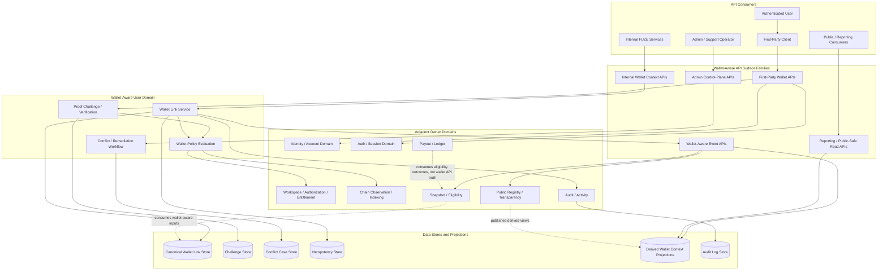
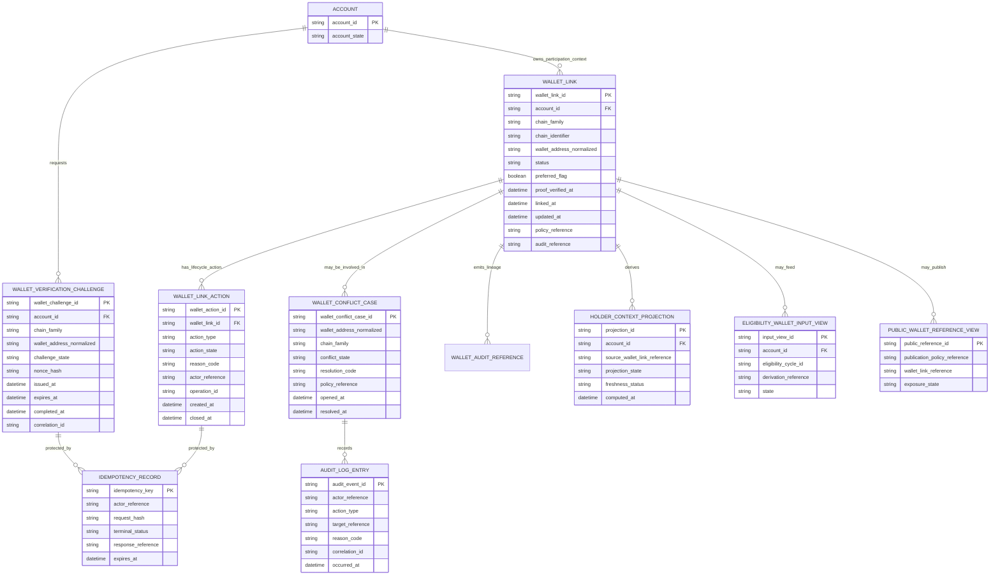
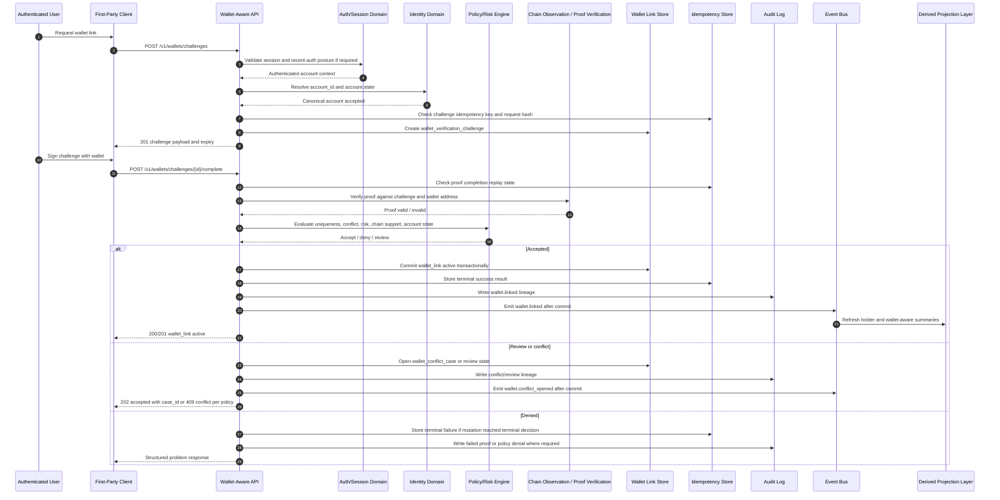

# WALLET_AWARE_USER_API_SPEC.md

## Document Metadata

- **Document Name:** `WALLET_AWARE_USER_API_SPEC.md`
- **Document Type:** FUZE API SPEC v2 / Production-grade interface-contract specification
- **Status:** Draft for canonical API SPEC v2 approval
- **Version:** 2.0.0
- **Effective Date:** 2026-04-24
- **Last Updated:** 2026-04-24
- **Reviewed On:** 2026-04-24
- **Document Owner:** FUZE Platform Wallet-Aware User Domain
- **Approval Authority:** FUZE Platform Architecture and Governance Authority
- **Review Cadence:** Quarterly or upon material change to wallet-linking, identity/account semantics, provider-link semantics, chain-boundary posture, eligibility/payout integration, public-registry exposure, security controls, or wallet-aware API route families
- **Governing Layer:** API contract layer derived from refined system semantics
- **Parent Registry:** `API_SPEC_INDEX.md` and FUZE API SPEC v2 Canonical File Registry
- **Upstream Semantic Registry:** `REFINED_SYSTEM_SPEC_INDEX.md`
- **Upstream API Registry:** `API_SPEC_INDEX.md`
- **Primary Audience:** Platform architecture, backend engineering, frontend engineering, API design, security engineering, audit, support operations, product engineering, chain-adjacent services, eligibility/payout systems, public-registry systems, reporting systems, SDK/OpenAPI authors, implementation-contract authors
- **Primary Purpose:** Define the production-grade API contract for wallet-aware user operations: wallet linking, proof verification, wallet lifecycle, wallet-aware account context, holder-aware derived context, conflict handling, public-safe exposure, events, admin correction, and downstream contract derivation without redefining identity, session, authorization, chain, payout, credits, registry, or reporting truth.
- **Primary Upstream References:** `WALLET_AWARE_USER_SPEC.md`; `IDENTITY_AND_ACCOUNT_SPEC.md`; `AUTH_SESSION_AND_LINKED_LOGIN_SPEC.md`; `FUZE_ACCOUNT_ACCESS_AND_SESSION_THESIS_FINAL_SPEC.md`; `FUZE_ACCOUNT_ACCESS_AND_SESSION_CANONICAL_FINAL_SPEC.md`; `FUZE_PROVIDER_RESOLUTION_AND_LINKING_SPEC.md`; `ONCHAIN_OFFCHAIN_RESPONSIBILITY_SPEC.md`; `PUBLIC_CONTRACT_AND_WALLET_REGISTRY_SPEC.md`; `SNAPSHOT_AND_ELIGIBILITY_PIPELINE_SPEC.md`; `ROLE_PERMISSION_AND_ACCESS_CONTROL_SPEC.md`; `WORKSPACE_AND_ORGANIZATION_SPEC.md`; `SYSTEM_BOUNDARY_AND_OWNERSHIP_SPEC.md`; `DOMAIN_OWNERSHIP_MATRIX_SPEC.md`; `DATA_MODEL_AND_ENTITY_OWNERSHIP_SPEC.md`; `API_ARCHITECTURE_SPEC.md`; `PUBLIC_API_SPEC.md`; `INTERNAL_SERVICE_API_SPEC.md`; `EVENT_MODEL_AND_WEBHOOK_SPEC.md`; `IDEMPOTENCY_AND_VERSIONING_SPEC.md`; `MIGRATION_AND_BACKWARD_COMPATIBILITY_SPEC.md`; `AUDIT_LOG_AND_ACTIVITY_SPEC.md`; `SECURITY_AND_RISK_CONTROL_SPEC.md`
- **Primary Downstream Dependents:** `ACCOUNT_ACCESS_AND_SESSION_CANONICAL_API_SPEC.md`; `PROVIDER_RESOLUTION_AND_LINKING_API_SPEC.md`; `SESSION_LIFECYCLE_AND_SECURITY_API_SPEC.md`; `SNAPSHOT_AND_ELIGIBILITY_PIPELINE_API_SPEC.md`; `PROFIT_PARTICIPATION_API_SPEC.md`; `PUBLIC_CONTRACT_AND_WALLET_REGISTRY_API_SPEC.md`; `PUBLIC_REGISTRY_LOOKUP_API_SPEC.md`; `PUBLIC_CHAIN_REFERENCE_API_SPEC.md`; product integration API specs; wallet-aware implementation contracts; OpenAPI and AsyncAPI artifacts; SDK contracts; admin/control-plane tools; audit and reporting implementation layers
- **API Surface Families Covered:** First-party application APIs; internal service APIs; admin/control-plane APIs; event/async APIs; reporting/read-model APIs; limited public-read companion exposure where explicitly policy-approved; chain-adjacent reference APIs
- **API Surface Families Excluded:** Smart-contract APIs; raw chain-indexer APIs; payout execution contract APIs; platform credits ledger APIs; stablecoin payout claim execution APIs; public registry publication schema details; product-specific holder-benefit formulas; generalized KYC/legal identity APIs; wallet custody/key-management APIs
- **Canonical System Owner(s):** FUZE Platform Wallet-Aware User Domain for wallet-link truth; Identity and Account Domain for canonical account identity; Auth/Session Domain for authentication and sessions; Chain/Registry/Eligibility/Payout/Audit domains for their separate truths
- **Canonical API Owner:** FUZE Platform API Architecture working with the Wallet-Aware User Domain
- **Supersedes:** Earlier `WALLET_AWARE_USER_API_SPEC.md` v1 material to the extent it conflicts with refined wallet-aware user semantics or this API SPEC v2 contract
- **Superseded By:** Not yet known
- **Related Decision Records:** Not yet known
- **Canonical Status Note:** This API specification is normative for wallet-aware API contracts but does not own wallet-aware system semantics. The refined wallet-aware system specification owns semantic truth; this document owns API expression, route-family posture, request/response/error/status contract rules, and downstream implementation-contract guardrails.
- **Implementation Status:** API contract baseline; downstream OpenAPI, AsyncAPI, service contracts, data contracts, admin tooling, SDKs, tests, and monitoring must conform
- **Approval Status:** Drafted for production API SPEC v2 review; formal approval record not yet attached
- **Change Summary:** Upgraded wallet-aware API guidance into API SPEC v2 format; aligned with active refined wallet-aware semantics dated 2026-04-21; separated wallet-link truth from canonical identity, auth/session, chain truth, eligibility, payout, public registry, authorization, and reporting truth; strengthened idempotency, replay, proof, conflict, admin, audit, event, migration, and derived-read rules; added implementation-useful Mermaid diagrams, flow view, acceptance criteria, and test cases.

---

## Purpose

This API specification defines how FUZE APIs expose and operate wallet-aware user capabilities while preserving the canonical FUZE separation between account identity, authentication, sessions, wallet linkage, chain truth, authorization, entitlements, eligibility, payouts, public registry publication, and reporting.

FUZE is Web3-aware, but it is not wallet-first. A wallet is a verified participation artifact attached to a canonical FUZE account. It may enrich holder-aware context, product display, eligibility inputs, public-safe registry views, or participation-related workflows, but it MUST NOT replace `account_id` as the actor anchor, MUST NOT become generic authorization truth, and MUST NOT collapse on-chain token ownership into off-chain account identity.

This document governs the API contract layer for wallet-aware user operations. It turns refined wallet-aware semantics into allowed API surface families, route/resource families, request and response rules, idempotency rules, proof and replay handling, conflict handling, admin/control-plane constraints, event posture, read-model boundaries, audit/observability requirements, and downstream OpenAPI/AsyncAPI/SDK derivation guardrails.

---

## Scope

This specification governs API contracts for:

1. initiating wallet-link proof challenges;
2. completing wallet-link proof verification;
3. creating, listing, restricting, unlinking, invalidating, and re-enabling wallet links;
4. managing preferred-wallet metadata where approved by policy;
5. resolving wallet-aware account context for first-party and internal consumers;
6. exposing holder-aware, token-aware, eligibility-facing, or registry-facing derived summaries without making those summaries canonical;
7. detecting and representing wallet conflicts;
8. supporting controlled admin/operator remediation;
9. emitting wallet-aware domain events after canonical commits;
10. enforcing idempotency, proof replay protection, audit lineage, authorization, correlation, traceability, versioning, migration, and contract derivation requirements.

---

## Out of Scope

This specification does not govern:

- canonical account identity semantics;
- authentication method ownership or ordinary session issuance;
- workspace membership, role assignment, permission evaluation, or entitlement truth;
- smart-contract implementation detail;
- wallet custody, private key management, seed phrase handling, or signing UX implementation;
- exact wallet-signature format beyond API contract obligations to carry challenge/proof references;
- chain-indexer implementation internals;
- Ethereum token balances, transfers, or token-contract truth;
- Platform Credits semantics;
- stablecoin payout execution truth;
- detailed snapshot/eligibility algorithms;
- public registry publication schema details;
- generalized legal identity, KYC, or AML workflows;
- product-specific holder-benefit formulas unless those formulas consume wallet-aware inputs through approved contracts.

---

## Design Goals

1. Preserve `account_id` as the durable actor anchor.
2. Make wallet links explicit, proof-based, auditable, conflict-safe, and replay-safe.
3. Permit one account to link zero, one, or many wallets without turning wallets into identity roots.
4. Keep on-chain truth separate from off-chain wallet-link truth.
5. Make wallet-aware context consumable by products, eligibility, registry, reporting, and public-read systems without letting those systems become hidden write owners.
6. Support safe first-party UX while preventing frontend-owned wallet truth.
7. Provide deterministic API behavior for duplicate proof submissions, retries, conflicts, degraded chain reads, and admin interventions.
8. Support OpenAPI, AsyncAPI, SDK, monitoring, audit, and QA derivation without allowing downstream reinterpretation.

---

## Non-Goals

This API specification is not intended to:

- make wallet possession sufficient identity proof for all FUZE access;
- treat wallet links as workspace authority, billing authority, admin authority, entitlement truth, or governance authority;
- treat token balance reads as canonical wallet-link ownership;
- permit public registry or reporting outputs to override private canonical wallet-link records;
- permit product-local wallet tables to become source-of-record;
- define exact cryptographic signing protocol internals;
- replace implementation-contract specs, database schema specs, OpenAPI files, AsyncAPI files, service runbooks, or security playbooks.

---

## Core Principles

### Account-First API Principle

Every wallet-aware user API MUST anchor ordinary user operations to `account_id`. Wallet links attach participation context to the account; they do not replace the account.

### Proof-Before-Link Principle

A wallet link MUST NOT become active until an owner-controlled backend pathway validates acceptable proof of wallet control, applies policy and uniqueness checks, records lineage, and commits canonical wallet-link state.

### Chain-Truth Separation Principle

On-chain balances, transfers, and contract state remain chain truth. Wallet-link APIs may reference, observe, or derive from chain truth, but they MUST NOT store chain facts as if they were wallet-link ownership truth.

### Authorization Separation Principle

Wallet-aware context MAY influence selected product visibility, holder-aware experience, or eligibility inputs where approved, but MUST NOT replace workspace membership, roles, permissions, entitlements, admin authority, billing authority, or governance-sensitive authorization.

### Derived-Read Safety Principle

Holder summaries, eligibility-facing views, public registry views, support views, analytics, caches, and reports are derived. They MUST be marked as derived, regenerable, provenance-aware where needed, and unable to mutate canonical wallet-link truth.

### Explicit Conflict Principle

Wallet conflicts MUST become explicit durable conflict or review states. APIs MUST NOT silently overwrite active wallet mappings, silently merge accounts, or silently reassign wallets.

### Admin Containment Principle

Admin/control-plane APIs MAY correct, restrict, contain, or re-enable wallet links only through bounded, policy-constrained, reason-coded, audited, and least-privileged pathways.

---

## Canonical Definitions

- **Account:** The canonical FUZE platform identity record and durable actor anchor.
- **Wallet:** A blockchain address or wallet-controlled address that may be linked to a FUZE account.
- **Wallet Link:** The platform-owned canonical record representing an account-to-wallet association.
- **Wallet Proof:** Evidence that the actor controlling the authenticated account controlled the wallet at the time of proof, such as an approved signature challenge result.
- **Wallet Verification Challenge:** A short-lived backend-issued challenge used to bind a specific account, wallet, chain family, nonce, and intended action.
- **Preferred Wallet:** A policy-approved metadata designation for display or selected non-critical behavior; it is not universal payout, eligibility, or authority meaning unless another governing spec explicitly says so.
- **Holder-Aware Context:** Derived platform context based on wallet links, chain truth, and policy.
- **Eligibility-Facing Wallet Context:** Derived or input state consumed by eligibility or payout-preparation systems; it is not canonical wallet-link truth and not final payout truth.
- **Wallet Conflict:** A controlled case where a wallet is contested, duplicated, misbound, security-sensitive, or otherwise unsafe to mutate through ordinary self-service.
- **Public Wallet Representation:** A policy-approved derived publication artifact or public-safe reference. It does not own wallet-link truth.

---

## Truth Class Taxonomy

| Truth Class | API Meaning | Canonical Owner | API Rule |
|---|---|---|---|
| Canonical identity truth | Account lifecycle and actor anchor | Identity and Account Domain | Wallet APIs MUST reference `account_id`; they MUST NOT redefine it. |
| Wallet-link truth | Account-to-wallet association and lifecycle | Wallet-Aware User Domain | Wallet APIs own contract expression of wallet-link operations. |
| Proof-input truth | Signatures, challenges, wallet claims, provider evidence | Input/evidence layer until accepted | Proof inputs are evidence only until accepted by owner-domain logic. |
| Chain truth | Token balances, transfers, contract state | Chain / smart-contract systems | APIs may observe/reference; they MUST NOT rewrite chain truth or store it as link ownership. |
| Policy truth | Proof policy, conflict policy, publication policy, eligibility policy | Relevant policy owners | APIs MUST capture policy/version references where material. |
| Runtime truth | Challenge windows, request context, replay windows | Runtime/API layer | Runtime state is subordinate to account, wallet-link, and policy truth. |
| Authorization truth | Workspace, roles, permissions, entitlements | Workspace / Authorization / Entitlement domains | Wallet context MAY be input; it MUST NOT be owner. |
| Eligibility truth | Cycle-specific eligibility datasets | Snapshot / Eligibility domain | Wallet APIs expose only derived or input context. |
| Payout truth | Payout ledger and execution outcome | Payout domains | Wallet APIs MUST NOT create payout truth. |
| Public registry truth | Publication output | Public Registry / Transparency domains | Public views are derived and correctable, not canonical wallet-link owners. |
| Derived read-model truth | Product summaries, holder caches, analytics, support views | Projection/reporting layers | Must be regenerable and non-mutating. |
| Presentation truth | UI formatting, labels, display ordering | Frontend/product surfaces | Must not become contract or storage truth. |

---

## Architectural Position in the Spec Hierarchy

This API specification sits below the refined wallet-aware user specification and the platform boundary/ownership specifications. It sits beside adjacent identity, auth/session, provider-linking, workspace, authorization, entitlement, chain, eligibility, payout, registry, audit, and event API specifications.

The refined system specs own semantic truth. This API spec owns how that truth is exposed, invoked, protected, audited, and projected through API contracts.

---

## Upstream Semantic Owners

Primary semantic owner:

- `WALLET_AWARE_USER_SPEC.md`

Material adjacent semantic owners:

- `IDENTITY_AND_ACCOUNT_SPEC.md` for canonical account identity;
- `AUTH_SESSION_AND_LINKED_LOGIN_SPEC.md` and account/session canonical documents for authentication and session truth;
- `FUZE_PROVIDER_RESOLUTION_AND_LINKING_SPEC.md` for provider normalization and linked-login boundaries;
- `ONCHAIN_OFFCHAIN_RESPONSIBILITY_SPEC.md` and `CHAIN_ARCHITECTURE_SPEC.md` for chain boundary posture;
- `SNAPSHOT_AND_ELIGIBILITY_PIPELINE_SPEC.md` for eligibility truth;
- payout and profit participation specs for payout truth;
- `PUBLIC_CONTRACT_AND_WALLET_REGISTRY_SPEC.md` and transparency specs for public publication truth;
- `WORKSPACE_AND_ORGANIZATION_SPEC.md`, `ROLE_PERMISSION_AND_ACCESS_CONTROL_SPEC.md`, and entitlement specs for access control;
- audit, security, event, idempotency, versioning, migration, and operations specs for cross-cutting API behavior.

---

## API Surface Families

### Public API Surface

General public anonymous wallet-link mutation APIs are not canonical. Public exposure MAY exist only as public-safe derived wallet registry lookup or public-chain-reference companion APIs governed by public registry and chain-reference specs.

### First-Party Application Surface

First-party application APIs support authenticated account holders listing, initiating, verifying, unlinking, and viewing wallet-aware context for their own account. These routes MUST be session-bound, account-scoped, least-disclosing, and replay-safe for mutations.

### Internal Service Surface

Internal service APIs allow trusted FUZE services to resolve wallet-aware account context, validate active wallet relationships, and consume derived holder context. Internal APIs MUST use service identity, explicit scope, least privilege, and read-only defaults unless explicitly owner-domain mutation routes are approved.

### Admin / Control-Plane Surface

Admin APIs support disablement, re-enable, conflict resolution, containment, and correction. They MUST be separate from ordinary user routes and require privileged operator identity, reason codes, policy references, case references where applicable, correlation IDs, audit lineage, and bounded effects.

### Event / Async Surface

Wallet-aware events are emitted after canonical commits. They inform consumers that wallet-link or derived-context state changed. Events are not mutation commands and MUST NOT be treated as permission to redefine wallet-link truth.

### Reporting / Projection Surface

Reporting and projection APIs may expose derived wallet-aware summaries, stale/freshness status, public-safe references, and analytics. They MUST be non-mutating and provenance-aware where ambiguity matters.

### Chain-Adjacent Surface

Chain-adjacent APIs may reference chain family, chain identifier, wallet address, transaction hash, block reference, snapshot source, or public chain reference. They MUST distinguish chain observations from accepted wallet-link state and final eligibility/payout outcomes.

---

## System / API Boundaries

The wallet-aware API domain governs:

- wallet-link request and proof-challenge contracts;
- wallet-link lifecycle mutation contracts;
- wallet-aware account-context read contracts;
- wallet conflict and remediation contracts;
- wallet-aware event contracts;
- wallet-aware audit and traceability requirements.

It does not govern:

- account creation, merge, or deletion semantics;
- authentication provider onboarding;
- ordinary session creation or revocation;
- workspace membership, role, permission, or entitlement outcomes;
- chain-state finality;
- eligibility cycle computation;
- payout ledger or payout execution;
- public registry publication ownership;
- product-local benefit policy.

---

## Adjacent API Boundaries

- `IDENTITY_AND_ACCOUNT_API_SPEC.md` owns account identity APIs.
- `AUTH_SESSION_AND_LINKED_LOGIN_API_SPEC.md` owns login, linked auth method, and session APIs.
- `PROVIDER_RESOLUTION_AND_LINKING_API_SPEC.md` owns provider evidence normalization and access-path linking.
- `ROLE_PERMISSION_AND_ACCESS_CONTROL_API_SPEC.md` and `ACCESS_EVALUATION_AND_EFFECTIVE_PERMISSION_API_SPEC.md` own authorization evaluation.
- `ENTITLEMENT_AND_CAPABILITY_GATING_API_SPEC.md` owns capability gating.
- `SNAPSHOT_AND_ELIGIBILITY_PIPELINE_API_SPEC.md` owns eligibility cycle computation.
- `PAYOUT_LEDGER_API_SPEC.md` and `BASE_PAYOUT_EXECUTION_LAYER_API_SPEC.md` own payout truth and execution.
- `PUBLIC_CONTRACT_AND_WALLET_REGISTRY_API_SPEC.md` and public companion API specs own public publication and lookup contracts.
- `AUDIT_LOG_AND_ACTIVITY_API_SPEC.md` owns durable audit record storage and query behavior.

Where overlap exists, the wallet-aware API provides wallet-link truth and derived wallet-aware inputs; adjacent APIs own their own domain outcomes.

---

## Conflict Resolution Rules

1. Canonical account identity wins over wallet, provider, public registry, product-local, and derived presentation data.
2. Canonical wallet-link records win over chain observations for account-to-wallet association.
3. Chain truth wins for token balances, transfers, and contract events.
4. Workspace/authorization/entitlement truth wins for access decisions.
5. Eligibility and payout truth win for cycle-specific eligibility and payout execution outcomes.
6. Public registry and transparency outputs are derived; they cannot override canonical private wallet-link truth.
7. Product-local wallet state, UI state, cache state, analytics state, support displays, and exports are non-canonical.
8. Contested wallet ownership MUST enter conflict or review state; it MUST NOT be silently reassigned.
9. When proof, policy, or uniqueness cannot be verified, mutation APIs MUST fail closed or return accepted review state, not active link success.
10. Historical snapshot, registry, or payout artifacts MUST NOT be silently rewritten by a later wallet-link change unless the owning downstream domain performs an explicit correction pathway.

---

## Default Decision Rules

- Default actor anchor: `account_id`.
- Default wallet-link owner: Wallet-Aware User Domain.
- Default interpretation of wallet signature: proof input, not durable truth.
- Default interpretation of chain observation: chain fact, not account mapping.
- Default interpretation of preferred wallet: display/non-critical preference only.
- Default interpretation of holder summary: derived and freshness-scoped.
- Default interpretation of public wallet view: policy-approved derived publication.
- Default outcome for ambiguous wallet collision: conflict/review, not overwrite.
- Default outcome for replayed mutation: idempotent return of original terminal result when fingerprint matches; conflict when fingerprint differs.
- Default outcome under degraded chain or proof infrastructure: block sensitive mutation or return bounded unavailable/error state.

---

## Roles / Actors / API Consumers

- **Authenticated End User:** May manage wallet links for the current account through first-party routes.
- **First-Party Client:** Initiates user wallet flows but never owns wallet truth.
- **Internal FUZE Service:** Consumes wallet-aware context for approved product, eligibility, registry, reporting, or risk uses.
- **Wallet-Aware User Service:** Owner-domain API and service layer for wallet-link truth.
- **Identity Service:** Provides canonical account identity.
- **Auth/Session Service:** Provides session validity and recent-auth posture.
- **Policy / Risk Service:** Provides risk, proof, conflict, and publication policy decisions.
- **Chain Observation / Indexing Service:** Provides chain observations; not wallet-link owner.
- **Eligibility / Payout Services:** Consume wallet-aware inputs for their own downstream truth.
- **Public Registry / Transparency Services:** Publish policy-approved derived outputs.
- **Admin / Support Operator:** May act only through bounded audited control-plane routes.
- **Audit / Observability Systems:** Record and inspect lineage, correlation, and state transitions.

---

## Resource / Entity Families

### Canonical API Resources

- `wallet_link`
- `wallet_verification_challenge`
- `wallet_conflict_case`
- `wallet_mutation_operation`
- `wallet_policy_evaluation_reference`
- `wallet_event_reference`

### Derived API Resources

- `wallet_aware_account_context`
- `holder_aware_summary`
- `eligibility_facing_wallet_summary`
- `public_wallet_reference_view`
- `support_wallet_context_view`

### Cross-Domain References

- `account_id`
- `session_id` or session reference where exposed internally
- `chain_family`
- `chain_id` or approved chain identifier
- `wallet_address_normalized`
- `snapshot_id` / `eligibility_cycle_id` where allowed
- `public_registry_entry_id` where allowed
- `audit_event_id`
- `correlation_id`
- `trace_id`
- `operation_id`
- `idempotency_key`

---

## Ownership Model

Only wallet-aware owner-domain APIs may mutate canonical wallet-link truth. Product APIs, public APIs, registry APIs, reporting APIs, eligibility APIs, payout APIs, chain-indexer APIs, admin UIs, frontend stores, and caches MUST NOT directly write canonical wallet-link records.

Admin APIs do not become owners. They invoke owner-domain workflows with stronger authorization, reason codes, audit, policy checks, and bounded state transitions.

Derived view APIs do not become owners. They expose current or historical summaries whose provenance must map back to canonical wallet-link truth and adjacent owner-domain facts.

---

## Authority / Decision Model

Wallet-aware API decision authority consists of:

1. authenticated account context or approved secure flow;
2. proof acceptance under wallet-aware policy;
3. uniqueness/collision/conflict checks;
4. security and risk evaluation;
5. chain-family support validation;
6. owner-domain transaction commit;
7. audit and event emission;
8. derived projection refresh.

No route may skip owner-domain validation because a wallet signature, frontend session, public registry entry, product cache, or chain read appears convincing.

---

## Authentication Model

First-party user wallet routes MUST require an authenticated session for the current account. Sensitive mutations SHOULD require recent-auth or equivalent step-up confirmation where policy requires.

Internal service routes MUST require service identity, approved scopes, mTLS or equivalent service authentication where implemented, and policy-based least privilege.

Admin routes MUST require privileged operator identity, strong session posture, explicit operator role, reason-coded action, and case/policy references where applicable.

Wallet proof itself is not ordinary platform authentication unless a separate auth/session spec explicitly authorizes a wallet-auth access path. In this spec, wallet proof proves wallet control for link semantics; it does not by itself create a platform session.

---

## Authorization / Scope / Permission Model

Wallet-aware APIs MUST evaluate:

- authenticated account identity;
- current session validity;
- target account scope;
- ownership of target wallet-link resource;
- action sensitivity;
- current wallet-link state;
- chain-family support;
- conflict/risk/review status;
- admin/operator privilege for privileged flows;
- internal service scope for service-to-service reads;
- publication policy for public-safe views.

Wallet-aware context MUST NOT automatically grant workspace ownership, billing authority, product administration, support access, governance-sensitive action, or entitlement.

---

## Entitlement / Capability-Gating Model

Entitlement and capability gating may consume wallet-aware context as an input only when explicitly authorized by entitlement policy. Wallet-aware APIs MUST NOT output entitlement success as if wallet linkage alone created capability.

Responses that include product-safe flags MUST label them as derived or policy-evaluated context and SHOULD include policy/freshness references where needed. Entitlement-denial reasons remain owned by entitlement APIs.

---

## API State Model

### Wallet Link States

- `pending_verification`
- `active`
- `restricted`
- `unlinked`
- `superseded`
- `invalidated`
- `blocked_conflict`
- `blocked_risk_review`

Only `active` links may be used as ordinary wallet-aware participation context. Restricted, invalidated, superseded, or blocked links may be visible for continuity, audit, support, or remediation but MUST NOT be treated as active ordinary participation links.

### Challenge States

- `issued`
- `completed`
- `expired`
- `failed`
- `cancelled`

A challenge is short-lived runtime/proof state. It must not be a long-term account-to-wallet mapping unless completed and accepted by owner-domain logic.

### Conflict States

- `opened`
- `pending_review`
- `awaiting_evidence`
- `contained`
- `resolved`
- `cancelled`
- `escalated`

Conflict state MUST be durable and auditable.

### Derived Context States

- `current`
- `stale`
- `refresh_pending`
- `unavailable`
- `superseded`

Derived context state MUST NOT mutate canonical wallet-link truth.

---

## Lifecycle / Workflow Model

### Wallet Link Lifecycle

1. User is authenticated to a canonical account.
2. User requests a wallet challenge for a specific wallet address and chain family.
3. API normalizes wallet address and validates chain support.
4. API creates short-lived challenge and records correlation lineage.
5. User completes proof through approved wallet interaction.
6. API validates proof, challenge freshness, nonce, actor/account binding, chain family, and replay posture.
7. API evaluates uniqueness, conflict, risk, account state, and policy.
8. If accepted, owner-domain commit creates or activates `wallet_link`.
9. API writes audit lineage and idempotency outcome.
10. API emits wallet-aware events after commit.
11. Derived projections refresh asynchronously.

### Wallet Unlink Lifecycle

1. User requests unlink for an owned active wallet link.
2. API validates session, target ownership, recent-auth where needed, conflict state, and policy blockers.
3. API transitions link to `unlinked` or review/blocked state.
4. API preserves lineage, emits event, and refreshes projections.
5. Historical eligibility/payout/public registry artifacts remain governed by downstream owners.

### Wallet Conflict Lifecycle

1. API detects duplicate, contested, misbound, suspicious, or policy-blocked wallet relation.
2. API opens durable conflict state and blocks unsafe ordinary mutation.
3. Admin/support/risk workflow collects evidence and applies policy.
4. Owner-domain remediation transitions affected links with reason codes.
5. API emits events and audit records.
6. Downstream projections and public-safe outputs refresh without unauthorized historical rewrite.

---

## Architecture Diagram — Mermaid flowchart

---

## Data Design — Mermaid Diagram

---

## Flow View

### Synchronous User Link Flow

1. `POST /v1/wallets/challenges` receives wallet address, chain family, optional network hint, and idempotency key.
2. API authenticates session and resolves current `account_id`.
3. API normalizes wallet address and validates supported chain family.
4. API checks whether an equivalent challenge exists for the same actor and request fingerprint.
5. API creates or returns a valid challenge with expiration and signing payload.
6. User signs challenge through wallet UX.
7. `POST /v1/wallets/challenges/{challenge_id}/complete` receives proof payload.
8. API validates challenge, proof, nonce, expiry, account binding, chain family, uniqueness, policy, and risk.
9. API commits wallet-link state if accepted, or creates conflict/review state if unsafe.
10. API records idempotency terminal result and audit lineage.
11. API returns active link, conflict/review outcome, or structured error.
12. Post-commit events refresh derived projections and notify downstream consumers.

### Async / Accepted-State Flow

Some conflict remediation, containment, and derived context refresh operations MAY return `202 Accepted` with `operation_id` or `case_id`. `202 Accepted` means the request was accepted for processing; it does not mean final business success. Final outcome is represented by owner-domain state, events, and follow-up status routes.

### Failure and Retry Flow

- Expired challenge returns `WALLET_CHALLENGE_EXPIRED`.
- Invalid proof returns `WALLET_PROOF_INVALID`.
- Already-linked wallet returns `WALLET_ALREADY_LINKED` or opens conflict depending on policy.
- Replayed identical request returns original idempotent terminal outcome.
- Replayed key with different request hash returns `WALLET_IDEMPOTENCY_CONFLICT`.
- Chain-read degradation does not invalidate canonical wallet-link truth; it may make derived holder context `stale` or `unavailable`.

### Admin / Operator Flow

1. Operator authenticates through admin/control-plane route.
2. API evaluates operator role, policy, reason code, case reference, and target state.
3. API performs owner-domain transition only if bounded workflow allows it.
4. API records critical audit event with before/after summary.
5. API emits event and refreshes derived/public outputs where approved.

---

## Data Flows — Mermaid sequenceDiagram

---

## Request Model

All mutation requests MUST include or support:

- authenticated actor context from the platform session or service identity;
- explicit `chain_family` where wallet address interpretation depends on chain family;
- normalized wallet address treatment performed server-side;
- `Idempotency-Key` for side-effecting operations vulnerable to replay;
- `X-Correlation-ID` or equivalent correlation reference;
- content type `application/json` unless a downstream contract explicitly specifies otherwise;
- reason code and operator note for admin/control-plane mutations;
- policy/case references where required by privileged workflows.

Request bodies MUST NOT treat frontend-supplied wallet state, public registry displays, product-local wallet IDs, or chain-balance claims as canonical owner-domain assertions.

---

## Response Model

Successful mutation responses MUST include:

- stable resource identifier (`wallet_link_id`, `wallet_challenge_id`, `operation_id`, or `case_id` as applicable);
- resulting state;
- account scope reference where safe;
- wallet address representation according to privacy policy;
- chain family and chain identifier where applicable;
- timestamps relevant to state;
- audit/correlation references where safe to expose;
- freshness and derivation markers for derived context.

Read responses MUST distinguish:

- canonical wallet-link fields;
- proof/challenge runtime fields;
- derived holder or eligibility summaries;
- public-safe presentation fields;
- stale or unavailable projection state.

Admin responses MUST include resulting state, reason-code echo, operation/case identifier, and correlation reference. They MUST NOT expose sensitive risk heuristics to unauthorized clients.

---

## Error / Result / Status Model

Wallet-aware APIs MUST use structured problem responses with stable machine-readable codes.

Required fields:

- `type`
- `title`
- `status`
- `code`
- `detail`
- `instance`
- `correlation_id`
- optional `retry_after`
- optional `operation_id`
- optional `case_id`

### Core Error Codes

- `WALLET_SESSION_REQUIRED`
- `WALLET_REAUTH_REQUIRED`
- `WALLET_PERMISSION_DENIED`
- `WALLET_OPERATOR_PERMISSION_DENIED`
- `WALLET_CHAIN_FAMILY_UNSUPPORTED`
- `WALLET_ADDRESS_INVALID`
- `WALLET_CHALLENGE_EXPIRED`
- `WALLET_CHALLENGE_INVALID`
- `WALLET_PROOF_INVALID`
- `WALLET_PROOF_REPLAY_DETECTED`
- `WALLET_ALREADY_LINKED`
- `WALLET_CONFLICT_DETECTED`
- `WALLET_STATE_INVALID`
- `WALLET_RISK_REVIEW_REQUIRED`
- `WALLET_IDEMPOTENCY_KEY_REQUIRED`
- `WALLET_IDEMPOTENCY_CONFLICT`
- `WALLET_DERIVED_CONTEXT_STALE`
- `WALLET_DERIVED_CONTEXT_UNAVAILABLE`
- `WALLET_ADMIN_REASON_REQUIRED`
- `WALLET_POLICY_DENIED`
- `WALLET_RATE_LIMITED`

### Status Semantics

- `200 OK`: read success or idempotent mutation replay returning prior success.
- `201 Created`: new challenge or new wallet link created.
- `202 Accepted`: review, conflict remediation, or async projection refresh accepted but not final.
- `400 Bad Request`: malformed request.
- `401 Unauthorized`: no valid authentication.
- `403 Forbidden`: authenticated but not authorized.
- `404 Not Found`: resource not visible or nonexistent in caller scope.
- `409 Conflict`: state, uniqueness, idempotency, or contested wallet conflict.
- `422 Unprocessable Entity`: semantically invalid proof or wallet data.
- `429 Too Many Requests`: rate or abuse control.
- `503 Service Unavailable`: dependency unavailable where safe to retry.

---

## Idempotency / Retry / Replay Model

Idempotency is mandatory for:

- challenge creation where duplicate user actions are likely;
- challenge completion;
- wallet unlink;
- preferred wallet updates;
- admin disable/re-enable;
- conflict resolution;
- emergency containment;
- any operation that mutates wallet-link state or wallet conflict state.

Rules:

1. Idempotency scope MUST include actor/account, route family, request fingerprint, and target resource where applicable.
2. Same key and same semantic request MUST return original terminal outcome.
3. Same key and different semantic request MUST fail with `WALLET_IDEMPOTENCY_CONFLICT`.
4. Proof challenge completion MUST be single-effective.
5. Signature/proof replay MUST be detected separately from ordinary HTTP retry idempotency.
6. Idempotency records MUST be retained for a policy-defined window suitable for wallet-link and admin risk.
7. Transactional uniqueness checks MUST occur at canonical commit time.
8. Derived projection refresh retries MUST NOT create duplicate canonical wallet-link mutations.

---

## Rate Limit / Abuse-Control Model

Wallet-aware APIs MUST apply abuse controls to:

- challenge issuance;
- proof completion attempts;
- repeated invalid proof submissions;
- wallet-link collisions;
- unlink/relink churn;
- admin/control-plane bulk containment;
- internal context-resolution hot paths.

Rate limits MAY be scoped by account, session, wallet address, chain family, IP/device/risk signal, internal service identity, or operator identity. Error responses MUST be safe and avoid leaking sensitive risk heuristics.

---

## Endpoint / Route Family Model

This specification defines route families, not final OpenAPI endpoint listings. Downstream OpenAPI MUST preserve the following route posture.

### First-Party Application Routes

- `GET /v1/wallets`
- `POST /v1/wallets/challenges`
- `POST /v1/wallets/challenges/{wallet_challenge_id}/complete`
- `DELETE /v1/wallets/{wallet_link_id}`
- `POST /v1/wallets/{wallet_link_id}/preferred`
- `GET /v1/wallet-aware/me`
- `GET /v1/wallet-aware/holder-summary`
- `GET /v1/wallet-aware/eligibility-summary`

### Internal Service Routes

- `GET /internal/v1/accounts/{account_id}/wallet-context`
- `POST /internal/v1/wallets/validations`
- `GET /internal/v1/accounts/{account_id}/holder-context`
- `GET /internal/v1/wallets/{wallet_link_id}`

### Admin / Control-Plane Routes

- `POST /admin/v1/wallets/{wallet_link_id}/disable`
- `POST /admin/v1/wallets/{wallet_link_id}/reenable`
- `POST /admin/v1/wallet-conflicts/{wallet_conflict_case_id}/resolve`
- `POST /admin/v1/wallet-containment`
- `GET /admin/v1/wallet-conflicts/{wallet_conflict_case_id}`

### Event Families

- `wallet.challenge_issued`
- `wallet.proof_completed`
- `wallet.proof_failed`
- `wallet.linked`
- `wallet.unlinked`
- `wallet.restricted`
- `wallet.invalidated`
- `wallet.preferred_changed`
- `wallet.conflict_opened`
- `wallet.conflict_resolved`
- `wallet.containment_applied`
- `wallet.derived_context_refresh_requested`
- `wallet.derived_context_refreshed`

---

## Public API Considerations

Public APIs MUST default to no exposure of private account-to-wallet associations. Public wallet lookup or registry exposure MAY exist only through public registry/public trust API specs, policy-approved publication rules, and public-safe derived views.

Public APIs MUST NOT expose:

- private account linkage by wallet address unless explicitly approved;
- unresolved conflict details;
- internal risk/review state;
- operator notes;
- private eligibility or payout context;
- full wallet history where privacy policy does not allow it.

---

## First-Party Application API Considerations

First-party routes should optimize for safe wallet-link UX without weakening backend ownership:

- challenge payloads MUST be backend-issued;
- frontend MUST NOT invent challenge text as canonical;
- proof completion MUST bind account, wallet, nonce, chain family, and challenge identifier;
- reads MUST separate canonical wallet-link state from derived holder summaries;
- unlink UX MUST surface blockers where safe without exposing sensitive risk details;
- stale derived context MUST be explicitly labeled.

---

## Internal Service API Considerations

Internal wallet context APIs MUST be least-privileged. They should expose only the fields needed for the requesting service purpose.

Internal consumers MUST NOT cache wallet-aware context indefinitely for sensitive decisions. They MUST respect freshness metadata, invalidation events, and owner-domain reads for sensitive or final decisions.

Internal service mutation shortcuts are forbidden unless they call the same owner-domain validation pipeline as first-party or admin routes and are explicitly approved.

---

## Admin / Control-Plane API Considerations

Admin APIs MUST:

- be separate from first-party user routes;
- require strong operator authentication and authorization;
- require reason codes;
- require operator notes where material;
- require case references for conflict/remediation flows;
- record before/after state summaries;
- emit critical audit events;
- prevent silent destructive rewrites;
- support rollback only through explicit new owner-domain actions, not hidden database edits.

Admin APIs MUST NOT:

- directly edit storage without owner-domain validation;
- silently reassign wallets;
- bypass idempotency;
- conceal operator identity from audit;
- cause public registry or eligibility corrections without invoking the owning downstream domain’s correction pathway.

---

## Event / Webhook / Async API Considerations

Wallet-aware domain events are internal by default. Public webhooks, if ever approved, MUST expose narrower and safer event views than internal events.

Events MUST include:

- event ID;
- event type;
- version;
- occurred_at;
- actor or system initiator reference where safe;
- account reference where allowed;
- wallet_link reference;
- chain family;
- resulting state;
- correlation ID;
- causation ID;
- policy reference where material.

Events MUST NOT include raw proof secrets, nonces, sensitive risk heuristics, private operator notes, or more wallet information than the consumer is allowed to know.

---

## Chain-Adjacent API Considerations

Wallet APIs may accept and return chain-family metadata. They MUST:

- normalize wallet addresses server-side;
- distinguish chain identifier from wallet-link identity;
- distinguish chain observation from accepted wallet-link state;
- preserve chain finality uncertainty where material;
- avoid representing token balance reads as account authority;
- avoid rewriting historical wallet-link state from later chain observations;
- route detailed chain reference/public lookup behavior to chain/public registry APIs.

---

## Data Model / Storage Support Implications

Implementation contracts MUST support at minimum:

- durable `wallet_link` records;
- durable short-lived `wallet_verification_challenge` records;
- durable `wallet_conflict_case` or equivalent remediation records;
- durable wallet action/operation records;
- idempotency records;
- audit event references;
- projection/derived context records with freshness/provenance;
- uniqueness constraints preventing active same-chain wallet assignment to multiple accounts except explicit conflict posture;
- state transition history or lineage sufficient for recovery and audit.

Destructive deletes are non-canonical for sensitive wallet history. Terminal states and explicit correction lineage are preferred.

---

## Read Model / Projection / Reporting Rules

Read models MAY summarize wallet-aware state only when:

- they are clearly derived;
- they can be regenerated from canonical owner truth and approved upstream sources;
- they preserve freshness and provenance where material;
- they do not invent wallet states;
- they do not coalesce accounts by wallet unless explicitly governed;
- they cannot mutate wallet-link truth;
- they respect publication and privacy policy.

If a derived view disagrees with canonical wallet-link records, canonical wallet-link records win for wallet association. If a derived holder view disagrees with chain truth, chain truth and the owning chain/eligibility policies govern the chain-specific meaning.

---

## Security / Risk / Privacy Controls

Wallet linkage is security-sensitive. APIs MUST support:

- proof-based linking;
- challenge expiration;
- nonce/replay protection;
- uniqueness and collision detection;
- unlink safeguards;
- rate limiting and abuse monitoring;
- suspicious-link review posture;
- recent-auth or step-up checks where policy requires;
- privacy-safe wallet address representation;
- public exposure gating;
- containment workflows;
- audited privileged correction.

Wallet APIs MUST NOT over-disclose wallet associations in public or cross-account contexts.

---

## Audit / Traceability / Observability Requirements

Every material wallet-aware mutation MUST produce durable lineage sufficient to answer:

- who initiated the action;
- which account was affected;
- which wallet and chain family were involved;
- what proof/challenge or evidence was accepted;
- what policy version or rule set was used;
- what previous and resulting states were;
- whether conflict, review, or operator override occurred;
- which idempotency key, operation ID, correlation ID, and trace ID connect the workflow;
- what downstream events were emitted.

Observability MUST track challenge issuance/completion, proof failures, conflicts, replay detections, duplicate wallet attempts, admin actions, projection lag, dependency degradation, rate limiting, and event delivery failures.

---

## Failure Handling / Edge Cases

### Account Has No Wallet

The account remains a valid FUZE account. APIs return empty wallet lists and derived holder context marked absent or unavailable without treating the account as invalid.

### Wallet Already Linked Elsewhere

The API returns conflict or review posture. It MUST NOT silently reassign the wallet.

### Challenge Expires

Completion returns `WALLET_CHALLENGE_EXPIRED`. A new challenge may be requested subject to rate limits.

### Proof Replay

Replay is rejected or idempotently returned if it matches the same terminal operation. It MUST NOT create duplicate wallet links.

### Chain Reads Degraded

Existing active wallet links remain platform truth. Derived holder/token context may be `stale` or `unavailable`.

### Wallet Unlinked After Historical Snapshot

Current wallet-aware context changes prospectively. Historical eligibility or payout artifacts are governed by downstream cycle policy and MUST NOT be silently rewritten by wallet unlink.

### Product Cache Stale

Fresh owner-domain reads and invalidation events override product cache for sensitive decisions.

### Support Error or Misbinding

A conflict/remediation case is required. Corrective action must be reason-coded, audited, and lineage-preserving.

---

## Migration / Versioning / Compatibility / Deprecation Rules

Wallet-aware APIs are versioned by route family (`/v1`, `/internal/v1`, `/admin/v1`) and event version.

Compatible changes include additive fields, new derived summaries, additional safe error metadata, and new supported chain families where existing semantics remain stable.

Breaking changes include:

- changing the meaning of `active`, `restricted`, `unlinked`, `invalidated`, or `blocked_conflict`;
- changing wallet uniqueness semantics;
- changing proof acceptance semantics incompatibly;
- changing public exposure posture;
- removing idempotency requirements;
- treating wallet proof as login without auth/session spec approval;
- collapsing wallet-link truth into eligibility, payout, registry, or product truth.

Deprecations MUST include documented migration windows, compatibility guidance, and contract tests.

---

## OpenAPI / AsyncAPI / SDK Derivation Rules

OpenAPI artifacts MUST preserve:

- route-family separation;
- stable resource identifiers;
- canonical vs derived field distinction;
- status and error code semantics;
- idempotency-key requirements;
- correlation and operation references;
- admin reason-code requirements;
- privacy-safe wallet address representation;
- derived context freshness markers.

AsyncAPI artifacts MUST preserve:

- event versioning;
- canonical commit-before-event rule;
- causation/correlation IDs;
- non-mutating consumer semantics;
- absence of sensitive proof/risk/operator secrets.

SDKs MUST NOT flatten all wallet states into a boolean such as `hasWallet` for contract-sensitive behavior. SDK convenience helpers MAY exist only if they preserve state, freshness, and derived/canonical distinctions.

---

## Implementation-Contract Guardrails

1. Do not build frontend-only wallet linking state.
2. Do not store wallet associations only in product-local tables.
3. Do not let chain indexers update wallet-link ownership directly.
4. Do not let public registry outputs become source-of-record.
5. Do not let eligibility or payout datasets rewrite wallet-link history.
6. Do not let admin tools bypass owner-domain workflows.
7. Do not omit idempotency for sensitive wallet mutations.
8. Do not omit audit lineage for proof acceptance, unlink, conflict, or admin correction.
9. Do not expose private wallet-link details publicly without publication policy.
10. Do not represent wallet proof as authentication unless the auth/session API spec explicitly adopts that flow.

---

## Downstream Execution Staging

1. Define canonical wallet-link and challenge storage contracts.
2. Define first-party wallet challenge and completion OpenAPI.
3. Define internal wallet-context service contract.
4. Define admin conflict/remediation control-plane contract.
5. Define idempotency, audit, and observability implementation contracts.
6. Define event schemas and projection refresh semantics.
7. Define public-safe registry integration separately.
8. Define eligibility/payout consumption contracts separately.
9. Add contract tests, regression tests, migration tests, and boundary-violation tests.

---

## Required Downstream Specs / Contract Layers

- Wallet link storage contract
- Wallet proof/challenge implementation contract
- Wallet conflict and remediation implementation contract
- Wallet-aware event AsyncAPI contract
- Wallet-aware OpenAPI contract
- Wallet context internal service contract
- Admin/control-plane wallet correction contract
- Wallet-aware audit mapping contract
- Public registry wallet-reference contract
- Eligibility wallet-input contract
- SDK state model contract

---

## Boundary Violation Detection / Non-Canonical API Patterns

Forbidden patterns include:

- product-local canonical wallet tables;
- frontend-only wallet link truth;
- wallet address as universal user ID;
- wallet signature as generic session authority without auth/session approval;
- chain balance as workspace authorization;
- public registry as wallet-link owner;
- payout or snapshot data rewriting wallet-link records;
- admin direct database edits without owner-domain API and audit;
- derived holder cache used for final sensitive decision after freshness expiry;
- boolean-only wallet state in SDKs for contract-sensitive behavior;
- route aliases that hide whether a response is canonical, derived, public, or presentation truth.

Detection SHOULD be implemented through contract tests, schema linting, audit monitoring, route review, and data lineage review.

---

## Canonical Examples / Anti-Examples

### Canonical Example — User Links Wallet

An authenticated user requests a challenge, signs it, and backend verifies proof and commits an active wallet link for the user’s `account_id`. The active link becomes wallet-link truth. Holder summary refreshes asynchronously as derived context.

### Canonical Example — Product Consumes Holder Context

A product calls an internal wallet-context API and receives a derived holder summary with freshness metadata. The product uses it for approved display behavior but does not create its own wallet mapping table.

### Canonical Example — Wallet Conflict

A wallet already linked to another account is claimed by a second account. The API opens conflict/review state and blocks silent reassignment.

### Anti-Example — Wallet as Identity

A product treats `wallet_address` as the canonical FUZE user identity and bypasses `account_id`. This is forbidden.

### Anti-Example — Chain Balance as Authorization

A route grants workspace admin authority because a wallet holds tokens. This is forbidden.

### Anti-Example — Public Registry Override

A public wallet registry entry is used to rewrite canonical private wallet-link state. This is forbidden.

### Anti-Example — Admin Storage Edit

A support operator edits wallet-link rows directly without reason code, policy reference, and audit lineage. This is forbidden.

---

## Acceptance Criteria

1. Every wallet-link mutation route requires authenticated actor or approved service/admin identity.
2. Wallet challenge creation records account binding, wallet address, chain family, nonce/hash, expiry, and correlation reference.
3. Challenge completion rejects expired, invalid, mismatched, or replayed proof inputs.
4. Active wallet links cannot be duplicated across accounts for the same chain family outside explicit conflict/remediation posture.
5. Wallet-link state transitions are durable and auditable.
6. User routes cannot mutate wallets outside the current account scope.
7. Admin routes require privileged operator identity, reason code, correlation ID, and audit write.
8. Public/read/reporting outputs are explicitly derived and non-mutating.
9. Holder summaries expose freshness/provenance and cannot become canonical wallet-link truth.
10. Chain observations are never stored as account-to-wallet ownership without proof acceptance and owner-domain commit.
11. Wallet-aware context is not treated as workspace, permission, entitlement, billing, or governance authority.
12. Idempotency keys are enforced for sensitive mutations.
13. Replaying a matching idempotent request returns the original terminal result.
14. Reusing an idempotency key with a different request fails with conflict.
15. Conflict cases are represented explicitly and cannot be resolved silently.
16. Events are emitted only after canonical commit.
17. Event consumers are documented as non-owners of wallet-link truth.
18. Derived projection failures do not roll back committed canonical wallet-link state.
19. Degraded chain reads mark derived context stale/unavailable without invalidating wallet links.
20. OpenAPI/AsyncAPI/SDK artifacts preserve canonical/derived/admin/public distinctions.
21. Migration plans exist for any wallet state or proof semantics change.
22. Audit logs can answer actor, target, proof basis, policy, before/after state, reason, correlation, and event lineage.

---

## Test Cases

### Positive Path Tests

1. Authenticated user creates wallet challenge for supported chain family and receives challenge payload.
2. User completes valid proof; API creates active wallet link and emits `wallet.linked`.
3. User lists wallets and sees active wallet with verification timestamp.
4. Internal service resolves wallet context with service identity and approved scope.
5. Derived holder summary returns `current` freshness when projection is up to date.
6. User unlinks wallet; state transitions to `unlinked`, audit is written, event is emitted.

### Negative Path Tests

7. Unauthenticated request to create challenge returns `WALLET_SESSION_REQUIRED`.
8. Unsupported chain family returns `WALLET_CHAIN_FAMILY_UNSUPPORTED`.
9. Invalid wallet address returns `WALLET_ADDRESS_INVALID`.
10. Expired challenge completion returns `WALLET_CHALLENGE_EXPIRED`.
11. Invalid signature returns `WALLET_PROOF_INVALID`.
12. Proof for different wallet address fails.
13. User attempts to unlink another account’s wallet and receives authorization failure.

### Authorization / Entitlement Tests

14. Valid wallet link does not grant workspace admin authority.
15. Valid wallet link does not grant billing authority.
16. Product feature gating that uses holder context must call entitlement/capability policy and cannot infer entitlement from wallet link alone.
17. Internal service without wallet-context scope is denied.

### Idempotency / Retry / Replay Tests

18. Repeating challenge creation with same idempotency key and same request returns same active challenge where policy allows.
19. Repeating challenge completion with same proof returns same terminal result.
20. Reusing idempotency key with different wallet address returns `WALLET_IDEMPOTENCY_CONFLICT`.
21. Replaying a completed proof outside the original operation fails or returns original terminal result without new link.
22. Concurrent attempts to link same wallet to two accounts produce one accepted link and one conflict/review outcome.

### Conflict / Admin Tests

23. Wallet already active on another account opens conflict or returns conflict according to policy; no silent reassignment occurs.
24. Admin disable without reason code fails.
25. Admin disable with valid operator, reason, and policy succeeds and writes critical audit.
26. Conflict resolution requires case ID and produces before/after lineage.
27. Emergency containment is idempotent and bounded to requested scope.

### Rate Limit / Abuse Tests

28. Excessive challenge creation for the same account or wallet returns `WALLET_RATE_LIMITED`.
29. Repeated invalid proof attempts trigger risk/review posture.
30. Internal service excessive validation requests are rate-limited or degraded according to service policy.

### Degraded Mode Tests

31. Chain observation dependency unavailable does not invalidate existing wallet link.
32. Holder summary returns `stale` or `unavailable` when projection fails.
33. Sensitive link completion fails closed if required proof verification dependency is unavailable.

### Audit / Observability Tests

34. Wallet linked audit includes actor, account, wallet, chain, proof basis, policy reference, before/after, correlation, and trace.
35. Admin remediation audit includes operator, reason, case, before/after, and event references.
36. Event delivery failure is observable and retryable without duplicate wallet mutation.

### Migration / Compatibility Tests

37. Adding new optional response field does not break existing clients.
38. Changing wallet-link state enum without versioned migration fails compatibility review.
39. SDK preserves wallet states and does not flatten contract-sensitive states into a boolean.
40. Public API exposure change requires public registry/public trust approval and privacy review.

### Boundary-Violation Tests

41. Product route attempting to write wallet-link storage directly fails contract review.
42. Public registry route attempting to mutate wallet-link truth fails contract review.
43. Eligibility pipeline attempting to rewrite wallet history fails contract review.
44. Chain indexer attempting to mark wallet active without proof acceptance fails contract review.
45. Admin database edit without API/audit path is detected as non-canonical.

---

## Dependencies / Cross-Spec Links

This specification depends on:

- `REFINED_SYSTEM_SPEC_INDEX.md`
- `DOCS_SPEC_INDEX.md`
- `SYSTEM_SPEC_INDEX.md`
- `API_SPEC_INDEX.md`
- `WALLET_AWARE_USER_SPEC.md`
- `IDENTITY_AND_ACCOUNT_SPEC.md`
- `AUTH_SESSION_AND_LINKED_LOGIN_SPEC.md`
- `FUZE_ACCOUNT_ACCESS_AND_SESSION_THESIS_FINAL_SPEC.md`
- `FUZE_ACCOUNT_ACCESS_AND_SESSION_CANONICAL_FINAL_SPEC.md`
- `FUZE_PROVIDER_RESOLUTION_AND_LINKING_SPEC.md`
- `FUZE_ACCOUNT_ACCESS_CONTINUITY_SPEC.md`
- `FUZE_ACCOUNT_RECOVERY_AND_CONFLICT_HANDLING_SPEC.md`
- `SESSION_LIFECYCLE_AND_SECURITY_SPEC.md`
- `ONCHAIN_OFFCHAIN_RESPONSIBILITY_SPEC.md`
- `CHAIN_ARCHITECTURE_SPEC.md`
- `PUBLIC_CONTRACT_AND_WALLET_REGISTRY_SPEC.md`
- `SNAPSHOT_AND_ELIGIBILITY_PIPELINE_SPEC.md`
- `PROFIT_PARTICIPATION_SYSTEM_SPEC.md`
- `WORKSPACE_AND_ORGANIZATION_SPEC.md`
- `ROLE_PERMISSION_AND_ACCESS_CONTROL_SPEC.md`
- `ENTITLEMENT_AND_CAPABILITY_GATING_SPEC.md`
- `API_ARCHITECTURE_SPEC.md`
- `PUBLIC_API_SPEC.md`
- `INTERNAL_SERVICE_API_SPEC.md`
- `EVENT_MODEL_AND_WEBHOOK_SPEC.md`
- `IDEMPOTENCY_AND_VERSIONING_SPEC.md`
- `MIGRATION_AND_BACKWARD_COMPATIBILITY_SPEC.md`
- `AUDIT_LOG_AND_ACTIVITY_SPEC.md`
- `SECURITY_AND_RISK_CONTROL_SPEC.md`

---

## Explicitly Deferred Items

The following are intentionally deferred:

- exact wallet-signature protocol and message format;
- exact supported wallet clients;
- exact multi-chain expansion beyond approved chain families;
- exact chain-indexer design;
- exact public registry schema;
- exact eligibility formula and payout-cycle mapping;
- exact product benefit formulas;
- exact support UX for conflict review;
- exact privacy redaction rules for every public jurisdiction or channel;
- exact KYC/legal identity posture if introduced later;
- exact wallet-auth login posture unless adopted in auth/session specs.

---

## Final Normative Summary

`WALLET_AWARE_USER_API_SPEC.md` governs the API expression of FUZE wallet-aware user semantics. Wallet APIs create, verify, expose, restrict, and audit account-to-wallet links, but they do not own canonical account identity, authentication, sessions, authorization, entitlements, chain truth, eligibility truth, payout truth, or public registry truth. Wallet links are proof-based, account-rooted, chain-aware, conflict-safe, idempotent, auditable, and projection-friendly. Derived holder, eligibility, public, reporting, and product views may consume wallet-aware truth but must remain downstream and non-canonical. Admin correction is allowed only through bounded, reason-coded, policy-constrained, audited owner-domain workflows.

Downstream implementation layers MUST preserve these boundaries. No frontend, product service, chain indexer, registry, reporting surface, eligibility pipeline, payout service, SDK convenience layer, or admin tool may reinterpret wallet-aware context as a universal identity, authorization, entitlement, payout, or governance model.

---

## Quality Gate Checklist

- [x] Upstream refined semantic owners are explicit.
- [x] Canonical API owner is explicit.
- [x] API surface families are explicit.
- [x] Mutation boundaries are explicit.
- [x] Read boundaries are explicit.
- [x] Adjacent API boundaries are explicit.
- [x] Truth classes are explicit.
- [x] Conflict-resolution rules are explicit.
- [x] Default decision rules are explicit.
- [x] Public, first-party, internal, admin/control, event/webhook, reporting, and chain-adjacent distinctions are explicit.
- [x] Non-canonical API patterns are called out.
- [x] Operator/admin override paths are bounded, reason-coded, and audited.
- [x] Read-model, cache, reporting, and projection rules are explicit.
- [x] On-chain vs off-chain responsibilities are explicit.
- [x] Accepted-state vs final success semantics are explicit.
- [x] Idempotency and replay requirements are explicit.
- [x] Request, response, error, result, and status classes are explicit.
- [x] Failure and degraded-mode behavior is explicit.
- [x] Audit, traceability, and observability requirements are explicit.
- [x] Versioning, migration, compatibility, and deprecation rules are explicit.
- [x] OpenAPI, AsyncAPI, and SDK guardrails are explicit.
- [x] Dependencies and downstream impacts are explicit.
- [x] Non-goals and deferred items are explicit.
- [x] Architecture Diagram uses Mermaid `flowchart` syntax.
- [x] Architecture Diagram clarifies consumers, surfaces, owner domains, services, stores, events, chain-adjacent systems, and downstream consumers.
- [x] Data Design diagram uses Mermaid syntax.
- [x] Data Design distinguishes canonical data from derived, public-read, provider/proof-input, and projection data.
- [x] Flow View includes synchronous, asynchronous, failure, retry, audit, admin/operator, and finalization paths.
- [x] Data Flows use Mermaid `sequenceDiagram` syntax.
- [x] Data Flows distinguish accepted/review state from final wallet-link success.
- [x] Acceptance Criteria are concrete and testable.
- [x] Test Cases cover positive, negative, authorization, entitlement, idempotency, retry, conflict, rate-limit, degraded-mode, audit, migration, and boundary-violation behavior.
