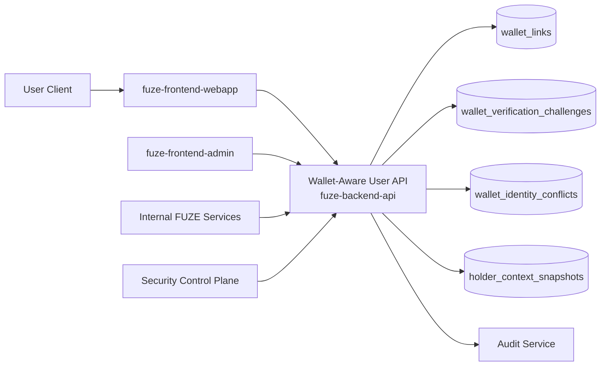
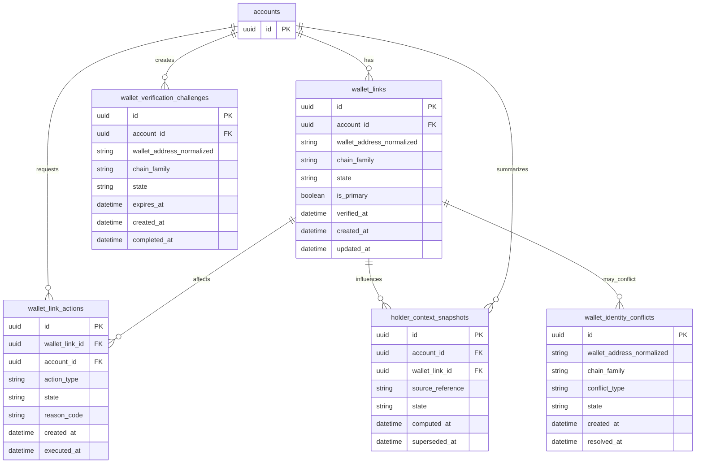
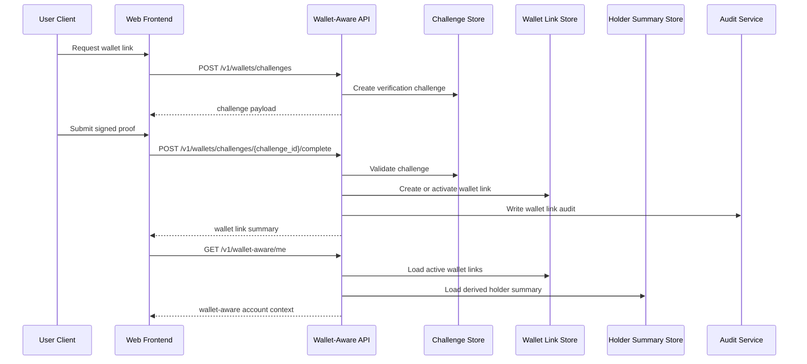

# WALLET_AWARE_USER_API_SPEC

## 1. Title

**WALLET_AWARE_USER_API_SPEC.md**

---

## 2. Document Metadata

- **Document Name:** WALLET_AWARE_USER_API_SPEC.md
- **API Classification:** public, internal, admin, derived-public, event-driven, chain-adjacent
- **Owning Domain:** Wallet-Aware User Domain
- **Primary Implementing Repo:** `fuze-backend-api`
- **Primary System of Record:** wallet-aware account linkage, verification, recognition, and holder-context stores in `fuze-backend-api`
- **Status:** Draft for canonical source-of-truth approval
- **Purpose:** Define the production-grade API contract architecture for wallet linking, wallet verification, wallet-aware recognition, holder-context resolution, and user-facing wallet-bound participation behavior across the FUZE ecosystem
- **Canonical Folder:** `fuze.ac > docs > api-spec`

---

## 3. Purpose

This document defines the canonical API specification for FUZE wallet-aware user operations. It translates the governing FUZE platform boundary, identity, auth, workspace, role/access, chain architecture, transparency, and API architecture rules into an implementation-ready API contract.

This API exists because FUZE is Web3-aware but not wallet-only. A user may authenticate through ordinary linked login methods such as email/password, Google, or Telegram, while separately linking one or more wallets that enrich participation context, holder recognition, selected privileges, and payout-related visibility where policy allows. Wallet awareness must therefore be integrated without confusing wallet identity with canonical account identity.

Accordingly, this specification defines how wallets are linked and verified, how wallet links are listed and removed, how holder-aware context is resolved for products and user-facing surfaces, how chain-aware references remain explicit, and how wallet-aware behavior stays consistent with the required separation between FUZE token, Platform Credits, stablecoin profit participation, treasury, governance, and account identity.

---

## 4. Scope

This specification covers:

- wallet link initiation and verification APIs
- wallet unlink and wallet-status APIs
- wallet-aware account context and holder-summary APIs
- scoped wallet-aware reads for first-party clients
- internal service APIs for wallet-context and holder-context resolution
- admin/control-plane APIs for correction, disablement, and conflict remediation
- event emission requirements for wallet-aware lifecycle changes
- request, response, error, idempotency, versioning, audit, and database-shape rules for this domain

This specification does **not** redefine:

- canonical account identity or authentication session behavior
- on-chain wallet ownership truth itself
- Ethereum token contract logic
- Base Platform Credits ledger logic
- stablecoin payout execution logic
- snapshot and eligibility pipeline rules in full detail
- public contract registry publication rules in full detail
- product-specific business logic beyond wallet-aware participation inputs

Those remain governed by their own source-of-truth specifications.

---

## 5. Source-of-Truth Inputs

### Primary FUZE docs and specs used

#### Highest-priority platform and ownership sources
- `SYSTEM_SPEC_INDEX.md`
- `SYSTEM_BOUNDARY_AND_OWNERSHIP_SPEC.md`
- `SYSTEM_OVERVIEW_AND_BOUNDARIES_SPEC.md`
- `PLATFORM_ARCHITECTURE_SPEC.md`
- `DOMAIN_OWNERSHIP_MATRIX_SPEC.md`
- `DATA_MODEL_AND_ENTITY_OWNERSHIP_SPEC.md`
- `ONCHAIN_OFFCHAIN_RESPONSIBILITY_SPEC.md`

#### Primary wallet / identity / chain sources
- `WALLET_AWARE_USER_SPEC.md`
- `IDENTITY_AND_ACCOUNT_SPEC.md`
- `AUTH_SESSION_AND_LINKED_LOGIN_SPEC.md`
- `WORKSPACE_AND_ORGANIZATION_SPEC.md`
- `ROLE_PERMISSION_AND_ACCESS_CONTROL_SPEC.md`
- `CHAIN_ARCHITECTURE_SPEC.md`
- `PUBLIC_CONTRACT_AND_WALLET_REGISTRY_SPEC.md`
- `SNAPSHOT_AND_ELIGIBILITY_PIPELINE_SPEC.md`
- `PROFIT_PARTICIPATION_SYSTEM_SPEC.md`

#### API and runtime sources
- `API_ARCHITECTURE_SPEC.md`
- `PUBLIC_API_SPEC.md`
- `INTERNAL_SERVICE_API_SPEC.md`
- `IDEMPOTENCY_AND_VERSIONING_SPEC.md`
- `EVENT_MODEL_AND_WEBHOOK_SPEC.md`
- `MIGRATION_AND_BACKWARD_COMPATIBILITY_SPEC.md`
- `AUDIT_LOG_AND_ACTIVITY_SPEC.md`

#### Security and operations sources
- `SECURITY_AND_RISK_CONTROL_SPEC.md`
- `SECRETS_CONFIG_AND_ENVIRONMENT_SPEC.md`
- `MONITORING_ALERTING_AND_INCIDENT_RESPONSE_SPEC.md`

#### Format guides
- `The_API_Specification_guide.md`
- `Database_Schemas_Guide.md`

### Highest-priority interpretation applied

For this file, the most important governing interpretation is:

1. the canonical FUZE account remains the owner of platform identity
2. wallet links are trust-bearing relationships attached to accounts, not replacements for account identity
3. wallet-aware behavior must remain explicit and bounded
4. wallet-aware user context may enrich product or payout-related views but must not collapse token, credits, payouts, or governance into one ambiguous concept
5. products consume canonical wallet-aware context from shared platform APIs instead of inventing product-local wallet truth
6. chain-aware reads and account-bound wallet relationships must remain distinct from on-chain system-of-record facts and from derived reporting models

### Supporting external standards used only as guidance

- HTTP semantics for read, mutation, conflict, and verification-flow behavior
- RFC 9457 problem-details style for machine-readable error responses
- common wallet-signature challenge and replay-protection patterns as general design guidance

External guidance does not override FUZE source-of-truth documents.

---

## 6. Governing Architecture and Ownership Interpretation

This API belongs to the **Wallet-Aware User Domain** because it owns the relationship between a canonical FUZE account and one or more linked wallets for recognition, holder-aware context, policy-aware product behavior, and selected payout-facing visibility.

This API is implemented primarily in `fuze-backend-api` because:

- backend owns durable wallet-link truth
- wallet-aware context must be consistent across products
- verification, conflict handling, disablement, and corrections are security-sensitive
- products and public-facing surfaces require shared wallet-aware reads
- admin interventions and audit generation must be backend-governed

This API is **not** owned by:

- `fuze-frontend-webapp`, because frontend only initiates and consumes wallet-aware flows
- `fuze-frontend-admin`, because admin may trigger privileged changes but must not own wallet-link truth
- `fuze-contracts`, because wallet linking between account and wallet is off-chain application truth even though it references on-chain addresses
- product domains such as QTB, AIMM, ZAGA, AIE, HerHelp, Botmad, or ToolGrid, because products consume canonical wallet-aware context rather than redefining it
- payout or snapshot domains, because those domains consume wallet-aware linkage and on-chain snapshots but do not own canonical account-to-wallet linkage truth

### Architectural implications

- a canonical account may link one or more wallets
- wallets must be verified through explicit proof before becoming active links
- wallet links are trust-bearing but not universal identity replacements
- wallet-aware context may affect selected product behavior and user-facing views, but not generic platform authorization by itself
- holder-aware summaries are derived from canonical account-wallet linkage plus approved on-chain reference data and policy treatment
- wallet-aware API surfaces must remain explicit about whether they expose durable link truth, derived holder context, snapshot-linked eligibility context, or public registry references

---

## 7. Domain Responsibilities

The wallet-aware user API domain is responsible for:

1. initiating and completing wallet link verification
2. maintaining active wallet-link relationships between accounts and wallets
3. exposing wallet-link listings and wallet-status views
4. resolving wallet-aware account context for first-party and internal consumers
5. exposing holder-aware summaries and selected eligibility-facing views where policy allows
6. supporting safe unlink, disablement, and correction flows
7. enabling internal services to query wallet-aware truth safely
8. emitting wallet-aware domain events
9. generating audit records for sensitive wallet-aware actions
10. preserving required separations between wallet linkage, on-chain truth, product privileges, payouts, and governance

The domain is not responsible for:

- authenticating the user into the platform
- owning on-chain token balances or chain-state truth
- executing payouts
- authoring eligibility datasets
- defining governance authority
- replacing credits, billing, or entitlement systems with wallet logic

---

## 8. Out of Scope

The following are out of scope for this API specification:

- smart-contract implementation details
- wallet custody or key management
- generic blockchain explorer functionality
- all future multi-chain expansion details
- full eligibility algorithm design
- payout-claim contract interaction details
- detailed public contract registry schema
- product-specific holder-benefit rules beyond wallet-aware inputs

Where later detailed specs are needed, they must remain compatible with this API.

---

## 9. Canonical Entities and Data Ownership

### Durable entities

#### 9.1 wallet_links
- **Owner:** Wallet-Aware User Domain
- **Purpose:** canonical off-chain linkage between a FUZE account and a wallet address
- **Nature:** source-of-truth durable entity

#### 9.2 wallet_verification_challenges
- **Owner:** Wallet-Aware User Domain
- **Purpose:** short-lived verification challenge records for wallet proof
- **Nature:** source-of-truth short-lived durable entity

#### 9.3 wallet_link_actions
- **Owner:** Wallet-Aware User Domain
- **Purpose:** link, unlink, disable, re-enable, and corrective action records
- **Nature:** durable action records with audit linkage

#### 9.4 wallet_identity_conflicts
- **Owner:** Wallet-Aware User Domain
- **Purpose:** controlled conflict cases where a wallet is already linked or contested
- **Nature:** durable investigation / remediation records

#### 9.5 holder_context_snapshots
- **Owner:** Wallet-Aware User Domain as a derived-consumption record, sourced from snapshot/eligibility systems
- **Purpose:** account-bound or wallet-bound derived summary used for product/user-facing context
- **Nature:** derived durable summary, not authoritative on-chain truth

#### 9.6 wallet_audit_events
- **Owner:** Audit / Activity domain, sourced by Wallet-Aware User Domain
- **Purpose:** immutable trail for wallet-aware changes
- **Nature:** durable audit records

### Derived or cached entities

#### 9.7 wallet_holder_summaries
- **Owner:** derived read-model layer
- **Purpose:** convenience holder-aware and rank-aware summaries for user and product surfaces
- **Nature:** derived

#### 9.8 account_wallet_views
- **Owner:** derived read-model layer
- **Purpose:** account-facing combined wallet list and status summary
- **Nature:** derived

#### 9.9 public_wallet_link_views
- **Owner:** derived/public read-model layer
- **Purpose:** public-safe references when explicitly exposed
- **Nature:** derived, not canonical account truth

#### 9.10 snapshot_eligibility_views
- **Owner:** derived read-model layer
- **Purpose:** user-facing eligibility or claim-status visibility tied to wallet-aware account context
- **Nature:** derived, not the authoritative eligibility pipeline

---

## 10. State Model and Lifecycle

### 10.1 wallet link lifecycle

Possible states:

- `pending_verification`
- `active`
- `disabled`
- `removed`
- `blocked_conflict`
- `blocked_risk_review`

### 10.2 verification challenge lifecycle

Possible states:

- `created`
- `ready`
- `completed`
- `failed`
- `expired`
- `cancelled`

### 10.3 wallet link action lifecycle

Possible states:

- `requested`
- `pending_review`
- `executed`
- `failed`
- `cancelled`
- `closed`

### 10.4 holder context summary lifecycle

Possible states:

- `pending_refresh`
- `current`
- `stale`
- `superseded`

Lifecycle notes:
- wallet links become `active` only after explicit proof verification
- `disabled` preserves history without asserting current active participation
- `removed` terminates the active relationship while preserving audit history
- `blocked_conflict` and `blocked_risk_review` prevent normal use until resolved
- derived holder summaries may become `stale` without mutating canonical wallet-link truth

---

## 11. API Surface Overview

The API surface is divided into four families:

### 11.1 Public / first-party user-facing APIs
Used by `fuze-frontend-webapp` and approved first-party clients for:
- listing linked wallets
- creating wallet verification challenges
- completing wallet link verification
- unlinking wallets
- reading wallet-aware account context
- reading holder-aware summary and selected eligibility-facing views
- selecting default/primary wallet for product-facing displays where policy allows

### 11.2 Internal service APIs
Used by trusted internal services for:
- resolving account-to-wallet linkage
- resolving holder-aware and wallet-aware context
- validating whether a wallet is active for an account
- querying derived snapshot-related wallet-aware summaries safely

### 11.3 Admin / control-plane APIs
Used by `fuze-frontend-admin` through backend-only privileged routes for:
- forced disablement or re-enable of wallet links
- wallet-link conflict remediation
- corrective unlink or reassignment workflows under controlled policy
- emergency containment of suspicious wallet-aware relationships

### 11.4 Event-driven interfaces
Used for downstream side effects:
- audit generation
- security alerting
- wallet-aware cache invalidation
- product refresh triggers
- notification handling
- analytics and reporting

---

## 12. Authentication and Authorization Model

### 12.1 Authentication posture by route family

#### Authenticated user routes
Require valid authenticated session:
- list linked wallets
- begin wallet verification challenge
- complete wallet link verification
- unlink active wallet
- read wallet-aware account context
- read holder-aware summaries for current account
- choose display-preferred wallet where supported

#### Internal service routes
Require internal service identity with explicit least privilege:
- account wallet-context resolution
- active wallet validation
- holder-context summary resolution
- eligibility-facing wallet-context reads

#### Admin routes
Require privileged operator identity plus reason-coded actions:
- disable / re-enable wallet link
- corrective unlink / remediation
- conflict resolution state transitions
- emergency containment of suspicious wallet links

### 12.2 Authorization checkpoints

Authorization must evaluate:
- canonical account identity
- session validity
- target account scope
- whether requested action is sensitive
- whether link/unlink would violate policy
- whether the wallet is already linked elsewhere
- whether account or wallet link is in restricted or review state
- whether admin/operator role is present for privileged flows

### 12.3 Sensitive action rules

The following require heightened checks:
- wallet link completion
- wallet unlink
- admin disable/reenable
- conflict remediation
- corrective reassignment or emergency containment

Sensitive flows may require:
- recent re-auth assertion
- proof freshness checks
- replay-resistance validation
- operator justification and case reference for admin routes

---

## 13. API Endpoints / Interface Contracts

## 13.1 Public / First-Party User APIs

### 13.1.1 `GET /v1/wallets`
**Purpose:** list linked wallets for current account  
**Caller Type:** authenticated user  
**Auth Expectation:** valid authenticated session  
**Response Summary:**
- linked wallet list
- chain family / network family classification
- state
- verification timestamps
- primary/display-preferred indicators where supported
- derived holder summary hints where safe
**Side Effects:** none
**Audit Requirements:** access logging only
**Emitted Events:** none required

### 13.1.2 `POST /v1/wallets/challenges`
**Purpose:** create wallet verification challenge for linking a wallet to current account  
**Caller Type:** authenticated user  
**Request Body Summary:**
- `wallet_address`
- `chain_family`
- optional `network_hint`
- optional `intent` (`link`, future `reverify`)
- optional `idempotency_key`
**Response Summary:**
- challenge ID
- challenge message / signing payload
- expiry metadata
- expected verification method metadata
**Side Effects:** creates verification challenge
**Idempotency Behavior:** same request fingerprint may return current active challenge until expiry
**Audit Requirements:** wallet challenge creation audit where policy requires
**Emitted Events:** `wallet.challenge_created`

### 13.1.3 `POST /v1/wallets/challenges/{challenge_id}/complete`
**Purpose:** complete wallet proof verification and create or activate wallet link  
**Caller Type:** authenticated user  
**Request Body Summary:**
- signed proof payload
- optional `wallet_client_metadata`
**Response Summary:**
- resulting wallet link summary
- state
- active relationship metadata
- conflict or review status if not fully successful
**Side Effects:**
- may activate wallet link
- may create conflict/review state
- may update verification lineage
**Idempotency Behavior:** required by challenge ID and proof replay protection
**Audit Requirements:** high-sensitivity audit
**Emitted Events:** `wallet.linked`, `wallet.link_conflict_detected`

### 13.1.4 `DELETE /v1/wallets/{wallet_link_id}`
**Purpose:** unlink one active wallet from current account  
**Caller Type:** authenticated user  
**Request Body Summary:**
- optional `reason_code`
- optional `idempotency_key`
**Response Summary:** removed wallet-link summary
**Side Effects:** active link transitions to removed
**Idempotency Behavior:** required
**Audit Requirements:** high-sensitivity audit
**Emitted Events:** `wallet.unlinked`

### 13.1.5 `POST /v1/wallets/{wallet_link_id}/primary`
**Purpose:** mark one linked wallet as the preferred display/interaction wallet for current account where policy allows  
**Caller Type:** authenticated user  
**Request Body Summary:**
- optional `idempotency_key`
**Response Summary:** updated account wallet preference summary
**Side Effects:** updates account-level preference metadata
**Audit Requirements:** standard audit if preference is security-sensitive in context
**Emitted Events:** `wallet.primary_changed`

### 13.1.6 `GET /v1/wallet-aware/me`
**Purpose:** retrieve wallet-aware account context for current account  
**Caller Type:** authenticated user  
**Response Summary:**
- linked wallet states
- preferred wallet
- derived holder summary
- product-safe wallet-aware flags
- selected eligibility-facing pointers where policy allows
**Side Effects:** none

### 13.1.7 `GET /v1/wallet-aware/holder-summary`
**Purpose:** retrieve holder-aware summary for current account  
**Caller Type:** authenticated user  
**Response Summary:**
- linked wallet references
- derived holder-rank / holder-context summary where policy allows
- freshness status of derived summary
- policy-bounded participation signals
**Side Effects:** none
**Important Boundary:** this is a derived summary and not raw on-chain authoritative token-balance truth

### 13.1.8 `GET /v1/wallet-aware/eligibility-summary`
**Purpose:** retrieve user-facing eligibility or claim-summary view derived from wallet-aware account context  
**Caller Type:** authenticated user  
**Response Summary:**
- relevant payout cycle references where policy allows
- claim-status summary
- snapshot-linked eligibility visibility summary
- freshness and derivation metadata
**Side Effects:** none
**Important Boundary:** this does not author authoritative eligibility data; it reads policy-bounded derived visibility only

## 13.2 Internal Service APIs

### 13.2.1 `GET /internal/v1/accounts/{account_id}/wallet-context`
**Purpose:** resolve wallet-aware account context for trusted services  
**Caller Type:** internal trusted services  
**Auth Expectation:** service-to-service identity only  
**Response Summary:**
- active wallets
- preferred wallet reference
- wallet states
- derived holder summary refs where relevant
**Side Effects:** none

### 13.2.2 `POST /internal/v1/wallets/validations`
**Purpose:** verify whether a wallet is actively linked to a specific account and fit for requested product context  
**Caller Type:** internal trusted services  
**Request Body Summary:**
- `account_id`
- `wallet_address`
- `chain_family`
- optional `required_state`
- optional `product_context`
**Response Summary:**
- valid / invalid
- matching wallet-link reference if any
- denial reason
**Side Effects:** none

### 13.2.3 `GET /internal/v1/accounts/{account_id}/holder-context`
**Purpose:** retrieve derived holder-aware context for trusted services  
**Caller Type:** internal trusted services with least privilege  
**Response Summary:**
- derived holder-rank / participation summary
- active wallet references used in derivation
- freshness metadata
- policy-bounded eligibility-facing references where allowed
**Side Effects:** none

## 13.3 Admin / Control-Plane APIs

### 13.3.1 `POST /admin/v1/wallets/{wallet_link_id}/disable`
**Purpose:** disable a wallet link without deleting historical linkage  
**Caller Type:** admin/operator  
**Request Body Summary:**
- `reason_code`
- `operator_note`
- optional `related_case_id`
**Response Summary:** disabled wallet-link summary
**Side Effects:** link transitions to disabled
**Audit Requirements:** critical audit
**Emitted Events:** `wallet.disabled`

### 13.3.2 `POST /admin/v1/wallets/{wallet_link_id}/reenable`
**Purpose:** re-enable a previously disabled wallet link where policy allows  
**Caller Type:** admin/operator  
**Request Body Summary:**
- `reason_code`
- `operator_note`
**Response Summary:** updated wallet-link summary
**Side Effects:** link transitions disabled -> active if allowed
**Audit Requirements:** critical audit
**Emitted Events:** `wallet.reenabled`

### 13.3.3 `POST /admin/v1/wallet-conflicts/{conflict_id}/resolve`
**Purpose:** resolve wallet-link conflict under controlled remediation policy  
**Caller Type:** admin/operator  
**Request Body Summary:**
- `resolution_code`
- `target_account_id` where applicable
- `reason_code`
- `operator_note`
**Response Summary:** conflict resolution action summary
**Side Effects:** may disable one link, close conflict, or complete corrective reassignment path
**Audit Requirements:** critical audit
**Emitted Events:** `wallet.conflict_resolved`

### 13.3.4 `POST /admin/v1/wallet-containment`
**Purpose:** emergency containment for suspicious wallet-aware relationships  
**Caller Type:** admin/operator  
**Request Body Summary:**
- wallet-link filters
- account filters
- `reason_code`
- `operator_note`
- optional `expires_at`
**Response Summary:** containment action summary
**Side Effects:** disables or suspends targeted wallet-aware links
**Audit Requirements:** critical audit
**Emitted Events:** `wallet.containment_executed`

---

## 14. Request Rules

### 14.1 General request rules
- all mutation-capable routes must require JSON requests with explicit content type
- all mutation routes must carry correlation IDs
- sensitive wallet-aware mutations must carry idempotency keys
- admin mutations must require reason codes and operator notes
- frontend-supplied wallet ownership assertions are never sufficient without backend verification

### 14.2 Sensitive-action request requirements
The following requests require heightened validation:
- wallet link completion
- wallet unlink
- admin disable / re-enable
- conflict resolution
- containment actions

Heightened validation may include:
- recent re-auth assertion
- challenge freshness checks
- signature replay checks
- account-state validation
- operator role confirmation
- conflict / review state checks

### 14.3 Wallet uniqueness rule
A wallet address in the same canonical chain family must not be actively linked to multiple accounts unless a controlled conflict/remediation workflow explicitly handles the case.

### 14.4 Scope integrity rule
User-facing wallet-aware routes may operate only on the current authenticated account unless a route is explicitly internal or admin.

---

## 15. Response Rules

### 15.1 Success response rules
Successful responses must include:
- stable resource identifiers
- timestamps for created/updated state
- state/status values
- chain family metadata
- correlation references for mutations

### 15.2 Async-accepted response rules
If conflict remediation or some verification path becomes async, the response must:
- return accepted status
- include action or review ID
- provide follow-up status semantics

### 15.3 Terminal mutation response rules
Terminal mutation responses must clearly show:
- target wallet-link identifier
- resulting state
- whether the wallet is active for the account
- whether holder-aware derived context may change downstream

### 15.4 Read response rules
Read responses must distinguish:
- durable wallet-link truth
- derived holder-aware summaries
- derived eligibility-facing summaries
- public or product-safe convenience fields that are not canonical chain-state truth

---

## 16. Error Model

The API uses structured problem-details style error responses with stable error codes.

### 16.1 Required error fields
- `type`
- `title`
- `status`
- `code`
- `detail`
- `instance`
- `correlation_id`

### 16.2 Common error codes

#### Authentication / credential errors
- `WALLET_SESSION_REQUIRED`
- `WALLET_REAUTH_REQUIRED`
- `WALLET_CHALLENGE_EXPIRED`
- `WALLET_CHALLENGE_INVALID`

#### Authorization / permission errors
- `WALLET_PERMISSION_DENIED`
- `WALLET_OPERATOR_PERMISSION_DENIED`

#### State conflict errors
- `WALLET_ALREADY_LINKED`
- `WALLET_LINK_ALREADY_TERMINAL`
- `WALLET_CONFLICT_DETECTED`
- `WALLET_STATE_INVALID`

#### Policy / safety errors
- `WALLET_ACCOUNT_RESTRICTED`
- `WALLET_RISK_REVIEW_REQUIRED`
- `WALLET_CHAIN_FAMILY_UNSUPPORTED`
- `WALLET_LINK_NOT_ELIGIBLE`

#### Request integrity errors
- `WALLET_IDEMPOTENCY_KEY_REQUIRED`
- `WALLET_REQUEST_INVALID`
- `WALLET_REQUEST_UNPROCESSABLE`
- `WALLET_PROOF_INVALID`

#### Dependency or provider errors
- `WALLET_VERIFICATION_UNAVAILABLE`
- `WALLET_DERIVED_CONTEXT_UNAVAILABLE`

### 16.3 Error handling rules
- do not expose internal security heuristics or operator-only details
- do not imply raw on-chain truth from off-chain link failure states
- distinguish invalid proof from conflict/review outcomes
- return actionable but bounded explanations
- include retry guidance only where safe

---

## 17. Idempotency and Mutation Safety

### 17.1 Required idempotent mutations
The following mutation routes require idempotent behavior:
- wallet verification challenge completion
- wallet unlink
- primary-wallet change
- admin disable / re-enable
- conflict resolution
- containment actions

### 17.2 Idempotency key rules
- mutation requests must supply `Idempotency-Key` where required
- backend stores key scope, request hash, actor, and terminal result
- replay of same semantic request returns original terminal outcome
- replay of same key with different semantic request must fail with conflict

### 17.3 Mutation safety rules
- wallet link state transitions must be monotonic toward terminal states
- challenge completion must be single-effective
- wallet uniqueness must be checked transactionally at commit time
- unlink must not silently delete historical audit lineage
- derived holder summaries must be refreshed from canonical wallet-link truth and approved upstream sources

---

## 18. Versioning and Compatibility Rules

### 18.1 Versioning
This API family is versioned under `/v1`, `/internal/v1`, and `/admin/v1` route families.

### 18.2 Compatibility approach
- additive evolution preferred
- no silent semantic change to wallet-link states or derived holder summary meaning
- additional supported chain families may be added without breaking existing contracts
- response fields may be added but existing meanings must remain stable

### 18.3 Breaking-change rules
Breaking changes include:
- changing the meaning of active wallet-link state
- changing derived holder summary semantics incompatibly
- removing key wallet-link or eligibility-summary fields
- changing chain-family interpretation incompatibly

Such changes require explicit migration planning and version evolution.

### 18.4 Deprecation
Deprecated routes or fields must:
- be documented explicitly
- carry deprecation metadata where supported
- preserve compatibility windows long enough for first-party consumers and future SDKs

---

## 19. Event Emission and Webhook Behavior

This domain is event-capable.

### 19.1 Internal events
The wallet-aware user domain must emit canonical internal events such as:
- `wallet.challenge_created`
- `wallet.linked`
- `wallet.unlinked`
- `wallet.disabled`
- `wallet.reenabled`
- `wallet.primary_changed`
- `wallet.link_conflict_detected`
- `wallet.conflict_resolved`
- `wallet.containment_executed`
- `wallet.holder_context_refreshed`

### 19.2 Event payload minimums
Each event should contain:
- event ID
- event type
- occurred_at
- account ID
- wallet-link reference
- wallet address reference or hashed reference as policy requires
- chain family
- actor type
- correlation ID
- reason code where applicable

### 19.3 External webhook posture
This specification does not expose general third-party webhooks for raw wallet-link mutations by default. Any future external wallet-aware webhook surface must be narrow, privacy-safe, security-reviewed, and governed by a separate contract.

---

## 20. Audit and Activity Requirements

The following actions must generate durable audit events:

- wallet challenge creation where policy requires
- wallet link completion
- wallet unlink
- primary wallet change where policy requires
- admin disable / re-enable
- conflict remediation
- containment actions
- significant holder-context refresh or correction where policy requires

### Required audit fields
- audit event ID
- actor type and actor reference
- account ID
- wallet-link reference
- chain family
- target wallet reference or policy-safe representation
- action type
- before/after state summary where applicable
- reason code
- correlation ID
- operator note if operator action
- occurred_at

User-facing activity feeds may show only a filtered subset, but audit truth must remain durable and immutable.

---

## 21. Data Model and Database Schema View

### 21.1 `wallet_links`
- `id` PK
- `account_id` FK -> `accounts.id`
- `wallet_address_normalized`
- `chain_family`
- `network_hint` nullable
- `state`
- `is_primary`
- `verified_at` nullable
- `created_at`
- `updated_at`
- `disabled_at` nullable
- `removed_at` nullable
- `created_by_actor_type`
- `created_by_actor_id` nullable

**Constraints:**
- unique (`wallet_address_normalized`, `chain_family`) for active/non-removed link space
- at most one primary active wallet per account per policy
- index on `account_id`
- index on (`account_id`, `state`)
- index on (`wallet_address_normalized`, `chain_family`)

### 21.2 `wallet_verification_challenges`
- `id` PK
- `account_id` FK -> `accounts.id`
- `wallet_address_normalized`
- `chain_family`
- `network_hint` nullable
- `challenge_message_hash`
- `nonce_hash`
- `state`
- `expires_at`
- `created_at`
- `completed_at` nullable
- `failure_code` nullable
- `correlation_id`

**Constraints:**
- index on `account_id`
- index on `state`
- index on `expires_at`

### 21.3 `wallet_link_actions`
- `id` PK
- `wallet_link_id` FK -> `wallet_links.id` nullable
- `account_id` FK -> `accounts.id`
- `action_type`
- `state`
- `reason_code`
- `operator_note` nullable
- `requested_by_actor_type`
- `requested_by_actor_id`
- `created_at`
- `executed_at` nullable
- `closed_at` nullable
- `correlation_id`

### 21.4 `wallet_identity_conflicts`
- `id` PK
- `wallet_address_normalized`
- `chain_family`
- `conflict_type`
- `state`
- `primary_account_id` nullable
- `secondary_account_id` nullable
- `created_at`
- `resolved_at` nullable
- `resolution_code` nullable

### 21.5 `holder_context_snapshots`
- `id` PK
- `account_id` FK -> `accounts.id`
- `wallet_link_id` FK -> `wallet_links.id` nullable
- `source_reference`
- `summary_json`
- `state`
- `computed_at`
- `superseded_at` nullable

### 21.6 `idempotency_records`
- `id` PK
- `idempotency_key`
- `scope_family`
- `actor_reference`
- `request_hash`
- `response_hash`
- `terminal_status`
- `created_at`
- `expires_at`

### 21.7 `audit_log_entries`
Domain-sourced audit records written into the audit domain.

### Normalization notes
- canonical account-wallet relationship stays in `wallet_links`
- verification proof lifecycle stays in `wallet_verification_challenges`
- conflict/remediation actions stay in dedicated action and conflict tables
- derived holder summaries stay separate from canonical wallet-link truth
- snapshot-derived summaries are not the authoritative eligibility pipeline

### Reconciliation notes
- primary-wallet preference must reconcile with one active link only
- link uniqueness must be rechecked at commit time
- holder summary refreshes must preserve source references and freshness state
- unlink or disable actions must not erase historical derivation lineage unexpectedly

---

## 22. Architecture Diagram — Mermaid flowchart



---

## 23. Data Design — Mermaid Diagram



---

## 24. Flow View

### 24.1 Happy path — link wallet
1. authenticated user requests wallet verification challenge
2. backend creates challenge bound to account, wallet, chain family, and expiry
3. user signs challenge and submits proof
4. backend verifies proof and uniqueness constraints
5. wallet link becomes active
6. audit event is written
7. wallet-linked event is emitted
8. downstream holder-context refresh may be triggered asynchronously

### 24.2 Happy path — read wallet-aware account context
1. authenticated user requests wallet-aware summary
2. backend loads active wallet links
3. backend loads current derived holder summary if available
4. response distinguishes durable wallet-link truth from derived holder context
5. client receives wallet-aware account view

### 24.3 Happy path — unlink wallet
1. authenticated user requests unlink of one active wallet
2. backend validates account ownership and policy state
3. wallet link transitions to removed
4. audit and event are emitted
5. downstream holder-context refresh may be triggered

### 24.4 Alternate path — wallet already linked elsewhere
1. challenge completion succeeds cryptographically
2. backend detects wallet already actively linked to another account
3. automatic activation is blocked
4. conflict record is created or updated
5. response returns conflict/review state
6. admin-controlled remediation may be required

### 24.5 Failure path — invalid or replayed proof
1. user submits proof for expired or mismatched challenge
2. backend rejects proof
3. no wallet-link activation occurs
4. failure is returned with bounded error
5. audit may record failed verification attempt where policy requires

### 24.6 Failure and containment path — suspicious wallet-aware relationship
1. security workflow flags suspicious wallet/account relationship
2. admin containment route is called
3. backend disables targeted wallet link(s)
4. critical audit and containment event are emitted
5. product and derived caches consume updated wallet-aware truth

### 24.7 Retry behavior
- challenge completion retries return same terminal outcome
- unlink retries return same terminal removed result
- disable/reenable retries return terminal state
- conflict resolution retries return same final action result

---

## 25. Data Flows — Mermaid sequenceDiagram



---

## 26. Security and Risk Controls

1. **Wallet linking is not identity replacement**  
   Account identity remains canonical even when wallet links are active.

2. **Explicit proof verification**  
   Wallet link activation requires challenge-bound proof verification.

3. **Replay resistance**  
   Challenge issuance and completion must prevent stale or replayed proofs from causing duplicate effect.

4. **Uniqueness enforcement**  
   Active wallet/address + chain-family collisions must be handled through explicit conflict flows, not silent overwrite.

5. **Least privilege**  
   Internal and admin wallet-aware routes must be narrowly authorized.

6. **No product-owned wallet truth**  
   Products may consume wallet-aware context but must not own canonical account-wallet linkage.

7. **Derived context separation**  
   Holder-aware and eligibility-facing summaries must remain explicitly derived, not confused with canonical chain-state truth.

8. **Containment support**  
   The domain must support fast disablement or containment of suspicious wallet-aware relationships.

9. **Problem-details discipline**  
   Error bodies must be structured and safe, without exposing hidden security heuristics.

10. **Audit immutability**  
    Sensitive wallet-aware mutations require durable immutable audit lineage.

---

## 27. Operational Considerations

- wallet challenge creation and completion are latency-sensitive user-facing flows and should be highly available
- challenge expiry sweeps must run regularly
- holder-summary refresh may be asynchronous and must tolerate upstream derivation lag without mutating canonical link truth
- active wallet-link uniqueness checks must be efficient and transaction-safe
- wallet-aware derived caches should invalidate quickly on link state changes
- monitoring should alert on:
  - spikes in failed wallet verification attempts
  - unusual wallet-link conflicts
  - unusual admin disablement or containment actions
  - repeated proof replay patterns
  - holder-context refresh lag beyond policy thresholds

---

## 28. Acceptance Criteria

1. The API preserves the distinction between canonical account identity and wallet-aware linkage.
2. Only `fuze-backend-api` owns canonical wallet-link truth.
3. Wallet link activation requires explicit proof verification.
4. A wallet in the same chain family cannot be actively linked to multiple accounts without controlled remediation.
5. User-facing routes can list and manage only the current authenticated account’s wallet links.
6. Unlink is idempotent and auditable.
7. Holder-aware and eligibility-facing summaries are explicitly derived and not presented as raw on-chain source truth.
8. Internal service routes are least-privilege and backend-only.
9. Admin routes require reason-coded privileged authorization.
10. Event emissions exist for major wallet-aware mutations.
11. Response and error semantics are stable and machine-readable.
12. Database schema separates canonical wallet-link truth from derived holder summaries.
13. Products can consume canonical wallet-aware context without redefining wallet truth.
14. Containment is supported and safely replayable.
15. Mermaid diagrams remain consistent with prose and data model.

---

## 29. Test Cases

### 29.1 Positive cases
1. Authenticated user creates wallet verification challenge successfully.
2. Valid signed proof activates wallet link successfully.
3. Authenticated user lists linked wallets successfully.
4. Authenticated user reads wallet-aware account context successfully.
5. Authenticated user unlinks an active wallet successfully.
6. Authenticated user changes primary wallet successfully.
7. Admin disables a suspicious wallet link successfully.

### 29.2 Negative cases
8. Unauthenticated call to wallet-link route is rejected.
9. Expired challenge completion returns `WALLET_CHALLENGE_EXPIRED`.
10. Invalid proof returns `WALLET_PROOF_INVALID`.
11. Attempt to link wallet already actively linked elsewhere returns conflict/review outcome.
12. Attempt to unlink another account’s wallet link is denied.
13. Unsupported chain family returns `WALLET_CHAIN_FAMILY_UNSUPPORTED`.

### 29.3 Authorization cases
14. Normal user cannot call admin disable route.
15. Internal service without required privilege cannot resolve holder-context route.
16. User cannot read another account’s wallet-aware summary via user routes.
17. Product service cannot post product-local derived wallet truth as canonical input.

### 29.4 Idempotency and replay cases
18. Replaying challenge completion for the same challenge returns the same terminal outcome.
19. Replaying unlink with same idempotency key returns original removed result.
20. Replaying containment action with same idempotency key returns same terminal action summary.

### 29.5 Concurrency cases
21. Two concurrent link completions for same wallet/address + chain-family produce one activation and one conflict or terminal duplicate outcome.
22. Concurrent unlink and disable actions produce consistent terminal wallet-link state.
23. Concurrent primary-wallet changes preserve exactly one active primary wallet under policy.

### 29.6 Recovery / admin cases
24. Admin re-enable restores a disabled wallet link where policy allows.
25. Conflict resolution closes wallet conflict under controlled remediation path.
26. Containment action disables suspicious wallet-aware links immediately or through fast propagation path.

### 29.7 Event and audit cases
27. Successful wallet link emits `wallet.linked`.
28. Unlink emits `wallet.unlinked`.
29. Containment emits `wallet.containment_executed` and critical audit lineage.

---

## 30. Open Questions or Explicit Deferred Decisions

1. Exact supported chain-family matrix at first production release is deferred.
2. Exact multi-wallet preference behavior for all products is deferred.
3. Exact derived holder-rank presentation model is deferred.
4. Exact user-facing eligibility-summary detail level is deferred.
5. Exact conflict remediation workflow for disputed wallet ownership is deferred.
6. Exact public-read exposure rules for wallet-aware references are deferred.

---

## 31. Implementation Notes for `fuze-backend-api`

Recommended backend module layout:

```text
modules/platform/
  wallet-aware/
  identity/
  auth-session/
  audit-log/
  integrations/
```

Implementation guidance:
- keep canonical wallet-link truth separate from derived holder and eligibility summaries
- centralize challenge generation and proof verification in one domain service
- perform uniqueness checks inside the commit boundary
- treat conflict remediation and containment as domain actions, not ad hoc row patches
- emit events only after canonical state commit succeeds
- publish derived holder-aware views from canonical wallet-link truth and approved upstream summary sources; do not let derived views mutate wallet-link truth

---

## 32. Frontend Consumption Notes

### For `fuze-frontend-webapp`
- may initiate and complete wallet-link flows
- may list linked wallets and read wallet-aware account context
- must not infer canonical wallet-link truth from client-side wallet state alone
- must treat backend wallet-aware decisions as authoritative
- should clearly distinguish durable link state from derived holder or eligibility summaries

### For `fuze-frontend-admin`
- may trigger privileged disable / re-enable / conflict-remediation / containment actions only through backend admin APIs
- must require operator reason input for sensitive mutations
- must not directly mutate wallet-link truth client-side
- should present immutable audit-linked summaries after privileged actions

---

## 33. Contract Derivation Notes

### OpenAPI / AsyncAPI
This spec should later derive into:
- wallet-link operations
- verification challenge operations
- wallet-aware account summary operations
- holder-summary and eligibility-summary operations
- internal wallet-context operations
- admin remediation and containment operations
- shared problem-details schema
- wallet-aware events in AsyncAPI

### Future `fuze-sdk`
Future `fuze-sdk` packages may derive:
- shared wallet-link helpers
- wallet-aware summary helpers
- typed chain-family and wallet-link models
- problem-error models for wallet-aware outcomes

The SDK must derive from approved API contracts and must not become the source of truth over this narrative specification.
