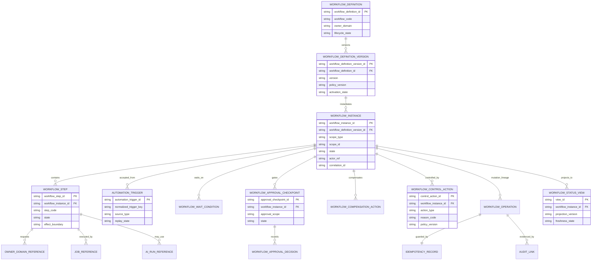
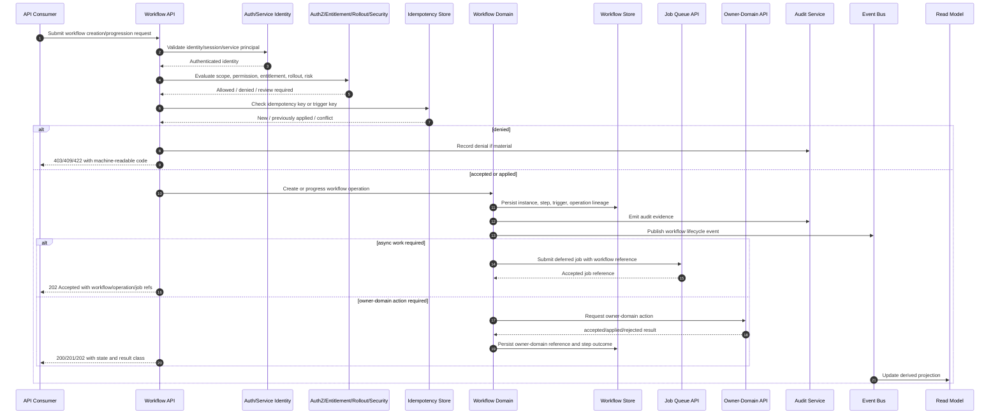

# FUZE Workflow and Automation API Specification

## Document Metadata

- **Document Name:** `WORKFLOW_AND_AUTOMATION_API_SPEC.md`
- **Document Type:** API SPEC v2 / Production-grade interface-contract specification
- **Status:** Draft production-grade API specification pending formal approval workflow
- **Version:** 2.0.0
- **Effective Date:** 2026-04-24
- **Last Updated:** 2026-04-24
- **Reviewed On:** 2026-04-24
- **Document Owner:** FUZE Workflow and Automation Domain; named individual owner not explicitly specified in retrieved governing materials
- **Approval Authority:** FUZE Platform Architecture and Specification Governance / active FUZE approval workflow; named approver not explicitly specified in retrieved governing materials
- **Review Cadence:** Review whenever workflow lifecycle semantics, automation trigger posture, approval governance, compensation posture, cross-domain progression rules, job/worker coupling, AI coupling, event contracts, authorization/entitlement posture, or control-plane intervention rules materially change; otherwise at least quarterly
- **Governing Layer:** API contract layer derived from the shared platform execution / workflow and automation refined system layer
- **Parent Registry:** API SPEC v2 Canonical File Registry
- **Upstream Semantic Registry:** `REFINED_SYSTEM_SPEC_INDEX.md`
- **Upstream API Registry:** `API_SPEC_INDEX.md`
- **Primary Audience:** Platform architecture, backend engineering, workflow/runtime engineering, product engineering, AI engineering, API authors, event-contract authors, security, audit, operations, support/control-plane operators, implementation-contract authors, OpenAPI/AsyncAPI/SDK authors
- **Primary Purpose:** Define the production-grade API contract posture for FUZE workflow definitions, workflow instances, automation triggers, step progression, waits, approvals, retries, compensations, control-plane interventions, workflow read models, and workflow lifecycle events without redefining refined workflow semantics or adjacent domain truth
- **Primary Upstream References:** `REFINED_SYSTEM_SPEC_INDEX.md`, `WORKFLOW_AND_AUTOMATION_SPEC.md`, `API_SPEC_INDEX.md`, `WORKFLOW_AUTOMATION_API_SPEC.md`, `API_ARCHITECTURE_SPEC.md`, `PUBLIC_API_SPEC.md`, `INTERNAL_SERVICE_API_SPEC.md`, `EVENT_MODEL_AND_WEBHOOK_SPEC.md`, `IDEMPOTENCY_AND_VERSIONING_SPEC.md`, `MIGRATION_AND_BACKWARD_COMPATIBILITY_SPEC.md`, `JOB_QUEUE_AND_WORKER_SPEC.md`, `AI_ORCHESTRATION_SPEC.md`, `MODEL_ROUTING_AND_CONTEXT_SPEC.md`, `AI_USAGE_METERING_SPEC.md`, `FEATURE_FLAG_AND_ROLLOUT_CONTROL_SPEC.md`, `ROLE_PERMISSION_AND_ACCESS_CONTROL_SPEC.md`, `SCOPED_AUTHORIZATION_MODEL_SPEC.md`, `ACCESS_EVALUATION_AND_EFFECTIVE_PERMISSION_SPEC.md`, `ENTITLEMENT_AND_CAPABILITY_GATING_SPEC.md`, `AUDIT_LOG_AND_ACTIVITY_SPEC.md`, `AUDIT_AND_ACCESS_TRACEABILITY_SPEC.md`, `SECURITY_AND_RISK_CONTROL_SPEC.md`, `MONITORING_ALERTING_AND_INCIDENT_RESPONSE_SPEC.md`, `SECRETS_CONFIG_AND_ENVIRONMENT_SPEC.md`, `FUZE_ACCOUNT_ACCESS_AND_SESSION_THESIS_FINAL_SPEC.md`, `FUZE_ACCOUNT_ACCESS_AND_SESSION_CANONICAL_FINAL_SPEC.md`, `FUZE_WORKSPACE_ACCESS_CONTROL_BASICS_THESIS_FINAL_SPEC.md`
- **Primary Downstream Dependents:** Workflow OpenAPI contracts, internal workflow service contracts, workflow event catalog, workflow worker implementation contracts, approval UI contracts, admin/control-plane workflow tooling, product workflow integration contracts, workflow read-model/projection contracts, workflow observability dashboards, workflow migration plans
- **API Surface Families Covered:** First-party application APIs, internal service APIs, admin/control-plane APIs, event/async APIs, scheduled/automation-trigger APIs, derived read/reporting APIs, limited public API considerations where explicitly approved
- **API Surface Families Excluded:** Raw queue broker APIs, worker lease APIs except as downstream integration dependencies, provider webhook payload schemas except normalized trigger intake, raw database APIs, product-local UI state APIs, public partner APIs unless separately approved, chain-native APIs
- **Canonical System Owner(s):** FUZE Workflow and Automation Domain for workflow semantic truth; adjacent owner domains retain their own business truth
- **Canonical API Owner:** FUZE Workflow and Automation API Governance / Platform API Architecture
- **Supersedes:** Historical `WORKFLOW_AUTOMATION_API_SPEC.md` as the v1 API source for workflow and automation API posture
- **Superseded By:** None currently defined
- **Related Decision Records:** Not explicitly specified in retrieved governing materials
- **Canonical Status Note:** This document is the canonical API SPEC v2 contract for workflow and automation APIs. It derives from `WORKFLOW_AND_AUTOMATION_SPEC.md`; it does not redefine workflow semantics, queue semantics, AI run semantics, authorization truth, entitlement truth, business-domain truth, or reporting truth.
- **Implementation Status:** Normative API design source; downstream route contracts, services, events, workers, read models, admin tooling, tests, and SDK/OpenAPI/AsyncAPI artifacts MUST align before production use
- **Approval Status:** Draft pending formal FUZE approval workflow
- **Change Summary:** Upgrades the historical `WORKFLOW_AUTOMATION_API_SPEC.md` into the API SPEC v2 filename and structure; adds explicit semantic/API/policy/runtime truth separation, surface-family boundaries, route-family posture, accepted-state behavior, idempotency/replay rules, admin-control constraints, read-model boundaries, event/async rules, diagrams, acceptance criteria, and contract tests.

## Title

FUZE Workflow and Automation API Specification

## Purpose

This API specification defines the FUZE interface-contract layer for workflow and automation.

It governs how API consumers create, inspect, progress, approve, pause, resume, cancel, retry, compensate, remediate, and observe FUZE workflow instances and automation-trigger behavior. It translates the refined Workflow and Automation system semantics into production-grade API contract rules for first-party clients, internal services, admin/control-plane tooling, event consumers, async workers, read-model projections, OpenAPI/AsyncAPI generation, implementation contracts, and QA validation.

This document is not a generic workflow-engine note. It is the FUZE API contract boundary that ensures workflow APIs coordinate multi-step execution without becoming hidden owners of product, billing, credits, AI, authorization, entitlement, queue, provider, chain, audit, or reporting truth.

## Scope

This specification governs API contracts for:

- workflow capability and definition discovery
- workflow-definition version selection and read exposure
- workflow instance creation, status retrieval, and lifecycle transitions
- automation-trigger registration, intake, normalization, replay, and deactivation posture
- workflow-step progression and step result recording
- wait states, approval gates, approval decisions, and approval timeouts
- cancellation, pause, resume, retry, skip, compensation, remediation, restriction, and terminal outcome APIs
- workflow correlation with jobs, AI runs, model-routing/context decisions, usage metering, entitlement checks, notifications, product-domain actions, audit events, and monitoring signals
- event and async interfaces for workflow lifecycle propagation
- read-model, projection, reporting, and progress-view APIs derived from canonical workflow records
- API contract rules for idempotency, replay, duplicate triggers, conflict resolution, authorization, audit, observability, versioning, and migration.

## Out of Scope

This specification does not govern:

- low-level queue partitioning, lease, heartbeat, dead-letter, worker-concurrency, or broker-vendor mechanics
- complete AI orchestration, model-routing/context, or AI metering lifecycle semantics
- product-specific business-state mutation semantics
- billing, credits, payment, refund, payout, treasury, governance, or entitlement truth
- raw provider webhook payload schemas before normalization into workflow triggers
- full UX behavior for workflow builders, approval screens, operator consoles, or progress widgets
- raw database schema detail beyond API-facing resource and lineage requirements
- full event catalog payload schemas, which belong in event/AsyncAPI contract layers
- externally exposed partner workflow APIs unless a separate public API spec explicitly approves them.

## Design Goals

1. Preserve refined workflow semantics while making them implementable as APIs.
2. Keep workflow APIs as coordination contracts, not owner-domain mutation shortcuts.
3. Support synchronous creation, accepted async progression, long-running waits, approvals, retries, compensation, and terminal state reporting without conflating accepted intent with final business outcome.
4. Preserve explicit public, first-party, internal, admin/control, event, webhook, scheduled, and reporting surface distinctions.
5. Make idempotency, trigger replay, duplicate approval decisions, retry safety, conflict handling, and version migration deterministic.
6. Ensure workflow execution remains attributable, auditable, observable, and remediable.
7. Enable OpenAPI, AsyncAPI, SDK, worker implementation contracts, and QA tests to derive safely without inventing contradictory semantics.

## Non-Goals

- This API spec does not turn workflow state into product, commercial, AI, queue, authorization, entitlement, or reporting truth.
- It does not allow workflows to commit other domains' business truth through undocumented internal writes.
- It does not allow frontend, admin, worker, scheduler, or provider convenience to bypass owner-domain validation.
- It does not provide a universal scripting runtime or unbounded autonomous execution model.
- It does not expose all workflow capabilities publicly by default.
- It does not replace implementation-contract specs, event catalogs, runbooks, or database schemas.

## Core Principles

### 1. Refined-Semantics Preservation

Workflow API contracts MUST preserve the semantics of `WORKFLOW_AND_AUTOMATION_SPEC.md`. API convenience MUST NOT redefine workflow definitions, workflow instance meaning, trigger semantics, step lifecycle, wait states, approvals, retries, compensations, restrictions, or terminal outcomes.

### 2. Coordination, Not Business Ownership

Workflow APIs coordinate execution across domains. They MUST NOT become owners of the business truth they sequence. A workflow step that calls billing, credits, AI, notification, or product state APIs remains a workflow-coordination action until the owning domain accepts or applies its own truth.

### 3. Owner-Domain Mutation Termination

Any durable business mutation initiated by a workflow MUST terminate in the relevant owner-domain API or internal contract. Workflow APIs may hold references to requested, accepted, applied, failed, compensated, or rejected downstream actions, but they do not replace owner-domain contracts.

### 4. Explicit Progression and Accepted-State Honesty

Workflow API responses MUST distinguish request acceptance, workflow creation, step execution, accepted async work, waiting, approval, compensation, completion, failure, and final owner-domain outcomes. `accepted` is not `applied`; `workflow_completed` is not automatically `business_effect_committed`.

### 5. Trigger Normalization Before Influence

Event-driven, schedule-driven, provider-driven, connector-driven, or external callbacks MUST become normalized automation-trigger records before they can instantiate or advance workflow state.

### 6. Human-Gate Integrity

Approval and review APIs MUST preserve attributable approver identity, scope, decision, rationale or reason code, policy version, timing, timeout posture, and idempotency lineage. Hidden database edits or operator side effects MUST NOT simulate approvals.

### 7. Replay-Safe Automation

Duplicate triggers, repeated submissions, worker restarts, network retries, and admin replays MUST produce deterministic idempotency outcomes and MUST NOT duplicate material side effects.

### 8. Control-Plane Isolation

Pause, resume, retry, skip, force-cancel, restriction, remediation, discrepancy resolution, and unsafe continuation controls MUST be exposed through explicit admin/control-plane or internal control-restricted APIs with stronger policy and audit posture.

### 9. Derived-Read Non-Authority

Workflow status views, approval queues, backlog views, product progress overlays, analytics, dashboards, and exports are downstream projections. They MUST NOT become canonical workflow mutation authorities.

### 10. Audit and Observability by Contract

Meaningful workflow operations MUST carry correlation identifiers, trace identifiers, idempotency references where required, policy references where applicable, actor/service identity, scope, and audit event linkage sufficient for reconstruction.

## Canonical Definitions

- **Workflow Definition:** Versioned canonical description of a workflow class, including step graph, trigger classes, state transitions, gates, retry posture, timeout posture, compensation posture, and effect boundaries.
- **Workflow Definition Version:** Immutable or supersession-safe version of a workflow definition used by workflow instances.
- **Workflow Instance:** Canonical API-facing resource representing one execution of a workflow definition in a specific actor, scope, product/service origin, and trigger context.
- **Workflow Step:** Bounded API-facing stage within a workflow instance with explicit state, result, retry posture, and owner-domain references.
- **Automation Trigger:** Normalized record of a user action, service action, schedule occurrence, event, provider signal, connector input, or operator action that requests workflow creation or progression.
- **Wait Condition:** Explicit state requiring external dependency, provider input, schedule time, owner-domain confirmation, or human decision before progression.
- **Approval Checkpoint:** Human-gated decision point requiring authorized approval, rejection, acknowledgement, escalation, or timeout.
- **Compensation Action:** Explicit corrective workflow progression intended to contain, release, reverse, supersede, or remediate partial effects without erasing lineage.
- **Workflow Control Action:** Privileged or policy-restricted action such as pause, resume, retry, skip, cancel, quarantine, restrict, remediate, or force-close.
- **Workflow Read Model:** Derived projection of workflow state for progress views, approval queues, backlogs, analytics, or admin dashboards.

## Truth Class Taxonomy

Workflow APIs MUST preserve these truth classes:

1. **Semantic truth:** Refined workflow meaning owned by `WORKFLOW_AND_AUTOMATION_SPEC.md`.
2. **API contract truth:** Surface families, route families, request/response/error/status/idempotency semantics governed by this document.
3. **Policy truth:** Trigger eligibility, workflow-definition activation, approval requirements, retry limits, timeout classes, compensation rules, rollout posture, entitlement gates, and control-plane restrictions.
4. **Runtime truth:** Current API processing, workflow execution posture, pending async work, in-flight step execution, and transient dependency health.
5. **Ledger / storage truth:** Durable workflow definitions, instances, steps, triggers, waits, approvals, compensations, control actions, idempotency records, operation records, and audit references.
6. **Execution truth:** Queue/job/worker execution state and attempt lineage owned by job/worker semantics, referenced by workflow APIs.
7. **Provider-input truth:** External callbacks, connector inputs, schedule signals, or partner/provider observations before normalization and owner-domain validation.
8. **Event / async truth:** Domain events, workflow lifecycle events, webhook deliveries, async operation records, and downstream event consumption status.
9. **Projection / reporting truth:** Derived progress views, approval queues, dashboards, backlog summaries, analytics, exports, and support views.
10. **Presentation truth:** Labels, UI copy, progress bars, user-facing status messages, and admin-console wording.

No downstream implementation may collapse these truth classes into one state field, table, route, cache, UI label, or event stream.

## Architectural Position in the Spec Hierarchy

This API spec sits below:

- `REFINED_SYSTEM_SPEC_INDEX.md`
- `WORKFLOW_AND_AUTOMATION_SPEC.md`
- `API_SPEC_INDEX.md`
- `API_ARCHITECTURE_SPEC.md`
- `PUBLIC_API_SPEC.md`
- `INTERNAL_SERVICE_API_SPEC.md`
- `EVENT_MODEL_AND_WEBHOOK_SPEC.md`
- `IDEMPOTENCY_AND_VERSIONING_SPEC.md`
- `MIGRATION_AND_BACKWARD_COMPATIBILITY_SPEC.md`

It sits alongside and must coordinate with:

- `AI_ORCHESTRATION_API_SPEC.md`
- `MODEL_ROUTING_AND_CONTEXT_API_SPEC.md`
- `AI_USAGE_METERING_API_SPEC.md`
- `JOB_QUEUE_AND_WORKER_API_SPEC.md`
- `FEATURE_FLAG_AND_ROLLOUT_CONTROL_API_SPEC.md`
- authorization, entitlement, audit, security, monitoring, notification, connector, and product-domain API specs.

This document governs interface-contract expression of workflow semantics. It does not replace refined semantic owners or downstream implementation contracts.

## Upstream Semantic Owners

- **Workflow and Automation Domain:** Workflow definitions, workflow instances, steps, triggers, waits, approvals, retries, compensations, workflow-control actions, and workflow-state meaning.
- **Job Queue and Worker Domain:** Job acceptance, queue placement, worker claim, lease, attempt, retry substrate, dead-letter, and worker execution truth.
- **AI Orchestration Domain:** AI run lifecycle, tool-use lineage, bounded AI output, and AI execution truth.
- **Model Routing and Context Domain:** Routing decisions, provider-lane normalization, context-pack governance, and context release truth.
- **AI Usage Metering Domain:** Usage-accounting truth for AI consumption and metering corrections.
- **Authorization / Access Domains:** Account, session, role, permission, scope, and effective-permission truth.
- **Entitlement and Capability Gating Domain:** Capability eligibility, plan/package constraints, and gated-feature truth.
- **Audit / Access Trace Domains:** Immutable audit evidence and access trace truth.
- **Security and Risk Control Domain:** Protective posture, restriction, review, challenge, containment, and security override truth.
- **Business/Product Domains:** Final business truth of product-local state, billing, credits, payment, notification, documents, and other owner-domain consequences.

## API Surface Families

### Public API

Workflow public API exposure defaults to none except explicitly approved external partner or public-safe status surfaces. Public APIs MUST be narrower than first-party APIs and MUST NOT expose sensitive workflow graphs, internal step details, control actions, or privileged approval data.

### First-Party Application API

First-party APIs MAY expose visible workflow capabilities, initiation, user-scoped status, approval actions, and allowed cancellation for authenticated FUZE users and workspace members. They MUST enforce account/session, scope, permission, entitlement, rollout, and security posture.

### Internal Service API

Internal workflow APIs MAY create workflows on behalf of product/domain services, record normalized triggers, advance steps, record owner-domain outcomes, open/resolve approval checkpoints, connect workflow instances to jobs and AI runs, and publish events. They MUST require explicit service identity and least-privilege service grants.

### Admin / Control-Plane API

Admin/control APIs MAY pause, resume, retry, skip, cancel, restrict, quarantine, remediate, replay triggers, resolve discrepancies, force terminal outcomes, or supersede workflow definitions under policy. They MUST require privileged identity, reason codes, case/reference linkage where applicable, policy versions, idempotency, and critical audit.

### Event / Webhook / Async API

Workflow events MAY publish lifecycle changes to internal event streams and, where separately approved, webhooks. Event consumers MUST treat workflow events as workflow truth, not business-domain truth, unless the owning domain also emits its own accepted/applied event.

### Reporting / Derived Read API

Derived read APIs MAY expose workflow progress, approval queues, backlog summaries, discrepancy views, SLO metrics, and analytics. They are read-only and MUST identify projection currency, source lineage, and non-authoritative status.

### Scheduled / Automation Trigger API

Scheduled and trigger-oriented APIs MAY normalize schedule occurrences, rule matches, events, provider inputs, connector inputs, and service-originated triggers into automation-trigger records. Raw external input MUST NOT directly instantiate or advance workflow instances without normalization and idempotency handling.

## System / API Boundaries

- Workflow APIs terminate workflow writes in the Workflow and Automation Domain.
- Workflow APIs initiate downstream business actions through owner-domain APIs, not through direct storage mutation.
- Workflow APIs may create accepted async intent but MUST return operation/workflow references instead of pretending final completion.
- Workflow APIs may expose derived progress, but those reads do not authorize mutation.
- Workflow APIs may reference job, AI run, metering, entitlement, notification, audit, and product records, but those references do not transfer ownership.
- Provider, connector, or schedule input remains normalized trigger truth until workflow acceptance and downstream owner-domain validation succeed.

## Adjacent API Boundaries

- `JOB_QUEUE_AND_WORKER_API_SPEC.md` owns job submission/claim/lease/attempt/retry/dead-letter APIs. Workflow APIs use job references for deferred execution but do not redefine queue truth.
- `AI_ORCHESTRATION_API_SPEC.md` owns AI run creation, lifecycle, tool-use lineage, and bounded output APIs. Workflow APIs may request or wait on AI runs.
- `MODEL_ROUTING_AND_CONTEXT_API_SPEC.md` owns route/context decision APIs. Workflow APIs do not release context directly unless routing/context rules approve it.
- `AI_USAGE_METERING_API_SPEC.md` owns metering ingestion, finalization, correction, and usage-read APIs. Workflow APIs may pass lineage and consume quota outcomes.
- Authorization and entitlement APIs own permission and capability decisions. Workflow APIs must consume, not reinterpret, those decisions.
- Event/webhook specs own event-envelope and delivery semantics. Workflow APIs define event obligations, not full event catalogs.
- Migration/idempotency specs own cross-cutting versioning and replay posture. Workflow APIs apply those rules.

## Conflict Resolution Rules

1. `REFINED_SYSTEM_SPEC_INDEX.md` wins on refined-library authority and precedence.
2. `WORKFLOW_AND_AUTOMATION_SPEC.md` wins on workflow semantic meaning.
3. Higher-order platform boundary and ownership specs win on platform-wide ownership and plane separation.
4. `API_ARCHITECTURE_SPEC.md`, `PUBLIC_API_SPEC.md`, `INTERNAL_SERVICE_API_SPEC.md`, and event/idempotency/migration specs win on cross-cutting API posture outside this document's narrower domain.
5. This document wins on workflow API contract expression, route-family posture, workflow request/response/error/status semantics, and workflow-specific idempotency/audit requirements.
6. Adjacent domain specs win on their own truth: queue mechanics, AI run lifecycle, routing/context, usage metering, authorization, entitlement, business-domain outcomes, audit, security, and reporting.
7. API v1 material is historical source material only; it does not override active refined semantics or API SPEC v2 rules.
8. Derived reads, caches, dashboards, SDKs, frontend state, support notes, and exports never win over canonical workflow records.
9. When ambiguity remains, FUZE MUST choose the more conservative, architecture-consistent, least-authority interpretation and escalate into refinement or recorded decision work.

## Default Decision Rules

1. If a multi-step process has material product, commercial, access, AI, operational, governance, or user-visible effect, it defaults to explicit workflow representation or equally explicit owner-domain sequencing.
2. If caller authority, scope, entitlement, rollout posture, security posture, or workflow-definition version cannot be resolved, workflow creation/progression defaults to denial, hold, or review-required state.
3. If a workflow step would mutate another domain without a named owner-domain API, the design is incomplete and MUST NOT ship.
4. If retry safety cannot be proven, automatic retry is forbidden and review/remediation is required.
5. If duplicate triggers arrive, idempotency and trigger identity decide whether the result is `previously_applied`, `accepted_existing`, `conflicted`, or `rejected_duplicate`.
6. If an admin/control action changes material workflow posture, it MUST be reason-coded, policy-constrained, auditable, and idempotent.
7. If a read model differs from canonical workflow state, canonical workflow state wins and projection repair is required.
8. If business-domain outcome conflicts with workflow status, the owning business domain wins for business truth while workflow records must preserve the discrepancy and remediation lineage.
9. If public exposure is not explicitly approved, workflow APIs remain first-party/internal/admin only.
10. If no clear owner can be named for workflow meaning or downstream effect meaning, the proposed API route is non-canonical.

## Roles / Actors / API Consumers

### Human Actors

- End users
- Workspace members
- Workspace owners/admins
- Assigned approvers
- Internal staff users
- Support operators
- Security/risk reviewers
- Product operators
- Workflow/runtime operators
- Privileged control-plane operators

### System Actors

- `fuze-frontend-webapp`
- `fuze-frontend-admin`
- Workflow and automation services
- Product domain services
- Job queue and worker services
- AI orchestration services
- Model routing/context services
- AI usage metering services
- Authorization and entitlement services
- Notification services
- Integration connector adapters
- Scheduler services
- Event bus / webhook delivery systems
- Audit, monitoring, and incident systems
- Reporting/read-model services

## Resource / Entity Families

### Canonical API Resources

- `workflow_definition`
- `workflow_definition_version`
- `workflow_instance`
- `workflow_step`
- `automation_trigger`
- `workflow_wait_condition`
- `workflow_approval_checkpoint`
- `workflow_approval_decision`
- `workflow_retry_policy`
- `workflow_timeout_policy`
- `workflow_compensation_action`
- `workflow_control_action`
- `workflow_operation`
- `workflow_idempotency_record`
- `workflow_audit_link`

### Derived API Resources

- `workflow_status_view`
- `workflow_progress_view`
- `workflow_approval_queue_view`
- `workflow_backlog_view`
- `workflow_discrepancy_view`
- `workflow_operational_summary`
- `workflow_analytics_projection`

Derived resources MUST be read-only unless a narrower owner-domain mutation route is explicitly defined.

## Ownership Model

The Workflow and Automation Domain owns API writes that create or change canonical workflow resources. It does not own business-domain resources referenced by workflow execution.

| Resource or Action | Canonical Owner | API Write Authority | Notes |
| --- | --- | --- | --- |
| Workflow definition/version | Workflow and Automation | Internal/admin workflow APIs | Product definitions require platform compatibility review. |
| Workflow instance | Workflow and Automation | First-party/internal/admin workflow APIs | Instance state is coordination truth. |
| Workflow step | Workflow and Automation | Internal workflow APIs; admin/control for remediation | Step completion is not automatically business success. |
| Automation trigger | Workflow and Automation after normalization | Internal/scheduled/event/control APIs | Raw provider input is non-canonical until normalized. |
| Approval checkpoint/decision | Workflow and Automation + authorization owners | First-party/internal/admin workflow APIs | Decision requires actor authority and audit. |
| Compensation action | Workflow and Automation, constrained by affected owner domains | Internal/admin workflow APIs | Cannot rewrite history or bypass owner-domain correction. |
| Job execution record | Job Queue and Worker | Job/worker APIs | Workflow only references job truth. |
| AI run | AI Orchestration | AI orchestration APIs | Workflow waits/links; does not own run truth. |
| Business-domain action | Relevant owner domain | Owner-domain APIs | Workflow may request, not own. |
| Derived status/progress | Reporting/read-model layer | Read-only projection APIs | Canonical workflow state wins. |

## Authority / Decision Model

- **Workflow Platform Authority:** Approves workflow classes, definition versioning, lifecycle states, trigger classes, progression rules, compensation posture, and workflow-specific API contract behavior.
- **Caller Authority:** User/session/service identity must be authenticated and authorized for the requested surface family and scope.
- **Authorization Authority:** Effective permissions decide whether the caller may initiate, view, approve, cancel, or administer workflow state.
- **Entitlement Authority:** Capability gating decides whether premium, restricted, cost-bearing, AI, or product-specific workflow classes are eligible.
- **Business-Domain Authority:** Owner domains decide whether downstream proposed effects are accepted/applied/rejected/compensated.
- **Execution Authority:** Job/worker systems decide queue/attempt mechanics under job/worker rules.
- **Control-Plane Authority:** Operators may intervene only through bounded, reason-coded, policy-versioned, audited controls.

## Authentication Model

- First-party application APIs require valid FUZE account/session authentication.
- Internal APIs require explicit service principal identity, mTLS or equivalent platform authentication, environment identity, and route-specific service grants.
- Admin/control APIs require authenticated human operator identity, privileged role, elevated session posture where applicable, and reason/case linkage.
- Scheduled and event-trigger APIs require trusted scheduler/service identity or verified normalized event source.
- Public APIs, if approved, require the public API authentication posture defined by public API specs and MUST expose only approved external-safe subsets.

Authentication alone never proves permission, entitlement, approval authority, or business-effect authority.

## Authorization / Scope / Permission Model

Workflow APIs MUST evaluate:

- account identity and session validity
- workspace or organization scope
- product or domain origin
- target workflow capability and definition version
- actor permission to initiate, view, approve, cancel, or administer
- service principal grants for internal routes
- control-plane privilege for remediation actions
- security/risk restrictions
- rollout or kill-switch posture
- assignment or delegation rules for approval checkpoints
- target object's owner-domain access rules where the workflow references product/domain objects.

Visibility MUST be at least as strict as initiation authority, and often stricter for sensitive steps, operator notes, internal references, security flags, or partial-failure details.

## Entitlement / Capability-Gating Model

Workflow initiation and progression MUST consume entitlement and capability-gating results when workflows touch:

- premium capabilities
- cost-bearing AI steps
- restricted automation classes
- workspace-tier features
- commercial operations
- sensitive integration connectors
- high-volume scheduled automation
- public/export/reporting capability
- admin remediation requiring explicit package or policy eligibility.

Entitlement denials MUST be represented distinctly from authorization denials, workflow-state conflicts, rollout blocks, and security restrictions. Entitlement truth remains owned by the entitlement domain.

## API State Model

### Workflow Instance States

Canonical API states SHOULD include:

- `created`
- `validating`
- `ready`
- `running`
- `waiting_external`
- `waiting_approval`
- `waiting_schedule`
- `paused`
- `retry_scheduled`
- `compensating`
- `completed`
- `failed`
- `cancelled`
- `timed_out`
- `restricted`
- `archived`

### Workflow Step States

- `pending`
- `ready`
- `executing`
- `waiting`
- `completed`
- `failed_retryable`
- `failed_terminal`
- `skipped`
- `cancelled`
- `superseded`

### Approval States

- `requested`
- `open`
- `approved`
- `rejected`
- `expired`
- `cancelled`
- `superseded`

### Trigger States

- `received`
- `normalized`
- `accepted`
- `duplicate_replay`
- `rejected`
- `held_for_review`
- `superseded`

### Operation States

- `requested`
- `validated`
- `accepted`
- `applied`
- `previously_applied`
- `conflicted`
- `rejected`
- `failed_retryable`
- `failed_terminal`
- `compensated`

## Lifecycle / Workflow Model

1. **Trigger or request intake:** A first-party client, internal service, scheduler, event consumer, or admin/control surface submits a workflow request or normalized trigger.
2. **Authentication:** The API verifies user/session, service principal, scheduler, or operator identity.
3. **Authorization and eligibility:** The API evaluates scope, permissions, entitlement, rollout, security posture, and workflow-definition activation.
4. **Idempotency and duplicate detection:** The API resolves idempotency keys, trigger identity, replay windows, and conflict posture.
5. **Workflow acceptance:** The Workflow and Automation Domain creates or reuses a canonical workflow instance, trigger record, operation record, and initial step lineage.
6. **Accepted response:** If progression is async, the API returns accepted-state with workflow and operation references.
7. **Progression:** Internal workflow services advance steps, invoke owner-domain APIs, enqueue jobs, open waits, request AI runs, or emit events.
8. **Wait/approval:** Workflow enters explicit wait or approval state when policy requires external confirmation, schedule timing, or human decision.
9. **Retry/compensation:** Failures are classified; retry, compensation, hold, or remediation is executed only under policy and idempotency constraints.
10. **Terminal state:** Workflow completes, fails, cancels, times out, becomes restricted, or is archived while preserving lineage.
11. **Events/projections:** Lifecycle events and derived read models update downstream without becoming canonical owners.
12. **Admin remediation:** Operators may intervene only through explicit, reason-coded, audited control-plane APIs.

## Architecture Diagram — Mermaid flowchart

```mermaid
flowchart TD
  User[End User / Workspace Member] --> FPA[First-Party Workflow APIs]
  Admin[Privileged Operator] --> CPA[Admin / Control-Plane Workflow APIs]
  ProductSvc[Product Domain Service] --> ISA[Internal Workflow Service APIs]
  Scheduler[Scheduler / Event Consumer] --> TriggerAPI[Automation Trigger Intake APIs]
  Provider[Provider / Connector Input] --> Normalize[Trigger Normalization Boundary]
  Normalize --> TriggerAPI

  FPA --> Auth[AuthN / Session Validation]
  ISA --> ServiceAuth[Service Identity + Scope Grant]
  CPA --> AdminAuth[Privileged Auth + Reason Code]
  TriggerAPI --> TriggerDedup[Trigger Idempotency + Replay Check]

  Auth --> Policy[Authorization / Entitlement / Rollout / Security Policy]
  ServiceAuth --> Policy
  AdminAuth --> Policy
  TriggerDedup --> Policy

  Policy --> Workflow[Workflow and Automation Domain]
  Workflow --> WStore[(Canonical Workflow Store)]
  Workflow --> Idem[(Idempotency + Operation Store)]
  Workflow --> Audit[Audit / Access Trace]
  Workflow --> EventBus[Workflow Lifecycle Events]
  Workflow --> Queue[Job Queue / Worker APIs]
  Workflow --> AI[AI Orchestration APIs]
  Workflow --> OwnerDomain[Owner-Domain APIs]
  Workflow --> Notify[Notification APIs]

  Queue --> Worker[Workers]
  Worker --> Workflow
  AI --> Workflow
  OwnerDomain --> Workflow

  EventBus --> Projections[Workflow Read Models / Progress Views]
  WStore --> Projections
  Projections --> UserViews[User/Admin Progress, Approval Queues, Backlogs]
  Projections --> Reporting[Reporting / Analytics]

  CPA --> Workflow
  Security[Security / Risk Controls] --> Policy
  Monitoring[Monitoring / Incident Response] <-- Workflow
```

## Data Design — Mermaid Diagram



## Flow View

### Primary Creation and Progression Flow

1. Caller submits `POST /v2/workflows/instances` or internal equivalent with workflow code, scope, input references, idempotency key, and correlation ID.
2. API validates authentication and resolves caller class.
3. API evaluates permission, scope, entitlement, rollout, security posture, and workflow-definition activation.
4. API checks idempotency key and trigger identity.
5. API binds to a workflow-definition version and creates workflow instance, operation, trigger/context lineage, and initial step records.
6. API responds with `201 Created` for immediate creation or `202 Accepted` when progression is deferred.
7. Workflow service advances the first step or enqueues job/AI/domain work through approved internal contracts.
8. Step outcomes are recorded by internal APIs with idempotency and owner-domain references.
9. Workflow emits lifecycle events and audit records.
10. Derived read models update asynchronously.
11. Workflow reaches terminal state only when workflow policy allows completion, failure, cancellation, timeout, restriction, or compensation posture.

### Approval Flow

1. Workflow opens approval checkpoint with assigned authority and timeout posture.
2. Authorized approver reads visible approval queue.
3. Approver submits approve/reject decision with idempotency key and optional rationale.
4. API re-checks approver authority, scope, assignment, security posture, and checkpoint state.
5. API records approval decision, audit lineage, and lifecycle event.
6. Workflow progresses, terminates, or waits depending on definition and policy.

### Trigger Replay Flow

1. Scheduler/event/provider adapter submits normalized trigger with stable trigger key.
2. API detects whether trigger was unseen, previously accepted, previously rejected, conflicted, or outside replay window.
3. API returns deterministic replay status without duplicating workflow instance or downstream side effects.
4. If replay is authorized and safe, workflow creates a new operation reference tied to prior trigger lineage.

### Failure / Retry / Compensation Flow

1. Step or job reports failure with class and correlation references.
2. Workflow evaluates retry policy, idempotency, sensitivity, owner-domain safety, and attempt lineage.
3. Retryable failures schedule retry with bounded limits.
4. Unsafe or terminal failures enter failed, waiting_review, restricted, or compensating state.
5. Compensation is explicit and linked to prior lineage.
6. Admin remediation may occur only through control-plane APIs.

### Degraded-Mode Flow

1. If queue, AI, provider, authorization, entitlement, or policy dependency is degraded, workflow creation or progression MUST fail closed, enter hold/wait/review state, or return a retryable dependency error.
2. No API may invent authority, bypass policy, or silently widen side effects due to degraded dependencies.
3. Operational signals and incident references MUST be emitted where degradation affects material workflows.

## Data Flows — Mermaid sequenceDiagram



## Request Model

All workflow mutation requests MUST include or derive:

- authenticated actor or service principal
- scope type and scope identifier where applicable
- workflow code or workflow definition version reference
- operation intent
- request timestamp
- correlation ID
- trace ID where available
- idempotency key for mutation, approval, cancellation, retry, remediation, compensation, and trigger replay
- policy version references where required
- entitlement or capability class where required
- owner-domain target references rather than embedded mutable owner-domain truth
- reason code and operator note for admin/control actions
- normalized trigger key for trigger intake.

Requests MUST NOT accept frontend-computed success, direct business-state overrides, hidden privileged fields, raw provider trust, or unbounded arbitrary scripts as authoritative workflow truth.

## Response Model

Workflow API responses MUST distinguish:

- resource identity (`workflow_instance_id`, `workflow_step_id`, `approval_checkpoint_id`, `operation_id`)
- operation result class (`created`, `accepted`, `applied`, `previously_applied`, `conflicted`, `rejected`, `failed_retryable`, `failed_terminal`)
- workflow state and step/approval state
- accepted async references (`operation_id`, `job_id`, `ai_run_id`, or owner-domain operation reference)
- scope and actor visibility summaries
- bounded output summaries
- retry or next-action hints where safe
- correlation ID and trace ID
- audit reference when visible and appropriate
- projection freshness for derived reads.

Admin/internal responses MAY include richer lineage than first-party responses. Public responses, if any, MUST be narrower and public-safe.

## Error / Result / Status Model

Workflow APIs MUST use bounded, machine-readable error codes. Required classes include:

- `workflow_definition_not_found`
- `workflow_definition_inactive`
- `workflow_version_conflict`
- `workflow_scope_invalid`
- `workflow_permission_denied`
- `workflow_entitlement_denied`
- `workflow_security_restricted`
- `workflow_rollout_blocked`
- `workflow_state_conflict`
- `workflow_step_conflict`
- `workflow_approval_not_open`
- `workflow_approval_actor_invalid`
- `workflow_trigger_duplicate`
- `workflow_trigger_conflict`
- `workflow_idempotency_conflict`
- `workflow_retry_not_allowed`
- `workflow_compensation_required`
- `workflow_compensation_not_allowed`
- `workflow_dependency_unavailable`
- `workflow_downstream_owner_rejected`
- `workflow_rate_limited`
- `workflow_admin_reason_required`
- `workflow_projection_stale`
- `workflow_migration_version_unsupported`

Error responses MUST include `code`, `message`, `correlation_id`, `operation_id` where available, retryability, and safe remediation hints. Errors MUST NOT leak sensitive internal workflow graph details to unauthorized callers.

## Idempotency / Retry / Replay Model

Idempotency is REQUIRED for:

- workflow instance creation
- normalized trigger intake
- approval decisions
- cancellation
- pause/resume
- retry
- skip
- compensation
- remediation/discrepancy resolution
- terminal completion recording
- step result recording where duplicate delivery is possible
- external/provider-trigger replay
- event-sourced progression.

Idempotency keys MUST be scoped by caller identity or service principal, operation family, target scope, workflow definition/version, and request fingerprint. Reuse with identical request semantics SHOULD return `previously_applied` or current accepted operation state. Reuse with materially different request content MUST return `workflow_idempotency_conflict`.

Automatic retry MUST be bounded by workflow definition version, retry policy, attempt lineage, downstream owner-domain safety, and idempotency posture. Unbounded retry loops are forbidden. Replay of terminal failures requires explicit policy or control-plane approval.

## Rate Limit / Abuse-Control Model

Workflow APIs MUST apply rate limits by:

- actor/account
- workspace/organization scope
- service principal
- workflow definition or workflow class
- trigger source
- approval actor
- admin/control action class
- cost or sensitivity tier
- AI/integration/job-heavy step class.

High-volume automation, schedule-driven triggers, provider callbacks, and public/partner surfaces MUST include duplicate suppression, replay windows, traffic shaping, and abuse-detection hooks. Rate-limit errors MUST not convert into hidden background acceptance.

## Endpoint / Route Family Model

Endpoint paths below are canonical route-family guidance, not exhaustive machine-readable OpenAPI.

### First-Party Application APIs

- `GET /v2/workflows/capabilities`
- `GET /v2/workflows/definitions`
- `GET /v2/workflows/definitions/{workflow_definition_id}`
- `POST /v2/workflows/instances`
- `GET /v2/workflows/instances`
- `GET /v2/workflows/instances/{workflow_instance_id}`
- `GET /v2/workflows/instances/{workflow_instance_id}/steps`
- `GET /v2/workflows/approvals`
- `POST /v2/workflows/approvals/{approval_checkpoint_id}/decision`
- `POST /v2/workflows/instances/{workflow_instance_id}/cancel`

### Internal Service APIs

- `POST /internal/v2/workflows/instances`
- `POST /internal/v2/workflows/triggers`
- `POST /internal/v2/workflows/instances/{workflow_instance_id}/steps/{workflow_step_id}/result`
- `POST /internal/v2/workflows/instances/{workflow_instance_id}/waits`
- `POST /internal/v2/workflows/instances/{workflow_instance_id}/approvals`
- `POST /internal/v2/workflows/instances/{workflow_instance_id}/compensations`
- `POST /internal/v2/workflows/instances/{workflow_instance_id}/complete`
- `GET /internal/v2/workflows/instances/{workflow_instance_id}`
- `GET /internal/v2/workflows/operations/{operation_id}`

### Admin / Control-Plane APIs

- `GET /admin/v2/workflows/instances`
- `GET /admin/v2/workflows/instances/{workflow_instance_id}`
- `POST /admin/v2/workflows/instances/{workflow_instance_id}/pause`
- `POST /admin/v2/workflows/instances/{workflow_instance_id}/resume`
- `POST /admin/v2/workflows/instances/{workflow_instance_id}/retry`
- `POST /admin/v2/workflows/instances/{workflow_instance_id}/skip-step`
- `POST /admin/v2/workflows/instances/{workflow_instance_id}/restrict`
- `POST /admin/v2/workflows/instances/{workflow_instance_id}/cancel`
- `POST /admin/v2/workflows/instances/{workflow_instance_id}/remediate`
- `POST /admin/v2/workflows/discrepancies/{discrepancy_id}/resolve`
- `POST /admin/v2/workflows/triggers/{automation_trigger_id}/replay`
- `POST /admin/v2/workflows/definitions/{workflow_definition_id}/disable`

### Derived Read / Reporting APIs

- `GET /v2/workflows/status-views/{workflow_instance_id}`
- `GET /admin/v2/workflows/approval-queue`
- `GET /admin/v2/workflows/backlog`
- `GET /admin/v2/workflows/discrepancy-views`
- `GET /internal/v2/workflows/reporting/operational-summary`

## Public API Considerations

Public workflow APIs are excluded by default. If later approved, public exposure MUST:

- use separate public routes and compatibility posture
- expose only externally safe capabilities/status
- hide internal step graph, approval internals, operator controls, service references, security flags, and owner-domain private details
- apply stricter rate limits and abuse controls
- avoid broad workflow initiation unless explicitly approved by product/API governance
- preserve public API versioning and deprecation rules.

## First-Party Application API Considerations

First-party clients MAY initiate and inspect authorized workflows and act on assigned approvals, but they MUST NOT:

- calculate workflow success locally
- alter step state directly
- hide approval requirements
- bypass entitlement or permission checks
- infer business finality from workflow progress
- expose operator-only or internal lineage fields.

## Internal Service API Considerations

Internal services MAY create workflows, submit normalized triggers, record step outcomes, and request workflow progression only through explicit service-authenticated contracts. Internal APIs MUST NOT become hidden broad-write shortcuts, table-coupling channels, or bypasses around owner-domain APIs.

## Admin / Control-Plane API Considerations

Admin/control routes MUST require:

- privileged operator identity
- scoped operator authority
- reason code
- operator note where material
- policy version
- case/incident/reference linkage where applicable
- idempotency key
- audit event emission
- safe response that distinguishes requested, accepted, applied, blocked, conflicted, or remediation-required state.

Operator actions MUST preserve lineage and MUST NOT rewrite history to make failed progression appear successful.

## Event / Webhook / Async API Considerations

Workflow event families SHOULD include:

- `workflow.instance.created`
- `workflow.instance.accepted`
- `workflow.instance.running`
- `workflow.step.started`
- `workflow.step.completed`
- `workflow.step.failed`
- `workflow.wait.opened`
- `workflow.approval.opened`
- `workflow.approval.decided`
- `workflow.retry.scheduled`
- `workflow.compensation.started`
- `workflow.compensation.completed`
- `workflow.instance.completed`
- `workflow.instance.failed`
- `workflow.instance.cancelled`
- `workflow.instance.timed_out`
- `workflow.instance.restricted`
- `workflow.control_action.applied`
- `workflow.discrepancy.detected`
- `workflow.discrepancy.resolved`

Events MUST include workflow references, operation references, correlation IDs, trace IDs, state transition class, trigger lineage, and safe actor/service context. Webhook exposure requires separate approval and public-safe payload design.

## Chain-Adjacent API Considerations

Workflow APIs are not chain-native APIs. If a workflow coordinates chain-adjacent behavior, it MUST:

- reference the owning chain-adjacent API/domain
- treat chain observations as provider/chain input until normalized and owner-domain accepted
- distinguish workflow coordination state from chain-native state
- avoid representing workflow completion as chain settlement unless the chain-adjacent owner confirms it
- preserve transaction/reference lineage where applicable.

## Data Model / Storage Support Implications

Storage and implementation contracts MUST support:

- stable workflow, step, trigger, approval, operation, and compensation identifiers
- immutable or supersession-safe workflow-definition versions
- idempotency records scoped to operation family and request fingerprint
- normalized trigger keys and replay windows
- policy version references
- actor/service identity and scope references
- job, AI run, metering, owner-domain, and event references
- audit links and correlation IDs
- retry, timeout, compensation, and control-action lineage
- derived projection version/freshness metadata
- retention/deletion classifications aligned with data and audit requirements.

## Read Model / Projection / Reporting Rules

Read models MAY optimize for product progress, approval queues, admin backlogs, operational summaries, analytics, and reporting. They MUST:

- remain read-only
- identify projection freshness
- link to canonical workflow identifiers
- exclude unauthorized internal fields
- not merge workflow truth with business-domain finality
- not conceal failed, compensated, restricted, or superseded states
- be repairable when stale or inconsistent.

## Security / Risk / Privacy Controls

Workflow APIs MUST protect:

- sensitive payloads and context references
- approval notes and operator notes
- security-restricted workflows
- privileged control actions
- provider/connector inputs
- AI-generated artifacts and context references
- commercial or governance-sensitive workflow paths
- workspace/customer data in derived projections.

Sensitive payloads SHOULD use bounded references rather than full inline persistence. Workflows under security restriction MUST fail closed, hold, or enter review rather than progress under stale trust.

## Audit / Traceability / Observability Requirements

The following MUST be auditable:

- workflow creation and trigger acceptance
- workflow-definition activation/deactivation
- approval open/decision/timeout
- cancellation
- retry and replay
- pause/resume/skip/restrict/remediate
- compensation
- terminal outcome
- sensitive read access where policy requires
- authorization/entitlement/security denials on sensitive workflows
- projection repair where it affects operational review.

Observability MUST include metrics for workflow creation, state transitions, waits, approvals, retry counts, compensation counts, stuck workflows, projection lag, event delivery lag, job/AI/domain dependency failure, and control-plane interventions.

## Failure Handling / Edge Cases

- **Duplicate creation:** Return existing operation/resource if request fingerprint matches; return conflict otherwise.
- **Duplicate trigger:** Return deterministic duplicate status; do not create duplicate workflow instance unless replay is explicitly authorized.
- **Lost worker callback:** Workflow remains waiting/running until timeout policy transitions to retry/review.
- **Owner-domain rejection:** Workflow records rejected downstream action and follows failure, alternate, or compensation path.
- **Approval after timeout:** Reject or classify as superseded; do not reopen implicitly.
- **Permission changes during workflow:** Re-check authority at sensitive progression points.
- **Entitlement revoked mid-flow:** Hold, downgrade, cancel, or review per policy; do not silently continue restricted capability.
- **Security restriction:** Enter restricted/review state and prevent unsafe progression.
- **Projection stale:** Mark stale and repair; canonical workflow state remains authoritative.
- **Admin retry after terminal failure:** Require policy authorization, idempotency, reason code, and explicit new lineage.
- **Definition disabled while instances run:** Existing instances continue, hold, or cancel according to definition/version policy; new instances are blocked.

## Migration / Versioning / Compatibility / Deprecation Rules

- Route families use `/v2` for API SPEC v2 contracts.
- Historical `WORKFLOW_AUTOMATION_API_SPEC.md` maps to `WORKFLOW_AND_AUTOMATION_API_SPEC.md` for v2 naming.
- Workflow-definition versions MUST remain explicit; API contract version and workflow-definition version are separate.
- Deprecating a workflow definition MUST NOT invalidate existing workflow instance interpretation.
- Breaking route or payload changes require migration windows, compatibility policy, and downstream contract updates.
- Event consumers MUST tolerate additive fields and explicit supersession events.
- SDKs MUST preserve accepted-state vs final-outcome semantics.
- Migration must preserve idempotency records and operation lineage across cutover.

## OpenAPI / AsyncAPI / SDK Derivation Rules

OpenAPI artifacts MUST preserve:

- route-family separation
- required idempotency headers/fields
- operation result classes
- error code taxonomy
- correlation/trace fields
- visibility differences between first-party/internal/admin/public surfaces
- `accepted` vs `applied` response semantics
- bounded schema enums for states and errors.

AsyncAPI artifacts MUST preserve:

- workflow lifecycle event families
- event envelope/correlation requirements
- idempotent event consumption posture
- no-business-truth-by-default event interpretation
- versioning and compatibility rules.

SDKs MUST NOT hide accepted async state behind synchronous success helpers.

## Implementation-Contract Guardrails

Implementation contracts MUST NOT:

- mutate workflow state directly from frontend code
- bypass workflow APIs with database writes
- use queue completion as workflow completion without workflow validation
- use workflow completion as business-domain success without owner confirmation
- store unbounded sensitive payloads inline
- allow products to define production workflows outside platform workflow semantics
- let admin tools edit workflow state without control-action records
- use dashboards, caches, or exports as mutation sources.

Implementation contracts MUST define service ownership, storage tables, event topics, idempotency persistence, retry policy, state transitions, projection repair, audit mappings, and monitoring metrics.

## Downstream Execution Staging

1. **Contract alignment:** Approve route families, resource names, states, errors, and event families.
2. **Storage readiness:** Implement canonical workflow/operation/idempotency/audit lineage storage.
3. **Internal service contracts:** Implement internal workflow creation/progression and step outcome routes.
4. **First-party routes:** Implement visible capabilities, instance creation/status, approval decisions, and cancellation.
5. **Admin/control routes:** Implement pause/resume/retry/skip/restrict/remediate with audit.
6. **Events/projections:** Implement lifecycle events and read-model projection repair.
7. **Migration:** Map v1 route behavior to v2 names/states/errors with compatibility tests.
8. **QA gate:** Run acceptance criteria, contract tests, migration tests, and operational readiness tests.

## Required Downstream Specs / Contract Layers

- Workflow OpenAPI v2 route contract
- Workflow AsyncAPI event contract
- Workflow storage implementation contract
- Workflow idempotency and replay implementation contract
- Workflow approval and admin-control implementation contract
- Workflow read-model/projection contract
- Workflow-worker integration contract
- Workflow-AI integration contract
- Workflow-owner-domain action contract templates
- Workflow observability and incident runbook

## Boundary Violation Detection / Non-Canonical API Patterns

Forbidden patterns include:

1. Frontend writes workflow step state directly.
2. Worker updates workflow state without workflow API validation.
3. Workflow directly updates billing, credits, entitlement, product, or AI truth in storage.
4. Queue job success is treated as business success without owner-domain confirmation.
5. Approval decision is simulated through admin database edits.
6. Retry occurs without idempotency or duplicate-effect protection.
7. Trigger replay creates duplicate workflow instances without policy.
8. Derived status view is used as canonical workflow state.
9. Public API exposes internal workflow graph or operator notes.
10. Admin route lacks reason code, policy reference, or audit event.
11. Product-local automation duplicates shared workflow semantics in production.
12. Event consumer treats `workflow.instance.completed` as final business-domain commit by default.

## Canonical Examples / Anti-Examples

### Canonical Example: User-Initiated AI Workflow

A workspace member starts a governed AI-assisted workflow. The first-party API checks session, workspace permission, entitlement, rollout, and security posture. Workflow creates an instance and enqueues an AI orchestration step. AI orchestration returns an accepted run reference. Workflow waits for bounded output, records the AI reference, emits lifecycle events, and updates the progress view. The AI output is not product truth until the product owner domain accepts it.

### Anti-Example: Frontend-Only Automation

A frontend component starts multiple fetches, writes local progress, and directly calls billing and notification routes without canonical workflow identity. This is non-canonical because the multi-step action lacks workflow lineage, idempotency, approval posture, and owner-domain sequencing.

### Canonical Example: Admin Retry

An operator retries a failed workflow step through `POST /admin/v2/workflows/instances/{id}/retry` with reason code, incident reference, idempotency key, and policy version. Workflow records a control action and new retry lineage without erasing the prior failure.

### Anti-Example: Silent Skip

A support tool marks a failed step as completed in a database table so the user progress bar advances. This is forbidden because it rewrites workflow truth, bypasses control-plane audit, and may misrepresent downstream business outcome.

## Acceptance Criteria

1. Every workflow mutation route identifies surface family, caller class, owner domain, and mutation boundary.
2. Workflow creation requires authentication, authorization, scope validation, entitlement/capability checks where relevant, rollout/security posture checks, correlation ID, and idempotency key.
3. Duplicate workflow creation with identical idempotency key and request fingerprint returns the prior operation/resource without duplicate side effects.
4. Duplicate idempotency key with different request fingerprint returns `workflow_idempotency_conflict`.
5. Normalized trigger intake stores stable trigger identity and prevents duplicate workflow creation under replay.
6. Workflow responses distinguish `accepted`, `applied`, `previously_applied`, `conflicted`, `rejected`, `failed_retryable`, and `failed_terminal` result classes.
7. Workflow completion never claims downstream business-domain finality unless owner-domain outcome references support that claim.
8. Approval decisions require approver authority, checkpoint-open state, idempotency key, decision value, timestamp, and audit record.
9. Approval after timeout returns a deterministic conflict or superseded status.
10. Admin/control actions require privileged identity, reason code, operator note or case reference where material, policy version, idempotency key, and critical audit.
11. Retry behavior is bounded by retry policy, attempt lineage, idempotency, and duplicate-effect safety.
12. Compensation actions preserve prior failure/effect lineage and do not rewrite history.
13. Workflow lifecycle events include workflow ID, operation ID, correlation ID, transition class, state, and safe actor/service reference.
14. Event consumers are documented to treat workflow events as workflow truth, not business-domain truth by default.
15. First-party read APIs hide internal service references, operator notes, security-sensitive fields, and unauthorized step details.
16. Derived read models expose freshness/projection metadata and cannot mutate canonical workflow state.
17. Internal service APIs require explicit service principal and route-specific service grant.
18. Public workflow APIs are absent unless separately approved and narrower than first-party APIs.
19. Security-restricted workflows fail closed, hold, or enter review instead of progressing under stale trust.
20. Migration tests prove v1 `WORKFLOW_AUTOMATION_API_SPEC.md` route concepts map to v2 names/states without semantic loss.
21. OpenAPI output preserves idempotency, correlation, result classes, error code taxonomy, and surface-family separation.
22. AsyncAPI output preserves lifecycle event families and accepted-state vs final-outcome interpretation.
23. Observability includes metrics and traces for creation, transitions, waits, approvals, retries, compensation, projection lag, and control actions.
24. Boundary-violation tests fail any implementation that writes owner-domain business truth through workflow-owned routes.

## Test Cases

### Positive Path Tests

1. **Create workflow instance:** Authenticated user with permission and entitlement creates a workflow; API returns `201 Created` or `202 Accepted` with workflow ID, operation ID, state, and correlation ID.
2. **Internal trigger creation:** Trusted service submits normalized event trigger; workflow instance is created once and linked to trigger record.
3. **Approval decision:** Assigned approver approves an open checkpoint; workflow records decision, audit event, lifecycle event, and next state.
4. **Step result recording:** Internal service records step success with idempotency key; workflow advances to next step.
5. **Async accepted path:** Workflow enqueues job and returns accepted state with job reference, not final completion.
6. **Admin pause/resume:** Operator pauses and resumes workflow with reason code and audit; state changes are preserved.

### Negative / Authorization / Entitlement Tests

7. **Unauthenticated creation denied:** Missing session returns authentication error and no workflow record.
8. **Permission denied:** User lacks workspace permission; API returns `workflow_permission_denied` and no side effect.
9. **Entitlement denied:** User has permission but lacks capability; API returns `workflow_entitlement_denied` distinct from authorization denial.
10. **Service grant missing:** Internal service without route grant receives internal authorization denial.
11. **Approval actor invalid:** Non-assigned approver decision is rejected and audited if sensitive.
12. **Admin reason missing:** Admin retry without reason code returns `workflow_admin_reason_required`.

### Idempotency / Retry / Replay Tests

13. **Idempotent duplicate creation:** Same key and same body returns prior workflow/operation.
14. **Idempotency conflict:** Same key and different body returns conflict.
15. **Duplicate trigger:** Same normalized trigger key does not create duplicate workflow.
16. **Retry policy bound:** Step retry beyond max attempts returns `workflow_retry_not_allowed`.
17. **Unsafe replay:** Terminal failure replay without control authorization is denied.
18. **Worker duplicate result:** Duplicate step result callback returns previously applied result without additional side effects.

### Conflict / Failure / Degraded-Mode Tests

19. **State conflict:** Cancel completed workflow returns `workflow_state_conflict`.
20. **Owner-domain rejection:** Downstream owner rejects proposed action; workflow records failure or alternate path without claiming success.
21. **Dependency unavailable:** Queue or AI dependency outage returns retryable dependency error or creates explicit wait/hold state.
22. **Security restriction:** Security posture blocks sensitive workflow progression and records restricted state.
23. **Projection stale:** Read model stale flag is shown; canonical state endpoint remains accurate.
24. **Approval timeout:** Approval expires and later approval attempt returns superseded/conflict response.

### Audit / Observability / Migration Tests

25. **Audit lineage:** Creation, approval, retry, compensation, and admin remediation produce audit links with actor/service, scope, reason/policy where required.
26. **Trace correlation:** Workflow operation, job, AI run, owner-domain request, event, and projection update share correlation/trace references.
27. **Event emission:** Lifecycle transitions emit exactly one idempotent event per accepted transition.
28. **V1 to v2 compatibility:** Historical route families from `WORKFLOW_AUTOMATION_API_SPEC.md` map to v2 route families and states.
29. **SDK accepted-state test:** SDK helper exposes accepted operation status and does not falsely return final success.
30. **Boundary violation:** Attempted workflow direct write to billing/product table fails contract validation.

## Dependencies / Cross-Spec Links

- `REFINED_SYSTEM_SPEC_INDEX.md`
- `WORKFLOW_AND_AUTOMATION_SPEC.md`
- `API_SPEC_INDEX.md`
- `WORKFLOW_AUTOMATION_API_SPEC.md`
- `API_ARCHITECTURE_SPEC.md`
- `PUBLIC_API_SPEC.md`
- `INTERNAL_SERVICE_API_SPEC.md`
- `EVENT_MODEL_AND_WEBHOOK_SPEC.md`
- `IDEMPOTENCY_AND_VERSIONING_SPEC.md`
- `MIGRATION_AND_BACKWARD_COMPATIBILITY_SPEC.md`
- `JOB_QUEUE_AND_WORKER_SPEC.md`
- `AI_ORCHESTRATION_SPEC.md`
- `MODEL_ROUTING_AND_CONTEXT_SPEC.md`
- `AI_USAGE_METERING_SPEC.md`
- `FEATURE_FLAG_AND_ROLLOUT_CONTROL_SPEC.md`
- `ROLE_PERMISSION_AND_ACCESS_CONTROL_SPEC.md`
- `SCOPED_AUTHORIZATION_MODEL_SPEC.md`
- `ACCESS_EVALUATION_AND_EFFECTIVE_PERMISSION_SPEC.md`
- `ENTITLEMENT_AND_CAPABILITY_GATING_SPEC.md`
- `AUDIT_LOG_AND_ACTIVITY_SPEC.md`
- `AUDIT_AND_ACCESS_TRACEABILITY_SPEC.md`
- `SECURITY_AND_RISK_CONTROL_SPEC.md`
- `MONITORING_ALERTING_AND_INCIDENT_RESPONSE_SPEC.md`
- `SECRETS_CONFIG_AND_ENVIRONMENT_SPEC.md`
- `NOTIFICATION_AND_USER_COMMUNICATION_SPEC.md`
- `INTEGRATION_CONNECTOR_FRAMEWORK_SPEC.md`

## Explicitly Deferred Items

- Complete machine-readable OpenAPI schema for all workflow v2 routes
- Complete AsyncAPI event payload catalog
- Workflow-definition authoring language and visual builder UX
- Detailed storage table schemas and indexes
- Detailed queue worker lease/heartbeat APIs
- Product-specific workflow graphs and policies
- Provider-specific trigger adapter contracts
- Public workflow API approval, if any
- Detailed operational runbooks for every workflow failure class

## Final Normative Summary

`WORKFLOW_AND_AUTOMATION_API_SPEC.md` defines FUZE's production-grade API contract for workflow and automation. Workflow APIs MUST preserve refined workflow semantics, expose explicit workflow and automation lifecycle operations, maintain separation from business-domain truth, distinguish accepted async intent from final outcomes, enforce authentication/authorization/entitlement/security policy, require idempotency for mutation and replay paths, isolate admin/control-plane actions, emit auditable lifecycle events, and keep derived read models non-authoritative.

Downstream teams MUST implement workflow APIs as ownership-preserving coordination contracts. They MUST NOT use workflow routes, workers, events, dashboards, public APIs, or admin tools as hidden shortcuts around canonical owner-domain mutation boundaries.

## Quality Gate Checklist

- [x] Upstream refined semantic owners are explicit.
- [x] Canonical API owner is explicit.
- [x] API surface families are explicit.
- [x] Mutation boundaries are explicit.
- [x] Read boundaries are explicit.
- [x] Adjacent API boundaries are explicit.
- [x] Truth classes are explicit.
- [x] Conflict-resolution rules are explicit.
- [x] Default decision rules are explicit.
- [x] Public, first-party, internal, admin/control, event/webhook, reporting, scheduled, and chain-adjacent distinctions are explicit where relevant.
- [x] Non-canonical API patterns are called out.
- [x] Operator/admin override paths are bounded, reason-coded, policy-constrained, idempotent, and audited.
- [x] Read-model, cache, reporting, and projection rules are explicit.
- [x] Accepted-state vs final success semantics are explicit.
- [x] Idempotency and replay requirements are explicit.
- [x] Request, response, error, result, and status classes are explicit.
- [x] Failure and degraded-mode behaviors are explicit.
- [x] Audit, traceability, and observability requirements are explicit.
- [x] Versioning, migration, compatibility, and deprecation rules are explicit.
- [x] OpenAPI / AsyncAPI / SDK guardrails are explicit.
- [x] Dependencies and downstream impacts are explicit.
- [x] Non-goals and deferred items are explicit.
- [x] Architecture diagram uses Mermaid `flowchart` syntax.
- [x] Data design diagram uses Mermaid `erDiagram` syntax and distinguishes canonical from derived entities.
- [x] Flow view includes synchronous, async, failure, retry, audit, admin/operator, and finalization paths.
- [x] Data-flow sequence diagram distinguishes accepted-state responses, canonical mutation, derived projection, and owner-domain outcomes.
- [x] Acceptance criteria are concrete and testable.
- [x] Test cases cover positive, negative, authorization, entitlement, idempotency, retry, conflict, rate-limit/abuse, degraded-mode, audit, migration, and boundary-violation behavior where relevant.
