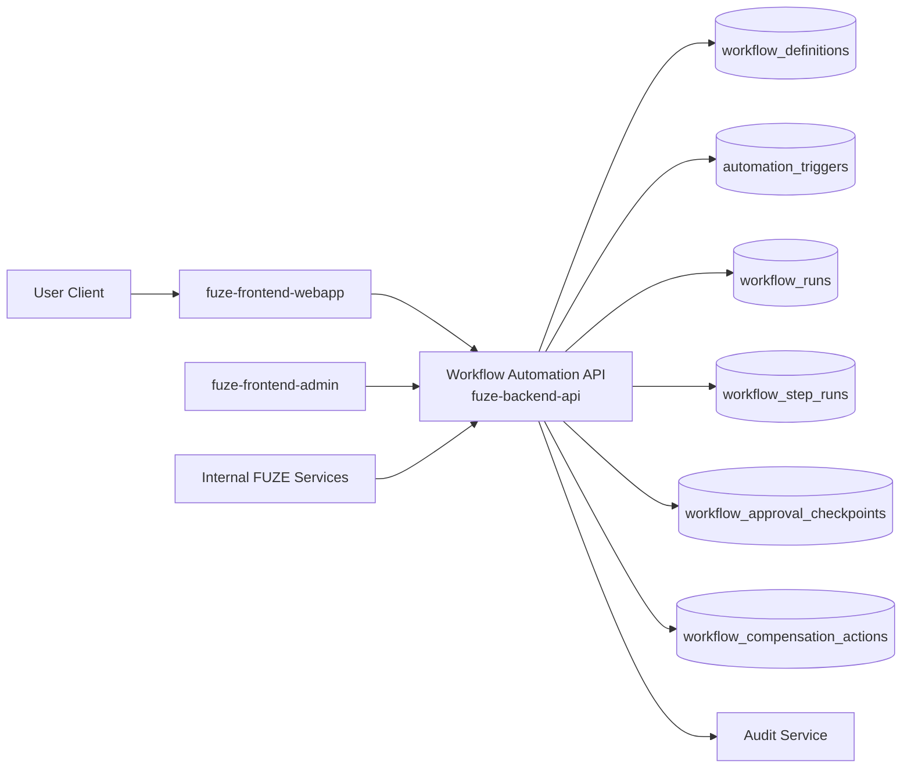
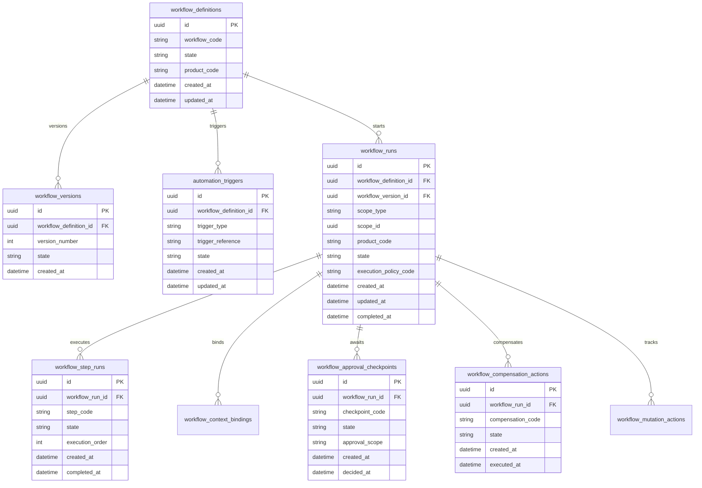
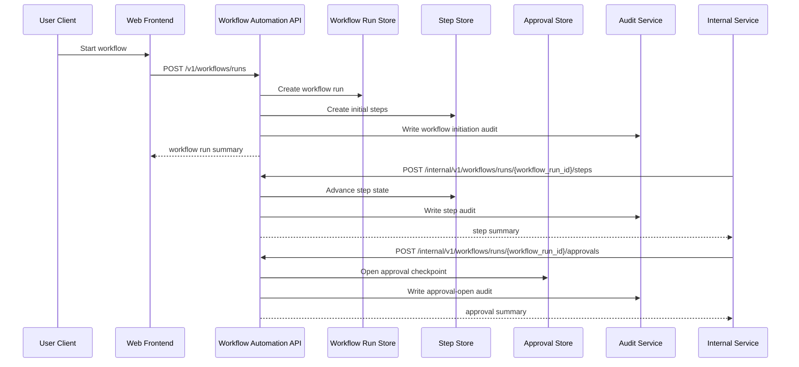

# WORKFLOW_AUTOMATION_API_SPEC

## 1. Title

**WORKFLOW_AUTOMATION_API_SPEC.md**

---

## 2. Document Metadata

- **Document Name:** WORKFLOW_AUTOMATION_API_SPEC.md
- **API Classification:** public, internal, admin, event-driven
- **Owning Domain:** Workflow and Automation Domain
- **Primary Implementing Repo:** `fuze-backend-api`
- **Primary System of Record:** workflow definitions, workflow runs, automation triggers, step executions, approval checkpoints, and remediation lineage in `fuze-backend-api`
- **Status:** Draft for canonical source-of-truth approval
- **Purpose:** Define the production-grade API contract architecture for FUZE workflow execution, automation triggers, step orchestration, approval gates, retry/remediation control, and cross-domain automation behavior across the platform
- **Canonical Folder:** `fuze.ac > docs > api-spec`

---

## 2.1 API Classification Header

- **API Classification:** public | internal | admin | event-driven
- **Owning Domain:** Workflow and Automation Domain
- **Primary Implementing Repo:** `fuze-backend-api`
- **Primary System of Record:** workflow and automation execution domain

---

## 3. Purpose

This document defines the canonical API specification for FUZE workflow and automation operations. It translates the governing FUZE platform architecture, workflow and automation rules, job queue and worker rules, AI orchestration rules, audit requirements, security controls, and API architecture rules into an implementation-ready API contract.

This API exists because FUZE is a multi-product platform where many business and operational actions are not single-step mutations. Onboarding, payment follow-through, credits settlement side effects, AI-assisted processing, content generation, approval-driven operations, notifications, reporting, and product-specific automations often require ordered steps, retries, human checkpoints, and controlled side effects across multiple domains. These flows must not be left to frontend scripts, hidden cron behavior, or ad hoc product-local background logic.

Accordingly, this specification defines how workflows and automations are represented, how triggers and step graphs are normalized, how workflow runs are created and advanced, how approvals and retries are handled, how outputs remain bounded by domain ownership, and how workflow execution remains auditable, idempotent, and architecture-consistent without allowing workflow runtime to become the shadow owner of business truth.

---

## 4. Scope

This specification covers:

- workflow capability visibility APIs
- workflow-definition visibility APIs
- workflow-run creation and status APIs
- automation-trigger registration and execution APIs
- approval-checkpoint and manual-action APIs
- internal service APIs for workflow execution and step progression
- admin/control-plane APIs for pause, cancel, retry, skip, remediation, and discrepancy resolution
- event emission requirements for workflow and automation lifecycle changes
- request, response, error, idempotency, versioning, audit, and database-shape rules for this domain

This specification does **not** redefine:

- job-queue and worker transport/runtime internals in full detail
- AI orchestration lifecycle semantics in full detail
- billing, credits, payout, or governance domain truth
- product business truth ownership
- external scheduler implementation details
- final UI behavior for every workflow surface
- provider SDK or webhook schemas in full detail

Those remain governed by their own source-of-truth specifications.

---

## 5. Source-of-Truth Inputs

### Primary FUZE docs and specs used

#### Highest-priority platform and ownership sources
- `SYSTEM_SPEC_INDEX.md`
- `SYSTEM_BOUNDARY_AND_OWNERSHIP_SPEC.md`
- `SYSTEM_OVERVIEW_AND_BOUNDARIES_SPEC.md`
- `PLATFORM_ARCHITECTURE_SPEC.md`
- `DOMAIN_OWNERSHIP_MATRIX_SPEC.md`
- `DATA_MODEL_AND_ENTITY_OWNERSHIP_SPEC.md`

#### Primary workflow / runtime / automation sources
- `WORKFLOW_AND_AUTOMATION_SPEC.md`
- `JOB_QUEUE_AND_WORKER_SPEC.md`
- `EVENT_MODEL_AND_WEBHOOK_SPEC_refreshed.md`
- `AI_ORCHESTRATION_SPEC.md`
- `MODEL_ROUTING_AND_CONTEXT_SPEC.md`
- `AI_USAGE_METERING_SPEC.md`
- `AUDIT_LOG_AND_ACTIVITY_SPEC.md`
- `SECURITY_AND_RISK_CONTROL_SPEC.md`
- `ROLE_PERMISSION_AND_ACCESS_CONTROL_SPEC.md`

#### API and runtime sources
- `API_ARCHITECTURE_SPEC.md`
- `PUBLIC_API_SPEC.md`
- `INTERNAL_SERVICE_API_SPEC.md`
- `IDEMPOTENCY_AND_VERSIONING_SPEC.md`
- `MIGRATION_AND_BACKWARD_COMPATIBILITY_SPEC.md`
- `MONITORING_ALERTING_AND_INCIDENT_RESPONSE_SPEC.md`
- `SECRETS_CONFIG_AND_ENVIRONMENT_SPEC.md`

#### Product integration context
- `PRODUCT_INTEGRATION_ARCHITECTURE_SPEC.md`
- `QTB_PRODUCT_INTEGRATION_SPEC.md`
- `AIMM_PRODUCT_INTEGRATION_SPEC.md`
- `ZAGA_PRODUCT_INTEGRATION_SPEC.md`
- `AIE_PRODUCT_INTEGRATION_SPEC.md`
- `HERHELP_PRODUCT_INTEGRATION_SPEC.md`
- `BOTMAD_PRODUCT_INTEGRATION_SPEC.md`

#### Format guides
- `The_API_Specification_guide.md`
- `Database_Schemas_Guide.md`

### Highest-priority interpretation applied

For this file, the most important governing interpretation is:

1. workflow and automation are governed execution layers, not owners of durable business truth
2. backend owns canonical workflow and automation truth
3. workflow runs, triggers, approvals, retries, and remediation lineage must remain explicit
4. products may request or consume workflow execution but do not redefine platform-wide workflow semantics
5. admin/control-plane may pause, retry, skip, or remediate under controlled policy but do not own workflow truth
6. workflow execution may trigger owning-domain APIs, but workflow state must remain distinct from the underlying domain truth it coordinates

### Supporting external standards used only as guidance

- HTTP semantics for safe reads, async initiation, and mutation responses
- structured problem-details error design
- general workflow-state, retry-policy, and compensation-lineage patterns as supporting guidance

External guidance does not override FUZE source-of-truth documents.

---

## 6. Governing Architecture and Ownership Interpretation

This API belongs to the **Workflow and Automation Domain** because it owns the platform-governed lifecycle of multi-step execution flows, automation trigger handling, ordered step progression, approval gates, retry/remediation behavior, and explicit coordination across domains.

This API is implemented primarily in `fuze-backend-api` because:

- backend owns durable workflow and automation truth
- frontend surfaces must consume workflow state, not invent or finalize it
- retries, approvals, compensations, and cross-domain coordination must be centralized
- product domains require a shared and trusted automation interface
- audit generation, safety restriction, and operational remediation must be backend-governed

This API is **not** owned by:

- `fuze-frontend-webapp`, because webapp only initiates, views, or responds to allowed workflow actions
- `fuze-frontend-admin`, because admin may pause/retry/skip/remediate but must not own workflow truth
- job queue and worker runtime, because queue/worker systems execute deferred jobs but do not own workflow business meaning
- product domains, because products may define business intent and allowed automation entry points but do not define cross-platform workflow semantics
- AI orchestration domain, because AI may be one step type or sub-capability inside a workflow, not the owner of workflow state

### Architectural implications

- one workflow definition may be reused across many product and scope contexts
- one workflow run may contain many ordered or conditionally branched step executions
- automation triggers may be event-driven, schedule-driven, rule-driven, or manually initiated
- a workflow step may call another domain’s canonical API, but workflow does not own the resulting business truth
- retries, skips, compensations, and approvals must preserve explicit lineage
- workflow completion does not itself imply that every downstream business mutation succeeded unless each owning domain confirms that outcome

---

## 7. Domain Responsibilities

The Workflow and Automation API domain is responsible for:

1. receiving and normalizing workflow and automation requests
2. binding requests to scope, actor, definition, trigger, and execution policy
3. creating and managing workflow-run lifecycle state
4. advancing step executions under explicit workflow rules
5. handling approval checkpoints and manual intervention requests
6. coordinating retries, skips, compensations, and resumptions
7. exposing bounded workflow status and outputs for allowed consumers
8. supporting internal service execution of workflow steps
9. emitting workflow lifecycle events
10. generating audit lineage for sensitive automation actions

The domain is not responsible for:

- owning product business truth
- directly rewriting underlying domain truth instead of calling owning-domain interfaces
- owning queue or worker transport internals
- owning AI orchestration, billing, credits, or document truth
- owning final user entitlements beyond access gating for workflow actions

---

## 8. Out of Scope

The following are out of scope for this API specification:

- low-level queue partitioning and worker concurrency internals
- final BPMN-style visual authoring UI
- full DAG language design for every future workflow type
- provider-specific cron/scheduler detail
- product-local scripting runtime design
- full compensation policy for every business domain
- final analytics warehouse schema for workflow telemetry
- external workflow-engine vendor integration specifics

Where later detailed specs are needed, they must remain compatible with this API.

---

## 9. Canonical Entities and Data Ownership

### Durable entities

#### 9.1 workflow_definitions
- **Owner:** Workflow and Automation Domain
- **Purpose:** canonical reusable workflow templates and step graph definitions
- **Nature:** source-of-truth durable entity

#### 9.2 workflow_versions
- **Owner:** Workflow and Automation Domain
- **Purpose:** immutable version lineage for workflow definitions
- **Nature:** source-of-truth durable entity

#### 9.3 automation_triggers
- **Owner:** Workflow and Automation Domain
- **Purpose:** canonical trigger definitions for event-, rule-, schedule-, or manual-driven automation
- **Nature:** source-of-truth durable entity

#### 9.4 workflow_runs
- **Owner:** Workflow and Automation Domain
- **Purpose:** canonical workflow-run lifecycle records
- **Nature:** source-of-truth durable entity

#### 9.5 workflow_step_runs
- **Owner:** Workflow and Automation Domain
- **Purpose:** explicit step-level execution lineage within a workflow run
- **Nature:** source-of-truth durable entity

#### 9.6 workflow_context_bindings
- **Owner:** Workflow and Automation Domain
- **Purpose:** explicit references to scope, source objects, event origins, AI runs, or domain objects used by a workflow run
- **Nature:** source-of-truth durable lineage entity

#### 9.7 workflow_approval_checkpoints
- **Owner:** Workflow and Automation Domain
- **Purpose:** approval or human-intervention checkpoints for gated workflow progression
- **Nature:** source-of-truth durable entity

#### 9.8 workflow_compensation_actions
- **Owner:** Workflow and Automation Domain
- **Purpose:** explicit compensation or rollback-safe coordination lineage
- **Nature:** durable corrective lineage entity

#### 9.9 workflow_execution_policies
- **Owner:** Workflow and Automation Domain
- **Purpose:** named execution-policy bundles controlling retries, timeout classes, approval requirements, and allowed side-effect classes
- **Nature:** source-of-truth durable entity

#### 9.10 workflow_mutation_actions
- **Owner:** Workflow and Automation Domain
- **Purpose:** high-level action records for create, pause, resume, retry, skip, cancel, remediate, and close
- **Nature:** durable action records with audit linkage

#### 9.11 workflow_audit_events
- **Owner:** Audit / Activity domain, sourced by Workflow and Automation Domain
- **Purpose:** immutable trail for sensitive workflow actions
- **Nature:** durable audit records

### Derived or cached entities

#### 9.12 workflow_run_status_views
- **Owner:** derived read-model layer
- **Purpose:** user-facing and admin-facing workflow summaries
- **Nature:** derived

#### 9.13 workflow_action_queue_views
- **Owner:** derived read-model layer
- **Purpose:** approval queues, pending manual actions, and operational backlog summaries
- **Nature:** derived

#### 9.14 workflow_discrepancy_views
- **Owner:** derived ops read-model layer
- **Purpose:** visibility into failed, stuck, or inconsistent workflow execution
- **Nature:** derived

---

## 10. State Model and Lifecycle

### 10.1 workflow definition lifecycle

Possible states:

- `draft`
- `active`
- `deprecated`
- `disabled`

### 10.2 automation trigger lifecycle

Possible states:

- `active`
- `paused`
- `disabled`
- `superseded`

### 10.3 workflow run lifecycle

Possible states:

- `created`
- `validated`
- `queued`
- `running`
- `awaiting_approval`
- `paused`
- `partially_completed`
- `completed`
- `failed`
- `cancelled`
- `restricted`

### 10.4 workflow step lifecycle

Possible states:

- `pending`
- `ready`
- `executing`
- `awaiting_external_result`
- `awaiting_approval`
- `completed`
- `failed`
- `skipped`
- `cancelled`
- `superseded`

### 10.5 approval checkpoint lifecycle

Possible states:

- `opened`
- `pending_decision`
- `approved`
- `denied`
- `expired`
- `cancelled`

### 10.6 compensation action lifecycle

Possible states:

- `pending`
- `ready`
- `executing`
- `completed`
- `failed`
- `cancelled`

Lifecycle notes:
- one workflow run may pause or wait at approval/manual checkpoints without failing
- partial completion must remain explicit when some steps succeeded before failure or cancellation
- compensation is explicit lineage and must not silently erase prior side effects
- restricted state may halt progression without deleting history

---

## 11. API Surface Overview

The API surface is divided into four families:

### 11.1 Public / first-party user-facing APIs
Used by `fuze-frontend-webapp` and approved first-party clients for:
- reading visible workflow capabilities and runs
- creating user-initiated workflow runs in allowed scopes
- reading bounded workflow outputs/status
- responding to approval checkpoints where actor has authority
- cancelling own/authorized runs where policy allows

### 11.2 Internal service APIs
Used by trusted internal services for:
- creating product-owned workflow runs
- advancing step executions
- recording external-step results
- opening/closing approvals
- reporting compensation, retry, and completion outcomes
- reading canonical workflow state

### 11.3 Admin / control-plane APIs
Used by `fuze-frontend-admin` through backend-only privileged routes for:
- pausing, resuming, retrying, skipping, or cancelling runs
- forcing step remediation under controlled policy
- resolving stuck approvals or discrepancies
- restricting workflow definitions or triggers where policy allows

### 11.4 Event-driven interfaces
Used for downstream side effects:
- audit generation
- queue/worker dispatch triggers
- orchestration continuation triggers
- product notification triggers
- monitoring and anomaly detection

---

## 12. Authentication and Authorization Model

### 12.1 Authentication posture by route family

#### Authenticated user routes
Require valid authenticated session:
- create allowed workflow runs in owned or authorized scope
- read visible workflow run status
- respond to approval checkpoints where actor has authority
- cancel own/authorized runs where policy allows

#### Internal service routes
Require internal service identity with explicit least privilege:
- create product-owned runs
- advance steps
- record external results
- open/resolve approval checkpoints
- apply compensation and completion state

#### Admin routes
Require privileged operator identity plus reason-coded actions:
- pause/resume/retry/skip/cancel/remediate
- resolve discrepancies or expired checkpoints
- restrict definitions or triggers
- force close under controlled policy

### 12.2 Authorization checkpoints

Authorization must evaluate:
- canonical account identity
- session validity
- target scope and product context
- actor’s workspace role where applicable
- whether workflow capability is allowed in the scope
- whether requested approval or action is assigned to the actor’s permission set
- whether admin/operator role is present for privileged actions
- whether execution policy allows the requested mutation in current state

### 12.3 Sensitive action rules

The following require heightened checks:
- workflow runs that can trigger sensitive downstream side effects
- approval decisions on privileged checkpoints
- skip or compensation execution
- admin pause/retry/force-remediate actions
- forced closure or restriction actions

---

## 13. API Endpoints / Interface Contracts

## 13.1 Public / First-Party User APIs

### 13.1.1 `GET /v1/workflows/capabilities`
**Purpose:** list visible workflow and automation capabilities for current actor and scope  
**Caller Type:** authenticated user  
**Auth Expectation:** valid authenticated session  
**Query Parameters Summary:**
- optional `scope_type`
- optional `scope_id`
- optional `product_code`
**Response Summary:**
- visible workflow capability summaries
- allowed initiation classes
- approval-interaction hints
- async/manual hints where applicable
**Side Effects:** none
**Audit Requirements:** access logging only
**Emitted Events:** none required

### 13.1.2 `POST /v1/workflows/runs`
**Purpose:** create workflow run for an owned or authorized scope  
**Caller Type:** authenticated user with scope authority  
**Request Body Summary:**
- `scope_type`
- `scope_id`
- `product_code`
- `workflow_code`
- `input_payload`
- optional `context_reference_ids[]`
- optional `execution_mode`
- `idempotency_key`
**Response Summary:**
- workflow run summary
- current status
- initial pending approvals or step summary
**Side Effects:** creates workflow run and initial step lineage
**Idempotency Behavior:** required
**Audit Requirements:** sensitive workflow initiation audit
**Emitted Events:** `workflow.run_requested`

### 13.1.3 `GET /v1/workflows/runs`
**Purpose:** list visible workflow runs for current actor  
**Caller Type:** authenticated user  
**Query Parameters Summary:**
- pagination
- optional state filters
- optional product filters
- optional date range
**Response Summary:** workflow run summaries, states, and bounded output/action availability
**Side Effects:** none

### 13.1.4 `GET /v1/workflows/runs/{workflow_run_id}`
**Purpose:** retrieve canonical bounded workflow-run detail view  
**Caller Type:** authenticated user with run visibility  
**Response Summary:**
- run state
- step summary
- approval summary
- bounded outputs and actionability summary
- restriction indicators where applicable
**Side Effects:** none

### 13.1.5 `POST /v1/workflows/approvals/{approval_checkpoint_id}/decision`
**Purpose:** approve or deny one visible approval checkpoint where actor has authority  
**Caller Type:** authenticated user with approval authority  
**Request Body Summary:**
- `decision`
- optional `decision_note`
- `idempotency_key`
**Response Summary:** approval decision summary and updated workflow-run status
**Side Effects:** approval checkpoint advances, workflow may continue or terminate by policy
**Idempotency Behavior:** required
**Audit Requirements:** sensitive approval-decision audit
**Emitted Events:** `workflow.approval_decided`

### 13.1.6 `POST /v1/workflows/runs/{workflow_run_id}/cancel`
**Purpose:** cancel a user-visible workflow run where policy allows  
**Caller Type:** authenticated user with cancellation authority  
**Request Body Summary:**
- optional `reason_code`
- `idempotency_key`
**Response Summary:** updated workflow-run summary
**Side Effects:** run transitions to cancelled if cancellable
**Idempotency Behavior:** required
**Audit Requirements:** sensitive workflow-cancel audit
**Emitted Events:** `workflow.run_cancelled`

## 13.2 Internal Service APIs

### 13.2.1 `POST /internal/v1/workflows/runs`
**Purpose:** create product-owned workflow run  
**Caller Type:** internal trusted services  
**Auth Expectation:** service-to-service identity only  
**Request Body Summary:**
- `scope_type`
- `scope_id`
- `product_code`
- `workflow_code`
- `input_payload`
- `execution_policy_code`
- optional `context_bindings[]`
- optional `trigger_reference`
- `idempotency_key`
**Response Summary:** workflow run summary and initial step graph summary
**Side Effects:** creates workflow run, context bindings, and initial step lineage
**Idempotency Behavior:** required
**Audit Requirements:** workflow initiation audit
**Emitted Events:** `workflow.run_requested`

### 13.2.2 `POST /internal/v1/workflows/runs/{workflow_run_id}/steps`
**Purpose:** record or advance one workflow step  
**Caller Type:** internal trusted services with workflow-execution authority  
**Request Body Summary:**
- `step_code`
- `step_payload`
- optional `state_transition`
- `idempotency_key`
**Response Summary:** workflow-step summary and updated run state
**Side Effects:** creates or advances step lineage
**Idempotency Behavior:** required
**Audit Requirements:** step execution audit where sensitivity requires
**Emitted Events:** `workflow.step_updated`

### 13.2.3 `POST /internal/v1/workflows/runs/{workflow_run_id}/approvals`
**Purpose:** open one approval checkpoint for a run  
**Caller Type:** internal trusted services with approval authority  
**Request Body Summary:**
- `checkpoint_code`
- `approval_scope`
- optional `approval_payload`
- `idempotency_key`
**Response Summary:** approval checkpoint summary
**Side Effects:** creates approval checkpoint and may move run to awaiting_approval
**Idempotency Behavior:** required
**Audit Requirements:** approval-open audit
**Emitted Events:** `workflow.approval_opened`

### 13.2.4 `POST /internal/v1/workflows/runs/{workflow_run_id}/compensations`
**Purpose:** create or execute compensation action under workflow policy  
**Caller Type:** internal trusted services with compensation authority  
**Request Body Summary:**
- `compensation_code`
- `compensation_payload`
- `idempotency_key`
**Response Summary:** compensation summary and updated run posture
**Side Effects:** compensation lineage created or advanced
**Idempotency Behavior:** required
**Audit Requirements:** critical compensation audit
**Emitted Events:** `workflow.compensation_updated`

### 13.2.5 `POST /internal/v1/workflows/runs/{workflow_run_id}/complete`
**Purpose:** finalize workflow run with completed or failed terminal outcome  
**Caller Type:** internal trusted services with completion authority  
**Request Body Summary:**
- `terminal_outcome`
- optional `output_payload`
- optional `failure_code`
- `idempotency_key`
**Response Summary:** final workflow-run summary
**Side Effects:** run transitions to completed or failed and stores bounded output if present
**Idempotency Behavior:** required
**Audit Requirements:** critical workflow completion audit
**Emitted Events:** `workflow.run_completed`, `workflow.run_failed`

### 13.2.6 `GET /internal/v1/workflows/runs/{workflow_run_id}`
**Purpose:** retrieve canonical workflow-run truth for trusted services  
**Caller Type:** internal trusted services  
**Response Summary:** full run, step, approval, compensation, and output lineage
**Side Effects:** none

## 13.3 Admin / Control-Plane APIs

### 13.3.1 `POST /admin/v1/workflows/runs/{workflow_run_id}/pause`
**Purpose:** pause workflow run under controlled policy  
**Caller Type:** admin/operator  
**Request Body Summary:**
- `reason_code`
- `operator_note`
- optional `related_case_id`
- `idempotency_key`
**Response Summary:** paused workflow-run summary
**Side Effects:** run transitions to paused
**Audit Requirements:** critical audit
**Emitted Events:** `workflow.run_paused`

### 13.3.2 `POST /admin/v1/workflows/runs/{workflow_run_id}/resume`
**Purpose:** resume paused workflow run under controlled policy  
**Caller Type:** admin/operator  
**Request Body Summary:**
- `reason_code`
- `operator_note`
- `idempotency_key`
**Response Summary:** resumed workflow-run summary
**Side Effects:** run transitions paused -> runnable/running according to policy
**Audit Requirements:** critical audit
**Emitted Events:** `workflow.run_resumed`

### 13.3.3 `POST /admin/v1/workflows/runs/{workflow_run_id}/retry`
**Purpose:** trigger controlled retry of failed or remediable workflow run or step  
**Caller Type:** admin/operator  
**Request Body Summary:**
- `retry_profile`
- optional `step_reference`
- `reason_code`
- `operator_note`
- `idempotency_key`
**Response Summary:** retry action summary and updated/new execution lineage
**Side Effects:** may create retry lineage or superseding step/run lineage
**Audit Requirements:** critical audit
**Emitted Events:** `workflow.run_retried`

### 13.3.4 `POST /admin/v1/workflows/runs/{workflow_run_id}/skip-step`
**Purpose:** skip a pending or failed step under controlled policy  
**Caller Type:** admin/operator  
**Request Body Summary:**
- `step_reference`
- `reason_code`
- `operator_note`
- `idempotency_key`
**Response Summary:** skipped-step summary and updated run posture
**Side Effects:** step transitions to skipped with preserved lineage
**Audit Requirements:** critical audit
**Emitted Events:** `workflow.step_skipped`

### 13.3.5 `POST /admin/v1/workflows/discrepancies`
**Purpose:** resolve workflow discrepancy under controlled policy  
**Caller Type:** admin/operator  
**Request Body Summary:**
- `workflow_run_id`
- `resolution_code`
- `operator_note`
- `related_case_id`
- `idempotency_key`
**Response Summary:** discrepancy-resolution summary
**Side Effects:** may update run, step, approval, or compensation posture with preserved lineage
**Audit Requirements:** critical audit
**Emitted Events:** `workflow.discrepancy_resolved`

---

## 14. Request Rules

### 14.1 General request rules
- all mutation-capable routes must require JSON requests with explicit content type
- all mutation routes must carry correlation IDs
- sensitive workflow mutations must carry idempotency keys
- admin mutations must require reason codes and operator notes
- no route may accept frontend-computed workflow success as authoritative truth

### 14.2 Sensitive-action request requirements
The following requests require heightened validation:
- workflow runs that can trigger sensitive downstream side effects
- approval decisions on privileged checkpoints
- compensation actions
- pause/resume/retry/skip/remediate actions
- forced completion or discrepancy-resolution actions

Heightened validation may include:
- scope authorization checks
- workflow-capability checks
- execution-policy checks
- duplicate-step and duplicate-approval checks
- operator role confirmation
- support/security case linkage for admin flows

### 14.3 Scope integrity rule
Workflow mutations must target valid and authorized scopes, products, and workflow capabilities. Product or service callers must not create or mutate workflow state for unrelated or unauthorized scopes.

### 14.4 Business-truth separation rule
Workflow completion or step completion must not silently commit business truth in another domain unless that owning domain explicitly validates and commits the change through its own canonical API or internal mutation path.

---

## 15. Response Rules

### 15.1 Success response rules
Successful responses must include:
- stable resource identifiers
- timestamps for created/updated state
- state/status values
- scope and product summaries
- step, approval, or output summaries where relevant
- correlation references for mutations

### 15.2 Async-accepted response rules
If execution, retry, compensation, or remediation is async, the response must:
- return accepted status
- include action or job ID
- provide follow-up status semantics

### 15.3 Terminal mutation response rules
Terminal mutation responses must clearly show:
- target run, step, or approval
- mutation type
- resulting run/step/approval state
- retry, skip, compensation, or closure effects where relevant
- whether user-visible status may refresh asynchronously

### 15.4 Read response rules
Read responses must distinguish:
- durable workflow truth
- bounded output summaries
- approval/manual-action summaries
- operator-only details that must remain excluded from user-facing views

---

## 16. Error Model

The API uses structured problem-details style error responses.

### 16.1 Required error fields
- `type`
- `title`
- `status`
- `code`
- `detail`
- `instance`
- `correlation_id`

### 16.2 Common error codes

#### Authorization / permission errors
- `WORKFLOW_SESSION_REQUIRED`
- `WORKFLOW_PERMISSION_DENIED`
- `WORKFLOW_OPERATOR_PERMISSION_DENIED`
- `WORKFLOW_SERVICE_PERMISSION_DENIED`

#### State conflict errors
- `WORKFLOW_RUN_STATE_INVALID`
- `WORKFLOW_STEP_STATE_INVALID`
- `WORKFLOW_APPROVAL_ALREADY_TERMINAL`
- `WORKFLOW_RETRY_CONFLICT`
- `WORKFLOW_SKIP_CONFLICT`

#### Policy / safety errors
- `WORKFLOW_CAPABILITY_NOT_ALLOWED`
- `WORKFLOW_SCOPE_RESTRICTED`
- `WORKFLOW_APPROVAL_REQUIRED`
- `WORKFLOW_COMPENSATION_REQUIRED`
- `WORKFLOW_RESTRICTION_REQUIRED`
- `WORKFLOW_ACTION_NOT_ALLOWED`

#### Request integrity errors
- `WORKFLOW_IDEMPOTENCY_KEY_REQUIRED`
- `WORKFLOW_REQUEST_INVALID`
- `WORKFLOW_REQUEST_UNPROCESSABLE`

#### Dependency or provider errors
- `WORKFLOW_QUEUE_UNAVAILABLE`
- `WORKFLOW_STEP_EXECUTION_UNAVAILABLE`
- `WORKFLOW_REMEDIATION_UNAVAILABLE`

### 16.3 Error handling rules
- do not expose hidden operator-only or security-review internals
- do not imply business-truth commitment from workflow success alone
- distinguish awaiting_approval from generic failure
- distinguish restricted run from failed execution
- include retry guidance only where safe

---

## 17. Idempotency and Mutation Safety

### 17.1 Required idempotent mutations
The following mutation routes require idempotent behavior:
- workflow-run creation
- step advancement
- approval opening
- approval decision
- compensation execution
- run completion
- run cancellation
- pause/resume/retry/skip
- discrepancy resolution

### 17.2 Idempotency key rules
- mutation requests must supply `Idempotency-Key`
- backend stores key scope, request hash, actor, and terminal result
- replay of same semantic request returns original terminal outcome
- replay of same key with different semantic request must fail with conflict

### 17.3 Mutation safety rules
- the same step must not be applied twice in conflicting ways
- approval decisions must not be recorded twice in conflicting terminal states
- retry lineage must preserve link to original failed or remediated run/step
- skip and compensation must preserve explicit prior execution history
- remediation must preserve immutable history rather than rewrite prior workflow records

---

## 18. Versioning and Compatibility Rules

### 18.1 Versioning
This API family is versioned under `/v1`, `/internal/v1`, and `/admin/v1` route families.

### 18.2 Compatibility approach
- additive evolution preferred
- no silent semantic change to run, step, approval, compensation, or trigger states
- new workflow codes, step codes, and trigger classes may be added without breaking existing contracts
- response fields may be added but existing meanings must remain stable

### 18.3 Breaking-change rules
Breaking changes include:
- changing the meaning of completed, failed, paused, restricted, or cancelled states
- changing approval or compensation semantics incompatibly
- removing critical run or step fields
- changing retry or skip semantics incompatibly

Such changes require explicit migration planning and version evolution.

### 18.4 Deprecation
Deprecated routes or fields must:
- be documented explicitly
- carry deprecation metadata where supported
- preserve compatibility windows long enough for first-party consumers and future SDKs

---

## 19. Event Emission and Webhook Behavior

This domain is event-capable.

### 19.1 Internal events
The Workflow and Automation domain must emit canonical internal events such as:
- `workflow.run_requested`
- `workflow.step_updated`
- `workflow.approval_opened`
- `workflow.approval_decided`
- `workflow.compensation_updated`
- `workflow.run_completed`
- `workflow.run_failed`
- `workflow.run_cancelled`
- `workflow.run_paused`
- `workflow.run_resumed`
- `workflow.run_retried`
- `workflow.step_skipped`
- `workflow.discrepancy_resolved`

### 19.2 Event payload minimums
Each event should contain:
- event ID
- event type
- occurred_at
- scope type and scope ID
- workflow run ID
- product code and workflow code where relevant
- step or approval reference where relevant
- actor type
- correlation ID
- reason code where applicable

### 19.3 External webhook posture
This specification does not expose general third-party outbound workflow webhooks by default. Any future outbound workflow webhook surface must be narrow, security-reviewed, and governed by a separate contract.

---

## 20. Audit and Activity Requirements

The following actions must generate durable audit events:

- sensitive workflow-run creation
- approval opening and decision where policy requires
- step skips and compensation actions
- run completion or failure
- run cancellation, pause, resume, retry
- discrepancy resolution
- other sensitive workflow flows

### Required audit fields
- audit event ID
- actor type and actor reference
- scope type and scope reference
- target run / step / approval / compensation reference as applicable
- action type
- before/after workflow summary where applicable
- reason code
- correlation ID
- operator note if operator action
- occurred_at

User-facing activity feeds may show a filtered subset, but audit truth must remain durable and immutable.

---

## 21. Data Model and Database Schema View

### 21.1 `workflow_definitions`
- `id` PK
- `workflow_code`
- `state`
- `product_code` nullable
- `definition_summary_json`
- `created_at`
- `updated_at`

**Constraints:**
- unique `workflow_code`
- index on `state`

### 21.2 `workflow_versions`
- `id` PK
- `workflow_definition_id` FK -> `workflow_definitions.id`
- `version_number`
- `graph_definition_json`
- `state`
- `created_at`

**Constraints:**
- unique (`workflow_definition_id`, `version_number`)
- index on `state`

### 21.3 `automation_triggers`
- `id` PK
- `workflow_definition_id` FK -> `workflow_definitions.id`
- `trigger_type`
- `trigger_reference`
- `state`
- `created_at`
- `updated_at`

**Constraints:**
- index on (`trigger_type`, `state`)

### 21.4 `workflow_runs`
- `id` PK
- `workflow_definition_id` FK -> `workflow_definitions.id`
- `workflow_version_id` FK -> `workflow_versions.id`
- `scope_type`
- `scope_id`
- `product_code`
- `state`
- `execution_policy_code`
- `started_at` nullable
- `completed_at` nullable
- `failed_at` nullable
- `cancelled_at` nullable
- `paused_at` nullable
- `restricted_at` nullable
- `created_at`
- `updated_at`

**Constraints:**
- index on (`scope_type`, `scope_id`)
- index on (`product_code`, `state`)

### 21.5 `workflow_step_runs`
- `id` PK
- `workflow_run_id` FK -> `workflow_runs.id`
- `step_code`
- `state`
- `execution_order`
- `step_payload_json`
- `created_at`
- `executed_at` nullable
- `failed_at` nullable
- `completed_at` nullable

**Constraints:**
- index on `workflow_run_id`
- index on (`state`, `execution_order`)

### 21.6 `workflow_context_bindings`
- `id` PK
- `workflow_run_id` FK -> `workflow_runs.id`
- `context_type`
- `context_reference_id`
- `binding_role`
- `created_at`

**Constraints:**
- index on `workflow_run_id`

### 21.7 `workflow_approval_checkpoints`
- `id` PK
- `workflow_run_id` FK -> `workflow_runs.id`
- `checkpoint_code`
- `state`
- `approval_scope`
- `created_at`
- `decided_at` nullable
- `decision` nullable

**Constraints:**
- index on `workflow_run_id`
- index on `state`

### 21.8 `workflow_compensation_actions`
- `id` PK
- `workflow_run_id` FK -> `workflow_runs.id`
- `compensation_code`
- `state`
- `target_reference`
- `created_at`
- `executed_at` nullable
- `failed_at` nullable

### 21.9 `workflow_execution_policies`
- `id` PK
- `policy_code`
- `state`
- `retry_policy_json`
- `timeout_policy_json`
- `approval_policy_json`
- `allowed_side_effect_classes_json`
- `created_at`
- `updated_at`

**Constraints:**
- unique `policy_code`
- index on `state`

### 21.10 `workflow_mutation_actions`
- `id` PK
- `workflow_run_id` FK -> `workflow_runs.id`
- `action_type`
- `state`
- `reason_code`
- `operator_note` nullable
- `requested_by_actor_type`
- `requested_by_actor_id`
- `created_at`
- `executed_at` nullable
- `closed_at` nullable
- `correlation_id`

### 21.11 `idempotency_records`
- `id` PK
- `idempotency_key`
- `scope_family`
- `actor_reference`
- `request_hash`
- `response_hash`
- `terminal_status`
- `created_at`
- `expires_at`

### 21.12 `audit_log_entries`
Domain-sourced audit records written into the audit domain.

### Normalization notes
- canonical workflow truth stays in definitions, versions, triggers, runs, step runs, approvals, and compensations
- queue/worker runtime state remains external and referenced, not duplicated as workflow business truth
- user-facing summaries are derived and must not replace canonical run/step state
- product business truth remains external to workflow state

### Reconciliation notes
- one workflow run should reconcile to one current run lineage plus explicit retries or superseding step lineage where needed
- approval decisions must reconcile to workflow progression or termination
- compensation actions must reconcile to explicit downstream remediation outcomes
- completion and closure must preserve step and action history

---

## 22. Architecture Diagram — Mermaid flowchart



---

## 23. Data Design — Mermaid Diagram



---

## 24. Flow View

### 24.1 Happy path — user-initiated workflow
1. authenticated actor requests workflow capability in authorized scope
2. backend validates workflow capability, scope, and execution policy
3. workflow run is created
4. initial steps are scheduled and advanced
5. any approvals are opened when encountered
6. remaining steps complete successfully
7. bounded output is stored if applicable
8. run completes and events/audit are emitted

### 24.2 Happy path — product-owned automation
1. internal product service submits workflow run with execution policy and trigger reference
2. backend creates run and context bindings
3. step executions progress through internal services/workers
4. external results or approvals are recorded when needed
5. run completes and product reads canonical workflow outcome
6. owning domains separately confirm any business-truth mutations

### 24.3 Alternate path — approval-gated workflow
1. run advances until approval checkpoint
2. checkpoint is opened and run enters awaiting_approval
3. authorized actor or admin decides approval
4. workflow resumes or terminates according to decision
5. audit and events are emitted

### 24.4 Failure path — step failure
1. one step fails during execution
2. workflow enters failed or partially_completed posture
3. retry or compensation may be required by policy
4. history of completed and failed steps remains explicit

### 24.5 Failure and remediation path — stuck or inconsistent workflow
1. workflow pauses, stalls, or reaches discrepancy posture
2. admin reviews run and applies pause, retry, skip, or remediation under policy
3. superseding step/run lineage is created as needed
4. workflow eventually completes, remains failed, or closes with explicit discrepancy outcome

### 24.6 Compensation path
1. downstream side effect occurred in a completed step
2. later failure requires compensating action
3. compensation action is created and executed
4. workflow state reflects compensation lineage without erasing original step history

### 24.7 Retry behavior
- duplicate workflow-run creation returns same primary run result
- duplicate step update returns same terminal step result
- duplicate approval decision returns same terminal checkpoint decision
- duplicate retry/skip/remediation returns same terminal action result

---

## 25. Data Flows — Mermaid sequenceDiagram



---

## 26. Security and Risk Controls

1. **Workflow truth is backend-owned**  
   Frontends and products may not authoritatively mark workflow runs complete or valid outside approved backend APIs.

2. **Workflow is not business-truth owner**  
   Workflow execution must not be treated as canonical domain truth without owning-domain validation.

3. **Policy-bound execution**  
   Step execution, approvals, retries, compensations, and allowed side effects must be governed by explicit execution policy.

4. **Least privilege**  
   Internal execution and approval routes must be limited to authorized service callers with explicit privileges.

5. **Sensitive-action controls**  
   Sensitive workflows, approvals, and compensations must be explicitly allowed before execution.

6. **Immutable lineage**  
   Retries, skips, cancellations, compensations, and remediations must preserve history instead of rewriting prior records.

7. **Problem-details discipline**  
   Error bodies must be structured and safe, without exposing hidden operator-only or security-review details.

8. **Audit immutability**  
   Sensitive workflow actions require durable immutable audit lineage.

9. **Replay resistance**  
   Run creation, step updates, approvals, completion, retry, and remediation must be idempotent and replay-safe.

10. **Output-release control**  
    Workflow completion does not guarantee unrestricted business outcome release; owning domains remain authoritative for committed truth.

---

## 27. Operational Considerations

- workflow-status reads are user- and product-visible and should be highly available
- async step execution and approvals must be correctness-sensitive and traceable
- failed steps, stalled runs, and expired approvals require explicit remediation visibility
- queue/worker degradation should surface clearly to ops views
- monitoring should alert on:
  - spikes in failed workflow runs
  - unusual pause/retry/skip volume
  - approval backlog growth
  - step execution failure spikes
  - run stall duration above thresholds
  - discrepancy-resolution spikes

---

## 28. Acceptance Criteria

1. The API preserves the distinction between workflow truth and product business truth.
2. Only `fuze-backend-api` owns canonical workflow and automation truth.
3. Workflow definitions, runs, steps, approvals, and compensations are durable and backend-owned.
4. Workflow capability, step execution, and approvals are policy-bound.
5. Run completion is distinct from business-truth commitment in other domains.
6. Step, approval, retry, skip, compensation, and remediation lineage are explicit and immutable.
7. Cancellation, retry, skip, and remediation are idempotent and auditable.
8. Internal workflow routes are least-privilege and backend-only.
9. Admin routes require reason-coded privileged authorization.
10. Event emissions exist for major workflow mutations.
11. Response and error semantics are stable and machine-readable.
12. Database schema separates definitions, versions, triggers, runs, steps, approvals, and compensations.
13. Products can consume canonical workflow APIs without redefining platform workflow semantics.
14. Restriction and discrepancy handling are supported and safely replayable.
15. Mermaid diagrams remain consistent with prose and data model.

---

## 29. Test Cases

### 29.1 Positive cases
1. Authenticated user creates allowed workflow run successfully.
2. Authenticated user reads visible workflow-run summary successfully.
3. Authenticated user approves visible approval checkpoint successfully.
4. Internal service creates product-owned workflow run successfully.
5. Internal service advances workflow step successfully.
6. Internal service opens approval checkpoint successfully.
7. Internal service completes workflow run successfully.
8. Admin pauses and resumes workflow successfully.

### 29.2 Negative cases
9. Unauthenticated call to user workflow route is rejected.
10. User without scope authority cannot create workflow for workspace scope.
11. Request for disallowed workflow capability returns `WORKFLOW_CAPABILITY_NOT_ALLOWED`.
12. Attempt to decide non-visible approval checkpoint is denied.
13. Attempt to skip completed step returns conflict/state error.
14. Attempt to read restricted workflow output returns appropriate restricted response.

### 29.3 Authorization cases
15. Ordinary user cannot call admin pause/resume/retry/skip/discrepancy routes.
16. Internal service without execution privilege cannot advance step.
17. Internal service without completion privilege cannot complete run.
18. Product service cannot mark workflow result as product truth without separate owning-domain path.

### 29.4 Idempotency and replay cases
19. Repeating run creation with same idempotency key returns original run result.
20. Repeating step update with same idempotency key returns original terminal step result.
21. Repeating approval decision with same idempotency key returns original terminal checkpoint result.
22. Repeating retry or skip with same idempotency key returns original action result.

### 29.5 Concurrency cases
23. Concurrent step updates preserve one explicit ordered step lineage and one duplicate-safe outcome where appropriate.
24. Concurrent approval decisions preserve one explicit terminal decision lineage.
25. Concurrent retry and skip actions preserve explicit run-state ordering without hidden overwrite.

### 29.6 Recovery / admin cases
26. Failed run can be retried under controlled policy with explicit retry linkage.
27. Paused run prevents normal progression without approved resume/remediation.
28. Compensation action remains historically linked while preserving original step history.

### 29.7 Event and audit cases
29. Successful workflow run creation emits `workflow.run_requested`.
30. Successful approval decision emits `workflow.approval_decided`.
31. Successful run completion emits `workflow.run_completed`.
32. Successful discrepancy resolution emits `workflow.discrepancy_resolved` with critical audit lineage.

---

## 30. Open Questions or Explicit Deferred Decisions

1. Exact workflow-code taxonomy across all products is deferred.
2. Exact trigger-type and schedule-expression model is deferred.
3. Exact step-type library and compensation templates are deferred.
4. Exact manual-action assignment model across workspaces is deferred.
5. Exact bounded output-shape standards for every workflow class are deferred.
6. Exact discrepancy taxonomy for workflow anomalies is deferred.

---

## 31. Implementation Notes for `fuze-backend-api`

Recommended backend module layout:

```text
modules/platform/
  workflow-automation/
  job-execution/
  ai-orchestration/
  audit-log/
  control-plane/
  integrations/
```

Implementation guidance:
- keep definition identity, run state, step lineage, approval checkpoints, compensation lineage, and execution policy in one canonical domain service
- perform capability-policy and step-transition checks inside the commit boundary
- keep retries, skips, pauses, cancellations, and remediations explicit and idempotent
- treat admin remediations as domain actions, not ad hoc row edits
- emit events only after canonical state commit succeeds
- publish user-facing workflow summaries from canonical truth; do not let derived views mutate workflow state

---

## 32. Frontend Consumption Notes

### For `fuze-frontend-webapp`
- may create runs, read run status, respond to approvals, and cancel allowed runs
- must not infer canonical workflow completion from client-side progress alone
- must treat backend workflow responses as authoritative
- should clearly distinguish queued, running, awaiting approval, paused, failed, completed, cancelled, and restricted states
- should not present workflow output as committed platform truth unless the owning domain separately confirms that outcome

### For `fuze-frontend-admin`
- may trigger privileged pause, resume, retry, skip, and discrepancy actions only through backend admin APIs
- must require operator reason input for sensitive mutations
- must not directly mutate workflow truth client-side
- should present immutable audit-linked summaries after privileged actions

---

## 33. Contract Derivation Notes

### OpenAPI / AsyncAPI
This spec should later derive into:
- workflow capability and run-creation operations
- run-status and approval-decision operations
- internal step, approval, compensation, and completion operations
- admin pause / resume / retry / skip / discrepancy operations
- shared problem-details schema
- workflow and automation events in AsyncAPI

### Future `fuze-sdk`
Future `fuze-sdk` packages may derive:
- workflow run creation helpers
- workflow-status polling helpers
- typed run, step, approval, and compensation models
- problem-error models for workflow outcomes

The SDK must derive from approved API contracts and must not become the source of truth over this narrative specification.
