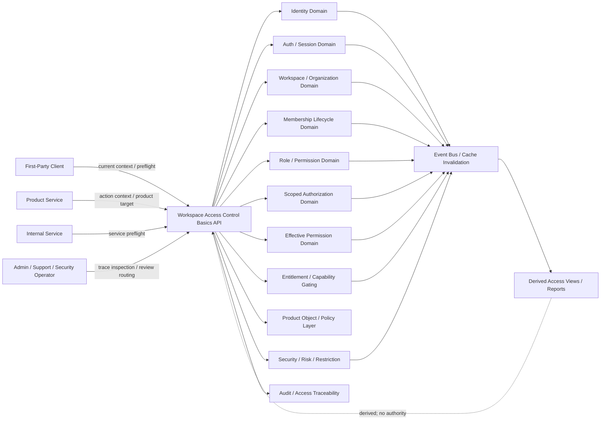
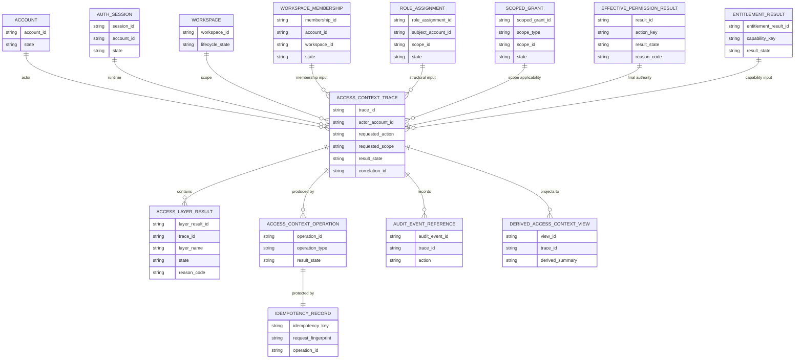
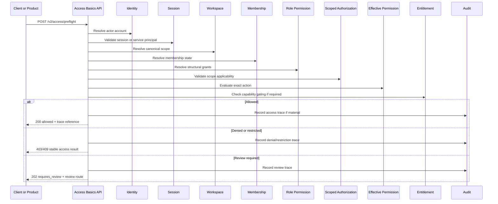

# WORKSPACE_ACCESS_CONTROL_BASICS_API_SPEC.md

## Document Metadata

- **Document Name:** `WORKSPACE_ACCESS_CONTROL_BASICS_API_SPEC.md`
- **Document Type:** FUZE API SPEC v2 / Production-grade interface-contract specification
- **Status:** Draft for production-grade API-spec review
- **Version:** 2.0.0
- **Effective Date:** 2026-04-24
- **Last Updated:** 2026-04-24
- **Reviewed On:** 2026-04-24
- **Document Owner:** FUZE Platform Workspace and Access Architecture
- **Approval Authority:** FUZE Platform Architecture and Governance Authority
- **Review Cadence:** Quarterly or upon material change to post-auth access ordering, workspace semantics, membership lifecycle, role/permission structure, scoped authorization, effective-permission evaluation, entitlement/capability gating, product-boundary rules, privileged correction posture, audit traceability, or API exposure.
- **Governing Layer:** API SPEC v2 / Workspace, Organization, Authorization, and Access Control API family
- **Parent Registry:** `API_SPEC_INDEX.md`
- **Upstream Semantic Registry:** `REFINED_SYSTEM_SPEC_INDEX.md`
- **Upstream API Registry:** `API_SPEC_INDEX.md`
- **Primary Audience:** API designers, backend engineers, frontend/client engineers, product engineers, workspace service owners, authorization service owners, entitlement service owners, security engineers, support/control-plane engineers, audit/governance reviewers, OpenAPI/AsyncAPI/SDK authors, QA and contract-validation teams.
- **Primary Purpose:** Define the FUZE API contract for the foundational workspace access-control ordering layer: canonical actor identity, authenticated session runtime, collaborative scope resolution, membership status, structural role/permission authority, scoped grant applicability, effective-permission evaluation, entitlement/capability gating, product policy handoff, audit traceability, and deny/review decision posture.
- **Primary Upstream References:**
  - `REFINED_SYSTEM_SPEC_INDEX.md`
  - `DOCS_SPEC_INDEX.md`
  - `SYSTEM_SPEC_INDEX.md`
  - `API_SPEC_INDEX.md`
  - `FUZE_ACCOUNT_ACCESS_AND_SESSION_THESIS_FINAL_SPEC.md`
  - `FUZE_ACCOUNT_ACCESS_AND_SESSION_CANONICAL_FINAL_SPEC.md`
  - `IDENTITY_AND_ACCOUNT_SPEC.md`
  - `AUTH_SESSION_AND_LINKED_LOGIN_SPEC.md`
  - `FUZE_SESSION_LIFECYCLE_AND_SECURITY_SPEC.md`
  - `WORKSPACE_AND_ORGANIZATION_SPEC.md`
  - `ROLE_PERMISSION_AND_ACCESS_CONTROL_SPEC.md`
  - `FUZE_WORKSPACE_ACCESS_CONTROL_BASICS_THESIS_FINAL_SPEC.md`
  - `WORKSPACE_MEMBERSHIP_LIFECYCLE_SPEC.md`
  - `SCOPED_AUTHORIZATION_MODEL_SPEC.md`
  - `ACCESS_EVALUATION_AND_EFFECTIVE_PERMISSION_SPEC.md`
  - `ADMIN_ACCESS_CORRECTION_AND_CONTAINMENT_SPEC.md`
  - `AUDIT_AND_ACCESS_TRACEABILITY_SPEC.md`
  - `ENTITLEMENT_AND_CAPABILITY_GATING_SPEC.md`
  - `WALLET_AWARE_USER_SPEC.md`
  - `SECURITY_AND_RISK_CONTROL_SPEC.md`
  - `WORKSPACE_ORGANIZATION_API_SPEC.md`
  - `ROLE_PERMISSION_ACCESS_API_SPEC.md`
- **Primary Downstream Dependents:**
  - OpenAPI contracts for access-context and access-preflight APIs
  - AsyncAPI contracts for access-context and authorization-boundary events
  - workspace and organization APIs
  - workspace membership lifecycle APIs
  - role/permission/access-control APIs
  - scoped authorization APIs
  - effective-permission APIs
  - entitlement/capability gating APIs
  - admin correction and containment APIs
  - audit and access traceability APIs
  - product integration contracts consuming post-auth access context
  - first-party clients and SDK access-context helpers
  - internal service authorization adapters
  - QA and contract-validation suites
- **API Surface Families Covered:** first-party application APIs, internal service APIs, admin/control-plane APIs, event/async APIs, derived access-context read/reporting APIs, limited public/read-safe APIs where explicitly approved.
- **API Surface Families Excluded:** canonical identity/auth/session APIs in full, workspace lifecycle APIs in full, membership lifecycle APIs in full, role/permission mutation APIs in full, scoped-grant internals in full, final effective-permission evaluation internals in full, entitlement formula APIs in full, billing/credits/ledger truth, wallet-link lifecycle, chain/on-chain authority, product-local object rule engines.
- **Canonical System Owner(s):** FUZE Platform Workspace and Access Architecture as interpretive owner of the layered access ordering; domain-specific ownership remains with Identity, Auth/Session, Workspace/Organization, Membership Lifecycle, Authorization, Scoped Authorization, Effective Permission, Entitlement, Audit, Security/Risk, and Admin Correction domains.
- **Canonical API Owner:** FUZE Platform API Architecture / Workspace Access Control Basics API owner
- **Supersedes:** Foundational post-auth sequencing and access-context interpretation portions of `WORKSPACE_ORGANIZATION_API_SPEC.md` and `ROLE_PERMISSION_ACCESS_API_SPEC.md` where this API v2 document is narrower, stricter, or more explicit.
- **Superseded By:** Not yet known
- **Related Decision Records:** Not explicitly available in retrieved governing materials
- **Canonical Status Note:** This API spec derives from `FUZE_WORKSPACE_ACCESS_CONTROL_BASICS_THESIS_FINAL_SPEC.md` and adjacent refined workspace/access-control specifications. It owns interface-contract expression for layered access-context ordering only. It MUST NOT redefine the domain semantics of identity, sessions, workspace, membership, role/permission, scoped authorization, effective permission, entitlement, audit, wallet-aware context, security/risk, product-local policy, or admin correction.
- **Implementation Status:** Normative API contract baseline; downstream OpenAPI, AsyncAPI, SDK, service, storage, event, audit, product integration, and migration contracts must conform.
- **Approval Status:** Drafted for API SPEC v2 inclusion; formal approval record not yet attached.
- **Change Summary:** Created a production-grade API v2 contract for the workspace access-control basics foundation; clarified API-level sequencing, access-context response shape, access-preflight behavior, truth class separation, public/first-party/internal/admin/event boundaries, denial/review semantics, product-consumption posture, idempotency, audit, observability, migration, and anti-drift guardrails.

---

## Purpose

This document defines the FUZE API contract for **workspace access-control basics**.

This API spec governs the interface-level expression of FUZE’s foundational post-auth access-control model:

1. establish canonical account identity;
2. authenticate and validate session runtime state;
3. resolve collaborative scope;
4. resolve structural membership where required;
5. resolve role and permission structures;
6. validate scoped authorization applicability;
7. evaluate effective permission for the exact action;
8. apply entitlement and product policy where relevant;
9. allow, deny, restrict, require review, or require remediation.

This spec does not replace the deeper owner-domain APIs. It defines the contract that keeps the layers aligned so clients, products, services, SDKs, support tools, and generated API contracts cannot blur login, workspace selection, membership, role presence, scoped grant, final permission, entitlement, wallet context, product-local state, or support override into a single unsafe authority concept.

---

## Scope

This specification governs API contracts for:

1. access-context reads after authentication;
2. current workspace/scope context summaries;
3. access preflight and action-context assembly;
4. interface-level sequencing across identity, session, scope, membership, structural authorization, effective permission, entitlement, and product policy;
5. deny/restrict/review-required/result semantics for layered access checks;
6. internal service access-context resolution;
7. admin/control-plane access-context inspection and correction-routing APIs;
8. product integration guardrails for platform-owned scope and authority;
9. event/async behavior for access-context and access-boundary invalidation;
10. derived access-context read models and reporting boundaries;
11. request, response, error, status, idempotency, audit, observability, migration, OpenAPI, AsyncAPI, and SDK derivation rules.

---

## Out of Scope

This API spec does not govern:

- account identity lifecycle in full;
- authentication-method lifecycle or session lifecycle in full;
- workspace or organization lifecycle in full;
- membership invitation, activation, restriction, removal, leave, reinstatement, or remediation in full;
- role/permission catalog or grant mutation APIs in full;
- scoped authorization inheritance and binding rules in full;
- effective-permission algorithm internals in full;
- entitlement formulas, billing status, credits balance, subscription truth, or product entitlement configuration in full;
- product-local object evaluation formulas in full;
- admin correction workflows in full;
- exact API schemas, database schemas, cache topology, or policy-engine DSL.

Those concerns belong to adjacent API specs and implementation-contract layers.

---

## Design Goals

1. Make the post-auth access-control sequence explicit at the API boundary.
2. Prevent login/session validity from being treated as workspace authority.
3. Prevent current workspace selection from being treated as membership, role, permission, or entitlement.
4. Prevent membership from being treated as final permission.
5. Prevent role presence or scoped-grant presence from being treated as final allow.
6. Prevent entitlement, paid plan, billing participation, wallet linkage, or product-local state from becoming platform authority.
7. Provide deterministic access-context responses for first-party clients and internal services.
8. Provide an API-level handoff model among workspace, membership, authorization, effective-permission, entitlement, and product layers.
9. Support explicit denial, restriction, review-required, and remediation-required outcomes.
10. Ensure access-context APIs are auditable, traceable, cache-safe, and migration-safe.

---

## Non-Goals

This API spec is not intended to:

- create a monolithic “access API” that owns all access semantics;
- flatten workspace, membership, authorization, effective permission, entitlement, and product policy into one response without labels;
- allow products to bypass platform access layers for sensitive actions;
- expose internal effective-permission formulas as public contract;
- make support/admin tools hidden alternate authority models;
- fully replace downstream OpenAPI, AsyncAPI, database schema, policy-engine, runbook, or SDK implementation contracts.

---

## Core Principles

### Layered Access Principle

Access-control APIs MUST preserve the sequence: identity, session, scope, membership, structural authorization, scoped applicability, effective permission, entitlement/product policy, and final outcome.

### Authentication Is Not Authorization

A valid session proves authenticated runtime presence. It does not prove workspace membership, role assignment, permission, entitlement, product capability, billing control, wallet authority, or admin authority.

### Workspace Is Scope, Not Permission

Workspace is canonical collaborative context. It is the “where” of the action, not the final “may act” decision.

### Current Workspace Is Runtime Context Only

Current workspace selection helps route UX and action context. It MUST NOT create durable workspace truth, membership, role, permission, entitlement, billing control, or product authority.

### Membership Is Structural Attachment

Membership is often necessary for workspace actions. It is not final authority.

### Roles and Permissions Are Structural Authority Inputs

Roles and permissions define candidate structural authority. Effective permission decides the exact action outcome.

### Effective Permission Is Final Action Decision

Final action-level access returns allow, deny, restricted, review-required, entitlement-required, or remediation-required after all relevant inputs are evaluated.

### Entitlement Is Capability Gating

Entitlement may enable or block capability use after authorization prerequisites. It MUST NOT become authority truth.

### Products Consume, They Do Not Replace

Products may add object-level and product-local checks under platform truth. They MUST NOT redefine shared scope, membership, authorization, or final access semantics.

### Audit and Explainability by Default

Material access-context decisions and sensitive access preflights MUST be reconstructable.

---

## Canonical Definitions

- **Access Context:** API-visible assembly of actor, session, scope, membership, structural authority, effective-permission, entitlement, product-policy, restriction, and trace context used to evaluate a requested action.
- **Access Preflight:** Non-mutating or controlled API operation that checks whether a requested action would be allowed, denied, restricted, review-required, or blocked by entitlement/policy before performing the business mutation.
- **Actor Truth:** Canonical `account_id` and actor state from the identity domain.
- **Runtime Truth:** Current authenticated session state from the auth/session domain.
- **Scope Truth:** Workspace, organization, product, object, or account context for the action.
- **Membership Truth:** Durable structural relationship between actor and workspace or organization.
- **Structural Authority Truth:** Role assignments, permission grants, and scoped grants that may be candidates for authorization.
- **Effective Access / Effective Permission:** Final action-level result.
- **Capability Truth:** Entitlement and product-policy eligibility for a capability.
- **Access Decision Trace:** Durable lineage describing what was checked, under what policy, in what scope, and with what outcome.
- **Review-Required Outcome:** First-class result where automated allow/deny is unsafe or policy requires human/privileged review.
- **Derived Access View:** Regenerable summary, dashboard, cache, or report derived from canonical access inputs and decisions.

---

## Truth Class Taxonomy

1. **Semantic Truth:** Defined by upstream refined system specs.
2. **API Contract Truth:** Defined here for access-context, access-preflight, response, error, idempotency, event, audit, and derivation semantics.
3. **Canonical Identity Truth:** Durable `account_id` actor truth.
4. **Runtime Session Truth:** Temporary authenticated session truth.
5. **Collaborative Scope Truth:** Workspace and organization truth.
6. **Current Selector Truth:** Runtime selection hint, not durable authority.
7. **Membership Truth:** Durable account-to-workspace/organization attachment.
8. **Structural Authorization Truth:** Role, permission, scoped grant, and restriction truth.
9. **Scoped Applicability Truth:** Whether authority is valid for the explicit scope.
10. **Effective-Permission Truth:** Final action-level access outcome.
11. **Entitlement / Capability Truth:** Commercial, policy, or feature eligibility.
12. **Product-Local Truth:** Product object state and local narrowing checks.
13. **Wallet-Aware Context Truth:** Wallet-linked participation or eligibility context, never default admin authority.
14. **Policy / Restriction Truth:** Security, risk, review, containment, lifecycle, and governance suppressors.
15. **Audit / Traceability Truth:** Durable decision lineage.
16. **Derived Read-Model Truth:** Summaries, dashboards, caches, search projections, and reports.
17. **Presentation Truth:** UI copy, labels, badges, and SDK messages.

---

## Architectural Position in the Spec Hierarchy

This API spec sits below:

- `REFINED_SYSTEM_SPEC_INDEX.md`
- `FUZE_WORKSPACE_ACCESS_CONTROL_BASICS_THESIS_FINAL_SPEC.md`
- `WORKSPACE_AND_ORGANIZATION_SPEC.md`
- `ROLE_PERMISSION_AND_ACCESS_CONTROL_SPEC.md`
- `WORKSPACE_MEMBERSHIP_LIFECYCLE_SPEC.md`
- `SCOPED_AUTHORIZATION_MODEL_SPEC.md`
- `ACCESS_EVALUATION_AND_EFFECTIVE_PERMISSION_SPEC.md`
- `ENTITLEMENT_AND_CAPABILITY_GATING_SPEC.md`
- `AUDIT_AND_ACCESS_TRACEABILITY_SPEC.md`
- `ADMIN_ACCESS_CORRECTION_AND_CONTAINMENT_SPEC.md`

It sits beside and above downstream API/implementation layers for:

- access-context OpenAPI contracts;
- effective-permission integration contracts;
- SDK access-context helpers;
- product integration guardrails;
- audit/access-decision trace schemas;
- migration adapters from legacy workspace/role APIs.

---

## Upstream Semantic Owners

### `FUZE_WORKSPACE_ACCESS_CONTROL_BASICS_THESIS_FINAL_SPEC.md`

Owns the interpretive thesis and normative layering rule: identity, session, workspace scope, membership, access control, effective permission, entitlement, and product policy remain distinct layers.

### `WORKSPACE_AND_ORGANIZATION_SPEC.md`

Owns canonical collaborative scope truth.

### `WORKSPACE_MEMBERSHIP_LIFECYCLE_SPEC.md`

Owns membership lifecycle and membership state.

### `ROLE_PERMISSION_AND_ACCESS_CONTROL_SPEC.md`

Owns role, permission, and structural authorization semantics.

### `SCOPED_AUTHORIZATION_MODEL_SPEC.md`

Owns how grants bind to explicit scope and how scope resolution, inheritance, narrowing, and mismatch work.

### `ACCESS_EVALUATION_AND_EFFECTIVE_PERMISSION_SPEC.md`

Owns final action-level allow/deny/restricted/review-required outcome semantics.

### `ENTITLEMENT_AND_CAPABILITY_GATING_SPEC.md`

Owns capability and entitlement eligibility after authority prerequisites.

### `AUDIT_AND_ACCESS_TRACEABILITY_SPEC.md`

Owns access-decision reconstruction and traceability.

### `ADMIN_ACCESS_CORRECTION_AND_CONTAINMENT_SPEC.md`

Owns privileged correction and containment semantics.

---

## API Surface Families

### First-Party Application APIs

Used by FUZE clients to resolve current access context, choose workspace context, perform access preflight, and render safe allow/deny/review/entitlement-required UX.

### Internal Service APIs

Used by products and platform services to assemble access context and request final access-preflight outcomes before business mutations.

### Admin / Control-Plane APIs

Used by privileged operators to inspect access-context traces and route correction/remediation without becoming alternate authority owners.

### Event / Async APIs

Used to invalidate access-context caches and derived views when identity, session, scope, membership, role, permission, entitlement, restriction, or policy posture changes.

### Reporting / Projection APIs

Used for derived access summaries, support views, dashboards, and access analytics. They are read-only and non-authoritative.

### Public APIs

No broad unauthenticated access-context API is defined. Public access results, if ever exposed, must be narrow, redacted, privacy-safe, and separately approved.

---

## System / API Boundaries

This API spec governs access-context and preflight APIs. It does not own the canonical truth of the layers it composes. It MUST preserve handoff boundaries:

- Identity APIs own actor truth.
- Session APIs own runtime truth.
- Workspace APIs own collaborative scope truth.
- Membership APIs own membership state.
- Role/Permission APIs own structural authority.
- Scoped Authorization APIs own grant-to-scope applicability.
- Effective Permission APIs own final action decisions.
- Entitlement APIs own capability gating.
- Product APIs own product-local object facts only beneath platform truth.
- Audit APIs own durable traceability.

---

## Adjacent API Boundaries

- `WORKSPACE_AND_ORGANIZATION_API_SPEC.md` owns canonical workspace and organization APIs.
- `WORKSPACE_MEMBERSHIP_LIFECYCLE_API_SPEC.md` owns membership lifecycle APIs.
- `ROLE_PERMISSION_AND_ACCESS_CONTROL_API_SPEC.md` owns role/permission catalog and structural grant APIs.
- `SCOPED_AUTHORIZATION_MODEL_API_SPEC.md` owns scope binding and scope-resolution APIs.
- `ACCESS_EVALUATION_AND_EFFECTIVE_PERMISSION_API_SPEC.md` owns final evaluation APIs.
- `ENTITLEMENT_AND_CAPABILITY_GATING_API_SPEC.md` owns capability gating APIs.
- `ADMIN_ACCESS_CORRECTION_AND_CONTAINMENT_API_SPEC.md` owns privileged remediation APIs.
- `AUDIT_AND_ACCESS_TRACEABILITY_API_SPEC.md` owns audit and traceability APIs.

---

## Conflict Resolution Rules

When interpretation conflicts arise:

1. Active refined system specs win on semantic truth.
2. `FUZE_WORKSPACE_ACCESS_CONTROL_BASICS_THESIS_FINAL_SPEC.md` wins on the high-level access ordering model.
3. Owner-domain specs win on their own semantic layer.
4. `ACCESS_EVALUATION_AND_EFFECTIVE_PERMISSION_SPEC.md` wins on final action result semantics.
5. This API spec wins only on interface-contract expression that preserves the owner-domain model.
6. Older `WORKSPACE_ORGANIZATION_API_SPEC.md` and `ROLE_PERMISSION_ACCESS_API_SPEC.md` may inform historical API families but MUST NOT override refined semantics or this v2 contract.

Specific API conflict rules:

- valid session does not mean access;
- current workspace does not mean membership;
- membership does not mean final permission;
- role presence does not mean final allow;
- entitlement does not mean permission;
- paid plan does not mean admin control;
- wallet context does not mean workspace ownership, support authority, finance authority, or platform admin authority;
- product-local role does not widen shared platform authority;
- support/admin correction must be reason-coded, policy-constrained, and audited;
- derived views, reports, dashboards, and caches never override canonical truth.

---

## Default Decision Rules

1. Default actor anchor is `account_id`.
2. Default runtime prerequisite is valid session for ordinary interactive access.
3. Default collaborative scope is explicit workspace scope when workspace context exists.
4. Default current workspace is a selector hint only.
5. Default membership state must be obtained from membership owner.
6. Default structural authority must come from role/permission/scoped grant owner.
7. Default final action answer must come from effective-permission owner.
8. Default capability gating must come from entitlement/product policy owner.
9. Default outcome for missing, unresolved, stale, contradictory, or ambiguous inputs is deny or review-required.
10. Default sensitive access-context mutation or correction posture is audited, reason-coded, idempotent, and trace-linked.

---

## Roles / Actors / API Consumers

- **End User:** Authenticated account consuming access-context UX.
- **First-Party Client:** FUZE web/mobile/app client requesting access-context and preflight decisions.
- **Product Service:** Service checking access context before product mutation.
- **Internal Platform Service:** Service composing access context for cross-domain operations.
- **Workspace Service:** Source of collaborative scope truth.
- **Membership Service:** Source of membership truth.
- **Authorization Service:** Source of role/permission structural truth.
- **Scoped Authorization Service:** Source of grant-to-scope applicability.
- **Effective Permission Service:** Source of final action result.
- **Entitlement Service:** Source of capability eligibility.
- **Admin / Support / Security Operator:** Privileged actor inspecting traces and routing correction.
- **Audit Service:** Owner of durable access-decision trace.
- **Projection Consumer:** Consumer of derived, non-authoritative access views.

---

## Resource / Entity Families

### API-Facing Resources

- `access_context`
- `current_access_context`
- `access_preflight`
- `access_decision`
- `access_layer_result`
- `access_context_trace`
- `access_context_operation`
- `access_context_projection`
- `access_review_route`
- `access_remediation_reference`

### Canonical Referenced Owner-Domain Entities

- `account`
- `auth_session`
- `workspace`
- `organization`
- `current_workspace_selection`
- `workspace_membership`
- `role_assignment`
- `permission_grant`
- `scoped_grant`
- `effective_permission_result`
- `entitlement_result`
- `product_object_context`
- `audit_event_reference`
- `security_risk_signal`

### Derived Entities

- `access_context_summary`
- `user_workspace_access_view`
- `support_access_context_view`
- `product_access_cache`
- `access_decision_report`
- `permission_badge_view`

Derived entities MUST be regenerable and MUST NOT mutate canonical truth.

---

## Ownership Model

### Workspace Access Control Basics API Owns

- interface-level access-context assembly rules;
- sequencing/handoff contract;
- access-preflight response taxonomy;
- layered response labels;
- cache/projection invalidation expectations;
- API guardrails preventing layer collapse;
- cross-domain trace requirements.

### Workspace Access Control Basics API MUST NOT Own

- account identity truth;
- session truth;
- workspace truth;
- membership truth;
- role/permission truth;
- scoped-grant truth;
- final effective permission truth;
- entitlement truth;
- product-local business truth;
- audit storage truth;
- admin correction truth.

---

## Authority / Decision Model

An access-context preflight MUST evaluate or delegate in this order where applicable:

1. **Identity:** resolve canonical actor.
2. **Session:** validate runtime session.
3. **Scope:** resolve workspace/organization/product/object context.
4. **Membership:** verify structural attachment where required.
5. **Role/Permission:** resolve structural grants.
6. **Scoped Authorization:** verify grant applicability to exact scope.
7. **Effective Permission:** compute final action outcome.
8. **Entitlement / Product Policy:** verify capability eligibility and product-specific narrowing.
9. **Risk / Restriction / Review:** apply suppressors and review posture.
10. **Audit / Trace:** produce reconstructable trace for material decisions.

The API MAY short-circuit on failure, but the response MUST identify the failed layer using stable codes without leaking unsafe detail.

---

## Authentication Model

First-party access-context APIs require a valid authenticated session unless explicitly providing a public-safe, unauthenticated status surface. Internal APIs require service-to-service authentication. Admin APIs require privileged operator posture.

A valid session is a prerequisite for ordinary access-context resolution. It is not the access decision.

---

## Authorization / Scope / Permission Model

The API consumes authorization results rather than owning them. Access-context APIs MUST label the layer that supplied each result:

- `identity_layer`
- `session_layer`
- `scope_layer`
- `membership_layer`
- `role_permission_layer`
- `scoped_authorization_layer`
- `effective_permission_layer`
- `entitlement_layer`
- `product_policy_layer`
- `risk_policy_layer`
- `audit_layer`

Responses MUST NOT flatten these into an unlabeled `allowed=true` unless the effective-permission owner has produced a final action result and required entitlement/product checks have passed.

---

## Entitlement / Capability-Gating Model

Entitlement checks occur after authority prerequisites unless a product/capability contract requires an earlier capability-existence check for UX. Entitlement cannot widen access beyond missing permission. Absence of entitlement can block capability use even when role/permission exists.

---

## API State Model

### Access Context States

- `unresolved`
- `resolved`
- `partially_resolved`
- `invalid`
- `stale`
- `requires_refresh`
- `requires_review`

### Access Preflight Results

- `allowed`
- `denied`
- `restricted`
- `requires_review`
- `requires_membership`
- `requires_scope`
- `requires_permission`
- `requires_entitlement`
- `requires_reauth`
- `requires_step_up`
- `requires_remediation`
- `dependency_unavailable`
- `not_applicable`

### Layer Result States

- `passed`
- `failed`
- `skipped`
- `not_required`
- `unavailable`
- `stale`
- `requires_review`

### Operation States

- `accepted`
- `completed`
- `partially_completed`
- `denied`
- `failed`
- `cancelled`
- `requires_review`
- `superseded`

---

## Lifecycle / Workflow Model

### Current Access Context Read

1. Client requests current access context.
2. API validates session and actor.
3. API resolves current workspace selector.
4. API validates selector against canonical scope and membership where required.
5. API returns layered context summary and downstream evaluation flags.
6. API does not create membership, role, permission, or entitlement.

### Action Access Preflight

1. Client or service submits requested action and target context.
2. API resolves actor, session, scope, membership, structural grants, scoped applicability, effective permission, entitlement, and product policy.
3. API returns final or partial result with layer-by-layer trace.
4. If denied/restricted/review-required, response includes stable reason category.
5. Material decisions record audit trace.

### Product Integration Handoff

1. Product submits product namespace, target object, parent scope, action, and actor context.
2. API resolves parent scope and product-local context boundaries.
3. Product-local object facts may narrow but not widen platform authority.
4. Effective permission and entitlement produce final outcome.
5. Product receives bounded result and trace reference.

### Admin Trace Inspection

1. Operator reads access-context trace.
2. API verifies privileged authority.
3. API redacts sensitive details.
4. Operator may route to admin correction API but cannot mutate canonical truth from the trace view itself.

### Cache / Projection Invalidation

1. Canonical access layer changes occur.
2. Owner domain emits event.
3. Access-context caches/projections invalidate.
4. Sensitive preflights require fresh or policy-acceptable context.
5. Stale cache never widens authority.

---

## Architecture Diagram — Mermaid flowchart

---

## Data Design — Mermaid Diagram

---

## Flow View

### First-Party Current Context Flow

1. Client calls current access-context endpoint.
2. API validates session and account.
3. API resolves current workspace selector and canonical scope.
4. API checks membership status if workspace context is present.
5. API returns layered context summary.
6. API marks which downstream checks are still required for protected actions.

### Protected Action Preflight Flow

1. Client or service sends actor, action, target, product namespace, and explicit scope.
2. API validates session/service principal.
3. API resolves canonical scope from target metadata.
4. API validates membership and structural grants.
5. API delegates scoped applicability and final effective-permission evaluation.
6. API delegates entitlement/product policy checks where capability-gated.
7. API returns `allowed`, `denied`, `restricted`, `requires_review`, or another stable result.
8. API records access-decision trace where required.

### Denial Flow

1. A layer fails or returns restriction.
2. API short-circuits when safe.
3. API returns stable layer-specific reason code.
4. API avoids leaking unsafe internal detail.
5. API records denial trace for sensitive actions.

### Admin Review Flow

1. Access result is `requires_review` or `requires_remediation`.
2. Admin reads trace through privileged route.
3. Admin route redacts sensitive details and marks source layers.
4. Remediation is routed to owner-domain admin correction APIs.
5. Trace view itself does not mutate canonical access truth.

### Degraded Mode Flow

1. Required owner-domain dependency is unavailable.
2. Low-risk informational context may return partial/stale state if labeled.
3. High-impact action preflight fails closed or returns `dependency_unavailable`.
4. API never uses stale derived views to widen authority.

---

## Data Flows — Mermaid sequenceDiagram

---

## Request Model

Access-context and preflight requests MUST include or derive:

- caller identity or service identity;
- session reference or service principal;
- requested action key;
- explicit workspace, organization, product, account, object, or operational scope where relevant;
- target object reference where relevant;
- product namespace where relevant;
- correlation ID and trace ID;
- idempotency key for persisted preflight operations, review routing, or admin trace actions;
- policy context where required;
- reason code for admin/control-plane access-context review or correction routing.

Requests MUST NOT include:

- frontend-declared final permission as authority;
- current workspace selector as proof of membership or role;
- product-local role as platform authority;
- entitlement or billing status as permission;
- wallet proof as admin authority;
- direct mutation intent for owner-domain truth;
- raw sensitive policy internals.

---

## Response Model

### Response Classes

- `access_context.resolved`
- `access_context.partially_resolved`
- `access_context.invalid`
- `access_preflight.allowed`
- `access_preflight.denied`
- `access_preflight.restricted`
- `access_preflight.requires_review`
- `access_preflight.requires_membership`
- `access_preflight.requires_scope`
- `access_preflight.requires_permission`
- `access_preflight.requires_entitlement`
- `access_preflight.requires_reauth`
- `access_preflight.requires_step_up`
- `access_preflight.requires_remediation`
- `access_preflight.dependency_unavailable`

### Required Fields Where Applicable

- `trace_id`;
- `operation_id`;
- `actor_account_id`;
- `session_state`;
- `resolved_scope`;
- `membership_state`;
- `structural_authority_summary`;
- `scoped_applicability_summary`;
- `effective_permission_result`;
- `entitlement_result`;
- `product_policy_result`;
- `risk_policy_result`;
- `result_state`;
- `reason_code`;
- `correlation_id`;
- `audit_reference`;
- `layer_results`;
- `derived` indicator for summaries;
- `freshness` indicator for cached/derived context.

### Response Constraints

Responses MUST label layer outputs. User-facing responses MUST avoid leaking sensitive internal roles, risk scores, policy formulas, reviewer notes, unrelated membership details, or candidate workspace/organization existence where unsafe.

---

## Error / Result / Status Model

### HTTP Classes

- `200 OK` for resolved contexts and completed allowed/denied preflights.
- `202 Accepted` for review-required, remediation-routed, or async decision posture.
- `400 Bad Request` for malformed or underspecified inputs.
- `401 Unauthorized` for missing/invalid session where required.
- `403 Forbidden` for denied access.
- `404 Not Found` where target/scope is unavailable or concealed.
- `409 Conflict` for scope mismatch, stale context, restriction, unresolved membership, or contradictory inputs.
- `423 Locked` or equivalent problem code for restricted/suspended/contained posture where FUZE maps it that way.
- `429 Too Many Requests` for rate limiting.
- `500/503` for dependency failures, with fail-closed behavior for high-impact actions.

### Stable Error Codes

- `IDENTITY_REQUIRED`
- `SESSION_REQUIRED`
- `SESSION_INVALID`
- `SCOPE_REQUIRED`
- `SCOPE_UNRESOLVED`
- `SCOPE_MISMATCH`
- `CURRENT_WORKSPACE_NOT_AUTHORITY`
- `MEMBERSHIP_REQUIRED`
- `MEMBERSHIP_INACTIVE`
- `ROLE_PERMISSION_REQUIRED`
- `SCOPED_GRANT_INVALID`
- `EFFECTIVE_PERMISSION_DENIED`
- `ACCESS_RESTRICTED`
- `ACCESS_REVIEW_REQUIRED`
- `ENTITLEMENT_REQUIRED`
- `PRODUCT_POLICY_DENIED`
- `WALLET_AUTHORITY_FORBIDDEN`
- `PRODUCT_SHADOW_AUTHORITY_FORBIDDEN`
- `DERIVED_VIEW_NOT_AUTHORITY`
- `TRACE_REQUIRED`
- `IDEMPOTENCY_KEY_REQUIRED`
- `IDEMPOTENCY_CONFLICT`
- `OWNER_DOMAIN_UNAVAILABLE_FAIL_CLOSED`

---

## Idempotency / Retry / Replay Model

Idempotency is mandatory for persisted access-preflight operations, review-routing actions, admin trace annotations, and any access-context operation that creates durable trace or remediation state.

Rules:

1. Idempotency keys MUST be scoped to caller, action, target, scope, and request fingerprint.
2. Same key and same fingerprint returns prior result or operation reference.
3. Same key and different fingerprint returns `IDEMPOTENCY_CONFLICT`.
4. Retried preflight MUST NOT create duplicate review cases or duplicate trace entries unless explicitly modeled as separate observations.
5. Cached access-context responses MUST NOT be reused to widen authority after invalidation events.

---

## Rate Limit / Abuse-Control Model

- Current access-context reads may be moderately cached but must respect freshness and invalidation.
- Access preflight for sensitive actions must be rate-limited and observed.
- Repeated denied or mismatched scope attempts SHOULD emit risk signals.
- Admin trace inspection requires operator-specific throttling.
- Rate-limit responses MUST avoid leaking private scope, membership, or authority detail.

---

## Endpoint / Route Family Model

The following route families are normative contract families, not final OpenAPI path commitments.

### First-Party Access Context APIs

#### `GET /v2/access/context/current`

Returns current layered access context for the authenticated actor.

Required behavior:
- validates session;
- resolves actor and current workspace selector;
- validates canonical scope where present;
- returns layered context summary;
- does not create membership, role, permission, or entitlement.

#### `POST /v2/access/preflight`

Returns access result for a requested action and target.

Required behavior:
- explicit action key required;
- explicit target/scope required where applicable;
- delegates to owner domains;
- returns layered result and stable reason;
- records trace for material decisions.

### Internal Service APIs

#### `POST /internal/v2/access/context/resolve`

Resolves access context for a service.

Required behavior:
- service-authenticated;
- explicit actor or service principal;
- explicit scope and action;
- returns canonical facts with layer labels.

#### `POST /internal/v2/access/preflight`

Internal action preflight.

Required behavior:
- no hidden allow from service convenience;
- final effective-permission handoff required for protected actions;
- trace reference returned.

### Admin / Control-Plane APIs

#### `GET /admin/v2/access/traces/{trace_id}`

Reads access decision trace.

Required behavior:
- privileged route;
- redacted according to operator authority;
- read access audited where sensitive.

#### `POST /admin/v2/access/traces/{trace_id}/review-routes`

Routes a decision to review/remediation.

Required behavior:
- reason code and policy reference required;
- idempotency required;
- does not mutate owner-domain truth directly.

### Event Families

- `access_context.invalidated`
- `access_context.scope_changed`
- `access_context.membership_changed`
- `access_context.authorization_changed`
- `access_context.entitlement_changed`
- `access_context.restriction_changed`
- `access_preflight.review_required`
- `access_preflight.remediation_routed`

Events MUST include event ID, occurred time, actor/scope references where safe, operation ID, correlation ID, reason code where applicable, policy reference where applicable, and affected layer.

---

## Public API Considerations

No broad public access-context API is approved. Public exposure must be non-enumerating, redacted, and separately governed.

---

## First-Party Application API Considerations

First-party clients MUST:

- treat current access context as layered;
- not infer authority from session, selector, membership, role badge, entitlement badge, wallet badge, or product-local state;
- request preflight for protected or sensitive actions;
- refresh cached context on invalidation;
- handle `requires_review`, `requires_entitlement`, `requires_reauth`, and `requires_remediation` deterministically.

---

## Internal Service API Considerations

Internal services MUST:

- pass explicit action and scope;
- use service-to-service authentication;
- not bypass effective-permission checks for protected actions;
- not treat cached summaries as final allow for sensitive actions;
- fail closed when required owner-domain truth is unavailable.

---

## Admin / Control-Plane API Considerations

Admin/control-plane APIs MUST:

- be separated from first-party app APIs;
- require privileged operator posture;
- use reason codes and policy references;
- audit trace reads and review routing where sensitive;
- route correction to owner-domain admin APIs;
- never mutate canonical access truth directly from a dashboard or trace view.

---

## Event / Webhook / Async API Considerations

Access-context events invalidate derived context and caches. They do not create, revoke, or correct canonical truth. Consumers must be idempotent.

External webhooks are not approved for detailed access-context changes by default.

---

## Chain-Adjacent API Considerations

Wallet or token-aware context may influence eligibility or product experience only where downstream policy allows. It MUST NOT create workspace ownership, billing control, support authority, finance authority, platform admin authority, or final permission.

---

## Data Model / Storage Support Implications

Downstream storage contracts MUST support:

- access-context traces;
- layer result records;
- final result category;
- reason codes;
- policy references;
- correlation IDs and trace IDs;
- operation records;
- idempotency records;
- audit references;
- invalidation event references;
- derived view regeneration;
- redaction classification.

Storage MUST NOT make derived context summaries canonical mutation owners.

---

## Read Model / Projection / Reporting Rules

Derived views MAY expose:

- access-context summaries;
- visible workspace access summary;
- support access trace summary;
- product access cache;
- authorization badges;
- access analytics.

Derived views MUST NOT:

- grant access;
- override canonical owner domains;
- hide restriction or review state;
- become source of final allow for sensitive actions;
- trigger correction directly from reports.

---

## Security / Risk / Privacy Controls

Access-context APIs MUST enforce:

- least privilege;
- redaction by caller type;
- fail-closed posture for high-impact dependency failures;
- anti-enumeration where scope or membership existence is sensitive;
- no raw policy formula leakage;
- no hidden privilege escalation;
- traceability for sensitive access decisions;
- rate limiting and anomaly detection for repeated denied probes.

---

## Audit / Traceability / Observability Requirements

Material access-context decisions MUST record:

- actor account or service principal;
- session reference where applicable;
- requested action;
- requested and resolved scope;
- target object;
- layer results;
- final result;
- reason code;
- policy reference;
- entitlement/product policy result where relevant;
- restriction/risk result where relevant;
- correlation ID;
- trace ID;
- audit event ID;
- emitted invalidation/review event IDs where applicable.

Observability MUST include preflight rates, denial reasons, review routing, dependency failures, stale context use, cache invalidation lag, scope mismatch rates, entitlement-required rates, and boundary-violation attempts.

---

## Failure Handling / Edge Cases

### Session Valid but Workspace Missing

Return `SCOPE_UNRESOLVED` or safe not-found. Do not infer scope from UI state.

### Current Workspace Set but Membership Removed

Return invalid selector and require new scope selection. Do not create membership.

### Membership Active but Permission Missing

Return `ROLE_PERMISSION_REQUIRED` or effective denial.

### Role Present but Scope Mismatch

Return `SCOPED_GRANT_INVALID` or `SCOPE_MISMATCH`.

### Permission Present but Entitlement Missing

Return `ENTITLEMENT_REQUIRED`; do not treat entitlement as permission.

### Product-Local Admin Present

Treat as product-local input only. It cannot widen platform authority.

### Wallet Linked

Treat as context only. It cannot grant admin, support, billing, or governance power.

### Derived Context Stale

Canonical owner-domain truth wins. Sensitive action fails closed or refreshes context.

### Owner-Domain Dependency Unavailable

High-impact preflight returns `OWNER_DOMAIN_UNAVAILABLE_FAIL_CLOSED`.

---

## Migration / Versioning / Compatibility / Deprecation Rules

- v2 APIs MUST preserve refined workspace/access-control layering.
- v1 compatibility adapters MAY map old workspace/role access calls into layered access-context results.
- Deprecated routes MUST NOT return unlabeled merged permission structures.
- Deprecated routes MUST NOT treat role or membership as final allow.
- SDK migration must distinguish session, scope, membership, role/permission, effective permission, entitlement, and product policy.
- Version changes MUST NOT silently change access-result semantics or layer ordering.

---

## OpenAPI / AsyncAPI / SDK Derivation Rules

OpenAPI artifacts MUST preserve:

- layer labels;
- explicit action and scope fields;
- final result enums;
- stable error codes;
- idempotency requirements where durable operations occur;
- audit/trace references;
- redaction rules;
- derived vs canonical labels.

AsyncAPI artifacts MUST preserve:

- invalidation semantics;
- affected layer;
- event ID;
- correlation ID;
- scope and actor references where safe;
- idempotent consumer posture.

SDKs MUST preserve:

- no authority inference from login/session alone;
- explicit preflight for protected actions;
- deterministic handling of denied/restricted/review/entitlement-required outcomes;
- cache invalidation on access events;
- separation between platform authority and product-local narrowing.

---

## Implementation-Contract Guardrails

Downstream implementations MUST NOT:

1. treat login as workspace access;
2. treat session as permission;
3. treat current workspace as membership;
4. treat membership as final allow;
5. treat role presence as final allow;
6. treat entitlement as authority;
7. treat paid plan as admin control;
8. treat wallet linkage as platform authority;
9. let products create hidden platform authority models;
10. use stale caches to widen access;
11. flatten layered response truth without labels;
12. bypass effective-permission for protected actions;
13. mutate owner-domain truth from access-context summaries;
14. omit traceability for sensitive decisions;
15. silently allow ambiguous scope.

---

## Downstream Execution Staging

1. Stabilize access-context response taxonomy.
2. Implement current access-context read.
3. Implement access preflight.
4. Integrate workspace and membership owner-domain reads.
5. Integrate role/permission and scoped authorization reads.
6. Integrate effective-permission evaluation.
7. Integrate entitlement/product-policy checks.
8. Implement trace and audit records.
9. Implement invalidation events.
10. Implement admin trace inspection.
11. Generate OpenAPI/AsyncAPI artifacts.
12. Generate SDK helpers.
13. Migrate legacy workspace/role access responses.

---

## Required Downstream Specs / Contract Layers

- OpenAPI access-context and preflight contract
- AsyncAPI access-context invalidation contract
- access-decision trace schema
- SDK access-context helper contract
- product integration access-preflight contract
- cache invalidation contract
- audit event schema
- migration adapter plan from v1 workspace/role APIs
- QA and regression test contract

---

## Boundary Violation Detection / Non-Canonical API Patterns

Forbidden patterns:

1. `logged_in=true` used as permission.
2. `current_workspace_id` used as membership or role.
3. membership used as final permission.
4. role badge used as final allow.
5. entitlement used as permission.
6. paid plan used as admin control.
7. wallet status used as workspace owner/support/finance authority.
8. product-local role used as platform role.
9. dashboard summary mutates access truth.
10. report triggers correction.
11. cached permission summary allows sensitive action after invalidation.
12. API response merges all layers into unlabeled boolean allow.
13. scope ambiguity silently falls back to broader scope.
14. support override bypasses reason/policy/audit.

---

## Canonical Examples / Anti-Examples

### Canonical Example — Protected Workspace Action

A client preflights `workspace.settings.manage`. The API validates actor/session, resolves workspace, checks membership, structural grants, scoped applicability, effective permission, and entitlement/product policy if relevant. It returns `allowed` only after final evaluation.

### Canonical Example — Entitlement-Blocked Product Capability

A user has permission to run a product workflow but the workspace lacks capability entitlement. The API returns `requires_entitlement`, not `allowed`.

### Canonical Example — Review-Required Governance Action

A governance-sensitive action has structural authority but requires additional review. The API returns `requires_review` with trace reference.

### Anti-Example — Login Means Access

A product allows workspace settings edits because the user is logged in. This is forbidden.

### Anti-Example — Workspace Selector Means Membership

A frontend-selected workspace is used to invite members without membership and permission checks. This is forbidden.

### Anti-Example — Wallet Means Admin

A wallet-linked user receives admin powers without scoped role/permission and effective evaluation. This is forbidden.

---

## Acceptance Criteria

1. Access-context responses label identity, session, scope, membership, authorization, effective-permission, entitlement, product-policy, and risk layers.
2. Current workspace selector never creates membership, role, permission, entitlement, or capability.
3. Protected action preflight requires explicit action key and scope/target.
4. Preflight delegates final action outcome to the effective-permission owner.
5. Entitlement cannot widen missing permission.
6. Product-local state can narrow but not widen platform authority.
7. Wallet-aware context cannot create admin/support/finance/governance authority.
8. Ambiguous scope returns deny or review-required.
9. Derived views cannot mutate canonical access truth.
10. Sensitive decisions record trace and audit references.
11. Cache invalidation occurs when upstream access layers change.
12. High-impact dependency failure fails closed.
13. Admin trace inspection is privileged, redacted, and audited.
14. Review routing is reason-coded, policy-referenced, idempotent, and trace-linked.
15. v1 adapters preserve layer labels and do not return unlabeled allow.

---

## Test Cases

### Positive Path

1. **Current context resolved:** valid session and workspace selector return layered context.
2. **Allowed action:** all layers pass and result is `allowed`.
3. **Entitlement-required action:** permission passes but entitlement fails; result is `requires_entitlement`.
4. **Product narrowed action:** product object condition narrows otherwise valid platform authority.
5. **Admin trace read:** privileged operator reads redacted trace successfully.

### Negative Path

6. **No session:** current context returns `SESSION_REQUIRED`.
7. **Scope missing:** preflight returns `SCOPE_REQUIRED`.
8. **Membership removed:** selector invalid and action denied.
9. **Role missing:** action returns `ROLE_PERMISSION_REQUIRED`.
10. **Scope mismatch:** action returns `SCOPE_MISMATCH`.
11. **Wallet-only authority:** returns `WALLET_AUTHORITY_FORBIDDEN`.
12. **Product shadow authority:** returns `PRODUCT_SHADOW_AUTHORITY_FORBIDDEN`.

### Idempotency / Retry

13. **Duplicate review route same key:** returns same operation.
14. **Duplicate review route different fingerprint:** returns `IDEMPOTENCY_CONFLICT`.
15. **Preflight retry:** returns stable prior trace or recomputes with fresh context according to policy.

### Rate Limit / Abuse

16. **Repeated denied probes:** throttled and risk-observed.
17. **Trace inspection abuse:** operator throttling triggers.
18. **Scope enumeration attempt:** safe denial without sensitive leak.

### Degraded Mode

19. **Membership unavailable:** high-impact preflight fails closed.
20. **Effective permission unavailable:** protected action fails closed.
21. **Entitlement unavailable:** capability-gated action returns unavailable or deny per policy.
22. **Audit unavailable:** sensitive persisted preflight/review route does not proceed silently.
23. **Projection stale:** canonical owner-domain refresh wins.

### Migration / Compatibility

24. **v1 workspace access adapter:** returns layered response instead of unlabeled allow.
25. **v1 role check adapter:** redirects final action decision to effective-permission.
26. **SDK migration:** SDK separates session, scope, membership, permission, entitlement, and product policy.

### Boundary Violation

27. **Login-only allow:** contract test fails.
28. **Membership-only allow:** contract test fails.
29. **Role-only allow:** contract test fails for protected action.
30. **Entitlement-only allow:** contract test fails.
31. **Derived dashboard mutation:** rejected.
32. **Silent scope fallback:** rejected.

---

## Dependencies / Cross-Spec Links

This spec depends on:

- `REFINED_SYSTEM_SPEC_INDEX.md`
- `API_SPEC_INDEX.md`
- `FUZE_WORKSPACE_ACCESS_CONTROL_BASICS_THESIS_FINAL_SPEC.md`
- `WORKSPACE_AND_ORGANIZATION_SPEC.md`
- `WORKSPACE_MEMBERSHIP_LIFECYCLE_SPEC.md`
- `ROLE_PERMISSION_AND_ACCESS_CONTROL_SPEC.md`
- `SCOPED_AUTHORIZATION_MODEL_SPEC.md`
- `ACCESS_EVALUATION_AND_EFFECTIVE_PERMISSION_SPEC.md`
- `ENTITLEMENT_AND_CAPABILITY_GATING_SPEC.md`
- `AUDIT_AND_ACCESS_TRACEABILITY_SPEC.md`
- `ADMIN_ACCESS_CORRECTION_AND_CONTAINMENT_SPEC.md`
- `IDENTITY_AND_ACCOUNT_SPEC.md`
- `AUTH_SESSION_AND_LINKED_LOGIN_SPEC.md`
- `FUZE_SESSION_LIFECYCLE_AND_SECURITY_SPEC.md`
- `WALLET_AWARE_USER_SPEC.md`
- `SECURITY_AND_RISK_CONTROL_SPEC.md`
- `WORKSPACE_ORGANIZATION_API_SPEC.md`
- `ROLE_PERMISSION_ACCESS_API_SPEC.md`

Downstream specs and implementation layers MUST preserve the semantic boundaries established by these upstream sources.

---

## Explicitly Deferred Items

The following are intentionally deferred:

- exact effective-permission algorithm;
- exact membership transition routes;
- exact role/permission catalog;
- exact entitlement formulas;
- exact product-local object policy formulas;
- exact cache TTLs and invalidation SLA;
- exact OpenAPI path names;
- exact SDK method names;
- exact support UI presentation;
- exact public-facing error copy.

Deferred items MUST NOT be implemented in ways that weaken this API contract.

---

## Final Normative Summary

`WORKSPACE_ACCESS_CONTROL_BASICS_API_SPEC.md` governs the API expression of FUZE’s foundational post-auth access-control sequence.

Login establishes actor and session. Workspace establishes collaborative scope. Membership establishes structural attachment. Roles and permissions establish structural authority. Scoped authorization validates where that authority can apply. Effective permission decides the exact action. Entitlement and product policy determine capability use. Audit makes decisions reconstructable.

No downstream API, product, frontend, SDK, support tool, admin route, cache, dashboard, report, wallet signal, entitlement record, billing surface, or product-local role may collapse these layers or redefine the owner-domain truths established by refined system semantics.

---

## Quality Gate Checklist

- [x] Upstream refined semantic owners are explicit.
- [x] Canonical API owner is explicit.
- [x] API surface families are explicit.
- [x] Mutation boundaries are explicit.
- [x] Read boundaries are explicit.
- [x] Adjacent API boundaries are explicit.
- [x] Truth classes are explicit.
- [x] Conflict-resolution rules are explicit.
- [x] Default decision rules are explicit.
- [x] Public, first-party, internal, admin/control, event/webhook, reporting, and chain-adjacent distinctions are explicit.
- [x] Non-canonical API patterns are called out.
- [x] Operator/admin paths are bounded, reason-coded, policy-constrained, and audited.
- [x] Read-model/projection/reporting rules are explicit.
- [x] On-chain/wallet responsibilities are explicitly non-authoritative for workspace access control.
- [x] Accepted-state vs final completion semantics are explicit.
- [x] Idempotency and replay requirements are explicit.
- [x] Request, response, error, result, and status classes are defined.
- [x] Failure and degraded-mode behavior are explicit.
- [x] Audit, traceability, and observability requirements are explicit.
- [x] Versioning, migration, compatibility, and deprecation rules are explicit.
- [x] OpenAPI / AsyncAPI / SDK guardrails are explicit.
- [x] Dependencies and downstream impacts are explicit.
- [x] Non-goals and deferred items are explicit.
- [x] Architecture Diagram uses Mermaid `flowchart`.
- [x] Data Design diagram uses Mermaid `erDiagram`.
- [x] Flow View includes sync, async, failure, retry, audit, admin/operator, and finalization paths.
- [x] Data Flows use Mermaid `sequenceDiagram`.
- [x] Acceptance Criteria are concrete and testable.
- [x] Test Cases cover positive, negative, authorization, entitlement, idempotency, retry, conflict, rate-limit, degraded-mode, audit, migration, and boundary-violation behavior.

---

## End of Document
