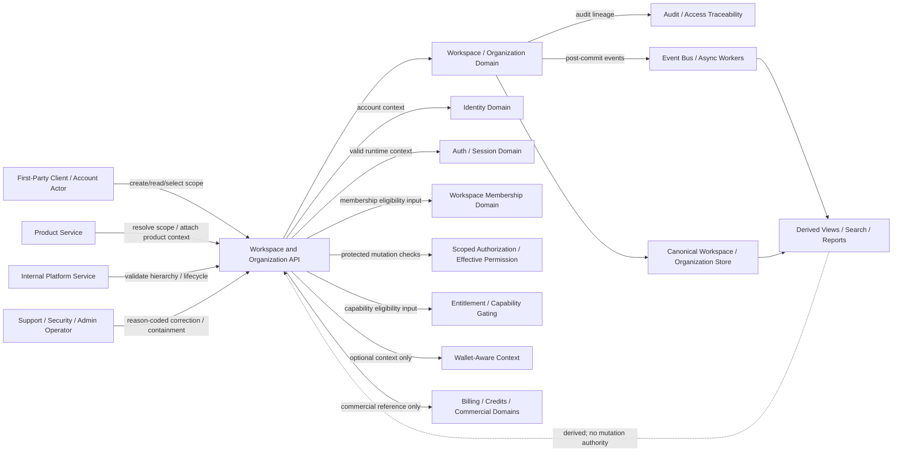
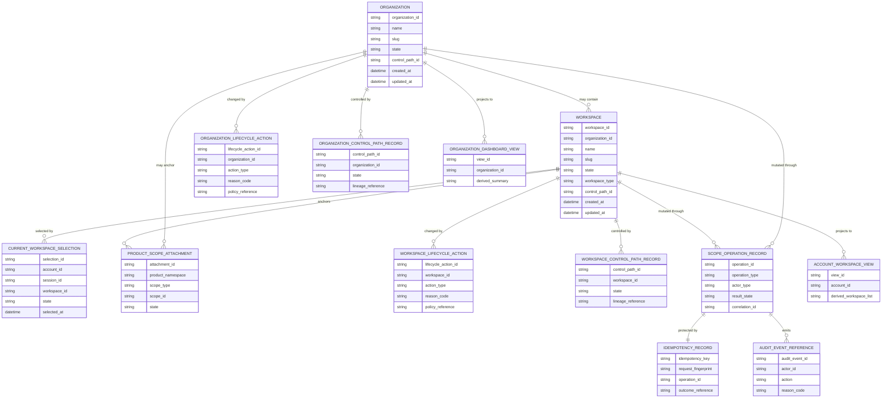
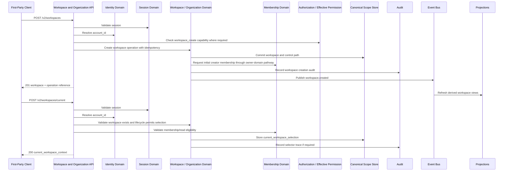

# WORKSPACE_AND_ORGANIZATION_API_SPEC.md

## Document Metadata

- **Document Name:** `WORKSPACE_AND_ORGANIZATION_API_SPEC.md`
- **Document Type:** FUZE API SPEC v2 / Production-grade interface-contract specification
- **Status:** Draft for production-grade API-spec review
- **Version:** 2.0.0
- **Effective Date:** 2026-04-24
- **Last Updated:** 2026-04-24
- **Reviewed On:** 2026-04-24
- **Document Owner:** FUZE Platform Workspace and Organization Domain
- **Approval Authority:** FUZE Platform Architecture and Governance Authority
- **Review Cadence:** Quarterly or upon material change to collaborative scope semantics, organization hierarchy, workspace lifecycle, ownership/control-path continuity, current-workspace selector behavior, product-attachment rules, scope-resolution ordering, audit traceability, privileged correction posture, entitlement attachment, or API exposure.
- **Governing Layer:** API SPEC v2 / Workspace, Organization, Authorization, and Access Control API family
- **Parent Registry:** `API_SPEC_INDEX.md`
- **Upstream Semantic Registry:** `REFINED_SYSTEM_SPEC_INDEX.md`
- **Upstream API Registry:** `API_SPEC_INDEX.md`
- **Primary Audience:** API designers, backend engineers, frontend/client engineers, product engineers, workspace service owners, authorization service owners, membership lifecycle owners, entitlement service owners, security engineers, support/control-plane engineers, audit/governance reviewers, OpenAPI/AsyncAPI/SDK authors, QA and contract-validation teams.
- **Primary Purpose:** Define the FUZE production API contract for workspace and organization scope, including workspace creation, organization creation, canonical scope reads, organization-to-workspace hierarchy, current-workspace runtime selector, lifecycle-state reads and controlled mutations, ownership/control-path correction, product attachment, internal scope resolution, admin/control-plane correction, event emission, idempotency, replay safety, audit traceability, derived read-model boundaries, migration, and downstream derivation guardrails.
- **Primary Upstream References:**
  - `REFINED_SYSTEM_SPEC_INDEX.md`
  - `DOCS_SPEC_INDEX.md`
  - `SYSTEM_SPEC_INDEX.md`
  - `API_SPEC_INDEX.md`
  - `SYSTEM_BOUNDARY_AND_OWNERSHIP_SPEC.md`
  - `SYSTEM_OVERVIEW_AND_BOUNDARIES_SPEC.md`
  - `PLATFORM_ARCHITECTURE_SPEC.md`
  - `DOMAIN_OWNERSHIP_MATRIX_SPEC.md`
  - `DATA_MODEL_AND_ENTITY_OWNERSHIP_SPEC.md`
  - `FUZE_ACCOUNT_ACCESS_AND_SESSION_THESIS_FINAL_SPEC.md`
  - `FUZE_ACCOUNT_ACCESS_AND_SESSION_CANONICAL_FINAL_SPEC.md`
  - `IDENTITY_AND_ACCOUNT_SPEC.md`
  - `AUTH_SESSION_AND_LINKED_LOGIN_SPEC.md`
  - `FUZE_SESSION_LIFECYCLE_AND_SECURITY_SPEC.md`
  - `FUZE_WORKSPACE_ACCESS_CONTROL_BASICS_THESIS_FINAL_SPEC.md`
  - `WORKSPACE_AND_ORGANIZATION_SPEC.md`
  - `WORKSPACE_MEMBERSHIP_LIFECYCLE_SPEC.md`
  - `ROLE_PERMISSION_AND_ACCESS_CONTROL_SPEC.md`
  - `SCOPED_AUTHORIZATION_MODEL_SPEC.md`
  - `ACCESS_EVALUATION_AND_EFFECTIVE_PERMISSION_SPEC.md`
  - `ADMIN_ACCESS_CORRECTION_AND_CONTAINMENT_SPEC.md`
  - `AUDIT_AND_ACCESS_TRACEABILITY_SPEC.md`
  - `ENTITLEMENT_AND_CAPABILITY_GATING_SPEC.md`
  - `WALLET_AWARE_USER_SPEC.md`
  - `SECURITY_AND_RISK_CONTROL_SPEC.md`
  - `WORKSPACE_ORGANIZATION_API_SPEC.md`
  - `ROLE_PERMISSION_ACCESS_API_SPEC.md`
- **Primary Downstream Dependents:**
  - OpenAPI contracts for workspace and organization APIs
  - AsyncAPI contracts for workspace and organization lifecycle events
  - first-party workspace switcher and organization administration clients
  - product integration contracts consuming canonical collaborative scope
  - internal service scope-resolution adapters
  - membership lifecycle APIs
  - role/permission/scoped authorization APIs
  - effective-permission APIs
  - entitlement/capability gating APIs
  - support/admin correction tooling
  - audit and access traceability pipelines
  - derived read models, search projections, analytics, and reporting surfaces
  - migration adapters from `WORKSPACE_ORGANIZATION_API_SPEC.md`
  - SDK workspace context helpers
  - QA, contract validation, and regression suites
- **API Surface Families Covered:** first-party application APIs, internal service APIs, admin/control-plane APIs, event/async APIs, derived read/reporting APIs, limited public/read-safe APIs where explicitly approved.
- **API Surface Families Excluded:** canonical identity/auth/session APIs, provider-resolution APIs, membership lifecycle details in full depth, role/permission catalogs, final effective-permission evaluation, entitlement formulas, billing/credits/invoice truth, wallet-link lifecycle, chain/on-chain organization semantics, product-local object models, public-trust reporting copy.
- **Canonical System Owner(s):** Workspace and Organization Domain for collaborative scope truth; adjacent ownership held by Identity, Auth/Session, Membership Lifecycle, Role/Permission, Scoped Authorization, Effective Permission, Entitlement, Audit, Admin Correction, Security/Risk, and Wallet-Aware domains.
- **Canonical API Owner:** FUZE Platform API Architecture / Workspace and Organization API owner
- **Supersedes:** Workspace/organization/collaborative-scope portions of `WORKSPACE_ORGANIZATION_API_SPEC.md` where this API v2 document is narrower, stricter, or more explicit; does not supersede membership lifecycle or role-permission API domains except where v1 conflated them with collaborative scope.
- **Superseded By:** Not yet known
- **Related Decision Records:** Not explicitly available in retrieved governing materials
- **Canonical Status Note:** This API spec derives from `WORKSPACE_AND_ORGANIZATION_SPEC.md` and the workspace access-control thesis. It owns interface-contract expression only. It MUST NOT redefine canonical account identity, runtime session truth, membership truth, role/permission truth, effective-permission truth, entitlement truth, wallet-aware truth, product-local truth, audit truth, or reporting truth.
- **Implementation Status:** Normative API contract baseline; downstream OpenAPI, AsyncAPI, SDK, service, storage, event, support-tool, audit, and migration contracts must conform.
- **Approval Status:** Drafted for API SPEC v2 inclusion; formal approval record not yet attached.
- **Change Summary:** Created a production-grade API v2 contract for workspace and organization collaborative scope; split canonical scope APIs from deeper membership and role/permission APIs; hardened current-workspace selector semantics, hierarchy rules, lifecycle-state handling, product attachment, ownership/control-path continuity, correction lineage, idempotency, audit, event, projection, migration, and forbidden-pattern rules.

---

## Purpose

This document defines the FUZE API contract for **workspace and organization** behavior.

The API layer governed here expresses refined workspace and organization semantics as implementation-ready interface contracts. It defines how FUZE clients and services create, read, resolve, select, attach to, restrict, archive, restore, correct, and consume canonical collaborative scope without confusing that scope with account identity, session runtime state, membership, authorization, entitlement, wallet context, product-local state, support tooling, or reporting.

Workspace and organization APIs are the platform boundary for answering **where** an authenticated actor is operating. They do not answer final **who**, **what permission**, **what entitlement**, **what product object**, or **what commercial truth** questions. They provide canonical collaborative scope to downstream layers.

---

## Scope

This specification governs API contracts for:

1. canonical workspace creation and reads;
2. canonical organization creation and reads where organization is explicitly modeled;
3. organization-to-workspace hierarchy reads and controlled attachment/detachment;
4. current-workspace runtime selector reads and updates;
5. workspace and organization lifecycle state reads and controlled mutations;
6. workspace and organization metadata changes;
7. ownership/control-path reads and correction entry points;
8. scope resolution for first-party and internal consumers;
9. safe product attachment to canonical workspace or organization scope;
10. admin/control-plane correction and containment of workspace/organization truth;
11. canonical workspace/organization events;
12. derived read-model and reporting boundaries;
13. request, response, error, status, idempotency, retry, replay, audit, observability, versioning, migration, OpenAPI, AsyncAPI, and SDK derivation rules.

---

## Out of Scope

This API spec does not govern:

- canonical account identity creation, linking, recovery, or deletion;
- authentication, session issuance, refresh, logout, or session invalidation;
- workspace invitation and membership lifecycle in full depth;
- role, permission, scoped grant, and final effective-permission evaluation in full depth;
- entitlement formulas, billing truth, credit ledger truth, invoice truth, or subscription truth;
- wallet-link lifecycle, wallet custody, token-holder semantics, on-chain organization structures, or governance keys;
- product-local object lifecycle, product-local project/team constructs, or product-specific permissions except where they consume canonical scope;
- exact database schema, UI screens, support queue topology, or public reporting copy.

---

## Design Goals

1. Make workspace the canonical collaborative operating scope in FUZE APIs.
2. Support organization as a broader umbrella without collapsing it into workspace, identity, authorization, entitlement, or billing truth.
3. Ensure current-workspace selection remains runtime context only.
4. Ensure scope resolution happens after valid identity/session and before membership, scoped authorization, effective permission, and entitlement evaluation.
5. Keep product-local collaboration models subordinate to canonical platform scope.
6. Support lifecycle restriction, suspension, archival, closure, and restoration in ways that downstream systems cannot ignore.
7. Preserve ownership/control-path continuity and prevent ordinary self-service from stranding a workspace or organization.
8. Make sensitive scope mutations idempotent, auditable, replay-safe, and reason-coded where required.
9. Preserve derived read-model and reporting safety.
10. Provide enough contract clarity for OpenAPI, AsyncAPI, SDKs, QA, support tooling, observability, and migration from v1 workspace-organization APIs.

---

## Non-Goals

This API spec is not intended to:

- make workspace membership final permission;
- make workspace selection a grant;
- make organization a universal permission scope;
- make entitlement or billing posture a source of workspace truth;
- make wallet linkage a source of workspace ownership or admin authority;
- allow products to invent hidden canonical teams;
- allow admin/support dashboards to become alternate workspace owners;
- replace downstream membership, authorization, entitlement, billing, or product-object implementation contracts.

---

## Core Principles

### Collaborative Scope Principle

Workspace is FUZE’s primary canonical collaborative operating scope. Shared settings, shared resources, shared product activity, and downstream authority evaluation attach to workspace context unless an adjacent spec explicitly defines a narrower or broader scope.

### Organization Umbrella Principle

Organization is a broader grouping structure where explicitly modeled. Organization may contain one or more workspaces and may support broader administration or reporting, but it MUST NOT erase workspace as the primary actionable collaborative scope by default.

### Identity / Scope / Authority Separation Principle

Identity tells FUZE who the actor is. Workspace and organization tell FUZE where the actor is acting. Membership and authorization determine whether the actor is structurally attached and what authority may be considered. Effective permission determines the exact action outcome. Entitlement determines capability eligibility.

### Scope-After-Auth Principle

Workspace and organization APIs that resolve ordinary user scope require valid canonical account identity and authenticated session state. Scope resolution MUST precede scoped authorization and effective-permission evaluation.

### Runtime Selector Is Not Durable Truth Principle

Current workspace is a runtime context selector. It MAY guide routing and UX continuity. It MUST NOT create membership, ownership, authority, entitlement, billing control, or product capability.

### Product-Consumption Principle

Products may define subordinate product-local objects and sub-scopes under valid canonical workspace or organization context. Products MUST NOT replace canonical workspace or organization truth with product-local “team,” “space,” “project,” or “group” systems for shared platform behavior.

### Ownership Continuity Principle

Workspace and organization control paths MUST preserve legitimate controlling authority. Sensitive ownership/control changes MUST use bounded review/correction workflows when ordinary mutation could strand, escalate, or corrupt scope truth.

### Restriction Precedence Principle

Workspace or organization restriction, suspension, review posture, containment, archival, or closure MUST outrank stale membership views, stale grants, stale product caches, and current-workspace UI assumptions.

### Derived View Boundary Principle

Workspace dashboards, support views, account workspace lists, search projections, analytics, and reporting surfaces are derived. They are correctable from canonical workspace/organization records and MUST NOT mutate canonical scope truth.

---

## Canonical Definitions

- **Workspace:** Primary durable collaborative scope in FUZE; a platform object representing shared member context, shared settings, shared resources, product participation context, lifecycle posture, and the operating context an action belongs to.
- **Organization:** Broader grouping structure that may contain one or more workspaces and may carry higher-level administration, reporting, or commercial structure where explicitly modeled.
- **Collaborative Scope:** Canonical account, workspace, organization, product, or narrower object context used to determine where an action occurs; this spec owns workspace and organization collaborative scope.
- **Workspace Ownership / Control Path:** Durable relationship or bounded control route preserving legitimate administration of a workspace.
- **Organization Ownership / Control Path:** Broader control relationship for organization-level administration where organization exists distinctly.
- **Current Workspace Selector:** Runtime context chosen by actor/system to route actions and UX. It is not durable workspace truth, membership truth, permission truth, or entitlement truth.
- **Scope Resolution:** API process that resolves canonical workspace/organization identifiers and lifecycle posture from authenticated actor context and explicit request inputs.
- **Product Attachment:** Explicit API relationship by which a product or product-local resource family declares operation under a valid canonical account/workspace/organization scope without becoming the owner of that scope.
- **Lifecycle State:** Durable workspace or organization state, such as `pending_setup`, `active`, `restricted`, `suspended`, `archived`, or `closed`.
- **Scope Correction:** Bounded, reason-coded, auditable remediation path for correcting erroneous or unsafe workspace/organization truth without hidden destructive edits.
- **Derived Scope View:** Regenerable summary, search projection, dashboard, or product-facing cache derived from canonical workspace/organization state.

---

## Truth Class Taxonomy

This API spec preserves the following truth classes:

1. **Semantic Truth:** Defined by upstream refined system specs.
2. **API Contract Truth:** Defined here for request/response/error/status/event/idempotency behavior.
3. **Canonical Identity Truth:** `account_id`, account state, and identity continuity owned by Identity and Account Domain.
4. **Runtime Session Truth:** Temporary authenticated runtime state owned by Auth / Session Domain.
5. **Collaborative Scope Truth:** Canonical workspace and organization records, hierarchy, ownership/control path, lifecycle state, scope-resolution outputs, product-attachment posture, and current-workspace selector semantics owned by Workspace and Organization Domain.
6. **Membership Truth:** Durable account-to-workspace relationship owned by Workspace Membership Lifecycle Domain.
7. **Scoped Authorization Truth:** Role, permission, and grant bindings to explicit scope owned by authorization domains.
8. **Effective-Permission Truth:** Final evaluated allow/deny/restricted/review-required action outcome owned by effective-permission domain.
9. **Entitlement Truth:** Commercial or policy eligibility for product/capability classes owned by entitlement domain.
10. **Wallet-Aware Context Truth:** Wallet-link and wallet-derived participation context owned by wallet-aware domain; may enrich products but does not define workspace truth.
11. **Policy / Restriction Truth:** Security, lifecycle, risk, review, containment, governance, and higher-order controls that constrain scope use.
12. **Audit / Traceability Truth:** Durable actor, scope, target, operation, reason, policy, correlation, trace, and event lineage.
13. **Derived Read-Model Truth:** Account workspace lists, support views, dashboards, search indexes, analytics, and product caches.
14. **Reporting / Public View Truth:** Public, partner, or user-facing summaries that remain downstream presentations.

---

## Architectural Position in the Spec Hierarchy

This API spec sits below:

- `REFINED_SYSTEM_SPEC_INDEX.md`
- `SYSTEM_BOUNDARY_AND_OWNERSHIP_SPEC.md`
- `SYSTEM_OVERVIEW_AND_BOUNDARIES_SPEC.md`
- `PLATFORM_ARCHITECTURE_SPEC.md`
- `DOMAIN_OWNERSHIP_MATRIX_SPEC.md`
- `DATA_MODEL_AND_ENTITY_OWNERSHIP_SPEC.md`
- `FUZE_ACCOUNT_ACCESS_AND_SESSION_CANONICAL_FINAL_SPEC.md`
- `FUZE_WORKSPACE_ACCESS_CONTROL_BASICS_THESIS_FINAL_SPEC.md`
- `WORKSPACE_AND_ORGANIZATION_SPEC.md`

It sits beside and upstream of downstream API/implementation layers for:

- workspace membership lifecycle;
- role/permission/access control;
- scoped authorization;
- effective permission;
- entitlement and capability gating;
- admin correction and containment;
- audit and access traceability;
- product integration contracts;
- read-model and reporting contracts.

---

## Upstream Semantic Owners

### `WORKSPACE_AND_ORGANIZATION_SPEC.md`

Primary semantic owner for workspace and organization meaning, collaborative scope truth, organization/workspace hierarchy, current-workspace selector semantics, product attachment, lifecycle state, ownership/control-path continuity, correction boundaries, and anti-shadow-scope posture.

### `FUZE_WORKSPACE_ACCESS_CONTROL_BASICS_THESIS_FINAL_SPEC.md`

Interpretive governing source for the post-auth sequence: identity, session, workspace scope, membership, authorization, effective permission, entitlement, and product policy. This source supplies the architectural anti-drift foundation.

### `WORKSPACE_MEMBERSHIP_LIFECYCLE_SPEC.md`

Owns invitation and membership lifecycle semantics. This API consumes membership state for workspace lists and safe scope selection, but does not redefine membership mutation truth.

### `SCOPED_AUTHORIZATION_MODEL_SPEC.md`

Owns scope binding for roles, grants, and authorization structures. This API provides canonical workspace/organization scopes consumed by scoped authorization.

### `ACCESS_EVALUATION_AND_EFFECTIVE_PERMISSION_SPEC.md`

Owns final action-level access evaluation. This API supplies resolved scope and lifecycle posture; it does not return final authority unless explicitly delegating to that owner.

### `ENTITLEMENT_AND_CAPABILITY_GATING_SPEC.md`

Owns capability eligibility. This API may expose entitlement attachment references or capability-context hints, but entitlement does not redefine scope.

### `AUDIT_AND_ACCESS_TRACEABILITY_SPEC.md`

Owns traceability semantics and reconstruction requirements for access-domain actions.

### `ADMIN_ACCESS_CORRECTION_AND_CONTAINMENT_SPEC.md`

Owns cross-domain privileged correction and containment posture. This API exposes workspace/organization correction entry points without letting admin tooling become canonical owner.

---

## API Surface Families

### First-Party Application APIs

Used by FUZE web/mobile/application clients for workspace creation, workspace/organization reads, workspace switching, safe hierarchy reads, and user-visible scope summaries.

### Internal Service APIs

Used by products and platform services for canonical scope resolution, hierarchy validation, lifecycle-state checks, and product attachment validation.

### Admin / Control-Plane APIs

Used by authorized operators for workspace/organization correction, lifecycle containment, ownership/control-path repair, and exceptional hierarchy fixes. These routes are separated, reason-coded, policy-constrained, and audited.

### Event / Async APIs

Used for post-commit workspace/organization lifecycle events, hierarchy events, selector-context events where needed, and projection invalidation. Events are notifications, not mutation owners.

### Reporting / Projection APIs

Used for derived account workspace views, support views, analytics, dashboards, and reporting. Derived APIs are read-only with explicit staleness/derivation indicators.

### Public APIs

No broad unauthenticated public workspace mutation API is defined. Any future public exposure must be read-safe, narrow, privacy-preserving, and governed by a separate public API contract.

---

## System / API Boundaries

This API spec governs canonical workspace and organization scope APIs.

It does not govern:

- account identity;
- authentication/session issuance;
- provider resolution;
- full membership lifecycle;
- role/permission catalogs;
- effective access evaluation;
- entitlement/capability policy;
- billing/credits/payment truth;
- wallet/chain truth;
- product-local object models.

Downstream APIs MAY consume workspace/organization identifiers, hierarchy, lifecycle state, and selector context. They MUST NOT reinterpret them.

---

## Adjacent API Boundaries

- `IDENTITY_AND_ACCOUNT_API_SPEC.md` owns canonical actor APIs.
- `AUTH_SESSION_AND_LINKED_LOGIN_API_SPEC.md` and `SESSION_LIFECYCLE_AND_SECURITY_API_SPEC.md` own authentication/session APIs.
- `WORKSPACE_MEMBERSHIP_LIFECYCLE_API_SPEC.md` owns invitation and account-to-workspace membership lifecycle APIs.
- `ROLE_PERMISSION_AND_ACCESS_CONTROL_API_SPEC.md` owns role/permission assignment and grant APIs.
- `SCOPED_AUTHORIZATION_MODEL_API_SPEC.md` owns scope-bound authorization APIs.
- `ACCESS_EVALUATION_AND_EFFECTIVE_PERMISSION_API_SPEC.md` owns final action evaluation APIs.
- `AUDIT_AND_ACCESS_TRACEABILITY_API_SPEC.md` owns access traceability APIs.
- `ENTITLEMENT_AND_CAPABILITY_GATING_API_SPEC.md` owns capability eligibility APIs.
- `ADMIN_ACCESS_CORRECTION_AND_CONTAINMENT_API_SPEC.md` owns cross-domain admin correction patterns.

---

## Conflict Resolution Rules

When interpretation conflicts arise:

1. Active refined system specs win on semantic truth.
2. `WORKSPACE_AND_ORGANIZATION_SPEC.md` wins on collaborative scope meaning.
3. `FUZE_WORKSPACE_ACCESS_CONTROL_BASICS_THESIS_FINAL_SPEC.md` wins on layered separation narrative and post-auth ordering where specific specs do not contradict it.
4. `WORKSPACE_MEMBERSHIP_LIFECYCLE_SPEC.md` wins on membership lifecycle.
5. `SCOPED_AUTHORIZATION_MODEL_SPEC.md` wins on scoped grant structure.
6. `ACCESS_EVALUATION_AND_EFFECTIVE_PERMISSION_SPEC.md` wins on final access decisions.
7. `ENTITLEMENT_AND_CAPABILITY_GATING_SPEC.md` wins on capability eligibility.
8. `AUDIT_AND_ACCESS_TRACEABILITY_SPEC.md` wins on traceability semantics.
9. This API spec wins only on interface-contract expression that does not contradict refined semantic owners.
10. Older v1 `WORKSPACE_ORGANIZATION_API_SPEC.md` may inform historical route families, but MUST NOT override refined v2 semantics.

Specific API conflict rules:

- current workspace selection MUST NOT override canonical membership or workspace lifecycle state;
- product-local team/space/project records MUST NOT override canonical workspace or organization existence;
- wallet presence MUST NOT override workspace ownership, membership, or authorization truth;
- entitlement presence MUST NOT redefine workspace ownership or membership;
- support dashboards MUST NOT override canonical workspace records;
- reporting exports MUST NOT repair canonical workspace or organization truth;
- archived/closed/restricted workspace posture outranks stale product caches;
- ambiguous organization/workspace hierarchy MUST fail closed or route to review.

---

## Default Decision Rules

1. Default actor anchor is `account_id`.
2. Default primary collaborative scope is `workspace_id`.
3. Default broader umbrella scope is `organization_id` only where explicitly modeled.
4. Default current workspace interpretation is runtime selector, not membership or authority.
5. Default workspace/member list interpretation is derived unless returned from canonical owner-domain read.
6. Default product context interpretation is subordinate to canonical workspace or organization truth.
7. Default entitlement interpretation is eligibility input, not scope owner.
8. Default wallet-aware interpretation is attached context, not scope authority.
9. Default ambiguity outcome is deny, fail closed, or route to review.
10. Default sensitive mutation posture is idempotent, replay-safe, audit-linked, and correlation-linked.

---

## Roles / Actors / API Consumers

- **Canonical Account Actor:** Authenticated FUZE account operating in workspace or organization context.
- **Workspace Creator:** Authenticated actor initiating workspace creation under policy.
- **Organization Creator / Administrator:** Authenticated or privileged actor initiating organization creation or administration under policy.
- **Workspace Owner / Controlling Authority:** Ordinary or policy-defined control path preserving legitimate workspace administration.
- **Organization Owner / Controlling Authority:** Broader control path over organization administration where modeled.
- **First-Party Client:** FUZE web/mobile/app client consuming scope and selector APIs.
- **Product Service:** Internal or first-party service resolving canonical scope for product behavior.
- **Membership Service:** Adjacent owner for account-to-workspace relationships.
- **Authorization Service:** Adjacent owner for role, grant, and permission relationships.
- **Entitlement Service:** Adjacent owner for capability eligibility.
- **Support / Security / Admin Operator:** Privileged actor correcting or containing workspace/organization truth.
- **Audit / Traceability Service:** Durable lineage owner.
- **Projection / Reporting Consumer:** Consumer of derived scope views.

---

## Resource / Entity Families

### API-Facing Resources

- `workspace`
- `organization`
- `workspace_summary`
- `organization_summary`
- `workspace_hierarchy`
- `organization_workspace_attachment`
- `current_workspace_context`
- `scope_resolution_result`
- `workspace_lifecycle_action`
- `organization_lifecycle_action`
- `workspace_control_path`
- `organization_control_path`
- `workspace_product_attachment`
- `scope_correction_action`
- `workspace_operation`
- `workspace_audit_reference`

### Canonical Owner-Domain Entities

- `workspace`
- `organization`
- `organization_workspace_link`
- `workspace_lifecycle_record`
- `organization_lifecycle_record`
- `workspace_control_path_record`
- `organization_control_path_record`
- `current_workspace_selection`
- `product_scope_attachment`
- `scope_operation_record`
- `idempotency_record`
- `audit_event_reference`

### Referenced but Non-Owned Entities

- `account`
- `auth_session`
- `workspace_membership`
- `role_assignment`
- `scoped_grant`
- `effective_permission_result`
- `entitlement`
- `wallet_link`
- `billing_owner_reference`
- `product_resource`
- `security_risk_signal`

### Derived Entities

- `account_workspace_view`
- `workspace_scope_summary`
- `organization_dashboard_view`
- `current_scope_context_view`
- `support_workspace_summary`
- `workspace_search_projection`
- `workspace_reporting_export`

Derived entities MUST be regenerable from canonical records and MUST NOT write canonical scope truth.

---

## Ownership Model

### Workspace and Organization Domain Owns

- canonical workspace records;
- canonical organization records;
- organization-to-workspace hierarchy;
- workspace lifecycle state;
- organization lifecycle state;
- durable ownership/control-path semantics;
- current-workspace selector semantics;
- product attachment to canonical scope;
- workspace/organization operation records;
- canonical workspace/organization event publication;
- correction lineage in coordination with admin and audit domains.

### Workspace and Organization Domain May

- expose canonical reads for scope resolution;
- validate hierarchy membership;
- expose safe summaries;
- coordinate with membership, authorization, entitlement, product, audit, and admin domains;
- receive correction requests from admin/control-plane routes;
- deny ambiguous or unsafe scope resolution.

### Workspace and Organization Domain MUST NOT

- redefine canonical account identity;
- redefine runtime session truth;
- redefine membership lifecycle in full depth;
- redefine role/permission catalogs;
- decide final effective permissions;
- own entitlement truth;
- own billing/credits truth;
- own wallet truth;
- let products create incompatible shared scope models.

### Product Domains May

- create product-local resources beneath canonical account/workspace/organization scope;
- store local UX state for selected context;
- consume canonical scope resolution;
- react to workspace/organization events.

### Product Domains MUST NOT

- replace canonical workspace existence with product-local team models;
- create platform-wide authority from product-local roles;
- rely on UI tab/current selector as proof of membership;
- continue ordinary use of restricted/archived/closed workspace through stale cache;
- treat product attachment as ownership of collaborative scope.

---

## Authority / Decision Model

The workspace/organization API decision model is layered.

### Upstream Layers Provide

- canonical `account_id`;
- valid session/runtime authentication state where ordinary interactive API is used;
- explicit requested `workspace_id`, `organization_id`, or product namespace;
- product object-owner hints where relevant;
- policy/risk/containment signals where relevant.

### Workspace and Organization Domain Decides

- whether workspace/organization exists;
- whether hierarchy is valid;
- whether lifecycle state permits requested use;
- whether current-workspace selector may be set or read;
- whether product attachment is allowed;
- whether ownership/control-path action is allowed to proceed or requires review;
- whether scope correction is ordinary, privileged, review-required, or denied.

### Membership and Authorization Domains Decide

- whether actor is structurally attached to scope;
- what roles, permissions, scoped grants, or effective-permission outcomes apply;
- whether membership/authorization allows a workspace/organization mutation.

### Entitlement Domain Decides

- whether capability is commercially or policy eligible in scope.

### Security / Admin Correction Domains May Override

- lifecycle restriction;
- containment;
- review posture;
- correction workflows;
- privileged remediation.

This ordering is mandatory.

---

## Authentication Model

### First-Party User APIs

Require a valid authenticated session and canonical account context. Scope reads may be limited to workspaces/organizations the actor is allowed to see.

### Internal Service APIs

Require service-to-service authentication, explicit service identity, least-privilege scope, correlation ID, and request lineage.

### Admin / Control-Plane APIs

Require privileged operator identity, appropriate privileged session/control posture, operator authorization, reason code, policy reference, idempotency key for side effects, and audit context.

### Public APIs

Unauthenticated public workspace/organization APIs are not generally defined. If future public reads exist, they must be read-safe, privacy-safe, rate-limited, and explicitly governed.

---

## Authorization / Scope / Permission Model

Workspace/organization APIs MUST distinguish:

- authenticated account reading own accessible scopes;
- workspace creator;
- organization creator;
- workspace/organization administrator;
- product service resolving scope;
- internal service validating hierarchy;
- support/security/admin operator;
- reporting/projection consumer.

The API MUST NOT rely on valid session alone for protected scope mutations. Protected mutations MUST be checked through membership, scoped authorization, effective permission, restriction posture, and entitlement/policy as applicable.

---

## Entitlement / Capability-Gating Model

Entitlements may attach to workspace or organization but do not define workspace or organization truth.

Workspace/organization APIs MAY expose entitlement attachment references, capability-context hints, or `requires_entitlement_evaluation`. They MUST NOT return final product capability allow/deny unless the entitlement owner explicitly participates and the response clearly labels that result as downstream evaluation.

---

## API State Model

### Workspace States

- `pending_setup`
- `active`
- `restricted`
- `suspended`
- `archived`
- `closed`

### Organization States

- `pending_setup`
- `active`
- `restricted`
- `suspended`
- `archived`
- `closed`

### Current Workspace Selector States

- `unset`
- `selected`
- `invalid_due_to_membership`
- `invalid_due_to_scope_state`
- `requires_selection`
- `requires_review`

### Operation States

- `accepted`
- `completed`
- `partially_completed`
- `denied`
- `failed`
- `cancelled`
- `requires_review`
- `superseded`

### State Rules

- Current-workspace selector state is not workspace lifecycle state.
- Restricted, suspended, archived, and closed states outrank stale views.
- Parent/child hierarchy changes MUST preserve lineage.
- Control-path changes MUST preserve reconstructable authority lineage.
- Terminal or restrictive lifecycle states MUST propagate to downstream caches/events.
- Derived views MUST NOT override canonical state.

---

## Lifecycle / Workflow Model

### Workspace Creation

1. Authenticated caller submits workspace creation request.
2. API validates identity, session, policy, idempotency, and creation authority.
3. Workspace record is created in `pending_setup` or `active` according to provisioning posture.
4. Initial control path is established.
5. Creator membership may be created only through the membership owner-domain pathway.
6. Audit and events are emitted after commit.
7. Response returns workspace, operation, and downstream dependency references.

### Organization Creation

1. Caller submits organization creation request.
2. API validates eligibility, policy, authority, idempotency, and control path.
3. Organization record is created.
4. Initial control path is established.
5. Audit and event records are emitted.
6. Response returns organization summary and operation reference.

### Scope Resolution

1. Caller supplies explicit scope ID or product object hint.
2. API validates canonical workspace/organization existence and hierarchy.
3. API evaluates lifecycle posture.
4. API returns resolved scope facts, ambiguity indicators, and required downstream evaluation flags.
5. API does not return final permission or entitlement unless delegated to the owning domains.

### Current Workspace Selection

1. Caller selects a workspace.
2. API validates session, account, workspace existence, lifecycle posture, and membership/read eligibility through adjacent domains where needed.
3. API stores or updates runtime selector state.
4. API returns selector result.
5. No membership, permission, ownership, entitlement, or product capability is created as a side effect.

### Product Attachment

1. Product service requests attachment of product namespace/resource family to scope.
2. API validates canonical scope and lifecycle posture.
3. API records product attachment reference where allowed.
4. Product remains subordinate to canonical scope.
5. Events/projections are emitted where required.

### Lifecycle Change

1. Authorized caller requests restriction, suspension, archival, closure, or restoration.
2. API validates authority, policy, risk, idempotency, and control-path safety.
3. API records lifecycle action and transitions state.
4. Downstream invalidation and events are emitted.
5. Derived views update asynchronously.

### Control-Path Correction

1. Ordinary mutation or admin route identifies ownership/control-path risk.
2. API blocks unsafe ordinary self-service.
3. Case routes to review/correction where required.
4. Privileged action executes only with reason, policy, idempotency, and audit.
5. Correction preserves lineage and emits events.

---

## Architecture Diagram — Mermaid flowchart

---

## Data Design — Mermaid Diagram

---

## Flow View

### Primary Flow — Workspace Creation

1. Client submits workspace creation request with idempotency key.
2. API authenticates session and resolves canonical account.
3. API checks creation policy and required entitlement/policy preconditions where applicable.
4. Workspace and Organization Domain creates workspace with lifecycle state and control-path record.
5. Membership lifecycle owner creates initial creator relationship only through its own pathway.
6. Audit record and post-commit events are emitted.
7. Response returns workspace resource, operation reference, and required downstream evaluation flags.

### Primary Flow — Scope Resolution

1. Product or client supplies `workspace_id`, `organization_id`, or product object hint.
2. API validates canonical scope existence.
3. API validates hierarchy if both organization and workspace are present.
4. API checks lifecycle state and restriction posture.
5. API returns resolved canonical scope facts and ambiguity/restriction indicators.
6. Membership, authorization, effective permission, and entitlement evaluation remain downstream.

### Current Workspace Selector Flow

1. User requests switch to a workspace.
2. API validates current session and workspace existence.
3. API checks membership eligibility or read eligibility through adjacent domains.
4. API updates runtime selector state.
5. API returns selected context.
6. No membership, role, permission, entitlement, ownership, or billing control is created.

### Lifecycle Change Flow

1. Authorized caller requests restrict/suspend/archive/close/restore.
2. API checks effective permission, policy, risk, owner continuity, and idempotency.
3. API transitions lifecycle state or returns review-required.
4. Audit and events are emitted.
5. Derived views and product caches invalidate after event consumption.

### Admin Correction Flow

1. Operator submits correction request with reason, policy reference, idempotency key, and target scope.
2. API verifies privileged authority.
3. API rejects ordinary routes for privileged correction.
4. Workspace/Organization Domain applies bounded correction if allowed.
5. Audit and correction lineage are committed.
6. Events/projections update downstream.

### Degraded / Failure Flow

1. Derived view is stale/unavailable.
2. API reads canonical store for authoritative scope decisions.
3. Required owner-domain dependency unavailable for high-impact mutation.
4. API fails closed or returns accepted/retry status according to policy.
5. API never substitutes product cache, dashboard, current selector, or report as truth.

---

## Data Flows — Mermaid sequenceDiagram

---

## Request Model

Side-effecting requests MUST include or derive:

- caller identity or service identity;
- target workspace, organization, or hierarchy reference;
- operation family;
- idempotency key for creation, lifecycle mutation, hierarchy mutation, product attachment, current-workspace update, and correction;
- correlation ID or trace ID;
- policy reference where required;
- reason code for lifecycle restriction, suspension, closure, restoration, correction, or admin action;
- operator note where required;
- requested state transition;
- explicit product namespace for product attachment;
- scope input; never implicit UI-only scope.

Requests MUST NOT include:

- frontend-declared membership truth as authority;
- current workspace selector as proof of authority;
- product-local team/project as canonical workspace;
- entitlement as workspace ownership;
- wallet proof as workspace authority;
- direct storage mutation intent;
- broad admin override without reason, policy, idempotency, and audit envelope.

---

## Response Model

### Success / Progress Response Classes

- `workspace.created`
- `workspace.read`
- `workspace.list`
- `workspace.updated`
- `workspace.lifecycle_changed`
- `workspace.archived`
- `workspace.closed`
- `workspace.restored`
- `organization.created`
- `organization.read`
- `organization.updated`
- `organization.lifecycle_changed`
- `organization_workspace_attached`
- `organization_workspace_detached`
- `current_workspace_context.updated`
- `scope_resolution.resolved`
- `scope_resolution.requires_review`
- `scope_operation.accepted`
- `scope_operation.completed`
- `scope_operation.partial`

### Required Fields Where Applicable

- `workspace_id`;
- `organization_id`;
- `scope_type`;
- `state`;
- `lifecycle_state`;
- `hierarchy_reference`;
- `current_workspace_context`;
- `control_path_reference`;
- `operation_id`;
- `correlation_id`;
- `audit_reference` for sensitive mutations;
- `policy_reference` where relevant;
- `reason_code` for restricted/admin operations;
- `derived` indicator for non-canonical views;
- `requires_membership_evaluation`;
- `requires_authorization_evaluation`;
- `requires_entitlement_evaluation`;
- `projection_freshness` for derived responses.

### Redaction / Privacy Constraints

Responses MUST NOT expose unrelated account membership details, raw internal risk scores, hidden support notes, private billing internals, wallet-sensitive material, or product-local data outside authorized scope.

---

## Error / Result / Status Model

### HTTP Classes

- `200 OK` for successful reads and completed updates.
- `201 Created` for successful workspace/organization creation.
- `202 Accepted` for async provisioning, lifecycle, correction, or review actions.
- `400 Bad Request` for malformed input.
- `401 Unauthorized` for missing/invalid session where required.
- `403 Forbidden` for authenticated caller lacking authority.
- `404 Not Found` where resource is unavailable or existence should be concealed.
- `409 Conflict` for state conflict, hierarchy conflict, selector conflict, idempotency conflict, or lifecycle conflict.
- `423 Locked` or equivalent problem code for restricted/suspended/review-required posture where FUZE maps it that way.
- `429 Too Many Requests` for rate-limit/abuse control.
- `500/503` for server/dependency failure, with fail-closed posture for high-impact operations.

### Stable Error Codes

- `WORKSPACE_NOT_FOUND`
- `ORGANIZATION_NOT_FOUND`
- `WORKSPACE_RESTRICTED`
- `WORKSPACE_SUSPENDED`
- `WORKSPACE_ARCHIVED`
- `WORKSPACE_CLOSED`
- `ORGANIZATION_RESTRICTED`
- `ORGANIZATION_SUSPENDED`
- `ORGANIZATION_ARCHIVED`
- `ORGANIZATION_CLOSED`
- `SCOPE_MISMATCH`
- `SCOPE_AMBIGUOUS`
- `SCOPE_REQUIRES_REVIEW`
- `CURRENT_WORKSPACE_INVALID`
- `CURRENT_WORKSPACE_NOT_MEMBERSHIP`
- `CURRENT_WORKSPACE_SELECTION_FORBIDDEN`
- `ORGANIZATION_WORKSPACE_HIERARCHY_INVALID`
- `PRODUCT_ATTACHMENT_SCOPE_INVALID`
- `PRODUCT_SHADOW_SCOPE_FORBIDDEN`
- `OWNER_CONTINUITY_RISK`
- `CONTROL_PATH_REQUIRES_REVIEW`
- `LIFECYCLE_TRANSITION_FORBIDDEN`
- `REASON_CODE_REQUIRED`
- `POLICY_REFERENCE_REQUIRED`
- `OPERATOR_PERMISSION_DENIED`
- `IDEMPOTENCY_KEY_REQUIRED`
- `IDEMPOTENCY_CONFLICT`
- `DERIVED_VIEW_UNAVAILABLE`
- `OWNER_DOMAIN_UNAVAILABLE_FAIL_CLOSED`

### Result Semantics

Accepted-state responses mean a request was accepted or routed for async processing. They do not imply final lifecycle, hierarchy, product-attachment, or correction outcome until operation state is `completed`.

---

## Idempotency / Retry / Replay Model

Idempotency is mandatory for:

- workspace creation;
- organization creation;
- workspace metadata mutation;
- organization metadata mutation;
- hierarchy attachment/detachment;
- current-workspace selector update;
- product attachment/detachment;
- lifecycle restriction/suspension/archive/close/restore;
- ownership/control-path change;
- scope correction;
- admin/control-plane mutations.

Rules:

1. Idempotency keys MUST be scoped to caller/service, operation family, target scope, and request fingerprint.
2. Same key and same fingerprint returns prior outcome or operation reference.
3. Same key and different fingerprint returns `IDEMPOTENCY_CONFLICT`.
4. Retry of creation MUST NOT create duplicate workspaces or organizations.
5. Retry of lifecycle mutation MUST NOT create contradictory state transitions.
6. Retry of current-workspace update MUST NOT create membership or authority.
7. Retry of correction MUST preserve prior outcome or safe operation status.
8. Idempotency records MUST be retained long enough for retry windows, audit reconstruction, and async finalization.

---

## Rate Limit / Abuse-Control Model

Workspace/organization APIs MUST apply route-sensitive controls.

- Workspace/organization creation MUST be rate-limited and abuse-monitored.
- Selector updates MAY be lower sensitivity but must prevent churn abuse.
- Lifecycle and control-path mutations require strict throttling and authorization.
- Product attachment APIs require service quotas and namespace validation.
- Admin correction requires operator- and target-specific throttling.
- Repeated scope mismatch or hierarchy probing SHOULD emit security/risk signals.
- Rate-limit responses MUST avoid leaking private workspace or organization existence.

---

## Endpoint / Route Family Model

The following route families are normative contract families, not final OpenAPI path commitments. Exact paths MAY be adjusted by downstream OpenAPI work if semantics are preserved.

### First-Party Workspace APIs

#### `POST /v2/workspaces`

Creates workspace.

Required behavior:
- authenticated actor;
- idempotency required;
- creates canonical workspace;
- establishes control-path reference;
- delegates creator membership to membership owner domain;
- emits audit/events.

#### `GET /v2/workspaces`

Lists accessible workspace summaries for current account.

Required behavior:
- uses canonical membership/scope inputs;
- marks derived vs canonical fields;
- includes lifecycle posture;
- does not imply final permission for actions.

#### `GET /v2/workspaces/{workspace_id}`

Reads workspace.

Required behavior:
- validates visibility;
- returns canonical workspace fields and lifecycle state;
- includes downstream evaluation flags;
- does not return final effective permission unless delegated.

#### `PATCH /v2/workspaces/{workspace_id}`

Updates metadata.

Required behavior:
- requires effective permission;
- idempotent where retryable;
- audit for meaningful metadata changes;
- preserves lifecycle and control-path semantics.

#### `POST /v2/workspaces/{workspace_id}/lifecycle-actions`

Requests restrict, suspend, archive, close, or restore.

Required behavior:
- reason/policy required for restrictive/admin actions;
- owner-continuity checks;
- idempotent;
- emits audit and events.

### Organization APIs

#### `POST /v2/organizations`

Creates organization.

Required behavior:
- authenticated or authorized caller;
- idempotency required;
- control-path created;
- audit/events emitted.

#### `GET /v2/organizations`

Lists visible organizations.

Required behavior:
- returns organization summaries;
- does not imply cross-workspace authority.

#### `GET /v2/organizations/{organization_id}`

Reads organization.

Required behavior:
- validates visibility and lifecycle posture;
- returns canonical organization fields and hierarchy summary.

#### `PATCH /v2/organizations/{organization_id}`

Updates organization metadata.

Required behavior:
- protected mutation;
- idempotency where retryable;
- audit for meaningful changes.

#### `POST /v2/organizations/{organization_id}/workspaces/{workspace_id}/attachments`

Attaches workspace to organization.

Required behavior:
- validates both scopes;
- validates hierarchy rules;
- preserves lineage;
- idempotent;
- audit/events.

#### `DELETE /v2/organizations/{organization_id}/workspaces/{workspace_id}/attachments`

Detaches workspace from organization.

Required behavior:
- validates hierarchy and control-path safety;
- may require review;
- idempotent;
- audit/events.

### Current Workspace Context APIs

#### `GET /v2/workspaces/current`

Returns current runtime workspace selector.

Required behavior:
- validates session;
- marks selector state;
- distinguishes selector validity from membership/permission.

#### `POST /v2/workspaces/current`

Updates current workspace selector.

Required behavior:
- validates workspace existence and lifecycle;
- verifies membership/visibility through adjacent domains;
- does not create membership or authority;
- idempotent;
- returns selector result.

### Scope Resolution APIs

#### `POST /v2/scopes/resolve`

Resolves scope for first-party callers.

Required behavior:
- accepts explicit workspace/organization/product inputs;
- returns canonical scope facts;
- returns ambiguity/restriction indicators;
- does not finalize permission.

#### `POST /internal/v2/scopes/resolve`

Internal service scope resolution.

Required behavior:
- service-authenticated;
- least privilege;
- may include richer lifecycle/hierarchy facts;
- no broad write behavior.

#### `POST /internal/v2/workspaces/{workspace_id}/product-attachments`

Attaches product namespace/resource family to workspace.

Required behavior:
- validates product namespace;
- validates canonical scope;
- cannot create alternate shared-scope semantics;
- idempotent.

### Admin / Control-Plane APIs

#### `GET /admin/v2/workspaces/{workspace_id}`

Reads admin-safe workspace details.

Required behavior:
- privileged access;
- redacted;
- read audit where required;
- marks derived fields.

#### `POST /admin/v2/workspaces/{workspace_id}/correction-actions`

Creates workspace correction action.

Required behavior:
- privileged route;
- reason code, policy reference, operator note where required;
- idempotency key;
- audit;
- preserves lineage.

#### `POST /admin/v2/organizations/{organization_id}/correction-actions`

Creates organization correction action.

Required behavior:
- same as workspace correction;
- hierarchy/control-path-aware.

#### `POST /admin/v2/workspaces/{workspace_id}/control-path-actions`

Requests ownership/control-path transfer, repair, or containment.

Required behavior:
- privileged or strongly authorized;
- owner-continuity checks;
- review where ambiguous;
- audit/events.

### Event Families

- `workspace.created`
- `workspace.updated`
- `workspace.lifecycle_changed`
- `workspace.restricted`
- `workspace.suspended`
- `workspace.archived`
- `workspace.closed`
- `workspace.restored`
- `workspace.current_context_changed`
- `workspace.control_path_changed`
- `workspace.correction_action_completed`
- `organization.created`
- `organization.updated`
- `organization.lifecycle_changed`
- `organization.restricted`
- `organization.suspended`
- `organization.archived`
- `organization.closed`
- `organization.restored`
- `organization_workspace_attached`
- `organization_workspace_detached`
- `product_scope_attachment_created`
- `product_scope_attachment_removed`

Events MUST include event ID, event type, occurred time, workspace ID or organization ID, actor/service reference where safe, operation ID, correlation ID, reason code where applicable, policy reference where applicable, and lifecycle/control-path state where relevant.

---

## Public API Considerations

No broad public workspace/organization mutation surface is approved by this spec. Future public reads must be narrow, privacy-safe, non-enumerating, and separate from canonical mutation APIs.

---

## First-Party Application API Considerations

First-party clients MUST:

- use explicit workspace/organization identifiers;
- treat current workspace as runtime selector only;
- handle lifecycle restrictions deterministically;
- clear or refresh stale selector state after invalidation;
- not infer membership or permission from selector state;
- not use product-local teams as canonical scope;
- show derived status as derived when needed.

---

## Internal Service API Considerations

Internal services MUST:

- use service-to-service authentication;
- pass explicit scope IDs;
- not rely on presentation-layer assumptions;
- distinguish canonical scope facts from membership/permission/entitlement decisions;
- cache scope facts only with invalidation rules;
- fail closed for high-impact operations when canonical scope validation is unavailable.

---

## Admin / Control-Plane API Considerations

Admin/control-plane APIs MUST be:

- separated from ordinary user APIs;
- reason-coded;
- policy-referenced;
- idempotent for side-effecting operations;
- audited;
- bounded to explicit scope;
- unable to silently rewrite workspace/organization history;
- unable to become hidden alternate workspace owner;
- subject to operator authorization and review where required.

---

## Event / Webhook / Async API Considerations

Workspace and organization events are post-commit coordination events. Consumers may refresh projections, caches, product views, and audit indexes. Consumers MUST NOT treat events as authorization to mutate canonical scope truth.

External webhooks are not generally approved for raw collaborative-scope mutations. If introduced, they must be narrow, permission-safe, privacy-safe, and separately governed.

---

## Chain-Adjacent API Considerations

Workspace and organization APIs are off-chain application-state APIs. Wallet or chain context may be attached context for products but MUST NOT create workspace ownership, organization control, membership, billing control, support authority, or admin authority.

---

## Data Model / Storage Support Implications

Downstream storage contracts MUST support:

- durable workspace records;
- durable organization records;
- hierarchy links;
- lifecycle state;
- current selector state separated from lifecycle state;
- control-path records;
- product attachment references;
- operation records;
- idempotency records;
- audit references;
- reason codes and policy references;
- correlation IDs and trace IDs;
- correction lineage;
- derived view regeneration.

Storage implementations MUST avoid destructive rewrites that erase hierarchy, lifecycle, control-path, or correction lineage.

---

## Read Model / Projection / Reporting Rules

Derived views MAY expose:

- accessible workspace lists;
- organization dashboards;
- scope summaries;
- product attachment summaries;
- membership counts;
- lifecycle posture summaries;
- current selector display;
- support/search summaries;
- projection freshness.

Derived views MUST NOT expose or perform:

- canonical mutation;
- final permission unless delegated and labeled;
- hidden membership creation;
- hidden ownership transfer;
- product-local shadow scope;
- direct correction from reports;
- stale lifecycle overrides.

---

## Security / Risk / Privacy Controls

Workspace/organization APIs MUST enforce:

- explicit authentication for first-party surfaces;
- anti-enumeration posture where appropriate;
- least privilege for internal scope resolution;
- privileged separation for correction/control-path routes;
- risk-aware owner/control changes;
- denial/review for ambiguous hierarchy or control-path state;
- redaction of unrelated membership/account details;
- lifecycle restriction precedence;
- fail-closed behavior for high-impact degraded conditions.

---

## Audit / Traceability / Observability Requirements

Material workspace/organization actions MUST record:

- actor/service/operator identity;
- target workspace and/or organization;
- operation ID;
- idempotency key reference;
- action type;
- pre-state and post-state;
- hierarchy change where applicable;
- control-path change where applicable;
- reason code;
- policy reference;
- correlation ID;
- trace ID;
- effective permission/check reference where applicable;
- audit event ID;
- emitted event IDs;
- operator note where required and authorized.

Observability MUST include creation rates, selector updates, scope-resolution failures, lifecycle transitions, hierarchy changes, product attachment changes, correction actions, idempotency conflicts, dependency failures, projection lag, and denied/review-required outcomes.

---

## Failure Handling / Edge Cases

### Current Workspace Points to Removed Membership

Selector becomes invalid. API returns `CURRENT_WORKSPACE_INVALID` or requires new selection. It must not create membership.

### Workspace Archived or Closed

Ordinary use is denied or restricted. Stale product caches must refresh.

### Organization Suspended

Hierarchy and downstream workspace behavior must reflect restriction posture according to policy.

### Product-Local Team Claims Scope

API rejects or maps only as subordinate product object if valid canonical scope exists.

### Hierarchy Ambiguous

API returns `SCOPE_AMBIGUOUS` or `SCOPE_REQUIRES_REVIEW`. It must not fall back to broader organization scope silently.

### Owner Continuity Risk

Ordinary control-path mutation is blocked and routed to review/correction.

### Derived View Stale

Canonical workspace/organization store wins. Response reports projection staleness.

### Dependency Unavailable

High-impact mutation fails closed or returns governed accepted/retry status. No hidden truth substitution.

### Duplicate Create Retry

Idempotency returns prior workspace/organization or operation reference. It does not create duplicate scopes.

---

## Migration / Versioning / Compatibility / Deprecation Rules

- API v2 MUST preserve refined workspace/organization semantics during migration from `WORKSPACE_ORGANIZATION_API_SPEC.md`.
- v1 route compatibility MAY exist temporarily but must map to v2 truth classes.
- Deprecated routes MUST NOT allow current-workspace selector to create membership or authority.
- Deprecated routes MUST NOT conflate workspace, membership, role assignment, and final permission in one response without labels.
- Migration must preserve workspace IDs, organization IDs, lifecycle state, hierarchy lineage, control-path lineage, audit references, and product attachment references.
- SDK changes must distinguish current workspace selector, workspace membership, final permission, and entitlement.
- Version changes MUST NOT silently alter lifecycle-state semantics.

---

## OpenAPI / AsyncAPI / SDK Derivation Rules

OpenAPI artifacts MUST preserve:

- surface-family separation;
- explicit scope identifiers;
- current-selector vs canonical scope distinctions;
- state enums;
- stable error codes;
- idempotency requirements;
- admin reason/policy/audit requirements;
- derived vs canonical field labels;
- accepted-state vs final completion semantics.

AsyncAPI artifacts MUST preserve:

- post-commit event semantics;
- event ID;
- operation ID;
- workspace/organization references;
- reason and policy references where applicable;
- idempotent consumer requirements;
- no mutation authority through event consumption.

SDKs MUST preserve:

- explicit workspace ID handling;
- no hidden selector-to-membership interpretation;
- clear handling of restricted/archived/closed states;
- downstream flags for membership/authorization/entitlement evaluation;
- safe cache invalidation on lifecycle events;
- no product-local shadow scope.

---

## Implementation-Contract Guardrails

Downstream implementations MUST NOT:

1. treat workspace as a UI filter only;
2. treat current workspace selector as membership or permission;
3. treat session validity as workspace authority;
4. treat organization as universal cross-workspace permission;
5. treat entitlement or billing owner as workspace owner;
6. treat wallet status as workspace ownership or admin power;
7. allow products to create platform-canonical teams locally;
8. skip canonical scope resolution for protected actions;
9. ignore restricted/archived/closed lifecycle state;
10. write canonical workspace truth from derived dashboards;
11. repair scope truth from reporting exports;
12. execute control-path change without continuity safety;
13. omit idempotency for creation/lifecycle/correction routes;
14. omit audit for sensitive scope mutations;
15. collapse workspace, membership, permission, and entitlement into one unlabelled API response.

---

## Downstream Execution Staging

1. Stabilize canonical workspace/organization resource model.
2. Implement v2 scope reads.
3. Implement workspace creation and organization creation.
4. Implement current-workspace selector APIs.
5. Implement internal scope resolution APIs.
6. Implement lifecycle mutation APIs.
7. Implement hierarchy attachment/detachment APIs.
8. Implement product attachment APIs.
9. Implement admin correction/control-path APIs.
10. Implement event emission and projection invalidation.
11. Implement audit and observability.
12. Generate OpenAPI/AsyncAPI artifacts.
13. Generate SDK helpers.
14. Migrate v1 workspace-organization routes.

---

## Required Downstream Specs / Contract Layers

- OpenAPI route contract for workspace/organization APIs
- AsyncAPI workspace/organization event contract
- workspace/organization storage contract
- current selector storage contract
- hierarchy storage contract
- product attachment contract
- scope resolution internal service contract
- control-path correction contract
- audit event schema
- projection/cache invalidation contract
- migration adapter plan from `WORKSPACE_ORGANIZATION_API_SPEC.md`
- frontend/mobile workspace selector UX contract
- SDK workspace context helper contract
- QA and regression test contract

---

## Boundary Violation Detection / Non-Canonical API Patterns

Forbidden patterns:

1. `current_workspace_id` used as proof of membership.
2. product-local `team_id` treated as platform workspace.
3. organization-level role treated as universal workspace authority without explicit scoped-authorization rules.
4. entitlement plan treated as workspace ownership.
5. wallet ownership treated as admin authority.
6. workspace read model mutating canonical workspace record.
7. report export triggering scope correction.
8. archived workspace usable through stale cache.
9. workspace lifecycle state hidden from product services.
10. control-path transfer without audit and continuity check.
11. workspace create retry creates duplicates.
12. public API enumerates private workspace existence.
13. scope resolver silently falls back from missing workspace to organization.
14. admin correction performed through ordinary user route.
15. API response labels membership or permission as workspace truth.

---

## Canonical Examples / Anti-Examples

### Canonical Example — Workspace Creation

An authenticated actor creates a workspace through `POST /v2/workspaces` with idempotency key. The API creates canonical workspace truth, records control-path reference, delegates creator membership to membership domain, emits audit and events, and returns operation reference.

### Canonical Example — Current Workspace Switch

A user switches from one workspace to another. The selector updates only after validating workspace existence and eligibility. No membership or permission is created.

### Canonical Example — Product Attachment

A product registers a resource family under a workspace. The attachment validates canonical workspace scope and remains subordinate to it.

### Anti-Example — Product Team as Workspace

A product creates a local “team” and treats it as platform workspace for billing, permissions, and support. This is forbidden.

### Anti-Example — Entitlement as Ownership

A billing or plan entitlement is used to grant workspace owner controls. This is forbidden.

### Anti-Example — Wallet as Admin

A wallet-linked account is granted workspace admin authority without membership and authorization evaluation. This is forbidden.

---

## Acceptance Criteria

1. Workspace creation is idempotent and creates one canonical workspace per operation fingerprint.
2. Organization creation is idempotent and creates one canonical organization per operation fingerprint.
3. Workspace reads return lifecycle state and downstream evaluation flags.
4. Organization reads do not imply cross-workspace authority.
5. Current-workspace selector update does not create membership, permission, ownership, entitlement, or product capability.
6. Scope resolution validates canonical existence and hierarchy.
7. Ambiguous scope fails closed or routes to review.
8. Restricted/suspended/archived/closed workspace posture is reflected in API responses and downstream event behavior.
9. Product attachment requires valid canonical scope and cannot create shadow platform scope.
10. Lifecycle mutations require appropriate authorization and are audit-linked.
11. Ownership/control-path changes preserve continuity or route to review.
12. Admin correction requires privileged authority, reason code, policy reference, idempotency key, and audit.
13. Derived views are labelled derived and cannot mutate canonical scope.
14. Events are emitted only after canonical state commits.
15. Event consumers cannot become mutation owners.
16. Wallet context cannot create workspace ownership or admin authority.
17. Entitlement cannot redefine workspace or organization truth.
18. v1 compatibility adapters preserve v2 truth separation.
19. OpenAPI artifacts preserve state enums, error codes, idempotency, and admin separation.
20. SDKs distinguish selector, workspace, membership, permission, and entitlement.

---

## Test Cases

### Positive Path

1. **Create workspace:** valid authenticated request with idempotency key returns `201` and one workspace.
2. **Retry workspace creation:** same key/fingerprint returns same workspace/operation.
3. **Create organization:** valid request creates organization and control path.
4. **Read workspace:** authorized caller receives canonical state and downstream evaluation flags.
5. **Switch current workspace:** valid membership/eligibility updates selector only.
6. **Resolve scope:** product service receives canonical scope facts and lifecycle state.
7. **Attach product:** product namespace attaches under valid workspace and emits event.
8. **Archive workspace:** authorized lifecycle action transitions state and invalidates projections.
9. **Restore workspace:** authorized restore transitions state and emits audit/event.
10. **Admin correction:** privileged route records correction with reason/policy/audit.

### Negative Path

11. **No session:** first-party read/mutation requiring session returns `SESSION_REQUIRED` or equivalent.
12. **Missing workspace:** read returns safe not-found or concealed response.
13. **Archived workspace action:** protected ordinary use is denied.
14. **Closed workspace selector:** selector update returns `CURRENT_WORKSPACE_INVALID`.
15. **Invalid hierarchy:** organization/workspace attach returns hierarchy conflict.
16. **Product shadow scope:** product-local team cannot become workspace.
17. **Entitlement as owner:** entitlement-only request to mutate workspace control is denied.
18. **Wallet as admin:** wallet context alone cannot mutate workspace.
19. **Current selector as permission:** protected action fails without downstream authorization.

### Authorization / Admin

20. **Metadata update without permission:** returns forbidden.
21. **Lifecycle mutation missing reason:** returns `REASON_CODE_REQUIRED`.
22. **Admin correction missing policy:** returns `POLICY_REFERENCE_REQUIRED`.
23. **Operator lacks privilege:** returns `OPERATOR_PERMISSION_DENIED`.
24. **Owner continuity risk:** ordinary mutation routes to review.

### Idempotency / Retry / Replay

25. **Duplicate organization creation:** no duplicate organization.
26. **Lifecycle retry:** returns prior operation.
27. **Selector retry:** same result and no membership creation.
28. **Different fingerprint same key:** returns `IDEMPOTENCY_CONFLICT`.
29. **Correction retry:** returns prior correction operation.

### Rate Limit / Abuse

30. **Workspace creation storm:** rate-limited and observed.
31. **Scope probing:** repeated not-found/mismatch triggers abuse signals.
32. **Selector churn:** excessive selector updates throttled.
33. **Admin bulk correction abuse:** operator throttling/escalation triggers.

### Degraded Mode

34. **Projection unavailable:** canonical workspace read still works; derived list reports unavailable.
35. **Membership dependency unavailable:** selector update for high-impact context fails closed or returns governed retry.
36. **Authorization dependency unavailable:** protected lifecycle mutation fails closed.
37. **Audit dependency unavailable:** sensitive mutation does not proceed silently.

### Migration / Compatibility

38. **v1 list adapter:** maps to v2 workspace summaries with explicit derived/canonical labels.
39. **v1 current scope adapter:** does not create membership.
40. **v1 create adapter:** enforces v2 idempotency.
41. **v1 role/membership conflation:** adapter delegates to adjacent API specs or labels fields as downstream.

### Boundary Violation

42. **Derived view mutation:** write through dashboard projection is rejected.
43. **Report correction:** export-triggered scope repair is rejected.
44. **Stale product cache:** archived workspace cannot be used after lifecycle event.
45. **Organization universal grant:** test fails if org presence alone grants workspace permission.

---

## Dependencies / Cross-Spec Links

This spec depends on:

- `REFINED_SYSTEM_SPEC_INDEX.md`
- `API_SPEC_INDEX.md`
- `WORKSPACE_AND_ORGANIZATION_SPEC.md`
- `FUZE_WORKSPACE_ACCESS_CONTROL_BASICS_THESIS_FINAL_SPEC.md`
- `WORKSPACE_MEMBERSHIP_LIFECYCLE_SPEC.md`
- `ROLE_PERMISSION_AND_ACCESS_CONTROL_SPEC.md`
- `SCOPED_AUTHORIZATION_MODEL_SPEC.md`
- `ACCESS_EVALUATION_AND_EFFECTIVE_PERMISSION_SPEC.md`
- `ADMIN_ACCESS_CORRECTION_AND_CONTAINMENT_SPEC.md`
- `AUDIT_AND_ACCESS_TRACEABILITY_SPEC.md`
- `ENTITLEMENT_AND_CAPABILITY_GATING_SPEC.md`
- `IDENTITY_AND_ACCOUNT_SPEC.md`
- `AUTH_SESSION_AND_LINKED_LOGIN_SPEC.md`
- `FUZE_SESSION_LIFECYCLE_AND_SECURITY_SPEC.md`
- `WALLET_AWARE_USER_SPEC.md`
- `SECURITY_AND_RISK_CONTROL_SPEC.md`
- `WORKSPACE_ORGANIZATION_API_SPEC.md`
- `ROLE_PERMISSION_ACCESS_API_SPEC.md`

Downstream specs and implementation layers MUST preserve the semantic boundaries established by these upstream sources.

---

## Explicitly Deferred Items

The following are intentionally deferred:

- exact database schema;
- exact workspace slug namespace policy;
- exact organization legal-entity model;
- exact enterprise directory sync behavior;
- exact billing-owner implementation;
- exact product attachment catalog;
- exact cache invalidation SLA;
- exact public workspace profile rules;
- exact SDK method names;
- exact frontend UX copy;
- exact support queue workflow.

Deferred items MUST NOT be implemented in ways that weaken this API contract.

---

## Final Normative Summary

`WORKSPACE_AND_ORGANIZATION_API_SPEC.md` governs the API expression of FUZE canonical collaborative scope.

Workspace is the primary actionable collaborative scope. Organization is a broader umbrella only where explicitly modeled. Current workspace is a runtime selector, not membership or authority. Products consume canonical workspace and organization truth; they do not replace it. Membership, authorization, effective permission, entitlement, wallet-aware context, billing, audit, reporting, and product-local behavior remain separate owner-domain truths.

No downstream API, product, frontend, SDK, support tool, admin route, cache, dashboard, event consumer, report, wallet signal, entitlement record, or billing surface may redefine workspace or organization truth or bypass the owner-domain rules defined by refined system semantics.

---

## Quality Gate Checklist

- [x] Upstream refined semantic owners are explicit.
- [x] Canonical API owner is explicit.
- [x] API surface families are explicit.
- [x] Mutation boundaries are explicit.
- [x] Read boundaries are explicit.
- [x] Adjacent API boundaries are explicit.
- [x] Truth classes are explicit.
- [x] Conflict-resolution rules are explicit.
- [x] Default decision rules are explicit.
- [x] Public, first-party, internal, admin/control, event/webhook, reporting, and chain-adjacent distinctions are explicit.
- [x] Non-canonical API patterns are called out.
- [x] Operator/admin paths are bounded, reason-coded, policy-constrained, and audited.
- [x] Read-model/projection/reporting rules are explicit.
- [x] On-chain/wallet responsibilities are explicitly non-authoritative for workspace/organization ownership.
- [x] Accepted-state vs final completion semantics are explicit.
- [x] Idempotency and replay requirements are explicit.
- [x] Request, response, error, result, and status classes are defined.
- [x] Failure and degraded-mode behavior are explicit.
- [x] Audit, traceability, and observability requirements are explicit.
- [x] Versioning, migration, compatibility, and deprecation rules are explicit.
- [x] OpenAPI / AsyncAPI / SDK guardrails are explicit.
- [x] Dependencies and downstream impacts are explicit.
- [x] Non-goals and deferred items are explicit.
- [x] Architecture Diagram uses Mermaid `flowchart`.
- [x] Data Design diagram uses Mermaid `erDiagram`.
- [x] Flow View includes sync, async, failure, retry, audit, admin/operator, and finalization paths.
- [x] Data Flows use Mermaid `sequenceDiagram`.
- [x] Acceptance Criteria are concrete and testable.
- [x] Test Cases cover positive, negative, authorization, entitlement, idempotency, retry, conflict, rate-limit, degraded-mode, audit, migration, and boundary-violation behavior.

---

## End of Document
