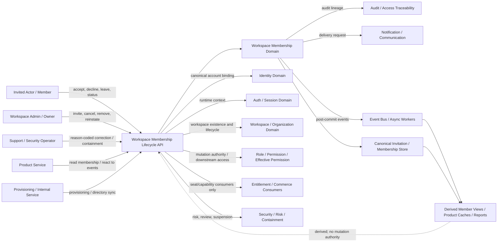
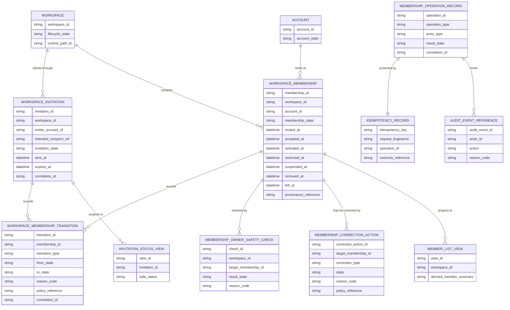
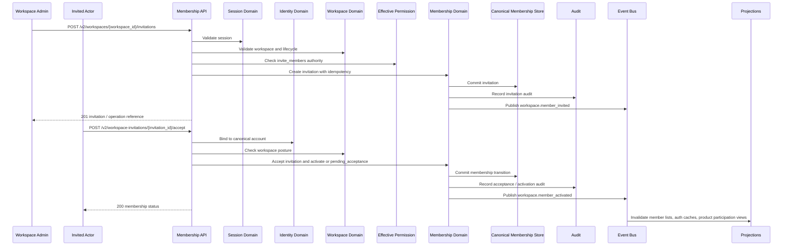

# WORKSPACE_MEMBERSHIP_LIFECYCLE_API_SPEC.md

## Document Metadata

- **Document Name:** `WORKSPACE_MEMBERSHIP_LIFECYCLE_API_SPEC.md`
- **Document Type:** FUZE API SPEC v2 / Production-grade interface-contract specification
- **Status:** Draft for production-grade API-spec review
- **Version:** 2.0.0
- **Effective Date:** 2026-04-24
- **Last Updated:** 2026-04-24
- **Reviewed On:** 2026-04-24
- **Document Owner:** FUZE Platform Workspace Membership Domain
- **Approval Authority:** FUZE Platform Architecture and Governance Authority
- **Review Cadence:** Quarterly or upon material change to workspace membership semantics, invitation/admission pathways, identity binding, owner-continuity safeguards, workspace restriction posture, downstream authorization ordering, entitlement coupling, product offboarding behavior, correction/remediation controls, audit requirements, or API exposure.
- **Governing Layer:** API SPEC v2 / Workspace, Organization, Authorization, and Access Control API family
- **Parent Registry:** `API_SPEC_INDEX.md`
- **Upstream Semantic Registry:** `REFINED_SYSTEM_SPEC_INDEX.md`
- **Upstream API Registry:** `API_SPEC_INDEX.md`
- **Primary Audience:** API designers, backend engineers, frontend/client engineers, product engineers, workspace service owners, authorization service owners, security engineers, support/control-plane engineers, audit/governance reviewers, OpenAPI/AsyncAPI/SDK authors, QA and contract-validation teams.
- **Primary Purpose:** Define the FUZE production API contract for workspace membership lifecycle: invitation issuance, delivery state, acceptance, decline, cancellation, expiry, activation, membership reads, restriction, suspension, removal, self-leave, reinstatement, rejoin, correction/remediation, owner-safety checks, downstream invalidation, event emission, idempotency, replay safety, audit lineage, derived read-model boundaries, migration, and downstream derivation guardrails.
- **Primary Upstream References:**
  - `REFINED_SYSTEM_SPEC_INDEX.md`
  - `DOCS_SPEC_INDEX.md`
  - `SYSTEM_SPEC_INDEX.md`
  - `API_SPEC_INDEX.md`
  - `FUZE_ACCOUNT_ACCESS_AND_SESSION_CANONICAL_FINAL_SPEC.md`
  - `IDENTITY_AND_ACCOUNT_SPEC.md`
  - `AUTH_SESSION_AND_LINKED_LOGIN_SPEC.md`
  - `FUZE_SESSION_LIFECYCLE_AND_SECURITY_SPEC.md`
  - `WORKSPACE_AND_ORGANIZATION_SPEC.md`
  - `FUZE_WORKSPACE_ACCESS_CONTROL_BASICS_THESIS_FINAL_SPEC.md`
  - `WORKSPACE_MEMBERSHIP_LIFECYCLE_SPEC.md`
  - `ROLE_PERMISSION_AND_ACCESS_CONTROL_SPEC.md`
  - `SCOPED_AUTHORIZATION_MODEL_SPEC.md`
  - `ACCESS_EVALUATION_AND_EFFECTIVE_PERMISSION_SPEC.md`
  - `ADMIN_ACCESS_CORRECTION_AND_CONTAINMENT_SPEC.md`
  - `AUDIT_AND_ACCESS_TRACEABILITY_SPEC.md`
  - `ENTITLEMENT_AND_CAPABILITY_GATING_SPEC.md`
  - `SECURITY_AND_RISK_CONTROL_SPEC.md`
  - `WALLET_AWARE_USER_SPEC.md`
  - `WORKSPACE_ORGANIZATION_API_SPEC.md`
  - `ROLE_PERMISSION_ACCESS_API_SPEC.md`
- **Primary Downstream Dependents:**
  - OpenAPI contracts for workspace membership APIs
  - AsyncAPI contracts for membership lifecycle events
  - workspace and organization APIs
  - role/permission/access-control APIs
  - scoped authorization APIs
  - effective-permission APIs
  - entitlement/capability gating APIs
  - product offboarding/provisioning integrations
  - support/admin correction tooling
  - audit and access traceability pipelines
  - notification and communication workflows
  - first-party workspace member management clients
  - SDK membership helpers
  - QA, contract validation, and regression suites
- **API Surface Families Covered:** first-party application APIs, internal service APIs, admin/control-plane APIs, event/async APIs, reporting/projection APIs, limited public/continuation-safe invitation APIs where explicitly approved.
- **API Surface Families Excluded:** canonical account identity creation, login/session issuance, workspace lifecycle creation/deletion in full, role/permission catalogs and grant mutation in full, final effective-permission evaluation, entitlement formulas, billing/seat calculation truth, wallet-link lifecycle, product-local object-sharing internals, exact invitation transport providers, and public reporting copy.
- **Canonical System Owner(s):** Workspace Membership Domain for invitation and membership truth; adjacent ownership held by Identity, Auth/Session, Workspace/Organization, Authorization, Scoped Authorization, Effective Permission, Entitlement, Audit, Security/Risk, Admin Correction, Notification, and Product domains.
- **Canonical API Owner:** FUZE Platform API Architecture / Workspace Membership Lifecycle API owner
- **Supersedes:** Membership lifecycle portions of `WORKSPACE_ORGANIZATION_API_SPEC.md` and related v1 workspace/role APIs where this API v2 document is narrower, stricter, or more explicit.
- **Superseded By:** Not yet known
- **Related Decision Records:** Not explicitly available in retrieved governing materials
- **Canonical Status Note:** This API spec derives from `WORKSPACE_MEMBERSHIP_LIFECYCLE_SPEC.md`. It owns interface-contract expression only. It MUST NOT redefine canonical account identity, session truth, workspace truth, role/permission truth, scoped authorization truth, final effective-permission truth, entitlement truth, wallet-aware truth, commerce truth, audit truth, privileged correction truth, or product-local participation truth.
- **Implementation Status:** Normative API contract baseline; downstream OpenAPI, AsyncAPI, SDK, service, storage, event, support-tool, audit, product-integration, and migration contracts must conform.
- **Approval Status:** Drafted for API SPEC v2 inclusion; formal approval record not yet attached.
- **Change Summary:** Created a production-grade API v2 contract for workspace membership lifecycle; separated invitation truth from active membership truth, membership from authorization, and membership from entitlement/billing; hardened owner-safety, canonical identity binding, wrong-account acceptance handling, restriction/suspension/removal/leave/reinstatement/correction flows, idempotency, event invalidation, audit lineage, derived read-model safety, migration, and forbidden-pattern rules.

---

## Purpose

This document defines the FUZE API contract for **workspace membership lifecycle**.

Workspace membership is the durable canonical relationship between a canonical FUZE account and a workspace. It is the structural bridge between identity and collaborative scope. It is not created by login, session presence, current-workspace selection, invitation delivery, product-local sharing, billing/seat calculations, wallet linkage, support dashboard state, or stale cache.

This API spec governs how membership is created, activated, constrained, suspended, ended, restored, corrected, and exposed through API contracts without collapsing identity, session, workspace, authorization, entitlement, product, commerce, or reporting truth into membership truth.

---

## Scope

This specification governs API contracts for:

1. invitation issuance;
2. invitation read/status, delivery status, cancellation, decline, expiry, and supersession;
3. invitation acceptance and canonical identity binding;
4. provisional membership and pending acceptance flows;
5. membership activation;
6. canonical membership listing and reads;
7. membership restriction and suspension;
8. membership removal;
9. member-initiated leave;
10. reinstatement and rejoin;
11. wrong-account acceptance and mistaken-state correction;
12. owner-safety and minimum-control-path checks;
13. membership-dependent downstream invalidation and refresh;
14. admin/control-plane membership remediation;
15. event/async behavior for membership lifecycle transitions;
16. derived read-model and reporting boundaries;
17. request, response, error, status, idempotency, audit, observability, migration, OpenAPI, AsyncAPI, and SDK derivation rules.

---

## Out of Scope

This API spec does not govern:

- account creation or canonical identity lifecycle;
- authentication and session issuance;
- workspace creation, workspace closure, or organization hierarchy in full depth;
- role catalogs, permission catalogs, scoped-grant internals, or final effective-permission logic in full depth;
- exact entitlement, billing, seat, invoice, credit, or plan formulas;
- exact invitation email/SMS/provider transport implementation;
- enterprise directory sync mechanics in full depth;
- product-local offboarding behavior for every product resource type;
- wallet-link lifecycle, wallet custody, or chain authority;
- exact support queue staffing, UI copy, or report design.

---

## Design Goals

1. Make membership a durable, explicit, platform-owned relationship.
2. Preserve strict separation between identity, session, workspace scope, membership, authorization, entitlement, commerce, wallet context, and product-local behavior.
3. Keep invitation state distinct from active membership state.
4. Ensure invite acceptance binds to canonical account identity without hidden duplicate identity creation.
5. Ensure membership admission and exit flows are continuity-safe, owner-safe, auditable, and replay-safe.
6. Prevent product-local participants, invitation delivery, provisioning sync, support dashboards, current-workspace selection, or stale caches from creating hidden membership truth.
7. Ensure downstream authorization, entitlement, product enforcement, commerce, and reporting consume canonical membership truth rather than redefine it.
8. Preserve reconstructable lineage across invitation, activation, restriction, suspension, removal, leave, reinstatement, and correction.
9. Provide deterministic API outcomes for ambiguous, unsafe, duplicate, stale, degraded, or replayed requests.
10. Provide enough contract clarity for OpenAPI, AsyncAPI, SDKs, QA, audit, operations, product integrations, and migration from v1 APIs.

---

## Non-Goals

This API spec is not intended to:

- treat membership as final authority;
- treat invitation delivery as active membership;
- treat session presence as membership proof;
- treat current-workspace selection as membership proof;
- let products maintain their own authoritative shared-platform membership;
- decide every commercial consequence of membership state;
- allow destructive history rewrite for convenience;
- collapse privileged correction into ordinary self-service;
- replace role/permission, scoped authorization, effective-permission, entitlement, or billing APIs.

---

## Core Principles

### Identity / Membership Separation

The canonical account is the actor anchor. Membership is the durable account-to-workspace relationship. These MUST remain distinct.

### Membership Is Durable Structure

Membership is a durable platform record with lifecycle meaning. It is not a frontend flag or transient runtime property.

### Invitation / Membership Distinction

Invitation is a pending admission artifact. It MUST NOT be interpreted as active membership.

### Activation Before Authority

Until membership reaches a downstream-usable active state, ordinary workspace authority MUST NOT be inferred.

### Membership Before Authorization

Authorization consumes membership truth as prerequisite input. Membership does not equal permission.

### Restriction Precedence

Restricted, suspended, removed, left, declined, or expired membership posture MUST outrank stale grants, stale UI state, product caches, and convenience selectors.

### Continuity Preservation

Membership mutation MUST preserve workspace continuity, owner continuity, resource continuity, and audit lineage.

### No Hidden Identity Creation

Acceptance, provisioning, reinstatement, or remediation MUST bind to canonical account identity and MUST NOT silently create duplicate or replacement identity.

### Explicit Remediation

Wrong-account acceptance, mistaken removal, mistaken suspension, orphan-risk, owner-adjacent risk, or unsafe admission MUST route through explicit corrective workflows.

### Product Consumption

Products consume canonical membership truth. They do not redefine it.

### Traceability by Default

High-impact membership state and decisions MUST be reconstructable through lineage, reason codes, policy references, trace IDs, correlation IDs, and audit records.

### Fail Closed on Ambiguity

Where membership truth is ambiguous for protected operations, the default outcome MUST be deny, review, or containment rather than silent allow.

---

## Canonical Definitions

- **Workspace Membership:** Durable canonical relationship between a canonical account and a workspace.
- **Invitation:** Pending admission artifact intended to allow a qualified actor to join a workspace through controlled canonical identity binding.
- **Invitation Acceptance:** Attempt to bind an invitation to a canonical account and progress toward membership.
- **Membership Activation:** Explicit transition by which pending or invited relationship becomes sufficiently active for ordinary downstream collaboration and authorization input.
- **Membership Restriction:** Membership state where historical/structural relationship remains but ordinary participation is constrained.
- **Membership Suspension:** Stronger operational/security limitation that materially blocks ordinary collaboration pending review, remediation, or containment.
- **Membership Removal:** Transition ending active membership by authorized actor or policy pathway.
- **Membership Leave:** Member-initiated departure from workspace scope where policy allows.
- **Membership Reinstatement:** Controlled transition restoring active participation from restricted, suspended, or recoverable posture.
- **Membership Correction:** Explicit remediation workflow for mistaken invitation, acceptance, activation, removal, restriction, suspension, or owner-adjacent mutation.
- **Membership Provenance:** Durable lineage showing how membership was invited, accepted, provisioned, activated, restricted, suspended, removed, left, reinstated, or corrected.
- **Owner-Safety Check:** Validation that a membership mutation will not strand workspace control, orphan minimum administration, or violate continuity rules.
- **Review-Required Outcome:** Deterministic response indicating ordinary mutation cannot safely proceed and must route through policy-bound review or privileged correction.
- **Derived Membership View:** Regenerable cache, dashboard, UX summary, support view, search projection, report, or product-local materialized view derived from canonical membership records.

---

## Truth Class Taxonomy

This API spec preserves these truth classes:

1. **Semantic Truth:** Defined by upstream refined specs.
2. **API Contract Truth:** Defined here for membership requests, responses, errors, statuses, events, idempotency, and audit requirements.
3. **Canonical Identity Truth:** Account record anchored by `account_id`.
4. **Runtime Session Truth:** Temporary authenticated runtime state; required for ordinary interactive flows but not membership truth.
5. **Collaborative Scope Truth:** Canonical workspace and organization records, lifecycle posture, and ownership/control paths.
6. **Invitation Truth:** Canonical invitation state and admission lineage.
7. **Membership Truth:** Canonical membership state, transition history, and provenance.
8. **Authorization Truth:** Roles, permissions, scoped grants, and effective-permission outcomes that consume membership truth.
9. **Entitlement / Commerce Truth:** Product eligibility, commercial seat posture, billing formulas, subscription truth, and invoice consequences.
10. **Security / Containment Truth:** Risk, review, containment, restriction, or privileged intervention posture.
11. **Audit / Traceability Truth:** Durable transition, actor, reason, policy, correlation, trace, and event lineage.
12. **Derived Read-Model Truth:** Support views, dashboards, analytics, caches, search indexes, product-local views, and UX summaries.
13. **Reporting / Public View Truth:** Exports, reports, communication artifacts, and public-facing summaries.

---

## Architectural Position in the Spec Hierarchy

This API spec sits below:

- `REFINED_SYSTEM_SPEC_INDEX.md`
- `FUZE_ACCOUNT_ACCESS_AND_SESSION_CANONICAL_FINAL_SPEC.md`
- `IDENTITY_AND_ACCOUNT_SPEC.md`
- `AUTH_SESSION_AND_LINKED_LOGIN_SPEC.md`
- `FUZE_SESSION_LIFECYCLE_AND_SECURITY_SPEC.md`
- `WORKSPACE_AND_ORGANIZATION_SPEC.md`
- `FUZE_WORKSPACE_ACCESS_CONTROL_BASICS_THESIS_FINAL_SPEC.md`
- `WORKSPACE_MEMBERSHIP_LIFECYCLE_SPEC.md`

It sits beside and above downstream APIs for:

- role/permission access control;
- scoped authorization;
- effective permission;
- admin correction and containment;
- audit and access traceability;
- entitlement and capability gating;
- product offboarding/provisioning;
- notification and communications;
- reporting and analytics.

---

## Upstream Semantic Owners

### `WORKSPACE_MEMBERSHIP_LIFECYCLE_SPEC.md`

Primary semantic owner for invitation truth, membership truth, lifecycle states, transition legality, owner-safety, correction lineage, events, and downstream membership consumption.

### `FUZE_WORKSPACE_ACCESS_CONTROL_BASICS_THESIS_FINAL_SPEC.md`

Interpretive owner for the post-auth ordering: identity, session, scope, membership, structural authorization, effective permission, entitlement, and product policy.

### `WORKSPACE_AND_ORGANIZATION_SPEC.md`

Owns workspace existence, lifecycle, hierarchy, and collaborative scope truth.

### `IDENTITY_AND_ACCOUNT_SPEC.md`

Owns canonical account identity and account lifecycle.

### `AUTH_SESSION_AND_LINKED_LOGIN_SPEC.md` / `FUZE_SESSION_LIFECYCLE_AND_SECURITY_SPEC.md`

Own runtime session truth and session containment.

### `ROLE_PERMISSION_AND_ACCESS_CONTROL_SPEC.md`

Owns role/permission structural authority consumed after membership.

### `SCOPED_AUTHORIZATION_MODEL_SPEC.md`

Owns grant-to-scope binding after membership and scope resolution.

### `ACCESS_EVALUATION_AND_EFFECTIVE_PERMISSION_SPEC.md`

Owns final action-level allow/deny/restricted/review-required outcome.

### `ENTITLEMENT_AND_CAPABILITY_GATING_SPEC.md`

Owns capability eligibility and commercial/policy gating.

### `ADMIN_ACCESS_CORRECTION_AND_CONTAINMENT_SPEC.md`

Owns privileged correction/containment semantics that may affect membership but do not replace membership ownership.

### `AUDIT_AND_ACCESS_TRACEABILITY_SPEC.md`

Owns durable traceability semantics.

---

## API Surface Families

### Public / Continuation-Safe Invitation Surfaces

May support invite landing, invite status, acceptance, and decline using opaque invitation references. They MUST be anti-enumeration-safe and MUST NOT disclose unsafe workspace or membership details.

### First-Party Application APIs

Used by FUZE web/mobile clients for member lists, invitation issuance, acceptance, cancellation, removal, leave, and ordinary membership administration.

### Internal Service APIs

Used by platform services, provisioning systems, directory sync, product systems, and authorization systems to read canonical membership state, request mutation through owner-domain APIs, and consume transition outcomes.

### Admin / Control-Plane APIs

Used by privileged operators for correction, forced suspension/removal/reinstatement, wrong-account acceptance repair, owner-safety remediation, and containment.

### Event / Async APIs

Used for durable post-commit membership lifecycle events and downstream invalidation.

### Reporting / Projection APIs

Used for derived member lists, support views, dashboards, analytics, seat reporting inputs, and product-local participation views. They are read-only and derived.

---

## System / API Boundaries

This API spec governs canonical membership and invitation APIs.

It does not govern:

- canonical account creation;
- authentication/session issuance;
- workspace existence and lifecycle in full;
- role/permission definitions or final permission evaluation;
- commercial billing formulas;
- wallet or chain semantics;
- product-local sharing unless it claims canonical membership meaning.

Downstream APIs MUST consume membership truth; they MUST NOT reinterpret it.

---

## Adjacent API Boundaries

- `WORKSPACE_AND_ORGANIZATION_API_SPEC.md` owns workspace/organization scope APIs.
- `WORKSPACE_ACCESS_CONTROL_BASICS_API_SPEC.md` owns access-context sequencing.
- `ROLE_PERMISSION_AND_ACCESS_CONTROL_API_SPEC.md` owns role/permission/grant APIs.
- `SCOPED_AUTHORIZATION_MODEL_API_SPEC.md` owns grant-to-scope binding APIs.
- `ACCESS_EVALUATION_AND_EFFECTIVE_PERMISSION_API_SPEC.md` owns final evaluation APIs.
- `ENTITLEMENT_AND_CAPABILITY_GATING_API_SPEC.md` owns capability/seat eligibility APIs.
- `ADMIN_ACCESS_CORRECTION_AND_CONTAINMENT_API_SPEC.md` owns cross-domain privileged correction workflows.
- `AUDIT_AND_ACCESS_TRACEABILITY_API_SPEC.md` owns audit/traceability APIs.

---

## Conflict Resolution Rules

When multiple layers disagree, API interpretation MUST follow:

1. canonical identity truth for `account_id`;
2. canonical workspace truth and lifecycle posture;
3. canonical membership and invitation records;
4. explicit policy, restriction, risk, and containment posture;
5. authorization and effective-permission logic;
6. entitlement posture where capability eligibility matters;
7. session UI state and current-workspace selector state;
8. product-local caches, projections, dashboards, exports, and reports.

Specific rules:

- session presence MUST NOT override missing, removed, left, suspended, or restricted membership;
- current-workspace selection MUST NOT override membership state;
- product-local participants MUST NOT override canonical membership;
- entitlement allow MUST NOT reactivate missing or inactive membership;
- operator tools MUST NOT repair membership through hidden direct edits;
- stale invitation state MUST NOT revive historical membership;
- active membership is not final authority;
- ambiguous admission MUST fail closed or route to review.

---

## Default Decision Rules

1. Default actor anchor is `account_id`.
2. Default scope anchor is `workspace_id`.
3. Default membership interpretation is structural attachment, not final authority.
4. Default invitation interpretation is pending admission, not active membership.
5. Default ambiguous admission outcome is `review_required` or denial.
6. Default owner-adjacent exit outcome is block and route to transfer/review/correction.
7. Default derived-state treatment is non-authoritative and regenerable.
8. Default degraded-mode behavior is fail closed for high-impact membership-dependent actions.
9. Default wrong-account acceptance handling is preserve lineage and route to correction.
10. Default stale-cache handling is canonical membership truth wins.

---

## Roles / Actors / API Consumers

- **Invited Actor:** Intended invitation recipient.
- **Candidate Account:** Canonical account evaluated during invitation acceptance or provisioning.
- **Active Member:** Account with membership sufficiently active for ordinary collaboration input.
- **Restricted Member:** Structurally present but constrained member.
- **Suspended Member:** Member materially blocked pending review, abuse handling, or remediation.
- **Removed Former Member:** Account with historical membership but no ordinary participation.
- **Leaving Member:** Member performing self-service departure.
- **Workspace Owner:** Highest ordinary workspace-control member protected by owner-safety checks.
- **Workspace Administrator:** Elevated actor allowed to perform membership mutations subject to authorization.
- **Support / Admin Operator:** Privileged actor performing correction, forced removal, suspension, reinstatement, or containment.
- **Membership Service:** Owner-domain service for canonical membership mutation/read APIs.
- **Product Service:** Downstream consumer of membership state and lifecycle events.
- **Authorization / Entitlement Services:** Downstream consumers of membership state.

---

## Resource / Entity Families

### API-Facing Resources

- `workspace_invitation`
- `workspace_membership`
- `workspace_membership_transition`
- `membership_activation`
- `membership_restriction`
- `membership_suspension`
- `membership_removal`
- `membership_leave`
- `membership_reinstatement`
- `membership_correction_action`
- `membership_operation`
- `membership_event`
- `membership_audit_reference`

### Canonical Owner-Domain Entities

- `workspace_invitation`
- `workspace_membership`
- `workspace_membership_transition`
- `membership_provenance_record`
- `membership_owner_safety_check`
- `membership_correction_action`
- `membership_operation_record`
- `idempotency_record`
- `audit_event_reference`

### Referenced but Non-Owned Entities

- `account`
- `auth_session`
- `workspace`
- `organization`
- `role_assignment`
- `scoped_grant`
- `effective_permission_result`
- `entitlement_result`
- `product_resource`
- `security_risk_signal`
- `admin_correction_case`

### Derived Entities

- `member_list_view`
- `member_count_view`
- `support_membership_summary`
- `product_participation_cache`
- `membership_search_projection`
- `seat_reporting_input`
- `membership_audit_report`

Derived entities MUST be regenerable from canonical records and MUST NOT write membership truth.

---

## Ownership Model

### Workspace Membership Domain Owns

- canonical membership record truth;
- canonical invitation record truth;
- invitation-to-membership linkage;
- membership state semantics;
- transition legality;
- owner-safety checks;
- membership provenance and lineage;
- ordinary membership mutation responses;
- membership lifecycle events.

### Workspace Membership Domain MAY

- create invitation records;
- create pending or active membership through approved flows;
- restrict, suspend, remove, reinstate, expire, cancel, or correct membership through explicit pathways;
- expose canonical membership reads;
- coordinate with authorization, entitlement, commerce, security, product, notification, and audit systems.

### Workspace Membership Domain MUST NOT

- redefine canonical account identity;
- issue sessions;
- decide final effective permissions;
- own commercial plan or billing truth;
- allow product/support hidden writes to bypass canonical mutation.

### Product Domains MAY

- consume canonical membership reads;
- react to lifecycle events;
- maintain product-local participation caches;
- enforce product-local offboarding based on canonical membership.

### Product Domains MUST NOT

- create authoritative workspace membership by local side effect;
- treat product invitation as canonical workspace membership unless routed through platform membership APIs;
- preserve workspace-scoped access after canonical removal/suspension where membership is required;
- revive removed/suspended membership through cache refill or sync replay.

---

## Authority / Decision Model

### Membership Domain Decides

- whether invitation exists;
- whether invitation can bind to a canonical account;
- canonical membership status;
- structurally allowed transitions;
- owner-safety and minimum-control-path constraints;
- whether transition is ordinary, review-required, blocked, or privileged-correction-only.

### Authorization Domain Decides

- what active or constrained member may do after membership state is resolved.

### Security / Risk Domain May Override

- whether membership must be suspended, reviewed, restricted, contained, or blocked.

### Commerce / Entitlement Domains May Consume

- whether member counts for seat, capability, policy, or commercial posture.

### Support / Control-Plane May Assist

- only through reason-coded, policy-bound workflows;
- without becoming owners of membership truth.

---

## Authentication Model

### Public / Continuation-Safe Invitation APIs

Opaque invitation references may be used for invite landing, acceptance, or decline. Responses MUST be safe and avoid unnecessary workspace or membership enumeration.

### First-Party User APIs

Require a valid session and canonical account context. Mutations require caller authority through workspace, membership, role/permission, effective-permission, and policy checks as applicable.

### Internal Service APIs

Require service-to-service authentication, explicit service identity, least privilege, correlation ID, and operation lineage.

### Admin / Control-Plane APIs

Require privileged operator identity, strong session/control posture where required, operator authorization, reason code, policy reference, idempotency key, and audit context.

---

## Authorization / Scope / Permission Model

Membership APIs MUST distinguish:

- invitation recipient;
- workspace member;
- workspace administrator;
- workspace owner;
- support/admin operator;
- provisioning service;
- product service;
- reporting/projection consumer.

Membership mutation requires:

- canonical workspace scope;
- canonical account or controlled identity-binding flow;
- caller authority;
- owner-safety check for owner-adjacent mutations;
- risk/restriction policy;
- idempotency and audit context.

Membership state is a prerequisite input for downstream authorization. It is not final authority.

---

## Entitlement / Capability-Gating Model

Membership and entitlement are distinct.

Active membership MAY be necessary for workspace-scoped entitlement consumption, but it is not sufficient. Entitlement MAY attach to workspace, account, seat, or product policy, but entitlement allow MUST NOT create or reactivate membership. Member count and billable-member calculations are downstream concerns that must consume canonical membership truth.

---

## API State Model

### Invitation States

- `created`
- `sent`
- `accepted`
- `declined`
- `expired`
- `cancelled`
- `superseded`

### Membership States

- `invited`
- `pending_acceptance`
- `active`
- `restricted`
- `suspended`
- `removed`
- `left`
- `declined`
- `expired`
- `reinstated`
- `correction_pending`
- `superseded`

### Operation States

- `accepted`
- `completed`
- `partially_completed`
- `denied`
- `failed`
- `cancelled`
- `requires_review`
- `blocked_by_owner_safety`
- `superseded`

### State Rules

- Invitation state and membership state MUST NOT be conflated.
- Terminal invitation outcomes MUST NOT silently mutate active membership.
- Removed, left, declined, expired, and superseded states MUST preserve historical lineage.
- Transitions MUST be explicit, auditable, idempotent, and replay-safe.
- Stale cached reads MUST NOT override canonical membership state.
- Transitions affecting downstream access MUST produce deterministic invalidation or refresh signals.

---

## Lifecycle / Workflow Model

### Invitation Issuance

1. Authorized actor submits invitation request.
2. API validates workspace scope, caller authority, owner/security policy, intended admission posture, idempotency, and correlation context.
3. API creates durable invitation lineage.
4. API returns invitation resource or operation reference.
5. Invitation issuance does not create active membership.

### Invitation Delivery / Presentation

1. Delivery service or first-party client surfaces invitation.
2. Delivery mechanics do not redefine invitation truth.
3. Delivery failure does not imply membership creation.
4. Public-safe responses avoid unsafe workspace/membership enumeration.

### Invitation Acceptance / Identity Binding

1. Invited actor attempts acceptance.
2. API binds acceptance to canonical account identity or controlled identity-resolution flow.
3. API rejects or routes to review if binding is ambiguous, wrong-account-risk exists, or account continuity is unsafe.
4. API may create `pending_acceptance` before activation if additional checks are required.

### Activation

1. Admission checks complete.
2. API explicitly activates membership.
3. API records timestamps, provenance, trace ID, correlation ID, and audit reference.
4. API emits membership activation events.
5. Activation does not bypass workspace restriction, owner-safety, risk posture, or broader security state.

### Restriction / Suspension

1. Authorized actor, security policy, admin workflow, or risk posture triggers restriction/suspension.
2. API requires reason code and policy reference.
3. Membership state transitions while lineage remains intact.
4. Downstream access invalidates quickly and deterministically.
5. Reinstatement remains separate and explicit.

### Removal

1. Authorized actor or policy removes member.
2. API validates authority and owner-safety/minimum-control-path checks.
3. API preserves historical lineage and workspace-owned resources.
4. Membership-dependent downstream access is revoked or suppressed.
5. Events and audit records are emitted.

### Leave

1. Member requests self-service leave.
2. API checks policy and owner continuity.
3. If exit would strand control, API blocks and routes to transfer/review/correction.
4. If allowed, membership transitions to `left`.
5. Historical lineage remains.

### Reinstatement / Rejoin

1. Former or constrained member is restored through explicit reinstatement or new invitation.
2. API records new activation episode or reactivation marker.
3. Stale invitations do not silently revive membership.
4. Prior lineage is preserved.

### Correction / Remediation

1. Wrong-account acceptance, mistaken removal/suspension, orphan-risk, or data drift is detected.
2. API routes to correction workflow.
3. Privileged mutation requires reason, policy, audit, idempotency, and lineage preservation.
4. Correction publishes superseding outcomes/events.
5. Destructive rewrite is forbidden for high-impact history.

---

## Architecture Diagram — Mermaid flowchart

---

## Data Design — Mermaid Diagram

---

## Flow View

### Primary Flow — Invite Member

1. Caller submits invitation request with workspace, intended recipient, admission posture, and idempotency key.
2. API validates session/service principal and caller authority.
3. API validates workspace existence and lifecycle state.
4. API verifies invite action through effective-permission or provisioning policy.
5. API creates or supersedes invitation idempotently.
6. API records invitation lineage, audit, and delivery request.
7. API emits `workspace.member_invited` after canonical commit.

### Primary Flow — Accept Invitation

1. Actor opens invite using safe reference.
2. API validates invitation state, expiry, cancellation, and replay posture.
3. API binds acceptance to canonical `account_id` or routes identity ambiguity to review.
4. API creates `pending_acceptance` or activates membership after checks.
5. API emits acceptance/activation event after commit.
6. API returns safe status and next action.

### Primary Flow — Remove Member

1. Authorized caller submits removal request with reason where required.
2. API validates caller authority and target membership state.
3. API performs owner-safety/minimum-control-path check.
4. If unsafe, returns `blocked_by_owner_safety` or `requires_review`.
5. If safe, membership transitions to `removed`.
6. API emits event to invalidate authorization, entitlement, product, cache, and reporting systems.
7. Audit records actor, target, reason, policy, and correlation.

### Primary Flow — Leave Workspace

1. Member requests leave.
2. API validates active/recoverable membership.
3. API performs owner-continuity check.
4. If safe, membership transitions to `left`.
5. Workspace-owned resources remain workspace-owned.
6. Downstream access is invalidated.

### Admin Correction Flow

1. Operator submits correction request.
2. API validates privileged authority, reason, policy, idempotency, and audit context.
3. API preserves original lineage.
4. API writes superseding correction lineage.
5. API emits corrective event after commit.
6. Derived views refresh.

### Degraded Mode Flow

1. Derived view is stale/unavailable.
2. API reads canonical membership store.
3. Required identity/workspace/authorization/audit dependency unavailable for high-impact mutation.
4. API fails closed or returns governed retry/review state.
5. API does not use stale product cache or dashboard as truth.

---

## Data Flows — Mermaid sequenceDiagram

---

## Request Model

Side-effecting requests MUST include or derive:

- caller identity or service identity;
- target workspace ID;
- target invitation ID or membership ID where applicable;
- target account ID or controlled recipient artifact where applicable;
- operation type;
- idempotency key;
- correlation ID and trace ID;
- reason code for restriction, suspension, removal, reinstatement, correction, and privileged actions;
- policy reference where required;
- owner-safety check reference where applicable;
- actor confirmation for sensitive actions;
- service principal for provisioning/directory flows.

Requests MUST NOT include:

- frontend-declared active membership truth;
- session or current workspace as membership proof;
- product-local participant state as canonical membership;
- entitlement/seat status as membership truth;
- wallet proof as membership authority;
- hidden direct storage mutation intent;
- broad operator override without reason, policy, idempotency, and audit context.

---

## Response Model

### Success / Progress Response Classes

- `workspace_invitation.created`
- `workspace_invitation.sent`
- `workspace_invitation.cancelled`
- `workspace_invitation.declined`
- `workspace_invitation.expired`
- `workspace_invitation.accepted`
- `workspace_membership.pending_acceptance`
- `workspace_membership.activated`
- `workspace_membership.read`
- `workspace_membership.list`
- `workspace_membership.restricted`
- `workspace_membership.suspended`
- `workspace_membership.removed`
- `workspace_membership.left`
- `workspace_membership.reinstated`
- `workspace_membership.corrected`
- `membership_operation.accepted`
- `membership_operation.completed`
- `membership_operation.partial`

### Required Fields Where Applicable

- `invitation_id`;
- `membership_id`;
- `workspace_id`;
- `account_id` where safe/authorized;
- `invitation_state`;
- `membership_state`;
- `operation_id`;
- `correlation_id`;
- `audit_reference` for sensitive actions;
- `policy_reference`;
- `reason_code`;
- `owner_safety_result`;
- `requires_review`;
- `requires_identity_resolution`;
- `requires_authorization_refresh`;
- `requires_entitlement_refresh`;
- `requires_product_offboarding`;
- `derived` flag for summaries;
- `projection_freshness` for derived views.

### Redaction / Privacy Constraints

Public-safe invitation responses MUST NOT unnecessarily reveal workspace existence, full member list, target account identity, internal risk posture, operator notes, or sensitive workspace metadata.

---

## Error / Result / Status Model

### HTTP Classes

- `200 OK` for successful reads and completed idempotent outcomes.
- `201 Created` for invitation or membership creation where appropriate.
- `202 Accepted` for async provisioning, review, correction, or downstream side-effect finalization.
- `400 Bad Request` for malformed input.
- `401 Unauthorized` for missing/invalid session where required.
- `403 Forbidden` for insufficient authority or denied action.
- `404 Not Found` where invitation/membership/workspace is unavailable or should be concealed.
- `409 Conflict` for state conflict, duplicate active membership, owner-safety block, stale invitation, wrong-account risk, or idempotency conflict.
- `410 Gone` for expired/cancelled invitation where safe.
- `423 Locked` or equivalent problem code for suspended/restricted/blocked posture where FUZE maps it that way.
- `429 Too Many Requests` for rate-limit/abuse control.
- `500/503` for server/dependency failure with fail-closed behavior for high-impact mutation.

### Stable Error Codes

- `WORKSPACE_NOT_FOUND`
- `WORKSPACE_RESTRICTED`
- `WORKSPACE_SUSPENDED`
- `INVITATION_NOT_FOUND`
- `INVITATION_EXPIRED`
- `INVITATION_CANCELLED`
- `INVITATION_DECLINED`
- `INVITATION_ALREADY_ACCEPTED`
- `INVITATION_NOT_ACTIVE_MEMBERSHIP`
- `MEMBERSHIP_NOT_FOUND`
- `MEMBERSHIP_ALREADY_ACTIVE`
- `MEMBERSHIP_ALREADY_REMOVED`
- `MEMBERSHIP_ALREADY_LEFT`
- `MEMBERSHIP_RESTRICTED`
- `MEMBERSHIP_SUSPENDED`
- `MEMBERSHIP_NOT_ACTIVE`
- `DUPLICATE_ACTIVE_MEMBERSHIP_FORBIDDEN`
- `IDENTITY_BINDING_REQUIRED`
- `IDENTITY_BINDING_AMBIGUOUS`
- `WRONG_ACCOUNT_ACCEPTANCE_REQUIRES_CORRECTION`
- `OWNER_SAFETY_BLOCKED`
- `MINIMUM_CONTROL_PATH_BLOCKED`
- `REINSTATEMENT_REQUIRES_REVIEW`
- `STALE_INVITATION_REJOIN_FORBIDDEN`
- `PRODUCT_SHADOW_MEMBERSHIP_FORBIDDEN`
- `CURRENT_WORKSPACE_NOT_MEMBERSHIP`
- `SESSION_NOT_MEMBERSHIP`
- `ENTITLEMENT_NOT_MEMBERSHIP`
- `REASON_CODE_REQUIRED`
- `POLICY_REFERENCE_REQUIRED`
- `OPERATOR_PERMISSION_DENIED`
- `IDEMPOTENCY_KEY_REQUIRED`
- `IDEMPOTENCY_CONFLICT`
- `DERIVED_VIEW_UNAVAILABLE`
- `OWNER_DOMAIN_UNAVAILABLE_FAIL_CLOSED`

### Result Semantics

Accepted-state responses mean the mutation was accepted or routed. They do not imply all downstream async side effects, product offboarding, entitlement refresh, authorization refresh, or notification delivery have completed unless explicitly stated.

---

## Idempotency / Retry / Replay Model

Idempotency is mandatory for:

- invitation issuance;
- invitation cancellation;
- invitation acceptance;
- invitation decline;
- activation;
- restriction;
- suspension;
- removal;
- leave;
- reinstatement;
- correction/remediation;
- provisioning/directory sync mutations.

Rules:

1. Idempotency keys MUST be scoped to caller/service, operation family, target workspace, target invitation/membership, target account/recipient, and request fingerprint.
2. Same key and same fingerprint returns prior outcome or operation reference.
3. Same key and different fingerprint returns `IDEMPOTENCY_CONFLICT`.
4. Duplicate invitation issuance MUST NOT create uncontrolled duplicate active invites unless supersession policy explicitly allows it.
5. Duplicate acceptance MUST NOT create duplicate active memberships.
6. Duplicate removal/leave returns terminal success-equivalent or prior outcome.
7. Replayed stale invitations MUST NOT reactivate removed or left membership.
8. Correction retries MUST preserve original and superseding lineage.

---

## Rate Limit / Abuse-Control Model

- Invitation issuance MUST be rate-limited by actor, workspace, recipient artifact, and risk posture.
- Invitation acceptance/decline MUST be replay-protected and rate-limited.
- Public-safe invitation status reads MUST prevent enumeration.
- Removal, suspension, restriction, reinstatement, and correction require stricter limits.
- Repeated wrong-account binding attempts SHOULD emit risk signals.
- Admin correction requires operator- and target-specific throttling.

---

## Endpoint / Route Family Model

The following route families are normative contract families, not final OpenAPI path commitments.

### Invitation APIs

#### `POST /v2/workspaces/{workspace_id}/invitations`

Creates invitation.

Required behavior:
- validates workspace scope and caller authority;
- idempotency required;
- invitation does not create active membership;
- durable lineage and audit created.

#### `GET /v2/workspaces/{workspace_id}/invitations`

Lists invitations visible to authorized caller.

Required behavior:
- redacts recipient artifacts according to caller authority;
- distinguishes invitation state from membership state.

#### `GET /v2/workspace-invitations/{invitation_id}`

Reads safe invitation status.

Required behavior:
- public/continuation-safe;
- avoids unsafe enumeration;
- returns safe status only.

#### `POST /v2/workspace-invitations/{invitation_id}/accept`

Accepts invitation.

Required behavior:
- binds to canonical account identity;
- detects replay, expiry, cancellation, wrong-account risk;
- creates pending/active membership through owner domain;
- idempotent.

#### `POST /v2/workspace-invitations/{invitation_id}/decline`

Declines invitation.

Required behavior:
- terminal/idempotent;
- does not create membership;
- preserves lineage.

#### `POST /v2/workspaces/{workspace_id}/invitations/{invitation_id}/cancel`

Cancels invitation.

Required behavior:
- authorized actor;
- idempotent;
- does not alter active membership except through separate explicit flow.

### Membership Read APIs

#### `GET /v2/workspaces/{workspace_id}/memberships`

Lists canonical memberships.

Required behavior:
- authorized read;
- includes membership state and derived flags where applicable;
- does not imply final permission.

#### `GET /v2/workspaces/{workspace_id}/memberships/{membership_id}`

Reads membership.

Required behavior:
- returns canonical state, provenance references, downstream refresh flags;
- redacts sensitive correction/risk notes.

#### `GET /v2/me/workspace-memberships`

Lists current actor’s workspace memberships.

Required behavior:
- authenticated;
- includes active/restricted/suspended/left/removed visibility according to policy;
- does not imply entitlement or final permission.

### Membership Mutation APIs

#### `POST /v2/workspaces/{workspace_id}/memberships/{membership_id}/activate`

Activates pending membership.

Required behavior:
- explicit activation;
- idempotent;
- checks workspace/risk/owner-safety/policy posture.

#### `POST /v2/workspaces/{workspace_id}/memberships/{membership_id}/restrict`

Restricts membership.

Required behavior:
- reason code and policy reference required;
- idempotent;
- emits invalidation events.

#### `POST /v2/workspaces/{workspace_id}/memberships/{membership_id}/suspend`

Suspends membership.

Required behavior:
- stronger authority/risk path;
- reason code and audit required;
- downstream access suppressed.

#### `DELETE /v2/workspaces/{workspace_id}/memberships/{membership_id}`

Removes member.

Required behavior:
- validates authority and owner-safety;
- idempotent;
- preserves history;
- invalidates downstream access.

#### `POST /v2/workspaces/{workspace_id}/memberships/{membership_id}/leave`

Self-service leave.

Required behavior:
- verifies caller is member;
- owner continuity checks;
- idempotent;
- no resource reassignment by implication.

#### `POST /v2/workspaces/{workspace_id}/memberships/{membership_id}/reinstate`

Reinstates member.

Required behavior:
- explicit;
- reason-coded where required;
- records new activation episode/reactivation marker;
- stale invitation cannot trigger it silently.

### Internal Service APIs

#### `POST /internal/v2/workspace-memberships/resolve`

Resolves canonical membership for internal service.

Required behavior:
- service-authenticated;
- explicit account/workspace;
- returns canonical state and freshness;
- no mutation.

#### `POST /internal/v2/workspace-memberships/provisioning-actions`

Directory/provisioning mutation.

Required behavior:
- service-authenticated;
- idempotent;
- policy-bound;
- no hidden product-local membership.

### Admin / Control-Plane APIs

#### `POST /admin/v2/workspace-memberships/{membership_id}/correction-actions`

Creates correction action.

Required behavior:
- privileged route;
- reason code, policy reference, operator note where required;
- preserves original and superseding lineage;
- idempotency and audit required.

#### `POST /admin/v2/workspace-memberships/{membership_id}/containment-actions`

Applies membership containment.

Required behavior:
- privileged or security-owned route;
- reason-coded;
- emits downstream invalidation.

#### `GET /admin/v2/workspace-memberships/{membership_id}`

Reads admin-safe membership detail.

Required behavior:
- privileged access;
- redacted by operator authority;
- read audit where sensitive.

### Event Families

- `workspace.member_invited`
- `workspace.member_invitation_cancelled`
- `workspace.member_invitation_declined`
- `workspace.member_invitation_expired`
- `workspace.member_acceptance_pending`
- `workspace.member_joined`
- `workspace.member_activated`
- `workspace.member_restricted`
- `workspace.member_suspended`
- `workspace.member_reinstated`
- `workspace.member_removed`
- `workspace.member_left`
- `workspace.member_corrected`
- `workspace.membership_owner_safety_blocked`

Events MUST include event ID, occurred time, workspace ID, invitation/membership reference, actor/service reference where safe, target account reference where safe, operation ID, correlation ID, transition type, previous state, new state, reason code where applicable, policy reference where applicable, and lineage reference.

---

## Public API Considerations

Public or unauthenticated invitation surfaces MUST be narrow, continuation-safe, anti-enumerating, and redacted. They may present safe invitation status, acceptance, or decline flows. They MUST NOT expose full workspace detail, member lists, target account state, internal risk posture, or operator notes.

---

## First-Party Application API Considerations

First-party clients MUST:

- distinguish invitation from active membership;
- handle pending, restricted, suspended, removed, left, declined, expired, and review-required states;
- not infer membership from current workspace selector;
- not infer final permission from active membership;
- refresh local member views after lifecycle events;
- clear product-local access after removal/suspension where membership is prerequisite.

---

## Internal Service API Considerations

Internal services MUST:

- use service-to-service authentication;
- read canonical membership before membership-dependent actions;
- not rely on cached product participant state for protected actions;
- invalidate caches after membership events;
- fail closed for high-impact actions when canonical membership is unavailable.

---

## Admin / Control-Plane API Considerations

Admin/control-plane APIs MUST be:

- separated from ordinary user routes;
- privileged;
- reason-coded;
- policy-referenced;
- idempotent;
- audited;
- bounded to explicit membership/invitation/workspace;
- lineage-preserving;
- unable to destructively rewrite high-impact history.

---

## Event / Webhook / Async API Considerations

Membership events are post-commit notifications. They invalidate authorization caches, product participation views, entitlement/seat inputs, reporting views, notifications, and support dashboards. Consumers may react, but MUST NOT redefine membership truth.

External webhooks, if introduced, must be separately governed and must not expose sensitive membership details beyond authorized audience and scope.

---

## Chain-Adjacent API Considerations

Wallet or chain state does not create workspace membership. Wallet-aware context may enrich product eligibility only where separately approved. It MUST NOT admit, activate, reinstate, remove, or override membership.

---

## Data Model / Storage Support Implications

Downstream storage contracts MUST support:

- durable invitations;
- durable memberships;
- transition records;
- provenance references;
- wrong-account/correction markers;
- owner-safety check results;
- operation records;
- idempotency records;
- reason codes and policy references;
- audit event references;
- correlation IDs and trace IDs;
- event publication markers;
- derived view regeneration.

Storage MUST avoid destructive rewrites that erase invitation, membership, removal, leave, restriction, suspension, reinstatement, or correction lineage.

---

## Read Model / Projection / Reporting Rules

Derived views MAY expose:

- member list;
- invitation list;
- member count;
- seat input summary;
- product participation cache;
- support membership summary;
- audit/reporting export;
- projection freshness.

Derived views MUST NOT:

- mutate canonical membership;
- reactivate membership;
- override removal/suspension/restriction;
- create product-local canonical membership;
- hide correction lineage from authorized audit;
- trigger correction directly from reports;
- treat invitation as active membership.

---

## Security / Risk / Privacy Controls

Membership APIs MUST enforce:

- least privilege;
- anti-enumeration on public invitation surfaces;
- owner-safety checks;
- wrong-account acceptance protection;
- rate limiting and replay protection;
- redaction of recipient artifacts and sensitive notes;
- fail-closed behavior for high-impact ambiguity;
- privileged route separation;
- audit on sensitive transitions;
- deterministic downstream invalidation after restrictive or terminal transitions.

---

## Audit / Traceability / Observability Requirements

Material membership actions MUST record:

- actor/service/operator identity;
- target workspace;
- invitation ID and/or membership ID;
- target account or recipient artifact where safe;
- operation ID;
- idempotency key reference;
- transition type;
- previous state and new state;
- reason code;
- policy reference;
- owner-safety result;
- identity-binding result;
- correlation ID;
- trace ID;
- audit event ID;
- emitted event IDs;
- operator note where required and authorized.

Observability MUST include invitation issuance, delivery failures, acceptance success/failure, wrong-account risk, activation, restriction, suspension, removal, leave, reinstatement, correction, owner-safety blocks, idempotency conflicts, event lag, projection lag, and downstream invalidation lag.

---

## Failure Handling / Edge Cases

### Invitation Delivery Failed

Invitation truth remains canonical. Delivery failure does not create membership or revoke invitation unless explicitly cancelled/expired.

### Invitation Accepted by Wrong Account Risk

Route to identity resolution, review, or correction. Do not silently attach wrong account.

### Duplicate Active Membership

Reject or return existing active membership; duplicate active memberships for same account/workspace pair are forbidden.

### Owner Attempts Self-Leave

If exit would violate minimum-control-path safety, block and route to transfer/review/correction.

### Remove Last Owner

Return `OWNER_SAFETY_BLOCKED` unless approved correction/transfer path exists.

### Removed Member Has Role Grants

Membership removal suppresses membership-dependent authority. Downstream authorization caches must invalidate.

### Entitlement Allows Product but Membership Removed

Membership removal wins for membership-dependent workspace actions.

### Product Cache Says Participant

Canonical membership wins; product cache must refresh.

### Stale Invitation After Removal

Stale invitation cannot reactivate removed or left membership silently.

### Derived View Unavailable

Canonical membership API remains authoritative. Derived response reports unavailability.

### Dependency Degraded

High-impact mutation fails closed or routes to review/retry. No hidden membership creation occurs.

---

## Migration / Versioning / Compatibility / Deprecation Rules

- API v2 MUST preserve refined membership semantics during migration from v1 workspace/organization APIs.
- Compatibility adapters MAY route old invite/member endpoints into v2 semantics temporarily.
- Deprecated routes MUST NOT conflate invitation and membership.
- Deprecated routes MUST NOT treat membership as final permission.
- Migration must preserve invitation IDs, membership IDs, state, transition history, correction lineage, owner-safety records, audit references, and event references.
- SDK changes must distinguish invitation, pending acceptance, active membership, restriction, suspension, removal, leave, reinstatement, and correction.
- Version changes MUST NOT silently change membership-state semantics.

---

## OpenAPI / AsyncAPI / SDK Derivation Rules

OpenAPI artifacts MUST preserve:

- route-family separation;
- invitation vs membership state distinctions;
- membership state enums;
- stable error codes;
- idempotency requirements;
- owner-safety response fields;
- reason-code and policy-reference requirements;
- admin/control-plane separation;
- derived vs canonical labels;
- accepted-state vs final mutation semantics.

AsyncAPI artifacts MUST preserve:

- post-commit event semantics;
- event ID;
- invitation/membership references;
- workspace reference;
- transition type;
- previous and new states;
- operation ID;
- correlation ID;
- reason and policy reference where applicable;
- idempotent consumer posture.

SDKs MUST preserve:

- no invitation-as-membership inference;
- no session/current-workspace-as-membership inference;
- deterministic handling of non-active states;
- refresh after membership events;
- no product-local canonical membership.

---

## Implementation-Contract Guardrails

Downstream implementations MUST NOT:

1. treat invitation as active membership;
2. treat delivery status as membership;
3. treat session as membership;
4. treat current workspace as membership;
5. treat product-local participant as canonical membership;
6. treat entitlement/seat status as membership;
7. treat wallet status as membership;
8. create duplicate active membership for same account/workspace;
9. erase membership history through destructive rewrite;
10. reactivate removed/left membership from stale invite;
11. remove last owner without owner-safety handling;
12. preserve membership-dependent access after removal/suspension;
13. mutate membership from derived dashboards/reports;
14. omit idempotency for mutation-capable endpoints;
15. omit audit for high-impact transitions.

---

## Downstream Execution Staging

1. Stabilize invitation and membership state models.
2. Implement invitation issuance, read, cancel, accept, decline, and expiry.
3. Implement membership reads and lists.
4. Implement activation.
5. Implement restriction and suspension.
6. Implement removal and leave.
7. Implement reinstatement/rejoin.
8. Implement owner-safety checks.
9. Implement correction/remediation routes.
10. Implement events and downstream invalidation.
11. Implement audit and observability.
12. Generate OpenAPI/AsyncAPI artifacts.
13. Generate SDK helpers.
14. Migrate v1 workspace membership routes.

---

## Required Downstream Specs / Contract Layers

- OpenAPI route contract for workspace membership lifecycle APIs
- AsyncAPI membership lifecycle event contract
- invitation storage contract
- membership storage and transition contract
- owner-safety check contract
- identity-binding contract
- correction/remediation contract
- audit event schema
- notification delivery contract
- authorization cache invalidation contract
- entitlement/seat input contract
- product offboarding/provisioning integration contract
- migration adapter plan from v1 workspace APIs
- frontend/member-management UX contract
- SDK membership helper contract
- QA and regression test contract

---

## Boundary Violation Detection / Non-Canonical API Patterns

Forbidden patterns:

1. invitation read returns `member=true`;
2. invite acceptance creates duplicate identity silently;
3. session creates membership;
4. current workspace selector creates membership;
5. product sharing creates canonical membership directly;
6. entitlement or paid seat creates active membership;
7. wallet proof joins workspace;
8. stale invitation revives removed member;
9. product cache preserves access after removal;
10. removal erases historical lineage;
11. last owner removed without owner-safety check;
12. correction directly edits storage without audit;
13. derived member count mutates membership;
14. membership treated as final permission;
15. public invite status leaks full workspace/member data.

---

## Canonical Examples / Anti-Examples

### Canonical Example — Invitation Acceptance

An invited actor accepts through an opaque invitation link. The API validates the invitation, binds the actor to canonical `account_id`, creates `pending_acceptance` or activates membership, records lineage, emits events, and returns safe status.

### Canonical Example — Owner-Safe Leave

A workspace owner attempts to leave. The API checks minimum control path. If leaving would strand the workspace, the API blocks and routes to transfer or review.

### Canonical Example — Mistaken Suspension Correction

Support corrects mistaken suspension through admin control-plane with reason, policy, audit, and superseding correction lineage. The original suspension history remains reconstructable.

### Anti-Example — Product Invite Equals Workspace Member

A product-local invitation makes a user a canonical workspace member without membership API transition. This is forbidden.

### Anti-Example — Entitlement Reactivates Membership

A paid seat automatically reactivates a removed member. This is forbidden.

### Anti-Example — Stale Cache Keeps Access

A product cache preserves member access after canonical removal. This is forbidden.

---

## Acceptance Criteria

1. Invitation issuance creates durable invitation lineage and does not create active membership.
2. Invitation acceptance binds to canonical account identity.
3. Wrong-account or ambiguous identity binding routes to review/correction.
4. Invitation decline, expiry, and cancellation are terminal and auditable.
5. Membership activation is explicit and recorded.
6. Active membership is not final permission.
7. Restricted/suspended membership suppresses ordinary downstream authority.
8. Removal and leave preserve historical lineage.
9. Owner-safety blocks unsafe last-owner or control-path-breaking removals/leaves.
10. Reinstatement is explicit and reason-coded where required.
11. Stale invitations cannot revive removed or left membership.
12. Duplicate active membership for same account/workspace is forbidden.
13. Product-local participant lists cannot create or preserve canonical membership.
14. Entitlement and billing do not create or reactivate membership.
15. Wallet context does not create membership.
16. Mutation endpoints are idempotent and replay-safe.
17. High-impact transitions emit audit and events after commit.
18. Derived views are marked derived and cannot mutate canonical state.
19. Downstream authorization/product caches invalidate after restrictive or terminal transitions.
20. v1 adapters preserve invitation/membership separation.

---

## Test Cases

### Positive Path

1. **Issue invitation:** authorized admin creates invitation; state is `created` or `sent`; no active membership.
2. **Accept invitation:** invited actor accepts; membership transitions to `pending_acceptance` or `active`.
3. **Decline invitation:** invite transitions to `declined`; no membership is created.
4. **Cancel invitation:** admin cancels outstanding invite idempotently.
5. **Activate membership:** pending member becomes active with provenance and audit.
6. **Restrict membership:** reason-coded restriction suppresses downstream access.
7. **Suspend membership:** security/admin action suspends member and emits invalidation.
8. **Remove member:** authorized removal preserves lineage and revokes membership-dependent access.
9. **Leave workspace:** member leaves; state is `left`.
10. **Reinstate member:** explicit reinstatement records new activation episode.
11. **Correct membership:** admin correction preserves original and superseding lineage.

### Negative Path

12. **Invitation as membership:** invitation read cannot return active membership.
13. **Expired invite acceptance:** returns `INVITATION_EXPIRED`.
14. **Cancelled invite acceptance:** returns `INVITATION_CANCELLED`.
15. **Wrong account acceptance:** returns `IDENTITY_BINDING_AMBIGUOUS` or correction-required.
16. **Duplicate active membership:** rejected or returns existing membership.
17. **Remove last owner:** returns `OWNER_SAFETY_BLOCKED`.
18. **Session-only membership:** session cannot create membership.
19. **Current workspace-only membership:** selector cannot create membership.
20. **Product participant-only membership:** rejected.
21. **Entitlement-only membership:** rejected.
22. **Wallet-only membership:** rejected.

### Idempotency / Retry / Replay

23. **Duplicate invite same key:** returns same invitation/operation.
24. **Duplicate invite different fingerprint:** returns `IDEMPOTENCY_CONFLICT`.
25. **Duplicate accept:** does not create duplicate membership.
26. **Duplicate remove:** returns terminal success-equivalent.
27. **Stale invite replay:** does not reactivate removed/left member.
28. **Correction retry:** returns prior correction outcome.

### Authorization / Admin

29. **Invite without permission:** denied.
30. **Remove without permission:** denied.
31. **Admin correction missing reason:** returns `REASON_CODE_REQUIRED`.
32. **Admin correction missing policy:** returns `POLICY_REFERENCE_REQUIRED`.
33. **Operator lacks privilege:** returns `OPERATOR_PERMISSION_DENIED`.

### Rate Limit / Abuse

34. **Invite storm:** rate-limited and observed.
35. **Invite enumeration:** safe response with no workspace/member leak.
36. **Wrong-account repeated attempts:** risk signal emitted.
37. **Admin bulk correction abuse:** throttled/escalated.

### Degraded Mode

38. **Identity dependency unavailable:** invite acceptance fails closed or routes review.
39. **Workspace dependency unavailable:** mutation fails closed.
40. **Authorization dependency unavailable:** protected membership mutation fails closed.
41. **Audit dependency unavailable:** high-impact mutation does not proceed silently.
42. **Projection unavailable:** canonical read works; derived view reports stale/unavailable.

### Migration / Compatibility

43. **v1 invite adapter:** maps to v2 invitation without active membership.
44. **v1 member list adapter:** labels canonical and derived fields.
45. **v1 remove adapter:** enforces owner-safety.
46. **SDK migration:** client distinguishes invitation, pending, active, restricted, suspended, removed, left.

### Boundary Violation

47. **Derived view mutation:** rejected.
48. **Product invite creates membership:** rejected.
49. **Billing seat reactivates membership:** rejected.
50. **Membership as final permission:** protected action test fails without effective-permission check.
51. **Hidden destructive rewrite:** rejected.

---

## Dependencies / Cross-Spec Links

This spec depends on:

- `REFINED_SYSTEM_SPEC_INDEX.md`
- `API_SPEC_INDEX.md`
- `WORKSPACE_MEMBERSHIP_LIFECYCLE_SPEC.md`
- `FUZE_WORKSPACE_ACCESS_CONTROL_BASICS_THESIS_FINAL_SPEC.md`
- `WORKSPACE_AND_ORGANIZATION_SPEC.md`
- `ROLE_PERMISSION_AND_ACCESS_CONTROL_SPEC.md`
- `SCOPED_AUTHORIZATION_MODEL_SPEC.md`
- `ACCESS_EVALUATION_AND_EFFECTIVE_PERMISSION_SPEC.md`
- `ADMIN_ACCESS_CORRECTION_AND_CONTAINMENT_SPEC.md`
- `AUDIT_AND_ACCESS_TRACEABILITY_SPEC.md`
- `ENTITLEMENT_AND_CAPABILITY_GATING_SPEC.md`
- `SECURITY_AND_RISK_CONTROL_SPEC.md`
- `IDENTITY_AND_ACCOUNT_SPEC.md`
- `AUTH_SESSION_AND_LINKED_LOGIN_SPEC.md`
- `FUZE_SESSION_LIFECYCLE_AND_SECURITY_SPEC.md`
- `WALLET_AWARE_USER_SPEC.md`
- `WORKSPACE_ORGANIZATION_API_SPEC.md`
- `ROLE_PERMISSION_ACCESS_API_SPEC.md`

Downstream specs and implementation layers MUST preserve the semantic boundaries established by these upstream sources.

---

## Explicitly Deferred Items

The following are intentionally deferred:

- exact invite transport channel;
- exact email/SMS/message copy;
- exact enterprise directory sync implementation;
- exact product offboarding behavior by product;
- exact commercial seat formula;
- exact reporting dashboard composition;
- exact support queue staffing;
- exact storage indexing strategy;
- exact OpenAPI path names after API architecture review;
- exact SDK method names.

Deferred items MUST NOT be implemented in ways that weaken this API contract.

---

## Final Normative Summary

`WORKSPACE_MEMBERSHIP_LIFECYCLE_API_SPEC.md` governs the API expression of FUZE workspace membership lifecycle truth.

Invitation is not active membership. Membership is durable platform-owned account-to-workspace structure. Active membership may be necessary for workspace-scoped authorization, but it is not final permission. Session presence, current workspace selection, product-local participants, entitlement, billing seats, wallet context, support dashboards, reports, and stale caches do not create, revive, or override canonical membership.

All membership APIs must preserve explicit states, canonical identity binding, owner-safety, lineage, idempotency, replay safety, auditability, event invalidation, correction provenance, and downstream boundary separation.

---

## Quality Gate Checklist

- [x] Upstream refined semantic owners are explicit.
- [x] Canonical API owner is explicit.
- [x] API surface families are explicit.
- [x] Mutation boundaries are explicit.
- [x] Read boundaries are explicit.
- [x] Adjacent API boundaries are explicit.
- [x] Truth classes are explicit.
- [x] Conflict-resolution rules are explicit.
- [x] Default decision rules are explicit.
- [x] Public, first-party, internal, admin/control, event/webhook, reporting, and chain-adjacent distinctions are explicit.
- [x] Non-canonical API patterns are called out.
- [x] Operator/admin paths are bounded, reason-coded, policy-constrained, and audited.
- [x] Read-model/projection/reporting rules are explicit.
- [x] On-chain/wallet responsibilities are explicitly non-authoritative for membership.
- [x] Accepted-state vs final completion semantics are explicit.
- [x] Idempotency and replay requirements are explicit.
- [x] Request, response, error, result, and status classes are defined.
- [x] Failure and degraded-mode behavior are explicit.
- [x] Audit, traceability, and observability requirements are explicit.
- [x] Versioning, migration, compatibility, and deprecation rules are explicit.
- [x] OpenAPI / AsyncAPI / SDK guardrails are explicit.
- [x] Dependencies and downstream impacts are explicit.
- [x] Non-goals and deferred items are explicit.
- [x] Architecture Diagram uses Mermaid `flowchart`.
- [x] Data Design diagram uses Mermaid `erDiagram`.
- [x] Flow View includes sync, async, failure, retry, audit, admin/operator, and finalization paths.
- [x] Data Flows use Mermaid `sequenceDiagram`.
- [x] Acceptance Criteria are concrete and testable.
- [x] Test Cases cover positive, negative, authorization, entitlement, idempotency, retry, conflict, rate-limit, degraded-mode, audit, migration, and boundary-violation behavior.

---

## End of Document
