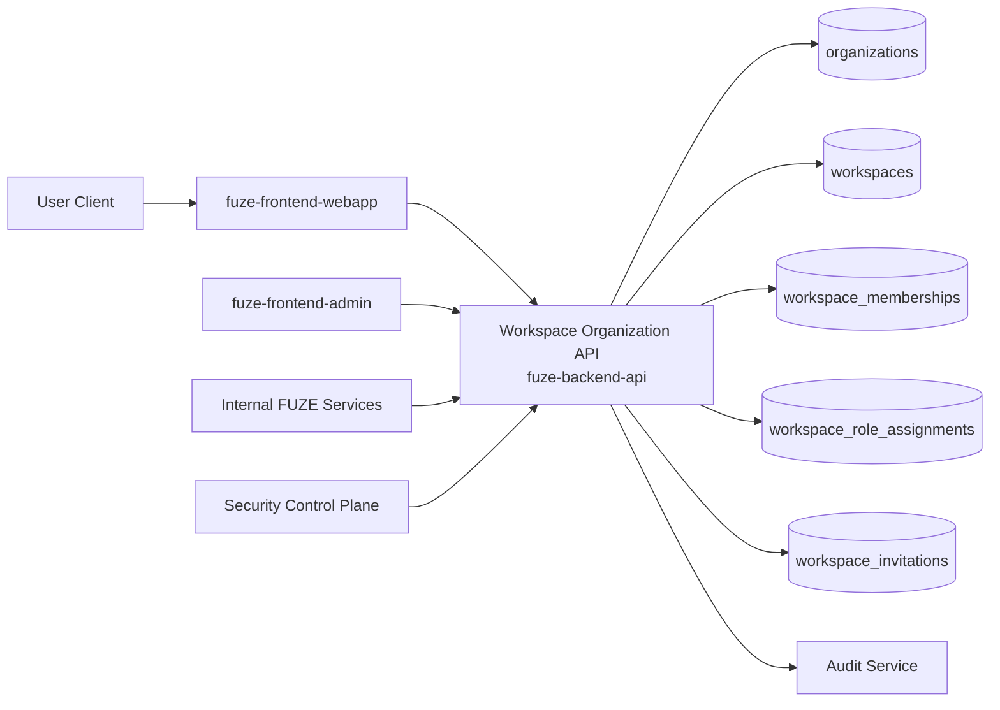
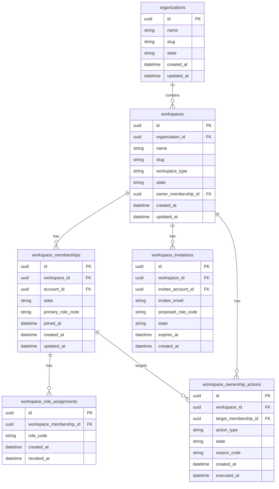
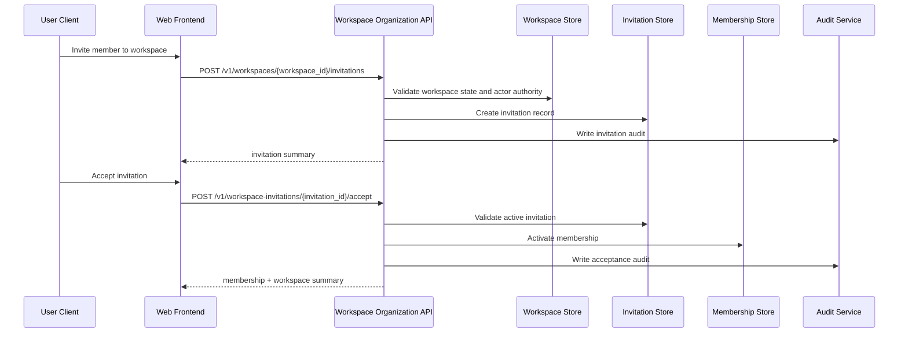

# WORKSPACE_ORGANIZATION_API_SPEC

## 1. Title

**WORKSPACE_ORGANIZATION_API_SPEC.md**

---

## 2. Document Metadata

- **Document Name:** WORKSPACE_ORGANIZATION_API_SPEC.md
- **API Classification:** public, internal, admin, event-driven
- **Owning Domain:** Workspace and Organization Domain
- **Primary Implementing Repo:** `fuze-backend-api`
- **Primary System of Record:** Workspace / organization / membership stores in `fuze-backend-api`
- **Status:** Draft for canonical source-of-truth approval
- **Purpose:** Define the production-grade API contract architecture for workspace, organization, membership, role-assignment, and collaborative account-grouping behavior across the FUZE ecosystem
- **Canonical Folder:** `fuze.ac > docs > api-spec`

---

## 3. Purpose

This document defines the canonical API specification for FUZE workspace and organization operations. It converts the governing FUZE platform boundary, ownership, identity, role/access, audit, and API architecture rules into an implementation-ready API contract.

This API exists because FUZE is not only an individual-user platform. Multiple products and platform services are intended to operate in collaborative contexts where accounts, permissions, billing ownership, product access, and operational actions must be scoped to durable workspace and organization entities rather than inferred loosely from the current user session.

Accordingly, this specification defines how workspaces and organizations are created, how memberships are managed, how role assignments and ownership transitions are handled, how platform and product consumers resolve scope safely, and how collaborative access remains aligned with canonical backend ownership.

---

## 4. Scope

This specification covers:

- workspace creation and update APIs
- organization creation and update APIs where distinct from simple workspaces
- workspace membership invitation, activation, suspension, and removal APIs
- workspace-scoped role assignment and role change APIs
- workspace ownership transfer and billing-owner transition entry points
- workspace selection and current-scope resolution APIs
- internal service APIs for workspace and organization context resolution
- admin/control-plane APIs for corrective membership and scope interventions
- event emission requirements for workspace and membership lifecycle changes
- audit, idempotency, versioning, error, and database-shape rules for this domain

This specification does **not** redefine:

- canonical account identity or session semantics
- product entitlements themselves
- product-owned objects inside QTB, AIMM, ZAGA, AIE, HerHelp, Botmad, or ToolGrid
- credits ledger behavior
- subscriptions and billing semantics in full detail
- payout, treasury, governance, or wallet-holder logic

Those remain governed by their own source-of-truth specifications.

---

## 5. Source-of-Truth Inputs

### Primary FUZE docs and specs used

#### Highest-priority platform and ownership sources
- `SYSTEM_SPEC_INDEX.md`
- `SYSTEM_BOUNDARY_AND_OWNERSHIP_SPEC.md`
- `SYSTEM_OVERVIEW_AND_BOUNDARIES_SPEC.md`
- `PLATFORM_ARCHITECTURE_SPEC.md`
- `DOMAIN_OWNERSHIP_MATRIX_SPEC.md`
- `DATA_MODEL_AND_ENTITY_OWNERSHIP_SPEC.md`

#### Primary workspace / identity / access sources
- `WORKSPACE_AND_ORGANIZATION_SPEC.md`
- `IDENTITY_AND_ACCOUNT_SPEC.md`
- `ROLE_PERMISSION_AND_ACCESS_CONTROL_SPEC.md`
- `AUTH_SESSION_AND_LINKED_LOGIN_SPEC.md`
- `WALLET_AWARE_USER_SPEC.md`

#### API and runtime sources
- `API_ARCHITECTURE_SPEC.md`
- `PUBLIC_API_SPEC.md`
- `INTERNAL_SERVICE_API_SPEC.md`
- `IDEMPOTENCY_AND_VERSIONING_SPEC.md`
- `EVENT_MODEL_AND_WEBHOOK_SPEC.md`
- `MIGRATION_AND_BACKWARD_COMPATIBILITY_SPEC.md`
- `AUDIT_LOG_AND_ACTIVITY_SPEC.md`

#### Security and operations sources
- `SECURITY_AND_RISK_CONTROL_SPEC.md`
- `SECRETS_CONFIG_AND_ENVIRONMENT_SPEC.md`
- `MONITORING_ALERTING_AND_INCIDENT_RESPONSE_SPEC.md`

#### Format guides
- `The_API_Specification_guide.md`
- `Database_Schemas_Guide.md`

### Highest-priority interpretation applied

For this file, the most important governing interpretation is:

1. workspace and organization truth is backend-owned durable collaborative scope
2. workspaces are not frontend conveniences; they are canonical scope entities
3. membership, role assignment, and workspace ownership changes are sensitive backend mutations
4. user identity, workspace scope, and product scope must remain distinct
5. product domains consume workspace context but do not redefine workspace truth
6. admin/control-plane tools may trigger corrective actions but do not own collaborative truth

### Supporting external standards used only as guidance

- HTTP semantics for resource creation, update, conflict, and deletion behavior
- RFC 9457 problem-details style for machine-readable error responses
- standard API security and least-privilege practices

External guidance does not override FUZE source-of-truth documents.

---

## 6. Governing Architecture and Ownership Interpretation

This API belongs to the **Workspace and Organization Domain** because it owns durable collaborative scope and grouping truth across the FUZE platform. Workspace and organization entities determine where collaborative product use, billing relationships, role evaluation, and scoped access decisions occur.

This API is implemented primarily in `fuze-backend-api` because:

- backend owns durable business truth
- workspace scope is canonical platform state, not UI state
- membership and role changes are sensitive multi-actor mutations
- product domains need a trusted shared workspace context service
- admin interventions and audit generation must be backend-governed

This API is **not** owned by:

- `fuze-frontend-webapp`, because frontend only initiates and consumes collaborative-scope flows
- `fuze-frontend-admin`, because admin may trigger privileged changes but must not own workspace truth
- product domains, because products extend platform scope instead of redefining it
- `fuze-contracts`, because workspace and organization truth is off-chain application state
- audit/reporting layers, because they derive from workspace truth but do not own it

### Architectural implications

- one account may belong to multiple workspaces
- one workspace may belong to one parent organization or stand alone according to platform policy
- one workspace has a stable owner/ownership model even if current managers change
- role evaluation occurs within workspace scope
- billing-owner context may align with workspace or parent organization but must be explicit
- product access may depend on workspace membership, but products do not own membership truth
- current workspace selection is runtime context layered on top of canonical membership truth

---

## 7. Domain Responsibilities

The workspace and organization API domain is responsible for:

1. creating and managing collaborative scope entities
2. maintaining workspace and organization metadata
3. managing membership lifecycle
4. managing workspace-scoped role assignments and default access posture
5. managing ownership and billing-owner transitions through controlled APIs
6. exposing scope resolution APIs for first-party and internal consumers
7. enabling safe collaborative operations across FUZE products
8. emitting domain events for workspace and membership changes
9. generating audit records for sensitive collaborative mutations
10. preserving scope clarity between account, workspace, organization, and product domains

The domain is not responsible for:

- canonical account auth/session behavior
- product-object lifecycle
- credits settlement logic
- subscription charging rules
- governance, treasury, or payout lifecycle logic

---

## 8. Out of Scope

The following are out of scope for this API specification:

- product-specific team abstractions that do not become canonical platform scopes
- enterprise legal-entity verification
- detailed invoice and tax ownership semantics
- product entitlement pricing rules
- full billing domain implementation
- wallet ownership or token-holder privilege semantics
- smart-contract or on-chain organizational structures
- external directory-sync implementation details

Where later detailed specs are needed, they must remain compatible with this API.

---

## 9. Canonical Entities and Data Ownership

### Durable entities

#### 9.1 organizations
- **Owner:** Workspace and Organization Domain
- **Purpose:** higher-level grouping entity for one or more workspaces where platform policy allows
- **Nature:** source-of-truth durable entity

#### 9.2 workspaces
- **Owner:** Workspace and Organization Domain
- **Purpose:** primary collaborative execution and access scope across the FUZE platform
- **Nature:** source-of-truth durable entity

#### 9.3 workspace_memberships
- **Owner:** Workspace and Organization Domain
- **Purpose:** account-to-workspace membership binding
- **Nature:** source-of-truth durable entity

#### 9.4 workspace_roles
- **Owner:** Workspace and Organization Domain with access-control integration
- **Purpose:** scoped role assignment within a workspace
- **Nature:** source-of-truth durable entity or canonical join structure

#### 9.5 workspace_invitations
- **Owner:** Workspace and Organization Domain
- **Purpose:** pending membership onboarding and controlled invitation acceptance
- **Nature:** source-of-truth short-lived but durable entity

#### 9.6 workspace_ownership_actions
- **Owner:** Workspace and Organization Domain
- **Purpose:** ownership transfer, billing-owner transition, or sensitive control changes
- **Nature:** durable action records with audit lineage

#### 9.7 workspace_audit_events
- **Owner:** Audit / Activity domain, sourced by Workspace and Organization Domain
- **Purpose:** immutable trail for sensitive collaborative changes
- **Nature:** durable audit records

### Derived or cached entities

#### 9.8 account_workspace_views
- **Owner:** derived read-model layer
- **Purpose:** convenience listing of workspaces an account can access
- **Nature:** derived

#### 9.9 workspace_scope_summaries
- **Owner:** derived read-model layer
- **Purpose:** membership counts, role summaries, product availability signals
- **Nature:** derived

#### 9.10 current_scope_context_views
- **Owner:** derived session-adjacent runtime layer
- **Purpose:** current selected workspace and allowed transitions
- **Nature:** derived runtime view, not canonical membership truth

---

## 10. State Model and Lifecycle

### 10.1 organization lifecycle

Possible states:

- `active`
- `restricted`
- `suspended`
- `archived`

### 10.2 workspace lifecycle

Possible states:

- `provisioning`
- `active`
- `restricted`
- `suspended`
- `archived`

Lifecycle notes:
- newly created workspaces may begin in `provisioning` if downstream setup is async
- only `active` workspaces are normal operating scopes
- `restricted` workspaces remain visible but with limited mutations
- `archived` workspaces are retained for history and administrative reference

### 10.3 membership lifecycle

Possible states:

- `invited`
- `active`
- `suspended`
- `removed`
- `declined`
- `expired`

### 10.4 invitation lifecycle

Possible states:

- `created`
- `sent`
- `accepted`
- `declined`
- `expired`
- `cancelled`

### 10.5 ownership action lifecycle

Possible states:

- `requested`
- `pending_confirmation`
- `approved_if_required`
- `executed`
- `failed`
- `cancelled`

---

## 11. API Surface Overview

The API surface is divided into four families:

### 11.1 Public / first-party user-facing APIs
Used by `fuze-frontend-webapp` and approved clients for:
- creating workspaces
- listing accessible workspaces
- reading and updating workspace metadata
- inviting members
- accepting invitations
- listing memberships
- changing workspace roles within allowed permissions
- selecting current workspace context

### 11.2 Internal service APIs
Used by trusted internal services for:
- resolving account-to-workspace access context
- validating workspace membership and role state
- resolving organization and billing-owner references
- reading durable collaborative scope truth

### 11.3 Admin / control-plane APIs
Used by `fuze-frontend-admin` through backend-only privileged routes for:
- forced membership suspension/removal
- ownership-transfer correction
- invitation invalidation
- workspace restriction/unarchive actions
- emergency scope containment

### 11.4 Event-driven interfaces
Used for downstream side effects:
- audit generation
- notification delivery
- entitlement refresh triggers
- billing-owner synchronization
- product onboarding side effects
- analytics and monitoring

---

## 12. Authentication and Authorization Model

### 12.1 Authentication posture by route family

#### Authenticated user routes
Require valid authenticated session:
- create workspace
- read workspace
- update permitted workspace metadata
- invite members
- accept/decline invitation
- list memberships
- change roles where actor has authority
- transfer ownership where actor has authority
- select current workspace context

#### Internal service routes
Require internal service identity with explicit least privilege:
- workspace access resolution
- role and membership introspection
- billing-owner and organization mapping reads

#### Admin routes
Require privileged operator identity plus reason-coded actions:
- suspend/remove membership
- restrict/unrestrict workspace
- force-cancel invitations
- corrective ownership actions

### 12.2 Authorization checkpoints

Authorization must evaluate:
- canonical account identity
- session validity
- target workspace scope
- actor’s workspace role
- whether target action is sensitive
- whether workspace is restricted/suspended
- whether target membership or role change would violate minimum-owner or safety rules
- whether organization policy constrains the action

### 12.3 Sensitive action rules

The following require heightened checks:
- ownership transfer
- billing-owner transition requests
- admin suspension or removal of a member
- admin workspace restriction
- role changes affecting owner/admin privileges
- invitation cancellation where review context exists

---

## 13. API Endpoints / Interface Contracts

## 13.1 Public / First-Party User APIs

### 13.1.1 `POST /v1/workspaces`
**Purpose:** create a new workspace  
**Caller Type:** authenticated user  
**Auth Expectation:** valid authenticated session  
**Request Body Summary:**
- `name`
- optional `slug_preference`
- optional `organization_id`
- optional `workspace_type`
- optional `billing_owner_mode`
- optional `idempotency_key`
**Response Summary:**
- created workspace resource
- creator membership summary
- current role/ownership summary
**Side Effects:**
- creates workspace
- creates creator membership
- may create default role bindings
- may trigger downstream provisioning events
**Idempotency Behavior:** required for safe retries
**Audit Requirements:** workspace creation audit
**Emitted Events:** `workspace.created`, `workspace.membership_activated`

### 13.1.2 `GET /v1/workspaces`
**Purpose:** list workspaces accessible to current account  
**Caller Type:** authenticated user  
**Response Summary:**
- workspace list
- membership state
- current role summary
- selected/current scope indicator if applicable
**Side Effects:** none
**Audit Requirements:** access logging
**Emitted Events:** none required

### 13.1.3 `GET /v1/workspaces/{workspace_id}`
**Purpose:** read one accessible workspace  
**Caller Type:** authenticated user  
**Response Summary:**
- workspace metadata
- organization linkage
- membership summary
- actor role summary
- state and restriction flags
**Side Effects:** none

### 13.1.4 `PATCH /v1/workspaces/{workspace_id}`
**Purpose:** update workspace metadata within actor authority  
**Caller Type:** authenticated user  
**Request Body Summary:**
- mutable fields such as `name`, `display_name`, `avatar_asset_id`, `settings_patch`
**Response Summary:** updated workspace resource
**Side Effects:** workspace metadata mutation
**Idempotency Behavior:** PATCH should be safe under retry using idempotency key when included
**Audit Requirements:** metadata-change audit
**Emitted Events:** `workspace.updated`

### 13.1.5 `POST /v1/workspaces/{workspace_id}/invitations`
**Purpose:** invite one or more accounts or email identities into a workspace  
**Caller Type:** authenticated user with invite authority  
**Request Body Summary:**
- `invitees[]`
- proposed `role_code`
- optional `message`
- optional `expires_at`
- optional `idempotency_key`
**Response Summary:**
- invitation records
- delivery/status summary
**Side Effects:** creates invitations, may trigger notification workflows
**Idempotency Behavior:** required
**Audit Requirements:** invitation audit
**Emitted Events:** `workspace.invitation_created`

### 13.1.6 `GET /v1/workspaces/{workspace_id}/memberships`
**Purpose:** list workspace memberships  
**Caller Type:** authenticated user with visibility rights in target workspace  
**Response Summary:**
- members
- status
- role assignments
- joined_at
- invitation origin where appropriate
**Side Effects:** none

### 13.1.7 `POST /v1/workspaces/{workspace_id}/memberships/{membership_id}/roles`
**Purpose:** assign or replace role set for a membership within authority rules  
**Caller Type:** authenticated user with role-management authority  
**Request Body Summary:**
- `role_codes[]`
- optional `reason_code`
- optional `idempotency_key`
**Response Summary:** updated membership role summary
**Side Effects:** role assignment mutation
**Idempotency Behavior:** required
**Audit Requirements:** high-sensitivity audit
**Emitted Events:** `workspace.role_assignment_changed`

### 13.1.8 `POST /v1/workspaces/{workspace_id}/memberships/{membership_id}/suspend`
**Purpose:** suspend a membership within actor authority  
**Caller Type:** authenticated user with sufficient authority  
**Request Body Summary:**
- `reason_code`
- optional `idempotency_key`
**Response Summary:** suspended membership summary
**Side Effects:** membership state transition to suspended
**Audit Requirements:** high-sensitivity audit
**Emitted Events:** `workspace.membership_suspended`

### 13.1.9 `DELETE /v1/workspaces/{workspace_id}/memberships/{membership_id}`
**Purpose:** remove a membership within actor authority  
**Caller Type:** authenticated user with sufficient authority or self-removal where allowed  
**Request Body Summary:**
- optional `reason_code`
- optional `idempotency_key`
**Response Summary:** removed membership summary
**Side Effects:** membership state transition to removed
**Special Constraint:** must fail if removal would violate minimum-owner safety rule
**Audit Requirements:** high-sensitivity audit
**Emitted Events:** `workspace.membership_removed`

### 13.1.10 `POST /v1/workspace-invitations/{invitation_id}/accept`
**Purpose:** accept invitation into a workspace  
**Caller Type:** authenticated target account  
**Request Body Summary:**
- optional `idempotency_key`
**Response Summary:** activated membership and workspace summary
**Side Effects:** invitation accepted, membership activated
**Idempotency Behavior:** required
**Audit Requirements:** invitation acceptance audit
**Emitted Events:** `workspace.invitation_accepted`, `workspace.membership_activated`

### 13.1.11 `POST /v1/workspace-invitations/{invitation_id}/decline`
**Purpose:** decline invitation  
**Caller Type:** authenticated target account  
**Response Summary:** declined invitation summary
**Side Effects:** invitation declined
**Emitted Events:** `workspace.invitation_declined`

### 13.1.12 `POST /v1/workspaces/{workspace_id}/ownership-transfer`
**Purpose:** request or execute controlled ownership transfer  
**Caller Type:** authenticated owner or actor with explicit transfer authority  
**Request Body Summary:**
- `target_membership_id`
- optional `transfer_mode`
- optional `reason_code`
- optional `idempotency_key`
**Response Summary:** ownership action record
**Side Effects:** may create pending ownership action or execute transfer
**Audit Requirements:** critical workspace audit
**Emitted Events:** `workspace.ownership_transfer_requested`, `workspace.ownership_transferred`

### 13.1.13 `POST /v1/current-workspace`
**Purpose:** set current selected workspace runtime context for current account  
**Caller Type:** authenticated user  
**Request Body Summary:**
- `workspace_id`
**Response Summary:** selected scope context
**Side Effects:** runtime context selection only; must not mutate canonical membership truth
**Audit Requirements:** access log only
**Emitted Events:** none required

### 13.1.14 `GET /v1/current-workspace`
**Purpose:** read current selected workspace runtime context  
**Caller Type:** authenticated user  
**Response Summary:** current workspace context, actor role summary, switch options
**Side Effects:** none

## 13.2 Internal Service APIs

### 13.2.1 `GET /internal/v1/accounts/{account_id}/workspace-access`
**Purpose:** resolve workspace access summary for an account  
**Caller Type:** internal trusted services  
**Auth Expectation:** service-to-service identity only  
**Response Summary:**
- accessible workspaces
- membership states
- scoped role summaries
- selected/default workspace if applicable
**Side Effects:** none

### 13.2.2 `GET /internal/v1/workspaces/{workspace_id}/context`
**Purpose:** read canonical workspace context for trusted services  
**Caller Type:** internal trusted services with least privilege  
**Response Summary:**
- workspace state
- organization linkage
- billing-owner reference
- restriction flags
- owner membership reference
**Side Effects:** none

### 13.2.3 `POST /internal/v1/workspaces/{workspace_id}/membership-checks`
**Purpose:** verify whether account may perform scoped action in workspace  
**Caller Type:** internal trusted services  
**Request Body Summary:**
- `account_id`
- `required_capability`
- optional `product_context`
**Response Summary:**
- allowed / denied
- evaluated role set
- denial reason
**Side Effects:** none

## 13.3 Admin / Control-Plane APIs

### 13.3.1 `POST /admin/v1/workspaces/{workspace_id}/restrict`
**Purpose:** restrict a workspace for security/compliance/operational reasons  
**Caller Type:** admin/operator  
**Request Body Summary:**
- `reason_code`
- `operator_note`
- optional `notify_owners`
**Response Summary:** restricted workspace summary
**Side Effects:** workspace state transition to restricted
**Audit Requirements:** critical audit
**Emitted Events:** `workspace.restricted`

### 13.3.2 `POST /admin/v1/workspaces/{workspace_id}/unrestrict`
**Purpose:** restore restricted workspace to active state where allowed  
**Caller Type:** admin/operator  
**Request Body Summary:**
- `reason_code`
- `operator_note`
**Response Summary:** updated workspace summary
**Side Effects:** restricted -> active
**Audit Requirements:** critical audit
**Emitted Events:** `workspace.unrestricted`

### 13.3.3 `POST /admin/v1/workspaces/{workspace_id}/memberships/{membership_id}/force-remove`
**Purpose:** privileged forced membership removal  
**Caller Type:** admin/operator  
**Request Body Summary:**
- `reason_code`
- `operator_note`
- optional `notify_account`
**Response Summary:** removed membership summary
**Side Effects:** membership forced removal
**Special Constraint:** minimum-owner safety must still be respected unless emergency-transfer or corrective-owner flow is completed
**Audit Requirements:** critical audit
**Emitted Events:** `workspace.membership_removed`

### 13.3.4 `POST /admin/v1/workspaces/{workspace_id}/ownership-corrections`
**Purpose:** corrective ownership intervention under controlled policy  
**Caller Type:** admin/operator  
**Request Body Summary:**
- `target_membership_id`
- `reason_code`
- `operator_note`
- optional `related_case_id`
**Response Summary:** ownership correction action record
**Side Effects:** may transfer owner role or close unsafe no-owner condition
**Audit Requirements:** critical audit
**Emitted Events:** `workspace.ownership_corrected`

---

## 14. Request Rules

### 14.1 General request rules
- all mutation-capable routes must require JSON requests with explicit content type
- all mutation routes must carry correlation IDs
- sensitive membership, role, and ownership mutations must carry idempotency keys
- admin mutations must require reason codes and operator notes
- no route may accept frontend-owned truth that bypasses backend authorization and validation

### 14.2 Sensitive-action request requirements
The following requests require heightened validation:
- role changes affecting elevated privileges
- membership suspension/removal
- ownership transfer
- ownership correction
- workspace restriction/unrestriction
- invitation cancellation if later introduced as separate route

Heightened validation may include:
- recent re-auth assertion
- owner/admin role confirmation
- minimum-owner check
- workspace state validation
- organization policy validation
- billing-owner safety checks where relevant

### 14.3 Collaborative safety rule
Any request that would leave a workspace without a valid owner or valid controlling authority must fail unless a controlled replacement or corrective path is executed atomically.

### 14.4 Scope integrity rule
Current-workspace selection APIs must never be allowed to manufacture access. They may only select among already authorized workspace memberships.

---

## 15. Response Rules

### 15.1 Success response rules
Successful responses must include:
- stable resource identifiers
- timestamps for created/updated state
- state/status values
- actor role summaries where relevant
- correlation references for mutations

### 15.2 Async-accepted response rules
If workspace provisioning, ownership transfer, or large invitation processing is async, the response must:
- return accepted status
- include action or job ID
- provide follow-up status semantics

### 15.3 Terminal mutation response rules
Terminal mutation responses must clearly show:
- target entity identifier
- resulting state
- whether scope or authority changed
- whether safety checks were applied

### 15.4 Read response rules
Read responses must distinguish:
- durable source data
- derived summaries
- role/capability hints
- product-facing convenience fields that are not canonical truth

---

## 16. Error Model

The API uses structured problem-details style error responses with stable error codes.

### 16.1 Required error fields
- `type`
- `title`
- `status`
- `code`
- `detail`
- `instance`
- `correlation_id`

### 16.2 Common error codes

#### Authorization / permission errors
- `WORKSPACE_SESSION_REQUIRED`
- `WORKSPACE_PERMISSION_DENIED`
- `WORKSPACE_ROLE_ESCALATION_DENIED`

#### State conflict errors
- `WORKSPACE_ALREADY_EXISTS_IN_SCOPE`
- `WORKSPACE_INVITATION_ALREADY_TERMINAL`
- `WORKSPACE_MEMBERSHIP_ALREADY_TERMINAL`
- `WORKSPACE_OWNERSHIP_CONFLICT`

#### Policy / safety errors
- `WORKSPACE_MINIMUM_OWNER_VIOLATION`
- `WORKSPACE_RESTRICTED`
- `WORKSPACE_SUSPENDED`
- `WORKSPACE_ORGANIZATION_POLICY_VIOLATION`

#### Request integrity errors
- `WORKSPACE_IDEMPOTENCY_KEY_REQUIRED`
- `WORKSPACE_REQUEST_INVALID`
- `WORKSPACE_REQUEST_UNPROCESSABLE`

#### Dependency or provider errors
- `WORKSPACE_DEPENDENCY_TIMEOUT`
- `WORKSPACE_NOTIFICATION_DELIVERY_DEGRADED`

### 16.3 Error handling rules
- do not expose internal operator-only details
- do not expose hidden policy internals beyond necessary guidance
- return actionable but bounded explanations
- distinguish not-found from unauthorized where safe
- include retry guidance only where safe

---

## 17. Idempotency and Mutation Safety

### 17.1 Required idempotent mutations
The following mutation routes require idempotent behavior:
- workspace create
- invitation create
- role assignment mutations
- membership suspension/removal
- invitation accept/decline
- ownership transfer
- admin restrict/unrestrict
- admin ownership corrections

### 17.2 Idempotency key rules
- mutation requests must supply `Idempotency-Key` where required
- backend stores key scope, request hash, actor, and terminal result
- replay of same semantic request returns original terminal outcome
- replay of same key with different request body must fail with conflict

### 17.3 Mutation safety rules
- membership state transitions must be monotonic toward terminal states
- invitation acceptance must be single-effective
- minimum-owner checks must be evaluated at commit time
- ownership transfer must not produce dual ambiguous owners unless spec-approved model explicitly allows a temporary pending state
- current-workspace selection must remain runtime-only and not mutate durable membership truth

---

## 18. Versioning and Compatibility Rules

### 18.1 Versioning
This API family is versioned under `/v1`, `/internal/v1`, and `/admin/v1` route families.

### 18.2 Compatibility approach
- additive evolution preferred
- no silent semantic change to lifecycle states or role meanings
- response fields may be added but existing meanings must remain stable
- workspace and organization identifiers must remain stable through compatibility windows

### 18.3 Breaking-change rules
Breaking changes include:
- changing membership state semantics
- changing owner-transfer behavior incompatibly
- removing critical fields from workspace scope responses
- changing meaning of organization/workspace linkage

Such changes require explicit migration planning and version evolution.

### 18.4 Deprecation
Deprecated routes or fields must:
- be documented explicitly
- carry deprecation metadata where supported
- preserve compatibility windows long enough for first-party consumers and future SDKs

---

## 19. Event Emission and Webhook Behavior

This domain is event-capable.

### 19.1 Internal events
The workspace and organization domain must emit canonical internal events such as:
- `workspace.created`
- `workspace.updated`
- `workspace.restricted`
- `workspace.unrestricted`
- `workspace.invitation_created`
- `workspace.invitation_accepted`
- `workspace.invitation_declined`
- `workspace.membership_activated`
- `workspace.membership_suspended`
- `workspace.membership_removed`
- `workspace.role_assignment_changed`
- `workspace.ownership_transfer_requested`
- `workspace.ownership_transferred`
- `workspace.ownership_corrected`

### 19.2 Event payload minimums
Each event should contain:
- event ID
- event type
- occurred_at
- workspace ID
- organization ID if applicable
- membership/invitation/action reference where applicable
- actor type
- correlation ID
- reason code where applicable

### 19.3 External webhook posture
This specification does not expose general third-party webhooks for raw collaborative-scope mutations by default. Future external workspace webhooks, if any, must be narrow, permission-safe, privacy-safe, and governed by a separate contract.

---

## 20. Audit and Activity Requirements

The following actions must generate durable audit events:

- workspace creation
- workspace metadata update where meaningful
- invitation creation
- invitation acceptance/decline
- membership activation
- membership suspension/removal
- role assignment changes
- ownership transfer request and completion
- ownership correction
- workspace restriction/unrestriction
- admin corrective actions

### Required audit fields
- audit event ID
- actor type and actor reference
- workspace ID
- organization ID if applicable
- target membership/invitation/action reference if applicable
- action type
- before/after state summary where applicable
- reason code
- correlation ID
- operator note if operator action
- occurred_at

User-facing activity feeds may show a filtered subset, but audit truth must remain durable and immutable.

---

## 21. Data Model and Database Schema View

### 21.1 `organizations`
- `id` PK
- `name`
- `slug`
- `state`
- `owner_account_id` nullable
- `billing_owner_reference` nullable
- `created_at`
- `updated_at`

**Constraints:**
- unique `slug`
- index on `state`

### 21.2 `workspaces`
- `id` PK
- `organization_id` FK -> `organizations.id` nullable
- `name`
- `slug`
- `workspace_type`
- `state`
- `owner_membership_id` nullable FK -> `workspace_memberships.id`
- `billing_owner_reference` nullable
- `settings_json`
- `created_at`
- `updated_at`
- `restricted_at` nullable
- `archived_at` nullable

**Constraints:**
- unique `slug` within policy-defined namespace
- index on `organization_id`
- index on `state`

### 21.3 `workspace_memberships`
- `id` PK
- `workspace_id` FK -> `workspaces.id`
- `account_id` FK -> `accounts.id`
- `state`
- `joined_at` nullable
- `invited_at` nullable
- `suspended_at` nullable
- `removed_at` nullable
- `primary_role_code` nullable
- `created_at`
- `updated_at`

**Constraints:**
- unique (`workspace_id`, `account_id`) for non-terminal active membership space
- index on `account_id`
- index on (`workspace_id`, `state`)

### 21.4 `workspace_role_assignments`
- `id` PK
- `workspace_membership_id` FK -> `workspace_memberships.id`
- `role_code`
- `assigned_by_actor_type`
- `assigned_by_actor_id`
- `created_at`
- `revoked_at` nullable

**Constraints:**
- unique (`workspace_membership_id`, `role_code`) for active assignments
- index on `role_code`

### 21.5 `workspace_invitations`
- `id` PK
- `workspace_id` FK -> `workspaces.id`
- `invitee_account_id` nullable FK -> `accounts.id`
- `invitee_email`
- `proposed_role_code`
- `state`
- `token_hash`
- `expires_at`
- `created_by_actor_type`
- `created_by_actor_id`
- `created_at`
- `accepted_at` nullable
- `declined_at` nullable
- `cancelled_at` nullable

**Constraints:**
- index on `workspace_id`
- index on `invitee_email`
- index on `state`
- index on `expires_at`

### 21.6 `workspace_ownership_actions`
- `id` PK
- `workspace_id` FK -> `workspaces.id`
- `action_type`
- `target_membership_id` FK -> `workspace_memberships.id`
- `state`
- `requested_by_actor_type`
- `requested_by_actor_id`
- `reason_code`
- `operator_note` nullable
- `created_at`
- `executed_at` nullable
- `closed_at` nullable
- `correlation_id`

### 21.7 `idempotency_records`
- `id` PK
- `idempotency_key`
- `scope_family`
- `actor_reference`
- `request_hash`
- `response_hash`
- `terminal_status`
- `created_at`
- `expires_at`

### 21.8 `audit_log_entries`
Domain-sourced audit records written into the audit domain.

### Normalization notes
- canonical collaborative scope stays in `organizations`, `workspaces`, `workspace_memberships`, and `workspace_role_assignments`
- derived views must not replace canonical membership or owner truth
- invitation records are separate from activated memberships
- role assignments remain separate from membership rows when multi-role support is needed

### Reconciliation notes
- owner-membership reference must always point to an active membership unless workspace is in a controlled corrective state
- invitation acceptance must reconcile one invitation to one terminal membership activation
- role changes and owner transfer must be reconcilable from audit lineage

---

## 22. Architecture Diagram — Mermaid flowchart



---

## 23. Data Design — Mermaid Diagram



---

## 24. Flow View

### 24.1 Happy path — create workspace
1. authenticated user submits workspace creation request
2. backend validates account state and request
3. workspace is created
4. creator membership is activated
5. creator receives owner/admin role according to policy
6. audit event is written
7. workspace-created event is emitted

### 24.2 Happy path — invite member
1. authorized actor submits invitation request
2. backend validates invite authority and workspace state
3. invitation records are created
4. notifications are queued
5. audit event is written

### 24.3 Happy path — accept invitation
1. invited account accepts invitation
2. backend validates invitation state and target identity
3. membership is activated
4. initial role assignment is created
5. invitation becomes terminal accepted
6. audit and events are recorded

### 24.4 Happy path — role change
1. authorized actor requests membership role change
2. backend validates actor authority and target rules
3. role assignments are updated
4. audit event is written
5. role-change event is emitted

### 24.5 Alternate path — ownership transfer
1. current owner initiates ownership transfer
2. backend validates target membership and safety rules
3. ownership action is created or executed depending on policy
4. final owner reference is updated atomically
5. audit and ownership-transfer event are emitted

### 24.6 Failure path — minimum-owner violation
1. actor attempts to remove or demote last valid owner
2. backend evaluates resulting workspace owner posture
3. request is denied with safety violation error
4. no membership mutation occurs
5. audit may record denied attempt where policy requires

### 24.7 Failure and recovery path — compromised member or unsafe workspace
1. operator identifies risk condition
2. admin route restricts workspace or force-removes membership
3. backend writes critical audit
4. workspace state becomes restricted or membership removed
5. downstream services consume updated safe scope state

### 24.8 Retry behavior
- invitation create retries return the same terminal invitation records where possible
- invitation accept retries return the same activated membership result
- ownership transfer retries return the same action result
- restrict/unrestrict retries return terminal workspace state

---

## 25. Data Flows — Mermaid sequenceDiagram



---

## 26. Security and Risk Controls

1. **Scope truth is backend-owned**  
   Frontends and products must never manufacture workspace access.

2. **Least-privilege role evaluation**  
   Membership and role changes must enforce actor authority within workspace scope.

3. **Minimum-owner protection**  
   The system must prevent actions that would leave a workspace without safe controlling authority.

4. **Invitation integrity**  
   Invitation acceptance must validate target identity, token/invitation state, and expiry.

5. **Admin intervention boundaries**  
   Privileged admin corrections require reason codes, audit lineage, and explicit routes.

6. **Restricted workspace precedence**  
   Workspace restriction state overrides ordinary collaborative mutation flows where required.

7. **No product-owned membership truth**  
   Product services may read or verify workspace context but may not own membership truth.

8. **Problem-details discipline**  
   Error bodies must be structured and safe, avoiding exposure of hidden operator data.

9. **Replay resistance**  
   Invitation acceptance, role mutation, and ownership transfer must use idempotency-safe patterns.

10. **Audit immutability**  
   Sensitive collaborative mutations require durable immutable audit lineage.

---

## 27. Operational Considerations

- workspace create and membership resolution are critical platform entry flows and should be highly available
- invitation expiry sweeps must run regularly
- minimum-owner invariants should be checked continuously in reconciliation jobs
- restricted workspaces should remain queryable for audit and admin review
- audit and event pipelines must tolerate downstream degradation without losing canonical workspace outcomes
- monitoring should alert on:
  - spikes in failed invitation acceptance
  - repeated minimum-owner violations
  - unusual admin membership removals
  - unusual ownership corrections
  - workspace restriction spikes

---

## 28. Acceptance Criteria

1. The API preserves the distinction between account identity, workspace scope, organization scope, and product scope.
2. Only `fuze-backend-api` owns workspace and organization truth.
3. One account may safely belong to multiple workspaces.
4. Membership, invitation, and role states are durable and backend-owned.
5. Workspace creation creates valid initial owner/admin membership state.
6. Invitation acceptance is single-effective and idempotent.
7. Role changes require scoped authority.
8. Membership removal is blocked when it violates minimum-owner safety.
9. Ownership transfer is controlled and auditable.
10. Internal service routes are least-privilege and read scope truth safely.
11. Admin routes require reason-coded privileged authorization.
12. Event emissions exist for major workspace and membership mutations.
13. Response and error semantics are stable and machine-readable.
14. Database schema separates canonical scope entities from derived read models.
15. Current-workspace selection remains runtime-only and does not create access.

---

## 29. Test Cases

### 29.1 Positive cases
1. Authenticated user creates a workspace successfully.
2. Creator receives active owner/admin membership.
3. Authorized actor invites a member successfully.
4. Invited account accepts invitation and receives active membership.
5. Authorized actor updates workspace metadata successfully.
6. Authorized actor changes member role successfully.
7. Owner transfers ownership to another active member successfully.

### 29.2 Negative cases
8. Unauthenticated call to create workspace is rejected.
9. Invitation acceptance after expiry returns terminal error.
10. Actor without invite authority cannot create invitation.
11. Attempt to remove last valid owner returns `WORKSPACE_MINIMUM_OWNER_VIOLATION`.
12. Role escalation beyond actor authority is denied.
13. Mutation against restricted workspace is denied where policy requires.

### 29.3 Authorization cases
14. Ordinary member cannot call ownership-transfer route.
15. Normal user cannot call admin restriction endpoint.
16. Internal service without permission cannot read privileged workspace context.
17. Account not belonging to workspace cannot list its memberships.

### 29.4 Idempotency and replay cases
18. Repeating workspace create with same idempotency key returns original workspace result.
19. Replaying invitation acceptance returns same activated membership result.
20. Replaying ownership transfer with same idempotency key returns original terminal action result.

### 29.5 Concurrency cases
21. Two concurrent invitation accept attempts for the same invitation produce one success and one terminal-already-processed outcome.
22. Concurrent owner demotion and owner removal preserve minimum-owner invariant.
23. Concurrent role update and membership removal do not create ambiguous active elevated roles.

### 29.6 Recovery / admin cases
24. Admin restriction moves workspace to restricted state and emits correct events.
25. Admin force-remove removes compromised membership with critical audit lineage.
26. Ownership correction closes unsafe no-owner condition under controlled policy.

### 29.7 Event and audit cases
27. Workspace creation emits `workspace.created`.
28. Invitation acceptance emits `workspace.invitation_accepted` and `workspace.membership_activated`.
29. Ownership transfer emits ownership event and critical audit entry.

---

## 30. Open Questions or Explicit Deferred Decisions

1. Exact organization-vs-workspace hierarchy rules for all customer tiers are deferred.
2. Exact billing-owner synchronization behavior with billing domain is deferred.
3. Exact invitation delivery channels and templates are deferred.
4. Exact enterprise directory-sync behaviors are deferred.
5. Whether some ownership transfers require explicit recipient confirmation is deferred.
6. Exact product-level default role mapping behavior is deferred, provided platform scope rules remain canonical.

---

## 31. Implementation Notes for `fuze-backend-api`

Recommended backend module layout:

```text
modules/platform/
  workspace-organization/
  role-access/
  identity/
  audit-log/
  commerce-billing/
```

Implementation guidance:
- keep workspace and membership truth in one canonical domain service
- keep role evaluation reusable but workspace-scoped
- treat ownership transfer as a domain action, not an ad hoc membership patch
- separate invitation creation from membership activation
- perform minimum-owner checks inside the commit boundary
- emit events only after canonical state commit succeeds
- publish read models from canonical state; do not let read models mutate collaborative truth

---

## 32. Frontend Consumption Notes

### For `fuze-frontend-webapp`
- may create and manage workspaces within granted authority
- may list memberships, invitations, and current workspace context
- must not infer access from cached frontend state alone
- must treat backend workspace context as authoritative
- should clearly surface owner/admin-sensitive actions and safety warnings

### For `fuze-frontend-admin`
- may trigger privileged restriction, removal, and corrective actions only through backend admin APIs
- must require operator reason input for sensitive mutations
- must not directly mutate workspace truth client-side
- should present immutable audit-linked summaries after privileged actions

---

## 33. Contract Derivation Notes

### OpenAPI / AsyncAPI
This spec should later derive into:
- workspace resource operations
- invitation operations
- membership operations
- role assignment operations
- ownership transfer and correction operations
- internal workspace-context operations
- admin restriction/correction operations
- shared problem-details schema
- workspace events in AsyncAPI

### Future `fuze-sdk`
Future `fuze-sdk` packages may derive:
- shared workspace client helpers
- membership management helpers
- invitation flows
- typed role and scope models

The SDK must derive from approved API contracts and must not become the source of truth over this narrative specification.
